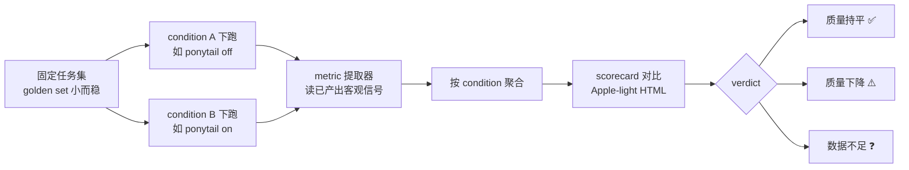

# Exploration: eval — 测量产出质量（通用能力） — FLY-616

**Issue**: FLY-616 ([eval] evaluation — 测量产出质量（通用能力）)
**Date**: 2026-06-28
**Status**: **Decisions LOCKED**（Annie brainstorm 定，2026-06-28；经业界 research → 一个一个 brainstorm。放行写 spec→plan→Codex design review，仍不实现、不开 PR、可拆 sub-issue）

> 本文 = eval v1 的 spec。原为 brainstorm 探索材料，现 Annie 已逐项定向（见 §7 LOCKED）。
> 配套：业界 research 报告 `/tmp/flywheel-FLY-616-eval-research.html`；可执行计划见 plan 文件。

---

## 1. Problem + Framing（Annie 纠正过）

我们经常做『可能悄悄拉低产出质量』的改动：开 ponytail（code-reducer，FLY-615 灰度）、
换模型、换 backend（如 FLY-617 Gemini）。今天判断『质量有没有掉』靠手感、靠人肉看几个
PR —— **不客观、不可重复**。

**framing（Annie 原话）**：

> 『eval 就是做 eval 而已、他只是测量你质量怎么样。』

所以 eval **本身 = 一个独立的「测量产出质量」能力**，它**不关心你为啥测**（省 token /
换模型 / 任何改动都行），只负责回答一个问题：

> **这次改动之后，产出质量有没有掉？**

之前把它框成『省 token ≠ 质量降』是它的**用途**、不是它**本身**。第一个用途是 ponytail
灰度（FLY-615），但这能力对**任何**改动通用。

---

## 2. 最难的一步：什么是『产出』，什么是『质量』

这是 Annie 标记『最难量化』、必过 brainstorm gate 的核心。先把它定义清楚，否则后面全是空中楼阁。

### 2.1 『产出』= Runner 为一个 issue 做出来的东西

在 Flywheel 里，一个 Runner 干完一个 issue 的产出 = **一个 PR**（代码 + 测试 + 文档），
经过 QA + code review + CI。所以『测量产出质量』= 测量 **Runner 产出的 PR 质量**。

### 2.2 『质量』= 一组可测信号，分档（关键设计）

质量不是单一数字。按『可量化程度 + 成本』分两档，**v1 只做第 0 档**（Cass 的简化思路：
先用可量的，主观后说）：

**Tier 0 —— 客观 / 便宜 / pipeline 已经产出（v1 范围）**

| 信号 | 含义（『质量』的哪一面） | 来源（已存在） |
|---|---|---|
| **task success** | 真做出来了没（completed vs blocked/failed） | StateStore `teamlead.db` sessions.decision_route / status |
| **QA verdict** | 独立 QA 过不过（FLY-579 auto-QA / QA 框架） | QA 报告 / session_events / land-status |
| **CI health** | build + tests + lint 绿不绿（代码层面『真能跑』） | `gh pr checks` / land-status.json |
| **iteration cost** | 第一次就做对的程度（review 轮数 + QA 返工次数；越少质量越高） | comm.db gate/QA rounds / session_events |
| **diff economy**（报告项，非门） | 改了多少行 / 碰了几个文件 vs 任务体量 | `gh pr diff --stat` |

> **为什么 diff economy 只是『报告项』不是『门』**：它跟 ponytail（code-reducer）直接相关，
> 但『改得少』≠『质量高』—— 改太少可能漏 case。所以摊出来给人看，不拿它当通过/失败判据。

**Tier 1 —— 主观质量（v1 deferred，schema 留槽）**

- LLM-judge 按 rubric 给 diff/PR 打分（正确性深度、测试质量、可读性）。机器初筛，
  **Annie 定线**（完全沿用 FLY-599 humanness 的做法：机器初筛 + founder sets the bar）。

### 2.3 一句话定义（推荐给 Annie 确认）

> **产出质量 = 一个 condition 下，Runner 对一组固定任务的产出在 {真做出来、QA 过、CI 绿、
> 返工少} 这几个客观信号上的综合表现；主观好坏后续再加。**

---

## 3. eval 的形状：把 FLY-599 泛化

FLY-599 已经做过一个**具体**的 eval 测试台（`scripts/qa-fly-599/`，独立 QA），它的结构正好
是 FLY-616 要的模板，只差『泛化』：

| FLY-599（单实例 bench） | FLY-616（通用能力） |
|---|---|
| variant A/B/C（只变 discord-reply contract 这一个变量） | **condition**（ponytail off/on、换模型、换 backend——你改了什么）|
| 漏发率（读 transcript JSONL 客观判定，纯函数 + 12 单测） | **客观质量指标**（读 pipeline 产物：QA/CI/route/返工）|
| 人性化（机器初筛 + Annie 定线） | **主观产出质量**（v1 deferred，schema 留槽）|
| `scorecard.mjs`（A/B/C 对比 → Apple-light HTML + winner + verdict） | **通用 scorecard**（condition 对比 + verdict 持平/下降/数据不足）|
| `leak-classify.mjs`（读产物→判定，纯函数核心 + 单测） | **metric 提取器**（读产物→指标，纯函数 + 单测）|

**核心结构（eval run）**：

---

## 4. 范围选项（v1 做多少）—— 给 Annie 的关键决策

『测量 + scorecard』这层一定要做。分歧在『执行（跑任务）那层 v1 要不要一起做』：

### Option A（推荐）：v1 = 纯『测量 + scorecard』层，不造执行编排器

- eval 只**消费已经产出的信号**：你用现有 pipeline / 529 slot 框架把任务在某 condition 下
  跑完（每跑打个 condition 标签），eval 负责**提取指标 + 聚合 + 对比 + 出 scorecard + 给 verdict**。
- **最 boring、最省**：不重复造 runner-spawner（529 slot 框架已经能起真 runner）。
- 完全够 FLY-615 ponytail 灰度第一用：A=off 跑一遍、B=on 跑一遍、出对比。
- 执行编排（自动『起 N 个 condition-A run + N 个 condition-B run』）= **follow-up**，需要再做。

### Option B：v1 = 测量 + 一个薄执行器（自动按 condition 跑固定任务集）

- 多一层：自动 spawn 任务集 × 每个 condition。
- 更『一键』，但跟 529 slot 框架重叠、更贵、更大。违反『先做最简可量的』。

### Option C：完全从零建一个独立 eval 框架

- 明确否决：违反 Cass『别从零建、复用 QA 框架』+ CLAUDE.md『enforce simplicity』。

**推荐 Option A**：v1 把『测量产出质量』这个能力的**核心（可量化 + 可重复 + 可对比）**做出来、做扎实
（纯函数 metric 提取 + 单测 + scorecard），执行借现有 529 框架；编排留 follow-up。

---

## 5. 落点（推荐）

- `packages/qa-framework/eval/`（复用 QA 基建：它已有 QA config loader + 5 步协议 + 529 slot 框架）。
- 形态：薄 lib（metric 提取，纯函数）+ CLI（读产物→指标 JSON）+ scorecard（沿用 FLY-599 模式）+ 单测。
- 与 FLY-599 的关系：FLY-599 是『单实例』，FLY-616 把 scorecard / 对比 / 指标提取**泛化成可复用**；
  FLY-599 的 `scorecard.mjs` 是直接可借的母版。

---

## 6. 第一个用途：FLY-615 ponytail 灰度

- condition A = ponytail off，condition B = ponytail on。
- 同一组 golden 任务在 A / B 各跑一遍 → eval 出 scorecard：
  - task success / QA / CI 有没有掉？（质量持平的硬信号）
  - diff economy 有没有按预期变小？（ponytail 的目标，作为报告项看）
- verdict：质量持平且 diff 变小 → ponytail 灰度可推；质量掉了 → 别推。
- **但 eval 不绑 ponytail**：换模型 / 换 backend（FLY-617 Gemini）同一套直接用。

---

## 7. Annie brainstorm 决策（LOCKED，2026-06-28）

> 经业界 research → Annie 一个一个 brainstorm 定。以下为最终方向，plan 按此写。

**① 测什么（质量定义）**：v1 客观信号 = `{QA 过不过 / CI·build·tests / 返工轮数 / completion route}`。
- 主观（优雅 / 可维护 / 真解决）= **明确下一阶段**：LLM-judge 先跟人工校准 ≥80% + 人工抽查。
- `cost / diff economy`：**不在 Annie 的质量信号清单里**。按 Annie『eval 测质量』framing，cost/diff =
  scorecard 的 **context 报告项（不进质量 verdict）**——ponytail A/B 仍能看到「省成本 + 质量持平」，
  但 verdict 轴纯质量。schema 设计成 cost 可升级为有独立 verdict 的第二轴（若日后要）。〔已非阻塞 flag 给 Lead〕

**② 机制**：一个 **condition-agnostic 的 scorecard + 对比层**。第一用途 = **ponytail A/B**。
v1 = **小控制对照集（3–5 个代表任务、跑两遍）**拿干净初步信号；自然对照（per-issue 标签、生产 run）之后累积。

**③ 判定『持平 vs 掉了』**：Annie 倾向 **(b) 摊数字 + 她定线**（小样本噪声大、**不设硬数字门**）。
具体阈值方法学 Annie **让我跟 Codex 讨论敲定**（她不确定哪个更好，交给 runner + Codex）。见 plan 的阈值方法学节。

**④ 复用**：现有 **QA 框架 + FLY-599 scorecard 模式**，别从零建。

**流程**：spec(本文) + plan → Codex design review（阈值那块重点跟 Codex 过）→ present 给 Lead + Annie 过目 → 才 implement。**不开 PR、可拆 sub-issue。**

---

## 8. 不做什么（明确边界）

- v1 不做主观 LLM-judge（留槽，follow-up）。
- v1 不造执行编排器（借 529）。
- v1 不设数字 SLA 门（小样本，给人定线）。
- 不碰生产（沿用 529 隔离铁律）。
