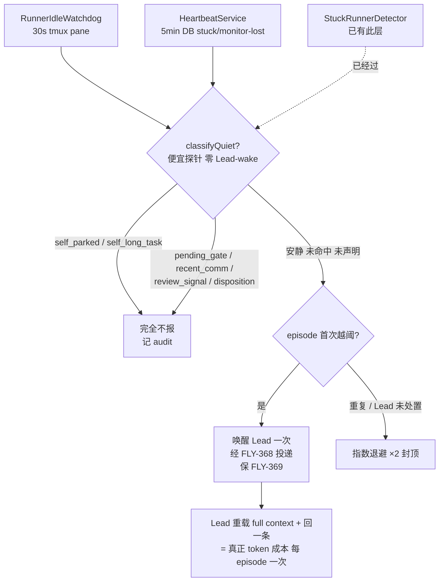

# Exploration: token-frugal state-aware stall 看门狗 — 不识别『有意停泊 / 长任务』反复唤醒 Lead 烧 token — FLY-626

**Issue**: FLY-626 ([token] stall 看门狗反复唤醒 Lead 烧 token — 不识别『有意停泊』的 runner)
**Date**: 2026-06-27
**Status**: 方向已定（brainstorm 过）— Q1 + Q2 都锁。下一步 = 具体 plan（`doc/engineer/plan/draft/`）→ Tadashi 带去 Annie 过 → codex design review → implement。本 doc = brainstorm/决策记录，不含实现代码。
**Brainstorm gate**: Tadashi 确认 **Q1**（共享 quiet-aware 压制层 + 与 FLY-623 共用判断）。**Annie 拍 Q2 = A（park-alive）**：留住停泊 runner 的上下文/内存，她接受、不 kill。Annie 的设计方向（她 brainstorm 定）：正经设计 ≠ 单纯降频（那是 FLY-628 止血），而是 **state-aware + 便宜探针先判 + backoff**：①便宜探针先判（终端动没动 / 停在输入框 / 有意停泊 marker，几乎不花钱）②有意停泊→不叫 Lead（顶多静默记一笔），真卡→才叫 ③同 runner 指数 backoff。**目标：responsiveness 不掉（她说现在抓得准、效果不错），但停掉为「在等的 runner」反复烧 Lead token。**
**一条线（别重复造）**: FLY-628（降频止血 band-aid，PR #372，本 issue 取代它）/ FLY-623（重启心跳重连）/ FLY-368（统一 alert 频道 + auto-fix bot）。本 issue 只做「便宜判断 + 压制 + backoff + 声明契约」，alert 投递走 FLY-368、重启重连走 FLY-623。

---

## 1. 困扰（Annie 2026-06-27）

一个『idle 但还活着』的 runner 会被 stall 看门狗每隔几分钟唤醒 Lead 一次 → Lead 每次重载整段 context + 回一条 = 烧 token。本周额度本就紧张（剩 ~11%）。

实例：LEARN-138 的 research runner harness 是『完成=退出』、没有『完成但还活着』模式。Asha 想让它留活给 iterate，但留活 → 看门狗反复唤醒她（Lead）→ 只好让它先收工。

**真正费 token 的不是 idle runner**（它 idle、不产 token、很便宜），而是 **看门狗 → 唤醒 Lead** 这一下（Lead 重载 full context + 回一条）。所以本 issue 的北极星 = **把『唤醒 Lead』当成稀缺资源来花**。

---

## 2. 诊断 —— 审计到的真相（三套并行看门狗）

`packages/teamlead` 里实际有 **三套** 独立的 stall/idle 监控，各发各的 Lead 唤醒事件：

| # | 系统 | 文件 | 触发 | 发的事件 | parked-aware? |
|---|------|------|------|----------|---------------|
| 1 | **RunnerIdleWatchdog** | `RunnerIdleWatchdog.ts` | 每 30s 抓 tmux pane；pane 分类 waiting ≥ N cycles（~90s）/ idle / unknown | `runner_idle_detected` → 唤醒 Lead | ❌ **无** |
| 2 | **HeartbeatService** | `HeartbeatService.ts` | 每 5min 查 DB；`last_activity_at` > 15min → stuck；`heartbeat_at` > 60min → orphan（force-fail）；FLY-172 monitoring-lost | `session_stuck` / `session_orphaned` / `session_monitoring_lost` → 唤醒 Lead | ❌ **几乎无**（只靠 `status='running'` 过滤天然排除 awaiting_review） |
| 3 | **StuckRunnerDetector** | `stuck-runner-detector.ts` + `stuck-candidate.ts` + `stuck-escalation.ts` | 复用第 1 套的 30s 抓屏；输出停滞 ≥ 10min | `runner_stuck_escalation` → Lead；Q7 fallback → Annie | ✅ **有** |

### 关键

只有 **第 3 套（StuckRunnerDetector，FLY-195/253）** 有「有意停泊」识别。它在唤醒 Lead 之前先过一组**便宜硬闸**豁免 parked runner（`stuck-candidate.ts::evaluateStuckCandidate`）：

- `not_running` — 非 running 状态一律不算
- `parked_review_status` — `awaiting_review` / `approved_to_ship`（FLY-191 idle-but-reachable）
- `pending_gate` — CommDB 里有未答 gate / `flywheel-comm ask`（合法停泊等人）
- `recent_comm_activity` — FLY-253 L1：30min 内给 Lead 发过 comm 消息（机械上活着）
- `pending_review_signal` — 灰区：已发 needs_review 但 status 没翻
- Lead 写的 disposition（`legitimate_wait` / `needs_founder` / `snooze`）

`stuck-candidate.ts` 开头逐字写着 **"Design (set by Annie's brainstorm)"** —— 这层哲学是 Annie 定的、已祝福。**问题：反复唤醒 Annie 的第 1、2 套完全绕过了这层。** 干完活留活的 runner，pane 显示 waiting/idle、DB last_activity 变旧 → 第 1 套每次 pane 重进 waiting 就再发一次唤醒（episode dedup 在 pane 抖动时被清）、第 2 套也发 session_stuck。

> 而且第 1、2、3 套都**没有「长任务」维度**：一个跑 40min codex review / 大 build / 长 research 读取的 runner，pane/DB 长时间不动 = 看起来像卡住，照样唤醒 Lead。这正是 Tadashi 点的 ②。

---

## 3. 根因

看门狗**分不清三种「fine-but-quiet」（有意停泊 parked / 长任务 long-task / 等 gate）和真卡住** → 对本来没事的 runner 反复唤醒 Lead。看门狗存在的理由是对的（[FLY-369] 防 runner 卡住没人发现），问题是第 1、2 套**太笨 + 太贵**：用一次 full-context LLM 唤醒去查一个本可便宜判断的事，而正确的便宜判断**第 3 套已经写好了、却没被复用**，且**长任务这条没人覆盖**。

---

## 4. 已锁定 / 待定

| | 内容 | 状态 |
|---|------|------|
| **Q1** | 626 做共享 quiet-aware 压制层；623 做重启重连；两 issue **共用一套判断** | ✅ Tadashi |
| **方向** | token-frugal 四原则 ①②③④ + runner 自声明状态契约；便宜探针先判、responsiveness 不掉 | ✅ Tadashi + Annie |
| **Q2** | done-but-alive 体验 = **A（park-alive）** —— 留住停泊 runner 上下文/内存，Annie 接受、不 kill | ✅ **Annie 拍** |

---

## 5. 设计 —— token-frugal 四原则怎么落

核心一句话：**在「唤醒 Lead」这件贵事之前，先用便宜信号判掉所有 fine-but-quiet 的情形；判不掉的也只叫一次 + 退避，绝不反复。**

### 原则 ① parked / 等 gate → 不报（复用第 3 套已有便宜闸）

抽出一个**共享纯判断 + 便宜探针**，让第 1、2 套在唤醒 Lead 之前都先过（第 3 套已经过了）：

```
便宜探针（已存在，复用，零 Lead-wake）：
  probeCommSignalsFromCommDb(execId, project) → { hasPendingGate, hasRecentOutbound }   // stuck-escalation.ts
  hasPendingReviewSignal(session)              // decision_route / 近期 session_completed
  getDispositionRows(execId)                   // StateStore stuck_dispositions
  isSelfDeclaredState(execId)                  // 新增，见 §6（parked / long-task 声明）

共享纯判断（抽自 stuck-candidate.ts 硬闸）：
  classifyQuiet(session, signals, dispositions, declared) → QuietReason | null
    not_running | parked_review_status | pending_gate | recent_comm_activity
      | pending_review_signal | lead_disposition | self_parked | self_long_task
```

命中任一 → **不发唤醒事件**，记 audit 原因（可观测，不丢 FLY-369 的发现能力——见 ③）。

### 原则 ② 长任务 → 不报 / 拉阈值（新维度）

「长任务」= runner 正在干一件**合法地长时间不产 pane/DB 活动**的事（长 codex review、大 build、长 research 读取、大下载）。两种来源：

- **显式声明（主路径）**：runner 用 `flywheel-comm busy`（§6）声明「我在长任务，预计 ~N 分钟没动静」→ 看门狗对它**把阈值拉到声明窗口**（或在窗口内完全不报），窗口过了恢复正常阈值再判。
- **便宜自动推断（兜底，可选）**：某些长任务有便宜可识别 marker —— 比如正在跑的 `await-codex-gate` / codex companion review（CommDB / marker 可查）。能便宜认出来的就当 long-task 处理，认不出的靠显式声明 + ③ 兜底。

> 取舍：纯靠声明要 runner 自律（harness 记得声明）；纯靠推断脆弱（marker 易漂）。**主路径=显式声明，兜底=③ backoff**，graceful degrade。

### 原则 ③ backoff —— 保 FLY-369，别永久静音

对 **「安静但没命中任何便宜闸、也没声明」** 的 runner（可能真卡住）：**不永久压制**。

- 首次越过阈值 → 照常报**一次**（保留 FLY-369 发现能力）
- 同一 runner、同一停滞 episode、Lead 没处置 → **指数退避**：间隔 ×2 逐步拉长，封顶（如 30min → 1h → 2h → 封顶 4h）
- runner 有真进展 / 翻状态 / 发 comm / 声明状态 → 清退避计数，回到原点

### 原则 ④ 升级只叫 Lead 看一次

每个 stall episode 对 Lead **最多一次主动唤醒**（"看一眼这个 runner"），不是反复 ping。这其实就是第 3 套已有的 per-episode `escalated` dedup 语义 —— 本 issue 把它**统一到第 1、2 套**（它们现在的 dedup 在 pane 抖动 / 时间戳刷新时会被清掉 → 反复 re-fire，正是病根）。

- episode 定义 = 一段连续的 fine-but-quiet；runner 真动了 / 翻态 → episode 结束。
- 一个 episode 内：命中便宜闸 → 0 次唤醒；判不掉 → 1 次唤醒 + 之后 backoff。
- alert 投递路径 **走 FLY-368 的统一 alert 频道**，不另造。

---

## 6. Runner 自声明状态契约（Tadashi 点名的核心）

让 runner 能**便宜地告诉看门狗自己的意图**。一个统一的轻量声明，写一个便宜 marker（CommDB 行 / session 字段），predicate 读它：

| 状态 | 含义 | 声明方式（草案） | 看门狗行为 |
|------|------|------------------|-----------|
| `working`（默认） | 正常干活、产出/心跳 | 不声明 = 默认 | 正常阈值 |
| `parked` | 干完一单、有意 idle 等 Lead/founder 再点（done-but-alive） | `flywheel-comm park [--reason] [--until]` | **完全不报**，直到 unpark / 有真活动 / 翻终态 |
| `long-task` | 在干合法长任务、预计 ~N min 没动静 | `flywheel-comm busy --task <desc> [--expect <dur>]` | **阈值拉到 expect 窗口**（或窗口内不报），过期恢复正常 |

设计要点：
- **一个 marker、两种状态**：写 CommDB（已是 runner↔Lead 的真相通道，第 3 套也读它）→ 跨 Bridge 重启可存活、与 FLY-623 重连天然兼容。
- **隐式信号继续兜底**：`pending_gate` / `recent_comm_activity` / `awaiting_review` 这些 runner **不用显式声明**就已经被便宜闸豁免（覆盖大多数常见停泊）。显式声明只补两个隐式信号盖不住的洞：**done-but-alive（无 pending gate 的有意 idle）** 和 **长任务（pane/DB 静默但在干活）**。
- **自动过期 / 自愈**：`--until` / `--expect` 到点自动失效；**Lead/founder 重新派活**（`flywheel-comm send` 给该 runner）清声明、显式 `unpark` 亦清 → 不会「声明了 parked 就永久隐身」（避免 FLY-369 回归；实现见 PR commit `2fd3cf50`，Codex code #1）。orphan/tmux liveness reap 全程生效，死的 parked runner 仍被 reap。
- **谁能声明**：只有 runner 自己（写自己 execId 的 marker），不接受外部冒名（execId 由 runtime 派生，沿用现有 comm 鉴权）。

> 与 Q2 的关系：`long-task` 声明**与 Q2 无关、必做**（长任务维度 Tadashi 直接要）。`parked` 声明 = Q2-A 的承载；若 Annie 选 B（干完就退、派新 runner），则 `parked` 声明可不做，本 issue 收敛为 ①②（long-task）③④ + 隐式闸。

---

## 7. Q2 = A（park-alive）—— Annie 已拍

**选 A：park-alive + 声明** — runner 干完用 `flywheel-comm park` 留活，看门狗不吵，Lead/founder 用现有 `flywheel-comm send` 唤它继续 iterate，**保留 in-session 上下文/记忆**（Annie 接受这份内存成本、不 kill）。成本：新增 park 子命令 + marker + predicate 一闸（§6）。直击 Asha 痛点。

> 被否的 B（干完就退、iterate 派新 runner，丢 in-session 记忆）= **已排除**。Annie 要的就是「留住上下文」这个体验。

---

## 8. 与 FLY-623 / FLY-368 的边界（别重复造）

| | FLY-626（本 issue） | FLY-623（姊妹） | FLY-368 |
|---|---|---|---|
| 关注 | 没识别 fine-but-quiet（parked/长任务/等gate） | **重启**后没重连 heartbeat → 孤立 | 统一 alert 频道 + auto-fix bot |
| 交付 | 共享 `classifyQuiet` 便宜判断 + 接两套看门狗 + backoff + 自声明契约 | 重启时重连 / re-heartbeat 在飞 runner + monitoring-lost 显式态 | alert 集中投递 + nudge/fix/report |
| 复用关系 | 提供共享判断 | **用** 626 的共享判断；626 的 marker 跨重启存活与之兼容 | 626 的「一次唤醒」**走** 368 的投递路径，不另造 |

626 = 便宜判断 + 压制 + 声明；623 = 重连；368 = 投递。三者用同一套便宜判断、同一条 alert 路径。

---

## 9. 流程（设计后）



---

## 10. Open questions

1. **Q2（Annie）**：done-but-alive 走 A 还是 B？（决定 §6 `parked` 声明是否做）
2. 声明 marker 落点：CommDB 新行 vs session 字段 vs 复用 disposition 表 —— 技术细节，Codex review 把关。
3. backoff 曲线具体值（起点/倍率/封顶）、long-task 默认 expect 窗口 —— 技术细节。
4. 共享 `classifyQuiet` 放哪（teamlead 新模块 vs 扩 `stuck-candidate.ts`）—— 技术细节。
5. `session_monitoring_lost`（FLY-172）是否本 issue 一并接 predicate vs 留给 623 —— 倾向本 issue 接（同 predicate 零额外成本），听 Tadashi。

## 11. Non-goals / 注意

- 不动 FLY-369 的「真卡住要被发现」保证（③ 保留首次告警，绝不永久静音；声明都有过期/自愈）。
- 不删 / 不重写 StuckRunnerDetector（第 3 套已对）—— 只抽出判断共享。
- 不另造 alert 投递（走 FLY-368）、不另造重启重连（走 FLY-623）。
- 字节兼容：`classifyQuiet` 未命中任何闸 + 无声明 → 行为=现状（照走原唤醒路径），便于 reverse-compat sentinel。
- 范围纪律：只接反复唤醒的两套看门狗 + 抽共享判断 + 声明契约，不顺手重构相邻系统。
