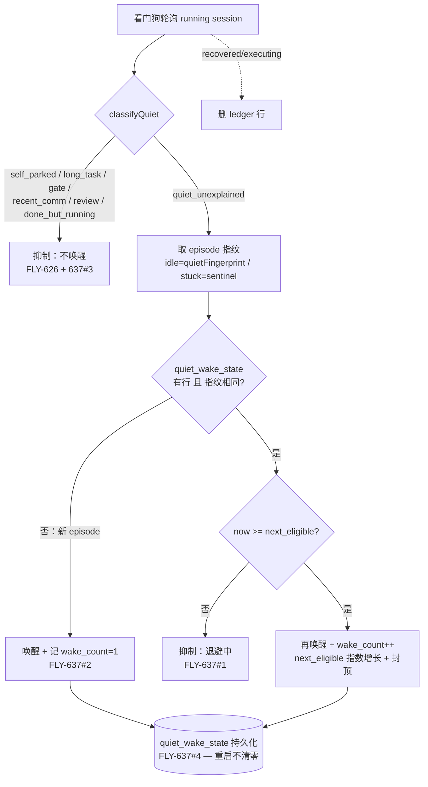

# Exploration: 看门狗 deferred ③ — 指数退避 + normalized fingerprint 接线 + 显式 FLY-324 skip + quiet_state registry — FLY-637

**Issue**: FLY-637 (FLY-626 follow-up — 看门狗 deferred ③)
**Date**: 2026-06-28
**Status**: Direction LOCKED（2026-06-28，Annie 拍 A）— 进入正式 plan + Codex design review
**基于**: FLY-626（已 ship MVP，PR #374）、FLY-636（QA PASS）

---

## 🔼 范围扩展（2026-06-29，Annie 决定 directly extend 637，不开 follow-up）

direction A（report-once）**已 ship 在 PR #386**。Annie 决定把它**升成带升级的看门狗**：runner 卡住时判断「等谁」+ 该不该催。审完 codebase 后锁定的设计（详见 `doc/engineer/plan/draft/v1.59.0-FLY-637-ext-lead-pending-escalation.md`）：

- **「等谁」= 看 pending 问题的 checkpoint 类型**（approve_to_ship/brainstorm = founder-facing；question/裸 ask = lead-facing）。系统**没有**「lead 转没转 founder」的 marker，也**不需要**加（Tadashi 确认 checkpoint type 本身就是信号，ad5af46f 提的 marker 想法多余）。
- **真 gap 只有一条**：runner 用 ask/question 问 Lead、Lead 坐着没答 —— 现在被 FLY-626 classifier + FLY-195 当 `pending_gate` 整个豁免、没人催。**两件已有的不重建**：founder-facing gate 交 **FLY-605**（10min 没答自动 @founder）、画面冻死交 **FLY-195**（升 Lead → Q7 页 Annie）。
- **升级规则 ③**（Tadashi Q2 + Annie 87518d71 backoff）：lead-pending + 没进展 → **指数退避催 Lead**（卡了催一次、没处理等 2× 再催、4×…，不固定刷屏）→ 催 N 轮 Lead 还不动 → **兜底页 Annie 一次**（复用 FLY-195 Q7 安全网，Tadashi Q2）。founder-pending + 没进展 → **静默**（她睡/没看，醒了会回，FLY-605 已贴 thread）。
- **指数退避复活**：本探索文档 §3 原本就有 backoff（next_eligible/退避），direction A 砍了；现在 extend 正好用它管 lead-pending 升级的节奏（Annie 87518d71）。
- 阈值默认（Annie HTML review，可调）：起点 10min、退避 ×2 封顶 ~2h、第 3 轮（~70min）页 Annie。保留 direction-A report-once 底座；不进当前 ship 批次；PR #386 上扩。

---

## ✅ 方向已定（2026-06-28，Annie 经 Tadashi 拍板）

- **走 A：只报一次 + 3 件小事**，**砍掉**指数退避 + 重账本（§4 决策 1 选 A）。
- FLY-369（防真卡死没人管）的安全网 = **现成的两件**：每日 standup 已把还卡着的 runner **整批列一次**（`aggregateStandup` → `getStuckSessions`，便宜、不逐个唤醒）+ **60min 无心跳 auto-fail**（`reapOrphans`）。不需要退避机制再造。
- **FLY-637 缩成 3 件小事**：① 显式跳过「干完但还活着」(FLY-324 skip) ② 画面指纹去抖动 (normalized fingerprint 接进 dedup) ③ 把「已报过」存进数据库（防 Bridge 重启重报）。
- **Annie 的加分点（必须写进方案）**：「看门狗必须截屏吗？有没有更便宜的？」→ 把**便宜文字指纹判活优先、贵的细看只当 fallback** 写清楚，并**诚实标出**：文字指纹判活够不够、哪些 case 还非得「细看」。详见下方 §7（诚实评估）。
- **优先级**：排在这波 bug（FLY-639 / 638 / 630）之后，不急（Annie 说是细化）。
- 现在产出正式 plan + 走 Codex design review；**Codex 过 + Lead 放行后**才 implement，**不开 PR**。
- 下方 §3 的「指数退避 / next_eligible / 重账本」属于**被否决的 B 方案**，保留作记录；正式 plan 以 §6/§7 为准。

---

## 0. TL;DR（给 Annie 的一句话）

FLY-626 已经止住了「反复唤醒烧 token」的**主要出血点**（有意停泊的 runner = 0 唤醒；真正没解释的安静 = 恰好报 1 次）。FLY-637 是把剩下四个**精细化**补齐：让「报 1 次」在 runner 持续冻结时变成**保守的指数退避再升级**（而不是永远静默），让**状态栏/spinner 抖动**不再伪造「新一轮」去重新唤醒，**显式**跳过「干完了但进程还活着」的 runner，并把退避状态**持久化**到 StateStore 让 Bridge 重启不再清零。

**这一条不阻塞、不紧急、纯 refinement。** 但它碰了「看门狗什么时候该再升级一个卡住的 runner」这个判断 —— 所以先把方案画清楚请你拍方向。

---

## 1. 背景：为什么会有这条

看门狗（stall watchdog）存在的理由是 **FLY-369**：防止一个 runner 真卡死了没人发现。问题在于它**太笨 + 太贵** —— 分不清「有意停泊 / idle-by-design / 等 founder 批」和「真卡住」，对本来没事的 runner 也用一次 **full-context LLM 唤醒**去查一个本可便宜判断的事。每次唤醒 Lead = 重载整段 context + 回一条 = 烧 token。

FLY-626 已经做了 state-aware + cheap-probe。FLY-637 补齐 backoff + fingerprint + 持久化这三块「设计 ③ 的尾巴」。

---

## 2. 边界：FLY-626 已做 vs FLY-637 要做

### 2.1 涉及的两个看门狗（都在 `packages/teamlead`）

| 看门狗 | 发的事件 | 触发条件 | 有没有 pane 截图？ |
|---|---|---|---|
| `RunnerIdleWatchdog` | `runner_idle_detected` | tmux 截图判定 status=waiting/idle/unknown 超阈值 | **有**（`statusQuery.query` 返回 `output`） |
| `HeartbeatService.checkStuck` | `session_stuck` | DB 里 `last_activity_at` 超阈值没动 | **没有**（纯读 DB，不截 pane） |

> 注意：**不碰** `StuckRunnerDetector`（FLY-195，自带 raw-fingerprint episode + 持久 `stuck_dispositions`）和 **orphan 强杀 / monitoring-lost**（heartbeat + tmux liveness 拥有）。FLY-626 明确写了「不 subsume FLY-195」，FLY-637 延续这个边界。

### 2.2 ✅ FLY-626 已 ship（PR #374，已在 main）

- `classifyQuiet(signals)` —— **无状态**的便宜分类器。从便宜信号（CommDB / StateStore 读 + runner 自声明 marker）回答一个问题：这个安静**有没有被合法解释**？
  - 已覆盖的「不唤醒」verdict：`self_parked` / `self_long_task` / `pending_gate` / `recent_comm` / `review_signal` / `parked_review_status`。
  - 唯一可能唤醒的：`quiet_unexplained`（`mayWake=true`）。
- `flywheel-comm declare-state park|busy|unpark` —— runner 自声明 park（done-but-alive，可无限期）/ busy（有界长任务，默认 60m、硬顶 4h），写进 CommDB `runner_declared_states`，重启存活。
- 两个看门狗在唤醒**前**先 consult `classifyQuiet`：`mayWake=false` → 抑制。fail-open（探针出错 → 仍唤醒，绝不藏住真卡住）。kill-switch `FLYWHEEL_QUIET_CLASSIFIER=0` 回退 pre-626 全唤醒。
- 去重 = **内存** Set（`notifiedStuck` / `notifiedForStatus`）= **只报一次**。
- `quietFingerprint()` / `normalizeForQuietFingerprint()` 已 **export + 单测**（折叠 ctx%、spinner timer、空行），但**还没接进任何去重逻辑**。

### 2.3 🔲 FLY-637 要做（4 项）

| # | 要做 | 现状的缺口 | 风险 |
|---|---|---|---|
| 1 | **指数退避** | 「只报一次」之后对持续冻结的 runner 永远静默；状态栏抖动 / 重启又会重新报 | 低（默认保守区间 + kill-switch） |
| 2 | **normalized fingerprint 接线** | `quietFingerprint` 已 export 但没接进去重；idle 路径 status 闪烁（executing↔waiting）会清掉 `notifiedForStatus` → 重新唤醒 | 低 |
| 3 | **显式 FLY-324 skip** | 现在靠 `park≠completed` 隐式不触发；没有显式「done-but-running」短路 | 极低 |
| 4 | **StateStore quiet_state registry + 持久 backoff** | 内存去重 Bridge 重启即清零 → 重启重唤醒风暴（FLY-623 同类家族） | 低 |

---

## 3. 提议的方案（四项合成一个最小机制）

四项其实是**一个东西**：给「`quiet_unexplained` 唤醒」这条路加一个 **持久化的 quiet-wake 账本（ledger）**，两个看门狗都通过一个共享 helper 走它。

### 3.1 显式 FLY-324 skip（先做，最简单）

- `QuietSignals` 加一个 `isDoneButRunning?: boolean`；`classifyQuiet` 加 verdict `done_but_running`（`mayWake=false`），放在 status 检查之后、`declaredKind` 之前。
- 复用**已有**的 `isDoneButRunning(session)` 谓词（`done-running-reconciler.ts`：`status=running && stage=completed && 无 decision_route && 无 pr_number`）。`probeQuietSignals` 多读 session 的 `session_stage / decision_route / pr_number` 算出来。
- 效果：done-but-running 的 runner **显式**被分类为「不唤醒」，不再依赖隐式巧合。byte-compat（不是这个形状的 session → `isDoneButRunning=false` → 行为不变）。

### 3.2 episode 身份 = normalized fingerprint（接线 #2）

- **idle 路径**（有 pane）：episode 身份 = `quietFingerprint(output)`。
  - 指纹**稳定** = 同一 episode → 抖动（ctx%、spinner timer、executing↔waiting 闪烁）被折叠，不再伪造「新一轮」去重新唤醒。
  - 指纹**变了** = 真实内容进展 = 新 episode。
- **heartbeat 路径**（无 pane）：用一个固定 sentinel 指纹（如 `"stuck"`），退化成纯**时间**退避（没有指纹可比，但仍享受持久化 + backoff）。

### 3.3 持久 ledger + 指数退避（#1 + #4）

新表 `quiet_wake_state`，主键 `(execution_id, source)`，`source ∈ {idle, stuck}`：

| 列 | 含义 |
|---|---|
| `episode_fingerprint` | 上次唤醒时的（normalized / sentinel）指纹 |
| `wake_count` | 这个 episode 已唤醒几次 |
| `last_wake_at_ms` | 上次唤醒时刻 |
| `next_eligible_at_ms` | 下次允许唤醒的最早时刻 = last_wake + backoff(wake_count) |

判定逻辑（纯函数，可单测）：一个 `quiet_unexplained` 候选，

1. 无行 **或** 指纹变了（新 episode）→ **立即唤醒**，`wake_count=1`，`next_eligible = now + base`。
2. 指纹相同 且 `now < next_eligible` → **抑制**（退避中）。
3. 指纹相同 且 `now >= next_eligible` → **再唤醒**，`wake_count++`，`next_eligible = now + min(base × 2^(wake_count-1), cap)`。
4. runner 恢复（离开 stuck/idle，或 status=executing）→ **删行**，下一个真 episode 干净重来。

**默认区间（保守，待你拍）**：`base = 30min`，`×2`，`cap = 8h`。即一个真卡住的 runner 升级节奏是：现在 → +30m → +1h → +2h → +4h → +8h → +8h…，远比 pre-626 的「每 ~90s」便宜，又给 FLY-369 一个**最终会再升级**的保证。

持久化在 StateStore（`sql.js`，和 sessions 同库）→ Bridge 重启后退避状态还在 → 不再重启重唤醒。

### 3.4 流程图

### 3.5 范围与开关

- 改动文件（预估）：`quiet-classifier.ts`（verdict）、`stuck-escalation.ts`（`probeQuietSignals` 算 isDoneButRunning）、新 `quiet-wake-ledger.ts`（纯退避策略 + 判定）、`StateStore.ts`（新表 + CRUD）、`RunnerIdleWatchdog.ts` + `HeartbeatService.ts`（唤醒前过 ledger、恢复时删行）、`plugin.ts`（接线 + env）。
- kill-switch：`FLYWHEEL_QUIET_BACKOFF=0` 完全绕过 ledger → 回退 MVP「只报一次」。默认开。
- **不碰**：FLY-195 `StuckRunnerDetector`（自带 raw fingerprint + stuck_dispositions）、orphan 强杀、monitoring-lost、FLY-623 reconnecting。
- 全程 TDD（RED→GREEN→REFACTOR）+ Codex design review + code review。

---

## 4. 需要 Annie 拍方向的问题

1. **退避语义（核心）**：MVP 现在是「只报一次然后永远静默」。我提议改成「报一次，之后对**仍然冻结**的 runner 走保守指数退避**再升级**」。
   - 这对 FLY-369（防卡死没人管）更稳：最终一定会再升级，不会一报就永久沉默。
   - 代价：对一个长期冻结的 runner，会比 MVP 多几次（节奏极慢、封顶）的唤醒。
   - **你要哪个方向？** (a) 我提议的「保守再升级」 / (b) 严格「永不再唤醒」（只去重 + 抖动免疫 + 持久化，但不再升级）/ (c) 别的节奏。
2. **默认区间**：base 30m / ×2 / cap 8h —— 你觉得太勤还是太懒？
3. **range / 优先级**：这条标 refinement + 不阻塞。要现在做，还是排在 314/368/579 这些之后？

---

## 7. 诚实评估：Annie 的「文字指纹判活优先、细看只当 fallback」（必读）

Annie 问得很对，但先纠一个**事实**（避免我们基于错误前提设计）：

- **看门狗从来不截「图」**。它跑的是 `tmux capture-pane -p`（抓 pane 的**纯文字**），本地命令、不花 token。真正烧 token 的**只有唤醒 Lead 那一下**（重载整段 context + LLM 回应）。所以「截屏贵」其实是「唤醒 Lead 贵」。
- **「便宜文字判活」其实已经存在**：`runner-status.ts` 的 `detectTerminalStatus` 把抓到的文字分类成 executing / waiting / idle，并已用一个 **raw 指纹 + 45s stall watchdog** 检测「输出在不在变」。所以 Annie 的直觉（用文字变化判活）系统里**已经部分实现**，只是没接到 FLY-626 的去重上。

### 关键区分：判活用 raw 指纹，去重用 normalized 指纹（不能混用）

| 用途 | 该用哪个指纹 | 为什么 |
|---|---|---|
| **判活**（runner 在不在动？） | **raw**（任何变化都算，含 spinner 跳秒） | spinner 在跳 = 它在思考 = 活的。若用 normalized（折叠了 spinner），一个**正在思考但没产新文字**的 runner 指纹会「不变」→ 被误判成冻住 → 误唤醒 |
| **去重**（这是不是同一张冻结画面？） | **normalized**（折叠 ctx% / spinner / 时钟） | 否则状态栏抖一下就伪造「新画面」→ 重复唤醒。这正是 FLY-637 #2 要接的 |

### 诚实标出：哪些 case 文字指纹判活**不够**？

1. **真在干活但终端零输出**（等一个静默子进程 / 大编译 / codex review 跑很久不刷屏）→ 文字指纹「不变」会看起来像冻住。**但这不是截图能解决的**（截图也是同一张静止画面），它属于 **FLY-626 的 `busy` 自声明** 覆盖的 case（runner 说「我在做长任务」→ 不唤醒）。
2. **静态「等输入」提示**：真卡住 vs 合法停在 gate 等批 —— 指纹分不清「意图」，由便宜分类器的 `pending_gate` / 声明 `park` 覆盖（已在 626）。
3. **heartbeat 路径无 pane**：每 5 分钟那个心跳检查现在**只读 DB 时间戳、不抓 pane**。要给它加文字指纹判活就得给它加一次 `capture-pane`（仍便宜、本地、不烧 token，只是多一次本地抓取）。**这是一个可选项**，正式 plan 里作为 option 诚实列出（默认是否启用待 plan 评估）。

### 结论（写进 plan）

- **没有任何 case 真的需要「图片截屏」** —— `capture-pane` 文字永远够用。
- 「便宜判活优先」= 用 **raw 变化 / executing 分类** 当判活闸（已基本存在）；FLY-637 的 normalized 指纹**只**负责去重，不当判活用。
- 唯一文字判不出的「静默内部进展」由 `busy` marker 兜，不靠截图。
- 这就是对 Annie 那句「文字指纹判活够不够、哪些 case 还非得细看」的诚实回答：**够用；没有 case 非得截图；静默进展归 busy marker。**

---

## 5. 预期结果

- 同一 runner 反复 unexplained → 不再频繁烧 token（指数退避）。
- 状态栏 / spinner 抖动 → 不再误触发重新唤醒（normalized fingerprint）。
- Bridge 重启 → 不再重唤醒风暴（持久 ledger）。
- done-but-running runner → **显式**不报警。
- 默认开，`FLYWHEEL_QUIET_BACKOFF=0` 可一键回退 MVP。
- FLY-369 的安全网仍在：真卡住最终一定会（按极慢节奏）再升级。
