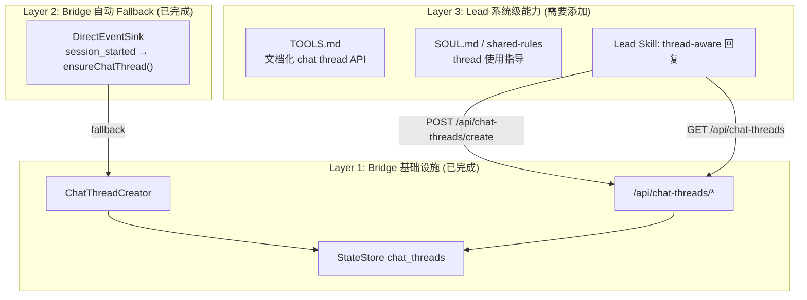

# Exploration: System-Level Chat Thread Architecture — FLY-91

**Issue**: FLY-91
**Date**: 2026-04-12
**Status**: Draft
**Trigger**: Annie's architectural feedback — chat thread 不是项目级功能，是 Flywheel 系统级能力

---

## 1. Annie 的核心需求

### 1.1 弹性入口
Issue 的来源是多样的：
- Daily Standup 后 Simba 分派
- Annie 在 Chat 里直接让 Peter/Oliver 做
- 未来可能有更多入口（webhook、外部系统）

Lead（LLM）天然能处理弹性输入，是正确的承接点。

### 1.2 通用 Orchestrator 逻辑
> "做完这个改动后，如果起一个新项目并安装 Flywheel，应该能直接沿用同样的 skill 和逻辑。"

这意味着：
- Chat thread 是 Flywheel **基础设施**，不是某个项目的定制功能
- 新项目安装 Flywheel → 配置 ProjectConfig（leads + chatChannel）→ 自动拥有 chat thread 能力
- 不能有任何项目特定的硬编码

---

## 2. 现状分析

### 2.1 当前架构分层

| 层 | 内容 | 系统级? |
|---|------|---------|
| **Bridge 基础设施** | StateStore chat_threads 表、ChatThreadCreator、API endpoints | ✅ 已系统级 |
| **Bridge 自动创建** | DirectEventSink 在 session_started 时 ensureChatThread() | ✅ 已系统级（feature flag 控制） |
| **Lead 知识** | SOUL.md + TOOLS.md | ❌ 未提及 chat thread |
| **Lead 注册 API** | /api/chat-threads/register、/api/runs/start chatThreadId | ✅ 已系统级 |
| **Lead 行为** | 何时创建 thread、如何使用 thread | ❌ 未定义 |

### 2.2 问题定位

**Bridge 侧已经是系统级的** — ChatThreadCreator、StateStore、API endpoints 都不依赖特定项目。任何配置了 chatChannel 的 Lead 都能自动获得 Bridge fallback 创建的 thread。

**缺失的是 Lead 侧的系统级能力**：
1. TOOLS.md 没有文档化 chat thread API（Lead 不知道可以注册/查询 thread）
2. SOUL.md 没有指导 Lead 何时/如何使用 thread
3. Lead 没有"创建 Discord thread"的能力（Discord MCP plugin 限制）

### 2.3 Lead 创建 thread 的技术约束

Lead 运行在 Claude Code + Discord MCP plugin 环境。当前 Discord plugin 的能力：
- ✅ 发消息到 channel
- ✅ 回复 thread 内的消息
- ❌ **不能创建 thread**（Discord API `POST /channels/{id}/threads` 不在 plugin 能力中）

这意味着 Lead 不能直接调用 Discord API 创建 thread。需要通过 Bridge API 代理。

---

## 3. 架构提案

### 3.1 核心原则

```
Lead 决策，Bridge 执行。
Lead 知道"何时需要 thread"，Bridge 知道"如何创建 thread"。
```

### 3.2 三层模型



### 3.3 需要新增/修改的内容

#### A. Bridge 新增 `/api/chat-threads/create` 端点

**为什么？** Lead 不能直接调用 Discord API 创建 thread。需要 Bridge 代为创建。

当前只有 `register`（注册已创建的 thread）和 Bridge 内部的 `ensureChatThread()`。缺少一个 **Lead 可调用的创建端点**。

```
POST /api/chat-threads/create
Body: {
    issueId: string,
    channelId: string,
    leadId: string,
    projectName: string,
    threadName?: string    // 可选，默认用 issue identifier + title
}
Response: { threadId: string, created: boolean }
```

逻辑：
1. 验证 lead + project + channel（复用 validateAndRegisterChatThread 的前半段）
2. 调用 `ChatThreadCreator.ensureChatThread()` — 自动处理已存在/404 重建
3. 返回 threadId

这样 Lead 通过一个 API 调用就能获得 thread，不需要知道 Discord API 细节。

#### B. TOOLS.md 添加 Chat Thread 章节

```markdown
### Chat Thread Management

每个 issue 可以在 chatChannel 中拥有一个独立的 Discord thread，用于集中讨论。

#### 创建/获取 Thread
POST /api/chat-threads/create
Body: { issueId: "...", channelId: "$CHAT_CHANNEL", leadId: "$LEAD_ID", projectName: "$PROJECT_NAME" }
Response: { threadId: "...", created: true/false }

如果 thread 已存在则返回现有的。如果不存在则创建新的。

#### 查询 Thread
GET /api/chat-threads?issueId={ISSUE-ID}&channelId={CHAT_CHANNEL}
Response: { threadId: "..." | null }

#### 何时使用
- 收到 session_started 通知时，Bridge 已自动创建 thread（看 payload 中的 chat_thread_id）
- 在 session 启动前讨论 issue 时，主动创建 thread
- Annie 在 chat 里提到某个 issue 需要讨论时
```

#### C. SOUL.md / shared-rules 添加 Thread 使用指导

```markdown
## Chat Thread 回复

当 payload 中包含 `chat_thread_id` 时：
- 在 thread 内回复，而不是直接发到 chatChannel
- 这样每个 issue 的讨论不会串在一起

当讨论某个 issue 但还没有 chat_thread_id 时：
- 调用 /api/chat-threads/create 获取 thread
- 后续关于这个 issue 的讨论都在 thread 内进行
```

### 3.4 "新项目安装 Flywheel" 的体验

```
1. 配置 ProjectConfig:
   - projectName, projectRoot
   - leads: [{ agentId, chatChannel, match, ... }]
   
2. 设置环境变量:
   - TEAMLEAD_CHAT_THREADS_ENABLED=true
   
3. 自动获得:
   - Bridge 在 session_started 时自动创建 chat thread ✅
   - Lead 通知 payload 中包含 chat_thread_id ✅
   - Lead 可通过 API 创建/查询 thread ✅
   - TOOLS.md 文档化了所有 API ✅
   - SOUL.md/shared-rules 指导 Lead 何时使用 thread ✅
   
4. 不需要:
   - 任何项目特定的 Lead rules ✅
   - 任何硬编码的 channel ID ✅
   - 手动配置 Discord thread 创建逻辑 ✅
```

---

## 4. 当前实现 vs 目标的 Gap 分析

| 能力 | 当前状态 | 目标 | Gap |
|------|---------|------|-----|
| Bridge chat_threads 存储 | ✅ Done | ✅ | None |
| Bridge auto-create (fallback) | ✅ Done (DirectEventSink) | ✅ | None |
| Lead 注册已创建 thread | ✅ Done (/api/chat-threads/register) | ✅ | None |
| /api/runs/start atomic register | ✅ Done | ✅ | None |
| **Lead 请求 Bridge 创建 thread** | ❌ Not done | ✅ | **需要 /api/chat-threads/create** |
| **TOOLS.md 文档化** | ❌ Not done | ✅ | **需要添加 Chat Thread 章节** |
| **SOUL.md thread 使用指导** | ❌ Not done | ✅ | **需要添加到 shared-rules** |
| Feature flag 控制 | ✅ Done | ✅ | None |
| 新项目零配置可用 | ⚠️ Bridge 层面是，Lead 层面不是 | ✅ | **TOOLS + SOUL 补齐后解决** |

---

## 5. 实施建议

### 5.1 增量修改（不重写）

当前 PR #135 的 Bridge 基础设施代码 **不需要重写**。它已经是系统级的。需要增量添加：

1. **新增 `/api/chat-threads/create` 端点**（~30 行）— Lead 调 Bridge 创建 thread
2. **更新 TOOLS.md**（~25 行）— 文档化 chat thread API
3. **更新 SOUL.md 或 shared-rules**（~15 行）— thread 使用指导
4. **更新 `/api/runs/start` 文档**（TOOLS.md 当前未记录这个端点）

### 5.2 不需要做的事

- ❌ 不需要重写 ChatThreadCreator（已经是系统级）
- ❌ 不需要修改 ProjectConfig（chatChannel 已经存在）
- ❌ 不需要在 GeoForge3D 的 Lead rules 里写任何东西
- ❌ 不需要修改 CommDB 格式（chat_thread_id 已在 payload 中）

---

## 6. 开放问题

1. **Lead 能否直接发消息到 Discord thread？** 需要验证 Claude Code Discord MCP plugin 是否支持 `POST /channels/{thread_id}/messages`。如果不支持，Lead 只能"知道" thread 存在但不能直接在里面发消息。
2. **shared-rules 还是 SOUL.md？** FLY-26 的分割策略建议 shared-rules 放通用规则、identity.md 放个性化内容。Chat thread 指导属于通用规则，应该放 shared-rules 的 `department-lead-rules.md`。
3. **Simba 需要 chat thread 吗？** Simba（CoS Lead）不管 Runner，但可能需要 thread 来组织 triage 讨论。需要 Annie 确认。
