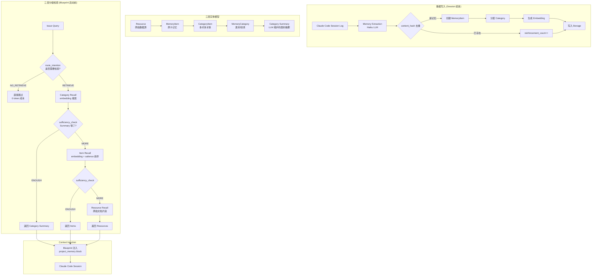
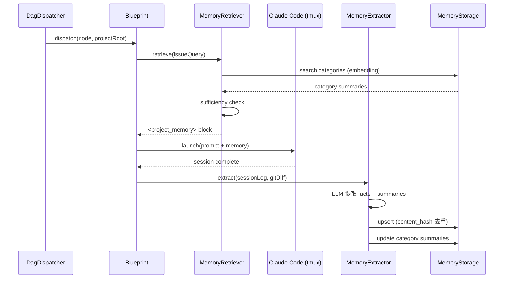
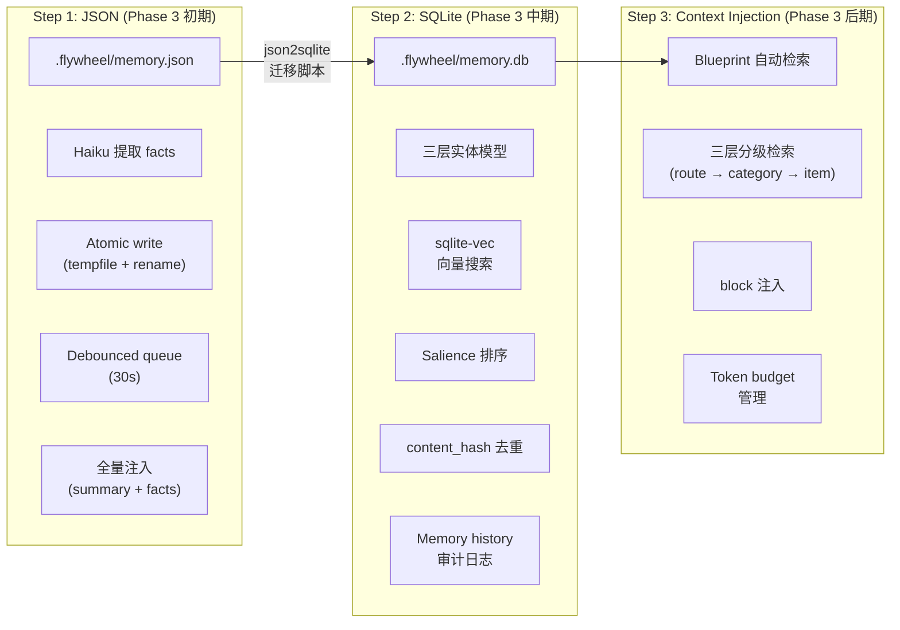

# v0.3 Memory System 设计文档

> 状态：Draft
> 来源：memU (NevaMind-AI)、deer-flow (ByteDance)、mem0 (mem0ai)
> 影响 Phase：Phase 3（Auto-Loop + Memory）、Phase 5（Decision Intelligence）
> 产出目标：`.flywheel/memory.json` → `.flywheel/memory.db` → Context Injection

---

## 1. Architecture Overview

### 1.1 三层实体模型 + 检索流程



### 1.2 Flywheel Memory 生命周期



---

## 2. mem0 vs memU vs deer-flow 对比

| 特性 | **mem0** | **memU** | **deer-flow** |
|------|---------|---------|---------------|
| **数据模型** | 扁平 fact list (id + text + metadata) | 三层: Resource → MemoryItem → MemoryCategory | 两层: summary sections + flat facts[] |
| **存储后端** | 20+ vector stores (Qdrant, Pinecone, Chroma, FAISS...) + Neo4j graph | SQLite / PostgreSQL / In-Memory | 单文件 JSON (memory.json) |
| **检索策略** | Vector search + BM25 rerank + optional graph traversal | 三层分级检索 (route_intention → category → item → resource) + early exit | 无检索 — 直接全量注入 system prompt |
| **去重** | LLM 判断 ADD/UPDATE/DELETE/NONE | content_hash (SHA256, 16 char) + reinforcement_count | 无显式去重 — LLM 在更新时自然合并 |
| **Graph 支持** | Neo4j / Memgraph / Neptune / Kuzu — 完整实体关系图谱 | 无 | 无 |
| **Memory 更新** | 两步: (1) LLM 提取 facts (2) LLM 决定 ADD/UPDATE/DELETE | LLM 提取 + embedding 分类 + category summary 自动更新 | 单步 LLM: 一次性更新 summaries + facts |
| **API 表面** | `m.add()` / `m.search()` / `m.get()` / `m.update()` / `m.delete()` | `service.memorize()` / `service.retrieve()` | `MemoryUpdater.update_memory()` / `format_memory_for_injection()` |
| **Debounce 写入** | 无 (同步写入) | 无 | 30s debounce + threading.Timer queue |
| **生产就绪度** | 高 — 60k+ GitHub stars, managed API, 大量 vector store 适配 | 中 — 完整但年轻项目, Rust 扩展未完成 | 中 — ByteDance 内部使用, memory 功能较新 |
| **Embedding** | OpenAI / HuggingFace / Ollama / 多种 | OpenAI / Doubao / 自定义 | 依赖 LangChain model |
| **Salience 排序** | 无 — 纯 vector similarity + optional reranker | similarity * log(reinforcement+1) * exp(-0.693 * days/halfLife) | 无 |
| **Atomic Write** | 无 (依赖 vector store 自身事务) | SQLAlchemy session | tempfile + rename (JSON) |

### 采纳建议

| 来源 | 采纳的模式 | 理由 |
|------|-----------|------|
| **memU** | 三层实体模型 (Resource/Item/Category) | 结构清晰，支持分级检索，category summary 节省 token |
| **memU** | Salience 排序公式 | 考虑 reinforcement + recency，不仅靠 similarity |
| **memU** | content_hash 去重 | 简洁高效，避免 LLM 重复判断 |
| **memU** | 三层分级检索 + early exit | Token 节省显著：简单查询只用 category summary |
| **deer-flow** | JSON schema 设计 (summary sections + facts) | Step 1 的理想格式，简单直接 |
| **deer-flow** | MEMORY_UPDATE_PROMPT 模板 | 完整的 LLM 指导模板，已验证可用 |
| **deer-flow** | Debounced write queue | 防止 session 密集时重复写入 |
| **deer-flow** | Atomic JSON write (tempfile + rename) | Step 1 数据安全 |
| **mem0** | 两步 memory 更新 (提取 → 决策) | 分离 extraction 和 update 逻辑，更可控 |
| **mem0** | Memory history tracking (SQLite) | 审计和调试所需 |
| **mem0 (不采纳)** | Graph memory (Neo4j) | 见 Section 9 评估 — Phase 3 不需要 |
| **mem0 (不采纳)** | 20+ vector store backends | Flywheel 只需 sqlite-vec，不需要 managed API |

---

## 3. Step 1 JSON Schema — `.flywheel/memory.json`

融合 deer-flow 的 summary sections 和 mem0 的 fact 管理模式。

```typescript
// packages/edge-worker/src/memory/types.ts

/** 顶层 Memory JSON 结构 */
export interface FlywheelMemory {
  version: '1.0';
  projectId: string;             // e.g. "geoforge3d"
  lastUpdated: string;           // ISO 8601

  /** 项目上下文 — 结构化 summary sections (deer-flow 模式) */
  project: {
    codebaseContext: SummarySection;   // 技术栈、仓库结构、关键依赖
    activeWork: SummarySection;        // 当前进行中的工作（多条并行任务）
    recentDecisions: SummarySection;   // 近期架构/技术决策
  };

  /** 历史上下文 — 时间分层 (deer-flow 模式) */
  history: {
    recentSessions: SummarySection;    // 最近 5-10 个 session 摘要
    patterns: SummarySection;          // 常见失败模式、解决方案
    longTermContext: SummarySection;   // 项目长期背景
  };

  /** 原子 facts — 结构化知识 (mem0 + memU 混合模式) */
  facts: MemoryFact[];
}

/** Summary section — deer-flow 的分层摘要 */
export interface SummarySection {
  summary: string;
  updatedAt: string;  // ISO 8601
}

/** 原子 fact — 可去重、可强化 */
export interface MemoryFact {
  id: string;                    // "fact_" + 8 char hex
  content: string;               // "Always run alembic upgrade after schema changes"
  category: FactCategory;
  confidence: number;            // 0.0 - 1.0
  contentHash: string;           // SHA256 前 16 位 — 去重用
  reinforcementCount: number;    // 被验证/复现的次数
  lastReinforcedAt: string;      // ISO 8601
  createdAt: string;             // ISO 8601
  source: FactSource;            // 来源追踪
}

/** Fact 来源 */
export interface FactSource {
  type: 'session' | 'issue' | 'manual';
  id: string;                    // session ID / issue ID
  issueId?: string;              // Linear issue identifier
}

/** Fact 类别 — 从 deer-flow + mem0 合并 */
export type FactCategory =
  | 'pattern'       // 代码模式、架构决策
  | 'error'         // 常见错误和修复方法
  | 'preference'    // 项目偏好（代码风格、工具选择）
  | 'constraint'    // 硬约束（必须做 X 才能做 Y）
  | 'decision'      // 已做出的决策及原因
  | 'knowledge';    // 领域知识（API 用法、配置要求）

/** Memory 配置 */
export interface MemoryConfig {
  enabled: boolean;
  storagePath: string;           // 默认 ".flywheel/memory.json"
  debounceMs: number;            // 默认 30000 (30s)
  maxFacts: number;              // 默认 100
  factConfidenceThreshold: number; // 默认 0.7
  injectionEnabled: boolean;     // 是否注入到 Claude Code session
  maxInjectionTokens: number;    // 默认 2000
  extractionModel: string;       // 默认 "claude-3-haiku-20241022"
}
```

### 空 Memory 初始状态

```json
{
  "version": "1.0",
  "projectId": "geoforge3d",
  "lastUpdated": "",
  "project": {
    "codebaseContext": { "summary": "", "updatedAt": "" },
    "activeWork": { "summary": "", "updatedAt": "" },
    "recentDecisions": { "summary": "", "updatedAt": "" }
  },
  "history": {
    "recentSessions": { "summary": "", "updatedAt": "" },
    "patterns": { "summary": "", "updatedAt": "" },
    "longTermContext": { "summary": "", "updatedAt": "" }
  },
  "facts": []
}
```

---

## 4. Step 2 SQLite Schema — `.flywheel/memory.db`

三层实体模型的完整 SQL schema，包含 sqlite-vec 向量搜索支持。

```sql
-- Flywheel Memory Database Schema
-- Storage: .flywheel/memory.db (per-project)
-- Requires: better-sqlite3 + sqlite-vec extension

PRAGMA journal_mode = WAL;
PRAGMA foreign_keys = ON;

-- ============================================================
-- Layer 1: Resources (原始数据源)
-- ============================================================
CREATE TABLE IF NOT EXISTS resources (
  id            TEXT PRIMARY KEY,
  type          TEXT NOT NULL CHECK(type IN ('issue', 'session', 'pr', 'commit', 'slack_thread')),
  project_id    TEXT NOT NULL,
  external_id   TEXT,          -- Linear issue ID, PR number, etc.
  title         TEXT,
  content       TEXT,
  created_at    TEXT NOT NULL DEFAULT (strftime('%Y-%m-%dT%H:%M:%fZ', 'now')),
  updated_at    TEXT NOT NULL DEFAULT (strftime('%Y-%m-%dT%H:%M:%fZ', 'now'))
);

CREATE INDEX IF NOT EXISTS idx_resources_project ON resources(project_id);
CREATE INDEX IF NOT EXISTS idx_resources_type ON resources(type);
CREATE INDEX IF NOT EXISTS idx_resources_external ON resources(external_id);

-- ============================================================
-- Layer 2: Memory Items (原子记忆)
-- ============================================================
CREATE TABLE IF NOT EXISTS memory_items (
  id                    TEXT PRIMARY KEY,
  resource_id           TEXT REFERENCES resources(id) ON DELETE SET NULL,
  memory_type           TEXT NOT NULL CHECK(memory_type IN (
                          'pattern', 'error', 'preference',
                          'constraint', 'decision', 'knowledge'
                        )),
  summary               TEXT NOT NULL,
  content_hash          TEXT NOT NULL,        -- SHA256[:16] 去重
  confidence            REAL NOT NULL DEFAULT 0.8 CHECK(confidence >= 0 AND confidence <= 1),
  reinforcement_count   INTEGER NOT NULL DEFAULT 1,
  last_reinforced_at    TEXT NOT NULL DEFAULT (strftime('%Y-%m-%dT%H:%M:%fZ', 'now')),
  happened_at           TEXT,
  source_type           TEXT CHECK(source_type IN ('session', 'issue', 'manual')),
  source_id             TEXT,
  issue_id              TEXT,                 -- Linear issue identifier
  created_at            TEXT NOT NULL DEFAULT (strftime('%Y-%m-%dT%H:%M:%fZ', 'now')),
  updated_at            TEXT NOT NULL DEFAULT (strftime('%Y-%m-%dT%H:%M:%fZ', 'now'))
);

CREATE UNIQUE INDEX IF NOT EXISTS idx_memory_items_hash ON memory_items(content_hash);
CREATE INDEX IF NOT EXISTS idx_memory_items_type ON memory_items(memory_type);
CREATE INDEX IF NOT EXISTS idx_memory_items_confidence ON memory_items(confidence);
CREATE INDEX IF NOT EXISTS idx_memory_items_reinforcement ON memory_items(reinforcement_count DESC);

-- ============================================================
-- Layer 3: Memory Categories (类别/目录)
-- ============================================================
CREATE TABLE IF NOT EXISTS memory_categories (
  id            TEXT PRIMARY KEY,
  name          TEXT NOT NULL UNIQUE,
  description   TEXT NOT NULL,
  summary       TEXT,           -- LLM 自动维护的类别摘要 (~400 字)
  created_at    TEXT NOT NULL DEFAULT (strftime('%Y-%m-%dT%H:%M:%fZ', 'now')),
  updated_at    TEXT NOT NULL DEFAULT (strftime('%Y-%m-%dT%H:%M:%fZ', 'now'))
);

-- ============================================================
-- Category ↔ Item 多对多关联
-- ============================================================
CREATE TABLE IF NOT EXISTS category_items (
  id            TEXT PRIMARY KEY,
  category_id   TEXT NOT NULL REFERENCES memory_categories(id) ON DELETE CASCADE,
  item_id       TEXT NOT NULL REFERENCES memory_items(id) ON DELETE CASCADE,
  created_at    TEXT NOT NULL DEFAULT (strftime('%Y-%m-%dT%H:%M:%fZ', 'now')),
  UNIQUE(category_id, item_id)
);

CREATE INDEX IF NOT EXISTS idx_category_items_category ON category_items(category_id);
CREATE INDEX IF NOT EXISTS idx_category_items_item ON category_items(item_id);

-- ============================================================
-- Memory History (审计日志, 参考 mem0 的 history table)
-- ============================================================
CREATE TABLE IF NOT EXISTS memory_history (
  id            TEXT PRIMARY KEY,
  memory_id     TEXT NOT NULL,
  old_content   TEXT,
  new_content   TEXT,
  event         TEXT NOT NULL CHECK(event IN ('ADD', 'UPDATE', 'DELETE', 'REINFORCE')),
  created_at    TEXT NOT NULL DEFAULT (strftime('%Y-%m-%dT%H:%M:%fZ', 'now'))
);

CREATE INDEX IF NOT EXISTS idx_memory_history_memory ON memory_history(memory_id);

-- ============================================================
-- Summary Sections (从 JSON 迁移过来的分层摘要)
-- ============================================================
CREATE TABLE IF NOT EXISTS summary_sections (
  key           TEXT PRIMARY KEY,    -- e.g. "project.codebaseContext"
  summary       TEXT NOT NULL DEFAULT '',
  updated_at    TEXT NOT NULL DEFAULT (strftime('%Y-%m-%dT%H:%M:%fZ', 'now'))
);

-- 初始化默认 sections
INSERT OR IGNORE INTO summary_sections (key, summary) VALUES
  ('project.codebaseContext', ''),
  ('project.activeWork', ''),
  ('project.recentDecisions', ''),
  ('history.recentSessions', ''),
  ('history.patterns', ''),
  ('history.longTermContext', '');

-- ============================================================
-- sqlite-vec 虚拟表 (向量搜索)
-- ============================================================
-- 需要在运行时加载 sqlite-vec extension:
--   const db = new Database('.flywheel/memory.db');
--   db.loadExtension('vec0');

-- Resource embeddings
CREATE VIRTUAL TABLE IF NOT EXISTS vec_resources USING vec0(
  id TEXT PRIMARY KEY,
  embedding float[384]    -- all-MiniLM-L6-v2 (384 维) 或按需调整
);

-- Item embeddings
CREATE VIRTUAL TABLE IF NOT EXISTS vec_items USING vec0(
  id TEXT PRIMARY KEY,
  embedding float[384]
);

-- Category embeddings
CREATE VIRTUAL TABLE IF NOT EXISTS vec_categories USING vec0(
  id TEXT PRIMARY KEY,
  embedding float[384]
);
```

---

## 5. Memory Extraction Prompt

从 deer-flow 的 `MEMORY_UPDATE_PROMPT` 翻译并适配到 Flywheel 场景。

```typescript
// packages/edge-worker/src/memory/prompts.ts

/**
 * Flywheel Memory Update Prompt
 *
 * 基于 deer-flow MEMORY_UPDATE_PROMPT 翻译适配。
 * 输入：Claude Code session log + git diff summary + Linear issue context
 * 输出：JSON — 更新 summary sections + 新增/删除 facts
 */
export const MEMORY_UPDATE_PROMPT = `You are a memory management system for an autonomous software development orchestrator called Flywheel.
Your task is to analyze a completed Claude Code session and update the project's memory profile.

Current Memory State:
<current_memory>
{current_memory}
</current_memory>

Session Context:
<session>
Linear Issue: {issue_id} — {issue_title}
Issue Description: {issue_description}
Session Duration: {duration_ms}ms
Session Result: {session_result}
Git Changes: {commit_count} commits
Branch: {branch_name}
</session>

Git Diff Summary:
<git_diff>
{git_diff_summary}
</git_diff>

Session Log (truncated):
<session_log>
{session_log}
</session_log>

Instructions:
1. Analyze the session for important patterns, decisions, errors, and knowledge about this project
2. Extract relevant facts with specific details (file paths, command names, error messages, version numbers)
3. Update the memory sections as needed following the detailed guidelines below

Memory Section Guidelines:

**Project Context** (Current state - concise summaries):
- codebaseContext: Tech stack, repo structure, key dependencies, build system (2-3 sentences)
  Example: "TypeScript monorepo (pnpm), React frontend + FastAPI backend, PostgreSQL + Redis"
- activeWork: Multiple ongoing tasks and their status (3-5 sentences)
  Example: "Working on v3.15.0 multi-deployment isolation. Also tracking migration to new auth provider."
  Note: Capture SEVERAL concurrent work items, not just the current session
- recentDecisions: Architecture and technology decisions made recently (2-4 sentences)
  Example: "Switched from Docker Compose to Kubernetes for staging. Adopted Zod for runtime validation."

**History** (Temporal context - rich paragraphs):
- recentSessions: Detailed summary of last 5-10 sessions (4-6 sentences)
  Include: Issues worked on, outcomes (success/failure), notable patterns
- patterns: Common failure modes and proven solutions (3-5 sentences)
  Include: Recurring errors, workarounds, "always do X before Y" rules
- longTermContext: Persistent project background (2-4 sentences)
  Include: Project history, team context, long-standing constraints

**Facts Extraction**:
- Extract ONLY facts relevant to future development sessions
- Focus on actionable knowledge that helps Claude Code work better on this project
- Categories:
  * pattern: Code patterns, architecture decisions, "prefer X over Y"
  * error: Common errors and their fixes, failure modes
  * preference: Project preferences (coding style, tool choices, testing approach)
  * constraint: Hard constraints ("must run X before Y", "never modify Z directly")
  * decision: Decisions made and their rationale
  * knowledge: Domain knowledge (API usage, config requirements, deploy procedures)
- Confidence levels:
  * 0.9-1.0: Explicitly demonstrated in session (error occurred and was fixed)
  * 0.7-0.8: Strongly implied from code patterns or session behavior
  * 0.5-0.6: Inferred patterns (use sparingly)

**What Goes Where (Flywheel-specific)**:
- codebaseContext: Tech stack facts that rarely change
- activeWork: Gets updated most frequently — reflects current sprint/iteration state
- recentDecisions: Only decisions made within this project, not general knowledge
- recentSessions: Chronological account — always ADD to this, shift old entries to patterns
- patterns: Distilled from recentSessions when patterns emerge across multiple sessions
- longTermContext: Foundational facts that persist across all sessions

Output Format (JSON):
{{
  "project": {{
    "codebaseContext": {{ "summary": "...", "shouldUpdate": true/false }},
    "activeWork": {{ "summary": "...", "shouldUpdate": true/false }},
    "recentDecisions": {{ "summary": "...", "shouldUpdate": true/false }}
  }},
  "history": {{
    "recentSessions": {{ "summary": "...", "shouldUpdate": true/false }},
    "patterns": {{ "summary": "...", "shouldUpdate": true/false }},
    "longTermContext": {{ "summary": "...", "shouldUpdate": true/false }}
  }},
  "newFacts": [
    {{ "content": "...", "category": "pattern|error|preference|constraint|decision|knowledge", "confidence": 0.0-1.0 }}
  ],
  "factsToRemove": ["fact_id_1", "fact_id_2"]
}}

Important Rules:
- Only set shouldUpdate=true if there's meaningful new information from THIS session
- When updating summaries, MERGE new info with existing — never completely replace
- For recentSessions: prepend new session summary, trim oldest entries to keep ~5 sessions
- For patterns: only add/modify when a pattern is confirmed across 2+ sessions
- Include specific file paths, command names, error messages in facts
- Only add facts with confidence >= 0.7
- Remove facts that are contradicted by this session's outcomes
- Preserve technical accuracy — exact library names, version numbers, CLI flags
- All summaries and facts should be in English (for code-facing memory)

Return ONLY valid JSON, no explanation or markdown.`;

/**
 * Fact Extraction Prompt (单步快速提取, 用于 real-time 场景)
 * 基于 mem0 FACT_RETRIEVAL_PROMPT 简化适配
 */
export const FACT_EXTRACTION_PROMPT = `Extract actionable development facts from this Claude Code session output.

Session for issue {issue_id}: {issue_title}
Result: {session_result}

Session content:
{content}

Extract facts in this JSON format:
{{
  "facts": [
    {{ "content": "...", "category": "pattern|error|preference|constraint|decision|knowledge", "confidence": 0.0-1.0 }}
  ]
}}

Rules:
- Only extract facts that would help future Claude Code sessions on this project
- Focus on: error patterns, required setup steps, architecture decisions, API quirks
- Confidence: 0.9+ for explicitly demonstrated facts, 0.7-0.8 for implied patterns
- Skip: generic knowledge, temporary workarounds, one-time issues
- Be specific: include file paths, command names, version numbers

Return ONLY valid JSON.`;
```

---

## 6. Salience 排序公式

从 memU `src/memu/database/inmemory/vector.py` 中的 `salience_score()` 直接移植。

```typescript
// packages/edge-worker/src/memory/salience.ts

/**
 * Salience-aware 排序公式 (移植自 memU)
 *
 * 公式: similarity * reinforcement_factor * recency_factor
 *
 * - reinforcement_factor: log(count + 1)
 *   对数缩放防止高频 fact 垄断排名
 * - recency_factor: exp(-0.693 * daysSince / halfLifeDays)
 *   半衰期衰减：halfLifeDays 天后 factor ~= 0.5
 *
 * 来源: memU/src/memu/database/inmemory/vector.py:salience_score()
 */
export function salienceScore(
  similarity: number,
  reinforcementCount: number,
  lastReinforcedAt: Date | null,
  halfLifeDays: number = 30,
): number {
  // Reinforcement factor (logarithmic to prevent runaway scores)
  const reinforcementFactor = Math.log(reinforcementCount + 1);

  // Recency factor (exponential decay with half-life)
  let recencyFactor: number;
  if (lastReinforcedAt === null) {
    recencyFactor = 0.5; // Unknown recency gets neutral score
  } else {
    const now = new Date();
    const daysAgo = (now.getTime() - lastReinforcedAt.getTime()) / 86_400_000;
    // 0.693 = ln(2), gives us proper half-life decay
    recencyFactor = Math.exp(-0.693 * daysAgo / halfLifeDays);
  }

  return similarity * reinforcementFactor * recencyFactor;
}

/**
 * Top-K 检索 with salience ranking
 *
 * 来源: memU/src/memu/database/inmemory/vector.py:cosine_topk_salience()
 */
export interface SalienceCandidate {
  id: string;
  embedding: number[];
  reinforcementCount: number;
  lastReinforcedAt: Date | null;
}

export function topKBySalience(
  queryVec: number[],
  candidates: SalienceCandidate[],
  k: number = 5,
  halfLifeDays: number = 30,
): Array<{ id: string; score: number }> {
  const scored = candidates
    .map(c => ({
      id: c.id,
      score: salienceScore(
        cosineSimilarity(queryVec, c.embedding),
        c.reinforcementCount,
        c.lastReinforcedAt,
        halfLifeDays,
      ),
    }))
    .sort((a, b) => b.score - a.score);

  return scored.slice(0, k);
}

/**
 * Cosine similarity between two vectors
 */
export function cosineSimilarity(a: number[], b: number[]): number {
  if (a.length !== b.length) {
    throw new Error(`Vector dimension mismatch: ${a.length} vs ${b.length}`);
  }
  let dot = 0;
  let normA = 0;
  let normB = 0;
  for (let i = 0; i < a.length; i++) {
    dot += a[i] * b[i];
    normA += a[i] * a[i];
    normB += b[i] * b[i];
  }
  const denom = Math.sqrt(normA) * Math.sqrt(normB) + 1e-9;
  return dot / denom;
}
```

### 直觉解释

| 参数 | 含义 | 举例 |
|------|------|------|
| `similarity = 0.85` | 查询与记忆的语义相似度 | "migration error" 查找到 "Always run alembic upgrade..." |
| `reinforcementCount = 5` | 这条记忆被 5 个不同 session 确认过 | log(6) ≈ 1.79 |
| `daysAgo = 15` (halfLife=30) | 15 天前最后一次确认 | exp(-0.693 * 15/30) ≈ 0.71 |
| **最终分数** | 0.85 * 1.79 * 0.71 = **1.08** | 高分 — 频繁确认 + 近期活跃 |

对比一条很久没用的记忆：
| 参数 | 值 | 结果 |
|------|------|------|
| `similarity = 0.90` | 更相似 | — |
| `reinforcementCount = 1` | 仅出现一次 | log(2) ≈ 0.69 |
| `daysAgo = 90` (halfLife=30) | 3 个月前 | exp(-0.693 * 90/30) ≈ 0.125 |
| **最终分数** | 0.90 * 0.69 * 0.125 = **0.078** | 低分 — 虽然相似但太旧且未确认 |

---

## 7. content_hash 去重

从 memU `src/memu/database/models.py` 中的 `compute_content_hash()` 直接移植。

```typescript
// packages/edge-worker/src/memory/dedup.ts

import { createHash } from 'node:crypto';

/**
 * 计算 content hash 用于 memory 去重
 *
 * 来源: memU/src/memu/database/models.py:compute_content_hash()
 *
 * 工作原理:
 * 1. 将 summary 转小写并规范化空格
 * 2. 与 memory_type 拼接: "pattern:always run tests before deploy"
 * 3. SHA256 取前 16 位 hex
 *
 * 使用场景:
 * - 每次 LLM 提取出新 fact 时，先计算 hash
 * - 如果 hash 已存在 → reinforcement_count++ (强化已有记忆)
 * - 如果不存在 → 创建新 MemoryItem
 */
export function computeContentHash(summary: string, memoryType: string): string {
  // Normalize: lowercase, strip, collapse whitespace
  const normalized = summary.toLowerCase().replace(/\s+/g, ' ').trim();
  const content = `${memoryType}:${normalized}`;
  return createHash('sha256').update(content).digest('hex').slice(0, 16);
}

/**
 * 去重 + 强化逻辑
 *
 * 返回:
 * - { action: 'reinforce', existingId } 如果已存在
 * - { action: 'create' } 如果是新记忆
 */
export interface DedupResult {
  action: 'reinforce' | 'create';
  existingId?: string;
  contentHash: string;
}

export function checkDuplicate(
  summary: string,
  memoryType: string,
  existingHashes: Map<string, string>,  // hash → item ID
): DedupResult {
  const hash = computeContentHash(summary, memoryType);
  const existingId = existingHashes.get(hash);

  if (existingId) {
    return { action: 'reinforce', existingId, contentHash: hash };
  }
  return { action: 'create', contentHash: hash };
}

/**
 * 批量去重 — 用于 LLM 一次提取多条 fact 的场景
 */
export function deduplicateFacts(
  newFacts: Array<{ content: string; category: string; confidence: number }>,
  existingHashes: Map<string, string>,
): {
  toCreate: Array<{ content: string; category: string; confidence: number; contentHash: string }>;
  toReinforce: Array<{ existingId: string; contentHash: string }>;
} {
  const toCreate: Array<{ content: string; category: string; confidence: number; contentHash: string }> = [];
  const toReinforce: Array<{ existingId: string; contentHash: string }> = [];
  const seenHashes = new Set<string>();

  for (const fact of newFacts) {
    const result = checkDuplicate(fact.content, fact.category, existingHashes);

    // 同批次内也去重
    if (seenHashes.has(result.contentHash)) continue;
    seenHashes.add(result.contentHash);

    if (result.action === 'reinforce' && result.existingId) {
      toReinforce.push({ existingId: result.existingId, contentHash: result.contentHash });
    } else {
      toCreate.push({ ...fact, contentHash: result.contentHash });
    }
  }

  return { toCreate, toReinforce };
}
```

---

## 8. 三层分级检索

基于 memU `src/memu/app/retrieve.py` 的 RAG workflow 简化适配。

```typescript
// packages/edge-worker/src/memory/retriever.ts

import type { FlywheelMemory, MemoryFact } from './types.js';

/**
 * 三层分级检索器
 *
 * 来源: memU retrieve.py 的 RAG workflow
 *
 * 检索流程:
 * 1. route_intention: 判断是否需要检索 (简单 issue 不需要历史记忆)
 * 2. category recall: embedding 搜索 category summary
 * 3. sufficiency check: LLM 判断 category summary 是否足够
 * 4. item recall: embedding + salience 排序具体 items
 * 5. build context: 组装 <project_memory> block
 *
 * Early exit: 每层都有提前退出，避免不必要的 embedding 计算
 */

/** 检索结果 */
export interface RetrievalResult {
  needsRetrieval: boolean;
  memorySections: string;     // 格式化的 summary sections
  relevantFacts: string;      // 格式化的相关 facts
  tokenEstimate: number;      // 估计的 token 数
}

/** 检索配置 */
export interface RetrievalConfig {
  enabled: boolean;
  maxTokens: number;          // 最大注入 token 数 (默认 2000)
  categoryTopK: number;       // category 检索 top-k (默认 3)
  itemTopK: number;           // item 检索 top-k (默认 10)
  halfLifeDays: number;       // salience 半衰期 (默认 30)
  skipCategories: string[];   // 跳过的 category (如 "deployment" 在开发时)
}

/**
 * Step 1: route_intention — 判断是否需要检索
 *
 * 简化版: 基于规则而非 LLM (Phase 3 够用)
 * - 新项目 (facts < 5) → NO_RETRIEVE
 * - issue title 含 "fix" / "error" / "bug" → RETRIEVE (需要历史错误模式)
 * - 否则 → RETRIEVE (默认检索，宁可多花一点 token)
 *
 * 来源: memU pre_retrieval_decision.py 简化
 */
export function routeIntention(
  issueTitle: string,
  issueDescription: string,
  factCount: number,
): boolean {
  // 新项目没什么可检索的
  if (factCount < 5) return false;

  // 默认检索 — Phase 3 先保守
  return true;
}

/**
 * Step 2+3: Category-level 检索 + sufficiency check
 *
 * Phase 3 Step 1 (JSON 模式) 简化版:
 * - 直接返回所有 summary sections (不做 embedding 搜索)
 * - 按 token budget 截断
 *
 * Phase 3 Step 2 (SQLite 模式):
 * - embedding 搜索 top-K categories
 * - LLM sufficiency check
 * - 如果够了，只返回 category summaries
 */
export function retrieveFromJson(
  memory: FlywheelMemory,
  issueTitle: string,
  config: RetrievalConfig,
): RetrievalResult {
  if (!config.enabled || !routeIntention(issueTitle, '', memory.facts.length)) {
    return { needsRetrieval: false, memorySections: '', relevantFacts: '', tokenEstimate: 0 };
  }

  // 格式化 summary sections
  const sections: string[] = [];

  const proj = memory.project;
  if (proj.codebaseContext.summary) {
    sections.push(`Codebase: ${proj.codebaseContext.summary}`);
  }
  if (proj.activeWork.summary) {
    sections.push(`Active Work: ${proj.activeWork.summary}`);
  }
  if (proj.recentDecisions.summary) {
    sections.push(`Recent Decisions: ${proj.recentDecisions.summary}`);
  }

  const hist = memory.history;
  if (hist.patterns.summary) {
    sections.push(`Patterns: ${hist.patterns.summary}`);
  }
  if (hist.recentSessions.summary) {
    sections.push(`Recent Sessions: ${hist.recentSessions.summary}`);
  }

  const memorySections = sections.join('\n');

  // 格式化相关 facts (按 confidence 排序, 取 top N)
  const sortedFacts = [...memory.facts]
    .sort((a, b) => {
      // 先按 reinforcement 降序, 再按 confidence 降序
      if (b.reinforcementCount !== a.reinforcementCount) {
        return b.reinforcementCount - a.reinforcementCount;
      }
      return b.confidence - a.confidence;
    });

  // Token budget: 保留空间给 summary sections
  const factBudget = config.maxTokens - estimateTokens(memorySections);
  const factLines: string[] = [];
  let tokenCount = 0;

  for (const fact of sortedFacts) {
    const line = `- [${fact.category}] ${fact.content}`;
    const lineTokens = estimateTokens(line);
    if (tokenCount + lineTokens > factBudget) break;
    factLines.push(line);
    tokenCount += lineTokens;
  }

  const relevantFacts = factLines.join('\n');
  const totalTokens = estimateTokens(memorySections) + tokenCount;

  return {
    needsRetrieval: true,
    memorySections,
    relevantFacts,
    tokenEstimate: totalTokens,
  };
}

/** 简易 token 估算 (4 chars ≈ 1 token) */
function estimateTokens(text: string): number {
  return Math.ceil(text.length / 4);
}
```

---

## 9. Graph Memory 评估

### mem0 的 Graph Memory 实现

mem0 使用 **Neo4j** 存储实体关系图谱，核心流程:

1. **实体提取**: LLM 从对话中提取 entities + entity_type (`extract_entities` tool call)
2. **关系建立**: LLM 从文本中建立 source → relationship → destination 三元组 (`establish_relationships` tool call)
3. **图搜索**: embedding cosine similarity 找到相关 nodes，再遍历图关系
4. **BM25 重排**: 对搜索结果用 BM25 rerank
5. **更新/删除**: LLM 判断已有关系是否需要更新或删除

关键代码在 `/tmp/mem0/mem0/memory/graph_memory.py`:

```python
# mem0 的 graph memory 数据流
data → extract_entities (LLM) → entity_type_map
     → establish_relationships (LLM) → [(source, relationship, destination)]
     → search existing graph → BM25 rerank
     → decide deletions (LLM) → apply mutations via Cypher
```

### Flywheel 是否应该采用 Graph Memory?

| 维度 | 评估 | 结论 |
|------|------|------|
| **价值** | Graph 关系可以表达 "Issue A 引入了 Pattern B, Pattern B 导致了 Error C" 这类因果链 | 中等 — 对调试有用，但 Phase 3 的主要目标是基本记忆 |
| **复杂度** | 需要 Neo4j (或 Kuzu) 作为额外依赖 + 每次 memorize 需要 2-3 次额外 LLM 调用 (实体提取 + 关系建立 + 删除判断) | 高 — 与 "本地 Mac 零云费用" 原则冲突 |
| **LLM 成本** | 每次 session 结束后多 2-3 次 LLM 调用 (entity extraction, relation establishment, deletion) | $0.01-0.05/session — 可接受但不必要 |
| **存储** | Neo4j 需要 JVM，内存开销 500MB+ | 不符合 "Garage Mac Mini" 的轻量要求 |
| **替代方案** | Category-Item 关联表 + summary 可以覆盖 80% 的关系表达需求 | 三层模型已经够用 |
| **Kuzu 替代** | mem0 支持 Kuzu (嵌入式 graph DB, 无需 JVM) | 可选，但增加依赖 |

### 结论: Phase 3 不采纳 Graph Memory

**理由**:

1. **收益不够**: Flywheel 的主要记忆需求是 "这个项目的常见错误模式" 和 "上次 session 做了什么"，这些用 fact list + category summary 完全覆盖
2. **成本太高**: 每次 session 额外 2-3 次 LLM 调用 + Neo4j/Kuzu 依赖
3. **memU 的三层模型已经提供了轻量级关系**: Category ↔ Item 多对多关联 + Category Summary 间接编码了关系信息
4. **Phase 5 可以重新评估**: 当 Decision Intelligence 需要 "Issue A 的决策如何影响 Issue B" 这类推理时，再引入 Graph

**Phase 5 Graph Memory 路线图** (如果需要):

```
Phase 3: fact list + category summary (当前设计)
Phase 5: 评估是否引入 Kuzu (嵌入式, 无 JVM)
         - 在 .flywheel/memory.db 旁边加 .flywheel/graph.kuzu
         - 仅对 decision 类型 facts 构建关系图
         - 关系类型: CAUSED_BY, RESOLVED_BY, DEPENDS_ON, SUPERSEDES
```

---

## 10. Context Injection

### Blueprint 如何注入 `<project_memory>` 到 Claude Code session

```typescript
// packages/edge-worker/src/Blueprint.ts (修改方案)

/**
 * Blueprint.run() 修改点:
 *
 * 在 Step 3 (Build prompt + system prompt) 之前，
 * 增加 Step 2.5: Memory Retrieval
 */

// Step 2.5: Memory Retrieval (新增)
const memoryBlock = await this.buildMemoryBlock(projectRoot, hydrated);

// Step 3: Build prompt + system prompt (修改)
const systemPrompt = [
  "You are working on a Linear issue. Follow these steps:",
  "1. Read the codebase and understand the context (CLAUDE.md, relevant files).",
  "2. Implement the requested changes following TDD.",
  "3. Create a feature branch, commit your changes.",
  "4. Push the branch and create a GitHub PR.",
  "5. Verify CI passes. If CI fails, fix and push again.",
  "6. When all work is complete, stop and wait.",
  "Do not ask questions — implement your best judgment.",
  "",
  // 新增: 注入项目记忆
  memoryBlock,
].join("\n");
```

### `buildMemoryBlock()` 实现

```typescript
/**
 * 构建 <project_memory> block
 *
 * 输出格式:
 * <project_memory>
 * ## Project Context
 * - Codebase: TypeScript monorepo...
 * - Active Work: Working on v3.15.0...
 *
 * ## Known Patterns
 * - [error] Always run alembic upgrade after schema changes
 * - [constraint] Frontend tests require VITE_API_URL env var
 * - [pattern] Migration PRs should include rollback script
 * </project_memory>
 */
private async buildMemoryBlock(
  projectRoot: string,
  hydrated: HydratedNode,
): Promise<string> {
  const memoryPath = path.join(projectRoot, '.flywheel', 'memory.json');

  // 如果 memory 文件不存在，返回空
  if (!fs.existsSync(memoryPath)) {
    return '';
  }

  try {
    const raw = fs.readFileSync(memoryPath, 'utf-8');
    const memory: FlywheelMemory = JSON.parse(raw);

    const config: RetrievalConfig = {
      enabled: true,
      maxTokens: 2000,
      categoryTopK: 3,
      itemTopK: 10,
      halfLifeDays: 30,
      skipCategories: [],
    };

    const result = retrieveFromJson(memory, hydrated.issueTitle, config);

    if (!result.needsRetrieval) {
      return '';
    }

    const lines: string[] = ['<project_memory>'];

    if (result.memorySections) {
      lines.push('## Project Context');
      lines.push(result.memorySections);
      lines.push('');
    }

    if (result.relevantFacts) {
      lines.push('## Known Patterns & Constraints');
      lines.push(result.relevantFacts);
      lines.push('');
    }

    lines.push('</project_memory>');

    return lines.join('\n');
  } catch (err) {
    console.warn(`[Blueprint] Failed to load memory: ${err}`);
    return '';
  }
}
```

### Token 预算管理

```
Claude Code context window: 200k tokens
CLAUDE.md: ~2-5k tokens
Issue description: ~500-2k tokens
<project_memory>: 最多 2k tokens (可配置)
剩余: ~190k tokens 给 Claude Code 工作
```

注入的 `<project_memory>` 通过 `appendSystemPrompt` 参数传入 Claude Code runner，
XML 标签 `<project_memory>` 使 Claude 能清晰区分记忆信息和指令。

---

## 11. Migration Path

### Step 1 → Step 2 → Step 3 渐进式迁移



### Step 1: JSON 模式 (最小可用版本)

**实现 LOC 估计**: ~200 LOC

| 组件 | 文件 | LOC |
|------|------|-----|
| Types | `memory/types.ts` | ~50 |
| Content hash + dedup | `memory/dedup.ts` | ~40 |
| Memory updater | `memory/updater.ts` | ~60 |
| Prompt template | `memory/prompts.ts` | ~30 (const) |
| Debounced queue | `memory/queue.ts` | ~40 |

**工作流程**:
1. Claude Code session 结束
2. Blueprint 收集 session log + git diff
3. 放入 debounced queue (30s)
4. Queue 触发: 调用 Haiku，传入 `MEMORY_UPDATE_PROMPT`
5. 解析 Haiku 响应 → 更新 summaries + 去重/新增 facts
6. Atomic write: `memory.json.tmp` → `memory.json`

**Atomic write 实现** (来自 deer-flow `updater.py`):

```typescript
import { writeFileSync, renameSync } from 'node:fs';
import { join } from 'node:path';

function atomicWriteJson(filePath: string, data: unknown): void {
  const tmpPath = filePath + '.tmp';
  writeFileSync(tmpPath, JSON.stringify(data, null, 2), 'utf-8');
  renameSync(tmpPath, filePath);
}
```

### Step 2: SQLite 迁移

**触发条件**: facts 数量超过 50 或需要 embedding 搜索时

**迁移脚本**:

```typescript
// packages/edge-worker/src/memory/migrate.ts

import Database from 'better-sqlite3';
import type { FlywheelMemory } from './types.js';

/**
 * 将 .flywheel/memory.json 迁移到 .flywheel/memory.db
 *
 * 1. 读取 JSON
 * 2. 创建 SQLite schema
 * 3. 导入 summary sections
 * 4. 导入 facts → memory_items
 * 5. 根据 category 自动创建 memory_categories
 * 6. 生成 embeddings (批量)
 * 7. 验证数据完整性
 * 8. 备份 JSON → memory.json.bak
 */
async function migrateJsonToSqlite(
  jsonPath: string,
  dbPath: string,
): Promise<{ itemsImported: number; categoriesCreated: number }> {
  const json: FlywheelMemory = JSON.parse(
    readFileSync(jsonPath, 'utf-8')
  );

  const db = new Database(dbPath);
  db.pragma('journal_mode = WAL');
  db.pragma('foreign_keys = ON');

  // 执行 schema SQL (Section 4)
  db.exec(SCHEMA_SQL);

  // 导入 summary sections
  const upsertSection = db.prepare(
    'INSERT OR REPLACE INTO summary_sections (key, summary, updated_at) VALUES (?, ?, ?)'
  );

  for (const [group, sections] of Object.entries({ project: json.project, history: json.history })) {
    for (const [key, section] of Object.entries(sections)) {
      upsertSection.run(`${group}.${key}`, section.summary, section.updatedAt);
    }
  }

  // 导入 facts → memory_items
  const insertItem = db.prepare(`
    INSERT INTO memory_items (
      id, memory_type, summary, content_hash, confidence,
      reinforcement_count, last_reinforced_at, source_type, source_id, issue_id
    ) VALUES (?, ?, ?, ?, ?, ?, ?, ?, ?, ?)
  `);

  let itemsImported = 0;
  for (const fact of json.facts) {
    insertItem.run(
      fact.id, fact.category, fact.content, fact.contentHash,
      fact.confidence, fact.reinforcementCount, fact.lastReinforcedAt,
      fact.source.type, fact.source.id, fact.source.issueId ?? null,
    );
    itemsImported++;
  }

  // 自动创建 categories
  const categories = new Set(json.facts.map(f => f.category));
  const insertCategory = db.prepare(
    'INSERT OR IGNORE INTO memory_categories (id, name, description) VALUES (?, ?, ?)'
  );
  const insertCatItem = db.prepare(
    'INSERT OR IGNORE INTO category_items (id, category_id, item_id) VALUES (?, ?, ?)'
  );

  const categoryDescriptions: Record<string, string> = {
    pattern: 'Code patterns and architecture decisions',
    error: 'Common errors and their fixes',
    preference: 'Project preferences and coding style',
    constraint: 'Hard constraints and prerequisites',
    decision: 'Decisions and their rationale',
    knowledge: 'Domain knowledge and API usage',
  };

  let categoriesCreated = 0;
  for (const cat of categories) {
    const catId = `cat_${cat}`;
    insertCategory.run(catId, cat, categoryDescriptions[cat] ?? cat);
    categoriesCreated++;

    // 关联 items
    for (const fact of json.facts.filter(f => f.category === cat)) {
      insertCatItem.run(`ci_${fact.id}_${catId}`, catId, fact.id);
    }
  }

  db.close();

  return { itemsImported, categoriesCreated };
}
```

### Step 3: Context Injection 增强

从 JSON 全量注入升级为:

1. **sqlite-vec 向量搜索**: 基于 issue 描述的 embedding 搜索相关 facts
2. **Salience 排序**: 考虑 reinforcement + recency
3. **三层分级检索**: route_intention → category summary → item details
4. **Token budget**: 严格控制注入 token 数

### Debounced Queue (TypeScript 版)

```typescript
// packages/edge-worker/src/memory/queue.ts
// 移植自 deer-flow backend/src/agents/memory/queue.py

interface QueuedUpdate {
  sessionId: string;
  sessionLog: string;
  gitDiff: string;
  issueId: string;
  issueTitle: string;
  timestamp: Date;
}

export class MemoryUpdateQueue {
  private queue: QueuedUpdate[] = [];
  private timer: ReturnType<typeof setTimeout> | null = null;
  private processing = false;
  private debounceMs: number;
  private onProcess: (updates: QueuedUpdate[]) => Promise<void>;

  constructor(
    debounceMs: number,
    onProcess: (updates: QueuedUpdate[]) => Promise<void>,
  ) {
    this.debounceMs = debounceMs;
    this.onProcess = onProcess;
  }

  add(update: QueuedUpdate): void {
    // 同一 session 的更新只保留最新的
    this.queue = this.queue.filter(u => u.sessionId !== update.sessionId);
    this.queue.push(update);
    this.resetTimer();
  }

  private resetTimer(): void {
    if (this.timer !== null) {
      clearTimeout(this.timer);
    }
    this.timer = setTimeout(() => this.processQueue(), this.debounceMs);
  }

  private async processQueue(): Promise<void> {
    if (this.processing || this.queue.length === 0) return;

    this.processing = true;
    const batch = [...this.queue];
    this.queue = [];
    this.timer = null;

    try {
      await this.onProcess(batch);
    } catch (err) {
      console.error('[MemoryQueue] Process failed:', err);
    } finally {
      this.processing = false;
    }
  }

  /** 强制立即处理 (用于 graceful shutdown) */
  async flush(): Promise<void> {
    if (this.timer !== null) {
      clearTimeout(this.timer);
      this.timer = null;
    }
    await this.processQueue();
  }

  get pendingCount(): number {
    return this.queue.length;
  }
}
```

---

## 附录 A: 默认 Category 列表

Phase 3 Step 1 使用固定 category (不做 LLM 自动分类):

| Category | 描述 | 典型内容 |
|----------|------|----------|
| `pattern` | 代码模式、架构决策 | "Always use parameterized SQL queries" |
| `error` | 常见错误和修复 | "CORS error: add VITE_API_URL to .env" |
| `preference` | 项目偏好 | "Prefer Zod over io-ts for runtime validation" |
| `constraint` | 硬约束 | "Must run `pnpm db:migrate` before starting dev server" |
| `decision` | 已做决策 | "Switched from REST to tRPC for type-safe API" |
| `knowledge` | 领域知识 | "GeoForge3D uses Three.js r160+ with custom shader pipeline" |

## 附录 B: 来源代码文件索引

| 项目 | 文件 | 用途 |
|------|------|------|
| memU | `src/memu/database/models.py` | 数据模型 + `compute_content_hash()` |
| memU | `src/memu/database/inmemory/vector.py` | `salience_score()` + `cosine_topk_salience()` |
| memU | `src/memu/app/retrieve.py` | 三层分级检索 workflow |
| memU | `src/memu/prompts/retrieve/pre_retrieval_decision.py` | route_intention prompt |
| memU | `src/memu/prompts/retrieve/judger.py` | sufficiency_check prompt |
| memU | `src/memu/database/sqlite/models.py` | SQLite ORM 模型 |
| deer-flow | `backend/src/agents/memory/prompt.py` | `MEMORY_UPDATE_PROMPT` 完整模板 |
| deer-flow | `backend/src/agents/memory/queue.py` | `MemoryUpdateQueue` (debounce) |
| deer-flow | `backend/src/agents/memory/updater.py` | `MemoryUpdater` (atomic write + LLM 调用) |
| deer-flow | `backend/src/config/memory_config.py` | Memory 配置 (debounce_seconds, max_facts 等) |
| mem0 | `mem0/memory/main.py` | `Memory.add()` — 两步 fact extraction + update |
| mem0 | `mem0/memory/graph_memory.py` | `MemoryGraph` — Neo4j graph memory |
| mem0 | `mem0/configs/prompts.py` | `DEFAULT_UPDATE_MEMORY_PROMPT` + `FACT_RETRIEVAL_PROMPT` |
| mem0 | `mem0/graphs/tools.py` | Graph memory tool definitions |
| mem0 | `mem0/graphs/utils.py` | `EXTRACT_RELATIONS_PROMPT` |
| mem0 | `mem0/memory/storage.py` | `SQLiteManager` — history table |
| mem0 | `mem0/configs/base.py` | `MemoryConfig` + `MemoryItem` |

---

## 附录 C: Future Considerations（v0.3 后续迭代）

> 以下想法来自 Annie 2026-03-10 的讨论，记录为后续迭代方向。

### C1. 记忆存储位置

当前 v0.3 Step 1 把 history.db 存在 `~/.flywheel/memories/<projectName>/`。但更合理的方案是 **记忆跟着 project 走**，而不是 Flywheel 自身：

```
<project-repo>/
  .flywheel/
    memories/        ← 这个 project 的记忆
```

好处：
- 记忆和代码在一起，clone repo 就有上下文
- 不同机器之间可以通过 git 同步（如果 vector store 也用文件格式）
- 删 project = 自动清理记忆

### C2. 分层记忆模型 — Project-level + Team-level

每个 Project 下面可能有多个 Team（backend, frontend, infra 等），记忆应该分层：

```
Project Memory（整个项目的共享记忆）
  ├── Backend Team Memory
  ├── Frontend Team Memory
  └── Infra Team Memory
```

在 mem0 的数据模型里可以自然映射：
- `userId` = project name → 项目级隔离
- `agentId` = team name → 团队级隔离
- 搜索时：只搜 team 的（精准），或搜整个 project 的（广泛）

代码里已经预留了 `agentId` 参数（`MemoryService.addSessionMemory` 和 `searchAndFormat` 都支持），数据模型层面已经支持，后续只需要在配置层面暴露。

### C3. Vector Store 选择 — Supabase pgvector vs Qdrant

当前方案用 Qdrant（本地 Docker），但 **Supabase pgvector** 可能更适合：

| 维度 | Qdrant (本地) | Supabase (pgvector) |
|------|--------------|-------------------|
| 部署 | 需要自己跑 Docker | 已有云服务，零维护 |
| 查看数据 | 需要 Qdrant Dashboard (localhost:6333) | **Supabase Dashboard 直接 SQL 查询** |
| 备份 | 需要手动配置 | 自动备份 |
| 费用 | 免费（本地） | Free tier 500MB 足够 |
| 可访问性 | 仅限运行 Docker 的机器 | **任何地方都能查看** |
| 集成 | 专用 API | 标准 SQL，任何工具都能接 |

mem0 OSS 支持 pgvector 作为 vector store provider。迁移路径：只需改 `MemoryService` 构造函数的 `vectorStore` 配置。

**Annie 的核心诉求**：能方便地查看记忆内容。Supabase Dashboard 直接满足这个需求。

### C4. 决策时间线

| 时机 | 决策 |
|------|------|
| v0.3 Step 1（当前） | 用 Qdrant + in-memory 完成基础架构 |
| Trial run 之后 | 根据实际数据量和使用体验，决定 Qdrant vs Supabase |
| Multi-team 阶段 | 启用 project + team 分层记忆 |
| 多机器部署时 | 决定记忆存储位置（project repo 内 vs 云端） |
