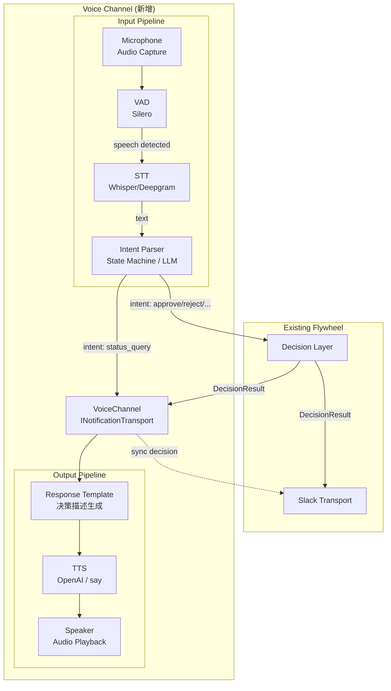

# Exploration: Voice Interface for Flywheel

## 1. 动机

当前 Flywheel 的人机交互通道是 **Slack 文字消息 + 按钮**。CEO 需要打开手机/电脑、阅读消息、点击按钮。这在工位前没问题，但有大量场景不方便：

- 做家务、做饭、遛狗 — 手不空闲
- 通勤、散步 — 不想看屏幕
- 多任务切换 — 不想打断当前工作流

**核心场景**: CEO 戴着耳机，Flywheel 在后台跑。当需要决策时，Flywheel 通过语音说 "Hey, GEO-76 完成了，改了 3 个文件，加了用户认证的 JWT 验证，看起来没问题，要不要自动合并？"。CEO 语音回复 "合并吧" 或 "等一下，描述一下改了什么"。

**本质**: 这不是一个新系统，而是现有 Decision Layer → Slack 通道的**语音投影 (voice projection)**。

## 2. 设计空间

### 2.1 架构定位

Voice 不替代 Slack，而是**并行通道**。类比：

```
Decision Layer
    ├── Slack Channel    (文字 + 按钮，异步，持久记录)
    ├── Voice Channel    (语音，实时，短暂交互)    ← 新增
    └── (未来) Dashboard  (Web UI，全局视图)
```

关键原则：
- **Voice 是 Slack 的补充，不是替代** — 所有决策仍然会同步到 Slack 作为 audit trail
- **Voice 不做 auto-approve** — 语音识别有误差，安全决策仍需确认
- **Graceful degradation** — 语音通道不可用时，自动 fallback 到 Slack

### 2.2 交互模式

两种模式，不互斥：

#### Mode A: Push (Flywheel 主动说)

Flywheel 有事要汇报时，主动通过语音通知 CEO。

```
Flywheel: "GEO-76 完成了。3 个 commit，改了 5 个文件，加了 JWT 验证。
           Decision Layer 建议 auto approve，confidence 85%。要合并吗？"
CEO:      "合并。"
Flywheel: "好的，已合并。下一个 GEO-78 还在跑，预计 5 分钟。"
```

#### Mode B: Pull (CEO 主动问)

CEO 想了解当前状态时，主动发起语音查询。

```
CEO:      "Flywheel，现在什么状态？"
Flywheel: "3 个 issue 在跑。GEO-76 刚完成等你决策，GEO-78 在执行中，
           GEO-79 排队等 semaphore slot。"
CEO:      "GEO-76 什么情况？"
Flywheel: "GEO-76 是加用户认证，改了 auth middleware 和 3 个 test 文件，
           测试全过，diff 120 行。Decision Layer 建议合并。"
CEO:      "合并。"
```

### 2.3 Voice 需要处理的决策类型

从 Decision Layer 映射：

| Decision Route | Voice 行为 |
|----------------|-----------|
| `auto_approve` | 通知 "已自动合并 GEO-XX"（仅告知，不需决策） |
| `needs_review` | 语音描述情况 + 等待 CEO 指令 (approve/reject/defer) |
| `blocked` | 语音描述失败原因 + 等待 CEO 指令 (retry/shelve/investigate) |
| `escalate` (Hard Rule) | 语音强调 "安全相关" + 等待 CEO 指令 |

## 3. 技术选型探索

### 3.1 Speech-to-Text (STT)

| 方案 | 延迟 | 成本 | 离线 | 备注 |
|------|------|------|------|------|
| **OpenAI Whisper API** | ~1-2s | $0.006/min | No | 最成熟，多语言好 |
| **Deepgram** | ~300ms (streaming) | $0.0043/min | No | 实时 streaming 最佳 |
| **whisper.cpp (本地)** | ~2-5s | Free | Yes | Mac M-series 硬件加速，离线可用 |
| **Apple Speech Framework** | ~500ms | Free | Yes | macOS 原生，但需 Swift/ObjC bridge |
| **Google Cloud STT** | ~1s | $0.006/min | No | Streaming 支持好 |

**初步倾向**: Deepgram (streaming 低延迟) 或 whisper.cpp (零成本离线)。

### 3.2 Text-to-Speech (TTS)

| 方案 | 自然度 | 延迟 | 成本 | 备注 |
|------|--------|------|------|------|
| **OpenAI TTS** | 极高 | ~1s | $15/1M chars | 最自然，多种 voice |
| **ElevenLabs** | 极高 | ~500ms | $5/mo 起 | Voice cloning，最低延迟 |
| **macOS `say` 命令** | 中等 | 即时 | Free | 零依赖，离线，但机械感强 |
| **Google Cloud TTS** | 高 | ~1s | $4/1M chars | WaveNet voices 不错 |
| **Coqui TTS (本地)** | 中-高 | ~2s | Free | 开源本地模型 |

**初步倾向**: 开发阶段用 macOS `say`（零成本验证流程），生产用 OpenAI TTS 或 ElevenLabs。

### 3.3 Voice Activity Detection (VAD)

需要知道 CEO 什么时候在说话、什么时候说完了：

| 方案 | 备注 |
|------|------|
| **Silero VAD** | 轻量 ONNX 模型，< 1MB，业界标准 |
| **WebRTC VAD** | Google 的 C library，简单但不够准 |
| **rnnoise** | Mozilla 的降噪 + VAD |

### 3.4 对话管理

Voice 交互需要理解上下文（"合并吧" 指的是哪个 issue？）。两种方案：

**方案 A: 简单状态机**
```
States: IDLE → NOTIFYING → WAITING_RESPONSE → CONFIRMING → IDLE
```
适合 Phase 1 — 固定的决策流程，不需要自由对话。

**方案 B: LLM 对话 (Haiku/Sonnet)**
把 CEO 的语音转文字后，送给 LLM 理解意图，生成回复文字，再 TTS 播放。
适合 Phase 2 — 支持自由提问 ("描述一下改了什么"、"跟上一个 PR 有关系吗？")。

## 4. 架构草案



### 4.1 接口设计

Voice Channel 实现与 Slack 相同的 transport 接口：

```typescript
interface INotificationTransport {
  notify(event: NotificationEvent): Promise<void>;
  onReaction?(handler: ReactionHandler): void;
}

// VoiceChannel 额外接口
interface IVoiceChannel extends INotificationTransport {
  /** 开始监听麦克风 */
  startListening(): Promise<void>;

  /** 停止监听 */
  stopListening(): Promise<void>;

  /** 主动语音播报 */
  speak(text: string): Promise<void>;

  /** 当前是否在对话中 */
  isInConversation(): boolean;

  /** CEO 是否在线 (耳机连接 / 手动设置) */
  isAvailable(): boolean;
}
```

### 4.2 对话上下文

```typescript
interface VoiceConversationContext {
  /** 当前待决策的 issue (最近一个 needs_review/blocked) */
  activeDecision: PendingDecision | null;

  /** 最近 N 个已完成的决策 (用于 "上一个是什么" 类查询) */
  recentDecisions: DecisionResult[];

  /** 当前正在执行的 issues */
  activeIssues: RunningIssue[];

  /** 对话历史 (短期，仅当前 session) */
  conversationHistory: { role: 'ceo' | 'flywheel'; text: string }[];
}
```

### 4.3 Intent 识别 (Phase 1 状态机)

```typescript
type VoiceIntent =
  | { type: 'approve'; issueId?: string }
  | { type: 'reject'; issueId?: string; reason?: string }
  | { type: 'defer' }
  | { type: 'retry' }
  | { type: 'status_query' }
  | { type: 'issue_detail'; issueId: string }
  | { type: 'repeat' }          // "再说一遍"
  | { type: 'unclear' }         // 无法识别
```

Phase 1 用关键词匹配 + 简单 NLU：
- "合并" / "approve" / "可以" / "没问题" → `approve`
- "拒绝" / "reject" / "不行" → `reject`
- "等一下" / "稍后" / "defer" → `defer`
- "什么状态" / "status" / "现在怎么样" → `status_query`
- "再说一遍" / "repeat" → `repeat`

## 5. 实现分期

### Phase 1: 单向通知 + 简单指令 (MVP)

- macOS `say` 做 TTS（零依赖）
- whisper.cpp 本地 STT（零成本）
- 状态机 intent 解析（关键词匹配）
- 仅支持 Push 模式 — Flywheel 有决策时语音通知
- 仅支持 approve / reject / defer 三个指令
- 所有决策同步到 Slack

**验证目标**: 证明语音通道端到端可行，延迟可接受（< 3s 端到端）。

### Phase 2: 双向对话 + 自然语言

- 升级 TTS 到 OpenAI TTS / ElevenLabs（自然度）
- 升级 STT 到 Deepgram streaming（低延迟）
- LLM (Haiku) 做 intent 解析 + 回复生成
- 支持 Pull 模式 — CEO 主动提问
- 支持上下文对话 ("描述一下改了什么"、"跟上一个有关系吗")
- Wake word 检测 ("Hey Flywheel")

### Phase 3: 多模态 + 移动端

- iOS/Android companion app（随身携带）
- 或者通过电话/Twilio 接入（无需 app）
- Voice + 推送通知混合
- 语音摘要 — 早上戴耳机时，Flywheel 汇报昨晚的执行总结

## 6. 关键风险和开放问题

### 风险

| 风险 | 影响 | 缓解 |
|------|------|------|
| STT 识别错误导致错误决策 | 高 — 误 approve 安全变更 | 二次确认 ("你确定要合并 GEO-76 吗？") |
| 环境噪音干扰 | 中 — 识别率下降 | VAD + 降噪，嘈杂环境自动 fallback 到 Slack |
| 延迟过高影响体验 | 中 — 对话不自然 | 本地 STT/TTS 优先，streaming 输出 |
| 中英文混合识别 | 中 — CEO 可能中英文混说 | Whisper 多语言模型，或限定指令为英文关键词 |
| 隐私 — 语音数据上传 | 低 — 仅发送短指令 | Phase 1 全本地 (whisper.cpp + `say`) |

### 开放问题

1. **Wake word vs Always-on** — 是否需要 "Hey Flywheel" 唤醒词？还是只在有 pending decision 时才监听？
2. **多语言** — CEO 中英文混用，intent 解析如何处理？
3. **并发决策** — 同时有 3 个 issue 等待决策，语音如何排队？逐个汇报 + 逐个决策？
4. **耳机检测** — 如何知道 CEO 是否戴着耳机？macOS CoreAudio API 可以检测音频输出设备
5. **Recording consent** — 语音是否需要录音存档？还是纯实时处理不保存？
6. **与现有 Slack Reactions 的一致性** — Voice approve 后是否需要自动在 Slack 消息上点 Approve 按钮？

## 7. 类似产品参考

| 产品 | 相关点 |
|------|--------|
| **GitHub Copilot Voice** | VS Code 中语音编程，NLU + code action |
| **Alexa Smart Home** | Push 通知 + 语音指令，状态机对话 |
| **Siri Shortcuts** | 自定义语音触发自动化流程 |
| **Linear Mobile** | Issue 管理的移动端体验（非语音，但场景类似） |
| **Humane AI Pin** | 纯语音 AI 交互设备 |

## 8. 结论

Voice Interface 是 Flywheel "CEO 注意力零消耗" 愿景的自然延伸。技术上可行（STT/TTS/VAD 都是成熟技术），关键挑战在于 **对话设计** 和 **错误处理**（语音识别误差 → 错误决策的安全防护）。

建议从 Phase 1 MVP 开始 — macOS 本地 TTS/STT、状态机、三个指令 — 验证端到端体验后再投资自然语言对话。

**优先级建议**: v0.3 (Memory) 之后，作为 v0.4 或独立 workstream。不阻塞当前开发。
