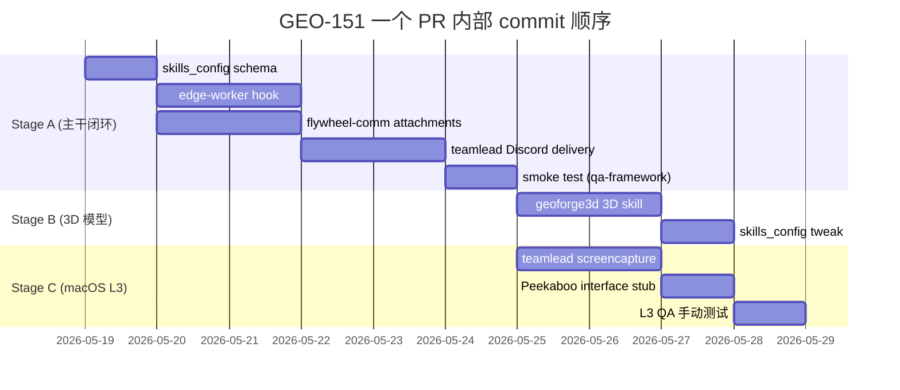

# Exploration: Remote Screenshot for Flywheel

> **v2 状态**: 这份 doc 在 v1 (2026-03-05) 里以 Slack-centric 的 "CEO 远程拉截图" frame 写。Annie 在 2026-05-18 重新打开 GEO-151，scope 扩到三个并存的应用：
> 1. **Runner 改完 web UI 自动 ProofShot** → PR comment / Discord (L2)
> 2. **3D 模型生成自动用 3dviewer.net + ProofShot 录屏** → Annie 看 (L4, GeoForge3D 特有)
> 3. **Runner 截 macOS app window 自己看图分析** (L3, autonomous vision-based debugging)
>
> v2 章节标了 **[v2]** 前缀。v1 内容保留作历史参考，但若与 v2 冲突以 v2 为准（特别是 Slack→Discord、Playwright→ProofShot、CEO-only→Runner+Lead+CEO 三角通道）。

## 0. [v2] 现状 + 三维分类法

### 0.1 现状审计 (2026-05-18)

| 组件 | 状态 |
|------|------|
| ProofShot CLI v1.3.1 (`/Users/xiaorongli/.npm-global/bin/proofshot`) | ✅ 已安装 |
| agent-browser v0.22.3 (headless Chromium via CDP) | ✅ 已安装 |
| 用户级 ProofShot skill (`~/.claude/skills/proofshot/SKILL.md`) | ✅ 已存在 |
| `packages/` 任何 ProofShot wire-up | ❌ 0 处引用 |
| `packages/edge-worker/src/EdgeWorker.ts:4641-4724` 现有 4 个 screenshot PostToolUse hook (`playwright_screenshot`, `mcp__claude-in-chrome__computer`, `mcp__claude-in-chrome__gif_creator`, `mcp__chrome-devtools__take_screenshot`) | ✅ 已上线，全部 nudge `linear_upload_file` → Linear comment |
| `packages/flywheel-comm/src/commands/capture.ts` (`tmux capture-pane` 文本) | ✅ 已上线 |
| `flywheel-comm stage set <stage>` 13-stage taxonomy + Bridge `stage_changed` event | ✅ 已上线 (FLY-137) |
| Lead → Discord 文件附件路径 | ⚠️ Discord plugin `reply` 支持 `files: [...]`，但 Runner-to-Discord 直送路径不存在 (Runner 必须经 Lead 中转) |
| macOS `screencapture` CLI (`/usr/sbin/screencapture`) | ✅ 系统自带 |
| Peekaboo (`npm install peekaboo` + MCP server) | ❌ 未安装 |

**关键含义**: Annie 说的 "infra 装好了" 仅指 ProofShot CLI 已 `npm install` + skill 文档放好。**实际 Runner pipeline 没有任何 ProofShot 调用**。但同时 EdgeWorker 已经有 4 个 sibling screenshot hook 路由到 Linear — 这是新 ProofShot hook 的**复制模板**，不是从零写。

### 0.2 三维分类法 (取代 v1 §5.1 L1-L6 单一线性分级)

把 "remote screenshot" 拆成三个正交维度，每个维度独立选实现，组合出具体场景：

| 维度 | 选项 | 描述 | 实现状态 |
|---|---|---|---|
| **Capture (拍什么)** | L1 tmux pane (text) | `tmux capture-pane` 抓文本 | ✅ `flywheel-comm capture` |
| | L2 web page (browser) | ProofShot 或 playwright_screenshot MCP | ⚠️ 工具有，pipeline 没接 |
| | L3 macOS window/app | `screencapture -l <windowID>` + `osascript`，未来可换 Peekaboo | ❌ 无 |
| | L4 3D model | ProofShot + 3dviewer.net 网页 viewer | ❌ 无 (实质 = L2 子集) |
| **Delivery (送哪里)** | D1 Linear comment | `linear_upload_file` MCP tool → markdown embed | ✅ 4 个 hook 已 nudge |
| | D2 GitHub PR comment | `proofshot pr <num>` 内置 / `gh pr comment --body-file ...` | ❌ 无 (ProofShot 自带能力，packages 没用) |
| | D3 Discord chat thread | Lead 用 Discord plugin `reply` tool 带 `files: [...]` | ❌ 无路径，Runner 必经 Lead |
| **Interpret (谁看)** | V1 Runner self-vision | Runner 用 `Read` tool 读 PNG，Claude multimodal 自动解析 | ✅ Read tool 本来支持，"零新 infra" |
| | V2 Lead vision summary | Lead 收 artifact → 自读 → text 总结发 Annie | ❌ 无 (建在 Lead 侧 watcher) |
| | V3 Annie 自看 | 只发图，Annie 自己看 | ✅ 任何 Delivery 都 trivially 支持 |

> **V1 是 free lunch**: Claude Code 的 `Read` 工具读 PNG/JPG 是 multimodal 自动解析 (system prompt 第一段写明)。Runner 截完图自己 `Read` 一次就完成 "vision interpretation"，**不需要单独调 vision API**。成本 ~$0.003-0.01/image (走 image tokens，不是单独 API call)。

### 0.3 Annie's Scope 决策 (2026-05-18)

**全 scope MVP** — 一个 PR 包含 L2 + L4 + L3 + V1 + D1/D2/D3，**不拆 PR**，但**内部按 phase 实现**(见 §8)。

### 0.4 v1 → v2 关键变更摘要

| 维度 | v1 (2026-03-05) | v2 (2026-05-18) |
|---|---|---|
| 通知通道 | Slack | **Discord** (项目已切，见 GEO-145 / FLY-67) |
| 主要 web 截图工具 | Playwright (项目自己写) | **ProofShot** (CLI 已装) |
| 触发模型 | CEO 在 Slack pull/push | **Runner 自动 + Lead 中转 ad-hoc + Annie pull** 三方共存 |
| 视觉解读 | 无 | **V1 Runner self-vision (默认开启)** — Codex Round 1 决策 |
| L5 命名 | 数据可视化 | (v2 retired，新 "interpret" 维度取代) |
| 实施分期 | Phase 1 终端 → Phase 2 网页 → Phase 3 智能 | **Phase C 顺序: L2+V1+delivery thin slice → L4 → L3** — Codex Round 1 决策 |

## 1. 动机

### 1.1 [v2] 三类应用场景

v2 把动机扩到三类（v1 只覆盖第三类 "CEO 远程观察"）：

**(A) Runner 自我验证 — 视觉闭环 (主要驱动)**
- Runner 改完前端代码后，**自己**截图 + 读图，看是否真的改对了，再发 PR
- 现在的 Runner 改完 `.tsx` 就 PR，没有视觉验证步骤 → bug 多
- 类比 Devin / Claude Code browser harness 的 ReAct 闭环：action → observation (screenshot) → next thought
- ProofShot 的 SUMMARY.md + WebM + PNG 就是结构化 Observation

**(B) Annie 远程被动接收 — 关键节点视觉通知 (v1 已覆盖)**
- Runner 在 GeoForge3D 生成完一个 3D 模型 → 自动用 3dviewer.net 录屏 → 发 Discord chat thread
- Runner 改完登录页 → 自动 ProofShot → 发 PR comment + Discord
- Annie 在外面，不主动问也能从 Discord 看见 "改成什么样了"

**(C) Annie 远程主动拉取 — ad-hoc 观察 (v1 唯一覆盖)**
- Annie 在 Discord 说 "看一下 cmux 现在啥状态" / "Discord 上有什么消息" / "看一下 Bridge 日志窗口"
- Lead 接到，自己跑 `screencapture -l <windowID>` 截图，发 Discord
- Codex Q4 决策: **Lead-direct capture**，不经 Runner relay (低延迟 + 复用 Lead 的 Discord/Mac context)

### 1.2 文字 vs 视觉通道的本质差异

文字信息足以处理大部分决策（approve/reject/retry），但有些场景需要**视觉上下文**：

- **PR diff 太复杂** — 文字描述 "改了 auth middleware" 不如看一眼 diff 直观
- **测试失败** — 错误堆栈截图比纯文本更容易定位
- **UI 变更** — 前端改动必须看到渲染结果才能判断
- **3D 模型** — 几何形状 / 拓扑结构 / 材质效果只能视觉验证，无法用文字表达
- **远程监控** — Annie 不在电脑前，想知道 tmux session 里在跑什么
- **Web 应用状态** — 部署后想快速看一眼页面是否正常

**v2 本质**: 不只是 Notification Transport 的视觉增强，更是 **Runner autonomy** 的关键能力 — 让 Runner 自己看到自己改的东西、判断是否合格、再决定要不要 PR。这把 "外部观察工具" 升级成 "Runner 内部认知能力"。

## 2. 设计空间

### 2.1 截图类型

| 类型 | 场景 | 难度 |
|------|------|------|
| **tmux session 截图** | 查看 Claude Code 当前执行状态 | 低 — `tmux capture-pane` |
| **网页截图** | 部署后查看页面、PR diff 页面 | 中 — 需要 headless browser |
| **桌面截图** | 全局状态概览 | 低 — macOS `screencapture` |
| **特定应用窗口** | 查看特定 IDE/终端 | 中 — macOS window API / Peekaboo MCP |

### 2.2 [v2] 触发方式 — 三种触发主体并存

| 触发主体 | 信号源 | 场景 | 实现机制 |
|---|---|---|---|
| **Runner self-trigger** | Runner 自己决定 (via skill description) | Runner 改完 UI → 自动 ProofShot → 自读 (V1) | ProofShot SKILL.md 触发，PostToolUse hook 加 ProofShot 指引 (类比 EdgeWorker.ts:4641 现有 4 个 hook) |
| **Stage-changed auto** | Bridge 收 `stage_changed=test`/`pr_created` event | UI 类 issue 在 test 阶段强制录屏 | Bridge 检测 stage + label，自动通过 Lead → Runner inbox 注入 "请跑 ProofShot" 指令 |
| **Lead ad-hoc** | Annie 在 Discord 说自然语言 | "看一下 cmux" / "Discord 最新消息" | Lead 自己跑 `screencapture` (Codex Q4 决策，**不下沉到 Runner**) |
| **Annie pull via slash** | Annie 在 Discord 用 `/screenshot <target>` 命令 | 显式拉取 | Lead 接收 → 根据 target 选 capture 路径 |

> **v1 的 "自动 Push / 手动 Pull" 仍然有效**，v2 在此之上加 "Runner self-trigger" 作为主要驱动。

#### Runner self-trigger 流 (主线)

```
Runner 改完 .tsx 文件
  ↓ (Edit/Write tool 触发 PostToolUse hook)
hook 加 additionalContext: "你改了 UI，建议跑 proofshot 验证"
  ↓ (Runner LLM 决定是否跑)
Runner 在 tmux pane 执行 `proofshot start --run "..." --port N --description "改完登录页"`
  ↓
ProofShot 启 headless Chromium + 录屏开始
  ↓
Runner 用 `proofshot exec` 操作并截图
  ↓
Runner 执行 `proofshot stop` → SUMMARY.md + WebM + PNGs 生成
  ↓ (V1 vision interpret)
Runner Read SUMMARY.md + 精选 PNG → multimodal 解析 → 决定 OK 或 fix-then-rerun
  ↓ (V1 通过后)
Runner 调 `linear_upload_file` + `proofshot pr` + Lead-relay-to-Discord 三路并行
  ↓
Annie 在 Linear + GitHub PR + Discord 看到 artifact
```

#### Stage-changed auto-trigger 流 (defensive)

```
Runner 报 stage=test → flywheel-comm stage set test
  ↓
Bridge 收 stage_changed event
  ↓ (Bridge 检测 issue label contains "ui" OR project skills_config.proofshot.enabled)
Bridge 通过 Lead → Runner inbox 发指令 "请跑 ProofShot 验证 UI"
  ↓
Runner 收 inbox message → 走 Runner self-trigger 同一流
```

(防 Runner 跳过自检；Stage-changed 是 fallback safety net)

#### Annie ad-hoc Lead-direct 流

```
Annie 在 Discord: "看一下 cmux 现在啥状态"
  ↓
Lead (Claude Code session 跑在 Annie Mac 上) 接到 Discord message
  ↓
Lead LLM 解析意图 → 跑 `osascript` 查 cmux window ID → `screencapture -l <id>` → /tmp/xxx.png
  ↓ (可选 Lead V2 自读总结)
Lead reply Discord: 附 PNG + 文字总结 "cmux 正在跑 GEO-374，runner active"
```

### 2.3 [v2] 架构定位

```
Notification + Verification Surface
    ├── Discord Channel    (chat thread + ad-hoc DM，已上线)
    ├── Linear Comment     (issue 内 markdown embed，已上线 + 4 个 hook)
    ├── GitHub PR Comment  (proofshot pr / gh pr comment)
    ├── Voice Channel      (语音，未来)
    └── (未来) Dashboard   (Web UI，全局视图)

Capture Layer (新增 — 多个独立子系统，不强抽象成统一 service)
    ├── L1 TerminalCapture   (flywheel-comm capture → tmux text，已上线)
    ├── L2 BrowserCapture    (ProofShot 主力 + playwright_screenshot MCP 兼容)
    ├── L3 WindowCapture     (screencapture -l + osascript，未来可插 Peekaboo)
    └── L4 ModelCapture      (ProofShot + 3dviewer.net，复用 L2 plumbing)

Interpret Layer (新增 — 跨 capture 维度共享)
    ├── V1 RunnerSelfRead    (Read tool 读 PNG，multimodal 自动解析)
    ├── V2 LeadVisionSummary (Lead 收 artifact → 自读 → 总结发 Annie)
    └── V3 AnnieDirectView   (只发图，trivially 实现)

Delivery Layer (新增)
    ├── D1 LinearUpload     (linear_upload_file MCP tool，已上线)
    ├── D2 GitHubPR         (proofshot pr / gh pr comment)
    └── D3 DiscordAttach    (Lead-mediated，Discord plugin reply with files)
```

> **设计原则**: Capture / Interpret / Delivery **三层独立**，每层独立实现独立测试。一个 Runner action 通常组合多个 cell — 比如 "L2 + V1 + D1+D2+D3" 是 Runner self-trigger 的典型组合，"L3 + V2 + D3" 是 Annie ad-hoc 的组合。**避免造一个 IScreenshotService 大抽象** (v1 §3.4 的设计) — 三层独立反而更易演进 (Codex 同意，hidden risk #1 hook reentrancy 也要求各层 dedup 各自做)。

## 3. 技术方案

### 3.1 终端截图 (最简单)

```bash
# tmux 文本捕获
tmux capture-pane -t <session> -p > /tmp/terminal.txt

# 或者用 ansihtml 转成带颜色的 HTML 再截图
tmux capture-pane -t <session> -p -e | ansihtml > /tmp/terminal.html
```

macOS 原生工具：
```bash
# 截取整个桌面
screencapture -x /tmp/desktop.png

# 截取特定窗口 (by window ID)
screencapture -l <windowID> /tmp/window.png
```

#### 特定窗口截图 — Peekaboo MCP vs 原生工具

> **v2 决策 (Codex Q3 Round 1)**: v0.5 用 **native `screencapture -l` + `osascript`** 实现。Peekaboo 在 §3.4 留 `WindowCaptureBackend` 接口占位但**不 wire-up**，作为 Phase 2 enhancement。理由: native 路线零安装 + 权限模型清楚 + 一个 PR 内可落地；Peekaboo MCP server 生命周期 + 22 工具暴露面是额外集成成本，不必在 v0.5 引入。

截取特定应用窗口是 Flywheel 的重要场景（查看 IDE 状态、终端输出、运行中的 app 等）。两种方案对比：

| 维度 | macOS 原生 (`screencapture -l`) | Peekaboo MCP |
|------|-------------------------------|-------------|
| **窗口发现** | 需要 `osascript` 多步查询 window ID | `list_windows` 一步返回结构化 JSON（app name, title, bounds, on-screen） |
| **按应用截取** | 需要先 `osascript` 查 bundle ID → 拿 window ID → `screencapture -l` | `capture_window(bundleId: "com.apple.Terminal")` 一步完成 |
| **按窗口标题截取** | `osascript` 模糊匹配，脚本较脆弱 | `capture_window(title: "GEO-76")` 直接按标题匹配 |
| **元数据** | 无 — 只拿到图片 | 返回 window bounds、app name、on-screen 状态 |
| **依赖** | 零依赖 | 需要安装 Peekaboo + 运行 MCP server |
| **集成方式** | shell spawn (`execFile`) | MCP client 调用（可用 MCPorter，见 steipete 生态评估） |

**推荐**: Phase 1 用原生 `screencapture -l` + `osascript` 快速实现；如果窗口截图需求变频繁或需要精确按 app/title 匹配，Phase 2 引入 Peekaboo MCP。Peekaboo 的 `list_windows` 对 "发现并截取正确窗口" 的体验显著优于手写 AppleScript。

> **参考**: steipete 生态评估 (`doc/engineer/exploration/new/v0.5-steipete-ecosystem.md`) 中有 Peekaboo 的完整 API 分析和 22 个 MCP tool 列表。

### 3.2 [v2] 网页截图 — ProofShot 作为主力，playwright_screenshot 作 fallback

v1 写的 "项目自己用 Playwright 实现" 已经被现实超越：

1. **EdgeWorker.ts:4641-4724** 已注册 4 个 PostToolUse hook，其中 `playwright_screenshot` MCP tool 已经在用。
2. **ProofShot** 是更高层封装：browser session 生命周期 + 录屏 + console error 收集 + server log 收集 + SUMMARY.md 自动生成 + `proofshot pr` 直发 GitHub PR。
3. **推荐**: v2 用 ProofShot 作为 L2 主力，playwright_screenshot 作为 escape hatch (Runner 只需要单张图、不想 spin up 整个 session 时用)。

#### ProofShot 3-step workflow (从 `~/.claude/skills/proofshot/SKILL.md`)

```bash
# Step 1: 启动 session (录屏 + console + server log 同步开始)
proofshot start --run "pnpm dev" --port 3000 --description "改完登录页"

# Step 2: 操作 + 截图
proofshot exec snapshot -i                              # 看可交互元素
proofshot exec open http://localhost:3000/auth/login
proofshot exec fill @e2 "test@example.com"
proofshot exec screenshot before-submit.png
proofshot exec click @e3                                 # 点提交
proofshot exec screenshot after-submit.png

# Step 3: 收 session 生成 SUMMARY.md
proofshot stop

# Step 4 (可选): 发 GitHub PR comment
proofshot pr 42
```

输出: `~/.proofshot/sessions/{sid}/` 下有 `SUMMARY.md` + `recording.webm` + `step-*.png` + `errors.json`。

#### 项目级配置 (新增 — 跨多个 worker 共享)

ProofShot `--run "..."` 和 `--port N` 因项目而异。推荐在 `~/.flywheel/projects/{project}/skills_config.yml` 加：

```yaml
proofshot:
  enabled: true                    # kill switch
  dev_command: "pnpm dev"          # 启动命令
  port: 3000                       # dev server 端口
  port_lock_file: "/tmp/proofshot-port.lock"  # 防 Codex hidden risk #2 端口冲突
  capture_stages:                  # Codex Q2 — bounded stage list
    - test
    - code_review
    - pr_created
  vision_default: true             # V1 默认开
  vision_token_budget: 10000       # 单次 Runner Read 总 image token 上限 (avoid blowup)
```

#### 与 EdgeWorker.ts 现有 hook 的关系

EdgeWorker.ts:4641-4724 的 4 个 hook 是 **运行后 nudge** — Runner 调了 `playwright_screenshot` 等工具，hook 提示 "记得 upload 到 Linear"。

ProofShot 不是 MCP tool，是 CLI — Runner 用 `Bash(proofshot:*)` 调用。所以 hook 模式选择 (Codex hidden risk #1 reentrancy)：

- **不**在 `Bash` matcher 上加 hook (避免触发 ProofShot 自身命令时重入)
- **改在** `mcp__claude-in-chrome__computer` / `playwright_screenshot` 这类工具的现有 hook 里加一句 "如果想要 video proof，用 `proofshot start --run ...` 替代单截图"
- **或**在 Runner system prompt 里直接注入 ProofShot 使用指引 (类似 onboard 阶段注入)

具体选哪个，留到 plan 阶段决定 — 此 doc 只标可行方向。

### 3.3 [v2] Discord 图片上传 (取代 v1 Slack)

Runner **不能直送** Discord — 必须经 Lead 中转。

Lead 侧 Discord plugin 已支持 `reply` 带文件:

```typescript
// 由 Lead 在自己的 Claude Code session 调
mcp__plugin_discord_discord__reply({
  chat_id: chatThreadId,
  message: "GEO-76 改完登录页，截图如下",
  files: ["/tmp/proofshot-screenshot.png", "/tmp/SUMMARY.md"]  // 路径
});
```

**Discord 文件大小约束 (Codex hidden risk #3)**:
- 免费账号: 单文件 8MB 上限
- Nitro: 单文件 25MB 上限
- WebM 录屏通常会超

**策略 (baked in)**:
- Discord 只发 **SUMMARY.md (text) + 精选 PNG (单张 < 2MB)**
- WebM (整段录屏) 走 GitHub PR comment (proofshot pr 已支持) 或 Linear asset (linear_upload_file，最大 100MB)
- Lead reply Discord 时附超链接指向 Linear/GitHub PR asset URL

#### Runner → Lead → Discord 协议

Runner 把要 deliver 到 Discord 的文件路径写进自己的 reply payload，inbox-mcp `respond` 命令的 metadata 里带 `attachments: [paths]`。Lead daemon 读到 attachments → 走 Discord plugin `reply` 上传。

具体协议变更（如果需要扩 `flywheel-comm respond`）留到 implement plan 阶段。

### 3.4 [v2] 接口设计 — **不**做统一 IScreenshotService 抽象

v1 这一节提议过 `IScreenshotService` 大接口 (`captureTerminal` / `captureWebPage` / `captureWindow` / `captureDesktop` / `captureAndSend`)。v2 **明确放弃** 这个抽象，理由：

1. **三个 Capture 子系统差异极大** — ProofShot 是 long-running session (`start → exec → exec → stop`)，`screencapture -l` 是 one-shot bash 命令，`tmux capture-pane` 是 stdout 重定向。强行抽象到一个 interface 上会被最复杂的那个 (ProofShot) 拖着走，反而让简单的 (screencapture) 变得不自然。
2. **Codex hidden risk #1 reentrancy**: 每个子系统的 dedup 策略不一样 — ProofShot 按 session 去重，screencapture 按 windowID 去重，tmux 按 pane ID 去重。抽象层会模糊去重边界。
3. **v0.5 不需要 SwapBackend 灵活性** — Annie 没说 "可能未来要换 ProofShot 实现"，YAGNI。

v2 推荐: 每个 Capture 子系统**独立 CLI / 独立 prompt 指令**，Runner LLM 自己选用哪个。这跟现有 EdgeWorker.ts:4641-4724 的设计哲学一致 — 给每个工具单独 PostToolUse hook，不抽象。

#### 取代 v1 IScreenshotService 的方案: Runner 直接调对应 CLI

```bash
# Capture L1 (text) — 已上线
node flywheel-comm capture --exec-id $FLYWHEEL_EXEC_ID

# Capture L2 (web) — 新增, Runner 用 ProofShot CLI
proofshot start --run "pnpm dev" --port 3000 --description "改完登录页"
proofshot exec screenshot before.png
proofshot stop
proofshot pr 42   # optional

# Capture L3 (macOS window) — 新增, Lead-side 用 native CLI
osascript -e '<query window ID by app+title>' | xargs screencapture -l

# Capture L4 (3D model) — 新增, Runner 用 ProofShot 加载 3dviewer.net
proofshot start --run "echo no-server" --port 0 --description "GEO-XXX 3D 模型"
proofshot exec open "https://3dviewer.net?model=file:///tmp/model.3mf"
proofshot exec screenshot front.png
proofshot exec eval "rotateModel(90, 0, 0)"
proofshot exec screenshot side.png
proofshot stop
```

Delivery layer 同样 **不抽象** — 每个 sink 用自己的工具:

```bash
# D1 Linear: Runner 用 mcp__linear-api__create_attachment_from_upload
# D2 GitHub PR: Runner 用 `proofshot pr <num>` 或 `gh pr comment`
# D3 Discord: Runner 写 attachments 到 inbox respond payload, Lead daemon 接力上传
```

> 这个 "不抽象" 选择是 **故意** 的设计决策，不是技术限制。如果未来发现确实需要跨 Capture 子系统的统一调度 (e.g. retry policy, telemetry)，再单独抽象 — 但本 v0.5 不做。

### 3.5 [v2] Vision Interpretation Pipeline

Capture × Delivery 完成后，**谁来读这些图片** 是独立维度。v2 给出 V1/V2/V3 三种 interpretation 模式 + 共享策略。

#### V1 — Runner self-vision (默认开启，Codex Q2 决策)

```
Runner 截图完 → Read SUMMARY.md 一次 + Read 精选 PNG (1-3 张)
     ↓
Claude multimodal 自动把 PNG 转 image tokens 喂回 Runner LLM
     ↓
Runner 在下一个 reasoning step 能 "看见" 自己截的图
     ↓
Runner decides: (a) OK → 继续 PR (b) 有 bug → 回去 Edit fix
```

**触发**: 默认开启 (`vision_default: true`)，限定 stage = `test` / `code_review` / `pr_created` (Codex bounded recommendation)。Kill switch: `skills_config.proofshot.vision_default: false` 或 label `no-vision`。

**精选策略** (Codex hidden risk #5 vision token ceiling 防护):
- **不读** `recording.webm` (视频 = 100x image tokens，不必要)
- **只读** SUMMARY.md (markdown text，便宜) + 最多 3 张关键 PNG (Runner 自己选: 一般是 first / last / error-state)
- 单次 vision token budget cap: `vision_token_budget: 10000` (project config)
- 超 budget → 降级到只读 SUMMARY.md + 最后一张 PNG

**成本估算**: 一张 1280×720 PNG ≈ 1500 image tokens。3 张 ≈ 4500 tokens。一次 Runner 调用 vision overhead ≈ $0.01-0.03。

#### V2 — Lead vision summary (defer to Phase 2，本 PR 不做)

```
Lead 收到 Runner 通过 inbox respond 上来的 artifact paths
     ↓
Lead 自己 Read 同样的 PNG (Lead 也是 Claude Code session)
     ↓
Lead 用自然语言把视觉信息转 text summary → 发 Discord
```

**为什么 defer**: V1 已经让 Runner 自检了；V2 主要价值是 "Annie 不想点开看图，想直接看 Lead 总结的中文一句话"。Annie 没明确要这个，本 PR 先不写。**接口预留**: Lead 读 Runner respond payload 的 attachments path 时，可以 optionally 跑 Lead-self Read，不需要新协议。

#### V3 — Annie 自看 (trivially 实现)

Annie 看到 Linear / GitHub PR / Discord 里附的图，自己用眼看。任何 Delivery 层都 trivially 支持。

#### Interpretation × Capture 决策矩阵

| Capture | 推荐 Interpret | 理由 |
|---|---|---|
| L1 tmux text | 不需要 V (本来就是 text) | tmux 输出是文字，Runner 直接读 stdout |
| L2 web (ProofShot) | **V1 默认开** | Runner 自检 UI 是否改对 |
| L3 macOS window | **V1 强制开** (Annie ad-hoc) | Annie 让 Lead 截 cmux/Discord，Lead 自看才能告诉 Annie 状态 |
| L4 3D model | **V1 + V3** | Runner V1 验证模型不是空白/损坏；Annie V3 看美感 |

## 4. [v2] 实施分期 — Phase C (Codex Round 1 推荐)

Annie 决策: 一个 PR ship 全 scope (L2+L4+L3+V1+D1/D2/D3)，**不拆 PR**。但 PR **内部** 按 Codex Phase C 顺序实现 + commit，让评审 + QA 能按 commit 边界增量验证。

> v1 这一节的 Phase 1/2/3 (terminal → web → intelligent) 已被 v2 Phase C 取代。L1 终端截图已经在 `flywheel-comm capture` 上线，不需要再做。

### Phase C — 三段式 (一个 PR 内部 commit 序列)

#### Stage A: L2 + V1 thin slice 端到端 (主干闭环)
**目标**: 证明 ProofShot 主干能跑通 — Runner 改完 web UI → ProofShot → V1 self-vision → 三路 delivery。

**Commit 1** — `flywheel-config: skills_config.proofshot schema`
- 加 `proofshot.enabled` / `dev_command` / `port` / `capture_stages` / `vision_default` / `vision_token_budget` 字段
- Unit test schema 验证

**Commit 2** — `edge-worker: ProofShot PostToolUse hook + system prompt section`
- 新 hook matcher (具体形式待 plan 阶段定，可能是 `Edit` to `.tsx`/`.css` + filter，或 stage-driven)
- system prompt 加 ProofShot 使用指引 (类比现有 onboard 注入模式)
- Unit test hook fires + additionalContext 内容正确

**Commit 3** — `flywheel-comm respond: attachments metadata extension`
- 扩 `respond` 命令支持 `--attachment <path>` 参数（多次）
- Inbox JSON schema 加 `attachments: [string]` 字段
- Unit test attachments 序列化 / Lead daemon 读取

**Commit 4** — `teamlead: attachment delivery to Discord`
- Lead daemon 读到 inbox respond 的 attachments → Discord plugin `reply` 带 `files:`
- 单文件 > 8MB → 自动 fallback 到附 GitHub PR / Linear asset URL
- Integration test (mock Discord)

**Commit 5** — `proofshot integration smoke test`
- E2E: Runner 跑 ProofShot → 生成 SUMMARY.md → Read SUMMARY + 1 PNG → respond 带 attachments → Lead 转 Discord
- QA framework slot 验证 (用 packages/qa-framework)

**验证目标**: Runner 改完一个 `.tsx` 文件，能自动 ProofShot → 自己 V1 验证 → PR + Discord 收到 artifact。

#### Stage B: L4 — 3D 模型录屏 (复用 Stage A plumbing)
**目标**: GeoForge3D 生成 3MF/STL 模型时自动录屏发 Annie。

**Commit 6** — `geoforge3d-specific: 3D capture skill or system prompt section`
- 检测 stage = `test` + 检测产物有 `.3mf` / `.stl` / `.glb` → 加载 3dviewer.net + 录屏
- ProofShot CLI 调用模式 (跟 Stage A 一样，只是 open URL 不同)
- Recording 走 WebM → GitHub PR / Linear asset (>8MB)
- Discord 发关键帧 PNG (front / side / iso)

**Commit 7** — `geoforge3d skills_config tweak`
- `proofshot.model_viewer_url: "https://3dviewer.net?model=..."`
- `proofshot.model_capture_angles: [front, side, iso, top]`
- 项目级 opt-in (其他项目不会触发)

**验证目标**: GeoForge3D Runner 生成模型后，Annie 在 Discord 看到 4 张角度图 + 链接到完整 WebM。

#### Stage C: L3 — macOS window capture (新权限模型)
**目标**: Annie 在 Discord 说 "看一下 cmux" → Lead 自截发回。

**Commit 8** — `teamlead: screencapture handler skill`
- Lead-side skill 或 system prompt 注入 "Annie 让看某 app 时用 screencapture"
- `osascript` query window ID by app name + title 的 helper 脚本 (放 `packages/teamlead/scripts/find-window.sh`)
- Failure mode: window not found → reply Annie "未找到该 app，可能未启动或权限缺失"

**Commit 9** — `Peekaboo fallback interface (preserved, not wired)`
- 在 §3.4 推荐的 "不抽象" 原则下，留一个 `WindowCaptureBackend` enum 占位 (native / peekaboo / unimplemented)
- 实际 wire-up Peekaboo 留 Phase 2 不在本 PR

**Commit 10** — `docs/qa: L3 manual test plan`
- Annie 手动测 5 个场景: cmux / Discord app / Bridge tmux / Activity Monitor / Chrome
- 跑 osascript + screencapture 在 Annie Mac 上是否真能 work (macOS Sonoma 权限测试)

**验证目标**: Annie Discord 自然语言能让 Lead 截任意应用窗口发回。

### Stage 间 dedup 与并行约束

- Stage A 是主干，A 没绿之前不开始 B/C
- B/C 可以并行 commit (Lead 改 L3 + Runner 改 L4 互不冲突)
- Hidden risk #1 reentrancy: Stage A 的 hook 只在 `stage in (test, code_review, pr_created)` + 单次 stage 转换内不重入 (用 `${execId}-${stage}` 作 dedup key)

## 5. 复杂度分层分析

> **v2 note**: 本节的 L1-L6 单一线性分级已被 §0.2 三维分类法 (Capture × Delivery × Interpret) 取代。L5 "数据可视化" 不在 v0.5 scope 内 (Annie 没要)；新增的 vision interpretation 维度在 §3.5 单独写。本节保留作 v1 历史参考，**新读者应直接看 §0.2 + §3.5**。

截图看似简单，但实际复杂度取决于 **"截什么"** 而非 "怎么截"。核心挑战是 Flywheel 需要理解内容语义，才能决定用什么工具、怎么呈现。

### 5.1 复杂度层级

| 层级 | 场景 | 工具 | 难度 | 是否需要语义理解 |
|------|------|------|------|-----------------|
| L1 | 终端状态 | `screencapture` / `tmux capture-pane` | 低 | 否 — 固定截取 |
| L2 | 网页 / PR diff | Playwright / Claude-in-Chrome | 低 | 否 — 给 URL 就行 |
| L3 | UI 改动 (localhost) | Playwright + dev server | 中 | 部分 — 需要知道启动哪个 dev server、访问哪个路由 |
| L4 | 3D 模型渲染 | R3F viewer / Three.js → 渲染 → 截图 | **高** | 是 — 需要知道文件是 3D 模型、选择合适的 viewer、设定相机角度 |
| L5 | 数据可视化 | 理解数据结构 → 选图表类型 → 渲染 | **高** | 是 — 需要理解数据含义 |
| L6 | 多步骤对比 | before/after diff → 并排截图 → 标注差异 | **高** | 是 — 需要理解 "改了什么" |

### 5.2 L1-L2: 工具层 (Phase 1 可覆盖)

纯机械操作，不需要理解内容：

```
CEO: "截个图看看终端"     → screencapture → Slack
CEO: "打开这个 URL 截图"  → Playwright.screenshot(url) → Slack
```

已有工具完全够用（Playwright MCP、Claude-in-Chrome MCP、macOS 原生命令）。

### 5.3 L3: 上下文层 (Phase 2)

需要一定上下文理解：

```
CEO: "看看登录页改成什么样了"
Flywheel 需要:
  1. 知道项目用什么框架 (Next.js? Vite?)
  2. 启动 dev server (npm run dev)
  3. 找到登录页路由 (/login)
  4. 等页面加载完成 → 截图
```

这一层的难点不在截图，而在 **项目上下文推理** — 但这部分能力可以通过 SKILL.md 或 Memory 系统来提供（"这个项目的 dev server 是 `pnpm dev`，登录页在 `/auth/login`"）。

### 5.4 L4-L6: 语义层 (Phase 3+)

需要 **可视化 Agent** — 理解内容类型并选择正确的渲染方式：

```
CEO: "下载的那两个 3D 模型长什么样？"
Flywheel 需要:
  1. 识别文件类型 (.glb / .obj / .fbx)
  2. 选择合适的 viewer (R3F / Three.js / model-viewer)
  3. 加载模型 → 设定合理的相机角度和光照
  4. 渲染 → 截图 → 发送
```

这本质上是一个 **内容类型 → 渲染策略** 的路由问题：

```typescript
// 概念性设计 — 不同内容类型需要不同渲染管线
type RenderStrategy =
  | { type: 'url'; url: string }                          // L2: 直接截网页
  | { type: 'dev-server'; command: string; route: string } // L3: 启动服务再截
  | { type: '3d-viewer'; filePath: string; camera?: CameraConfig } // L4: 3D 渲染
  | { type: 'chart'; data: unknown; chartType: string }    // L5: 数据可视化
```

**建议**: L4+ 场景不要提前抽象。每种内容类型的渲染差异极大（3D 模型 vs 数据图表 vs 代码 diff），统一抽象会过度设计。等真正遇到具体场景时，逐个实现对应的 capture 策略即可。

## 6. [v2] 关键风险和开放问题

### v2 风险表 (扩展 v1 + Codex Round 1 hidden risks)

| # | 风险 | 影响 | 缓解 | 来源 |
|---|------|------|------|------|
| R1 | 截图包含敏感信息 | 高 — 泄露 secrets/tokens/Annie 私密 Discord 消息 | (a) 截图前检查/遮蔽 (难); (b) artifact 路径走 `/tmp/flywheel-screens/` 加 0600 perm; (c) Discord upload 前给 Annie 一个 7s preview 让她取消 (UX 妥协) | v1 + v2 强化 |
| R2 | Discord 文件大小限制 | 中 — WebM 大于 8MB (free) / 25MB (Nitro) | WebM 走 GitHub PR / Linear asset，Discord 只发 SUMMARY + 精选 PNG (单张 <2MB) | Codex hidden risk #3 |
| R3 | ProofShot dev-server port 冲突 | 中 — `--port 3000` 跟 cmux/Bridge/项目 dev server 抢端口 | (a) `skills_config.proofshot.port_lock_file` 加 flock; (b) ProofShot CLI 已支持 auto-kill 占用进程 (`If the port is already in use, proofshot will kill the existing process automatically`)，但要警惕跟生产 dev server 误杀 | Codex hidden risk #2 |
| R4 | Hook reentrancy | 高 — 在 ProofShot 触发的 PostToolUse hook 上再触发 ProofShot → 死循环或递归录制 | (a) Hook matcher 排除 `proofshot` / `agent-browser` 命令; (b) Dedup key 用 `${execId}-${stage}`; (c) ProofShot 主动 detect session 是否在录中跳过 (CLI 已有 `--force` 标志反向支持) | Codex hidden risk #1 |
| R5 | stage_changed re-fire 重录 | 中 — `implement → test → code_review → pr_created` 一连串 stage 转换都触发录制 | dedup key 用 `${execId}-${stage}`，相同 stage transition 不重复 | Codex hidden risk #4 |
| R6 | Vision token ceiling | 中 — Runner 读 10 张 PNG = 15000 tokens，会拖慢且贵 | (a) 精选策略只读 SUMMARY + 3 张关键 PNG; (b) `vision_token_budget: 10000` cap; (c) 超 budget 降级到只读 SUMMARY + last PNG | Codex hidden risk #5 + Q2 |
| R7 | macOS Screen Recording permission | 中 — Sonoma 第一次跑 screencapture 会弹权限对话框，Lead 跑在 daemon mode 收不到 | (a) 验证 Terminal.app 已授权 (cmux 在用，应该 OK); (b) `screencapture` failure 时 reply Annie "请 Annie 在 System Settings → Privacy → Screen Recording 给 Terminal 授权" | Codex Q3 |
| R8 | Lead 跑 screencapture 时窗口不在前台 | 中 — 用户 minimize 了 cmux 窗口，截图会失败或截到空白 | `osascript` 先 query window on-screen 状态，不在则 reply Annie "cmux 窗口被最小化，请打开后重试" | Codex Q3 |
| R9 | ProofShot CLI 不稳定 / 版本漂移 | 低-中 — 上游 v1.3.1 可能更新 schema | 锁版本到 `~/.flywheel/projects/{p}/package-lock.json` 或显式 install 在 setup 脚本 | 新增 |
| R10 | 3D model viewer (3dviewer.net) 第三方依赖 | 中 — 网站挂了 / API 改了 GeoForge3D L4 全死 | (a) v0.5 接受外部依赖 (Annie 已用); (b) Phase 2 评估自建 R3F viewer | 新增 (GeoForge3D-specific) |
| R11 | Linear / GitHub / Discord 三路并发 delivery 失败一路 | 低 — 一路失败不影响其他路 | partial failure OK，记日志不重试 (避免重复发) | 新增 |

### v2 开放问题

| # | 问题 | 当前倾向 | 留给谁决 |
|---|------|---------|---------|
| O1 | 是否在 `EdgeWorker.ts:4641-4724` 现有 4 个 hook 上加 ProofShot nudge，还是另起一个独立 hook chain? | 改现有 hook (复用基础设施) | Plan 阶段 + Codex review |
| O2 | Stage A Commit 2 的 hook trigger 用 `Edit` matcher (Runner 改 `.tsx` 即触发) 还是 `stage_changed=test` (stage 转换即触发)? | stage_changed 更精准，但 latency 高 (一直等到 Runner 自己报 stage) | Plan 阶段决，可以两个都装互补 |
| O3 | Runner 的 attachments paths 怎么从 worktree 跨进 Lead workspace? Lead 跑在不同目录 | Lead daemon 接到 attachments 路径，自己用 `cp` 拉到 Lead workspace tmp; 或要求 Runner 把 artifact 放 shared `/tmp/flywheel-share/` | Plan 阶段 |
| O4 | L3 osascript 跨 macOS 版本兼容性 (Sonoma 14 → 15) | 需要在 Annie Mac 实测；准备 Peekaboo fallback 接口 | QA 阶段实测 |
| O5 | ProofShot SUMMARY.md 内容是否覆盖 Runner 需要的所有信息 (console errors / server logs)? | ProofShot 自动收集 console+server，应该够；如果不够再扩 | Stage A 实测 |
| O6 | V2 Lead vision summary 真要做吗? | Annie 没明确要，本 PR 不做，接口预留 | Annie 试用后说 |
| O7 | 与 v0.4 Voice Channel 的联动 ("看一下那个页面" → 截图 → 语音描述) | Voice 还没建好，本 PR 不依赖；Voice 上线后可叠加 | Voice 上线后单独评估 |
| O8 | 与 v2.0 Dashboard 的关系 — Dashboard 上线后还需要发 Discord/PR 吗? | Dashboard 是 superset，但是 push notification (Discord) 跟 dashboard (pull) 角色不同，两者共存 | v2.0 时再评估 |

## 7. [v2] 结论

Remote Screenshot 在 v0.5 不再是 "CEO 远程拉文本截图" 的小补丁，而是 **Runner 自主能力** + **3 路 artifact 通道** + **Annie ad-hoc 观察** 的复合系统。

**核心价值**:
1. **Runner 闭环视觉验证 (L2 + V1)** — 改完 UI 自己看一眼再 PR，大幅减少 "改错了没人发现" 的 bug
2. **3D 模型可视化 (L4)** — GeoForge3D 的独特价值场景，把 3MF/STL 转成 Annie 能直接看的视频/图片
3. **Annie 远程观察任意 GUI (L3)** — Lead 当 Annie 的 "macOS 远程代理"，Discord 自然语言驱动

**MVP scope (Annie 决策)**: 一个 PR 覆盖 L2 + L4 + L3 + V1 + D1/D2/D3，内部按 Phase C 三段实现 (§4)。

**关键技术选择 (Codex Round 1 决策)**:
- Vision interpretation default-on but bounded (stage list + token budget)
- L3 capture 用 native `screencapture` + `osascript`，Peekaboo 留 fallback interface
- Annie ad-hoc capture 走 Lead-direct，不下沉 Runner relay
- 不抽象 IScreenshotService，三层 (Capture/Interpret/Delivery) 独立

**优先级**: GEO-151 是 v0.5 单独 workstream，跟 v0.4 Voice / v2.0 Dashboard 独立但未来可叠加。

## 8. [v2] Implementation 内部 phase 划分

见 §4 Phase C 详细 commit 序列。摘要:



Stage B 和 Stage C 可并行 (Lead 改 L3 与 Runner 改 L4 不冲突)。
Stage A 必须先 green。

## 9. [v2] Prior Art

Codex Round 1 提到的同类系统 (best-recollection)：

- **Devin** (Cognition Labs) — 浏览器截图 + 终端日志 + 测试结果 → 合并成 task evidence，给评审用。Flywheel 的 ProofShot SUMMARY.md + WebM + PNGs 是同样的 "task evidence bundle" 模式。
- **Claude Code 自身 browser harness** — 用户操作后截图，模型读图，根据差异继续行动。这就是本 doc V1 (Runner self-vision) 借鉴的 ReAct 闭环。
- **Aider** — 不内置视觉，纯 diff/test loop。如果 Aider 接 Anthropic vision 模型，行为应该会演进。
- **ReAct 模式** — Observation → Thought → Action → Observation。ProofShot SUMMARY.md + PNG 就是结构化 Observation，"小而结构化" 是关键原则 (避免 100 张原图喂回模型)。
- **PR comment 截图工具** (Vercel preview / Netlify deploy preview) — 自动在 PR comment 里发部署后页面截图。ProofShot `proofshot pr` 实现的就是这种 pattern，但更 agentic (能 record 多步交互)。

参考文献:
- ProofShot upstream: 见 `~/.npm-global/lib/node_modules/proofshot/package.json` (v1.3.1)
- agent-browser: 见 `~/.npm-global/lib/node_modules/@steipete/agent-browser` (v0.22.3)
- Flywheel doc index `~/.claude/projects/.../memory/MEMORY.md` 引用的 steipete 生态 (`reference_*`)

## 10. [v2] Sprint v28 Retro 引用

Sprint v28 ship 的 FLY-137 / FLY-142 / FLY-152 / FLY-153 已经把 Runner pipeline 稳定到能正常跑 brainstorm/research/plan/implement/test/code_review/pr_created/approve/ship/completed 全 stage。GEO-151 是首个**视觉验证**叠加在 pipeline 上的工作，无 stage 改动，只是 hook + skill + Lead delivery 三处扩展。

引用 MEMORY.md 中 Sprint v28 经验:
- "Codex 9 轮 review across 4 batches on PR #183 是 **正常**" — GEO-151 PR 预期 ≥4 轮 review，因为 Capture/Delivery/Interpret 三层各自有 edge case
- "worker tmux 实际状态 > inbox silence 推断死活" — 本 GEO-151 直接用 worker tmux + Codex 协作的工作方式正是这条经验的应用
