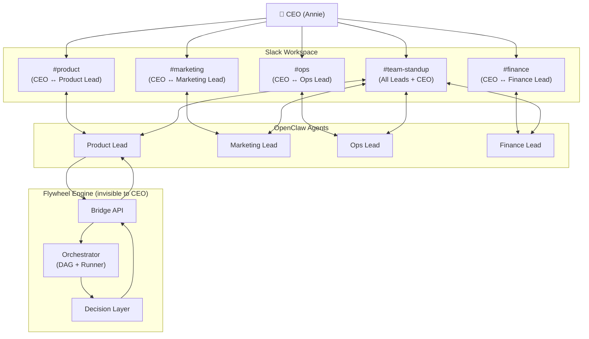
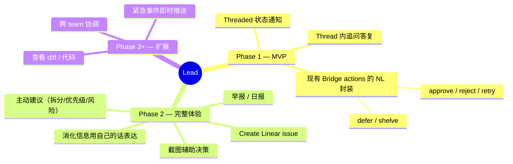
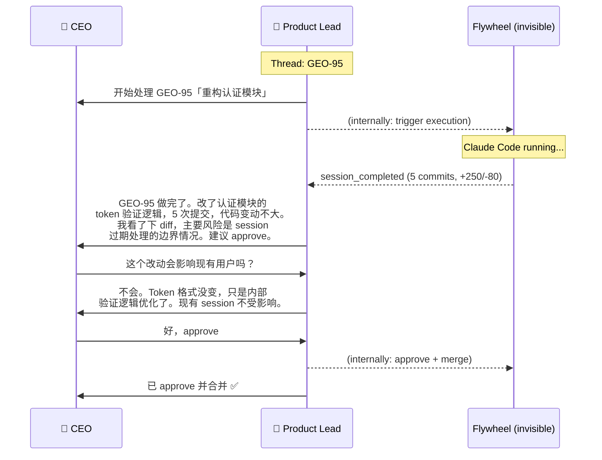
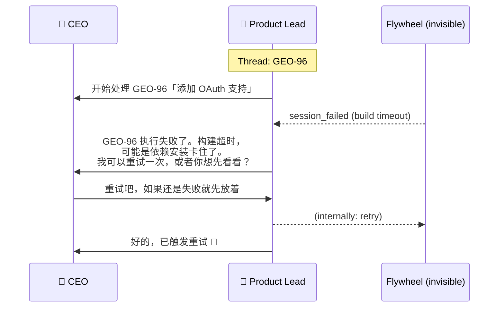
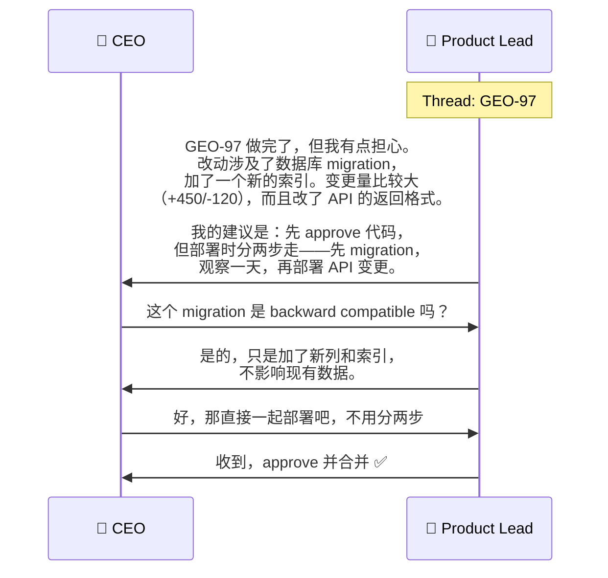
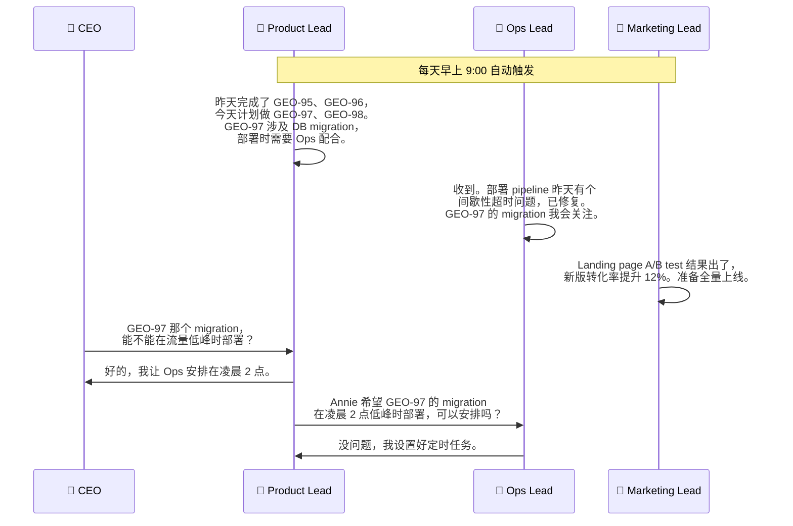
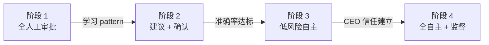
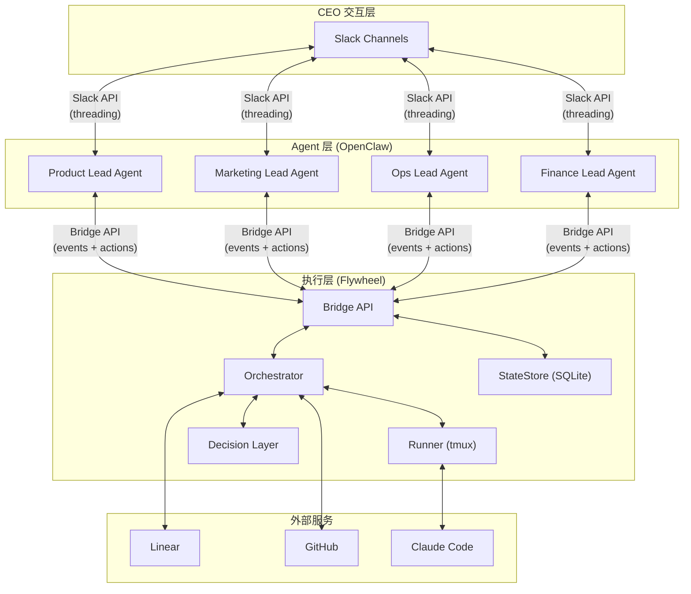
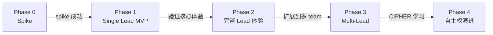
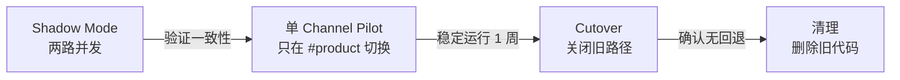

# v1.0 Lead Experience — 产品愿景与交互模型

## 背景

### 当前状态（准确基线 — 2026-03-08）

Flywheel v0.5 已实现完整执行链路，并且 v0.6 的 Slack threading 基础设施已部分落地：

```
Linear issues → DAG → Claude Code sessions → auto PR → Decision Layer → Bridge API → OpenClaw + Slack
```

**已实现的能力**（代码已有、测试通过）：

| 能力 | 实现位置 | 状态 |
|------|----------|------|
| Bridge 直接 Slack posting（带 threading） | `event-route.ts:252-274` | ✅ 运行中 |
| `slack_thread_ts` 存储于 session | `StateStore.ts` session 表 | ✅ 运行中 |
| `conversation_threads` 表 | `StateStore.ts:162-173` | ✅ 存在但未接入主链路 |
| `sessionKey` 传给 OpenClaw | `event-route.ts:279-281` | ✅ 运行中 |
| `formatNotification()` 中文输出 | `event-route.ts:27-51` | ✅ 16 个测试 |
| OpenClaw hook mapping `deliver: false` | `~/.openclaw/openclaw.json` | ✅ 已配置 |
| `allowRequestSessionKey: true` | `~/.openclaw/openclaw.json` | ✅ 已配置 |
| Bridge actions（approve/reject/defer/retry/shelve） | `actions.ts` | ✅ 运行中 |
| Session query API | `tools.ts` | ✅ 运行中 |

**当前 UX 问题**：

- **Flavio**（Bridge bot）发 threaded 通知，但不能对话
- **OpenClaw product-lead** 收到事件（`deliver: false`）建立上下文，但不发 Slack 消息
- CEO 看到 Flavio 发的通知，但无法在 thread 里和它对话
- 如果 CEO 直接 @product-lead 问问题，agent 有上下文但回复是独立消息，不在 thread 内

**未迁移的相邻路径**：

| 路径 | 当前状态 | 问题 |
|------|----------|------|
| `StuckWatcher` | 仍用 `/hooks/agent`（不是 `/hooks/ingest`），无 `sessionKey` | 通知不会进入 issue thread |
| Action responses | Bridge API 返回 JSON，不通知 Slack | CEO 在 Slack 里看不到 action 结果 |
| 手动对话入口 | CEO 可 @product-lead 直接对话 | 对话不在 issue thread 内 |

### 核心问题

技术实现跑在了产品设计前面。我们先解决了"怎么发通知"，却没有想清楚"用户体验应该是什么"。

**正确的顺序**：先定义产品交互模型 → 再决定技术架构。

---

## 产品愿景

### 一句话

> CEO 和每个 Team Lead（LLM agent）在 Slack 里对话，就像和真人 team lead 交流一样。
> Flywheel 是后台引擎，CEO 永远不需要知道它的存在。

### 整体架构



### 核心原则

| # | 原则 | 含义 |
|---|------|------|
| 1 | **One Lead, One Channel** | 每个 channel 只有一个 Lead bot |
| 2 | **Lead 是完整角色** | 不是通知管道，是有记忆、有判断、能行动的 team lead |
| 3 | **Thread = Issue** | 同一个 issue 的所有交互在一个 Slack thread 内（按 `issue_id` 映射，`issue_identifier` 仅展示） |
| 4 | **自然语言交互** | CEO 用自然语言下指令，Lead 理解并执行 |
| 5 | **渐进式自主权** | 初期所有决策经 CEO，Lead 逐渐学习 pattern 后自主决策 |
| 6 | **Flywheel 不可见** | CEO 只看到 Lead，不感知底层执行引擎 |

**@mention 策略（Phase 1）**：已建立的 issue thread 内允许无 @mention 回复；channel 级消息仍需要 @mention Lead。后续 Phase 可演进为全 channel ambient listening，前提是有 thread-scope filtering 和权限约束。

---

## Lead 角色定义

### Lead 是什么

Lead 不是一个 chatbot，而是一个**有角色认知的 team lead**：

- **有上下文**：知道所有正在运行的 issue、历史决策、团队状态
- **有判断力**：完全消化信息后用自己的话表达，而不是转发原始数据
- **能行动**：approve PR、create issue、查 diff、发截图
- **有记忆**：记住 CEO 的偏好和过去的决策 pattern
- **会建议**：主动提出"这个 issue 太大了，建议拆分"

### Lead 的能力（分阶段）



### Lead 不做什么

- 不暴露底层系统细节（execution_id、event_type 等）
- 不用技术术语（除非 CEO 主动问技术细节）
- 不做没有依据的猜测

---

## 交互模型

### Issue 生命周期（从 CEO 视角）



### Interaction Resolution Contract

当 CEO 在 thread 里说"approve"时，Lead 需要一条确定性解析链把自然语言映射到 Bridge action：

```
thread reply → thread_ts → issue_id (via StateStore) → latest actionable execution → action endpoint
```

**解析规则（action-aware）**：

| 步骤 | 逻辑 | 失败处理 |
|------|------|----------|
| 1. thread → issue | `conversation_threads` 表反查 `thread_ts` → `issue_id` | "这个 thread 我找不到对应的 issue" |
| 2. 意图识别 | Lead（LLM）解析自然语言为 action type（approve/reject/retry/defer/shelve） | Lead 追问："你是想 approve 还是要我先看看？" |
| 3. issue → execution（action-aware） | 按 `issue_id` 查所有 session，根据 action type 的合法源状态筛选候选 execution | "这个 issue 目前没有可以 {action} 的执行" |
| 4. 执行 action | 调 Bridge API `/api/actions/{action}` with `execution_id` | "执行失败：{error}，需要我重试吗？" |
| 5. 确认 | Lead 在 thread 内回复结果 | — |

**Action Source Status Matrix**（与 `actions.ts:ACTION_SOURCE_STATUS` 保持一致）：

| Action | 合法源状态 |
|--------|-----------|
| `approve` | `awaiting_review` |
| `reject` | `awaiting_review` |
| `defer` | `awaiting_review`, `blocked` |
| `retry` | `failed`, `blocked`, `rejected` |
| `shelve` | `awaiting_review`, `blocked`, `failed`, `rejected`, `deferred` |

**关键原则**：`ACTION_SOURCE_STATUS`（`actions.ts`）是状态矩阵的**唯一来源**。Agent 和文档不维护独立的规则副本。Bridge 暴露 action-aware 解析 endpoint：

```
GET /api/resolve-action?issue_id={id}&action={action}
→ { execution_id, status, can_execute: true/false, reason?: string }
```

**边界情况**：

| 场景 | Lead 行为 |
|------|-----------|
| 同一 issue 有多次 execution | 按 action 合法源状态筛选后，取最新；如有歧义，Lead 列出让 CEO 选 |
| Stale command（issue 已 approved） | "GEO-95 已经合并了，不需要再操作" |
| 并发 approve（CEO 和 auto_approve 同时） | Bridge 的幂等性保证不会重复操作 |
| 非法状态转换 | "GEO-95 目前是 running 状态，还不能 approve"（来自 `resolve-action` 的 `reason`） |
| `blocked` execution + CEO 说 "retry" | ✅ 合法（`retry` 允许 `blocked`），Lead 执行 |
| `deferred` execution + CEO 说 "approve" | ❌ 不合法（`approve` 只允许 `awaiting_review`），Lead 提示 |

### 失败场景



### 复杂决策场景



---

## 信息架构

### Thread 策略

```
#product channel
├─ Thread: GEO-95 「重构认证模块」
│  ├─ Lead: 开始处理...
│  ├─ Lead: 完成，建议 approve
│  ├─ CEO: approve
│  └─ Lead: 已合并 ✅
│
├─ Thread: GEO-96 「添加 OAuth」
│  ├─ Lead: 开始处理...
│  ├─ Lead: 失败，构建超时
│  ├─ CEO: 重试
│  ├─ Lead: 重试中...
│  └─ Lead: 第二次成功，待审核
│
├─ [非 thread] Lead: 早报 ☀️ (Phase 2)
│  └─ 昨晚处理了 4 个 issue，2 个待审核...
│
└─ [非 thread] CEO: @Product Lead 帮我创建一个 issue... (Phase 2)
   └─ Lead: 已创建 GEO-99「...」
```

### Thread State — Source of Truth

**Bridge StateStore 是 canonical source of truth**，agent 只是消费它。

**两层存储模型**：

| 层级 | 表 | 映射键 | 用途 |
|------|-----|--------|------|
| **Issue 级（primary）** | `conversation_threads` | `issue_id` → `thread_ts` + `channel` | 同一 issue 多次 execution 复用同一 thread |
| **Execution 级（snapshot）** | `sessions.slack_thread_ts` | `execution_id` → `thread_ts` | 快速查询当前 execution 的 thread |

`conversation_threads` 是 issue→thread 映射的**唯一真相源**。`sessions.slack_thread_ts` 是 execution 级快照，方便快速查询，但不作为映射依据。

**为何不用 agent memory**：Agent memory 不可靠（难以 debug、恢复、重试），且与 Bridge 的 execution state 不同步。Bridge 已有完整的 session/thread 数据结构，agent 通过 Bridge API 查询即可。

**Agent → Bridge 回写合同**：

当 agent-owned Slack posting 生效后，agent 创建/使用 thread 时必须回写到 Bridge：

```
POST /api/threads/upsert
{
  "thread_ts": "1709901234.000100",
  "channel": "CD5QZVAP6",
  "issue_id": "issue-123",
  "execution_id": "exec-456"  // optional, for snapshot update
}
```

Bridge 收到后：
1. 写入/更新 `conversation_threads`（issue 级 mapping）
2. 如果提供了 `execution_id`，同时更新 `sessions.slack_thread_ts`（execution 快照）

Phase 1 需要新增的 Bridge API：

| Endpoint | 用途 |
|----------|------|
| `POST /api/threads/upsert` | Agent 回写 thread state |
| `GET /api/thread/:thread_ts` | 反查：`{ issue_id, issue_identifier, latest_execution, status }` |
| `GET /api/resolve-action` | Action-aware execution 解析（见 Interaction Resolution Contract） |

### 汇报机制

| 类型 | 频率 | 内容 | 形式 | Phase |
|------|------|------|------|-------|
| **Issue 更新** | 每次状态变化 | 开始/完成/失败/阻塞 | Thread reply | 1 |
| **早报** | 每天早上 | 昨晚跑了多少、待审核、失败汇总 | Channel message（非 thread） | 2 |
| **日报** | 每天晚上或定时 | 今天完成了什么、效果如何、截图 | Channel message | 2 |
| **紧急事件** | 即时 | 严重失败、需要立即关注的 | Channel message + 可能 @CEO | 2 |

### 初期 vs 后期

| 维度 | 初期 | 后期 |
|------|------|------|
| 状态通知 | 每次变化都发 | Lead 自己判断是否值得打扰 |
| 决策 | 所有 ship/approve 必须经 CEO | Lead 学习 pattern 后自主决策 |
| Issue 创建 | 跨 team 任务先问 CEO | Lead 自己创建并执行 |
| 汇报 | 所有操作都出现在日报 | 只报异常和重要决策 |

---

## 跨 Team 协作

### #team-standup Channel



### 跨 Team 沟通规则

| 场景 | 行为 |
|------|------|
| **紧急** | Lead 直接在 #team-standup 发起沟通 |
| **非紧急** | 等每天 standup 时提出 |
| **需要创建 issue** | 初期先问 CEO → 后期自行创建 |
| **冲突/分歧** | 在 standup channel 讨论，CEO 可介入 |

---

## 渐进式自主权

### 演进阶段



| 阶段 | Lead 行为 | CEO 参与度 | 监督 |
|------|-----------|-----------|------|
| **1. 全人工审批** | 执行 → 汇报 → 等 CEO 决策 | 每个决策都参与 | 日报 |
| **2. 建议 + 确认** | 执行 → 给出建议 → 等 CEO 确认 | 确认/否决 Lead 的建议 | 日报 |
| **3. 低风险自主** | 小改动自动 approve，大改动问 CEO | 只参与重要决策 | 日报 + 异常报警 |
| **4. 全自主 + 监督** | Lead 自主决策，CEO 定期 review | 仅 review 日/周报 | 周报 + 异常报警 |

### 学习机制（CIPHER — 未来）

Lead 从 CEO 的历史决策中学习：

```
CEO approve 了 3 行 bug fix → pattern: "小 bug fix 可以自动 approve"
CEO reject 了涉及 DB migration 的 PR → pattern: "DB migration 需要人工 review"
CEO 说"部署时注意流量" → pattern: "大改动部署需要考虑时机"
```

日报/周报中体现所有自主决策，CEO 发现问题可以即时纠正。

---

## 技术架构分析

### 目标架构



### 当前架构 vs 目标架构

| 维度 | 当前 (v0.5 + v0.6 hybrid) | 目标 (v1.0) |
|------|---------------------------|-------------|
| Slack 发消息 | Bridge 直接发（Flavio bot），OpenClaw `deliver: false` | Lead agent 发（OpenClaw bot） |
| Threading | Bridge 管理 `thread_ts`，已有存储和测试 | Lead agent 管理 threading |
| 通知内容 | `formatNotification()` 中文模板文本 | Lead 完全消化后用自己的话 |
| CEO 回复 | 无法回复（Flavio 不理解） | Lead 理解并执行 |
| Actions | Bridge API endpoint（5 个 action） | Lead 理解自然语言后调 Bridge API |
| 记忆 | 无 | Lead 有 persistent memory |
| 汇报 | 无 | 定时早报/日报（Phase 2） |
| 跨 team | 无 | Standup channel（Phase 3） |
| StuckWatcher | 用 `/hooks/agent`，无 `sessionKey` | 统一走 Lead 通知路径 |

### OpenClaw 的角色

在目标架构中，**OpenClaw 是 Lead 的运行环境**：

- 每个 Lead = 一个 OpenClaw agent
- Agent 有 persistent session（记忆跨对话）
- Agent 有 tool use（调 Bridge API、Linear API、GitHub API）
- Agent 有 Slack binding（收发消息）
- Threading 由 agent 自己管理（通过 tool 调 Slack API）

### 关键 Gap（仅列真实未解决的）

| Gap | 描述 | 影响 | 解法方向 |
|-----|------|------|----------|
| **Agent 无 Slack posting tool** | OpenClaw agent 没有 `postToSlack` 自定义 tool | Lead 无法自己控制消息发送和 threading | 给 agent 添加 Slack posting tool（**需 Phase 0 spike 验证**） |
| **Hook session 无 reply context** | Hook-triggered session 中 agent 不能用 `send` tool | 收到 event 后无法主动回复 | 用自定义 Slack tool 绕过 send |
| **Thread 反查 API** | Agent 需要从 thread_ts 查到 issue 和 execution | 无法在 thread 内解析 CEO 指令 | Bridge 新增 `GET /api/thread/:ts` endpoint |
| **定时触发** | 早报/日报/standup 需要 cron 触发 | 无法定时汇报 | Cron → hook ingest（Phase 2） |
| **多 agent 对话** | Leads 之间在 standup channel 交流 | 无跨 agent 通信 | Standup channel + per-agent binding（Phase 3） |

**已解决的（不再是 gap）**：
- ✅ `sessionKey` 传递（已实现并测试）
- ✅ Threading 基础设施（Bridge 已有 `slack_thread_ts` 存储、`postToSlack()` 函数）
- ✅ 中文通知格式（已有 16 个测试）
- ✅ `conversation_threads` 表结构（已存在，待接入）

### Migration Inventory

迁移到 v1.0 需要处理的所有路径：

| 路径 | 当前实现 | 目标 | Phase |
|------|----------|------|-------|
| `event-route.ts` Slack posting | Bridge 直接调 `postToSlack()` | Lead agent 通过 tool 发 | 1 |
| `event-route.ts` OpenClaw notify | `notifyAgent()` with `sessionKey`, `deliver: false` | 保留，agent 消化后自己发 Slack | 1 |
| `StuckWatcher` | `/hooks/agent`，无 `sessionKey` | 统一到 `/hooks/ingest` + `sessionKey` | 1 |
| Action responses | Bridge 返回 JSON，不通知 Slack | Lead 在 thread 内回复结果 | 1 |
| 手动对话 | CEO @product-lead 独立对话 | CEO 在 issue thread 内对话 | 1 |
| 早报/日报 | 无 | Cron → agent → channel message | 2 |
| Create issue | 无 | Lead 理解指令 → Linear API | 2 |
| 截图 | 无 | v0.5-remote-screenshot 接入 | 2 |
| Multi-Lead | 无 | 额外 agents + standup channel | 3 |

---

## 实现路线图

### 推荐分阶段



#### Phase 0: Technical Spike（前置验证）

**目标**：验证 agent-owned Slack posting 的可行性。在 Phase 0 通过前，不承诺 Phase 1 的任何 scope。

**退出标准**（全部满足才能进入 Phase 1）：

Outbound（agent → Slack）：
1. Bridge 发 hook event 后，product-lead agent 能在目标 Slack channel 中创建首帖（parent message）
2. 同一 issue 的后续 event → agent 能复用 thread（thread reply）
3. Agent 能从 Bridge API 查询 session 状态
4. Agent 创建 thread 后能通过 `POST /api/threads/upsert` 回写 thread state 到 Bridge
5. 进程重启后，thread 能恢复（不会创建新 thread）

Inbound（Slack → agent）：
6. CEO 在已建立的 issue thread 内回复（无 @mention）→ 消息能被 OpenClaw 路由到同一个 Lead agent
7. End-to-end action 链路跑通：CEO 在 thread 说 "approve" → Lead 解析 → 调 Bridge API → 在原 thread 回复结果

**关键阻塞验证**：退出标准 #6 依赖 OpenClaw 的 Slack ingress 配置。当前 `requireMention: true` 意味着 thread 内无 @mention 回复不会触发 agent。如果 OpenClaw 不支持 thread-scoped mention exemption，这是 Phase 1 的 **hard blocker**，不能留到 Phase 1 再发现。替代方案：CEO 在 thread 内仍需 @mention Lead（体验略差但可接受）。

**验证方式**：
- 给 product-lead agent 添加自定义 Slack tool（`postToSlack`）
- 或者验证 OpenClaw 是否已有/即将支持 agent-owned Slack posting
- 如果两者都不可行，评估替代方案（如使用 OpenClaw bot token 在 Bridge 里发消息）

**Spike 失败的 fallback**：
- 使用 OpenClaw 的 bot token 替代 Flavio 的 token（统一 bot identity）
- Bridge 仍然负责 posting，但消息看起来是 Lead 发的
- OpenClaw 负责对话（CEO 在 thread 回复时触发 agent）

#### Phase 1: Single Lead MVP

**前置条件**：Phase 0 spike 成功。

**目标**：Product Lead 成为 #product channel 里唯一的 bot，能发 threaded 通知、能在 thread 内对话、能执行现有 Bridge actions。

**Phase 1 Committed Capabilities**（仅此三项）：
1. **Threaded status notifications**：session_started/completed/failed → issue thread 内通知
2. **Thread 内追问答复**：CEO 在 thread 里问问题，Lead 有上下文回答
3. **现有 Bridge actions 的 NL 封装**：CEO 说"approve"→ Lead 解析 → 调 Bridge API

**Cutover 策略**（安全迁移）：



| 阶段 | 行为 | 回滚 |
|------|------|------|
| **Shadow Mode** | Lead 和 Flavio 同时发消息，对比内容和 threading。Flavio 仍是 primary。 | 关闭 Lead posting |
| **Pilot** | #product channel 切换到 Lead only。Flavio 仍在后台运行但不发 Slack。 | 重新打开 Flavio posting |
| **Cutover** | 确认稳定后关闭 Flavio。 | 环境变量开关恢复 |
| **清理** | 删除 Bridge 的 `postToSlack()` 和相关代码。 | git revert |

**Shadow Mode 验证矩阵**：
- [ ] `session_started` → parent message + thread 创建
- [ ] `session_completed` → thread reply
- [ ] `session_failed` → thread reply
- [ ] `stuck` notification → thread reply
- [ ] 进程重启后 → thread 恢复
- [ ] retry/reopen → 复用 thread
- [ ] CEO thread reply → Lead 回复
- [ ] CEO "approve" → action 执行

**验证标准**：CEO 在 Slack 里只看到一个 bot，能完成完整的 issue 生命周期。

#### Phase 2: 完整 Lead 体验

- 早报 / 日报（cron → trigger agent）
- Lead 消化信息后用自己的话表达（不是模板文本）
- Lead 主动建议（issue 拆分、优先级排序）
- CEO 在 channel 里 @Lead 对话（非 thread），如"帮我创建 issue"
- 截图辅助决策（v0.5-remote-screenshot 接入）

#### Phase 3: Multi-Lead

- 额外 Lead agents（Marketing、Ops、Finance）
- #team-standup channel：定时 standup + 紧急沟通
- 跨 Lead 任务创建（先经 CEO 确认）
- 每个 Lead 的 channel binding

#### Phase 4: 自主权演进 (CIPHER)

- 从历史决策中学习 pattern
- 低风险操作自动执行
- 日报中体现自主决策供 CEO review
- CEO 可随时调整自主权级别

---

## 与 v0.6 Slack Threading 的关系

v0.6 探索文档分析了多个 threading 方案。在 v1.0 愿景下：

- **Option A-prime**（OpenClaw 管 thread）→ 方向正确，但不够——agent 还需要更多能力
- **Option E**（Bridge 管 delivery）→ 当前实现，但产品体验不对——CEO 看到两个 bot
- **v1.0 方向** → Agent 自己调 Slack API（Phase 1 的核心），不依赖 deliver 也不依赖 Bridge
- **Spike fallback** → 如果 agent 无法自己发 Slack，用统一 bot identity + Bridge posting（仍是一个 bot 的体验）

v0.6 的 threading 基础设施可复用：
- `slack_thread_ts` session 字段和存储逻辑
- `conversation_threads` 表
- `postToSlack()` 函数（Phase 0 fallback 场景）
- `formatNotification()` 中文格式（作为 agent 生成内容的 fallback/参考）
- 16+ 个测试

---

## 开放问题

1. **Agent Slack tool**：OpenClaw agent 是否支持自定义 tool？如果支持，给 agent 一个 `postToSlack` tool 就能解决 threading 问题。如果不支持，需要研究替代方案。（**Phase 0 核心问题**）

2. **Hook → agent → Slack 回路**：当 Bridge 发 event 给 agent（via hook），agent 消化后想发 Slack message，这条路径需要怎么走？agent 用 tool 调 Slack API？还是 Bridge 代发？

3. **Agent 的 Slack 消息监听**：CEO 在 thread 里回复后，agent 怎么收到这条消息？是通过 OpenClaw 的 Slack binding（Socket Mode）？还是需要额外的监听机制？

4. **定时触发**：早报/日报/standup 的 cron 触发机制。Flywheel cron → hook ingest？还是 OpenClaw 内置 scheduler？（**Phase 2**）

5. **Multi-agent standup**：多个 agent 在同一个 channel 交流，OpenClaw 怎么处理？每个 agent 独立发消息？还是需要一个"facilitator" agent 协调？（**Phase 3**）

6. **Bot identity**：所有 Lead 共用一个 Slack bot（通过 display name 区分）？还是每个 Lead 一个独立的 Slack bot？（**Phase 3**）

---

## 附录：CEO 一天的使用场景

### 早上 9:00

```
#product
Product Lead: ☀️ 早报
  昨晚处理了 4 个 issue：
  - GEO-95 ✅ 已完成，待你审核
  - GEO-96 ✅ 已完成，待你审核
  - GEO-97 ❌ 构建失败，已自动重试中
  - GEO-98 🔄 还在跑

  需要你关注的：GEO-95 和 GEO-96 待审核。
```

### 9:15 — CEO 审核

```
#product → Thread: GEO-95
CEO: 看了下，这个改动 ok
Product Lead: 收到，approve 并合并 ✅

#product → Thread: GEO-96
CEO: 这个 diff 有点大，能给我看下截图吗？
Product Lead: [截图] 主要改动在这几个文件...
CEO: 行，approve
Product Lead: 已合并 ✅
```

### 9:30 — Standup

```
#team-standup
Product Lead: 早上好。昨天完成 2 个 issue，今天计划做 GEO-99 和 GEO-100。
             GEO-100 需要 Ops 配合部署新的环境变量。
Ops Lead: 收到，我准备好环境变量配置。
CEO: GEO-99 优先级调高，先做这个。
Product Lead: 好的，调整优先级，GEO-99 先开始。
```

### 下午 — CEO 想到新需求

```
#product
CEO: @Product Lead 帮我创建一个 issue，用户反馈说登录页加载太慢，需要优化
Product Lead: 已创建 GEO-101「优化登录页加载性能」，
             优先级设为 Medium。需要调整优先级吗？
CEO: 设成 High
Product Lead: 已更新为 High，排在 GEO-100 之后。
```

### 晚上 — 日报

```
#product
Product Lead: 📊 日报
  今天完成：
  - GEO-95 ✅ 合并（认证模块重构）
  - GEO-96 ✅ 合并（OAuth 支持）
  - GEO-99 ✅ 合并（API 性能优化）

  进行中：
  - GEO-97 🔄 重试后成功，待审核
  - GEO-100 🔄 还在跑
  - GEO-101 📋 已排期

  今日代码变动：+850/-320，12 个 PR
```
