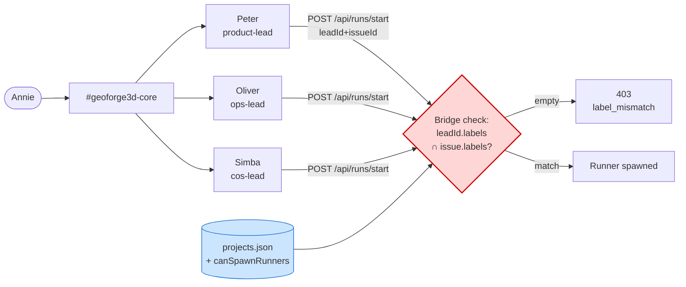
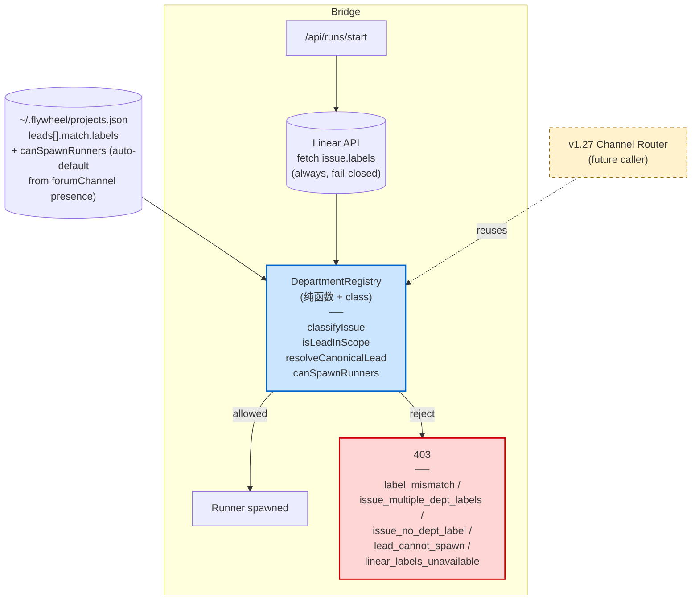
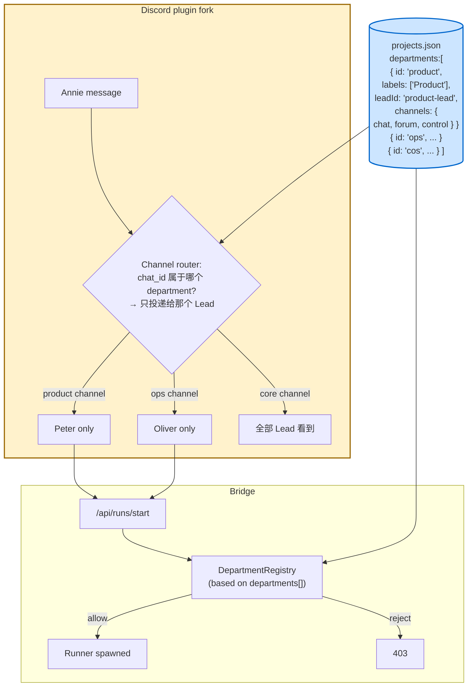
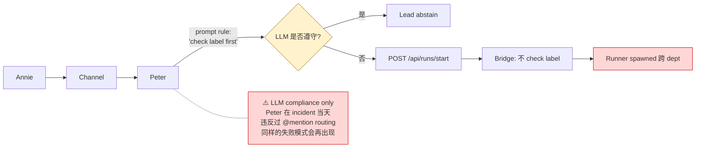

# Exploration: FLY-127 Department Scope Architecture Options

**Issue**: FLY-127
**Date**: 2026-05-05
**Status**: Draft — awaiting Annie pick before plan finalization

> 这份文档列 4 个 architecture option (A/B/C/D)，提供 trade-off 比较和推荐，方便 Annie 选定方向后再进 plan + Codex review + implement。
> 每个 option 配 Mermaid 图；HTML render 在 `/tmp/fly-127-architecture-options.html`，Annie 直接看可视化对比，不用读代码块。

## 1. 背景

2026-05-05，Annie 在 `#geoforge3d-core` 派 GEO-366 + GEO-101 给 Oliver, GEO-371 给 Peter。结果 Peter 还 spawn 了 Oliver 的两个 issue 的 Runner — 跨部门 spawn。

根因 (审计):
- `~/.flywheel/projects.json` 里 lead 的 `match.labels` 已经定义了 department 归属，但
- Bridge `/api/runs/start` (runs-route.ts:91-104) 只校验 `leadId` 是否属于 project，**不**校验 lead 的 labels 与 issue.labels 是否相交
- `.lead/shared/department-lead-rules.md` 里 Peter/Oliver 看到 "run GEO-XX" 就直接 POST，**没有 department scope check**
- Core channel routing 规则只看 @mention，不看 issue 归属

PR #202 (rules-only) 试图用 prompt 规则解决，Annie 评估 fragile / LLM-dependent，要求 architectural fix。

## 2. Annie 的 invariants

- **Linear issue → 1 department** (label-driven)
- **Lead → 1 department** (config-driven)
- **Channel → 1 department** (config-driven, 当前半结构化)
- **加新 department = config edit + start Lead daemon** (不改 prompt，不重启所有 Lead)
- **Bridge hard-enforce**, prompt rules 至多是 UX 层 fail-safe

## 3. 选项

### Option A — Minimum: Server-side hard check (仅修 spawn 路径)

**核心**: 给 `LeadConfig` 加 `canSpawnRunners?: boolean` 字段；`/api/runs/start` 在 dispatch 之前校验 `leadId.match.labels ∩ issue.labels`。失败 → 403 with `reason: label_mismatch | lead_cannot_spawn`。

**优点**:
- 最小 blast radius，~150 LOC + 单元测试
- 一个 PR 一个 sprint 能 ship
- 直接解决 incident

**缺点**:
- 没解决 multi-dept-label 的 issue (e.g. issue 同时挂 Product+Operations)
- 没有专门 abstraction，未来加 channel router 还得重构
- 没改 Discord channel routing — Annie 要是把消息打到错误 channel，Lead 还是会处理 (Lead-side 路由是 rules)

### Option B — Hybrid: Server enforcement + DepartmentRegistry abstraction (推荐)

**核心**: A 之上加一个 `DepartmentRegistry` class (新文件 `packages/teamlead/src/department-registry.ts`)，提供:
- `classifyIssue(project, labels)` → `{none | one | many, leadIds}`
- `isLeadInScope(project, leadId, labels)` → `ScopeDecision { allowed, reason, canonicalLeadId }`
- `resolveCanonicalLead(project, labels)` (替代 `resolveLeadForIssue` 用于 spawn 授权)
- `canSpawnRunners(project, leadId)`

`runs-route.ts` 用这个 registry 做权威判断；schema 校验保证 spawning lead 必须 exactly 1 个 dept label；multi-dept / no-dept / cannot-spawn 都有结构化 reason code。

**优点**:
- 真正的 abstraction，未来 channel router (v1.27) 直接复用 registry，不用再造一遍
- 多 label / 无 label issue 都有明确 fail-closed 行为，符合 invariant "1 issue → 1 department"
- Schema 强制 spawning lead 必须 1 label，防止"Lead → 多 department"配置漂移
- 一个 PR 一个 sprint，TDD 完整覆盖
- Codex Round 1 design review 已证实 directionally correct

**缺点**:
- 比 A 多一个文件 (~300 LOC 总量)
- 仍不修 Discord channel routing — 但本来 channel routing 是 v1.27 (FLY-126) scope，不混

### Option C — Full architectural: Departments first-class + Discord channel router

**核心**: B 之上把 department 升为顶级实体。`projects.json` 加 `departments: [{ id, labels[], leadId, channels: {chat, forum, control} }]`。Discord plugin fork 增加 channel router：消息根据 `chat_id` 落到对应 department，只投递给该 department 的 Lead — Annie 在 Operations channel 喊 Peter 也无效，因为消息根本不进 Peter 的 inbox。

**优点**:
- 满足全部三个 invariant，包括 channel → 1 department
- "加新 dept = 改 config" 严格成立 (Lead daemon + 一行 JSON 即可)
- 治标治本

**缺点**:
- Scope 大: ~700 LOC 跨 Bridge + Discord plugin fork
- Discord plugin fork (`~/.flywheel/discord-plugin-fork/` 之类) 的 patch 本来就 fragile (FLY-20 经验)
- 需要重构现有 LeadConfig 的 channel 字段 → 改 plugin.ts、test fixture、生产 config 全套
- v1.26 一个 sprint 做完风险高
- 包含了 FLY-126 (reply routing) 的 scope，team-lead 已说 FLY-126 deferred，混进来不好做对

**Sprint 切分建议**: C 拆 v1.26 + v1.27:
- v1.26 上 B (Bridge enforcement + Registry) — 解决 incident
- v1.27 上 C 的 Discord channel router (作为 FLY-126 的真正 fix) — 复用 v1.26 的 Registry

### Option D — Status quo: rules-only (PR #202, Annie REJECTED)

**核心**: 只在 `.lead/shared/department-lead-rules.md` 加 prompt 规则，让 Lead 自己查 label / abstain。Server 不变。

**优点**:
- 零 server 改动，最快 ship

**缺点 (Annie 关切)**:
- LLM compliance 不可靠
- Server 没有 truth, 无法追责 / 监控
- 加 dept = 改所有 Lead prompt，违反"config-only"
- **Annie 已 reject**

### "加新 department" 步骤对比 (4 选项)

```mermaid
flowchart TB
    subgraph TodayBlock["Today (baseline before fix)"]
        T1["1. 编辑 projects.json"] --> T2["2. 重启 Bridge"]
        T2 --> T3["3. 起新 Lead daemon"]
        T3 --> T4["⚠️ 4. 改所有 Lead prompt<br/>说明新 dept 的 label"]
        T4 --> T5["⚠️ 5. 重启所有 Lead daemon"]
    end
    
    subgraph AB["Option A & B"]
        A1["1. 编辑 projects.json"] --> A2["2. 重启 Bridge"]
        A2 --> A3["3. 起新 Lead daemon"]
        A4["✅ 不改 prompt<br/>✅ 不重启既有 Lead"]
        A3 --- A4
    end
    
    subgraph CBlock["Option C"]
        C1["1. 编辑 projects.json<br/>(departments[])"] --> C2["2. 重启 Bridge"]
        C2 --> C3["3. 起新 Lead daemon"]
        C4["✅ 不改 prompt<br/>✅ 不重启既有 Lead<br/>✅ Discord 自动路由"]
        C3 --- C4
    end
    
    subgraph DBlock["Option D (rejected)"]
        D1["1. 编辑 projects.json"] --> D2["2. 重启 Bridge"]
        D2 --> D3["3. 起新 Lead daemon"]
        D3 --> D4["⚠️ 4. 改所有 Lead prompt"]
        D4 --> D5["⚠️ 5. 重启所有 Lead daemon"]
    end
    
    style T4 fill:#ffd6d6,stroke:#cc0000
    style T5 fill:#ffd6d6,stroke:#cc0000
    style D4 fill:#ffd6d6,stroke:#cc0000
    style D5 fill:#ffd6d6,stroke:#cc0000
    style A4 fill:#d6f5d6,stroke:#0a7c0a
    style C4 fill:#d6f5d6,stroke:#0a7c0a
```

## 4. 比较矩阵

| Dimension | A (Server-only) | **B (Hybrid)** ⭐ | C (Full arch) | D (Rules-only) |
|-----------|:---------------:|:-------------:|:-------------:|:--------------:|
| Server hard enforcement | ✅ | ✅ | ✅ | ❌ |
| LLM compliance risk | low | low | low | **HIGH** |
| Multi-dept-label rejected | manual | ✅ | ✅ | ❌ |
| No-dept-label rejected | manual | ✅ | ✅ | ❌ |
| Channel routing fixed | ❌ | ❌ | ✅ | ❌ |
| 加新 dept = config-only | ✅ | ✅ | ✅ | ❌ |
| Code size | ~150 LOC | ~300 LOC | ~700 LOC | ~30 lines markdown |
| Test surface | small | medium | large | none meaningful |
| Sprint fit | v1.26 ✅ | v1.26 ✅ | v1.26 risky → suggest v1.27 | rejected |
| Bridge restart on deploy | yes | yes | yes | no |
| 既有 Lead daemon 重启 | no | no | no | yes (拉新 rules) |
| 触动 Discord plugin fork | no | no | **yes (high risk)** | no |
| FLY-126 (reply routing) coupling | independent | independent | **bundled** | independent |
| Future migration cost | rewrite for v1.27 | minimal (registry already exists) | done | full rewrite |

## 5. 推荐: Option B (Hybrid)

**理由**:

1. **完整满足本 incident 修复需要的 invariant 子集**: server-side hard enforcement + 1 issue → 1 department + 1 lead → 1 department。Channel routing 是另一个 ticket (FLY-126) 的 scope。
2. **Registry abstraction 给 v1.27 channel router 做铺垫**: C 不会被浪费 — v1.27 上 channel router 时直接 reuse `DepartmentRegistry`。
3. **Sprint scope 适中**: 一个 PR、~300 LOC、清晰 TDD、Codex review 有把握过。
4. **避开 Discord plugin fork 的高风险**: plugin fork patch (FLY-20 教训) 是另一种 fragile，混进 FLY-127 不值得。
5. **fail-closed 默认**: multi-dept / no-dept / cos-lead spawn / Linear API down 全部明确拒绝，不靠"沉默成功"。

C 不是错，只是**时机不对**。把 C 拆成 v1.27 单独 ship，把 v1.26 的 FLY-127 修干净。

## 6. 实施成本估算 (option B)

| 阶段 | 工作量 | 备注 |
|------|--------|------|
| Plan 定稿 + Codex design review | 30-45 min | 已有 R2 plan 草稿，等 Codex quota |
| TDD 实施 (registry + tests + runs-route) | 1.5-2.5 h | 8.1/8.2/8.3 测试集，~10 testfile cases |
| Codex code review (多轮) | 30-45 min | 经验上 1-2 轮 |
| GeoForge3D companion PR (5-line rule) | 15 min | 替代 PR #202 |
| Annie smoke test + ship | 15 min | 派 ops issue 给 Peter, 看 Bridge 403 |
| **总** | ~3-4 h | |

## 7. 风险

(option B 的风险列表 — A/C/D 略)

| Risk | Mitigation |
|------|------------|
| 现有 GEO/FLY issue 没 dept label → 突然 403 | Pre-merge audit (~18 GEO + ~55 FLY 当前 unlabeled per Codex Linear MCP); Annie 选 backfill or accept block |
| `loadProjects()` schema 收紧后, 历史 multi-label spawning lead 配置启动失败 | Production config 当前每个 spawning lead 1 label, 已验证。新 schema 在 dev 加一份 ProjectConfig.test 覆盖即可 |
| Bridge 重启风险 (常规 deploy 一次) | `restart-services.sh` 已是例行操作，不触发 cmux-sync 杀 Runner (FLY-110 已修) |
| Codex R2 又出 HIGH | R2 已 accept R1 全部 12 项 feedback，预期通过；如不过，amend plan 再 review |

## 8. 等待 Annie 决策

请 Annie 看 `/tmp/fly-127-architecture-options.html` (open 后呈现 Apple-style light theme + 4 个 Mermaid 对比 + 推荐)，选 A/B/C/D 之一 (或要求修改方案)。

选定后:
1. Plan finalize → `doc/engineer/plan/draft/v1.26.0-FLY-127-...-architecture.md` (B 的 plan 已草稿)
2. Codex design review (等 quota 9:14 PM PT 后 / 或 Annie 同意跳过 review 的 fast-path)
3. Implement TDD
4. Codex code review
5. PR + ship + Annie smoke test
