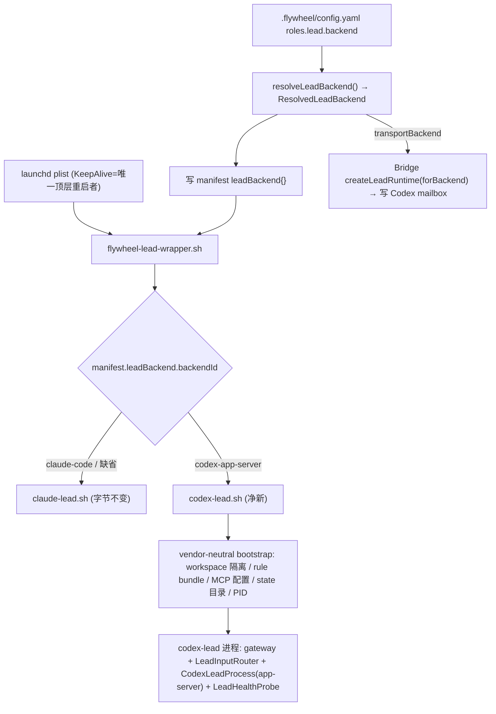

# FLY-224 Phase 0A — Contract Freeze (implementation entry gate)

**Issue**: FLY-224
**Date**: 2026-06-06
**Plan**: `doc/engineer/plan/inprogress/v1.37.0-FLY-224-vendor-pluggable-lead.md`
**Gate rule (Codex R6)**: 下列契约**评审通过前不写后续阶段代码**。本文件 = 设计冻结产物,无运行代码。

本文冻结 8 个契约:① `LeadBackendId` + `ResolvedLeadBackend` + manifest 字段;② 启动链调用图;③ journal 状态机;④ canonical Discord sender endpoint;⑤ app-server server-request 逐方法矩阵 + 版本;⑥ supervision/重启所有权;⑦ correlation 链 + merge/ship 保证;⑧ MCP 自注入(独立成立,不依赖宿主个人配置)。

---

## ① LeadBackendId / ResolvedLeadBackend / manifest

```ts
// packages/config/src/types.ts (新增,与 ExecutorBackend 并列、不复用)
export type LeadBackendId = "claude-code" | "codex-app-server"; // 未来 + "gemini-*"

// .flywheel/config.yaml 的 roles.lead.backend 接受 LeadBackendId。
// 兼容别名(迁移):旧值 "claude"|"claude-tmux" → "claude-code";"codex"|"codex-tmux" → 报错提示
//   "Lead 不是 Runner executor;请用 codex-app-server"(executor 名不可用于 Lead,避免 R2#1 混淆)。
```

```ts
// packages/teamlead/src/lead-backends/types.ts (净新,唯一 TS 共享面)
export interface ResolvedLeadBackend {
  backendId: LeadBackendId;
  transportBackend: "claude-code" | "codex";   // EXECUTOR_TO_TRANSPORT 同形,但 Lead 维度
  mailboxTeamName: string;    // = `${projectSlug}__${leadId}`  (R3#1 防跨项目同名串线)
  mailboxAgentName: string;   // = leadId  (recipient 维度)
  configHash: string;         // rule-bundle + backend config 的 content hash
}
```

**precedence**(解析一次,写 manifest):`.flywheel/config.yaml roles.lead.backend` > `FLYWHEEL_LEAD_BACKEND` env > 默认 `claude-code`。

**manifest 新增字段**(`~/.flywheel/manifests/<lead>.json`,现有 schema 扩展,向后兼容 —— 无字段 = claude-code):
```jsonc
{
  "leadBackend": {
    "backendId": "codex-app-server",
    "transportBackend": "codex",
    "mailboxTeamName": "joycon__joycon-lead",
    "mailboxAgentName": "joycon-lead",
    "configHash": "sha256:…"
  }
}
```
**唯一身份贯穿**:`createLeadRuntime`、Codex receiver、`flywheel-comm` env、所有 dedupe/`flywheelId` **都读 manifest 的 `mailboxTeamName`/`mailboxAgentName`**,不再各自从 leadId 推。`MailboxLeadRuntime.buildFlywheelId()` 前缀含 `mailboxTeamName`。

---

## ② 启动链调用图(接进真链,不旁路)



`flywheel-lead-wrapper.sh` 现硬编码 `claude-lead.sh` → 改为读 `manifest.leadBackend.backendId` 分流;**claude-code 分支参数/env/manifest/MCP/PID/恢复一字节不变**(字节兼容回归测守卫)。

**vendor-neutral bootstrap 抽取清单**(从 claude-lead.sh 提到共享层):workspace 子目录隔离、rule bundle 生成(§rule)、MCP 配置生成、state/journal 目录、PID/supervisor 元数据。**Claude 专属留 claude-lead.sh**:Discord 插件 channels、PostCompact hook、`--append-system-prompt-file`、`--session-id`/resume、tmux。

---

## ③ Journal 状态机(事务型,SQLite/append-only;per `(projectName, leadId)`)

状态:`accepted → dispatching → dispatched → model_completed → output_pending → completed | ambiguous | dead_letter`

| 状态 | 何时写 | 携带 |
|---|---|---|
| `accepted` | 输入 durable 落盘(Discord msg / mailbox envelope) | inputId, source, idempotencyKey(Discord msgId / envelope seq) |
| `dispatching` | **发 `turn/start`/`turn/steer` 之前** | `clientCorrelationId`(= 将作 `clientUserMessageId`) |
| `dispatched` | `turn/start` 返回 | `turnId` |
| `model_completed` | 收到 `turn/completed` | — |
| `output_pending` | 回复交给 outbox 前 | outboxId |
| `completed` | outbox 确认送达(Discord msgId 回执) | discordMessageIds |
| `ambiguous` | 恢复时状态不可证明 | reason → 人工 |
| `dead_letter` | 永久失败 | reason |

**幂等**:`accepted` 用 idempotencyKey 去重(同一 Discord msg / envelope 不重复入队)。
**串行**:同 `(project, lead)` 单飞,一次一个 in-flight turn(忙时新输入 → `turn/steer` 或回队)。
**ack-after-accept**:Discord/mailbox 的 ack 只在 `accepted` 落盘后发(修现有 watcher callback-return-即-ack 丢消息)。
**恢复**:启动读 journal 未完成行 → `thread/read(includeTurns:true)` 对账 → 见 §⑦ 决策树。

---

## ④ Canonical Discord sender endpoint(新,非 `/api/chat-threads/send`)

```
POST /api/lead-outbound/send        (apiToken 必需)
req:  { projectName, leadId, channelId | threadId, replyTo?, text, idempotencyKey, shardIndex?, shardCount? }
resp: { discordMessageIds: string[], deduped: boolean }
```
Bridge 行为:
- 校验 `(projectName, leadId) → channel` 映射合法;选**对应 per-Lead bot token**。
- 每 shard:确定性 `nonce = hash(idempotencyKey, shardIndex)`,Create Message 设 `enforce_nonce=true`(Discord 对同 author 近数分钟同 nonce 返回已有消息而不新建)。
- **outbox row 在外部 POST 之前事务落盘**(nonce, status=pending);POST 成功 → status=sent + discordMessageId。
- 错误语义:`429` 退避重试;**分片部分成功** → 已成功 shard 不重发(按 nonce);**Bridge 重启** → 读 pending outbox,窗口内按 nonce 重试、超窗经 gateway/REST 对账、不可证明 → ambiguous(不盲发)。
- **同 idempotencyKey 重试** → 返回已存 discordMessageIds + `deduped:true`。

---

## ⑤ app-server server-request 逐方法矩阵(0.137.0)

固定:`thread/start` 传 `approvalPolicy="never"` + `sandbox`(Lead 用 `workspace-write` 或按角色;ship 走 founder 门不靠 sandbox)+ network policy;**不读各机 `~/.codex` 全局**。
**支持版本**:codex-cli `>=0.137.0 <0.138`(初始;preflight 对未知版本 **fail-closed**,扩范围需重验矩阵)。

| server request method | handler | 来源校验 | timeout | journal | 响应 | 未满足 |
|---|---|---|---|---|---|---|
| command/file/permissions approval | policy 自动应答(`never`→应不出现;出现则按固定 policy 拒/允) | thread 内 | 5s | 记 | 固定 decision | 拒 |
| user input request | **默认拒绝 → 转 durable Discord 新输入**(不阻塞 turn) | — | — | 记 | reject + 结束 turn | — |
| MCP elicitation | **默认拒绝**(不自动喂 secrets) | — | 5s | 记 | reject | — |
| dynamic `item/tool/call` | 按 MCP allowlist | — | 工具级 | 记 | 允/拒 | 拒 |
| `account/chatgptAuthTokens/refresh` | 见 §auth | — | — | 记 | 按 §auth | 受控退出 |
| attestation | 按需透传 | — | 5s | — | 透传 | — |
| legacy approval | 同 approval | — | 5s | 记 | 固定 | 拒 |
| **未知 method** | — | — | — | 记 | **有界 JSON-RPC error,绝不静默挂起** | — |

**auth token refresh**(共享 `CODEX_HOME` 长跑可用性边界):MVP 假设 **CLI 自管**(实测 app-server 进程自身刷新 auth.json);若 server 主动请求 client 提供 → 受控退出 + launchd 重起(下次 `thread/resume`)。长跑测试覆盖(>5h)。

---

## ⑥ Supervision / 重启所有权(唯一)

- **launchd = 唯一顶层 codex-lead 进程重启者**(plist `KeepAlive` + throttle)。
- **进程内**:`LeadHealthProbe` 只监 **app-server child**;child hang/不可恢复 → **受控退出整进程**(让 launchd 重起);不在进程内重启自己的顶层。
- **Bridge**:只**读** heartbeat/lease/launchd 状态并**告警**(`LeadAlertNotifier` 扩 process/gateway/thread 事件类型 + episode 去重 + 恢复通知);**绝不 kickstart**。
- **watchdog 隔离**:Bridge startup 注入 resolved backend,**过滤掉 codex-app-server leads 再构造现有 `LeadWatchdog`**(pane watchdog 只接 claude-code leads)。
- 健康信号:① child exit/重启计数 ② gateway 连接态/重连 age ③ `thread/read(includeTurns:false)` 有界超时 RPC;`turn/completed` age 仅 telemetry。状态:starting/healthy/degraded/down/recovering + 阈值 + restart budget + crash-loop 连续退出告警。

---

## ⑦ Correlation 链 + 恢复决策 + merge/ship 保证

**correlation**(用 app-server 正式字段,非杜撰 metadata):
`journal.clientCorrelationId` → `turn/start`/`turn/steer` 的 `clientUserMessageId` → `thread/read` userMessage item 的 `clientId`。两路径都验;某支持版本不回 `clientId` → preflight/集成 fail-closed 或降级正文 namespaced marker。

**恢复决策树**(读 journal 未完成行 + `thread/read(includeTurns:true)`):
- 行在 `dispatching` 且 thread 无对应 `clientId` 的 turn、无 tool 执行迹象 → 可安全 **re-issue** `turn/start`。
- 行在 `dispatched`/`active`/有 tool-started 但无法证明完成 → **`ambiguous` → 人工**,**绝不自动重跑模型**。
- 行在 `output_pending` → 只重发 output(经 outbox + nonce,不重跑模型)。

**merge/ship 保证(逐命令,Codex R5 精确化)**:
- **授权** = `verify-approval`(**只读** fail-closed:重核 `review_question_id` + structured approval + `approved_to_ship` + `pr_head_sha`;stale/错 head 拒;可重复验证;**不消费 merge**)。
- **执行** = best-effort:重试前**查 GitHub PR merged/mergeable postcondition**;provider 已 merged → **收敛成功不再执行**;不可证明 → **ambiguous 不盲重试**。**不号称 gate 提供 at-most-once**。
- Runner instruction(`flywheel-comm send`)= best-effort + 协议层 `[lead-instruction <id>]` 幂等吸收;任意 shell/MCP = best-effort + 记录风险。**不改 `flywheel-comm`**(Option B)。

---

## ⑧ MCP 自注入(独立成立 —— 不依赖宿主个人配置)

**约束**:**Codex Lead 不得依赖宿主 `~/.codex` 的 MCP**(宿主 = Annie 个人 MCP + 一条过期 Linear token,即 spike 首跑被拖挂的根因)—— 必须 task-scoped 自带有效凭证。(历史注:原挂在跨 issue FLY-230 "strip-host-MCP";FLY-230 已被 Annie 关闭(剥宿主对小噪音过重,简单解=重登 token),但本约束**独立成立**,与 FLY-230 无关。)

**契约**(镜像 `EdgeWorker.buildMcpConfig`"按任务注入有效凭证、不取宿主";Codex R7/R8 实测纠错后):
- **两层 + `-c` 启动(R8#1,`--profile` 实测对 app-server 不可用 → 0.137.0 报 "`--profile` only applies to runtime commands and codex mcp")**:
  - 共享 base `CODEX_HOME` = 干净、无宿主 MCP、只 auth/session + 安全公共 base;**绝不改宿主 `~/.codex/config.toml`**。
  - **唯一冻结启动形态** = `codex app-server --strict-config -c <非 secret MCP overrides…>`(**process-local,无共享文件 → 串身份风险消失**);`-c` 只含 command/args、env-var 名、`env_vars`、`enabled_tools`、timeout;**raw token 不进 argv,也不进 app-server child env**(只在 codex-lead parent/gateway,见最小权限段)。effective config hash 入 manifest `configHash`。可另落 `0600` audit artifact,但 app-server 不经它加载。
- **canonical argv builder(R8#2,§6.1/§6.7a/Phase 0A/`buildLeadSpawnConfig` consumer 全引用同一个)**:`buildCodexLeadMcpArgv(resolved, leadConfig)` → 确定性 `-c` argv。
- **provider 冻结表(R8#3,实测具体值)**:

  | server | 注入? | package@version | command/args(builder 解析后具体值) | builder 读的 env | enabled_tools | startup/tool timeout | required/degraded | health |
  |---|---|---|---|---|---|---|---|---|
  | discord | **否** | `mcp-discord-agent-comm@0.2.0` 仅 `discord_message`(send+expect_reply),**无 read/reaction 安全子集** | — | — | — | — | read 走 gateway、reaction 走受控 Bridge endpoint |
  | chrome-devtools | 是(env-gated) | `chrome-devtools-mcp@1.1.1` | `npx -y chrome-devtools-mcp@1.1.1 --browser-url=http://127.0.0.1:9222`(URL 由 builder 从 `FLYWHEEL_LEAD_CHROME_BROWSER_URL` 解析+校验后写**具体值**,**非字面 `$URL`**,R9#2);或 `--auto-connect` | gate=`FLYWHEEL_LEAD_CHROME_ENABLED`、url=`FLYWHEEL_LEAD_CHROME_BROWSER_URL`(builder 自读,**不**作 MCP argv 变量) | 全(Lead 自用浏览器) | startup 30s;tool timeout=unset(用 pinned default) | required=false,不可达→degraded | 连接探针 |

- **最小权限 child env(R9#1)**:Discord MCP 不注入 → app-server `spawn` child env **绝不含 Discord token**(模型起的 shell/tool 不可碰);Discord token 只在 codex-lead parent/gateway;canonical sender Bridge 侧自解。Chrome MCP 无 secret → 无 token `env_vars`。
- **可执行解析 + sanitized child-env 契约(R10#1,实测 `{CODEX_HOME}`-only → `codex`/`npx`/`node` 全 ENOENT;launchd PATH 窄,FLY-176 雷区)**:
  - Codex = 已验证绝对路径,复用 `flywheelCodexBin()`/`FLYWHEEL_CODEX_BIN`(`codex-home.ts`);**不裸 spawn `codex`**。
  - `npx` = 绝对路径或显式 allowlist `PATH`;**不硬编码** `/opt/homebrew`;preflight 验 executable + pinned package。
  - child env 完整键集 = `CODEX_HOME` + sanitized `PATH` + 确需 `HOME`/temp/CA/proxy;**Discord token 名显式 deny**。
  - `configHash` 覆盖 resolved executable + PATH policy + MCP command/args。
- 测试:**`env -i`/launchd-like 稀疏环境**真启 app-server + Chrome MCP(不靠交互 shell)、真 attach、**两 app-server child env 无任何 Discord token**、parsed MCP config **无 `$...` 字面**、**不含**宿主 MCP、raw token 不落盘/日志、chrome disabled 无 entry。

---

## 出 Phase 0A → 进 Phase 1 的条件
以上 ①–⑧ 经 review(team-lead / codex)确认无歧义 → 才开 Phase 1(`CodexLeadProcess` 协议客户端)。后续阶段顺序见 plan §7。
