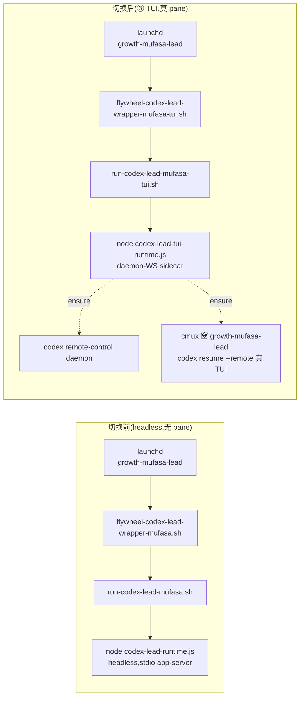

# Runbook: Mufasa ③ TUI 生产切换(FLY-259 PR-F)

**Issue**: FLY-259(Codex Lead cmux 真终端 — 与 Claude Lead 全对等,founder 可随时直接打字)
**Version**: v1.44.0
**Date**: 2026-06-15
**Plan**: `doc/engineer/plan/new/v1.44.0-FLY-259-codex-lead-real-terminal.md`
**基于**: PR-B #254 / PR-C #255 / PR-D #257 全 merge;runtime 代码已就位且 PR-D 构建期真机点亮过一次

---

## 0. 这是什么

把**生产 Mufasa** 从老的 FLY-224 headless runtime(无 pane)切到新的 **daemon-WS + 真 TUI runtime**:cmux 里出现窗口 `growth-mufasa-lead`,是 codex 进程亲自画的真交互终端,founder 能看它干活、随时直接打字;Discord 同时还通(同一个大脑、同一记忆)。read-only companion,**不做 write-capable**(FLY-245 fail-close 照旧)。

> ⚠️ **本切换 = ship = 不可逆生产动作,只能由 Annie 明确批准后执行。** 本 runbook 是工具 + 步骤交付;实现者/worker **绝不**自行执行切换、重启 Mufasa、或碰活进程。

### 启动链:切换前 → 切换后



**两条 runtime 共用同一个 state dir** `~/.flywheel/state/codex-lead/mufasa-lead`(thread-id 在这里)→ 切换/回切都**不丢记忆**(SP-2 延续)。

---

## 1. 红线

- **切换 = ship,gated on Annie 明确批准**。晚安/CI 绿/QA 过都不等于同意。
- 切换前整条链必须先在**隔离 slot** 跑完独立 QA(qa-fly-259,plan §9 全链)。
- 不可逆动作(停 headless、起 TUI、重启)由 Annie 拍板执行点,实现者不自行动手。
- 切换/回切只针对 label `com.flywheel.lead.growth-mufasa-lead` 与 Mufasa 的 wrapper/窗口,**绝不** pattern sweep 杀进程(别误伤其它 Lead/Runner/QA-slot)。

---

## 2. 切换前置(逐项核对,缺一不可)

| # | 前置 | 校验方法 | 缺了会怎样 |
|---|------|----------|-----------|
| **P1** | **growth/mufasa-lead 声明 codex backend**(S5 看门狗排除,PR-A′) | `~/.flywheel/projects.json` 的 growth → `leads[].backend: "codex-app-server"`(见 §2.1) | TUI pane 一上,Claude 形状识别器扫 codex pane → FLY-218/220 类误报刷屏 |
| **P2** | `~/.codex-mufasa` 装了 **standalone codex** | `[ -x ~/.codex-mufasa/packages/standalone/current/codex ]` | `ensure-daemon` fail-loud(npm codex 无 daemon 后端);TUI 起不来 |
| **P3** | `~/.codex-mufasa/config.toml` pin 合规 | `sandbox_mode="read-only"` + `approval_policy="never"`;`ensure-home` 缺则写、漂移则 fail-close | 安全 pin 不成立;或启动被 fail-close 挡 |
| **P4** | `~/.codex-mufasa/auth.json` 存在且新鲜 | Mufasa Codex 账号未过期(过期=`/codex-relogin` 那套) | daemon turn 报 auth 失败 |
| **P5** | **出站模式定了**(bridge ⊕ cross-dept,见 §2.2) | bridge:`.env` 有 `FLYWHEEL_BRIDGE_URL`+`FLYWHEEL_API_TOKEN` + Bridge 侧 mufasa 出站路由 + **未设 cross-dept**;direct:保 roundtable | 选错 → job 起不来 或 丢 roundtable 或 双发 |
| **P6** | 主仓已 build 出 TUI runtime | `[ -f packages/teamlead/dist/lead-backends/codex/codex-lead-tui-runtime.js ]`(merge 后 `pnpm -r build`) | launcher 报 "not built" |
| **P7** | 独立 QA 全 PASS | qa-fly-259 报 plan §9 全链 FINAL PASS | 未验证就切 = 违反纪律 |
| **P8** | **全局 `codex` 没被劫持进 Lead home**(FLY-513) | `python3 -c 'import os;print(os.path.realpath(os.path.expanduser("~/.local/bin/codex")))'` 必须**不在**任何 `~/.codex-*` 下(应是中立 `~/.local/share/flywheel-codex/<ver>/…`) | curl installer 副作用把全局 codex 指进 Lead home → standalone 自更新/flip churn 它 → **每个 runner 的 codex review gate 间歇挂**(blast radius ≥3 项目)。装完 standalone 后用 `ln -sfn ~/.local/share/flywheel-codex/<ver>/bin/codex ~/.local/bin/codex` 恢复中立全局 |

### 2.1 P1 — projects.json 声明 codex backend(看门狗排除的真源)

看门狗的**每-tick** pane 成员由 FLY-247 的 `filterPaneWatchedLeads` → `deriveDecision` 决定,**真源 = `~/.flywheel/projects.json` 的 `leads[].backend`**(不是 `.flywheel/config.yaml roles.lead.backend` —— 那是 legacy fallback,生产 growth 根本没那文件)。growth/mufasa-lead 现在**缺 `backend` 字段** → 默认 `claude-code` → Mufasa 被 watch。声明 codex 后才可能排除。

给 `~/.flywheel/projects.json` 的 growth → mufasa-lead 加一个字段(其余不动):

```jsonc
{
  "agentId": "mufasa-lead",
  // …现有字段保持不变…
  "canSpawnRunners": false,   // 已有
  "companion": true,          // 已有
  "backend": "codex-app-server"   // ★ 新增(PR-A′)
}
```

> **坑 / 合同(已被 `fleet-data.test.ts` 锁住)**:
> - **值是 `"codex-app-server"`**(ProjectConfig.ts:88-100 枚举 `claude-code|codex-app-server`)。**不是** `codex-tmux`(那是 legacy config.yaml 字段的值)。
> - **交叉校验(ProjectConfig.ts:91-93,FLY-245 fail-close)**:`codex-app-server` 只许出现在 read-only companion 上 —— 必须 `companion:true` **且** `canSpawnRunners:false`。growth/mufasa-lead 这俩**已有**,所以纯加 `backend` 一字段即合法。
> - **必要非充分(H8,`filterPaneWatchedLeads`)**:光声明 backend **不足以**排除。`deriveDecision` 还要 fleet poller 给出**新鲜 `paneWatch:false` 证据**(codex desire + 无 live-claude + 非 indeterminate → EXTERNAL → paneWatch:false)才排除;没新鲜证据 → **继续 watch**(漏报>误报 fail-safe)。所以验收必须**起着 Bridge/poller** 看实际排除,不能只看 config。
> - 验法(qa S8):对 6-Lead fleet 跑 `filterPaneWatchedLeads` → Mufasa 出局、其余 5 个 claude Lead **逐引用不变**(见 `fleet-data.test.ts` "FLY-259 cutover fleet" 测试)。

> **生效时机**:projects.json 在 Bridge **boot 时**读。改后需在某次 Bridge 重启窗才生效(Mufasa 切换本身不重启 Bridge —— 搭下次 Bridge 重启窗,或随别的 Bridge PR 攒重启)。在 TUI pane 真出现前生效即可。

### 2.2 P5 — 出站模式:bridge ⊕ cross-dept 二选一(Annie/team-lead 拍)

**bridge 和 cross-dept 频道互斥**:runtime 在 `crossDeptChannelIds>0 && outbound==bridge` 时**硬抛错拒启动**(FLY-267 R1 守卫 —— bridge 模式下共享频道回复会 403;server 端 cross-dept-over-bridge 是 FLY-267 follow-up,没做)。而生产 `~/.flywheel/.env` 带 FLY-267 的 `FLYWHEEL_LEAD_CROSS_DEPT_CHANNEL_IDS`,Mufasa **正在用 #leads-roundtable**。所以切换前必须二选一:

| 选项 | 得 | 失 | 怎么配 |
|------|----|----|--------|
| **direct**(launcher 默认,team-lead 拍) | 保 #leads-roundtable;= Mufasa 现状,**零回归**;今天就能跑 | 重启窗**可双发**(进程内去重,非 exactly-once;只读陪伴 Lead 低风险) | 不设 `OUTBOUND`(默认)或 `=direct`(.env 的 cross-dept 保留) |
| **bridge**(opt-in) | 出站 **exactly-once**(跨进程 durable 去重) | **丢 #leads-roundtable**(直到 server 端支持) | `OUTBOUND=bridge` + `BRIDGE_URL`/`API_TOKEN` + Bridge 侧 mufasa 出站路由 + **为该 Lead 去掉 cross-dept env** |

launcher **默认 `direct`**(team-lead 决定:零回归 + 保 Annie 在用的 roundtable;exactly-once 对只读陪伴 Lead 低风险)。bridge 是 opt-in,并**带 fail-loud 预检**:若 `OUTBOUND=bridge` 且 cross-dept 仍设 → 直接报错(不静默崩),提示二选一。**最终取舍由 Annie 在切换时拍**(team-lead 会在收尾 check-in 摆给她)。

> **真正的解 = FLY-267 server 端 cross-dept-over-bridge follow-up** —— 让 bridge 模式也能授权共享频道回复,bridge + roundtable 共存,这个取舍就消失了。在那之前 direct/bridge 二选一。

---

## 3. 切换步骤(Annie 批准后,按序;每步留证据)

> 顺序铁律(plan §8 / R1 HIGH-5):**先停 sidecar/TUI 证明无第二 owner,再动 thread**。这里是 headless→TUI,等价于「先确保只有一个 owner 在写 thread」。

1. **装前置工具**(一次性):
   - 备份现 headless plist(**必须 `cp -n` 不可覆盖** —— 回切脚本依赖这个备份是 headless 版;重跑切换若用普通 `cp` 会把 TUI plist 覆盖进备份 → 回切变 no-op,Codex R1 HIGH):
     ```bash
     cp -n ~/Library/LaunchAgents/com.flywheel.lead.growth-mufasa-lead.plist \
           ~/Library/LaunchAgents/com.flywheel.lead.growth-mufasa-lead.plist.pre-FLY-259-tui.bak
     ```
     (回切脚本会校验这个备份确实指向 headless wrapper、不是 `-tui` wrapper,不符直接 fail-loud。)
   - 装 TUI wrapper:`cp packages/teamlead/scripts/templates/flywheel-codex-lead-wrapper-mufasa-tui.sh ~/.flywheel/bin/ && chmod +x ~/.flywheel/bin/flywheel-codex-lead-wrapper-mufasa-tui.sh`。
   - 核对前置 §2 全绿(尤其 P2 standalone / P3 pins / P5 出站模式决定 §2.2)。
2. **干跑校验**(零副作用,不碰活 Mufasa;默认 direct,无需 bridge env):
   ```bash
   FLYWHEEL_LEAD_DRY_RUN=1 /bin/bash packages/teamlead/scripts/run-codex-lead-mufasa-tui.sh
   ```
   看 report 里 stateDir=`…/mufasa-lead`、outbound=direct、runtime=tui;**dry-run 不 ensure-home/不起 daemon**。(若选 bridge:`FLYWHEEL_CODEX_LEAD_OUTBOUND=bridge FLYWHEEL_BRIDGE_URL=… FLYWHEEL_API_TOKEN=…` 且 .env 已 unset cross-dept。)
3. **停 headless Mufasa**(KeepAlive 会自起,必须 bootout)。**用精确 launchd job PID 确认退出,别用 `pgrep -f codex-lead-runtime`**(它匹配整个 fleet 的每个 Codex Lead,证不了 Mufasa 这一个退了):
   ```bash
   L=com.flywheel.lead.growth-mufasa-lead
   PID=$(launchctl print "gui/$(id -u)/$L" 2>/dev/null | sed -n 's/^[[:space:]]*pid = \([0-9]*\).*/\1/p' | head -1)
   launchctl bootout "gui/$(id -u)/$L"
   # 等这个 PID 真退(精确,非 fleet pattern):
   while [ -n "$PID" ] && kill -0 "$PID" 2>/dev/null; do sleep 1; done
   echo "headless Mufasa (pid ${PID:-none}) exited — 无第二 owner 在写 thread"
   ```
4. **装 TUI plist + 起 TUI job**:
   ```bash
   cp packages/teamlead/scripts/templates/com.flywheel.lead.growth-mufasa-lead.tui.plist \
      ~/Library/LaunchAgents/com.flywheel.lead.growth-mufasa-lead.plist
   launchctl bootstrap gui/$(id -u) ~/Library/LaunchAgents/com.flywheel.lead.growth-mufasa-lead.plist
   ```
5. **验证上线**(§4)。

---

## 4. 切换后验证清单

- [ ] cmux 出现窗口 `growth-mufasa-lead`,是真 codex TUI(可手动打字)。
- [ ] **记忆延续**:在 #mufasa 问一句承上文的,Mufasa 记得(thread-id 未变 = `cat ~/.flywheel/state/codex-lead/mufasa-lead/thread-id` 与切换前逐字一致)。
- [ ] Discord round-trip:#mufasa 发消息 → 出站回复 + TUI 窗同步可见(同一对话)。
- [ ] **(仅 bridge 模式)出站 exactly-once**:同消息重放不双发(bridge sender)。direct 默认模式跳过这条(进程内去重,已知重启窗可双发,§6)。
- [ ] founder 在 TUI 打字与 Discord 来的机器轮交错不串台(TurnDemux 分流)。
- [ ] **S5 看门狗零误告警**:观察 ≥30min,Mufasa 的 codex pane 不触发 frozen/usage/rate_limit 误报(靠 P1 排除)。
- [ ] persona 是 Mufasa 温暖陪练腔(不是工程腔)。
- [ ] write-capable fail-close:`FLYWHEEL_CODEX_LEAD_SANDBOX=workspace-write` 起 → 拒启动。

> 完整场景见 QA handoff `doc/qa/test-plans/FLY-259-codex-tui-qa-handoff.md`(S1–S10)。这些在 PR-F 切换前由 qa-fly-259 在隔离 slot 跑过;切换后只复验上面这几条「生产真线」关键项。

---

## 5. 回切(rollback,可瞬退)

记忆两边共享 state dir → 回切也不丢记忆。

```bash
# 先看计划(dry-run,什么都不动):
/bin/bash packages/teamlead/scripts/rollback-codex-lead-mufasa-tui.sh
# Annie 批准后执行:
/bin/bash packages/teamlead/scripts/rollback-codex-lead-mufasa-tui.sh --yes
```

脚本做:bootout TUI job → **验 TUI runtime 进程真退**(不 pattern-kill)→ 收 lingering tmux 窗(精确 `flywheel:growth-mufasa-lead`)→ 从 `…pre-FLY-259-tui.bak` 还原 headless plist → bootstrap headless → 验 headless 起来。**前置**:§3.1 的 plist 备份必须存在,否则 fail-loud 拒绝回切。

> **「可瞬退」资格**:plan §8 注 —— 只有 SP-2 反向(TUI 期间新增轮次 → headless app-server 反向兼容)也验过才算真「瞬退」;反向未验前,如实陈述「可回切但 TUI 期间新轮的反向兼容未保证」。

---

## 6. 出站模式说明(direct 默认 / bridge opt-in)

**direct 是 launcher 默认 + team-lead 拍的生产主路径**(零回归 + 保 #leads-roundtable;Mufasa 自己 bot token 直发 = 现状)。**唯一 caveat**:direct 进程内去重 → **重启窗可双发**(非 exactly-once;只读陪伴 Lead 低风险,已接受)。**bridge 是 opt-in 升级**(exactly-once),但与 cross-dept 互斥(§2.2)——选 bridge 须为该 Lead unset cross-dept + 配 Bridge 出站路由。两者最终取舍 Annie 切换时拍;真正消除取舍 = FLY-267 server 端 cross-dept-over-bridge follow-up。

---

## 7. 本次实现的两个关键设计发现(为什么 launcher 这么写)

1. **不走 `codex-lead.sh`(否则断记忆)**:`codex-lead.sh` 硬覆盖 stateDir 为自算 hex 路径(`growth__mufasa-lead-<hex>`),≠ headless 用的 `mufasa-lead`。裸走 → TUI 读不到旧 thread-id → 开新 thread → **记忆全丢**。故 `run-codex-lead-mufasa-tui.sh` 镜像 headless launcher、**钉死 stateDir=mufasa-lead**、直接 exec tui-runtime(与 headless 一样不经 codex-lead.sh)。PR-D 的 bring-up/QA 用一次性 lead-id 各拿全新 dir,是隔离需要;**生产真 Mufasa 必须保 dir**。
2. **PR-A′ 真源 = projects.json,不是 config.yaml**:看门狗排除的每-tick 真源是 FLY-247 的 `filterPaneWatchedLeads`→`deriveDecision`,读 `projects.json leads[].backend`(`.flywheel/config.yaml roles.lead.backend` 只是 legacy fallback,生产 growth 没那文件)。所以 PR-A′ = 给 projects.json 加 `backend:"codex-app-server"`(值不是 `codex-tmux`;交叉校验需 `companion:true`+`canSpawnRunners:false`,Mufasa 已有)。**H8 关键**:声明 backend 必要非充分 —— 还需 poller 新鲜 `paneWatch:false` 证据才真排除(漏报>误报)。机制+测试 FLY-247 #250 已具备(含 `fleet-data.test.ts` 的 mufasa-lead 用例 + 本 PR 加的 6-Lead cutover 场景)。
3. **bridge ⊕ cross-dept 互斥**(Codex R1 HIGH):runtime `crossDept>0 && bridge` 硬抛错;Mufasa 在用 #leads-roundtable,故 launcher 加 fail-loud 预检,bridge-vs-direct 取舍留 Annie 拍(§2.2)。
4. **rollback 安全**(Codex R1):按 launchd job 的精确 PID 判活(非 `pgrep -f codex-lead-runtime` 全 fleet 匹配)+ 校验备份是 headless plist + 钉死 `flywheel` tmux session + 精确 `=session:=window` 选择器。
