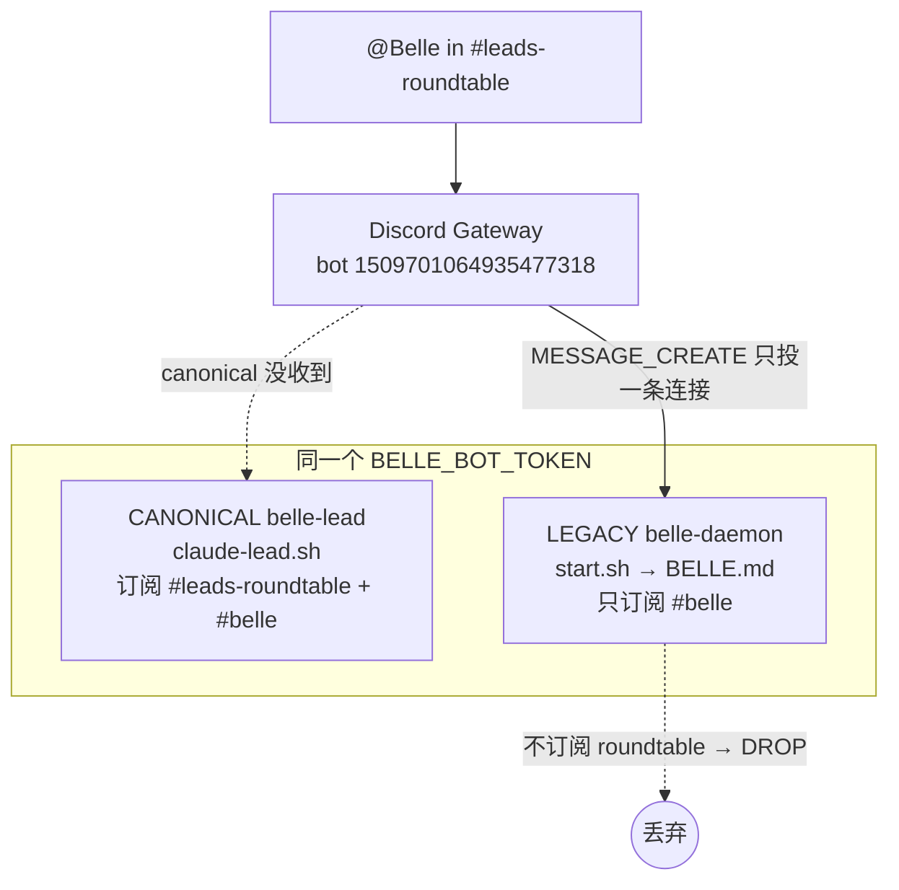

# Companion Lead 单进程纪律 — FLY-574

**Issue**: FLY-574 ([bug] Companion Belle: 单 token 跑两进程 (dual-Belle) + 重启后丢失 #leads-roundtable 订阅)
**URL**: https://linear.app/studio/issue/FLY-574
**Date**: 2026-06-25
**基于**: FLY-569 (roundtable reply-in-thread)、FLY-231/FLY-285 (Mufasa/Belle companion onboard)、FLY-282 (roundtable allowBots 自愈)

---

## 1. 根因 (Root Cause)

同一个 Belle Discord bot token（bot id `1509701064935477318`）被**两个独立 supervisor** 各开了一条
Discord gateway 连接：

| | CANONICAL（保留） | LEGACY（退役） |
|---|---|---|
| supervisor | launchd `com.flywheel.lead.personal-assistant-belle-lead` | launchd `com.xiaorongli.belle-daemon` |
| 启动链 | `flywheel-lead-wrapper.sh` → `claude-lead.sh belle-lead` | `belle/start.sh` → `tmux -L belle` → `claude … BELLE.md` |
| persona | companion 契约（`--agent belle-lead` + companion-safety-contract） | `BELLE.md`（personal-assistant 老 persona） |
| 频道 | `access.json` 含 `#leads-roundtable`（`1512578695468941333`）+ `#belle` | **只有 `#belle`** |
| KeepAlive | 是（flywheel 体系） | 是（whack-a-mole，kill 即 respawn） |
| 代码所在 | flywheel 仓 | `~/Dev/personal-assistant`（**非 git 仓**） |

**为什么会丢 roundtable**：一个 bot 开两条 gateway 连接时，Discord 把某条 `MESSAGE_CREATE`
只投递给其中一条连接。`#leads-roundtable` 的顶层 @Belle 落到了 **legacy** 那条（BELLE.md，不订阅
roundtable）→ 被丢弃；**canonical** belle-lead 的 agent loop 从未收到（pane 里没有、ctx 不变）。

> 这**不是** resume 没重新订阅的 bug。canonical belle-lead 每次（重）启动（含 `--resume`）都让
> Discord 插件重读 `access.json`，roundtable group 一直在里面 → 本就会重新订阅。问题 100% 出在
> dual-gateway 误投递。

`launchctl kickstart -k`（FLY-569 ship 时为加载新插件重启 prod Belle）只是 session 级动作；
legacy 的 plist 仍躺在 `~/Library/LaunchAgents`，`RunAtLoad=true`+`KeepAlive=true` →
**下次登录/reboot 会把 dual-Belle 复活**。这是潜伏复发点。

---

## 2. 修复 (Scope = A，Lead 拍板)

> Lead（Tadashi）拍板本 PR 只做 **A（单进程根治 + 闭 allowlist gap + 活体验证）**。
> 防御性的「给所有 companion roundtable 成员结构性保证 access.json 含 roundtable group」（B）
> 拆成独立 follow-up issue —— 它预防一个我们没真撞到的场景（companion 缺 group），是 structural
> 预防而非修本 bug。

### 2.1 永久退役 legacy belle-daemon

脚本：[`packages/teamlead/scripts/decommission-legacy-companion-daemon.sh`](../../../packages/teamlead/scripts/decommission-legacy-companion-daemon.sh)
（默认参数即针对 belle-daemon，但可复用于其它 companion 遗留 daemon）。

四步，幂等，默认 dry-run，`--apply` 执行，`--verify` 复核：

1. `launchctl bootout gui/<uid>/<label>`（session 级停；未加载则 no-op）。
2. **把 plist 移出 LaunchAgents** → `*.decommissioned-fly574.bak`（断掉 `RunAtLoad`，reboot 不再复活）。
3. **fail-close `belle/start.sh`**：先把原文备份到 `*.pre-fly574.bak`（仅一次），再替换成一个
   只打印「DECOMMISSIONED by FLY-574 + 指向 canonical」后 `exit 0` 的 inert stub
   —— 即便有人手动跑或某残留 plist 重载，它也绝不会再起第二个 Belle 进程。
4. `tmux -L belle kill-server`（杀 legacy tmux 会话）。

> 测试用 `LAUNCHCTL_BIN` / `TMUX_BIN` env seam 把 launchctl、tmux 全 stub 掉，plist / start.sh 都是
> 临时 fixture —— hermetic，绝不碰真系统。见
> [`__tests__/decommission-legacy-companion-daemon.test.sh`](../../../packages/teamlead/scripts/__tests__/decommission-legacy-companion-daemon.test.sh)（T1–T10）。

### 2.2 闭 #leads-roundtable allowlist gap

脚本：[`packages/teamlead/scripts/add-roundtable-allowfrom.sh`](../../../packages/teamlead/scripts/add-roundtable-allowfrom.sh)

把 Tadashi（`1516207680836866219`）+ Cass（`1516205086890786917`）的 bot id 加进
`~/.claude/channels/discord-belle-lead/access.json` 里 roundtable group（`1512578695468941333`）的
`allowFrom`。原子写（temp + rename）、先备份、幂等（不重复）、fail-closed（缺文件/缺 group/坏 JSON →
非零退出且不改文件）、**不碰任何其它字段**，且**拒绝创建不存在的 group**（那会悄悄订阅新频道，越界）。

**为什么这是活体验证的硬前提**（从插件 `gate()` 实证）：

- Discord 插件 fork `server.ts` 的 `messageCreate`（~1356 行）：bot 作者先过 `allowBots` intake 过滤
  —— Tadashi/Cass 都在 Belle 的 `allowBots` 里 ✓。
- 但 `gate()`（~675 行）：当某 group 的 `allowFrom` **非空**时，
  `allowFrom` 不含 sender → **直接 DROP，在 mention 检查之前**。这对 bot sender 同样生效。
- Belle 的 roundtable group `allowFrom` 是 7 条非空白名单、**不含** Tadashi/Cass →
  他们顶层 @Belle 现在收不到、不回。

> 结论：`allowBots` 只让 bot 过 intake，**per-group `allowFrom` 白名单仍拦**。所以不补 allowFrom，
> 即便单进程 Belle 也不会回 Tadashi 的 @。

**并发模型（Codex review 抠出）**：Discord 插件本身也写这个 `access.json`（temp+rename，如 DM-pairing
prune）。脚本用**乐观并发**：transform 当前内容 → swap 前再核一次文件未变（变了就 re-base 重试），把
clobber 窗口收到 rename 系统调用本身。**残余**（已记录、接受）：落在「最后一次核对」与 rename 之间
亚毫秒窗口的并发写无法从本侧消除 —— 这是两个 writer 无共享锁、同名 rename 的根本 TOCTOU，要彻底闭
需插件 fork 也加协作锁（越界，留 follow-up）。它被三点兜底：本编辑是**一次性、运维协调**的维护动作
（非 runtime 热路径）；插件仅在罕见 DM-pairing prune 时写；且每次先做带时间戳的备份，任何 clobber
可瞬间回滚。变更检测器用 `cksum`（locale 无关的 C 工具）而非 `shasum`（Perl，在本机默认
`LANG=C.UTF-8` 下 panic）。

`access.json` 是运行时 live 文件（不在仓里），故 2.1 的 plist/start.sh 改写与 2.2 的 allowFrom 编辑
都是 **live 操作**（带备份）；仓里交付的是**可复跑、有 hermetic 测试**的脚本 + 本文档。

### 2.3 真机活体验收

①②（脚本 `--apply` + allowFrom 补齐）执行完 + `ps` 确认单进程后：

1. `flywheel-comm ask` 让 Tadashi 在 `#leads-roundtable` **顶层 @Belle**。
2. 盯 belle-lead 的 pane + thread，确认：**收到** + **回进 auto-thread**、**单次**、**不在父频道**、
   BELLE.md 暖腔在。
3. F0 没真验到不报 PASS。

---

## 3. 红线

- **不碰 `#belle`**（canonical belle-lead 仍在 `#belle` + roundtable 正常服务）。
- **不复活老 daemon**（fail-close + plist 移出 = 结构性不可复活）。
- 退役是对 dormant 重复实例的**自启动**移除（执行时 legacy 并未在跑）；canonical belle-lead 全程不动。
- live 操作（移 plist / 改 access.json）均 Lead 协调下执行，带备份可回滚。

---

## 4. Follow-up（拆走，Lead 开 issue）

**B — companion roundtable 订阅结构性自愈**：扩展 FLY-282 的自愈机制（现仅自愈 `allowBots`，且把
「缺 group」当 not-member 直接 no-op），改成「configured roundtable 成员每次启动都保证 `access.json`
`groups` 含 roundtable channel（缺则补 `requireMention:true`）」。把验收点#2 从手维护变成结构性自愈，
对所有 companion 成员生效。属预防性 structural 改动，按 plan-first 单独走。
