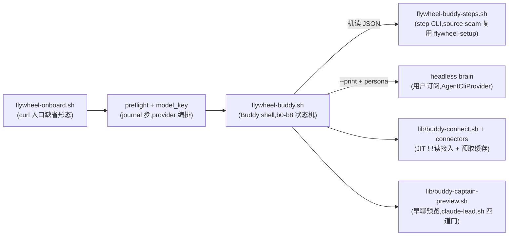

# FLY-1023 Buddy onboarding — 运维 runbook(Buddy 路)

Issue: FLY-1023(FLY-910 Buddy 全量 build)
日期: 2026-07-09
基于: engineering/doc/FLY-1023-buddy-onboarding-build/plan.md

> FLY-648 的交互向导(`flywheel-setup.sh` 直跑)不变、照旧可用;本章只讲 **Buddy 路** —— 客户机上那条 command 起的对话式 onboarding。

## 1. 入口与组成

- 状态根:`~/.flywheel/`(journal v2 `setup-state.json` / `.env` 0600 / `buddy-steps.log` 0600 / `buddy-cache/` 0600)。
- 与交互向导共用同一 journal;`version:2` 只是多了 `buddy` 区,交互模式照常读写 `steps`。

## 2. 常用运维动作

| 场景 | 动作 |
|---|---|
| 看进度 | `scripts/flywheel-buddy-steps.sh status` |
| 单步重跑 | `scripts/flywheel-buddy-steps.sh run <step-id>`(done 步先 re-verify,坏了才重跑) |
| 验证某步产物 | `scripts/flywheel-buddy-steps.sh verify <step-id>` |
| 看转人工摘要 | `~/.flywheel/support-summary-*.json`(已脱敏,可直接转支持) |
| 人工修复后放行 | `scripts/flywheel-buddy-steps.sh state set escalated false`,让用户重跑那条命令(从 cursor 续) |
| 只读拉业务数据 | `scripts/flywheel-connector.sh <shopify|veeqo|ordoro|imap> <probe|pull>` |
| demo 演示 | `FLYWHEEL_BUDDY_DEMO=1`(仅演示;缓存带 `demo:true`,北极星不算成功) |

## 3. 红线(排障时不许绕)

1. secret 只在 step/connector 进程内 hidden-TTY 读 → 0600 `.env`;journal / 日志 / brain 输入 / 支持摘要全程 secret-scan。**排障时不要把 `.env` 内容贴进任何对话/工单。**
2. 业务连接器只读(probe/pull);`flywheel-connector.sh` 不暴露 connect。
3. 用户面话术在 `scripts/buddy/copy/`,黑话词表有 lint 测试锁着 —— 改话术跑 `scripts/__tests__/flywheel-buddy.test.sh`。
4. merge/ship/runner-lifecycle 的运行期 gate(FLY-175)与本产品面无关、原样不动。

## 4. Lead 启动合同(M5-a 结论,排障速查)

Captain(claude-lead.sh)在客户机的四道启动门槛与闭合方式:

| 门槛 | 闭合 |
|---|---|
| `~/.flywheel/projects.json` 有该 project/lead | config 步产物;缺 → Buddy 诚实降级(早聊挪安置后) |
| `.lead/<id>/identity.md` | skeleton 步产物 |
| `~/.flywheel/bin/{check,update}-discord-plugin.sh` | repo 无源(GEO-296 运维件)→ **缺失时装 no-op 守卫桩(0700),绝不覆盖已有** —— 客户机 customer-mode,插件 fork 强制不生效(bot 互听类功能降级) |
| mailbox transport | 预览/客户机默认 `FLYWHEEL_COMM_BACKEND=commdb`(launcher 自带非致命路径) |

合同测试:`scripts/__tests__/flywheel-buddy-captain.test.sh`(真 launcher dry-run 出全 LAUNCH_PLAN 为准)。

**live 预览默认关**(`FLYWHEEL_BUDDY_PREVIEW_LIVE=1` 显式开,真机 QA 用):launcher 的 pane 环境机制会把 Captain 的钥匙值经 tmux 参数传递(全 fleet 既有形态),对客户产品违反「密钥不进命令行参数」红线 —— launcher 侧的 pane-env 参数卫生是独立 follow-up;修好前,缺省行为 = 早聊挪到安顿之后(plan 批准的诚实降级分支)。自定义 `--state-dir` 下预览直接拒绝(launcher 会在真 home 建目录)。

## 5. 真机 QA 清单(hermetic 之外,QA 阶段执行;plan §4)

1. 干净 VM(linux/WSL2)+ macOS 各一次全流程 founder-run(curl 入口 → 第一个产出)。
2. vendor 真 auth 实测:claude 官方安装/`--print`/`--resume`/`--append-system-prompt-file` 组合;gh device flow + `repo create`;Shopify custom app / Veeqo / Gmail app password 自助可得性(plan §8 清单)。
3. ≤60s 北极星真机计时(真店 + 真邮箱,「今天有没有卡住的单」)。
4. Captain 预览/常驻真机拉起(dry-run 合同之外的活体验证)+ 真 Lead 应答一条 ping。
5. WSL2 浏览器回环 + gh apt source 回归(FLY-648 已知项)。
