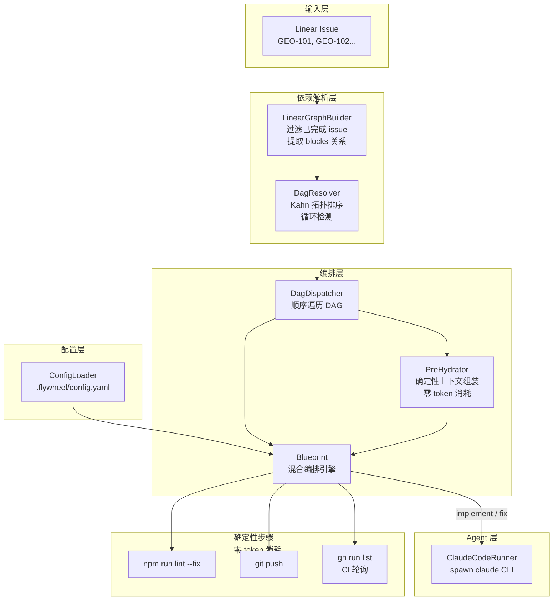
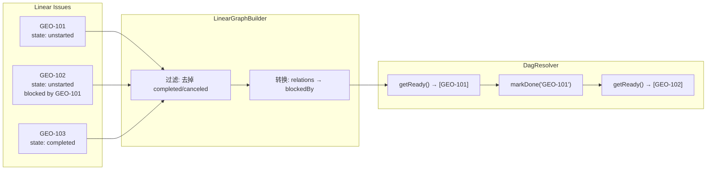
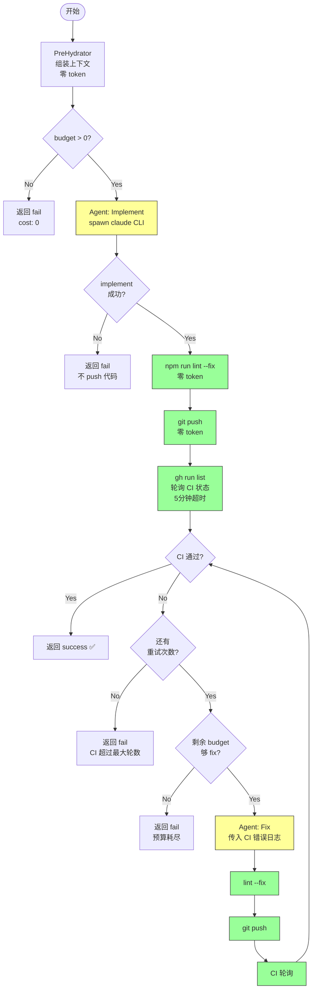
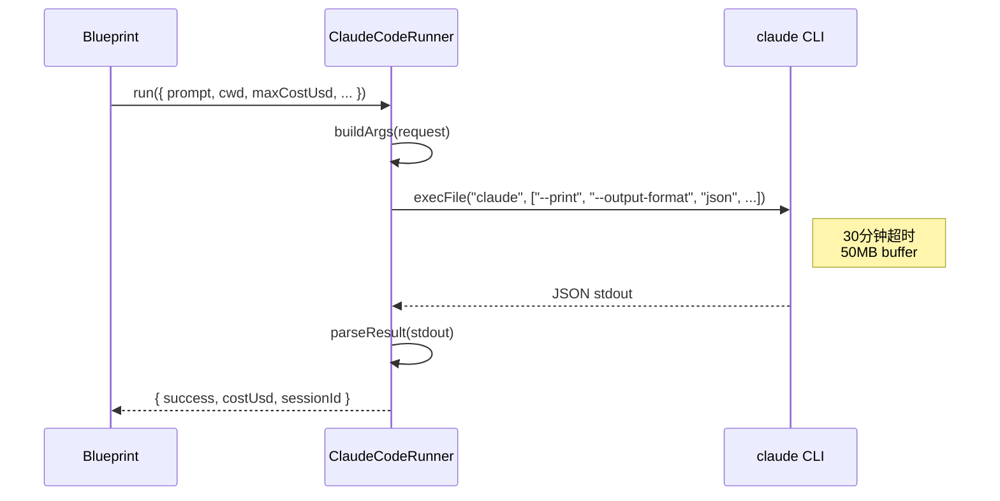
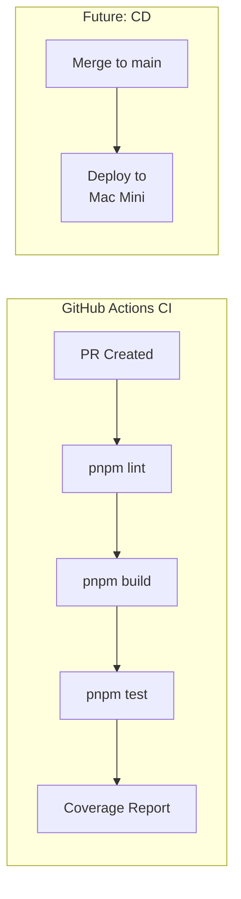

# v0.1.0 Core Loop — 实现说明

> PR #3: `feat/v0.1.0-core-loop`
> 日期: 2026-02-26

## 目标

实现 Flywheel 的核心自动化循环：

```
Linear issue → DAG 依赖排序 → Blueprint 编排 → Claude Code CLI → GitHub PR
```

一个 Linear issue 进来，Flywheel 自动写代码、跑测试、推代码、检查 CI，最终创建 PR。

## 整体架构



## 新增 / 修改的包

| 包 | 状态 | 作用 | 代码行数 |
|----|------|------|---------|
| `packages/dag-resolver/` | **新建** | DAG 拓扑排序 + Linear 转换 | ~530 行 |
| `packages/config/` | **新建** | YAML 配置加载与校验 | ~660 行 |
| `packages/edge-worker/` | **修改** | Blueprint / PreHydrator / DagDispatcher | ~860 行 |
| `packages/claude-runner/` | **修改** | ClaudeCodeRunner CLI spawn | ~160 行 |
| `packages/core/` | **修改** | IFlywheelRunner 接口 | ~70 行 |

总计新增约 **2,060 行**代码（含测试）。

---

## 模块详解

### 1. DAG Resolver (`packages/dag-resolver/`)

**问题**: Linear issue 之间有依赖关系（A blocks B），需要按正确顺序执行。

**方案**: Kahn's Algorithm（BFS 拓扑排序）。



**关键设计决策**:

- **Unknown blockers**: 如果 blockedBy 引用了不在图中的 ID（例如外部审核），默认 block 并发 warning，可通过 `resolveExternalBlocker()` 手动解除
- **循环检测**: 构造时用 BFS 检测，有环直接 throw
- **Shelve**: 失败的 issue 被 shelve，下游保持 blocked（默认不穿透）
- **幂等性**: `markDone()` / `shelve()` / `resolveExternalBlocker()` 都是幂等的，重复调用不会破坏 in-degree

**`LinearIssueData` 类型**: 自定义类型，不直接依赖 `@linear/sdk`（因为 Linear SDK 的 getter 都是 async 的 `LinearFetch<T>`，同步处理更简单）。调用方负责预解析异步字段。

### 2. Config Loader (`packages/config/`)

**问题**: 需要一个类型安全的配置加载器来读取 `.flywheel/config.yaml`。

**方案**: YAML 解析 + 运行时校验。

```yaml
# .flywheel/config.yaml 示例
project: geoforge3d
linear:
  team_id: "GEO"
runners:
  default: claude
  available:
    claude:
      type: claude
      model: sonnet
      max_budget_usd: 10.0
teams:
  - name: engineering
    orchestrators:
      - type: code
        runner: claude
        budget_per_issue: 5.0
decision_layer:
  autonomy_level: manual_only     # manual_only | observer | advisor | autonomous
  escalation_channel: "#dev"
ci:
  max_rounds: 2
```

**校验规则**:
- 必填字段: `project`, `linear.team_id`, `runners.default`, `runners.available`, `teams`, `decision_layer`
- `runners.default` 必须在 `runners.available` 中存在
- `orchestrators[].runner` 必须引用已注册的 runner
- `autonomy_level` 必须是 4 个枚举值之一
- `escalation_channel` 必填

**依赖注入**: `ConfigLoader` 接受 `ReadFileFn` 参数，不直接依赖 `fs`，方便测试。

### 3. Blueprint — 混合编排引擎 (`packages/edge-worker/src/Blueprint.ts`)

**核心思想**: 受 [Stripe Minions](https://arxiv.org/abs/2501.13069) 启发，将流程拆为 **确定性步骤**（零 token）和 **Agent 步骤**（消耗 token），最小化成本。



**黄色** = Agent 步骤（消耗 token），**绿色** = 确定性步骤（零 token）。

**关键行为**:
- **Implement 失败 → 立即返回**: 不会 push 坏代码到 remote（Codex review Round 1 发现的问题）
- **CI 轮询**: 按 branch 过滤，15 秒间隔，5 分钟超时
- **Budget 双重保护**: implement 前检查总预算，fix 前检查剩余预算
- **Session resume**: 支持 `resumeSessionId` 用于崩溃恢复
- **`onSessionCreated` callback**: 每次 agent 启动后回调，用于持久化 sessionId

### 4. PreHydrator (`packages/edge-worker/src/PreHydrator.ts`)

在 Agent 介入之前，确定性地组装上下文（issue 标题、描述、项目规则等）。**零 token 消耗**。

通过依赖注入（`FetchIssueFn`, `ReadRulesFn`）实现，方便测试，不依赖具体的 Linear SDK 或 fs。

### 5. DagDispatcher (`packages/edge-worker/src/DagDispatcher.ts`)

顺序遍历 DAG：

```
while (remaining > 0) {
    ready = getReady()
    if (ready.length === 0) break  // 全部 blocked
    node = ready[0]                // Phase 1: 顺序执行
    result = blueprint.run(node)
    if (success) markDone(node) else shelve(node)
}
```

Phase 1 是顺序的。Phase 3+ 可以扩展为并行（`Promise.all(ready.map(...))`）。

### 6. ClaudeCodeRunner (`packages/claude-runner/src/ClaudeCodeRunner.ts`)

**核心决策**: CEO 说"不 reinvent the wheel"——直接 `execFile("claude", [...args])` spawn CLI，不用 Agent SDK。



**CLI 参数映射**:
| FlywheelRunRequest | claude CLI flag |
|--------------------|----------------|
| `maxTurns` | `--max-turns` |
| `maxCostUsd` | `--max-budget-usd` |
| `sessionId` | `--resume` |
| `allowedTools` | `--allowedTools` |
| `model` | `--model` |
| `permissionMode` | `--permission-mode` |

### 7. IFlywheelRunner 接口 (`packages/core/src/flywheel-runner-types.ts`)

简化版的 runner 接口，取代 Cyrus 的复杂 `IAgentRunner`（SDK-coupled、streaming、event-based）：

```typescript
interface IFlywheelRunner {
    readonly name: string;
    run(request: FlywheelRunRequest): Promise<FlywheelRunResult>;
}
```

`FlywheelRunRequest` → `FlywheelRunResult`，简单的 request/response 模型。Phase 2 可以加 codex/gemini 实现。

---

## 代码质量

### 测试覆盖

| 包 | 测试数量 | 覆盖内容 |
|----|---------|---------|
| dag-resolver | 33 | 拓扑排序、循环检测、unknown blockers、shelve、幂等性 |
| config | 18 | 加载、校验（7 种错误场景）、枚举校验 |
| edge-worker (new) | 31 | Blueprint (19)、PreHydrator (4)、DagDispatcher (8) |
| edge-worker (e2e) | 10 | 全链路: Linear → DAG → Blueprint → success/shelve/budget |
| **总计** | **92** | |

### 代码审查

经过两轮独立审查：

1. **pr-review-toolkit** (Claude agents): 发现 5 个问题，修复 3 个 critical
2. **Codex Code Review**: Round 1 发现 7 个问题（4 HIGH, 3 MEDIUM），Round 2 **APPROVED**

**修复的关键问题**:
- `resolveExternalBlocker` 幂等性 + 参数校验（防止 webhook 重试导致 in-degree 错乱）
- `markDone` / `shelve` 幂等性（防止重复调用导致下游提前释放）
- Blueprint implement 失败后立即返回（不 push 坏代码）
- CI 轮询按 branch 过滤 + 超时机制
- ConfigLoader `autonomy_level` 枚举校验

---

## 现有 Cyrus 代码的变更

PR 总共 249 个文件，但大部分是 Cyrus fork 的 rename（`@cyrus` → `@flywheel`）。实际新增代码约 **2,060 行**。

**保留的 Cyrus 包**（未做逻辑修改，仅 rename）:
- `packages/core/` — 基础类型、logger、persistence
- `packages/linear-event-transport/` — Linear webhook 处理
- `packages/github-event-transport/` — GitHub webhook 处理
- `packages/slack-event-transport/` — Slack 消息
- `packages/edge-worker/` — 已有的 AgentSessionManager、webhook 路由（我们在此基础上新增了 Blueprint/DagDispatcher/PreHydrator）

**删除的包**:
- `codex-runner/`, `cursor-runner/`, `gemini-runner/` — Phase 2 再加
- `simple-agent-runner/` — 被 IFlywheelRunner 替代
- `cloudflare-tunnel-client/` — 不需要（本地运行）

---

## CI/CD 说明

**当前状态**: 本 PR 没有配置 GitHub Actions CI/CD。这是有意为之——Phase 1 的重点是核心编排逻辑，CI/CD 管线是 Phase 2 的内容。

**建议的 CI/CD 计划**（可以单独 PR 加）:



具体来说，建议后续加：
1. **CI workflow** (`.github/workflows/ci.yml`): PR 触发 → lint → build → test
2. **Coverage threshold**: 80%+ 覆盖率 gate
3. **Deployment**: merge 到 main 后自动部署到 Garage Mac Mini（通过 Tailscale SSH）

这些不在本 PR 范围内，但可以作为下一个小 PR 快速加上。

---

## 下一步

| Phase | 内容 | 依赖 |
|-------|------|------|
| Phase 2 | Decision Loop: Slack 通知 + 阻塞 → 通知 → 恢复 | Phase 1 ✅ |
| Phase 3 | Auto-Loop + Memory: 持续执行 + 项目记忆 | Phase 2 |
| Phase 4 | Decision Intelligence: CIPHER 学习 + 自动审批 | Phase 3 |
