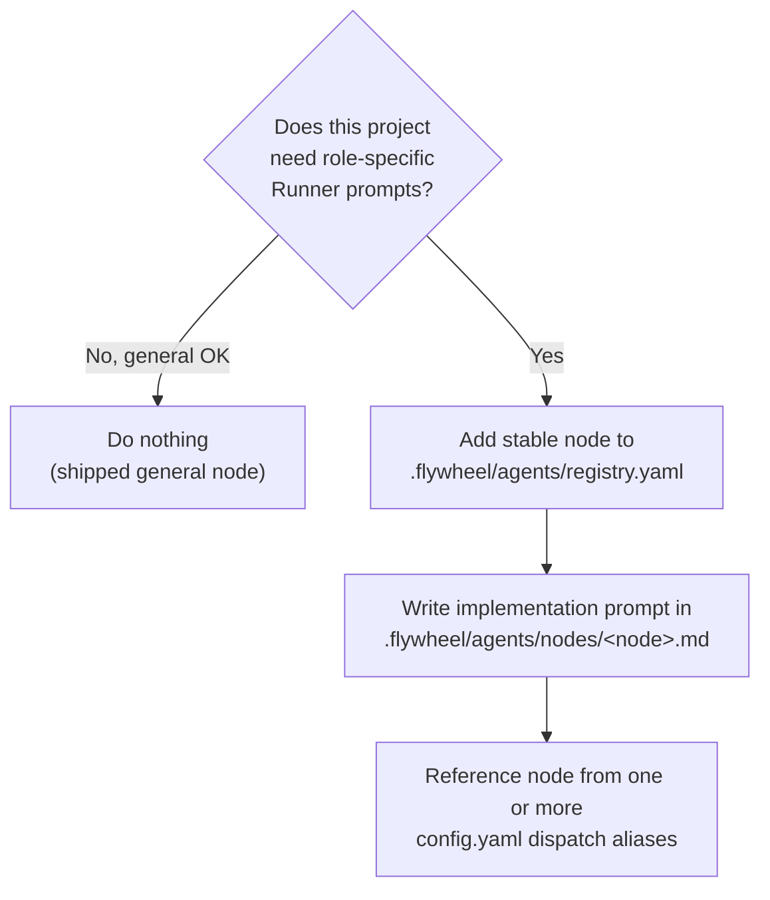

# New Project Onboarding — Flywheel Agent Setup

**Audience**: Annie (or any future project owner) adding a brand-new project to Flywheel.
**Scope**: How to declare stable Runner nodes for a project — where the registry and prompt files live, what `config.yaml` needs, and how the AgentDispatcher routes issues to the right Runner prompt.

> This guide assumes Flywheel is installed and Bridge is running for at least one project (e.g. GeoForge3D). If you're starting from absolute zero — installing Flywheel for the first time — see the top-level README instead; this doc picks up from "I have Flywheel and want to add a new project."

## TL;DR

```
my-new-project/
├── .flywheel/
│   ├── config.yaml                  # dispatch aliases: node + match.labels
│   └── agents/
│       ├── registry.yaml            # stable id + display label + ownership
│       └── nodes/
│           ├── backend.md           # implementation prompt
│           └── general.md           # optional cross-dept catch-all
└── ...
```

A **zero-config new project** (no `.flywheel/` at all) still works — Runners get the Flywheel-shipped `general` node fallback. But if you want role-specific prompts, declare nodes in the project registry and reference them from dispatch aliases.

## Decision tree



Most real-world projects fall into the multi-dept case once they have more than 2-3 distinct roles. GeoForge3D is the reference implementation.

## The three layers

1. **Flywheel-shipped registry** (built-in)
   - File: `<flywheel-repo>/.flywheel/agents/registry.yaml`
   - Defines built-in stable node ids, backend-owned display labels, prompt files, and department ownership. The `general` node is the default fallback.

2. **Project registry overlay** (you write this)
   - File: `<project>/.flywheel/agents/registry.yaml`
   - Adds project-local nodes or overrides the implementation/ownership of an existing node. A project-local node must provide a human-facing `label`.

3. **Project's `config.yaml` agents block** (you write this)
   - File: `<project>/.flywheel/config.yaml`
   - Declares dispatch aliases as `{ node, match }`. It does not own prompt paths, display labels, or department metadata.

4. **Project's node prompt files** (you write these)
   - Path pattern: `<project>/.flywheel/agents/nodes/<node>.md`
   - Markdown content = the Runner's system prompt for that stable node.

## Step-by-step setup

### 1. Decide stable node ids and departments

Departments are **completely user-defined per project**. There is no hardcoded list. Pick names that match how your team is organized + how you label Linear issues. Examples:

- GeoForge3D uses `product`, `operations`, `marketing` (three sibling teams).
- A SaaS startup might use `engineering`, `sales`, `customer-success`.
- A research lab might use `research`, `publishing`.
- A solo project might skip depts entirely (flat top-level files only).

Node ids are machine-facing and stable: use lowercase `snake_case` (for example `backend` or `customer_success`). Display names belong in `label`, so changing copy does not change persisted identity. Departments remain lowercase, kebab-case (for example `customer-success`).

### 2. Create the directory tree

```bash
mkdir -p .flywheel/agents
mkdir -p .flywheel/agents/nodes
```

### 3. Write `.flywheel/agents/registry.yaml`

```yaml
nodes:
  backend:
    file: nodes/backend.md
    label: Backend Engineering
    department: engineering

  general:
    file: nodes/general.md
    label: General
```

`backend` and `general` are stable ids. `label` is the only human-facing name shown by backend consumers. The `file` path is relative to the registry file's directory.

### 4. Write `.flywheel/config.yaml`

Minimum viable example with one dept-owned agent + one cross-dept catch-all:

```yaml
project: my-new-project

linear:
  team_id: GEO   # your Linear team key

runners:
  default: claude
  available:
    claude:
      type: claude
      model: sonnet

teams:
  - name: default
    orchestrators:
      - type: dag
        runner: claude
        budget_per_issue: 10

decision_layer:
  autonomy_level: advisor
  escalation_channel: discord

# Dispatch aliases point to stable registry nodes.
agents:
  backend:
    node: backend
    match:
      # Multi-alias: any of these Linear labels matches (case-insensitive).
      labels: ["backend", "api", "server"]

  general:
    node: general
    match:
      labels: []   # empty = only reachable via Lead override agentName=general

# Optional: project-level fallback before shipped-generic.
# Useful for "if nothing matches, use this specific agent" instead of generic.
# default_agent: backend
```

An alias is routing configuration, not identity. Multiple aliases may point to the same node. The node id, prompt file, human-facing label, and department are resolved from the registry before a run starts.

### 5. Write the node markdown files

Each registry `file` is a plain markdown file. Its content becomes part of the Runner's system prompt when dispatched:

```markdown
# Backend Executor

You are a Flywheel Runner working on a backend Linear issue. Follow these rules:
...
```

There's no required schema beyond "valid markdown" + agent-prompt content. The Blueprint injects it ahead of the standard pipeline instructions.

### 6. Restart Bridge

Bridge loads the bundled registry, project overlay, and `agents:` aliases at startup. After editing them, wait for the normal Flywheel deployment window; do not restart services from a project Runner.

### 7. (Optional) Tell Annie your dept ↔ Lead mapping

If your project has multiple dept-Leads, make sure each Lead's `LeadConfig.department` field in `~/.flywheel/projects.json` matches a node's registry `department` or `departments`. The Bridge uses this to scope label matching.

If you skip this, Leads still work via labels, but the dispatcher cannot prefer aliases whose resolved nodes belong to the issue's owning department.

## How dispatch works (3-step chain)

```
1. Lead override  → if POST /api/runs/start body has `agentName: "..."`,
                    use that agent directly. Throws INVALID_AGENT_NAME on unknown.

2. Label match    → 2a. Try aliases whose resolved registry node belongs to the
                       issue's owning department first.
                    2b. If no match in own-dept (or owningDept is "multiple"/undefined),
                       try cross-department aliases.

3. Fallback       → 3a. Project `default_agent` if declared.
                    3b. Else shipped `general` registry node.
```

Each step is **deterministic** — same inputs always yield the same agent. No LLM call inside the dispatcher (Codex code review or Haiku triage live elsewhere; agent dispatch is pure label matching).

## Common patterns

### Add a new dept to an existing project

Add the node's `department`/`departments` to `.flywheel/agents/registry.yaml`, write its prompt under `nodes/`, then add any dispatch aliases to `.flywheel/config.yaml`.

If the new dept has a Lead, also update `~/.flywheel/projects.json` to set that Lead's `department: "<new-dept>"`.

### Migrate from `.claude/agents/*-executor.md` (legacy)

Use the CLI:

```bash
pnpm --filter flywheel-cli exec flywheel migrate-agent-registry \
  --project-path ~/Dev/my-project \
  --node-map /tmp/my-project-node-map.json
```

This:
- Maps legacy aliases to stable node ids. Built-in aliases map automatically; project-local aliases require an explicit node-map with `node`, `label`, and department ownership.
- Moves prompt files to `.flywheel/agents/nodes/<node>.md`.
- Writes the project registry overlay and replaces every legacy config path with `agents.*.node`.
- Validates both registry entry points and every resolved alias.
- Writes a hash-verified receipt at `.flywheel/migrations/FLY-2121-agent-registry-receipt.json`.
- Refuses on dirty worktree (unless `--force`).
- Is idempotent only while the receipt hashes still match; drift fails closed.

### Validate setup

```bash
pnpm --filter flywheel-cli exec flywheel doctor --project-path ~/Dev/my-project
```

Reports:
- Legacy config path fields that need migration (exits 1 with the migration command).
- Invalid bundled or project registries, missing prompt files, and unresolved node references.
- Duplicate aliases across agents (warning).
- Cross-check with Linear team labels (when `LINEAR_API_KEY` is set).

## What to skip when

| Situation | Skip |
|---|---|
| Brand new project, only a few issues, no role specialization | Skip the whole `agents:` block — let the shipped `general` node handle it. |
| Reuse an unchanged built-in node | Reference it directly; a project overlay is optional. |
| Project-specific prompt or display name | Add a project registry entry and a `nodes/<node>.md` prompt. |
| Cross-department catch-all | Omit `department` and `departments` on the registry node. |

## Out of scope (v1.28+)

- `flywheel add-department` (one-shot dept + Lead creation)
- Sub-package nested `.flywheel/` (multi-tier override in monorepos)
- User-level `~/.flywheel/agents/` override layer

For now those are manual workflows. File a FLY issue if any of them become a real pain.

## Reference

- Plan: `doc/engineer/plan/inprogress/v1.27.2-FLY-137-runner-agent-dispatch.md`
- GeoForge3D as reference impl: `~/Dev/GeoForge3D/.flywheel/` (after the FLY-137 companion PR lands)
- Shipped registry: `<flywheel-repo>/.flywheel/agents/registry.yaml`
