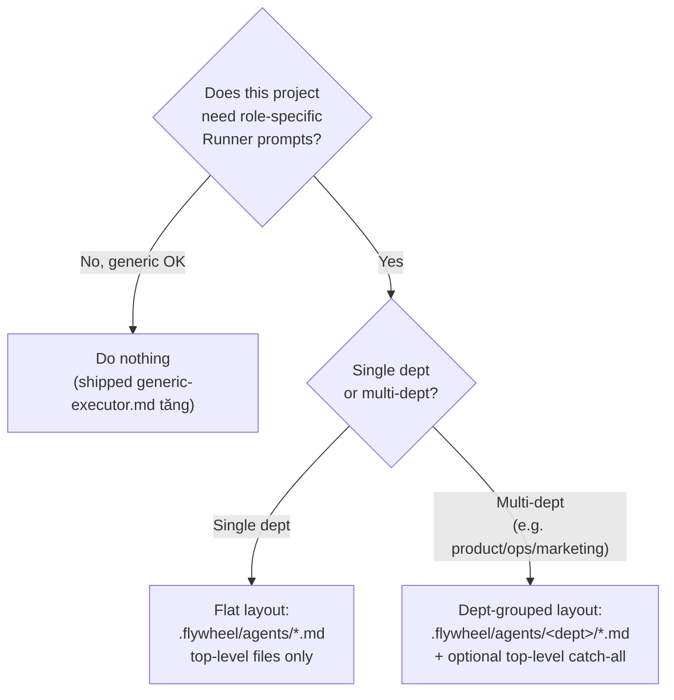

# New Project Onboarding — Flywheel Agent Setup

**Audience**: Annie (or any future project owner) adding a brand-new project to Flywheel.
**Scope**: How to declare agents for a project — where files live, what `config.yaml` needs, and how the AgentDispatcher routes issues to the right Runner prompt.

> This guide assumes Flywheel is installed and Bridge is running for at least one project (e.g. GeoForge3D). If you're starting from absolute zero — installing Flywheel for the first time — see the top-level README instead; this doc picks up from "I have Flywheel and want to add a new project."

## TL;DR

```
my-new-project/
├── .flywheel/
│   ├── config.yaml                  # agents block + match.labels
│   └── agents/
│       ├── <dept>/
│       │   └── <role>-executor.md   # dept-owned agent prompts
│       └── general-executor.md      # top-level = cross-dept catch-all (optional)
└── ...
```

A **zero-config new project** (no `.flywheel/` at all) still works — Runners get the Flywheel-shipped `generic-executor.md` fallback. But if you want role-specific prompts (different prompt for backend vs designer vs ops), declare agents.

## Decision tree



Most real-world projects fall into the multi-dept case once they have more than 2-3 distinct roles. GeoForge3D is the reference implementation.

## The three layers

1. **Flywheel-shipped fallback** (built-in)
   - File: `<flywheel-repo>/agents/generic-executor.md`
   - You never touch this. Always present. Used when nothing else matches.

2. **Project's `config.yaml` agents block** (you write this)
   - File: `<project>/.flywheel/config.yaml`
   - Declares which agents exist, what labels match them, optional dept assignment.

3. **Project's agent files** (you write these)
   - Path pattern: `<project>/.flywheel/agents/<dept>/<role>-executor.md`
       OR `<project>/.flywheel/agents/<role>-executor.md` (top-level cross-dept)
   - Markdown content = the Runner's system prompt for that role.

## Step-by-step setup

### 1. Decide your dept structure

Departments are **completely user-defined per project**. There is no hardcoded list. Pick names that match how your team is organized + how you label Linear issues. Examples:

- GeoForge3D uses `product`, `operations`, `marketing` (three sibling teams).
- A SaaS startup might use `engineering`, `sales`, `customer-success`.
- A research lab might use `research`, `publishing`.
- A solo project might skip depts entirely (flat top-level files only).

The convention: lowercase, kebab-case (e.g. `customer-success`, not `Customer Success`).

### 2. Create the directory tree

```bash
mkdir -p .flywheel/agents
# Optional: create dept subdirs
mkdir -p .flywheel/agents/product .flywheel/agents/operations
```

### 3. Write `.flywheel/config.yaml`

Minimum viable example with one dept-owned agent + one cross-dept catch-all:

```yaml
project: my-new-project

linear:
  team_id: GEO   # your Linear team key

runners:
  default: claude
  available:
    claude:
      type: claude
      model: sonnet

teams:
  - name: default
    orchestrators:
      - type: dag
        runner: claude
        budget_per_issue: 10

decision_layer:
  autonomy_level: advisor
  escalation_channel: discord

# FLY-137 v1.27.2: agents block — declares dispatchable agents.
agents:
  backend:
    agent_file: .flywheel/agents/product/backend-executor.md
    department: product
    match:
      # Multi-alias: any of these Linear labels matches (case-insensitive).
      labels: ["backend", "api", "server"]

  general:
    agent_file: .flywheel/agents/general-executor.md   # top-level path = cross-dept
    # No `department:` field — top-level files MUST omit it.
    match:
      labels: []   # empty = only reachable via Lead override agentName=general

# Optional: project-level fallback before shipped-generic.
# Useful for "if nothing matches, use this specific agent" instead of generic.
# default_agent: backend
```

**Reserved name**: `generic` is reserved by Flywheel for the shipped fallback. You cannot name a project agent `generic` — ConfigLoader rejects it.

### 4. Write the agent markdown files

Each `agent_file` is a plain markdown file. Its content becomes part of the Runner's system prompt when dispatched. Example structure (use GeoForge3D's `.claude/agents/*-executor.md` as reference — they get migrated to `.flywheel/agents/<dept>/` by `flywheel migrate-agents-path`):

```markdown
# Backend Executor

You are a Flywheel Runner working on a backend Linear issue. Follow these rules:
...
```

There's no required schema beyond "valid markdown" + agent-prompt content. The Blueprint injects it ahead of the standard pipeline instructions.

### 5. Restart Bridge

Bridge loads `agents:` configuration at startup. After editing `config.yaml`, restart Bridge (or wait for the FLY-20 auto-restart cycle after your next merge).

### 6. (Optional) Tell Annie your dept ↔ Lead mapping

If your project has multiple dept-Leads (like GeoForge3D's product-lead / ops-lead), make sure each Lead's `LeadConfig.department` field in `~/.flywheel/projects.json` matches one of your `.flywheel/agents/<dept>/` subdir names. The Bridge uses this to scope the dispatcher's step 2a to the right dept.

If you skip this — Leads still work via labels (FLY-127 fallback path), but the dispatcher won't be able to scope label match to the issue's owning dept; it'll fall through to top-level catch-all + generic.

## How dispatch works (3-step chain)

```
1. Lead override  → if POST /api/runs/start body has `agentName: "..."`,
                    use that agent directly. Throws INVALID_AGENT_NAME on unknown.

2. Label match    → 2a. Try agents declared in the issue's owning-dept subdir first.
                       (owning-dept resolved via DepartmentRegistry from Lead.department
                       matching one of the issue's Linear labels.)
                    2b. If no match in own-dept (or owningDept is "multiple"/undefined),
                       try top-level cross-dept catch-all files.

3. Fallback       → 3a. Project `default_agent` if declared.
                    3b. Else shipped `agents/generic-executor.md` from Flywheel repo
                        (always present, vendor-neutral catch-all).
```

Each step is **deterministic** — same inputs always yield the same agent. No LLM call inside the dispatcher (Codex code review or Haiku triage live elsewhere; agent dispatch is pure label matching).

## Common patterns

### Add a new dept to an existing project

Manual workflow in v1.27.2 (CLI scaffold `flywheel add-department` deferred to v1.28+):

```bash
mkdir -p .flywheel/agents/<new-dept>
# Write the agent markdown file
$EDITOR .flywheel/agents/<new-dept>/<role>-executor.md
# Update config.yaml agents block
$EDITOR .flywheel/config.yaml
# Restart Bridge
```

If the new dept has a Lead, also update `~/.flywheel/projects.json` to set that Lead's `department: "<new-dept>"`.

### Migrate from `.claude/agents/*-executor.md` (legacy)

Use the CLI:

```bash
pnpm --filter flywheel-cli exec flywheel migrate-agents-path --project-path ~/Dev/my-project
```

This:
- Reads `.claude/agents/README.md` mapping table (if present) for dept routing.
- `git mv`s each `.claude/agents/*-executor.md` to the correct `.flywheel/agents/<dept>/` subdir.
- Updates `config.yaml` `agents.*.agent_file` paths.
- Refuses on dirty worktree (unless `--force`).
- Idempotent on re-run.

### Validate setup

```bash
pnpm --filter flywheel-cli exec flywheel doctor --project-path ~/Dev/my-project
```

Reports:
- Legacy `.claude/agents/` references that need migration (exits 1 with hint).
- Missing agent files declared in `config.yaml`.
- Duplicate aliases across agents (warning).
- Orphan dept dirs (dept declared in filesystem but no Lead claims it).
- Cross-check with Linear team labels (when `LINEAR_API_KEY` is set).

## What to skip when

| Situation | Skip |
|---|---|
| Brand new project, only a few issues, no role specialization | Skip the whole `agents:` block — let shipped-generic do it. |
| Single dept, 1-3 agents | Skip dept subdirs — put everything at top level. |
| Marketing dept defined but no Lead exists yet (orphan-until) | OK; `flywheel doctor` warns but doesn't block. |
| Cross-dept catch-all only (e.g. one `general-executor.md` at top level) | Top-level placement; omit `department:` field. |

## Out of scope (v1.28+)

- `flywheel init` scaffolder (auto-creates `.flywheel/` skeleton)
- `flywheel add-department` (one-shot dept + Lead creation)
- Sub-package nested `.flywheel/` (multi-tier override in monorepos)
- User-level `~/.flywheel/agents/` override layer

For now those are manual workflows. File a FLY issue if any of them become a real pain.

## Reference

- Plan: `doc/engineer/plan/inprogress/v1.27.2-FLY-137-runner-agent-dispatch.md`
- GeoForge3D as reference impl: `~/Dev/GeoForge3D/.flywheel/` (after the FLY-137 companion PR lands)
- Shipped generic: `<flywheel-repo>/agents/generic-executor.md`
