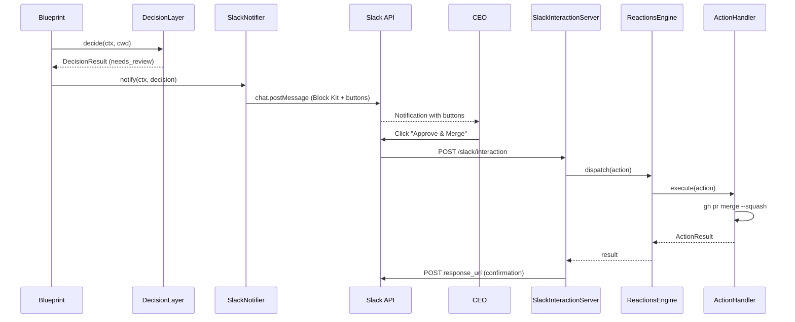

# Plan: v0.2 Step 2c — Slack Notification + Reactions

## Context

v0.2 Step 2b (PR #7) 完成了 Decision Layer — 现在 Blueprint 返回 `DecisionResult`（route: `auto_approve` / `needs_review` / `blocked`），但结果**只打印到 stdout**，CEO 无法远程感知或操作。

Step 2c 闭合"最后一公里"：Decision Layer 出决策 → Slack 通知 CEO → CEO 点击按钮 → Flywheel 执行对应动作。

**Architecture doc**: `doc/architecture/v0.2-architecture.md` §Reactions 系统
**Design doc**: `doc/engineer/exploration/new/v0.2-decision-layer.md` §9 Slack 通知格式

---

## Package Placement

| Component | Package | Rationale |
|-----------|---------|-----------|
| SlackNotifier | `edge-worker` | Orchestration — constructs Block Kit from DecisionResult |
| SlackInteractionServer | `edge-worker` | HTTP server for Slack button callbacks |
| ReactionsEngine | `edge-worker` | Dedup + dispatch to action handlers |
| Action Handlers | `edge-worker` | approve/reject/defer business logic |
| SlackPostMessageParams ext | `slack-event-transport` | Minimal Block Kit support (add `blocks` field) |

No circular deps — SlackNotifier calls SlackMessageService via constructor injection.

**Test file convention**: edge-worker → `src/__tests__/`

---

## Execution Order

7 tasks, mostly sequential (each builds on the previous):

1. **Extend SlackMessageService** (~15 LOC, 3 tests) — prerequisite for SlackNotifier
2. **SlackNotifier** (~150 LOC, 10 tests) — core notification logic
3. **SlackInteractionServer** (~100 LOC, 8 tests) — receives button callbacks
4. **ReactionsEngine** (~80 LOC, 5 tests) — dedup + dispatch
5. **Action Handlers** (~120 LOC, 9 tests) — approve/reject/defer
6. **Integration Wiring** (~60 LOC, 2 tests) — wire into run-issue.ts + DagDispatcher
7. **E2E Smoke Test** (~80 LOC, 3 tests) — full loop validation

---

## Task 1: Extend SlackMessageService for Block Kit

**Modify**: `packages/slack-event-transport/src/SlackMessageService.ts`
**Modify**: `packages/slack-event-transport/src/index.ts` (if needed)

### Changes

```typescript
// SlackPostMessageParams — add optional blocks field
export interface SlackPostMessageParams {
  token: string;
  channel: string;
  text: string;          // fallback text (notifications, accessibility)
  thread_ts?: string;
  blocks?: unknown[];    // Slack Block Kit layout blocks
}
```

In `postMessage()`, include `blocks` in the request body when present:

```typescript
const body: Record<string, unknown> = { channel, text };
if (thread_ts) body.thread_ts = thread_ts;
if (blocks) body.blocks = blocks;    // ← add this
```

### Test Cases

| # | Test | Verifies |
|---|------|----------|
| 1 | postMessage with blocks includes blocks in body | Block Kit support |
| 2 | postMessage without blocks omits blocks field | Backward compat |
| 3 | postMessage with blocks still sends text as fallback | Accessibility |

### Commit

`feat(slack-event-transport): add Block Kit blocks support to SlackMessageService`

---

## Task 2: SlackNotifier

**Create**:
- `packages/edge-worker/src/SlackNotifier.ts`
- `packages/edge-worker/src/__tests__/SlackNotifier.test.ts`

**Modify**: `packages/edge-worker/src/index.ts` — add exports

### Interface

```typescript
import type { ExecutionContext, DecisionResult } from "flywheel-core";
import type { SlackMessageService } from "flywheel-slack-event-transport";

export interface SlackNotifierConfig {
  channelId: string;          // Slack channel (e.g., "#flywheel")
  botToken: string;           // SLACK_BOT_TOKEN
  projectRepo?: string;       // GitHub "owner/repo" for PR links
  linearTeamKey?: string;     // e.g., "GEO" for Linear issue URLs
}

export class SlackNotifier {
  constructor(
    private config: SlackNotifierConfig,
    private messageService: SlackMessageService,
  ) {}

  /**
   * Send notification based on decision route.
   * - needs_review → Block Kit with Approve/Reject/Defer buttons
   * - blocked → Block Kit with Retry/Shelve buttons
   * - auto_approve → no notification (log only)
   */
  async notify(
    ctx: ExecutionContext,
    decision: DecisionResult,
    extra?: { tmuxSession?: string; consecutiveFailures?: number },
  ): Promise<{ sent: boolean; messageTs?: string }> {}
}
```

### Block Kit Message Templates

From design doc §9. Two templates:

**needs_review** (`buildNeedsReviewBlocks()`):
- Header: "Review Required: {issueIdentifier}"
- Section: issue link, project, commits, files changed
- Section: decision reasoning + confidence
- Section: concerns (conditional — only if non-empty)
- Section: commit messages (code block)
- Actions: 4 buttons — Approve & Merge (primary), Reject (danger), Defer, View PR (link)
- Context: footer with source + attempt info

**blocked** (`buildBlockedBlocks()`):
- Header: "Blocked: {issueIdentifier}"
- Section: warning + title + reason + attempts
- Actions: 2 buttons — Retry (primary), Shelve

### Field Mapping

Design doc templates reference some fields not in current `ExecutionContext`:

| Template field | Source | Handling |
|----------------|--------|----------|
| `ctx.issueIdentifier` | `ExecutionContext.issueIdentifier` | ✅ exists |
| `ctx.issueTitle` | `ExecutionContext.issueTitle` | ✅ exists |
| `ctx.commitCount` | `ExecutionContext.commitCount` | ✅ exists |
| `ctx.filesChangedCount` | `ExecutionContext.filesChangedCount` | ✅ exists (design doc uses `filesChanged.length`) |
| `ctx.linesAdded/Removed` | `ExecutionContext.linesAdded/linesRemoved` | ✅ exists |
| `ctx.commitMessages` | `ExecutionContext.commitMessages` | ✅ exists |
| `ctx.consecutiveFailures` | `ExecutionContext.consecutiveFailures` | ✅ exists |
| `ctx.currentAttempt` | Not in ExecutionContext | Use `extra.consecutiveFailures + 1` or default 1 |
| `ctx.maxAttempts` | Not in ExecutionContext | Hardcode 3 (from config later) |
| `ctx.attemptHistory` | Not in ExecutionContext | **Skip for Step 2c** — display `consecutiveFailures` instead |
| PR URL | Not in DecisionResult | Construct from `projectRepo`: `https://github.com/{repo}/pulls` or query `gh pr list` |
| Linear issue URL | Not in DecisionResult | Construct: `https://linear.app/team/issue/{issueIdentifier}` |

### Action Button `action_id` Encoding

Format: `flywheel_{action}_{issueId}`

```
flywheel_approve_{issueId}
flywheel_reject_{issueId}
flywheel_defer_{issueId}
flywheel_view_pr_{issueId}     // link button — no callback
flywheel_retry_{issueId}
flywheel_shelve_{issueId}
```

Button `value` JSON: `{ "issueId": "...", "action": "approve" }`

### Test Cases

| # | Test | Verifies |
|---|------|----------|
| 1 | needs_review builds correct header block | Header text |
| 2 | needs_review includes issue info section with all fields | Field mapping |
| 3 | needs_review includes reasoning section | Decision reasoning |
| 4 | needs_review includes concerns when present | Conditional section |
| 5 | needs_review omits concerns when empty | Conditional section |
| 6 | needs_review includes 4 action buttons | Button structure |
| 7 | blocked builds correct header block | Header text |
| 8 | blocked includes retry + shelve buttons | Button structure |
| 9 | auto_approve sends nothing | No notification |
| 10 | action_id includes issueId | Button routing |

### Commit

`feat(edge-worker): add SlackNotifier — Block Kit notifications for decision results`

---

## Task 3: SlackInteractionServer

**Create**:
- `packages/edge-worker/src/SlackInteractionServer.ts`
- `packages/edge-worker/src/__tests__/SlackInteractionServer.test.ts`

**Modify**: `packages/edge-worker/src/index.ts` — add exports

### Interface

```typescript
import { EventEmitter } from "node:events";

export interface SlackAction {
  actionId: string;      // e.g., "flywheel_approve_GEO-95"
  issueId: string;       // parsed from actionId
  action: string;        // "approve" | "reject" | "defer" | "retry" | "shelve"
  userId: string;        // Slack user who clicked
  responseUrl: string;   // Slack response URL for follow-up messages
  messageTs: string;     // Original message timestamp
}

export class SlackInteractionServer extends EventEmitter {
  constructor(port?: number, authToken?: string)
  async start(): Promise<number>       // returns assigned port
  async stop(): Promise<void>
  getPort(): number
  waitForAction(issueId: string, timeoutMs: number): Promise<SlackAction | null>
}
```

### HTTP Endpoint

```
POST /slack/interaction
Content-Type: application/x-www-form-urlencoded
Body: payload=<URL-encoded JSON>
```

Slack sends interaction payloads as URL-encoded form data, not JSON.

**Parsing logic**:
1. Extract `payload` from form body
2. Parse JSON: `{ type: "block_actions", user: { id }, actions: [{ action_id, value }], response_url, message: { ts } }`
3. Parse `action_id` format: `flywheel_{action}_{issueId}`
4. Validate: action is one of approve/reject/defer/retry/shelve
5. Emit `"action"` event with parsed `SlackAction`
6. Respond 200 immediately (Slack requires <3s response)

**Auth**: Optional Bearer token (same pattern as SlackEventTransport proxy mode).

### Implementation Pattern

Follow `HookCallbackServer` pattern: raw `http.createServer`, bind to `0.0.0.0` (needs external access via Tailscale Funnel), parse URL + body.

**Key difference from HookCallbackServer**: HookCallbackServer binds to `127.0.0.1` (loopback only). SlackInteractionServer binds to `0.0.0.0` because Slack needs to reach it via Tailscale Funnel.

### Test Cases

| # | Test | Verifies |
|---|------|----------|
| 1 | start() returns port > 0 | Server binds |
| 2 | POST valid interaction payload → 200 | Happy path |
| 3 | POST emits "action" event with parsed SlackAction | Event structure |
| 4 | POST missing payload → 400 | Validation |
| 5 | POST with unknown action_id prefix → ignored (200) | Non-flywheel actions |
| 6 | waitForAction resolves on matching issueId | Async wait |
| 7 | waitForAction returns null on timeout | Timeout |
| 8 | stop() shuts down gracefully | Cleanup |

### Commit

`feat(edge-worker): add SlackInteractionServer — HTTP server for Slack button callbacks`

---

## Task 4: ReactionsEngine

**Create**:
- `packages/edge-worker/src/ReactionsEngine.ts`
- `packages/edge-worker/src/__tests__/ReactionsEngine.test.ts`

**Modify**: `packages/edge-worker/src/index.ts` — add exports

### Interface

```typescript
export interface ActionHandler {
  execute(action: SlackAction): Promise<ActionResult>;
}

export interface ActionResult {
  success: boolean;
  message: string;       // Human-readable result for Slack reply
}

export class ReactionsEngine {
  constructor(handlers: Record<string, ActionHandler>)

  /**
   * Dispatch an action to the appropriate handler.
   * Dedup: prevents same action_id from executing twice.
   */
  async dispatch(action: SlackAction): Promise<ActionResult>
}
```

### Implementation

- `handlers: Record<string, ActionHandler>` — maps action name to handler
- `processed: Set<string>` — in-memory dedup by `action_id + messageTs` (prevents double-click)
- `dispatch()`: check dedup → lookup handler → execute → record processed → return result

**Dedup strategy**: In-memory `Set` for Step 2c. The architecture doc specifies SQLite `reaction_runs` table, but that's for crash recovery across restarts (relevant for Auto-Loop in v0.2.1+). In-memory is sufficient for `run-issue.ts` single-run lifecycle.

### Test Cases

| # | Test | Verifies |
|---|------|----------|
| 1 | dispatches to correct handler | Routing |
| 2 | dedup prevents second execution | Double-click safety |
| 3 | unknown action returns error result | Error handling |
| 4 | handler failure returns failure result | Error propagation |
| 5 | different issueIds are independent | Isolation |

### Commit

`feat(edge-worker): add ReactionsEngine — dedup + dispatch for Slack button actions`

---

## Task 5: Action Handlers

**Create**:
- `packages/edge-worker/src/reactions/ApproveHandler.ts`
- `packages/edge-worker/src/reactions/RejectHandler.ts`
- `packages/edge-worker/src/reactions/DeferHandler.ts`
- `packages/edge-worker/src/reactions/index.ts`
- `packages/edge-worker/src/__tests__/reactions.test.ts`

### ApproveHandler

```typescript
export class ApproveHandler implements ActionHandler {
  constructor(
    private exec: (cmd: string, args: string[], cwd: string) => Promise<{ stdout: string }>,
    private projectRoot: string,
    private projectRepo?: string,  // "owner/repo" for gh CLI
  ) {}

  async execute(action: SlackAction): Promise<ActionResult> {
    // 1. Find PR for branch flywheel-{issueId}
    //    gh pr list --head flywheel-{issueId} --json number,url --limit 1
    // 2. Check PR is mergeable (gh pr view {number} --json mergeable)
    // 3. Merge: gh pr merge {number} --squash
    // 4. Return result
  }
}
```

### RejectHandler

```typescript
export class RejectHandler implements ActionHandler {
  constructor(
    private slackNotifier?: SlackNotifier,  // for confirmation message
  ) {}

  async execute(action: SlackAction): Promise<ActionResult> {
    // 1. Log rejection
    // 2. Send Slack confirmation via response_url (ephemeral)
    // 3. Return { success: true, message: "Issue shelved" }
  }
}
```

### DeferHandler

```typescript
export class DeferHandler implements ActionHandler {
  async execute(action: SlackAction): Promise<ActionResult> {
    // 1. Log deferral
    // 2. Return { success: true, message: "Deferred for 24h" }
    // Note: actual re-enqueue requires Auto-Loop (v0.2.1+)
  }
}
```

### Slack Response URL

After handling, post follow-up to `action.responseUrl` to update the original message:
```typescript
await fetch(action.responseUrl, {
  method: "POST",
  headers: { "Content-Type": "application/json" },
  body: JSON.stringify({
    replace_original: false,
    text: `✅ ${action.action} executed by <@${action.userId}>`,
  }),
});
```

### Test Cases

| # | Test | Verifies |
|---|------|----------|
| 1 | ApproveHandler finds PR for branch | gh pr list call |
| 2 | ApproveHandler merges PR | gh pr merge call |
| 3 | ApproveHandler fails if no PR found | Error case |
| 4 | ApproveHandler fails if not mergeable | Safety check |
| 5 | RejectHandler returns success | Happy path |
| 6 | RejectHandler posts response_url confirmation | Follow-up message |
| 7 | DeferHandler returns success | Happy path |
| 8 | DeferHandler posts response_url confirmation | Follow-up message |
| 9 | All handlers post to response_url | Consistent UX |

### Commit

`feat(edge-worker): add action handlers — approve (merge PR), reject, defer`

---

## Task 6: Integration Wiring

**Modify**:
- `scripts/run-issue.ts` — add SlackNotifier + SlackInteractionServer + ReactionsEngine wiring
- `packages/edge-worker/src/DagDispatcher.ts` — no changes needed (onNodeComplete hook already exists)

### run-issue.ts Changes

**New flow after Blueprint completes:**

```typescript
// After blueprint.run() returns:
const route = blueprintResult.decision?.route;

if (route === "needs_review" || route === "blocked") {
  // 1. Send Slack notification
  const notifyResult = await slackNotifier.notify(execCtx, decision, {
    tmuxSession: tmuxSessionName,
    consecutiveFailures: 0,
  });

  if (notifyResult.sent) {
    log(`Slack notification sent (route: ${route})`);

    // 2. Wait for CEO response (with timeout)
    const action = await interactionServer.waitForAction(issueId, 3600_000); // 1h timeout

    if (action) {
      // 3. Execute action
      const result = await reactionsEngine.dispatch(action);
      log(`Action executed: ${action.action} → ${result.message}`);
    } else {
      log("No CEO response within timeout — issue preserved for manual review");
    }
  }
}
```

**New components initialized at startup:**

```typescript
// Slack notification (conditional on SLACK_BOT_TOKEN)
let slackNotifier: SlackNotifier | undefined;
let interactionServer: SlackInteractionServer | undefined;
let reactionsEngine: ReactionsEngine | undefined;

if (process.env.SLACK_BOT_TOKEN && process.env.FLYWHEEL_SLACK_CHANNEL) {
  const msgService = new SlackMessageService();
  slackNotifier = new SlackNotifier(
    {
      channelId: process.env.FLYWHEEL_SLACK_CHANNEL,
      botToken: process.env.SLACK_BOT_TOKEN,
      projectRepo: "xrliAnnie/GeoForge3D",  // hardcoded for now
    },
    msgService,
  );

  interactionServer = new SlackInteractionServer(
    parseInt(process.env.FLYWHEEL_INTERACTION_PORT ?? "9877"),
    process.env.SLACK_INTERACTION_TOKEN,
  );
  await interactionServer.start();
  log(`SlackInteractionServer started on port ${interactionServer.getPort()}`);

  const exec = async (cmd: string, args: string[], cwd: string) => {
    const result = execFileSync(cmd, args, { cwd, encoding: "utf-8" });
    return { stdout: result };
  };
  reactionsEngine = new ReactionsEngine({
    approve: new ApproveHandler(exec, resolvedRoot, "xrliAnnie/GeoForge3D"),
    reject: new RejectHandler(),
    defer: new DeferHandler(),
  });
}
```

**Cleanup in finally block:**

```typescript
if (interactionServer) {
  await interactionServer.stop();
  log("SlackInteractionServer stopped");
}
```

### Environment Variables

| Variable | Required | Description |
|----------|----------|-------------|
| `SLACK_BOT_TOKEN` | For notifications | Slack bot OAuth token |
| `FLYWHEEL_SLACK_CHANNEL` | For notifications | Slack channel ID (e.g., `C07XXXXXX`) |
| `FLYWHEEL_INTERACTION_PORT` | No (default: 9877) | Port for Slack interaction callbacks |
| `SLACK_INTERACTION_TOKEN` | No | Bearer token for interaction webhook auth |

**Graceful degradation**: If `SLACK_BOT_TOKEN` is not set, all Slack functionality is skipped. Decision results are still logged to stdout and AuditLogger.

### Test Cases

| # | Test | Verifies |
|---|------|----------|
| 1 | Without SLACK_BOT_TOKEN, notification is skipped | Graceful degradation |
| 2 | With SLACK_BOT_TOKEN, notification is sent after decision | Integration |

### Commit

`feat: wire SlackNotifier + Reactions into run-issue.ts and DagDispatcher`

---

## Task 7: E2E Smoke Test

**Create**: `packages/edge-worker/src/__tests__/slack-reactions-e2e.test.ts`

### Test Scenarios

Simulates the full loop without real Slack:

```typescript
// 1. Create SlackNotifier with mock SlackMessageService
// 2. Create SlackInteractionServer
// 3. Create ReactionsEngine with mock handlers
// 4. SlackNotifier.notify() → verify Block Kit message structure
// 5. Simulate button click: HTTP POST to interaction server
// 6. ReactionsEngine.dispatch() → verify handler called
// 7. Verify response_url callback
```

| # | Test | Verifies |
|---|------|----------|
| 1 | Full needs_review loop: notify → button click → approve | Happy path |
| 2 | Full blocked loop: notify → button click → retry | Blocked flow |
| 3 | Timeout: no button click → waitForAction returns null | Timeout handling |

### Commit

`test(edge-worker): add E2E smoke test for Slack notification + reactions loop`

---

## Summary

| Task | Package | Files | LOC (impl) | LOC (test) | Tests |
|------|---------|-------|------------|------------|-------|
| 1. Extend SlackMessageService | slack-event-transport | 1 modify | ~15 | ~30 | 3 |
| 2. SlackNotifier | edge-worker | 2 new, 1 modify | ~150 | ~120 | 10 |
| 3. SlackInteractionServer | edge-worker | 2 new, 1 modify | ~100 | ~100 | 8 |
| 4. ReactionsEngine | edge-worker | 2 new, 1 modify | ~80 | ~60 | 5 |
| 5. Action Handlers | edge-worker | 4 new | ~120 | ~90 | 9 |
| 6. Integration Wiring | scripts | 1 modify | ~60 | ~20 | 2 |
| 7. E2E Smoke Test | edge-worker | 1 new | ~0 | ~80 | 3 |
| **Total** | | **12 new, 4 modify** | **~525** | **~500** | **40** |

---

## Data Flow



---

## Verification

After all 7 tasks:

```bash
pnpm build          # all packages compile
pnpm test           # all 40 new + existing tests pass
pnpm typecheck      # no type errors
pnpm lint           # biome clean
```

**Manual E2E** (optional, requires Slack setup):
```bash
# 1. Set env vars
export SLACK_BOT_TOKEN="xoxb-..."
export FLYWHEEL_SLACK_CHANNEL="C07XXXXXX"
export FLYWHEEL_INTERACTION_PORT=9877

# 2. Expose via Tailscale Funnel
tailscale funnel 9877

# 3. Run issue
npx tsx scripts/run-issue.ts GEO-95 ~/Dev/GeoForge3D

# 4. Check Slack for notification, click button, verify action
```

**Step 2c 完成标志**: `pnpm build && pnpm test` 全绿 + Slack 通知发送 + 按钮回调处理。

---

## Implementation Notes

1. **ESM imports**: use `.js` extension
2. **Slack interaction content type**: `application/x-www-form-urlencoded` with `payload` field (not JSON)
3. **Response time**: Slack requires <3s response to interaction webhooks — respond 200 immediately, process async
4. **SlackInteractionServer binds `0.0.0.0`**: Unlike HookCallbackServer (loopback only), needs external access via Tailscale Funnel
5. **Block Kit type safety**: Use `unknown[]` for blocks (avoid maintaining full Slack Block Kit types — not worth the complexity for 2 templates)
6. **Dedup**: In-memory `Set` for Step 2c. SQLite `reaction_runs` table deferred to v0.2.1+ (Auto-Loop crash recovery)
7. **PR discovery**: ApproveHandler queries `gh pr list --head flywheel-{issueId}` at execution time
8. **Graceful degradation**: All Slack functionality is conditional on `SLACK_BOT_TOKEN`. Without it, decision results go to stdout + AuditLogger only
9. **response_url**: Post follow-up to Slack's response_url after action execution (shows result in thread)
10. **Auto-approve**: No Slack notification for `auto_approve` route in Step 2c. Auto-merge is a v0.2.1+ feature
