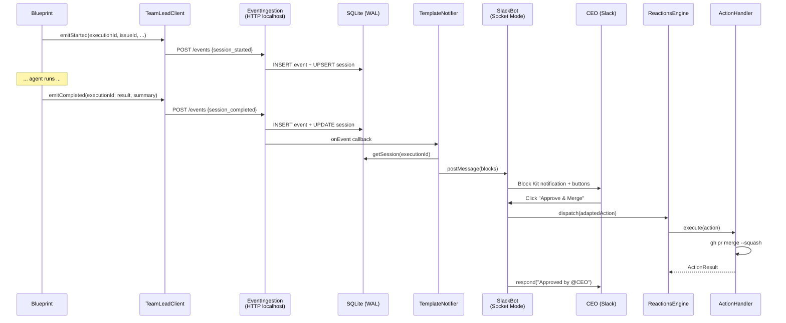

# v0.4 Step 1 — TeamLead Agent Skeleton

> status: codex-approved (Round 6, 2026-03-06)
> source: `doc/engineer/exploration/new/v0.4-teamlead-agent.md` (Codex-approved, Round 5)
> scope: Phase 1 only — event pipeline + Socket Mode + template notifications + actions
> no LLM, no outbox, no launchd

---

## Context

v0.2 完成了并行执行 + Decision Layer + Slack 通知（SlackNotifier + SlackInteractionServer）。但 Slack 是"哑巴式"的 — 只能发模板消息和处理按钮回调，无跨 issue 感知、无主动监控。

v0.4 Phase 1 交付一个 **TeamLead daemon**（`packages/teamlead/`），验证完整闭环：

```
Flywheel emitEvent() → HTTP POST → TeamLead EventIngestion → SQLite → Template Slack notification → CEO click → ActionExecutor
```

Phase 1 不含 LLM（Phase 1.5）、不含 outbox（Phase 4）、不含 launchd（Phase 4）。

---

## Package Placement

| Component | Package | Rationale |
|-----------|---------|-----------|
| StateStore, EventIngestion, SlackBot, ActionExecutor, StuckWatcher, daemon lifecycle | `packages/teamlead/` (new) | 独立 daemon，纳入 pnpm workspace |
| ExecutionEventEmitter interface + TeamLeadClient + NoOpEventEmitter | `packages/edge-worker/` | Blueprint 侧接口，已有 package |
| Blueprint wiring (inject emitter, emit events) | `packages/edge-worker/` | 修改 Blueprint.ts |
| setupComponents wiring | `scripts/lib/setup.ts` | 已有 setup 注入点 |

Dependencies:

```
packages/teamlead/
  dependencies:
    @slack/bolt           # Socket Mode
    better-sqlite3        # Native SQLite WAL
    flywheel-core         # types (ExecutionContext, DecisionResult)
    flywheel-edge-worker  # ReactionsEngine, ActionHandler, SlackAction, handlers
```

---

## Execution Order

10 tasks, mostly sequential.

---

## Task 0: Spike — better-sqlite3 + @slack/bolt

**Goal**: 验证 macOS arm64 上 better-sqlite3 编译和 @slack/bolt Socket Mode 连接。

### Steps

1. 初始化 `packages/teamlead/` package
   - `package.json` (name: `flywheel-teamlead`, type: module, vitest)
   - `tsconfig.json` (extends root, compilerOptions: outDir dist, rootDir src)
   - Add to `pnpm-workspace.yaml` (already `packages/*`, auto-included)
2. `pnpm add better-sqlite3 @slack/bolt` in teamlead
3. `pnpm add -D @types/better-sqlite3 @types/node typescript vitest`
4. Create `src/spike.ts`:
   - Open in-memory better-sqlite3 DB, create table, insert, query, WAL mode
   - Instantiate `@slack/bolt` App with socketMode: true (不需要真连接，只验证 import + 构造)
5. `pnpm build` — 验证 native addon 编译成功

### 产出

- `packages/teamlead/package.json`
- `packages/teamlead/tsconfig.json`
- `packages/teamlead/src/spike.ts` (验证后删除)

### Commit

`chore(teamlead): spike — verify better-sqlite3 + @slack/bolt on macOS arm64`

**Fallback**: 如果 better-sqlite3 编译失败，切换到 `libsql`。

---

## Task 1: StateStore + Schema

**Create**: `packages/teamlead/src/StateStore.ts`
**Create**: `packages/teamlead/src/__tests__/StateStore.test.ts`

### Interface

```typescript
import Database from "better-sqlite3";

export class StateStore {
  private db: Database.Database;

  constructor(dbPath: string)  // ":memory:" for tests
  close(): void

  // Schema
  migrate(): void  // CREATE TABLE IF NOT EXISTS, idempotent

  // Events
  insertEvent(event: SessionEvent): boolean  // returns false if duplicate event_id
  getEventsByExecution(executionId: string): SessionEvent[]

  // Sessions (read model) — monotonic state progression
  // State order: pending → running → {completed, awaiting_review, approved, blocked, failed}
  // Terminal states are final — upsertSession ignores transitions FROM terminal back to running
  upsertSession(session: SessionUpsert): void
  getSession(executionId: string): Session | undefined
  getSessionByIssue(issueId: string): Session | undefined
  getActiveSessions(): Session[]  // status IN ('running', 'awaiting_review')
  getStuckSessions(thresholdMinutes: number): Session[]
    // status = 'running' AND last_activity_at < datetime('now', '-{N} minutes')
  getLatestActionableSession(issueId: string): Session | undefined
    // status IN ('awaiting_review', 'blocked') ORDER BY last_activity_at DESC LIMIT 1

  // Conversations (Phase 1: minimal — just store thread_ts → issue mapping)
  upsertThread(threadTs: string, channel: string, issueId: string): void
  getThreadIssue(threadTs: string): string | undefined
}
```

### Schema

From brainstorm doc §5.1 (已 Codex-approved):

```sql
PRAGMA journal_mode = WAL;

CREATE TABLE IF NOT EXISTS session_events (
    id INTEGER PRIMARY KEY AUTOINCREMENT,
    event_id TEXT UNIQUE NOT NULL,
    ts TEXT NOT NULL DEFAULT (datetime('now')),
    execution_id TEXT NOT NULL,
    issue_id TEXT NOT NULL,
    project_name TEXT NOT NULL,
    event_type TEXT NOT NULL,
    severity TEXT NOT NULL DEFAULT 'info',
    payload JSON,
    source TEXT NOT NULL
);

CREATE TABLE IF NOT EXISTS sessions (
    execution_id TEXT PRIMARY KEY,
    issue_id TEXT NOT NULL,
    issue_identifier TEXT,
    issue_title TEXT,
    project_name TEXT NOT NULL,
    status TEXT NOT NULL DEFAULT 'pending',
    started_at TEXT,
    last_activity_at TEXT,
    tmux_session TEXT,
    worktree_path TEXT,
    branch TEXT,
    last_error TEXT,
    decision_route TEXT,
    decision_reasoning TEXT,
    cost_usd REAL DEFAULT 0,
    commit_count INTEGER DEFAULT 0,
    files_changed INTEGER DEFAULT 0,
    lines_added INTEGER DEFAULT 0,
    lines_removed INTEGER DEFAULT 0,
    summary TEXT,
    diff_summary TEXT,
    commit_messages TEXT,
    changed_file_paths TEXT
);

CREATE TABLE IF NOT EXISTS conversation_threads (
    thread_ts TEXT PRIMARY KEY,
    channel TEXT NOT NULL,
    issue_id TEXT,
    summary TEXT,
    last_updated TEXT NOT NULL DEFAULT (datetime('now'))
);

CREATE INDEX IF NOT EXISTS idx_events_execution ON session_events(execution_id);
CREATE INDEX IF NOT EXISTS idx_events_issue ON session_events(issue_id);
CREATE INDEX IF NOT EXISTS idx_sessions_status ON sessions(status);
```

### Types

```typescript
export interface SessionEvent {
  event_id: string;
  execution_id: string;
  issue_id: string;
  project_name: string;
  event_type: string;  // 'session_started' | 'session_completed' | 'session_failed' | 'decision_made' | 'ceo_action'
  severity?: string;
  payload?: unknown;
  source: string;
}

export interface SessionUpsert {
  execution_id: string;
  issue_id: string;
  project_name: string;
  status: string;
  issue_identifier?: string;
  issue_title?: string;
  started_at?: string;
  last_activity_at?: string;
  // ... all optional fields from sessions table
}

export interface Session {
  execution_id: string;
  issue_id: string;
  project_name: string;
  status: string;
  // ... all fields
}
```

### Test Cases

| # | Test | Verifies |
|---|------|----------|
| 1 | migrate() is idempotent (call twice) | Schema creation |
| 2 | insertEvent stores and retrieves event | Basic CRUD |
| 3 | insertEvent with duplicate event_id returns false | Idempotent dedup |
| 4 | upsertSession creates new session | Insert path |
| 5 | upsertSession updates existing session | Update path |
| 6 | getActiveSessions returns only running/awaiting_review | Status filter |
| 7 | getStuckSessions returns sessions with old last_activity_at | Stuck detection |
| 8 | upsertThread + getThreadIssue round-trip | Thread mapping |
| 9 | upsertSession ignores running→ after terminal (failed→running no-op) | State monotonicity |
| 10 | upsertSession ignores running→ after terminal (completed→running no-op) | State monotonicity |

### Commit

`feat(teamlead): add StateStore — better-sqlite3 WAL mode with schema migration`

---

## Task 2: EventIngestion

**Create**: `packages/teamlead/src/EventIngestion.ts`
**Create**: `packages/teamlead/src/__tests__/EventIngestion.test.ts`

### Interface

```typescript
import http from "node:http";
import type { StateStore } from "./StateStore.js";

export class EventIngestion {
  private server: http.Server;

  constructor(
    private store: StateStore,
    private onEvent?: (event: IngestEvent) => void,  // hook for notifications
  )

  async start(port: number, host?: string): Promise<number>
    // host defaults to "127.0.0.1" — localhost only
    // returns assigned port
  async stop(): Promise<void>
  getPort(): number
}
```

### HTTP Endpoint

```
POST /events
Content-Type: application/json
Body: {
  event_id: string,        // UUID, idempotent key
  execution_id: string,
  issue_id: string,
  project_name: string,
  event_type: "session_started" | "session_completed" | "session_failed",
  payload?: object,        // evidence, decision, etc.
  source?: string          // defaults to "orchestrator"
}
```

### Processing Logic

1. Parse JSON body (reject > 512KB)
2. Validate required fields: `event_id`, `execution_id`, `issue_id`, `project_name`, `event_type`
3. `store.insertEvent()` — if duplicate, respond 200 (idempotent)
4. Update session read model based on event_type:
   - `session_started` → upsert session with status='running', started_at=now, last_activity_at=now
   - `session_completed` → classify terminal status from `payload.decision.route`:
     - `needs_review` → status='awaiting_review'
     - `auto_approve` → status='approved'
     - `blocked` → status='blocked'
     - no decision (v0.1.1 fallback) → status='completed'
     - Populate evidence fields + decision fields from payload, last_activity_at=now
   - `session_failed` → update status='failed', last_activity_at=now, last_error from payload
5. Call `onEvent` callback if provided (used by daemon to trigger notifications)
6. Respond 200 `{ ok: true }`

### Test Cases

| # | Test | Verifies |
|---|------|----------|
| 1 | POST valid event → 200 + stored in DB | Happy path |
| 2 | POST duplicate event_id → 200 (idempotent) | Dedup |
| 3 | POST missing required field → 400 | Validation |
| 4 | POST body > 512KB → 413 | Body limit |
| 5 | session_started updates session status to 'running' | Read model |
| 6 | session_completed updates session with evidence fields | Read model |
| 7 | onEvent callback fires on new event | Notification hook |
| 8 | Binds to 127.0.0.1 only | Security |

### Commit

`feat(teamlead): add EventIngestion — HTTP server for pipeline events`

---

## Task 3: ExecutionEventEmitter (edge-worker side)

**Create**: `packages/edge-worker/src/ExecutionEventEmitter.ts`
**Create**: `packages/edge-worker/src/__tests__/ExecutionEventEmitter.test.ts`
**Modify**: `packages/edge-worker/src/index.ts` — add exports

### Interface

```typescript
// Unified event envelope — all events carry the same base fields
export interface EventEnvelope {
  executionId: string;
  issueId: string;
  projectName: string;
  issueIdentifier?: string;
  issueTitle?: string;
}

export interface ExecutionEventEmitter {
  emitStarted(env: EventEnvelope): Promise<void>;

  emitCompleted(
    env: EventEnvelope,
    result: BlueprintResult,
    summary?: string,
  ): Promise<void>;

  emitFailed(
    env: EventEnvelope,
    error: string,
    lastActivity?: string,
  ): Promise<void>;

  flush(): Promise<void>;
}
```

### TeamLeadClient

```typescript
export class TeamLeadClient implements ExecutionEventEmitter {
  private pending: Promise<void>[] = [];

  constructor(private baseUrl: string)  // e.g., "http://127.0.0.1:9876"

  async emitStarted(env: EventEnvelope): Promise<void> {
    // POST /events { event_id: randomUUID(), event_type: 'session_started',
    //   execution_id: env.executionId, issue_id: env.issueId, project_name: env.projectName, ... }
    // Fire-and-forget: push to pending, catch errors silently (log warning)
  }

  async emitCompleted(env: EventEnvelope, result: BlueprintResult, summary?: string): Promise<void> {
    // POST /events { event_type: 'session_completed',
    //   execution_id: env.executionId, issue_id: env.issueId, project_name: env.projectName,
    //   payload: { evidence, decision, summary } }
  }

  async emitFailed(env: EventEnvelope, error: string, lastActivity?: string): Promise<void> {
    // POST /events { event_type: 'session_failed',
    //   execution_id: env.executionId, issue_id: env.issueId, project_name: env.projectName,
    //   payload: { error, lastActivity } }
  }

  async flush(): Promise<void> {
    // await Promise.allSettled(this.pending); this.pending = [];
  }
}
```

### NoOpEventEmitter

```typescript
export class NoOpEventEmitter implements ExecutionEventEmitter {
  async emitStarted(_env: EventEnvelope): Promise<void> {}
  async emitCompleted(_env: EventEnvelope, _result: BlueprintResult): Promise<void> {}
  async emitFailed(_env: EventEnvelope, _error: string): Promise<void> {}
  async flush(): Promise<void> {}
}
```

### Test Cases

| # | Test | Verifies |
|---|------|----------|
| 1 | TeamLeadClient.emitStarted POSTs to /events | HTTP call |
| 2 | TeamLeadClient.emitCompleted includes evidence in payload | Payload structure |
| 3 | TeamLeadClient.emitFailed includes error + lastActivity | Payload structure |
| 4 | TeamLeadClient silently catches HTTP errors | Fire-and-forget safety |
| 5 | TeamLeadClient.flush() drains pending requests | Flush semantics |
| 6 | NoOpEventEmitter methods are no-ops | Null implementation |

### Commit

`feat(edge-worker): add ExecutionEventEmitter interface + TeamLeadClient + NoOp`

---

## Task 4: Blueprint Wiring

**Modify**: `packages/edge-worker/src/Blueprint.ts`
**Modify**: `packages/edge-worker/src/__tests__/Blueprint.test.ts` (add event emitter tests)
**Modify**: `scripts/lib/setup.ts` — inject emitter based on `TEAMLEAD_URL`

### Blueprint Changes

Constructor — add last optional parameter:

```typescript
constructor(
  hydrator, gitChecker, getRunner, shell,
  worktreeManager?, skillInjector?, evidenceCollector?,
  skillsConfig?, decisionLayer?,
  eventEmitter?: ExecutionEventEmitter,  // ← new
)
```

BlueprintContext — add required `executionId`:

```typescript
export interface BlueprintContext {
  teamName: string;
  runnerName: string;
  projectName?: string;
  sessionTimeoutMs?: number;
  consecutiveFailures?: number;
  executionId?: string;  // ← new, optional; Blueprint fallback to randomUUID()
}
```

**Blueprint.run() 真实签名**（从源码验证）:

```typescript
async run(node: DagNode, projectRoot: string, ctx: BlueprintContext): Promise<BlueprintResult>
```

**executionId 策略**（Codex R1 #3 fix）：`executionId` 在 `BlueprintContext` 中为**可选字段**，Blueprint 内部兜底生成（`ctx.executionId ?? randomUUID()`），降低破坏面。调用方（run-issue.ts, DagDispatcher）在 Phase 1 中显式传入；smoke-test.ts 等不需要修改。

Event trigger points in `Blueprint.run()`:

```typescript
async run(node: DagNode, projectRoot: string, ctx: BlueprintContext): Promise<BlueprintResult> {
  const executionId = ctx.executionId ?? randomUUID();
  // NOTE: DagNode only has id/blockedBy. Identifier/title come from hydrate step.
  // Build envelope with what's available at run() entry; enriched after hydrate.
  const env: EventEnvelope = {
    executionId,
    issueId: node.id,
    projectName: ctx.projectName ?? "unknown",
    // issueIdentifier/issueTitle populated after hydrate (see enrichment below)
  };

  // Fire-and-forget started event (before runner launch):
  this.eventEmitter?.emitStarted(env).catch(() => {});

  // OUTER try/catch wraps ENTIRE run body — catches both return-based
  // failures AND throw-based failures (git preflight, hydrate, etc.)
  try {
    const result = await this.runInner(node, projectRoot, ctx);

    // Terminal event for all successful/return paths:
    await this.emitTerminal(env, result);
    return result;
  } catch (err) {
    // Terminal event for throw paths (git preflight, hydrate, git check):
    const errorMsg = err instanceof Error ? err.message : String(err);
    const failResult: BlueprintResult = { success: false, error: errorMsg };
    await this.emitTerminal(env, failResult);
    throw err;  // re-throw to preserve existing behavior
  }
}

private async emitTerminal(env: EventEnvelope, result: BlueprintResult): Promise<void> {
  if (!this.eventEmitter) return;
  if (result.success || result.decision) {
    const summary = this.buildSummary(result);
    await Promise.race([
      this.eventEmitter.emitCompleted(env, result, summary),
      new Promise(r => setTimeout(r, 1000)),
    ]);
  } else {
    await Promise.race([
      this.eventEmitter.emitFailed(env, result.error ?? "unknown", undefined),
      new Promise(r => setTimeout(r, 1000)),
    ]);
  }
}

// runInner() contains the existing run() body (worktree, hydrate, runner, decision)
// This refactor is minimal — just move existing code into runInner() and wrap
```

private buildSummary(result: BlueprintResult): string | undefined {
  if (!result.evidence) return undefined;
  const parts: string[] = [];
  if (result.evidence.diffSummary) parts.push(result.evidence.diffSummary);
  if (result.evidence.commitMessages?.length) {
    parts.push(`Commits: ${result.evidence.commitMessages.join("; ")}`);
  }
  return parts.join(" | ") || undefined;
}
```

### setup.ts Changes

```typescript
// After existing imports, add:
import { TeamLeadClient, NoOpEventEmitter } from "../../packages/edge-worker/dist/ExecutionEventEmitter.js";
import type { ExecutionEventEmitter } from "../../packages/edge-worker/dist/ExecutionEventEmitter.js";

// In FlywheelComponents interface, add:
eventEmitter: ExecutionEventEmitter;

// FIRST THING in setupComponents() — fail-fast config validation (before any I/O):
const teamleadUrl = process.env.TEAMLEAD_URL;  // e.g., "http://127.0.0.1:9876"
const teamleadOwnsSlack = process.env.TEAMLEAD_OWNS_SLACK === "true";
if (teamleadOwnsSlack && !teamleadUrl) {
  throw new Error(
    "TEAMLEAD_OWNS_SLACK=true requires TEAMLEAD_URL. Otherwise no notification path is active."
  );
}

// ... then proceed with HookCallbackServer, WorktreeManager, etc. ...
const eventEmitter: ExecutionEventEmitter = teamleadUrl
  ? new TeamLeadClient(teamleadUrl)
  : new NoOpEventEmitter();
if (teamleadUrl) log(`TeamLead events → ${teamleadUrl}`);

// TEAMLEAD_OWNS_SLACK feature flag (brainstorm §4.2):
// When true: skip SlackNotifier + SlackInteractionServer creation entirely
// When false (default): legacy path active, TeamLead only ingests events (no Slack)
// teamleadOwnsSlack already validated at top of setupComponents()
if (teamleadOwnsSlack) {
  log("TEAMLEAD_OWNS_SLACK=true — legacy Slack path disabled");
  // slackNotifier, interactionServer, reactionsEngine remain undefined
  // run-issue.ts waitForAction() gets null → no blocking
} else {
  // ... existing Slack setup code (SlackNotifier, InteractionServer, ReactionsEngine) ...
}

// Blueprint constructor — add eventEmitter as last param:
const blueprint = new Blueprint(
  hydrator, gitChecker, makeRunner, shell,
  worktreeManager, skillInjector, evidenceCollector,
  undefined, decisionLayer,
  eventEmitter,
);
```

**Acceptance test**: Each issue produces exactly 1 review notification + at most 1 action execution, regardless of `TEAMLEAD_OWNS_SLACK` value.

### Callers — generate executionId

**run-issue.ts**: Before calling `blueprint.run()`, generate `executionId`:

```typescript
import { randomUUID } from "node:crypto";
// ...
const executionId = randomUUID();
const result = await blueprint.run(dagNode, projectRoot, { ...ctx, executionId });
```

**DagDispatcher** (`dispatchOne`): Same pattern — generate executionId before `blueprint.run()`.

**smoke-test.ts and other callers**: No changes needed — `executionId` is optional, Blueprint generates internally.

### flush() in finally (explicit acceptance)

**run-issue.ts**: Add to finally block:

```typescript
finally {
  await components.eventEmitter.flush();
  await teardownComponents(components);
}
```

**teardownComponents()**: Add `await c.eventEmitter.flush()` before closing other resources.

**Integration test**: Verify that a completed event reaches StateStore even when run-issue.ts exits immediately after blueprint.run().

### Test Cases

| # | Test | Verifies |
|---|------|----------|
| 1 | Blueprint.run() calls emitStarted with correct args | Started event |
| 2 | Blueprint.run() calls emitCompleted on success (decision path) | Completed event |
| 3 | Blueprint.run() calls emitFailed on runner catch | Failed event (catch-then-return path) |
| 4 | Blueprint.run() calls emitFailed on worktree setup failure | Failed event (return path) |
| 5 | Blueprint.run() calls emitFailed on git preflight throw | Failed event (throw path) |
| 5b | Blueprint.run() calls emitCompleted for blocked route | Blocked is terminal-completed with decision |
| 6 | started + completed events share same executionId | ID consistency |
| 7 | emitStarted failure doesn't block Blueprint.run() | Fire-and-forget |
| 8 | Without eventEmitter, Blueprint.run() works fine | Backward compat |
| 9 | Without executionId in ctx, Blueprint generates one | Optional fallback |
| 10 | TEAMLEAD_OWNS_SLACK=true skips SlackNotifier creation | Feature flag |
| 11 | TEAMLEAD_OWNS_SLACK=true without TEAMLEAD_URL throws | Fail-fast config |
| 12 | flush() called in teardownComponents | Flush on exit |
| 13 | EventEnvelope carries issueId/projectName in all events | Envelope contract |

### Commit

`feat: wire ExecutionEventEmitter into Blueprint + setup.ts`

---

## Task 5: config.ts + ProjectConfig

**Create**: `packages/teamlead/src/config.ts`
**Create**: `packages/teamlead/src/ProjectConfig.ts`

### config.ts

```typescript
export interface TeamLeadConfig {
  port: number;                  // EventIngestion HTTP port (default: 9876)
  dbPath: string;                // SQLite DB path (default: ~/.flywheel/teamlead.db)
  ownsSlack: boolean;            // TEAMLEAD_OWNS_SLACK (default: false)
  slackBotToken?: string;        // SLACK_BOT_TOKEN — required only when ownsSlack=true
  slackAppToken?: string;        // SLACK_APP_TOKEN — required only when ownsSlack=true
  slackChannelId?: string;       // FLYWHEEL_SLACK_CHANNEL — required only when ownsSlack=true
  stuckThresholdMinutes: number; // default: 15
  stuckCheckIntervalMs: number;  // default: 300_000 (5 min)
}

export function loadConfig(): TeamLeadConfig {
  // 1. Parse TEAMLEAD_OWNS_SLACK first (boolean flag)
  // 2. If ownsSlack=true: validate SLACK_BOT_TOKEN, SLACK_APP_TOKEN, FLYWHEEL_SLACK_CHANNEL
  // 3. If ownsSlack=false: Slack env vars not required, daemon runs in event-only mode
  // 4. Apply defaults: TEAMLEAD_PORT=9876, TEAMLEAD_DB_PATH=~/.flywheel/teamlead.db
}
```

### ProjectConfig

```typescript
export interface ProjectEntry {
  projectName: string;
  projectRoot: string;
  projectRepo?: string;
}

export function loadProjects(): ProjectEntry[] {
  // Source: FLYWHEEL_PROJECTS env var (JSON array) or ~/.flywheel/projects.json
  // Example: [{"projectName":"geoforge3d","projectRoot":"/Users/xiaorongli/Dev/GeoForge3D","projectRepo":"xrliAnnie/GeoForge3D"}]
}

export function getProjectRoot(projects: ProjectEntry[], projectName: string): string | undefined {
  return projects.find(p => p.projectName === projectName)?.projectRoot;
}
```

No dedicated tests — covered by integration in Task 8 (daemon lifecycle).

### Commit

`feat(teamlead): add config + ProjectConfig — env-based configuration`

---

## Task 6: SlackBot (Socket Mode)

**Create**: `packages/teamlead/src/SlackBot.ts`
**Create**: `packages/teamlead/src/__tests__/SlackBot.test.ts`

### Interface

```typescript
import { App } from "@slack/bolt";
import type { ReactionsEngine, ActionResult } from "flywheel-edge-worker";
import type { SlackAction } from "flywheel-edge-worker";

export class SlackBot {
  private app: App;

  constructor(
    private botToken: string,
    private appToken: string,
    private channelId: string,
    private reactionsEngine: ReactionsEngine,
  )

  async start(): Promise<void>
  async stop(): Promise<void>

  // Send a Block Kit message to the channel
  async postMessage(text: string, blocks?: unknown[], threadTs?: string): Promise<string | undefined>
    // Returns message_ts for thread tracking
}
```

### Implementation

```typescript
constructor(...) {
  this.app = new App({
    token: botToken,
    appToken: appToken,
    socketMode: true,
  });

  // Register button action handler (Phase 1)
  // NOTE: Existing handlers (ApproveHandler, RejectHandler, DeferHandler) post to
  // response_url via postSlackResponse(). To avoid double response, we use
  // ActionResult.alreadyResponded to decide whether SlackBot should respond.
  this.app.action(/^flywheel_/, async ({ action, body, ack, respond }) => {
    await ack();
    const slackAction = adaptBoltAction(action, body);
    const result = await this.reactionsEngine.dispatch(slackAction);
    if (!result.alreadyResponded) {
      // Handler did NOT post to response_url — we send the response
      await respond({
        replace_original: false,
        text: result.success
          ? `Action '${slackAction.action}' completed`
          : `Failed: ${result.message}`,
      });
    }
  });
}
```

### SlackActionAdapter (reuse existing parser)

Reuse the same parsing logic from `SlackInteractionServer.parseActionId()` — extract and share as a standalone function, or duplicate the tested logic. The key is handling multi-word actions like `view_pr` and issue IDs that may contain underscores.

```typescript
import { parseActionId } from "./action-id-parser.js";  // shared with SlackInteractionServer

function adaptBoltAction(action: any, body: any): SlackAction {
  const actionId = action.action_id;
  const parsed = parseActionId(actionId);

  // Parse button value JSON for execution_id
  let executionId: string | undefined;
  try {
    const val = typeof action.value === "string" ? JSON.parse(action.value) : undefined;
    executionId = val?.executionId ?? val?.execution_id;  // normalize both key forms
  } catch { /* ignore parse errors */ }

  return {
    actionId,
    issueId: parsed?.issueId ?? "",
    action: parsed?.action ?? "",
    userId: body.user?.id ?? "unknown",
    responseUrl: body.response_url ?? "",
    messageTs: body.message?.ts ?? "",
    executionId,  // ← new optional field
  };
}
```

**ActionResult extension** — add `alreadyResponded` to the shared interface:

```typescript
// In packages/edge-worker/src/ReactionsEngine.ts
export interface ActionResult {
  success: boolean;
  message: string;
  alreadyResponded?: boolean;  // ← new: handler already posted to response_url
}
```

Existing handlers (ApproveHandler, RejectHandler, DeferHandler) already call `postSlackResponse()` and should set `alreadyResponded: true` in their return. The stub handler for retry/shelve does NOT call postSlackResponse, so it leaves `alreadyResponded` as undefined (falsy), and SlackBot will respond.

**SlackAction extension** — add `executionId` to the shared interface:

```typescript
// In packages/edge-worker/src/SlackInteractionServer.ts
export interface SlackAction {
  actionId: string;
  issueId: string;
  action: string;
  userId: string;
  responseUrl: string;
  messageTs: string;
  executionId?: string;  // ← new: parsed from button value JSON
}
```

Also update `SlackInteractionServer.handleRequest()` to parse `value` JSON for `executionId` (same logic as adapter above). Both HTTP and Socket Mode paths produce SlackAction with `executionId` when available.

### Test Cases

Tests mock `@slack/bolt` App — verify action handler registration and dispatch logic.

| # | Test | Verifies |
|---|------|----------|
| 1 | adaptBoltAction parses flywheel_approve_GEO-95 correctly | Adapter parsing |
| 2 | adaptBoltAction handles issue IDs with underscores | Edge case |
| 3 | Action handler calls ack() immediately | Slack <3s requirement |
| 4 | Action handler dispatches to ReactionsEngine | Integration |
| 5 | postMessage sends to correct channel | Message sending |
| 6 | When handler returns alreadyResponded=true, bot does NOT respond() | No double response |
| 7 | When handler returns alreadyResponded=false, bot calls respond() | Fallback response |

**Additional modifications for alreadyResponded**:
- `packages/edge-worker/src/ReactionsEngine.ts` — add `alreadyResponded?: boolean` to `ActionResult`
- `packages/edge-worker/src/reactions/ApproveHandler.ts` — set `alreadyResponded: true` in return
- `packages/edge-worker/src/reactions/RejectHandler.ts` — set `alreadyResponded: true` in return
- `packages/edge-worker/src/reactions/DeferHandler.ts` — set `alreadyResponded: true` in return
- `packages/edge-worker/src/SlackInteractionServer.ts` — add `executionId?: string` to `SlackAction`, parse from button value JSON
- Extract `parseActionId` from `SlackInteractionServer` into shared utility

### Commit

`feat(teamlead): add SlackBot — @slack/bolt Socket Mode with button actions`

---

## Task 7: Template Notifications

**Create**: `packages/teamlead/src/TemplateNotifier.ts`
**Create**: `packages/teamlead/src/__tests__/TemplateNotifier.test.ts`

### Interface

```typescript
import type { SlackBot } from "./SlackBot.js";
import type { StateStore, Session } from "./StateStore.js";

export class TemplateNotifier {
  constructor(
    private bot: SlackBot,
    private store: StateStore,
  )

  // Called by daemon when a terminal event arrives
  async onSessionCompleted(session: Session): Promise<void>
  async onSessionFailed(session: Session): Promise<void>
  async onSessionStuck(session: Session, minutesSinceActivity: number): Promise<void>
}
```

### Block Kit Templates

**Reuse pattern from existing SlackNotifier** (`packages/edge-worker/src/SlackNotifier.ts`).

Phase 1 sends the same Block Kit structure as existing SlackNotifier but via Socket Mode `chat.postMessage`:

**onSessionCompleted** — dispatches by `decision_route`:
- `needs_review` (status='awaiting_review'):
  - Header: "Review Required: {issue_identifier}"
  - Section: issue info (commits, files, lines changed)
  - Section: decision reasoning + confidence
  - Actions: [Approve & Merge] [Reject] [Defer] buttons
  - Buttons use `action_id` format: `flywheel_approve_{issueId}`, `value` JSON: `{"issueId":"...","executionId":"...","action":"approve"}`
- `blocked` (status='blocked'):
  - Header: "Blocked: {issue_identifier}"
  - Section: decision reasoning
  - Actions: [Retry] [Shelve] buttons
- `auto_approve` (status='approved'):
  - Single-line: "Auto-approved: {issue_identifier} — {summary}"

**onSessionFailed** (status='failed'):
- Header: "Failed: {issue_identifier}"
- Section: error message
- Actions: [Retry] [Shelve] buttons (retry is stub handler for Phase 1)

**onSessionStuck** (from StuckWatcher):
- Header: "Possible Stuck: {issue_identifier}"
- Section: "No activity for {N} minutes"
- Context: execution_id, started_at

Each notification stores `thread_ts` in conversation_threads for future per-issue threading.

### Test Cases

| # | Test | Verifies |
|---|------|----------|
| 1 | onSessionCompleted sends Block Kit with correct header | Template structure |
| 2 | onSessionCompleted includes action buttons | Button format |
| 3 | onSessionFailed sends error info | Failed template |
| 4 | onSessionStuck sends warning | Stuck template |
| 5 | Stores thread_ts after sending | Thread tracking |

### Commit

`feat(teamlead): add TemplateNotifier — Block Kit notifications via Socket Mode`

---

## Task 8: ActionExecutor + SlackActionAdapter

**Create**: `packages/teamlead/src/ActionExecutor.ts`
**Create**: `packages/teamlead/src/__tests__/ActionExecutor.test.ts`

### Interface

```typescript
import { ReactionsEngine, ApproveHandler, RejectHandler, DeferHandler } from "flywheel-edge-worker";
import type { ProjectEntry } from "./ProjectConfig.js";

export function createReactionsEngine(
  projects: ProjectEntry[],
  store: StateStore,
): ReactionsEngine {
  const execFn = async (cmd: string, args: string[], cwd: string) => {
    const { execFileSync } = await import("node:child_process");
    const result = execFileSync(cmd, args, { cwd, encoding: "utf-8" });
    return { stdout: result };
  };

  return new ReactionsEngine({
    approve: new ProjectAwareApproveHandler(projects, store, execFn),
    reject: new RejectHandler(),
    defer: new DeferHandler(),
    retry: stubHandler,
    shelve: stubHandler,
  });
}
```

### ProjectAwareApproveHandler

ApproveHandler needs `projectRoot` for `gh` CLI. Since TeamLead handles multiple projects, we wrap it:

```typescript
import { ApproveHandler } from "flywheel-edge-worker";
import type { ActionHandler, ActionResult } from "flywheel-edge-worker";
import type { SlackAction } from "flywheel-edge-worker";

export class ProjectAwareApproveHandler implements ActionHandler {
  constructor(
    private projects: ProjectEntry[],
    private store: StateStore,
    private execFn: (cmd: string, args: string[], cwd: string) => Promise<{ stdout: string }>,
  ) {}

  async execute(action: SlackAction): Promise<ActionResult> {
    // 1. Look up session — prefer execution_id from button value, fallback to issueId
    //    Button value JSON: { issueId, executionId, action }
    const executionId = this.parseExecutionId(action);
    const session = executionId
      ? this.store.getSession(executionId)
      : this.store.getLatestActionableSession(action.issueId);
      // getLatestActionableSession: status IN ('awaiting_review','blocked') ORDER BY last_activity_at DESC LIMIT 1
    if (!session) return { success: false, message: `No session found for ${action.issueId}` };

    // 2. Look up projectRoot from project_name
    const project = this.projects.find(p => p.projectName === session.project_name);
    if (!project) return { success: false, message: `No project config for ${session.project_name}` };

    // 3. Delegate to edge-worker ApproveHandler
    const handler = new ApproveHandler(this.execFn, project.projectRoot, project.projectRepo);
    return handler.execute(action);
  }
}
```

### Test Cases

| # | Test | Verifies |
|---|------|----------|
| 1 | createReactionsEngine returns engine with all handlers | Factory |
| 2 | ProjectAwareApproveHandler looks up session + project | Lookup chain |
| 3 | ProjectAwareApproveHandler returns error if session not found | Error case |
| 4 | ProjectAwareApproveHandler returns error if project not found | Error case |
| 5 | Stub handler for retry returns acknowledgment | Stub behavior |

### Commit

`feat(teamlead): add ActionExecutor — project-aware action dispatch`

---

## Task 9: Daemon Lifecycle

**Create**: `packages/teamlead/src/index.ts`
**Modify**: `packages/teamlead/package.json` — add `"bin": { "teamlead": "dist/index.js" }`

### Interface

```typescript
// packages/teamlead/src/index.ts

async function main() {
  const config = loadConfig();
  const projects = loadProjects();

  // 1. StateStore
  const store = new StateStore(config.dbPath);
  store.migrate();

  // 2. TEAMLEAD_OWNS_SLACK — already validated in loadConfig()
  let bot: SlackBot | undefined;
  let notifier: TemplateNotifier | undefined;
  let stuckWatcher: StuckWatcher | undefined;

  if (config.ownsSlack) {
    // Slack env vars already validated by loadConfig()
    const reactionsEngine = createReactionsEngine(projects, store);
    bot = new SlackBot(config.slackBotToken!, config.slackAppToken!, config.slackChannelId!, reactionsEngine);
    notifier = new TemplateNotifier(bot, store);
    stuckWatcher = new StuckWatcher(store, notifier, config.stuckThresholdMinutes, config.stuckCheckIntervalMs);
  }

  // 3. EventIngestion (always active — notifications only when ownsSlack)
  const ingestion = new EventIngestion(store, (event) => {
    if (!notifier) return;  // ownsSlack=false → no notifications

    const session = store.getSession(event.execution_id);
    if (!session) return;

    if (event.event_type === "session_completed") {
      notifier.onSessionCompleted(session).catch(console.error);
    } else if (event.event_type === "session_failed") {
      notifier.onSessionFailed(session).catch(console.error);
    }
  });

  // 4. Start components
  const port = await ingestion.start(config.port);
  if (bot) {
    await bot.start();
    stuckWatcher?.start();
    console.log(`[TeamLead] Daemon started — events on :${port}, Slack Socket Mode connected`);
  } else {
    console.log(`[TeamLead] Daemon started (event-only mode) — events on :${port}`);
  }

  // 5. Graceful shutdown
  const shutdown = async () => {
    console.log("[TeamLead] Shutting down...");
    stuckWatcher?.stop();
    await ingestion.stop();
    if (bot) await bot.stop();
    store.close();
    console.log("[TeamLead] Bye.");
    process.exit(0);
  };

  process.on("SIGINT", shutdown);
  process.on("SIGTERM", shutdown);
}

main().catch((err) => {
  console.error("[TeamLead] Fatal:", err);
  process.exit(1);
});
```

### Startup Script

Phase 1 uses manual startup via tmux:

```bash
# Start TeamLead daemon
tmux new-session -d -s teamlead "cd ~/Dev/flywheel && node packages/teamlead/dist/index.js"
```

### Environment Variables

| Variable | Required | Default | Description |
|----------|----------|---------|-------------|
| `SLACK_BOT_TOKEN` | If TEAMLEAD_OWNS_SLACK=true | — | Bot OAuth token (xoxb-...) |
| `SLACK_APP_TOKEN` | If TEAMLEAD_OWNS_SLACK=true | — | App-level token for Socket Mode (xapp-...) |
| `FLYWHEEL_SLACK_CHANNEL` | If TEAMLEAD_OWNS_SLACK=true | — | Channel ID (e.g., C07XXXXXX) |
| `TEAMLEAD_OWNS_SLACK` | No | false | When true: daemon handles Slack; when false: daemon is event-only (no Slack) |
| `TEAMLEAD_PORT` | No | 9876 | EventIngestion HTTP port |
| `TEAMLEAD_DB_PATH` | No | `~/.flywheel/teamlead.db` | SQLite DB path |
| `FLYWHEEL_PROJECTS` | Yes | — | JSON array of project configs |
| `TEAMLEAD_STUCK_THRESHOLD` | No | 15 | Minutes before stuck alert |

### Commit

`feat(teamlead): add daemon lifecycle — index.ts with graceful shutdown`

---

## Task 10: StuckWatcher

**Create**: `packages/teamlead/src/StuckWatcher.ts`
**Create**: `packages/teamlead/src/__tests__/StuckWatcher.test.ts`

### Interface

```typescript
export class StuckWatcher {
  private timer: NodeJS.Timeout | null = null;
  private notifiedExecutions = new Set<string>();  // avoid repeat alerts

  constructor(
    private store: StateStore,
    private notifier: TemplateNotifier,
    private thresholdMinutes: number,
    private intervalMs: number,
  )

  start(): void  // setInterval
  stop(): void   // clearInterval

  // Exposed for testing
  async check(): Promise<void> {
    const stuck = this.store.getStuckSessions(this.thresholdMinutes);
    for (const session of stuck) {
      if (this.notifiedExecutions.has(session.execution_id)) continue;
      const minutesSince = /* calc from last_activity_at */;
      await this.notifier.onSessionStuck(session, minutesSince);
      this.notifiedExecutions.add(session.execution_id);
    }
  }
}
```

### Test Cases

| # | Test | Verifies |
|---|------|----------|
| 1 | check() detects stuck session and notifies | Happy path |
| 2 | check() skips already-notified sessions | Dedup |
| 3 | check() does nothing when no stuck sessions | No-op |
| 4 | start/stop manages interval | Lifecycle |

### Commit

`feat(teamlead): add StuckWatcher — periodic stuck session detection`

---

## Summary

| Task | Package | Files | LOC (impl) | LOC (test) | Tests |
|------|---------|-------|------------|------------|-------|
| 0. Spike | teamlead | 3 new (pkg setup) | ~0 | ~0 | 0 |
| 1. StateStore | teamlead | 2 new | ~130 | ~90 | 10 |
| 2. EventIngestion | teamlead | 2 new | ~100 | ~60 | 8 |
| 3. ExecutionEventEmitter | edge-worker | 2 new, 1 modify | ~80 | ~50 | 6 |
| 4. Blueprint wiring | edge-worker + scripts | 2 modify | ~80 | ~80 | 13 |
| 5. config + ProjectConfig | teamlead | 2 new | ~60 | ~0 | 0 |
| 6. SlackBot | teamlead | 2 new + 4 modify | ~130 | ~60 | 7 |
| 7. TemplateNotifier | teamlead | 2 new | ~80 | ~40 | 5 |
| 8. ActionExecutor | teamlead | 2 new | ~80 | ~40 | 5 |
| 9. Daemon lifecycle | teamlead | 1 new, 1 modify | ~60 | ~0 | 0 |
| 10. StuckWatcher | teamlead | 2 new | ~40 | ~30 | 4 |
| **Total** | | **~20 new, ~8 modify** | **~870** | **~460** | **60** |

---

## Data Flow



---

## Verification

After all tasks:

```bash
pnpm build          # all packages compile (including new teamlead)
pnpm test           # all existing + ~47 new tests pass
pnpm typecheck      # no type errors
```

**Manual E2E** (requires Slack app setup):

```bash
# 1. Set env vars
export SLACK_BOT_TOKEN="xoxb-..."
export SLACK_APP_TOKEN="xapp-..."
export FLYWHEEL_SLACK_CHANNEL="C07XXXXXX"
export FLYWHEEL_PROJECTS='[{"projectName":"geoforge3d","projectRoot":"/Users/xiaorongli/Dev/GeoForge3D","projectRepo":"xrliAnnie/GeoForge3D"}]'

# 2. Start TeamLead daemon
node packages/teamlead/dist/index.js

# 3. In another terminal, run an issue with TEAMLEAD_URL
export TEAMLEAD_URL="http://127.0.0.1:9876"
npx tsx scripts/run-issue.ts GEO-95 ~/Dev/GeoForge3D

# 4. Verify: Slack gets notification, button click triggers action
```

**Step 1 complete flag**: `pnpm build && pnpm test` green + TeamLead daemon starts + events flow to SQLite + Slack notification sent via Socket Mode + button click dispatches action.

---

## Implementation Notes

1. **ESM imports**: Use `.js` extension in all imports
2. **better-sqlite3**: Synchronous API — no async needed for DB ops. WAL mode for concurrent reads.
3. **@slack/bolt**: `socketMode: true` requires `SLACK_APP_TOKEN` (app-level token, not bot token)
4. **Button action_id format**: Reuse existing `flywheel_{action}_{issueId}` — same as SlackNotifier
5. **127.0.0.1 binding**: EventIngestion binds to loopback only — no auth needed
6. **Body limit**: 512KB for event payloads (evidence can be large)
7. **Bounded await**: Terminal events use `Promise.race([emit(), sleep(1000)])` — max 1s wait
8. **flush() in finally**: `scripts/run-issue.ts` and `teardownComponents()` call `emitter.flush()` in finally block
9. **TEAMLEAD_OWNS_SLACK**: Phase 1 必做项（见 Task 4）。`setupComponents()` 读取此 flag 决定是否创建 SlackNotifier/SlackInteractionServer。同一时刻只有一条路径发通知。
10. **Retry button**: Stub handler — acknowledges click but says "coming in v0.4.1"
11. **Button payload 带 execution_id**: action button 的 `value` JSON 包含 `execution_id`，审批时按 execution 精确查 session，避免同一 issue 多次执行时命中错误 session。
12. **Return-based failure paths**: Blueprint.run() 有多处 return 失败结果（非 throw），事件发射必须覆盖所有 return 路径，不仅限于 catch 块。
