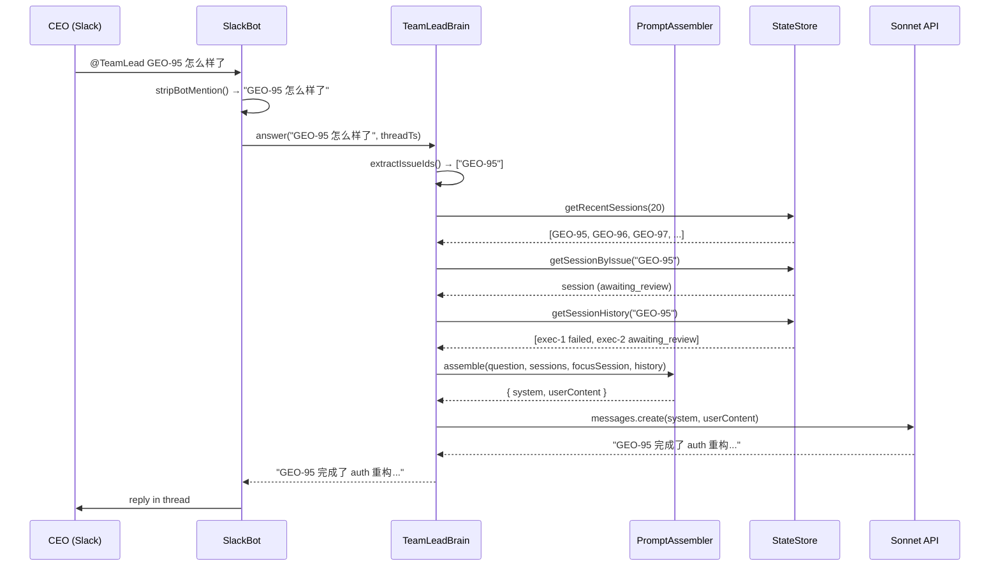

# v0.4 Step 2 — TeamLead Brain (LLM 对话层)

> status: codex-approved (3 original rounds + 3 verification rounds, 19 total issues resolved, 2026-03-06)
> source: `doc/engineer/exploration/new/v0.4-teamlead-agent.md` §7 Phase 1.5 + §4.5-4.6
> scope: Phase 1.5 only — Sonnet Q&A + structured prompts + thread-aware conversation
> no ContextInjector (Phase 2), no ProactiveMonitor (Phase 3), no smart notification crafting (keep templates)

---

## Context

v0.4 Step 1 (PR #10) 交付了 TeamLead daemon 骨架：EventIngestion, StateStore, SlackBot (Socket Mode), TemplateNotifier, ActionExecutor, StuckWatcher。

CEO 现在可以收到模板化 Block Kit 通知并点按钮操作。但 **无法对话** — 不能问 "GEO-95 改了什么"、"哪个 agent 卡了"、"现在几个 issue 在跑"。

Step 2 加入 **LLM 对话层**：

```
CEO 问 "GEO-95 怎么样了" → SlackBot 收到 → 加载 DB 上下文 → PromptAssembler 构建 XML prompt → Sonnet → 回复到 thread
```

**Design principle**: Stateless per-message（§4.6）— 每条消息独立调用，上下文从 SQLite 重建，不维护 session。

---

## Scope

**In scope**:
- CEO 在 Slack thread 里问问题 → Sonnet 回答（含 issue 状态、commit 详情、跨 issue 上下文）
- CEO @mention TeamLead → Sonnet 回答
- Structured XML prompts（借鉴 Codex `<subagent_notification>` 模式）
- Thread-aware：notification thread 中无需 @mention

**Out of scope**:
- Smart notification crafting（保持 TemplateNotifier 模板消息）
- ContextInjector（Phase 2 — 给新 agent 注入历史）
- ProactiveMonitor（Phase 3 — 升级 StuckWatcher）
- PR info supplementation（可选，不阻塞核心交付）

---

## Package Placement

所有改动在 `packages/teamlead/`。不新增 package。

| Component | File | Type |
|-----------|------|------|
| Config extension | `src/config.ts` | modify |
| StateStore query extensions | `src/StateStore.ts` | modify |
| PromptAssembler | `src/PromptAssembler.ts` | **new** |
| TeamLeadBrain | `src/TeamLeadBrain.ts` | **new** |
| SlackBot message handler | `src/SlackBot.ts` | modify |
| Daemon wiring | `src/index.ts` | modify |

New dependency:
```
@anthropic-ai/sdk    # Sonnet API client
```

---

## Execution Order

7 tasks, mostly sequential.

---

## Task 1: Extend Config for LLM

**Modify**: `packages/teamlead/src/config.ts`

> Note: `@anthropic-ai/sdk@^0.77.0` already in `package.json` — no dependency change needed (VR1 #7).

### Changes

**config.ts** — extend `TeamLeadConfig`:
```typescript
export interface TeamLeadConfig {
  // ... existing fields ...
  anthropicApiKey?: string;
  llmModel: string;
  llmMaxTokens: number;
  allowedUserIds: string[];   // Codex R1 #1: Q&A access control
  allowAllUsers: boolean;     // Codex R2 #2: explicit opt-in for open access
}
```

In `loadConfig()`:
```typescript
return {
  // ... existing ...
  anthropicApiKey: process.env.ANTHROPIC_API_KEY,
  llmModel: process.env.TEAMLEAD_LLM_MODEL ?? "claude-sonnet-4-5-20250514",
  llmMaxTokens: parseInt(process.env.TEAMLEAD_LLM_MAX_TOKENS ?? "1024", 10),
  allowedUserIds: process.env.TEAMLEAD_ALLOWED_USER_IDS
    ? process.env.TEAMLEAD_ALLOWED_USER_IDS.split(",").map((s) => s.trim()).filter(Boolean)
    : [],
  allowAllUsers: process.env.TEAMLEAD_ALLOW_ALL_USERS === "true",
};
```

No validation on `ANTHROPIC_API_KEY` — optional. Brain simply won't be created without it.

**Secure-by-default access control** (Codex R1 #1 + R2 #2, VR1 #1):

When `ownsSlack && anthropicApiKey` are both set (brain + Slack both enabled), access control is enforced:
- If `TEAMLEAD_ALLOWED_USER_IDS` is set → only listed users can use Q&A
- If `TEAMLEAD_ALLOW_ALL_USERS=true` → all channel members can use Q&A (explicit opt-in)
- If **neither** is set → **startup error** ("Brain Q&A requires TEAMLEAD_ALLOWED_USER_IDS or TEAMLEAD_ALLOW_ALL_USERS=true")

Validation is scoped to `ownsSlack && anthropicApiKey` (VR1 #1) to avoid blocking event-only mode or environments with a global `ANTHROPIC_API_KEY` that isn't intended for TeamLead.

**Validation code** (in `loadConfig()`, after building the config object):
```typescript
if (config.ownsSlack && config.anthropicApiKey && !config.allowAllUsers && config.allowedUserIds.length === 0) {
  throw new Error(
    "Brain Q&A requires TEAMLEAD_ALLOWED_USER_IDS or TEAMLEAD_ALLOW_ALL_USERS=true"
  );
}
```

### Test Cases

| # | Test | Verifies |
|---|------|----------|
| 1 | loadConfig without ANTHROPIC_API_KEY returns undefined | Graceful absence |
| 2 | loadConfig with ANTHROPIC_API_KEY + allowedUserIds returns both | Config loading |
| 3 | loadConfig with ANTHROPIC_API_KEY + empty allowlist + no allowAll → throws | Secure-by-default (Codex R2 #2, R3 #1) |
| 4 | loadConfig with ANTHROPIC_API_KEY + non-empty allowlist → passes | Allowlist path |
| 5 | loadConfig with ANTHROPIC_API_KEY + allowAllUsers=true → passes | Opt-in open access |

### Commit

`feat(teamlead): extend config with LLM and access control settings`

---

## Task 2: StateStore Query Extensions

**Modify**: `packages/teamlead/src/StateStore.ts`, `packages/teamlead/src/__tests__/StateStore.test.ts`

### New Methods

```typescript
/**
 * Get most recent sessions across all projects, ordered by last_activity_at DESC.
 * Used by PromptAssembler to build <agent_status> context.
 */
getRecentSessions(limit: number = 20): Session[]

/**
 * Get all executions for a given issue, ordered chronologically.
 * Used for retry history context ("last time GEO-95 failed because...").
 */
getSessionHistory(issueId: string): Session[]

/**
 * Reverse lookup: find the thread_ts associated with an issue.
 * Returns the most recently updated thread for the issue.
 */
getThreadForIssue(issueId: string): string | undefined
```

### Implementation

```typescript
getRecentSessions(limit = 20): Session[] {
  const stmt = this.db.prepare(
    "SELECT * FROM sessions ORDER BY last_activity_at DESC LIMIT ?",
  );
  stmt.bind([limit]);
  const rows: Session[] = [];
  while (stmt.step()) {
    rows.push(this.rowToSession(stmt.getAsObject() as Record<string, unknown>));
  }
  stmt.free();
  return rows;
}

getSessionHistory(issueId: string): Session[] {
  const stmt = this.db.prepare(
    "SELECT * FROM sessions WHERE issue_id = ? ORDER BY started_at ASC",
  );
  stmt.bind([issueId]);
  const rows: Session[] = [];
  while (stmt.step()) {
    rows.push(this.rowToSession(stmt.getAsObject() as Record<string, unknown>));
  }
  stmt.free();
  return rows;
}

getThreadForIssue(issueId: string): string | undefined {
  const stmt = this.db.prepare(
    "SELECT thread_ts FROM conversation_threads WHERE issue_id = ? ORDER BY last_updated DESC LIMIT 1",
  );
  stmt.bind([issueId]);
  if (stmt.step()) {
    const row = stmt.getAsObject() as Record<string, unknown>;
    stmt.free();
    return row.thread_ts as string;
  }
  stmt.free();
  return undefined;
}
```

### Test Cases

| # | Test | Verifies |
|---|------|----------|
| 1 | getRecentSessions returns sessions ordered by last_activity_at DESC | Ordering |
| 2 | getRecentSessions respects limit | Limit |
| 3 | getSessionHistory returns all sessions for an issue in chronological order | Multi-execution history |
| 4 | getSessionHistory returns empty array for unknown issue | Edge case |
| 5 | getThreadForIssue returns thread_ts for known issue | Reverse lookup |

### Commit

`feat(teamlead): add StateStore query extensions for Brain context loading`

---

## Task 3: PromptAssembler

**Create**: `packages/teamlead/src/PromptAssembler.ts`, `packages/teamlead/src/__tests__/PromptAssembler.test.ts`

### Interface

```typescript
import type { Session } from "./StateStore.js";

export interface AssembledPrompt {
  system: string;
  userContent: string;
}

export class PromptAssembler {
  /**
   * Build the full prompt for a CEO question.
   *
   * @param question - CEO's raw question text
   * @param activeSessions - all active/recent sessions (for cross-issue context)
   * @param focusSession - specific session the question is about (if identified)
   * @param issueHistory - past executions for the focused issue (retry context)
   */
  assemble(
    question: string,
    activeSessions: Session[],
    focusSession?: Session,
    issueHistory?: Session[],
  ): AssembledPrompt
}
```

### System Prompt

```typescript
const SYSTEM_PROMPT = `You are TeamLead, an AI engineering manager for the Flywheel autonomous development system.

Your responsibilities:
- Answer the CEO's questions about issue status, agent activity, and execution results
- Provide concise, factual answers based on the data provided
- Highlight potential concerns (stuck agents, failures, related issues)
- Use the issue identifier (e.g., GEO-95) when referring to issues

Rules:
- Only reference data provided in the context tags below. Do not hallucinate.
- Keep responses concise — 2-5 sentences for simple queries, more for complex ones.
- Use Chinese if the CEO writes in Chinese, English if in English.
- If you don't have enough data to answer, say so honestly.
- Never expose internal implementation details (execution IDs, DB schemas, etc.)`;
```

### XML Context Blocks

**`<agent_status>`** — overview of all active/recent sessions:
```xml
<agent_status>
- GEO-95: awaiting_review | "Refactor auth middleware" | 3 commits, 6 files (+120/-45) | needs_review
- GEO-96: running | "Add payment API" | started 10 min ago
- GEO-97: failed | "Fix CI pipeline" | error: npm test timeout
</agent_status>
```

**`<issue_detail>`** — deep detail for the focused issue:
```xml
<issue_detail issue="GEO-95">
Status: awaiting_review
Title: Refactor auth middleware
Summary: Refactored JWT verification, added token refresh logic and 3 unit tests
Commits: 3 | Files: 6 (+120/-45)
Decision: needs_review (78% confidence)
Reasoning: Changes to auth module require human verification
Changed files: src/auth/jwt.ts, src/auth/refresh.ts, ...
</issue_detail>
```

**`<issue_history>`** — past executions (for retry context):
```xml
<issue_history issue="GEO-95">
- Execution 1: failed | error: "npm test timeout on auth.test.ts" | 2h ago
- Execution 2: awaiting_review | 3 commits, 6 files | current
</issue_history>
```

### Truncation

- Each session in `<agent_status>` → ~80 chars. 20 sessions ≈ 1600 chars.
- `<issue_detail>` → ~500 chars max (truncate summary/reasoning at 200 chars, changed_files at 10 files).
- `<issue_history>` → ~100 chars per execution, max 5 executions.
- Total context: ~3000 chars ≈ ~800 tokens. Well within budget.

### Implementation Notes

- `buildAgentStatus(sessions: Session[]): string` — formats all sessions
- `buildIssueDetail(session: Session): string` — formats one session in detail
- `buildIssueHistory(history: Session[]): string` — formats execution history
- `assemble()` combines system + user content with XML blocks
- Helper: `formatSessionLine(session: Session): string` — one-line summary
- Helper: `escapeXml(text: string): string` — escapes `<`, `>`, `&` in DB-sourced text (Codex R1 #6: prevents XML structure breakage from user-generated content like code snippets, URLs, or error messages containing angle brackets)

### Test Cases

| # | Test | Verifies |
|---|------|----------|
| 1 | assemble includes system prompt | System prompt present |
| 2 | buildAgentStatus formats multiple sessions correctly | XML structure |
| 3 | buildAgentStatus handles empty sessions | Edge case |
| 4 | buildIssueDetail includes all fields | Field mapping |
| 5 | buildIssueDetail truncates long summary | Truncation |
| 6 | buildIssueHistory formats multiple executions | History context |
| 7 | assemble with focusSession includes issue_detail | Focused context |
| 8 | assemble without focusSession omits issue_detail | Minimal context |
| 9 | escapeXml handles angle brackets, ampersands in text | XML safety (Codex R1 #6) |
| 10 | buildIssueDetail with summary containing `<script>` tag escapes properly | XML injection edge case |

### Commit

`feat(teamlead): add PromptAssembler — structured XML context for Sonnet`

---

## Task 4: TeamLeadBrain

**Create**: `packages/teamlead/src/TeamLeadBrain.ts`, `packages/teamlead/src/__tests__/TeamLeadBrain.test.ts`

### Interface

```typescript
import Anthropic from "@anthropic-ai/sdk";
import type { StateStore } from "./StateStore.js";
import { PromptAssembler } from "./PromptAssembler.js";

export interface BrainConfig {
  model: string;
  maxTokens: number;
}

export class TeamLeadBrain {
  private client: Anthropic;
  private assembler: PromptAssembler;

  constructor(
    config: BrainConfig,
    private store: StateStore,
    apiKey: string,       // Codex R1 #5: explicit apiKey, no env ambiguity
    client?: Anthropic,   // injectable for testing
  ) {
    this.client = client ?? new Anthropic({ apiKey });
    this.assembler = new PromptAssembler();
  }

  /**
   * Answer a CEO question using Sonnet + DB context.
   *
   * @param question - CEO's question text (with @mention stripped)
   * @param threadTs - Slack thread timestamp (for thread context lookup)
   * @returns Response text, or null if brain cannot answer
   */
  async answer(question: string, threadTs?: string): Promise<string | null>
}
```

### Implementation Flow

```
answer(question, threadTs?)
  │
  ├─ 1. Extract issue IDs from question (regex: /[A-Za-z][A-Za-z0-9_-]*-\d+/g)
  │
  ├─ 2. If threadTs → look up issue_id from conversation_threads
  │     (provides implicit issue context even without explicit ID in text)
  │
  ├─ 3. Load context from StateStore:
  │     ├─ activeSessions = getRecentSessions(20)
  │     ├─ focusSession = getSessionByIssue(issueId) if issue identified
  │     └─ issueHistory = getSessionHistory(issueId) if issue identified
  │
  ├─ 4. Assemble prompt via PromptAssembler
  │
  ├─ 5. Call Anthropic messages.create()
  │     ├─ model: config.model
  │     ├─ max_tokens: config.maxTokens
  │     ├─ system: assembledPrompt.system
  │     └─ messages: [{ role: "user", content: assembledPrompt.userContent }]
  │
  └─ 6. Extract text response, return
```

### Issue ID Extraction

```typescript
// Codex R1 #3 + R2 #1: Exact alignment with parseActionId's ISSUE_ID_PATTERN
// (/^[A-Za-z][A-Za-z0-9_-]*-\d+$/), but without anchors for free-text extraction.
// Includes hyphens in prefix to match e2e-test-1 style issue IDs.
const ISSUE_ID_PATTERN = /[A-Za-z][A-Za-z0-9_-]*-\d+/g;

function extractIssueIds(text: string): string[] {
  return [...new Set(text.match(ISSUE_ID_PATTERN) ?? [])];
}
```

- Matches: `GEO-95`, `MY_PROJ-42`, `e2e-test-1`
- If multiple IDs found, use the first one as `focusSession`, others are in `activeSessions`
- If no ID found but `threadTs` maps to an issue → use that issue
- If no ID at all → answer with cross-issue overview context only

### Error Handling

```typescript
try {
  const response = await this.client.messages.create({ ... });
  // Extract text from response
} catch (err) {
  if (err instanceof Anthropic.RateLimitError) {
    return "I'm being rate-limited right now. Please try again in a moment.";
  }
  if (err instanceof Anthropic.APIConnectionError) {
    return "I can't reach my AI backend. Please check the connection.";
  }
  console.error("[TeamLeadBrain] LLM error:", err);
  return "Something went wrong. Please try again later."; // VR1 #6: always reply, never silently drop
}
```

### Test Cases

| # | Test | Verifies |
|---|------|----------|
| 1 | answer with issue ID loads focus session + history | Context loading |
| 2 | answer in known thread loads issue context from thread | Thread context |
| 3 | answer without issue ID loads only active sessions | Fallback context |
| 4 | answer calls Anthropic with correct model and system prompt | API call |
| 5 | answer returns text from Sonnet response | Happy path |
| 6 | answer handles rate limit error gracefully | Error handling |
| 7 | answer handles API connection error gracefully | Error handling |

### Commit

`feat(teamlead): add TeamLeadBrain — Sonnet-powered CEO Q&A`

---

## Task 5: SlackBot Message Handler

**Modify**: `packages/teamlead/src/SlackBot.ts`, `packages/teamlead/src/__tests__/SlackBot.test.ts`

### Interface Changes

```typescript
export interface SlackBotDeps {
  reactionsDispatch: (action: SlackAction) => Promise<ActionResult>;
  // NEW: message handler for CEO Q&A
  onMessage?: (question: string, threadTs?: string) => Promise<string | null>;
  // NEW: thread → issue lookup (for filtering known threads)
  getThreadIssue?: (threadTs: string) => string | undefined;
  // NEW: access control — Codex R1 #1
  allowedUserIds?: string[];
  allowAllUsers?: boolean;  // Codex R2 #2: explicit opt-in for open access
}
```

### New Handlers

**Access control helper** (Codex R1 #1):
```typescript
private isAllowedUser(userId: string): boolean {
  if (this.deps.allowAllUsers) return true;  // Codex R2 #2: explicit opt-in
  if (!this.deps.allowedUserIds?.length) return false;  // secure-by-default: no list = deny
  return this.deps.allowedUserIds.includes(userId);
}
```

**@mention handler** — responds when CEO @mentions the bot anywhere:

```typescript
this.app.event("app_mention", async ({ event, say }) => {
  if (!this.deps.onMessage) return;

  // Codex R1 #1: access control
  if (!this.isAllowedUser(event.user)) return;

  // Codex R1 #7: channel filtering — only respond in configured channel
  if (event.channel !== this.channelId) return;

  const question = stripBotMention(event.text, this.botUserId);
  if (!question.trim()) return;

  const threadTs = event.thread_ts ?? event.ts;
  const response = await this.deps.onMessage(question, threadTs);
  if (response) {
    await say({ text: response, thread_ts: threadTs });
  }
});
```

**Thread message handler** — responds in known notification threads (no @mention needed):

```typescript
this.app.message(async ({ message, say }) => {
  if (!this.deps.onMessage || !this.deps.getThreadIssue) return;

  // Skip bot messages and subtypes (joins, topic changes, etc.)
  const msg = message as any;
  if (msg.subtype || msg.bot_id) return;

  // Only handle messages in threads
  if (!msg.thread_ts) return;

  // Codex R1 #1: access control
  if (!this.isAllowedUser(msg.user)) return;

  // Codex R1 #7: channel filtering
  if (msg.channel !== this.channelId) return;

  // Codex R1 #4: Only skip messages that mention THIS bot (not all mentions)
  // app.event('app_mention') already handles those
  if (msg.text?.includes(`<@${this.botUserId}>`)) return;

  // Only respond in known threads (created by TemplateNotifier)
  const issueId = this.deps.getThreadIssue(msg.thread_ts);
  if (!issueId) return;

  const response = await this.deps.onMessage(msg.text ?? "", msg.thread_ts);
  if (response) {
    await say({ text: response, thread_ts: msg.thread_ts });
  }
});
```

**Bot user ID**: Retrieved from `this.app.client.auth.test()` during `start()`, cached as `this.botUserId`.

### Helper

```typescript
// VR1 #3: Only strip THIS bot's mention, preserve other user mentions
function stripBotMention(text: string, botUserId: string): string {
  return text.replace(new RegExp(`<@${botUserId}>`, "g"), "").trim();
}
```

### Slack App Config Prerequisite (Codex R1 #2)

**Event subscriptions** (Slack App dashboard → Event Subscriptions → Subscribe to bot events):
- `app_mention` — for @mentions
- `message.channels` — for messages in public channels

**Required bot scopes** (OAuth & Permissions → Bot Token Scopes):
- `app_mentions:read` — receive app_mention events
- `channels:history` — read messages in public channels (for thread replies)
- Existing scopes: `chat:write`, `chat:write.public`, `reactions:write`

**After changing scopes**: Reinstall the app to the workspace (OAuth & Permissions → Reinstall).

**Note**: `groups:history` scope needed if bot is used in private channels (not needed for Phase 1.5 — #general is public).

### Test Cases

| # | Test | Verifies |
|---|------|----------|
| 1 | app_mention triggers onMessage with stripped text | @mention handling |
| 2 | app_mention replies in thread | Thread reply |
| 3 | Thread message in known thread triggers onMessage | Thread Q&A |
| 4 | Thread message in unknown thread is ignored | Filtering |
| 5 | Channel message (not in thread) is ignored | No spam |
| 6 | Bot message / subtype is ignored | Self-loop prevention |
| 7 | Unauthorized user (not in allowedUserIds) is silently ignored | Access control (Codex R1 #1) |
| 8 | Thread message with other user @mention (not bot) is NOT skipped | Dedup precision (Codex R1 #4) |
| 9 | Message in wrong channel is ignored | Channel filtering (Codex R1 #7) |

### Commit

`feat(teamlead): add SlackBot message handlers — @mention + thread Q&A`

---

## Task 6: Integration Wiring

**Modify**: `packages/teamlead/src/index.ts`

### Changes

```typescript
import { TeamLeadBrain } from "./TeamLeadBrain.js";

// In main():

// After creating store, inside the ownsSlack block (VR3 #2: Brain requires Slack):
let brain: TeamLeadBrain | undefined;
if (config.ownsSlack && config.anthropicApiKey) {
  brain = new TeamLeadBrain(
    { model: config.llmModel, maxTokens: config.llmMaxTokens },
    store,
    config.anthropicApiKey,  // Codex R1 #5: explicit apiKey
  );
  console.log(`[TeamLead] Brain enabled (model: ${config.llmModel})`);
} else {
  console.log("[TeamLead] Brain disabled (no ANTHROPIC_API_KEY)");
}

// Extend bot creation:
bot = new SlackBot(
  config.slackBotToken!,
  config.slackAppToken!,
  config.slackChannelId!,
  {
    reactionsDispatch: (action) => reactionsEngine.dispatch(action),
    // NEW: wire brain
    onMessage: brain
      ? (q, ts) => brain!.answer(q, ts)
      : undefined,
    getThreadIssue: (ts) => store.getThreadIssue(ts),
    allowedUserIds: config.allowedUserIds,  // Codex R1 #1
    allowAllUsers: config.allowAllUsers,    // Codex R2 #2
  },
);
```

### Startup Log Examples

With brain:
```
[TeamLead] Brain enabled (model: claude-sonnet-4-5-20250514)
[TeamLead] Daemon started — events on :9876, Slack Socket Mode connected
```

Without brain (no API key):
```
[TeamLead] Brain disabled (no ANTHROPIC_API_KEY)
[TeamLead] Daemon started — events on :9876, Slack Socket Mode connected
```

### Environment Variables

| Variable | Required | Description |
|----------|----------|-------------|
| `ANTHROPIC_API_KEY` | For Q&A | Anthropic API key for Sonnet |
| `TEAMLEAD_LLM_MODEL` | No (default: `claude-sonnet-4-5-20250514`) | LLM model to use |
| `TEAMLEAD_LLM_MAX_TOKENS` | No (default: 1024) | Max tokens per response |
| `TEAMLEAD_ALLOWED_USER_IDS` | See below | Comma-separated Slack user IDs allowed to use Q&A (Codex R1 #1) |
| `TEAMLEAD_ALLOW_ALL_USERS` | See below | Set to `true` to allow all channel members to use Q&A (Codex R2 #2) |

**Access control rule**: When `TEAMLEAD_OWNS_SLACK=true` and `ANTHROPIC_API_KEY` is set, either `TEAMLEAD_ALLOWED_USER_IDS` or `TEAMLEAD_ALLOW_ALL_USERS=true` must be configured. Startup fails otherwise. Event-only mode is not affected.

### Implementation Notes (VR1 #4, VR3 #1)

The wiring logic in `index.ts` is simple enough (conditional brain creation + deps extension) that it doesn't warrant a separate testable factory. The "no key" scenario is covered by Task 1 config tests. Task 6 focuses on correct integration code — verified at build time and by Task 7 E2E (which tests Brain-specific scenarios only).

> VR3 #2: Brain creation is scoped to `config.ownsSlack && config.anthropicApiKey` (not just `anthropicApiKey` alone), consistent with the Task 1 validation rationale — Brain is useless without Slack.

### Commit

`feat(teamlead): wire TeamLeadBrain into daemon lifecycle`

---

## Task 7: E2E Smoke Test

**Create**: `packages/teamlead/src/__tests__/brain-e2e.test.ts`

Full loop simulation with mocked Anthropic client.

### Test Scenarios

```typescript
// 1. Insert session events into StateStore
// 2. Create TeamLeadBrain with mock Anthropic client
// 3. Simulate CEO question with issue ID
// 4. Verify: correct context loaded, Sonnet called, response returned

// 5. Simulate thread question (threadTs maps to issue)
// 6. Verify: issue context loaded from thread mapping
```

> Note (VR2 #1): "No API key" graceful degradation is already covered by Task 1 config tests. No need to duplicate in E2E.

| # | Test | Verifies |
|---|------|----------|
| 1 | CEO asks about specific issue → gets answer with issue detail | Full Q&A loop |
| 2 | CEO asks in notification thread → gets answer with thread context | Thread context |

### Commit

`test(teamlead): add E2E smoke test for TeamLead Brain Q&A loop`

---

## Summary

| Task | Files | LOC (impl) | LOC (test) | Tests |
|------|-------|------------|------------|-------|
| 1. Config Extension | 1 modify | ~25 | ~40 | 5 |
| 2. StateStore Extensions | 1 modify, 1 modify (test) | ~50 | ~60 | 5 |
| 3. PromptAssembler | 2 new | ~150 | ~140 | 10 |
| 4. TeamLeadBrain | 2 new | ~120 | ~100 | 7 |
| 5. SlackBot Message Handler | 1 modify, 1 modify (test) | ~90 | ~110 | 9 |
| 6. Integration Wiring | 1 modify | ~30 | ~0 | 0 |
| 7. E2E Smoke Test | 1 new | ~0 | ~50 | 2 |
| **Total** | **4 new, 4 modify** | **~465** | **~520** | **38** |

---

## Data Flow



---

## Verification

After all 7 tasks:

```bash
pnpm build          # all packages compile
pnpm test           # all 33 new + existing tests pass
pnpm typecheck      # no type errors
```

**Manual E2E** (requires Slack + Anthropic API key):
```bash
# 1. Add ANTHROPIC_API_KEY to packages/teamlead/.env
echo 'ANTHROPIC_API_KEY=sk-ant-...' >> packages/teamlead/.env

# 2. Add Slack event subscriptions:
#    Slack App dashboard → Event Subscriptions → Subscribe to bot events:
#    - app_mention
#    - message.channels

# 3. Start daemon
cd packages/teamlead && export $(grep -v '^#' .env | xargs) && node dist/index.js

# 4. In Slack #general:
#    - @TeamLead what's running?
#    - Reply in a notification thread: "tell me more"
```

**Step 2 完成标志**: `pnpm build && pnpm test` 全绿 + CEO 在 Slack @mention TeamLead 能收到 Sonnet 回复。

---

## Implementation Notes

1. **ESM imports**: use `.js` extension in all imports
2. **Anthropic SDK**: use `new Anthropic({ apiKey })` — explicit apiKey from config, not env auto-read (Codex R1 #5). Aligns version with `claude-runner` (`^0.77.0`).
3. **Stateless per-message**: no conversation history maintained in memory. Each question gets fresh context from SQLite. This is cheaper and safer than maintaining sessions.
4. **Token budget**: ~800 tokens context + ~200 tokens question = ~1000 tokens input. At Sonnet pricing ($3/MTok input, $15/MTok output), each Q&A costs ~$0.003 input + ~$0.015 output ≈ $0.018/call.
5. **Issue ID extraction**: regex `/[A-Za-z][A-Za-z0-9_-]*-\d+/g` — exact alignment with `parseActionId`'s `ISSUE_ID_PATTERN` (Codex R1 #3 + R2 #1). Covers `GEO-95`, `MY_PROJ-42`, `e2e-test-1`.
6. **Thread filtering**: `app.message()` only responds in threads with known `thread_ts` in `conversation_threads` table. Prevents bot from responding to random channel messages.
7. **@mention dedup**: `app.message()` handler skips messages containing the bot's own user ID `<@BOT_ID>` only (Codex R1 #4). Other user @mentions are NOT filtered — CEO can mention colleagues while asking TeamLead questions.
8. **Graceful degradation**: No `ANTHROPIC_API_KEY` → `brain = undefined` → `onMessage = undefined` → message handlers are no-ops. Button actions still work.
9. **Slack App config**: Requires `app_mentions:read` + `channels:history` scopes and `app_mention` + `message.channels` event subscriptions (Codex R1 #2). After scope changes, reinstall app. Socket Mode handles delivery — no URL needed.
10. **Chinese/English**: System prompt instructs Sonnet to match the CEO's language. This covers 小李 writing in Chinese naturally.
11. **XML escaping**: `escapeXml()` helper in PromptAssembler escapes `<`, `>`, `&` in all DB-sourced text before embedding in XML context blocks (Codex R1 #6).
12. **Access control**: Secure-by-default (Codex R1 #1 + R2 #2, VR1 #1). When `ownsSlack && anthropicApiKey` (brain + Slack both enabled), either `TEAMLEAD_ALLOWED_USER_IDS` or `TEAMLEAD_ALLOW_ALL_USERS=true` must be set. Startup fails otherwise. Event-only mode or environments with global `ANTHROPIC_API_KEY` are not affected. Checked in both handlers before calling `onMessage`.
13. **Channel filtering**: Both handlers check `event.channel === this.channelId` to prevent responding in unexpected channels (Codex R1 #7).

---

## Codex Review Resolution Log

### Round 1 (7 issues)

| # | Codex Issue | Resolution |
|---|-------------|------------|
| 1 | Q&A 访问控制 — 任何用户可触发 LLM | **Accepted**: 加 `TEAMLEAD_ALLOWED_USER_IDS` allowlist, SlackBot 在调 onMessage 前校验 |
| 2 | Slack 前置条件不完整 — 缺 scopes | **Accepted**: 补 `app_mentions:read` + `channels:history` scopes，写"上线前置清单" |
| 3 | Issue ID 正则过窄 | **Accepted**: 改为 `/[A-Za-z][A-Za-z0-9_-]*-\d+/g`（含中划线），对齐 `parseActionId` |
| 4 | app.message 去重策略误伤 — 跳过所有 mention | **Accepted**: 只跳过包含 bot 自身 user ID 的 mention |
| 5 | Anthropic SDK 版本不一致 (`^0.52.0` vs `^0.77.0`) | **Accepted**: 改为 `^0.77.0`，显式传 apiKey |
| 6 | XML prompt 未定义转义策略 | **Accepted**: 加 `escapeXml()` helper + 测试 |
| 7 | 线程识别缺 channel 维度 | **Partially accepted**: handler 层加 channel 过滤，不改 DB schema |

### Round 2 (2 issues)

| # | Codex Issue | Resolution |
|---|-------------|------------|
| R2-1 | Issue ID 正则仍未对齐 + 文档内部不一致 | **Accepted**: 统一为 `/[A-Za-z][A-Za-z0-9_-]*-\d+/g`（含中划线），修复 L374 |
| R2-2 | 访问控制默认全员开放不安全 | **Accepted**: 改为 secure-by-default — brain enabled 时必须配 allowlist 或 `TEAMLEAD_ALLOW_ALL_USERS=true` |

### Round 3 (2 issues)

| # | Codex Issue | Resolution |
|---|-------------|------------|
| R3-1 | 启动验证未落到代码位点 + 缺测试 | **Accepted**: 加 `loadConfig()` 校验代码 + 3 条测试 (throw/allowlist/allowAll) |
| R3-2 | Resolution Log 残留旧 regex (缺 `-`) | **Accepted**: 修正为 `/[A-Za-z][A-Za-z0-9_-]*-\d+/g` |

### Verification Round 1 (7 issues)

| # | Codex Issue | Resolution |
|---|-------------|------------|
| VR1-1 | 启动校验触发条件过宽 — event-only 模式被误阻 | **Accepted**: 改为 `ownsSlack && anthropicApiKey` 时才校验 |
| VR1-2 | 默认模型名 `claude-sonnet-4-20250514` 与仓库不一致 | **Accepted**: 改为 `claude-sonnet-4-5-20250514` |
| VR1-3 | `stripBotMention` 移除所有 mention 破坏语义 | **Accepted**: 只移除 bot 自身 mention `<@${botUserId}>` |
| VR1-4 | Task 6/7 测试不匹配 `index.ts` 结构 | **Partially accepted**: 不加 factory 重构，Task 6 去掉 unit test（改由 Task 7 E2E 覆盖） |
| VR1-5 | allowlist 空值过滤缺 `filter(Boolean)` | **Accepted**: 加 `.filter(Boolean)` |
| VR1-6 | 未知 LLM 错误返回 null → 静默无响应 | **Accepted**: 返回统一降级文案 |
| VR1-7 | `@anthropic-ai/sdk` 已在 package.json | **Accepted**: Task 1 去掉依赖添加步骤，更新 commit message |

### Verification Round 2 (1 issue)

| # | Codex Issue | Resolution |
|---|-------------|------------|
| VR2-1 | Task 7 "no API key" E2E 测试实为 wiring 测试，与当前 main() 结构不匹配 | **Accepted**: 删除该场景，graceful degradation 由 Task 1 config tests 覆盖 |

### Verification Round 3 — APPROVED (2 non-blocking notes)

| # | Codex Note | Resolution |
|---|------------|------------|
| VR3-1 | Task 6 implementation notes 残留 "Task 7 E2E 覆盖 no key" | **Accepted**: 清理文案 |
| VR3-2 | Brain 创建应限制在 `ownsSlack && anthropicApiKey` | **Accepted**: Task 6 wiring code 加 `config.ownsSlack` 条件 |
