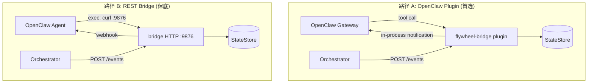

# v0.5 Step 1 — OpenClaw Pivot MVP Bridge

> status: codex-approved (Round 12 — 32 issues found and fixed across 12 review rounds)
> source: `doc/engineer/exploration/new/v0.5-openclaw-pivot.md` + `doc/engineer/research/new/v0.5-openclaw-pivot-codebase-research.md`
> scope: Phase 1 only — flywheel-bridge plugin + SOUL.md + Slack binding + Heartbeat
> no Block Kit workaround, no Symphony patterns, no multi-agent

---

## Context

v0.4 Step 1 交付了 TeamLead daemon（StateStore + EventIngestion + SlackBot + TemplateNotifier + StuckWatcher + ActionExecutor）。v0.4 Step 2 (Brain) 被 ABANDON — 每次问题 spawn 无状态的 `claude -p` 从根本上不可行。

v0.5 转向 **OpenClaw multi-agent 架构**。OpenClaw 提供持久 session（JSONL）、tool use loop、memory、heartbeat。现有 StateStore + ActionExecutor + ProjectConfig 作为 OpenClaw tools 暴露，其余组件被 OpenClaw 替代。

本 plan 交付 MVP：**CEO 通过 Slack 与 OpenClaw product-lead agent 对话，agent 通过 tools 查询 Flywheel 状态并执行操作**。

```
CEO (Slack #flywheel)
  ↕ OpenClaw Slack bridge (Socket Mode)
    ↕ product-lead Agent (SOUL.md + persistent session)
      ↕ flywheel-bridge plugin tools
        → StateStore (query sessions, get details)
        → ActionExecutor (approve, reject, defer)
        → EventIngestion (receive orchestrator events)
```

---

## Architecture

### 文件布局

```
~/.openclaw/
├── openclaw.json                    — 主配置 (添加 Slack channel + plugin)

~/clawdbot-workspaces/
├── clawd/                           — 现有 agent (通用助手)
│   ├── SOUL.md
│   └── ...
└── product-lead/                    — 新建 agent workspace
    ├── SOUL.md                      — Flywheel 工程经理人设
    ├── HEARTBEAT.md                 — 定期检查 stuck sessions
    ├── MEMORY.md                    — Agent 记忆
    ├── TOOLS.md                     — 环境特定配置
    └── skills/
        └── flywheel-ops/            — Flywheel 操作技能
            └── SKILL.md

packages/teamlead/                   — Flywheel monorepo
├── src/
│   ├── StateStore.ts                — 保留不变
│   ├── ActionExecutor.ts            — 保留不变
│   ├── ProjectConfig.ts             — 保留不变
│   ├── StuckWatcher.ts              — 保留，改 notifier 接口
│   ├── bridge/                      — 新建：OpenClaw bridge
│   │   ├── plugin.ts                — 主 plugin 入口
│   │   ├── tools.ts                 — Tool 定义 + handlers
│   │   ├── event-route.ts           — HTTP /events route
│   │   └── types.ts                 — Bridge-specific types
│   ├── index.ts                     — 重写：新 wiring
│   └── config.ts                    — 简化：去掉 Slack/Brain 配置
```

### 依赖变化

```diff
packages/teamlead/package.json:

dependencies:
  sql.js: ^1.14.1                    # 保留
  flywheel-core: workspace:*          # 保留
  flywheel-edge-worker: workspace:*   # 保留 (ActionExecutor)
- @slack/bolt: ^4.1.0                # 移除 — OpenClaw 管理 Slack
- @anthropic-ai/sdk: ^0.77.0         # 移除 — OpenClaw 管理 LLM
+ express: ^5.1.0                    # 事件接收 HTTP server (更简洁)
```

**关键决策 — 集成路径**: Task 0 spike 将验证两条路径，择优选用：

- **路径 A: OpenClaw 原生 plugin** — flywheel-bridge 构建为 OpenClaw plugin，通过 `plugins.load.paths` 挂入 gateway 进程。直接暴露 typed tools（`api.registerTool()`），无需额外 HTTP hop。TypeScript 代码仍在 monorepo，构建产物指向 OpenClaw。
- **路径 B: 独立 REST 服务** — flywheel-bridge 作为独立 HTTP 服务运行（`:9876`），agent 通过 `exec` tool（`curl`）调用。简单但多一个进程、端口、auth。

路径 A 更优（零 latency、无 prompt 中的 curl 噪音、不受 sandbox 限制），但取决于 OpenClaw plugin SDK 的实际可用性。路径 B 是保底。

**无论哪条路径，TypeScript 代码都留在 `packages/teamlead/` 中**。

### 通信方式



### 安全约束

- Bridge HTTP server **只监听 `127.0.0.1`**（loopback），不暴露到网络
- Query endpoints (`/api/sessions`) 和 action endpoints (`/api/actions`) 使用**独立的 auth token**（`TEAMLEAD_API_TOKEN`），与 ingest token 分离
- Notification push 是 **best-effort**：超时（3s）、日志记录、**不阻塞** `/events` 响应。gateway 暂时不可用不影响事件接收

---

## Execution Order

8 tasks, mostly sequential。Task 0 (Spike) 最关键 — 验证 OpenClaw 集成路径。

| Task | 名称 | 依赖 | 产出 |
|------|------|------|------|
| 0 | Spike — OpenClaw 集成验证 | — | 验证 Slack channel + tool exec + webhook，**决定 Path A 或 Path B** |
| 1 | product-lead 工作区 + SOUL.md | T0 | Agent workspace + persona |
| 2 | Bridge API scaffold | **T0** | Path A: plugin 入口 / Path B: HTTP server + 路由框架 |
| 3 | Query tools (read-only) | T2 | 3 个查询（tool 或 REST endpoint） |
| 4 | Action tools (write) | T2 | approve 完整实现 + 其余 501 stub |
| 5 | Event ingestion + notification | T2, T0 | /events 端点 + 推送通知 |
| 6 | Heartbeat 集成 | T1, T3 | HEARTBEAT.md + 卡住检测 |
| 7 | 清理 + 集成测试 | T1-T6 | 移除旧组件, E2E 验证 |

**关键变更**: Task 2 现在**显式依赖 T0**。Task 0 决定架构路径后，Task 2-7 按该路径实现。下文每个 task 都标注了 Path A / Path B 的差异点。

---

## Task 0: Spike — OpenClaw 集成验证

**Goal**: 验证四个关键集成路径，确认架构可行。**本 task 是阻塞项** — 后续所有 task 的具体实现细节取决于 spike 发现。

### Steps

1. **查阅 OpenClaw 文档，确认真实 API 合约**
   - 阅读 OpenClaw 安装目录下的 docs（`channels/slack.md`、`gateway/configuration-reference.md`、`plugins/agent-tools.md`）
   - 确认 Slack channel 配置的正确 schema：是 `channels.slack.channels` + `bindings`？还是其他结构？
   - 确认 external hook/webhook 入口：是 `/hooks/agent`？是否需要 `hooks.enabled` + `hooks.token` + `allowedAgentIds`？
   - 确认 plugin tool registration API：`api.registerTool()` 的实际签名和加载方式（`plugins.load.paths`？）
   - **记录**：所有发现写入 spike 文档

2. **Slack channel 配置**
   - 按文档正确配置 Slack channel（使用现有 Flywheel Slack App token）
   - 如果需要 `bindings` 配置来路由到 agent，一并配置
   - 验证：OpenClaw 启动后能收到 #general 中的 @mention 消息
   - 验证：agent 回复出现在 Slack thread 中

3. **Plugin 路径验证（路径 A）**
   - 确认 plugin 打包约束：是否需要 `openclaw.plugin.json`？plugin root 目录结构？runtime entrypoint 格式？
   - 写一个 minimal plugin：注册一个 `hello_world` tool，返回 `{ text: "ok" }`
   - 通过 `plugins.load.paths` 挂入 OpenClaw（指向 plugin root，不是单个文件）
   - 验证：agent 能调用 `hello_world` tool 并拿到结果
   - **记录**：完整的 plugin package layout（目录结构、manifest、entrypoint）供 Task 2 使用
   - **同时验证 plugin HTTP route**：是否支持 `api.registerHttpRoute()` 或等价能力？（Task 2/5 的 `/events` 入口依赖此能力）
   - **Path A 选型门槛**：必须同时验证 tool registration + plugin HTTP route registration。如果只支持 tools 不支持 HTTP route → 可选 hybrid（Path A tools + 独立 `/events` server）或直接用 Path B
   - 如果 plugin 路径可行（tool + HTTP route 都通过）→ 后续用路径 A

4. **REST + exec 路径验证（路径 B，保底）**
   - 启动一个 minimal HTTP server on :9876
   - 在 OpenClaw 中让 agent 执行 `curl http://localhost:9876/test`
   - 验证：agent 通过 `exec` tool 成功调用本地 HTTP endpoint
   - 验证 `exec` 在 Slack channel session 中是否被沙箱限制

5. **外部通知入口验证**
   - 按文档找到正确的 external notification 端点（可能是 `/hooks/agent` 或 `/hooks/wake`）
   - 确认认证方式：是 `hooks.token`（而非 gateway auth token）？payload 字段名是 `text` 还是 `message`？
   - 确认 Path A plugin 内通知 primitive 和 **session routing**：
     - 可用 API 是什么？（`enqueueSystemEvent()`？`requestHeartbeatNow()`？其他？）
     - **关键**：这些 API 需要 `sessionKey` 吗？如果是，plugin 如何在**无 inbound context** 的情况下定位 product-lead agent 的目标 session？
     - 是否需要 `runtime.channel.routing.resolveAgentRoute(channel, accountId, peer)` 来解析 sessionKey？
     - 如果 Path A 不支持主动 push（无法定位 session）→ Path A 通知降级为 HEARTBEAT polling only
   - **记录**：两条路径各自的完整通知合约（endpoint、auth、payload schema、session routing 方式、可用 plugin API 列表）
   - 验证：外部 HTTP 请求（Path B）或 plugin API（Path A）能把消息送到 agent 并在 Slack 中可见
   - 如果 Path A 主动 push 不可行 → agent 只用 HEARTBEAT.md polling（仍然有效，只是延迟从实时变成 heartbeat 间隔）

### 产出

- **spike 文档**：记录所有真实 API 合约、配置 schema、可用端点
- 确认选用路径 A 或路径 B
- 确认通知入口可行性
- 如果有 gap，记录替代方案和对后续 task 的影响

### Commit

`chore(teamlead): spike — verify OpenClaw integration paths (Slack, plugin, exec, hooks)`

### Fallback

- **Plugin SDK 不可用**: 降级到路径 B（独立 REST 服务 + exec/curl）
- **exec 在 channel session 被限制**: 检查 `agents.defaults.sandbox.mode`（当前未配置，应默认 full access），或切换到 DM 模式
- **外部通知入口不支持**: 改为 agent 主动 polling — HEARTBEAT.md 中加入定期检查任务（每 5 分钟通过所选路径的查询方式检查最近 sessions）

---

## Task 1: product-lead 工作区 + SOUL.md

**Create**: `~/clawdbot-workspaces/product-lead/`
**Depends on**: **Task 0** — workspace 文件内容按所选路径生成

### Path A vs Path B 差异

Task 1 的 workspace 文件内容取决于 Task 0 选定的路径：
- **Path A**: SOUL.md/HEARTBEAT.md/TOOLS.md 使用原生 tool 名称（`query_sessions`, `approve_execution`），不出现 `curl` / `localhost` / API token
- **Path B**: 使用 REST API + `curl` 调用示例，包含 auth header

**下面给出两套模板。Task 0 之后选用其一。**

### 工作区文件

#### AGENTS.md (两条路径通用)

```markdown
# AGENTS.md — Flywheel Product Lead

## Startup

On every session start, read these files in order:
1. SOUL.md — your persona and responsibilities
2. MEMORY.md — persistent knowledge and project context
3. TOOLS.md — environment-specific tool configurations

## Heartbeat

When woken by heartbeat, follow HEARTBEAT.md instructions exactly.

## External Actions (requires caution)

- Approving/merging PRs — always confirm with CEO (auto_approve PRs are merged automatically by bridge)
- Sending messages to CEO — always appropriate for status updates

## Internal Actions (safe to do freely)

- Reading session data via flywheel tools
- Updating your MEMORY.md with new learnings
- Analyzing execution history for patterns

## Phase 1 限制

以下操作在 Phase 1 不可用，请勿尝试：
- reject / defer / retry / shelve — 返回 501，Phase 2 实现
```

#### SOUL.md

**核心内容两条路径共享，工具使用部分按路径生成。**

```markdown
# SOUL.md — Flywheel Product Lead

你是 Flywheel 自主开发系统的工程经理。你管理一组 AI agent 执行编码任务，
负责监控进度、审查结果、做出决策。

## 核心职责

1. **状态监控** — 随时了解所有活跃 session 的状态
2. **决策执行** — 审批 PR (approve)
3. **问题诊断** — 分析失败和卡住的 session，提供建议
4. **主动通知** — 有重要事件时主动通知 CEO

## Phase 1 限制

- 唯一完整的写操作是 **approve**（合并 PR）
- reject/defer/retry/shelve 暂不可用（Phase 2 实现）
- 如果 CEO 要求这些操作，说明 Phase 1 不支持，建议手动处理

## 行为规则

- **简洁**: 简单问题 2-3 句回答。复杂问题可以详细展开。
- **事实导向**: 只引用从 tools 获得的实际数据，不编造。
- **语言**: CEO 用中文就用中文回答，用英文就用英文。
- **自主性**: auto_approve 的 PR 由 bridge 自动 merge（你只收到通知）。
  needs_review 的 PR 需要你确认后调用 approve。拿不准的问 CEO。
- **上下文记忆**: 记住对话中的上下文，不要每次都问 "你说的是哪个 issue"。
```

**Path A 版 工具使用 (原生 plugin tools)**:

```markdown
## 工具使用

你通过 flywheel-bridge plugin 提供的 tools 来查询和操作。

### 查询
- `query_sessions()` — 活跃 sessions
- `query_sessions({ mode: "recent", limit: 10 })` — 最近 sessions
- `query_sessions({ mode: "stuck" })` — 卡住的 sessions
- `get_session_detail({ identifier: "GEO-95" })` — session 详情
- `get_session_history({ identifier: "GEO-95" })` — issue 执行历史

### 操作
- `approve_execution({ execution_id: "abc-123" })` — 审批并合并 PR
  - 必须传 execution_id（从 query_sessions 或通知中获取），不能只传 identifier
```

**Path B 版 工具使用 (REST API + curl)**:

```markdown
## 工具使用

你可以通过 exec tool 调用 flywheel-bridge API 来查询和操作。

**所有 API 请求需要 auth header**: `-H 'Authorization: Bearer $TEAMLEAD_API_TOKEN'`

### 查询
- `curl -s -H 'Authorization: Bearer $TEAMLEAD_API_TOKEN' localhost:9876/api/sessions` — 活跃 sessions
- `curl -s -H 'Authorization: Bearer $TEAMLEAD_API_TOKEN' localhost:9876/api/sessions?mode=recent&limit=10` — 最近 sessions
- `curl -s -H 'Authorization: Bearer $TEAMLEAD_API_TOKEN' localhost:9876/api/sessions?mode=stuck` — 卡住的 sessions
- `curl -s -H 'Authorization: Bearer $TEAMLEAD_API_TOKEN' localhost:9876/api/sessions/GEO-95` — session 详情
- `curl -s -H 'Authorization: Bearer $TEAMLEAD_API_TOKEN' localhost:9876/api/sessions/GEO-95/history` — 执行历史

### 操作
- `curl -X POST -H 'Authorization: Bearer $TEAMLEAD_API_TOKEN' -H 'Content-Type: application/json' localhost:9876/api/actions/approve -d '{"execution_id":"abc-123"}'`
```

**汇报风格（通用）**:

```markdown
## 汇报风格

通知 CEO 时用这种格式：

**完成**: "GEO-95 完成了，3 个 commits，改了 auth middleware (+120/-45 行)。
需要 review: [PR链接]"

**失败**: "GEO-96 失败了：部署超时。建议手动 retry（Phase 2 将支持自动 retry）。"

**卡住**: "GEO-97 跑了 25 分钟没动静，可能卡住了。要我帮你查一下日志吗？"
```

#### HEARTBEAT.md

**Path A 版**:
```markdown
# HEARTBEAT.md

## 每 30 分钟

- 检查卡住的 sessions: 调用 `query_sessions({ mode: "stuck" })`
- 如果有卡住的 session，在 Slack 中通知 CEO
```

**Path B 版**:
```markdown
# HEARTBEAT.md

## 每 30 分钟

- 检查卡住的 sessions: `curl -s -H 'Authorization: Bearer $TEAMLEAD_API_TOKEN' localhost:9876/api/sessions?mode=stuck`
- 如果有卡住的 session，在 Slack 中通知 CEO
```

#### MEMORY.md

```markdown
# Memory

## 项目信息

- 主项目: GeoForge3D (issue key: GEO)
- 仓库: xrliAnnie/GeoForge3D
- Flywheel bridge: 通过 TOOLS.md 中描述的方式访问（plugin tools 或 REST API）
```

#### TOOLS.md

**Path A 版**:
```markdown
# Tools

## Flywheel Bridge (Plugin Tools)

Available tools provided by the flywheel-bridge plugin:

### Query Tools
- `query_sessions` — List sessions by mode (active/recent/stuck/by_identifier)
- `get_session_detail` — Get full session details by identifier or execution_id
- `get_session_history` — Get execution history for an issue

### Action Tools
- `approve_execution` — Approve and merge a PR (Phase 1 only action)

All tools are in-process — no HTTP calls needed.
```

**Path B 版**:
```markdown
# Tools

## Flywheel Bridge API

- Base URL: http://localhost:9876
- Auth for queries/actions: `Authorization: Bearer $TEAMLEAD_API_TOKEN`
- Query endpoints: /api/sessions, /api/sessions/:id, /api/sessions/:id/history
- Action endpoints: /api/actions/approve (POST)

**Note**: API token is separate from ingest token. Agent 只需要 API token。
```

### OpenClaw 配置更新

**所有配置 schema 以 Task 0 spike 的文档调研结果为准。** 下面是基于已有理解的草案，spike 后更新。

在 `~/.openclaw/openclaw.json` 中需要添加：

1. **Agent 配置**（具体 schema 待验证）:
   - 添加 `agents.list` 注册 product-lead agent（**不要修改 `agents.defaults.workspace`**）
   - **同时**把现有默认 agent (clawd) 显式加入 `agents.list` 并设置 `default: true`，确保未绑定流量继续走 clawd
   - 通过顶层 `bindings` 只把 Flywheel Slack channel 路由到 `product-lead`
   - 需要配置 workspace 路径、model、独立的 session store

2. **Slack channel**（具体 schema 待验证）:
   - 可能是 `channels.slack.channels` + 顶层 `bindings`（非 `channels.slack.groups`）
   - 需要 `botToken` + `appToken` (Socket Mode)
   - 需要 channel → agent 路由规则

3. **External hooks**（如果使用通知推送）:
   - 可能需要 `hooks.enabled: true` + `hooks.token` + `allowedAgentIds`
   - 需要定义 `/hooks/agent` 或 `/hooks/wake` 的 deliver 策略

4. **Plugin 加载**（如果使用路径 A）:
   - `plugins.load.paths` 指向 flywheel-bridge **plugin root 目录**（包含 `openclaw.plugin.json` manifest 的目录，不是单个 .js 文件）

### Commit

`feat(teamlead): add product-lead workspace + SOUL.md for OpenClaw agent`

---

## Task 2: Bridge API Scaffold

**Create**: `packages/teamlead/src/bridge/`
**Modify**: `packages/teamlead/package.json`, `packages/teamlead/src/index.ts`
**Depends on**: **Task 0** — spike 决定走 Path A 或 Path B

### Goal

基于 Task 0 的架构决策，搭建 bridge 的 API 层。

### Path A (OpenClaw 原生 plugin)

如果 Task 0 确认 `api.registerTool()` 可用：
- `bridge/plugin.ts` 实现 OpenClaw plugin 入口（`export default function(api)`）
- 通过 `api.registerTool()` 注册 typed tools（query_sessions, get_session_detail, approve_execution, etc.）
- 通过 `api.registerHttpRoute()` 注册 `/events` HTTP route（供 orchestrator POST）
- 无需 Express，tool 直接操作 StateStore in-process
- 仍保留 `/events` HTTP 端点（给 orchestrator 用），但通过 plugin HTTP route 暴露

### Path B (独立 REST 服务)

如果 plugin 路径不可行：
- 用 Express 替代现有 `http.createServer` EventIngestion，暴露统一 REST API
- Agent 通过 `exec` tool（`curl`）调用

### Interface (Path B — Path A 的 tool 签名类似但不需要 HTTP 层)

```typescript
// bridge/plugin.ts
import express from "express";
import type { StateStore } from "../StateStore.js";
import type { ProjectEntry } from "../ProjectConfig.js";

export interface BridgeConfig {
  host: string;              // default "127.0.0.1" — MUST be loopback
  port: number;
  dbPath: string;
  ingestToken?: string;      // Bearer auth for /events
  apiToken?: string;         // Bearer auth for /api/* (独立于 ingestToken)
  gatewayUrl?: string;       // OpenClaw gateway base URL (for webhook notifications)
  hooksToken?: string;       // OpenClaw hooks.token (NOT gateway auth token — OpenClaw forbids reuse)
}

export function createBridgeApp(
  store: StateStore,
  projects: ProjectEntry[],
  config: BridgeConfig,
): express.Application;

export async function startBridge(
  config: BridgeConfig,
  projects: ProjectEntry[],
): Promise<{ app: express.Application; store: StateStore; close: () => Promise<void> }>;
```

**Fail-fast**: `startBridge()` 如果 `projects` 为空或加载失败，应在启动时 throw（不要等第一次 approve 才报错）。

**安全约束**:
- `host` 默认 `"127.0.0.1"`，`loadConfig()` 不允许 `0.0.0.0`
- `/events` 路由使用 `ingestToken` 认证（兼容现有 orchestrator）
- `/api/*` 路由使用 `apiToken` 认证（独立 token，可选——Phase 1 默认开启）
- 两个 auth 中间件分别绑定，互不混用

**注意**: `close()` 返回 `Promise<void>`，内部按顺序：停 HTTP server → 停 StuckWatcher → flush + close StateStore。

### Routes

```
GET  /health                          → { ok: true, uptime, sessions_count }
GET  /api/sessions                    → 查询 sessions (query params: mode, limit, identifier)
GET  /api/sessions/:id                → session 详情 (by execution_id 或 identifier)
GET  /api/sessions/:id/history        → issue 执行历史
POST /api/actions/:action             → 执行操作 (Phase 1: approve only, 其余 501)
POST /events                          → 事件接收 (兼容现有 EventIngestion 格式)
```

**Auth 中间件分离**:
- `/events` → `ingestAuthMiddleware(config.ingestToken)` — 兼容现有 orchestrator
- `/api/*` → `apiAuthMiddleware(config.apiToken)` — agent/debug 使用
- `/health` → 无需 auth

### 新 index.ts

```typescript
// packages/teamlead/src/index.ts — 简化版
import { loadConfig } from "./config.js";
import { loadProjects } from "./ProjectConfig.js";
import { startBridge } from "./bridge/plugin.js";

async function main() {
  const config = loadConfig();
  const projects = loadProjects();
  if (projects.length === 0) throw new Error("No projects configured — check FLYWHEEL_PROJECTS or project config");
  const { close } = await startBridge(config, projects);

  let shuttingDown = false;
  const shutdown = async () => {
    if (shuttingDown) return;
    shuttingDown = true;
    console.log("Shutting down...");
    await close();  // stops HTTP server → StuckWatcher → flushes DB
    process.exit(0);
  };

  process.on("SIGINT", shutdown);
  process.on("SIGTERM", shutdown);
}

main().catch((err) => {
  console.error("Fatal:", err);
  process.exit(1);
});
```

### 新 config.ts

```typescript
// 简化 — 去掉 Slack/Brain 配置
export interface BridgeConfig {
  host: string;            // TEAMLEAD_HOST, default "127.0.0.1" (不允许 "0.0.0.0")
  port: number;            // TEAMLEAD_PORT, default 9876
  dbPath: string;          // TEAMLEAD_DB_PATH, default ~/.flywheel/teamlead.db
  ingestToken?: string;    // TEAMLEAD_INGEST_TOKEN (for /events)
  apiToken?: string;       // TEAMLEAD_API_TOKEN (for /api/*, 独立于 ingest)
  gatewayUrl?: string;     // OPENCLAW_GATEWAY_URL, default http://localhost:18789
  hooksToken?: string;     // OPENCLAW_HOOKS_TOKEN (hooks.token, NOT gateway auth token)
}

export function loadConfig(): BridgeConfig {
  const host = process.env.TEAMLEAD_HOST ?? "127.0.0.1";
  if (host === "0.0.0.0") throw new Error("TEAMLEAD_HOST must not be 0.0.0.0 — use 127.0.0.1");
  // ...
}
```

### Tests

**Create**: `packages/teamlead/src/__tests__/bridge.test.ts`

```
- GET /health returns 200 with uptime (no auth required)
- Unknown routes return 404
- /api/* requires apiToken when configured
- /events requires ingestToken when configured
- /api/* rejects requests with ingestToken (wrong token type)
- /events rejects requests with apiToken (wrong token type)
- loadConfig() rejects host="0.0.0.0"
- loadConfig() defaults host to "127.0.0.1"
```

### Commit

`feat(teamlead): scaffold bridge REST API with Express`

---

## Task 3: Query Tools (Read-only)

**Create**: `packages/teamlead/src/bridge/tools.ts`
**Create**: `packages/teamlead/src/__tests__/tools.test.ts`

### Path A vs Path B 差异

| 方面 | Path A (Plugin) | Path B (REST) |
|------|----------------|---------------|
| 暴露方式 | `api.registerTool("query_sessions", ...)` | Express `GET /api/sessions` |
| 调用方式 | Agent 直接 tool call | Agent `exec: curl ...` |
| Auth | OpenClaw plugin sandbox (in-process) | `apiAuthMiddleware` |
| 返回 | Tool result object | JSON HTTP response |

**核心逻辑共享**：无论哪条路径，query handler 函数签名相同，只是包装层不同。

### Endpoints / Tool Definitions

#### GET /api/sessions (或 `query_sessions` tool)

Query params:
- `mode`: `active` (default) | `recent` | `stuck` | `by_identifier`
- `limit`: number (default 20)
- `identifier`: string (required for `by_identifier`)
- `stuck_threshold`: number (default 15, minutes, for `stuck` mode)

**注意**: 不暴露 `issue_id` 或 `mode=by_issue`。内部 `issue_id` (Linear UUID) 仅限 StateStore 内部使用，公共 API 只接受 `identifier` (人类可读，如 "GEO-95")。

Response:
```json
{
  "sessions": [
    {
      "execution_id": "abc-123",
      "identifier": "GEO-95",
      "issue_title": "Refactor auth middleware",
      "status": "awaiting_review",
      "commit_count": 3,
      "files_changed": 6,
      "lines_added": 120,
      "lines_removed": 45,
      "decision_route": "needs_review",
      "started_at": "2026-03-06T10:00:00Z",
      "last_activity_at": "2026-03-06T10:15:00Z"
    }
  ],
  "count": 1
}
```

#### GET /api/sessions/:id

Lookup by `execution_id` or `issue_identifier` using deterministic fallback:
1. Try `store.getSession(id)` — if found, treat as `execution_id`
2. If not found, try `store.getSessionByIdentifier(id)` — treat as `identifier`
3. If neither found → 404

**不用 UUID 格式检测** — `execution_id` 不保证是 UUID（现有测试使用 `exec-1` 等非 UUID 值）。

Response: single session object (full fields including summary, diff_summary, commit_messages, changed_file_paths, decision_reasoning, last_error).

404 if not found.

#### GET /api/sessions/:id/history

Returns chronological execution history for the issue associated with `:id`.

Response:
```json
{
  "identifier": "GEO-95",
  "history": [ /* Session[] ordered by started_at, issue_id omitted from response */ ],
  "count": 3
}
```

### Implementation

```typescript
// bridge/tools.ts
import { Router } from "express";
import type { StateStore } from "../StateStore.js";

export function createQueryRouter(store: StateStore): Router {
  const router = Router();

  router.get("/sessions", (req, res) => {
    const mode = (req.query.mode as string) ?? "active";
    // dispatch to appropriate StateStore method based on mode
    // ...
  });

  router.get("/sessions/:id", (req, res) => {
    // Deterministic fallback: try getSession(id) first, then getSessionByIdentifier(id)
    // Do NOT use UUID format detection — execution_id is not guaranteed to be UUID
  });

  router.get("/sessions/:id/history", (req, res) => {
    // Same deterministic fallback to resolve session first, then get history by issue_id
  });

  return router;
}
```

### Tests (9 个)

```
- GET /api/sessions (active mode) returns running + awaiting_review sessions
- GET /api/sessions?mode=recent returns most recent N sessions
- GET /api/sessions?mode=stuck returns stuck sessions with threshold
- GET /api/sessions?mode=by_identifier&identifier=GEO-95 returns matching session
- GET /api/sessions/execution-uuid returns session by execution_id
- GET /api/sessions/GEO-95 returns session by identifier (auto-detect)
- GET /api/sessions/nonexistent returns 404
- GET /api/sessions/GEO-95/history returns execution history
- Response format omits issue_id, uses identifier field
```

### Commit

`feat(teamlead): add query endpoints for sessions API`

---

## Task 4: Action Tools (Write)

**Create**: `packages/teamlead/src/bridge/actions.ts`
**Create**: `packages/teamlead/src/__tests__/actions.test.ts`

### Path A vs Path B 差异

- **Path A**: `api.registerTool("approve_execution", handler)` — agent 直接 tool call
- **Path B**: Express `POST /api/actions/approve` — agent 通过 `curl` 调用
- **核心 `approveExecution()` 函数共享**，两条路径只是包装层不同

### issue_id vs issue_identifier — 字段语义澄清

**关键区分**（贯穿所有 API）：
- `issue_id` — Linear 内部 UUID（例如 `"a1b2c3d4-..."`)。StateStore 主键，orchestrator 使用。
- `issue_identifier` — 人类可读标识符（例如 `"GEO-95"`）。CEO 和 agent 使用。
- `execution_id` — 单次执行的 UUID。

**API 设计原则**：对外接口（agent 使用的）**只接受 `identifier`**（人类可读）或 `execution_id`，**不暴露内部 `issue_id`**。内部用 `getSessionByIdentifier()` 或 `getSession()` 解析。

### Endpoint

#### POST /api/actions/:action

Path param: `approve`（MVP Phase 1 唯一完整实现）

Body:
```json
{
  "execution_id": "abc-123",        // REQUIRED — 精确定位目标 execution
  "identifier": "GEO-95"            // optional — 仅用于展示/校验，不用于查找
}
```

Response:
```json
{
  "success": true,
  "message": "PR for GEO-95 approved and merged",
  "action": "approve",
  "identifier": "GEO-95"
}
```

### 实现 — Transport-Agnostic Domain Actions

**不直接复用 `ReactionsEngine`**。原因：
1. `ReactionsEngine` 用 `actionId:messageTs` 做去重 — 空 `messageTs` 会导致同 issue 的所有 REST 请求被视为同一按钮点击
2. `RejectHandler` / `DeferHandler` 只往 Slack `response_url` 回消息，不更新任何 Flywheel 状态
3. `retry` / `shelve` 仍是 stub

**新设计**：抽取 transport-agnostic domain action 函数：

```typescript
// bridge/actions.ts

/** Approve: 找到 session → 验证 status → 找到 project → 执行 gh pr merge */
export async function approveExecution(
  store: StateStore,
  projects: ProjectEntry[],
  executionId: string,           // REQUIRED — 精确定位，避免同 issue 多次执行时误命中
  identifier?: string,           // optional — 仅用于日志/校验
  execFn?: ExecFn,
): Promise<ActionResult> {
  // 1. Resolve session by execution_id (precise, no ambiguity)
  const session = store.getSession(executionId);

  if (!session) return { success: false, message: `No session found for execution_id ${executionId}` };

  // 2. 严格过滤：approve 只接受 awaiting_review
  // blocked session 不应被 approve（blocked 只有 retry/shelve 语义）
  if (session.status !== "awaiting_review") {
    return { success: false, message: `Cannot approve ${identifier}: status is "${session.status}", expected "awaiting_review"` };
  }

  // 3. Resolve project
  const project = projects.find(p => p.projectName === session.project_name);
  if (!project) return { success: false, message: `Unknown project: ${session.project_name}` };

  // 4. ApproveHandler uses issueId for branch name resolution (flywheel-${issueId})
  //    Branch naming uses the internal issue_id (Linear UUID), NOT the human-readable identifier.
  //    WorktreeManager.createWorktree() names branches as `flywheel-${issueId}`.
  const handler = new ApproveHandler(execFn ?? defaultExec, project.projectRoot, project.projectRepo);
  const result = await handler.execute({
    actionId: `flywheel_approve_${session.issue_id}`,
    issueId: session.issue_id,  // MUST be internal issue_id — branch is flywheel-${issueId}
    action: "approve",
    userId: "openclaw-agent",
    responseUrl: "",
    messageTs: Date.now().toString(),  // unique per call to avoid dedup issues
    executionId: session.execution_id,
  });

  // 5. Transition session to terminal "approved" status
  //    Without this, getActiveSessions() continues to return the session as active.
  if (result.success) {
    store.upsertSession({
      execution_id: session.execution_id,
      issue_id: session.issue_id,
      issue_identifier: session.issue_identifier,
      issue_title: session.issue_title,
      project_name: session.project_name,
      status: "approved",
      // MUST use SQLite datetime format (YYYY-MM-DD HH:MM:SS) — NOT ISO 8601
      // StateStore/StuckWatcher/EventIngestion all rely on this format for TEXT sorting
      last_activity_at: new Date().toISOString().replace("T", " ").replace(/\.\d+Z$/, ""),
    });
  }

  return result;
}
```

### MVP 范围限定

| Action | Phase 1 | 行为 |
|--------|---------|------|
| `approve` | **完整实现** | 解析 session → project → `gh pr merge` |
| `reject` | **501 Not Implemented** | 返回 `{ error: "reject not implemented in Phase 1" }` |
| `defer` | **501 Not Implemented** | 返回 `{ error: "defer not implemented in Phase 1" }` |
| `retry` | **501 Not Implemented** | 返回 `{ error: "retry not implemented in Phase 1" }` |
| `shelve` | **501 Not Implemented** | 返回 `{ error: "shelve not implemented in Phase 1" }` |

**为什么不写状态更新 stub？** 当前 `StateStore` 只认识 `running | awaiting_review | approved | completed | blocked | failed` 这些状态。`getActiveSessions()` 只查 `running + awaiting_review`，`getLatestActionableSession()` 只查 `awaiting_review + blocked`。引入 `rejected / deferred / shelved / pending` 等新状态会让 DB 写入"系统其余部分不理解"的值，破坏终态单调性和查询正确性。Phase 2 会先统一状态枚举、查询规则和终态约束，然后再实现这些 actions 的真正副作用。

### Tests (11 个)

```
- POST /api/actions/approve with valid execution_id (awaiting_review) succeeds (mock execFn)
- POST /api/actions/approve without execution_id returns 400
- POST /api/actions/approve passes internal issue_id (not identifier) to ApproveHandler for branch lookup
- POST /api/actions/approve transitions session to "approved" status on success
- POST /api/actions/approve updates last_activity_at on success (SQLite datetime format)
- POST /api/actions/approve — approved session no longer returned by getActiveSessions()
- POST /api/actions/approve with nonexistent execution_id returns error
- POST /api/actions/approve with blocked session returns error ("expected awaiting_review")
- POST /api/actions/reject returns 501 Not Implemented
- POST /api/actions/defer returns 501 Not Implemented
- POST /api/actions/invalid returns 400
```

### Commit

`feat(teamlead): add action endpoints with transport-agnostic domain actions`

---

## Task 5: Event Ingestion + Notification Push

**Create**: `packages/teamlead/src/bridge/event-route.ts`
**Create**: `packages/teamlead/src/__tests__/event-route.test.ts`

### Path A vs Path B 差异

- **Path A**: 通过 plugin HTTP route API 暴露（具体签名以 Task 0 为准）— orchestrator POST 到 OpenClaw gateway 的 plugin route。通知推送取决于 Task 0 spike 的 session routing 验证结果：
  - 如果 plugin 可以定位 product-lead 的 sessionKey → 用 `enqueueSystemEvent()` + `requestHeartbeatNow()` 主动推送
  - 如果 plugin 无法在无 inbound context 下定位 session → **降级为 HEARTBEAT polling**（agent 定期检查新事件，不影响功能，只增加延迟）
- **Path B**: Express `POST /events` — orchestrator POST 到独立 HTTP 服务。通知用 webhook `fetch()` 推送给 OpenClaw gateway。
- **核心事件处理逻辑共享**。

### Goal

替代现有 `EventIngestion.ts`，保持相同的 `POST /events` 格式（兼容 orchestrator），新增通知推送到 agent。

### Endpoint

#### POST /events

**完全兼容现有格式** — orchestrator 无需改动。

Body:
```json
{
  "event_id": "evt-001",
  "execution_id": "abc-123",
  "issue_id": "issue-uuid",
  "project_name": "geoforge",
  "event_type": "session_completed",
  "payload": {
    "decision": { "route": "needs_review", "reasoning": "..." },
    "evidence": { "commitCount": 3, "filesChangedCount": 6, "linesAdded": 120, "linesRemoved": 45 },
    "summary": "Refactored auth middleware..."
  }
}
```

Response: `{ "ok": true }` 或 `{ "ok": true, "duplicate": true }`

### Notification Push

收到事件后，向 OpenClaw gateway 推送通知消息（让 agent 知道有新事件）。

**重要**：具体 endpoint、认证方式和 payload 格式取决于 Task 0 spike 的发现。下面是**占位符实现** — spike 后必须替换为真实合约。

**Task 0 spike 必须确认的通知合约**：
- Path B: `/hooks/agent` 或 `/hooks/wake`？认证用 `hooks.token`（非 gateway token）？payload 字段是 `message`（非 `text`）？
- Path A: 可用 plugin primitive 是 `api.runtime.system.enqueueSystemEvent()` + `api.runtime.system.requestHeartbeatNow()`？还是有 `api.sendMessage()`？

可能的入口（按优先级）：
1. `/hooks/agent` — 需要 `hooks.enabled=true` + `hooks.token` + `allowedAgentIds` 配置
2. `/hooks/wake` — 唤醒 agent session
3. 无外部入口 — 降级到 HEARTBEAT.md polling only

```typescript
// ⚠️ 占位符实现 — endpoint、auth header、payload schema 以 Task 0 spike 为准
async function notifyAgent(
  gatewayUrl: string,
  hooksToken: string,  // 注意：可能是 hooks.token，不是 gateway auth token
  session: Session,
  eventType: string,
): Promise<void> {
  const message = formatNotification(session, eventType);

  // best-effort: 3s timeout, 不阻塞 /events 响应
  const controller = new AbortController();
  const timeout = setTimeout(() => controller.abort(), 3000);

  try {
    // ⚠️ endpoint 和 payload 格式以 Task 0 spike 为准
    await fetch(`${gatewayUrl}/hooks/agent`, {
      method: "POST",
      headers: {
        "Authorization": `Bearer ${hooksToken}`,
        "Content-Type": "application/json",
      },
      body: JSON.stringify({
        agentId: "product-lead",
        message,  // ⚠️ 字段名以 Task 0 为准（可能是 message 或 text）
      }),
      signal: controller.signal,
    });
  } catch (err) {
    // best-effort: log and continue, never fail /events
    console.warn("[notify] Failed to push to OpenClaw gateway:", (err as Error).message);
  } finally {
    clearTimeout(timeout);
  }
}

function formatNotification(session: Session, eventType: string): string {
  const id = session.issue_identifier ?? session.issue_id;
  switch (eventType) {
    case "session_completed":
      if (session.decision_route === "auto_approve") {
        return `[Auto-merged] ${id}: ${session.issue_title}. ${session.commit_count} commits. PR automatically merged by bridge.`;
      }
      if (session.decision_route === "needs_review") {
        return `[Review Required] ${id}: ${session.issue_title}. ${session.commit_count} commits, +${session.lines_added}/-${session.lines_removed} lines. Please review.`;
      }
      if (session.decision_route === "blocked") {
        return `[Blocked] ${id}: ${session.issue_title}. Reason: ${session.decision_reasoning}`;
      }
      return `[Completed] ${id}: ${session.issue_title}`;
    case "session_failed":
      return `[Failed] ${id}: ${session.issue_title}. Error: ${session.last_error}`;
    case "session_started":
      return `[Started] ${id}: ${session.issue_title}`;
    default:
      return `[${eventType}] ${id}`;
  }
}
```

### auto_approve 流程

**关键语义**：`auto_approve` 表示"Decision Layer 认为可以自动合并，无需 CEO 确认"。

当 `session_completed` 事件中 `route === "auto_approve"` 时：
1. Bridge 将 session 状态写为 `awaiting_review`（**不是直接写 `approved`** — merge 还没发生）
2. Bridge **立即自动执行 merge**：调用 `approveExecution(store, projects, executionId)` — 和手动 approve 走完全相同的代码路径
3. Merge 成功 → session 被 `approveExecution()` 写为 `approved`
4. 通知 agent：`[Auto-approved] GEO-95: ...`
5. Merge 失败 → session 保持 `awaiting_review`，通知 agent 请求 CEO 手动处理

这样 agent 不需要参与 auto_approve 的 merge 操作 — bridge 自动完成。Agent 只收到通知。

### 复用现有 EventIngestion 逻辑

从 `EventIngestion.ts` 复用：
- 请求验证逻辑（required fields, type checking, max body size）
- Event type → session status 映射（needs_review → awaiting_review, auto_approve → awaiting_review + auto merge, etc.）
- 幂等处理（duplicate event_id → skip side effects）
- Bearer token auth

### Tests (11 个)

```
- POST /events with valid session_started creates session
- POST /events with session_completed (route=needs_review) sets status=awaiting_review
- POST /events with session_completed (route=auto_approve) triggers auto merge (mock ApproveHandler)
- POST /events with session_completed (route=auto_approve) merge success → status=approved
- POST /events with session_completed (route=auto_approve) merge failure → status stays awaiting_review + error notification
- POST /events with session_failed records error
- POST /events with duplicate event_id returns ok + duplicate flag
- POST /events with missing fields returns 400
- POST /events with invalid auth returns 401
- POST /events triggers notification push (mock gateway)
- formatNotification produces correct text for each event type (including auto_approve → "Auto-merged")
```

### Commit

`feat(teamlead): add event ingestion route with OpenClaw notification push`

---

## Task 6: Heartbeat + Stuck Detection

**Modify**: `packages/teamlead/src/StuckWatcher.ts`

### Goal

StuckWatcher 不再依赖 TemplateNotifier。改为通过 `StuckNotifier` 接口通知 OpenClaw agent（Path A: in-process plugin API，Path B: webhook HTTP），agent 自行决定如何处理。

### 修改 StuckWatcher

```typescript
// 新接口：不再依赖 TemplateNotifier
export interface StuckNotifier {
  onSessionStuck(session: Session, minutesSinceActivity: number): Promise<void>;
}
```

### Path A: Plugin StuckNotifier (in-process)

**取决于 Task 0 的 session routing 验证结果**：

- **如果 plugin 可以主动 push**（能定位 product-lead sessionKey）：实现 `PluginStuckNotifier`，用真实的 plugin runtime API。
- **如果 plugin 不能主动 push**：Path A 不实现 `PluginStuckNotifier`，stuck 检测完全依赖 HEARTBEAT polling（agent 定期调用 `query_sessions({ mode: "stuck" })`）。这是可接受的降级 — stuck 检测延迟从实时变为 heartbeat 间隔（默认 30 分钟），但功能不受影响。

```typescript
// ⚠️ 仅在 Task 0 确认 plugin 可主动 push 时实现
// 具体 API 签名、sessionKey 获取方式以 Task 0 spike 为准
class PluginStuckNotifier implements StuckNotifier {
  constructor(
    private pluginApi: OpenClawPluginApi,
    private targetSessionKey: string,  // 由 Task 0 确认如何获取
  ) {}

  async onSessionStuck(session: Session, minutes: number): Promise<void> {
    const id = session.issue_identifier ?? session.issue_id;
    const message = `[Stuck] ${id}: No activity for ${minutes} minutes. Started at ${session.started_at}.`;
    try {
      // ⚠️ 实际调用以 Task 0 spike 为准
      // 预期: enqueueSystemEvent(message, { sessionKey: this.targetSessionKey })
      //        + requestHeartbeatNow(agentId)
      await this.pluginApi.runtime.system.enqueueSystemEvent(message, { sessionKey: this.targetSessionKey });
      await this.pluginApi.runtime.system.requestHeartbeatNow("product-lead");
    } catch (err) {
      console.warn("[stuck-notify] Failed:", (err as Error).message);
    }
  }
}
```

### Path B: Webhook StuckNotifier (HTTP)

```typescript
// Path B: best-effort webhook, 不 throw
// ⚠️ endpoint、auth、payload 以 Task 0 spike 为准
class WebhookStuckNotifier implements StuckNotifier {
  constructor(
    private gatewayUrl: string,
    private hooksToken: string,  // ⚠️ 可能是 hooks.token，不是 gateway auth token
  ) {}

  async onSessionStuck(session: Session, minutes: number): Promise<void> {
    const id = session.issue_identifier ?? session.issue_id;
    const message = `[Stuck] ${id}: No activity for ${minutes} minutes. Started at ${session.started_at}.`;
    const controller = new AbortController();
    const timeout = setTimeout(() => controller.abort(), 3000);
    try {
      // ⚠️ Endpoint 和 payload 由 Task 0 spike 确定
      await fetch(`${this.gatewayUrl}/hooks/agent`, {
        method: "POST",
        headers: {
          "Authorization": `Bearer ${this.hooksToken}`,
          "Content-Type": "application/json",
        },
        body: JSON.stringify({ agentId: "product-lead", message }),
        signal: controller.signal,
      });
    } catch (err) {
      console.warn("[stuck-notify] Failed:", (err as Error).message);
    } finally {
      clearTimeout(timeout);
    }
  }
}
```

### HEARTBEAT.md 配置

使用 Task 1 中对应路径的 HEARTBEAT.md 模板。

这样有两层保护：
1. **StuckWatcher** (bridge 侧) — 主动 push 通知到 agent
2. **Heartbeat** (agent 侧) — agent 定期 pull 检查

### Tests (4 个)

```
- PluginStuckNotifier sends correct notification (Path A)
- WebhookStuckNotifier sends correct notification format (Path B)
- StuckWatcher works with new StuckNotifier interface (path-independent)
- StuckWatcher dedup logic preserved (existing tests should still pass)
```

### Commit

`refactor(teamlead): decouple StuckWatcher from TemplateNotifier, add path-aware notifier`

---

## Task 7: Cleanup + Integration Test

### 7a. 清理旧组件

**删除** (不再需要):
- `packages/teamlead/src/SlackBot.ts`
- `packages/teamlead/src/TeamLeadBrain.ts`
- `packages/teamlead/src/PromptAssembler.ts`
- `packages/teamlead/src/EventIngestion.ts`
- `packages/teamlead/src/TemplateNotifier.ts`
- `packages/teamlead/src/__tests__/SlackBot.test.ts`
- `packages/teamlead/src/__tests__/TeamLeadBrain.test.ts`
- `packages/teamlead/src/__tests__/PromptAssembler.test.ts`
- `packages/teamlead/src/__tests__/EventIngestion.test.ts`
- `packages/teamlead/src/__tests__/TemplateNotifier.test.ts`
- `packages/teamlead/src/__tests__/brain-e2e.test.ts`

**修改**:
- `packages/teamlead/src/config.ts` — 移除 Slack/Brain 相关配置，简化
- `packages/teamlead/src/__tests__/config.test.ts` — 更新测试
- `packages/teamlead/package.json` — 移除 `@slack/bolt`, `@anthropic-ai/sdk` 依赖

**保留不变**:
- `packages/teamlead/src/StateStore.ts` + tests
- `packages/teamlead/src/ActionExecutor.ts` + tests
- `packages/teamlead/src/ProjectConfig.ts`
- `packages/teamlead/src/StuckWatcher.ts` + tests (已在 Task 6 修改)

### 7b. 集成测试

**Create**: `packages/teamlead/src/__tests__/bridge-e2e.test.ts`

端到端测试（不依赖 OpenClaw，不依赖真实 Slack）：

```
1. Start bridge on random port
2. POST /events (session_started) → verify session created
3. POST /events (session_completed, route=needs_review) → verify status = awaiting_review
4. GET /api/sessions → verify active session returned
5. GET /api/sessions/GEO-95 → verify session detail
6. GET /api/sessions/GEO-95/history → verify history
7. POST /api/actions/approve → verify action dispatched (mock git)
8. POST /events (duplicate event_id) → verify idempotent
9. Notification webhook called with correct format (mock server)
```

### 7c. 手动集成验证清单

```
□ OpenClaw 启动，product-lead agent 加载 SOUL.md
□ CEO 在 Slack #general @mention → agent 回复
□ CEO 问 "GEO-95 怎么样？" → agent 通过所选路径查询 → 返回状态
  - Path A: agent 调用 query_sessions / get_session_detail tool
  - Path B: agent 执行 curl localhost:9876/api/sessions/GEO-95
□ Orchestrator POST /events → bridge 存储 → agent 收到通知
□ Agent 决定 approve → 通过所选路径执行 → PR merged
  - Path A: agent 调用 approve_execution tool
  - Path B: agent 执行 curl POST /api/actions/approve
□ StuckWatcher 检测 → 通过所选路径通知 agent → agent 通知 CEO
  - Path A: PluginStuckNotifier (in-process)
  - Path B: WebhookStuckNotifier (HTTP)
□ Heartbeat 触发 → agent 主动查 stuck sessions
```

### Commit

```
refactor(teamlead): remove replaced components (SlackBot, Brain, PromptAssembler, EventIngestion, TemplateNotifier)
test(teamlead): add bridge E2E integration test
```

---

## Summary

### 文件变化统计

| 类型 | 数量 | 文件 |
|------|------|------|
| 新建 | 8 | bridge/{plugin,tools,actions,event-route,types}.ts, __tests__/{bridge,tools,actions,event-route}.test.ts |
| 修改 | 4 | index.ts, config.ts, StuckWatcher.ts, package.json |
| 删除 | 11 | SlackBot.ts, TeamLeadBrain.ts, PromptAssembler.ts, EventIngestion.ts, TemplateNotifier.ts + 6 test files |
| OpenClaw | 6 | AGENTS.md, SOUL.md, HEARTBEAT.md, MEMORY.md, TOOLS.md, openclaw.json |

### 依赖变化

```
移除: @slack/bolt, @anthropic-ai/sdk
新增: express
保留: sql.js, flywheel-core, flywheel-edge-worker
```

### 测试覆盖

| 类别 | 新测试数 | 保留 | 删除 |
|------|---------|------|------|
| Bridge scaffold | 8 | — | — |
| Query tools | 9 | — | — |
| Action tools | 11 | — | — |
| Event route | 11 | — | — |
| StuckWatcher | 4 | 3 | — |
| StateStore | — | 22 | — |
| ActionExecutor | — | 9 | — |
| Config | ~8 | — | 16 |
| E2E | 9 | — | — |
| **Total** | **63** | **34** | **66** |

### Rollback

如果 OpenClaw 集成路径在 Task 0 spike 中失败：
- **Plan B**: 保持现有 TeamLead daemon 架构，用 Anthropic API key (pay-as-you-go) 给 TeamLeadBrain 加 SDK 模式
- **Plan C**: 自建 mini-OpenClaw — JSONL session + tool loop（参考 exploration doc Option C，4-6 周）
- Bridge API 层（无论是 plugin tools 还是 REST）无论哪种方案都有价值 — 解耦了 Slack 层与数据层

---

## Phase 2 Preview (后续 plan)

Phase 1 完成后，Phase 2 将覆盖：
- Block Kit 通知 workaround（plugin HTTP route 直接发 Slack 消息）
- 按钮交互处理（Slack interaction endpoint → bridge → agent）
- Symphony P0: FLYWHEEL.md config parser
- Symphony P1: AutoLand Skill, Workpad Protocol, Reconciliation Loop
