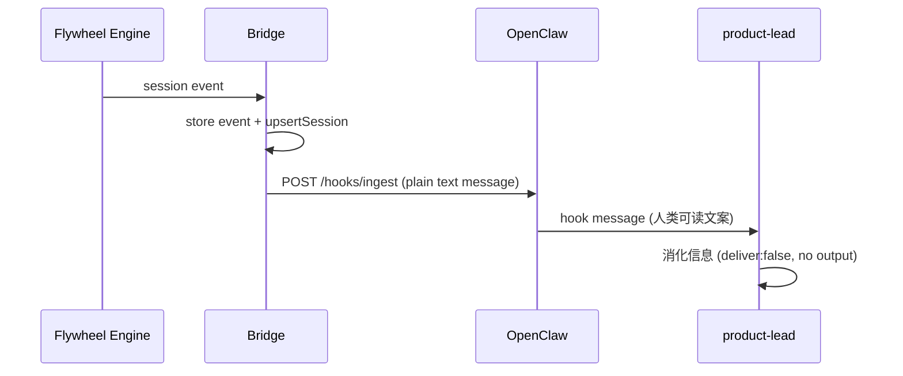
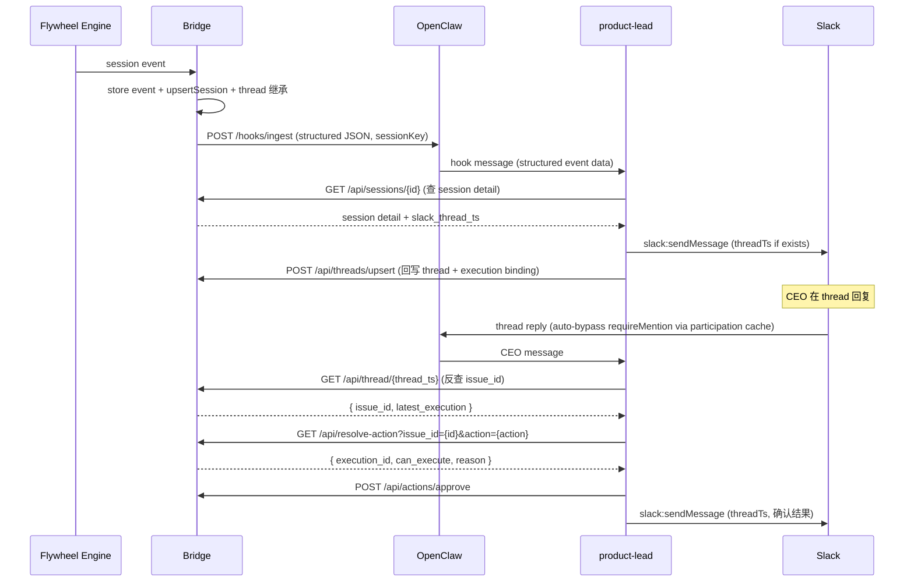

# v1.0 Phase 1 — Single Lead MVP 实现计划

**来源**：`doc/engineer/exploration/new/v1.0-lead-experience.md`（Codex approved, Round 3）
**Phase 0 Spike 结果**：全部可行（详见下方）

## Spike 结论

| 问题 | 结果 | 证据 |
|------|------|------|
| Agent 能否发 threaded Slack？ | ✅ 内置 `slack:sendMessage` 支持 `threadTs` | OpenClaw source `reply-XaR8IPbY.js:14057-14120` |
| Thread 内无 @mention 能否路由？ | ✅ Thread participation cache 绕过 `requireMention` | OpenClaw source `reply-XaR8IPbY.js:14300-14340, 46952` |
| Bot identity 统一？ | ✅ Bridge 和 OpenClaw 用同一个 bot token | `teamlead/.env` 和 `openclaw.json` token 相同 |

**待验证假设**：Thread participation cache 的 TTL 需要手动验证实际时长（代码中有 24h 和 5min 两个不同值），不能作为已知事实。Phase 1 手动验证中必须包含"超过预期 TTL 后 thread reply 是否仍可路由"的测试。

## 目标

Product Lead 成为 #general channel（`CD5QZVAP6`）里**唯一的对话对象**。CEO 在 Slack 里只看到一个 bot，能完成完整的 issue 生命周期。

**Phase 1 Committed Capabilities**：
1. Threaded status notifications — session_started/completed/failed → issue thread 内通知
2. Thread 内追问答复 — CEO 在 thread 里问问题，Lead 有上下文回答
3. 现有 Bridge actions 的 NL 封装 — CEO 说"approve"→ Lead 解析 → 调 Bridge API

**Phase 1 暂不暴露的 action**：`retry` 当前仅修改状态为 `running`，不会真正重新调度执行。在 Flywheel 实现真正的 requeue 机制之前，不在 SOUL.md 中暴露给 CEO，避免"说已重试但实际没跑"的假象。

## 当前代码基线

**重要**：以下是当前代码的真实状态，本计划所有改动均基于此基线。

- `event-route.ts`：Bridge 当前**不直发 Slack**。通知路径只有 `notifyAgent()` → OpenClaw `/hooks/ingest`，发送 `formatNotification()` 生成的纯字符串。没有 `postToSlack()`、`slackBotToken`、`slackChannel` 等 Slack 直发能力。
- `StateStore.ts`：`sessions` 表**没有 `slack_thread_ts` 字段**。`Session`/`SessionUpsert` interface 也没有。`conversation_threads` 表已存在（有 `thread_ts`、`channel`、`issue_id`）。
- `StuckWatcher.ts`：使用 `/hooks/agent`（需迁移到 `/hooks/ingest`），发送纯文本消息，没有 `sessionKey`。
- `BridgeConfig`：没有 Slack 相关配置（无 `slackBotToken`、`slackChannel`）。只有 `gatewayUrl`、`hooksToken`。
- `notifyAgent()`：只接收 `(gatewayUrl, hooksToken, message: string)`，不支持 `sessionKey`。

## 架构变化

### Before (v0.5 — hook-only notification)



### After (v1.0 Phase 1)



## 实现步骤

### Step 1: StateStore schema 扩展 + 新方法

在 `packages/teamlead/src/StateStore.ts` 变更：

#### 1a. Schema migration — 新增 `slack_thread_ts` 字段 + `conversation_threads` 唯一约束

`sessions` 表当前没有 `slack_thread_ts` 列。需要：

1. 在 `migrate()` 方法中，`CREATE TABLE sessions` 后新增 `ALTER TABLE` migration：
   ```typescript
   // Idempotent migration — add slack_thread_ts if not present
   try {
       this.db.run("ALTER TABLE sessions ADD COLUMN slack_thread_ts TEXT");
   } catch {
       // Column already exists — ignore
   }
   ```
2. 更新 `SessionUpsert` interface 新增 `slack_thread_ts?: string`
3. 更新 `Session` interface 新增 `slack_thread_ts?: string`
4. 更新 `upsertSession()` SQL — INSERT 和 ON CONFLICT UPDATE 都包含 `slack_thread_ts`
5. 更新 `rowToSession()`（或等效的行映射逻辑）包含 `slack_thread_ts`

同时，**`conversation_threads` 表需要保证一个 issue 只有一个 canonical thread**：

6. 在 `migrate()` 中新增唯一索引（**含历史重复数据修复**）：
   ```typescript
   // 先清理历史重复记录：每个 issue_id 只保留 last_updated 最新的一条
   this.db.run(`
       DELETE FROM conversation_threads
       WHERE rowid NOT IN (
           SELECT MAX(rowid) FROM conversation_threads
           WHERE issue_id IS NOT NULL
           GROUP BY issue_id
       ) AND issue_id IS NOT NULL
   `);
   // 然后创建唯一索引
   this.db.run("CREATE UNIQUE INDEX IF NOT EXISTS idx_threads_issue ON conversation_threads(issue_id)");
   ```
   **测试**：补一条"旧库里存在同 issue 多 thread 记录时，migrate 后仅保留最新记录且索引创建成功"。
7. 更新 `upsertThread()` 实现，改为按 `issue_id` 做 upsert（而非当前的按 `thread_ts`）：
   ```typescript
   // 当前：INSERT ... ON CONFLICT(thread_ts) DO UPDATE
   // 改为：INSERT ... ON CONFLICT(issue_id) DO UPDATE SET thread_ts = ?, channel = ?, last_updated = ?
   ```
   这样同一 issue 的 thread 映射始终只有一条记录，旧 thread_ts 会被新的覆盖。

#### 1b. `getThreadByIssue(issueId: string): { thread_ts: string, channel: string } | undefined`

Issue → thread 正向查询（`conversation_threads` 表）。有了 `issue_id` 唯一约束后，查询结果是确定性的。

#### 1c. `setSessionThreadTs(executionId: string, threadTs: string): void`

专用 helper，只更新 session 的 `slack_thread_ts` 字段：
```typescript
this.db.run("UPDATE sessions SET slack_thread_ts = ? WHERE execution_id = ?", [threadTs, executionId]);
```
注意：调用方必须确保 session 行已存在（先 `upsertSession()`，再 `setSessionThreadTs()`）。

#### 1d. `getLatestSessionByIssueAndStatuses(issueId: string, statuses: string[]): Session | undefined`

Action-aware execution 查询。替代当前 `getLatestActionableSession()` 硬编码的 `awaiting_review|blocked`。

**测试**：schema migration 测试 + 每个新方法至少 3 个测试。

### Step 2: Bridge API 扩展（3 个新 endpoint）

在 `packages/teamlead/src/bridge/tools.ts` 新增。所有 `/api/*` 路径已有 token auth（`plugin.ts:52`）。

#### 2a. `POST /api/threads/upsert`

Agent 回写 thread state 到 Bridge。`execution_id` **必填**，确保当前 execution 的 `slack_thread_ts` 一定被绑定。

```typescript
// Request
{ thread_ts: string, channel: string, issue_id: string, execution_id: string }
// Response
{ ok: true }
// Error responses
// 404: execution_id 不存在
// 400: execution 的 issue_id 与请求体的 issue_id 不匹配
// 409: thread_ts 已绑定到不同 issue（防止 thread 被误绑）
```

实现（含边界校验）：
1. 校验 `execution_id` 对应的 session 必须存在（`store.getSession(execution_id)`），否则 404
2. 校验该 session 的 `issue_id` 必须等于请求体的 `issue_id`，否则 400（防止 agent 因 stale context 误绑）
3. 校验 `thread_ts` 如果已存在于 `conversation_threads` 且绑定到不同 `issue_id`，返回 409（防止 thread 映射被覆盖到错误 issue）
4. 调 `store.upsertThread(thread_ts, channel, issue_id)`
5. 调 `store.setSessionThreadTs(execution_id, thread_ts)`

**测试**：除 happy path 外，需覆盖 "unknown execution"、"mismatched issue_id"、"existing thread conflict" 三个错误场景。

#### 2a-extra. 增强 `GET /api/sessions/:id` 响应

当前 `GET /api/sessions/:id` 返回 session detail。增强：如果 session 的 `slack_thread_ts` 为空，**回退查询 `conversation_threads`**（用 session 的 `issue_id` 调 `store.getThreadByIssue()`），将结果作为 `slack_thread_ts` 返回。这确保 agent 用 `execution_id` 查 session 时，总能拿到最新的 canonical thread mapping。

#### 2b. `GET /api/thread/:thread_ts`

Thread 反查。Agent 在收到 CEO thread reply 时用此 endpoint 获取 `issue_id`。

```typescript
// Response
{ issue_id: string, issue_identifier?: string, latest_execution?: Session, found: boolean }
```

实现：
- `store.getThreadIssue(thread_ts)` → `issue_id`
- `store.getSessionByIssue(issue_id)` → latest session（含 `issue_identifier`、`slack_thread_ts` 等）

#### 2c. `GET /api/resolve-action`

Action-aware execution 解析。

```typescript
// Request query params
?issue_id=xxx&action=approve
// Response
{ execution_id: string, status: string, can_execute: boolean, reason?: string }
```

实现：
- 从 `ACTION_SOURCE_STATUS[action]` 获取合法源状态列表
- 调 `store.getLatestSessionByIssueAndStatuses(issue_id, statuses)`
- 返回是否可执行 + 原因

注意：`ACTION_SOURCE_STATUS` 需要从 `actions.ts` 导出供 `tools.ts` 使用。

**测试**：每个 endpoint 至少 3 个测试（happy path、not found、edge case）。

### Step 3: 统一 hook payload builder

当前 `event-route.ts` 的 `notifyAgent()` 和 `StuckWatcher` 的 `onSessionStuck()` 各自构建 hook payload，格式不一致。抽取共享 builder，确保所有 hook 消息使用同一个结构化 envelope。

新建 `packages/teamlead/src/bridge/hook-payload.ts`：

```typescript
export interface HookPayload {
    event_type: string;
    execution_id: string;
    issue_id: string;
    issue_identifier?: string;
    issue_title?: string;
    project_name?: string;
    status?: string;
    decision_route?: string;
    commit_count?: number;
    lines_added?: number;
    lines_removed?: number;
    summary?: string;
    last_error?: string;
    thread_ts?: string;
    channel?: string;
    // stuck-specific
    minutes_since_activity?: number;
}

export function buildSessionKey(session: { issue_identifier?: string; issue_id: string }): string {
    return `flywheel:${session.issue_identifier ?? session.issue_id}`;
}

export function buildHookBody(
    agentId: string,
    payload: HookPayload,
    sessionKey?: string,
): Record<string, unknown> {
    const body: Record<string, unknown> = {
        agentId,
        message: JSON.stringify(payload),
    };
    if (sessionKey) body.sessionKey = sessionKey;
    return body;
}
```

**测试**：`buildSessionKey` 和 `buildHookBody` 各 2-3 个测试。

### Step 4: Event-route hook payload 升级

更新 `packages/teamlead/src/bridge/event-route.ts`：

#### 4a. 更新 `notifyAgent()` 签名

```typescript
// 当前
async function notifyAgent(gatewayUrl: string, hooksToken: string, message: string): Promise<void>

// 改为
async function notifyAgent(
    gatewayUrl: string,
    hooksToken: string,
    body: Record<string, unknown>,
): Promise<void>
```

`body` 直接传入 `buildHookBody()` 的输出，`JSON.stringify(body)` 作为 fetch body。

#### 4b. 更新通知调用点

```typescript
// 当前 (event-route.ts:220-224)
const session = store.getSession(event.execution_id);
if (session && config.gatewayUrl && config.hooksToken) {
    const message = formatNotification(session, event.event_type);
    notifyAgent(config.gatewayUrl, config.hooksToken, message).catch(() => {});
}

// 改为
const session = store.getSession(event.execution_id);
if (session && config.gatewayUrl && config.hooksToken) {
    const sessionKey = buildSessionKey(session);
    const payload: HookPayload = {
        event_type: event.event_type,
        execution_id: event.execution_id,
        issue_id: event.issue_id,
        issue_identifier: session.issue_identifier,
        issue_title: session.issue_title,
        project_name: event.project_name,
        status: session.status,
        decision_route: session.decision_route,
        commit_count: session.commit_count,
        lines_added: session.lines_added,
        lines_removed: session.lines_removed,
        summary: session.summary,
        last_error: session.last_error,
        thread_ts: session.slack_thread_ts,
        channel: "CD5QZVAP6",  // #general — hardcoded for Phase 1 (single channel)
    };
    const body = buildHookBody("product-lead", payload, sessionKey);
    notifyAgent(config.gatewayUrl, config.hooksToken, body).catch(() => {});
}
```

保留 `formatNotification()` 供参考和日志（不删除）。

### Step 5: Event-route thread 继承

在 `session_started` 处理中（`event-route.ts:124-134`），新 execution 应继承同一 issue 的已有 thread。

注意操作顺序：**先 `upsertSession()` 创建 session 行，再 `setSessionThreadTs()` 回写 thread**。

```typescript
if (event.event_type === "session_started") {
    store.upsertSession({
        execution_id: event.execution_id,
        issue_id: event.issue_id,
        project_name: event.project_name,
        status: "running",
        started_at: now,
        last_activity_at: now,
        issue_identifier: asString(payload.issueIdentifier),
        issue_title: asString(payload.issueTitle),
    });

    // 继承同一 issue 的已有 thread
    const existingThread = store.getThreadByIssue(event.issue_id);
    if (existingThread) {
        store.setSessionThreadTs(event.execution_id, existingThread.thread_ts);
    }
}
```

### Step 6: StuckWatcher 统一

更新 `packages/teamlead/src/StuckWatcher.ts` 的 `WebhookStuckNotifier`：

1. `/hooks/agent` → `/hooks/ingest`
2. 使用 `buildHookBody()` + `buildSessionKey()` 构建 structured payload
3. 新增 `event_type: "session_stuck"` + `minutes_since_activity` 字段

```typescript
async onSessionStuck(session: Session, minutes: number): Promise<void> {
    const sessionKey = buildSessionKey(session);
    const payload: HookPayload = {
        event_type: "session_stuck",
        execution_id: session.execution_id,
        issue_id: session.issue_id,
        issue_identifier: session.issue_identifier,
        issue_title: session.issue_title,
        project_name: session.project_name,
        status: session.status,
        thread_ts: session.slack_thread_ts,
        channel: "CD5QZVAP6",
        minutes_since_activity: minutes,
    };
    const body = buildHookBody("product-lead", payload, sessionKey);
    // ... fetch to /hooks/ingest with JSON.stringify(body)
}
```

### Step 7: Product-lead SOUL.md 更新

更新 `~/clawdbot-workspaces/product-lead/SOUL.md`，核心变更：

#### 7a. Hook Messages — 结构化事件处理

替换 Hook Messages 规则为：

```markdown
## Hook Messages (Flywheel Events)

当你收到来自 Flywheel Bridge 的 hook 消息时，消息是 JSON 格式的结构化事件数据。

**重要原则**：Bridge 是 thread state 的 source of truth。不要仅凭 hook payload 中的 `thread_ts` 决定是否新建 parent message。

1. **解析事件**：从 JSON 中提取 `event_type`、`execution_id`、`issue_id`、`issue_identifier` 等字段
2. **查询 Bridge 获取最新状态**：用 `execution_id` 查 Bridge API 获取 session detail（含最新 `slack_thread_ts`）：
   `curl -s -H 'Authorization: Bearer $TEAMLEAD_API_TOKEN' localhost:9876/api/sessions/{execution_id}`
3. **判断 thread**（以 Bridge 返回的 `slack_thread_ts` 为准，不以 hook payload 为准）：
   - 如果 session 已有 `slack_thread_ts`：在该 thread 内回复（用 slack:sendMessage 带 threadTs）
   - 如果 `slack_thread_ts` 为空（新 issue 首次执行）：
     a. 创建 parent message（slack:sendMessage，不带 threadTs）
     b. **必须回写** thread state（注意 `execution_id` 是必填项）：
        `curl -s -X POST -H 'Content-Type: application/json' -H 'Authorization: Bearer $TEAMLEAD_API_TOKEN' localhost:9876/api/threads/upsert -d '{"thread_ts":"收到的消息ts","channel":"CD5QZVAP6","issue_id":"从事件JSON取","execution_id":"从事件JSON取"}'`
4. **消化信息**：用自己的话（中文）总结事件，不要原样转发 JSON
5. **不要用 send 工具**，用 slack:sendMessage
6. **stuck 事件**（`event_type: "session_stuck"`）：在 issue thread 内提醒 CEO 注意，告知已无活动多长时间
```

#### 7b. Thread 内对话 — 确定性链路

```markdown
## Thread Conversations

CEO 在 issue thread 内回复时，你会自动收到消息。

1. **反查上下文**：用 thread_ts 调 Bridge API 获取 issue 信息
   `curl -s -H 'Authorization: Bearer $TEAMLEAD_API_TOKEN' 'localhost:9876/api/thread/{当前thread的ts}'`
   这会返回 `issue_id`、`issue_identifier`、`latest_execution` 等信息
2. **回答问题**：基于返回的 session 数据回答 CEO 的问题
3. **执行 action**：如果 CEO 的意图是 approve/reject/defer/shelve：
   - 用上一步返回的 `issue_id` 确认可执行：
     `curl -s -H 'Authorization: Bearer $TEAMLEAD_API_TOKEN' 'localhost:9876/api/resolve-action?issue_id={id}&action={action}'`
   - 如果 `can_execute: true`：执行 action（`POST /api/actions/{action}`，body 用 resolve-action 返回的 `execution_id`）
   - 否则：告诉 CEO 为什么不能执行（用 resolve-action 返回的 `reason`）
4. **模糊意图**：如果不确定 CEO 想做什么，追问

注意：`retry` 目前仅修改状态，不会真正重新执行。如果 CEO 要求 retry，告知当前 retry 只能标记状态，实际重跑需要手动触发。
```

#### 7c. 更新报告风格为中文

所有通知和报告默认中文。

### Step 8: Product-lead TOOLS.md 更新

更新 `~/clawdbot-workspaces/product-lead/TOOLS.md`：

```markdown
# Tools

## Flywheel Bridge API

- Base URL: http://localhost:9876
- **Auth**: 所有 `/api/*` 请求需要 header: `-H 'Authorization: Bearer $TEAMLEAD_API_TOKEN'`

### Queries
- `GET /api/sessions` — active sessions
- `GET /api/sessions?mode=recent&limit=10` — recent sessions
- `GET /api/sessions?mode=stuck` — stuck sessions
- `GET /api/sessions/{identifier}` — session detail (by identifier or execution_id)
- `GET /api/sessions/{identifier}/history` — execution history

### Thread Management
- `POST /api/threads/upsert` — 回写 thread state（execution_id 必填）: `{"thread_ts":"...","channel":"CD5QZVAP6","issue_id":"...","execution_id":"..."}`
- `GET /api/thread/{thread_ts}` — 反查 thread → issue + execution
- `GET /api/resolve-action?issue_id={id}&action={action}` — 确认 action 是否可执行

### Actions
- `POST /api/actions/approve` — `{"execution_id":"..."}`
- `POST /api/actions/reject` — `{"execution_id":"...","reason":"..."}`
- `POST /api/actions/defer` — `{"execution_id":"...","reason":"..."}`
- `POST /api/actions/shelve` — `{"execution_id":"...","reason":"..."}`

### Slack Actions
- `slack:sendMessage` — 发送 Slack 消息（支持 threadTs 参数实现 threading）
```

### Step 9: 手动验证

当前代码基线已经没有 Bridge 直发 Slack 的路径（v0.5 中 Bridge 只做 hook push），所以**不需要 canary toggle 或 cutover**。Agent 直接是唯一的 Slack 发送方。

验证方式：用测试 event 触发全链路。

**验证前提**：
- Bridge 运行在 localhost:9876
- OpenClaw gateway 运行在 localhost:18789
- product-lead agent 已加载更新后的 SOUL.md / TOOLS.md

## 验证矩阵

| 场景 | 验证方式 | Pass 标准 |
|------|----------|-----------|
| session_started → parent message | 发测试 event | Agent 在 #general 创建 parent message，`execution_id` + `thread_ts` 回写到 Bridge |
| session_completed → thread reply | 发测试 event | Agent 在同一 thread 回复（structured payload 含 `thread_ts`） |
| session_failed → thread reply | 发测试 event | Agent 在同一 thread 回复 |
| CEO thread reply → Lead 回复 | 在 thread 写消息 | Lead 用 `/api/thread/{ts}` 反查 issue，回复有上下文 |
| CEO "approve" → action 执行 | 在 thread 写 "approve" | Lead 用 `/api/thread/{ts}` → `/api/resolve-action` → `/api/actions/approve` 全链路 |
| 进程重启后 thread 恢复 | 重启 OpenClaw → 发 event | Agent 复用 thread（从 structured payload 的 `thread_ts` 获取） |
| retry/reopen → 复用 thread | 同一 issue 新 execution | 新 execution 通过 `getThreadByIssue()` 继承旧 thread |
| stuck notification → thread reply | 等 stuck 阈值 | Agent 收到 structured `session_stuck` event，在 issue thread 内通知 |
| Thread participation TTL | 等待超过预期 TTL → thread reply | 验证 reply 仍路由到 agent（或需要 @mention fallback） |

## 任务分解

| # | 任务 | 类型 | 依赖 | 大小 |
|---|------|------|------|------|
| 1 | StateStore: schema migration + `getThreadByIssue` + `setSessionThreadTs` + `getLatestSessionByIssueAndStatuses` | code + test | — | 中 |
| 2 | Hook payload builder: `hook-payload.ts` + `buildSessionKey` + `buildHookBody` | code + test | — | 小 |
| 3 | Bridge API: `POST /api/threads/upsert`（execution_id 必填） | code + test | 1 | 小 |
| 4 | Bridge API: `GET /api/thread/:thread_ts` | code + test | 1 | 小 |
| 5 | Bridge API: `GET /api/resolve-action` | code + test | 1 | 中 |
| 6 | Event-route: structured hook payload + sessionKey | code + test | 1, 2 | 小 |
| 7 | Event-route: thread 继承（session_started 时从 conversation_threads 回填） | code + test | 1 | 小 |
| 8 | StuckWatcher: `/hooks/ingest` + structured payload + sessionKey | code + test | 2 | 小 |
| 9 | Product-lead SOUL.md 更新 | config | 3-5, 6 | 小 |
| 10 | Product-lead TOOLS.md 更新 | config | 3-5 | 小 |
| 11 | 手动验证（全链路） | test | 9-10 | 中 |

并行组：
- 任务 1-2 可并行（StateStore + hook payload builder）
- 任务 3-5 可并行（3 个 API endpoint，都依赖 1）
- 任务 6-8 可并行（event-route + StuckWatcher，都依赖 1+2）
- 任务 9-10 需要 API 完成后

## 风险与缓解

| 风险 | 概率 | 影响 | 缓解 |
|------|------|------|------|
| Agent 在 hook session 无法用 `slack:sendMessage` | 低（spike 确认可用） | 高 | 手动测试验证；如不可用需改架构 |
| Thread participation cache TTL 不够长 | 中（待验证） | 中 | Fallback：CEO 在 thread 内仍需 @mention（体验略差但可接受） |
| Agent 误解 CEO 意图 | 中 | 中 | Bridge `resolve-action` 状态机保证非法操作不会执行 |
| Bridge API 不可达 | 低 | 高 | Agent 回复"系统暂时不可用"，不执行 action |
| `retry` 不真正 requeue | 已知 | 低 | Phase 1 不暴露 retry，SOUL.md 说明限制 |
| Agent 忘记回写 thread state | 中 | 高 | SOUL.md 明确标注"必须回写"；`execution_id` 必填减少遗漏 |
| Agent 传错 issue_id/execution_id | 低 | 高 | `/api/threads/upsert` 做 execution→issue 一致性校验 + thread conflict 检测 |
| 同一 issue 多条 thread 记录 | 低 | 高 | `conversation_threads.issue_id` 唯一约束 + `upsertThread()` 按 issue_id 维护 |

## 不在 Phase 1 范围

- 早报 / 日报（Phase 2）
- Create Linear issue（Phase 2）
- 截图辅助决策（Phase 2）
- Lead 主动建议（Phase 2）
- `retry` 真正 requeue 执行（需要 Orchestrator 改动）
- Multi-Lead / standup channel（Phase 3）
- CIPHER 自主权学习（Phase 4）
