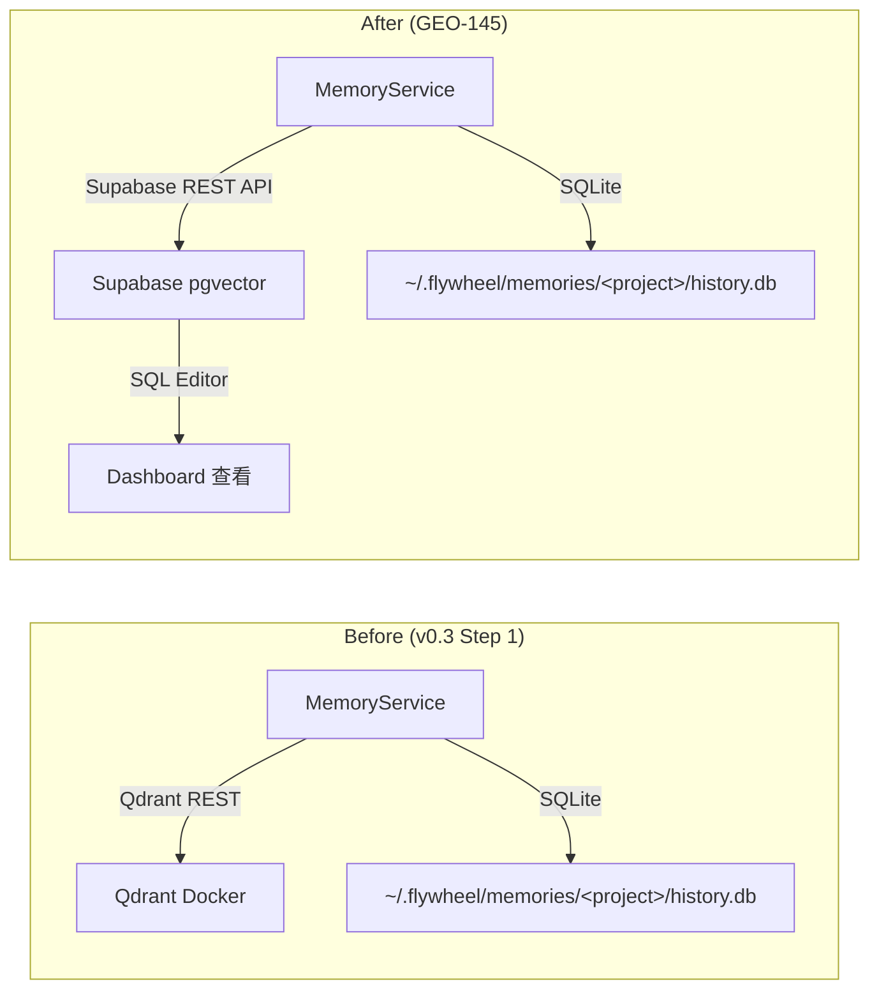

# Plan: Memory Production Setup — Supabase pgvector

**Version**: v1.1.0
**Issue**: GEO-145
**Date**: 2026-03-10
**Source**: `doc/engineer/exploration/new/v0.3-memory-system.md`, `doc/engineer/research/new/GEO-145-supabase-pgvector-migration.md`
**Status**: codex-approved

---

## Goal

将 Flywheel Memory System 的 vector store 从 Qdrant（本地 Docker）切换到 Supabase pgvector，让记忆系统在生产环境生效。

**Scope**: 只迁移 vector store。History store 保留本地 SQLite（`~/.flywheel/memories/<projectName>/history.db`），如果后续需要 Dashboard 查看审计日志再单独迁移。

**Annie 核心诉求**：在 Supabase Dashboard SQL Editor 直接查看记忆内容。

---

## Architecture



**Key change**: `provider: 'qdrant'` → `provider: 'supabase'`，通过 `@supabase/supabase-js` REST API。History store 不变。

---

## Dimension Decision

mem0 `SupabaseDB.initialize()` 中硬编码了 `Array(1536).fill(0)` 作为测试向量。如果表定义为 `vector(768)`，初始化会因维度不匹配而失败。

**决定：标准化为 1536 维。**

- `gemini-embedding-001` 支持通过 `outputDimensionality` 参数配置输出维度，1536 在其支持范围内
- SQL migration 使用 `vector(1536)`
- Embedder config 改为 `embeddingDims: 1536`（或移除覆盖，1536 是 GoogleEmbedder 默认值）
- In-memory test store 也改为 `dimension: 1536`
- 存储成本：~6KB/条 → free tier 500MB ≈ ~80K 条记忆，仍然充足

**上游版本约束 (mem0 2.3.0)**:
- 当前实现依赖 mem0 2.3.0 的 `Memory.add()` / `Memory.search()` 路径使用 `embed()`（单条），该方法正确使用配置的 `embeddingDims: 1536`
- mem0 的 `GoogleEmbedder.embedBatch()` 仍硬编码 `outputDimensionality: 768`（见 `dist/oss/index.js:2222-2227`），但当前 Flywheel 路径不走 `embedBatch()`，所以不构成阻塞
- **后续升级 mem0 时必须重新验证维度假设**，尤其是 Google embedder 的 batch 行为是否变更。如果 mem0 未来版本的 `add()`/`search()` 改用 `embedBatch()`，1536 维向量将与 768 维冲突

---

## Auth Model

**决定：使用 `SUPABASE_SERVICE_ROLE_KEY`（不是 anon key）。**

- Flywheel 是服务端 daemon，不是客户端应用
- Service role key 绕过 RLS，无需配置 row-level policies
- Key 只存在于 shell env（`~/.zshrc`），不进入 git
- 环境变量命名：`SUPABASE_KEY`（通用名，注释说明应使用 service role key）

---

## Prerequisites (Manual, Before Implementation)

1. **Create Supabase project** — https://supabase.com (free tier)
2. **Enable pgvector** + **Run SQL migration** — in Supabase SQL Editor:

```sql
-- 1. Enable pgvector extension
CREATE EXTENSION IF NOT EXISTS vector;

-- 2. Memories table (vectors + metadata)
-- Dimension 1536: matches mem0 SupabaseDB.initialize() hardcoded test vector
CREATE TABLE IF NOT EXISTS memories (
  id TEXT PRIMARY KEY,
  embedding vector(1536),
  metadata JSONB,
  created_at TIMESTAMPTZ DEFAULT timezone('utc', now()),
  updated_at TIMESTAMPTZ DEFAULT timezone('utc', now())
);

-- 3. Memory migrations table (mem0 internal tracking)
CREATE TABLE IF NOT EXISTS memory_migrations (
  user_id TEXT PRIMARY KEY,
  created_at TIMESTAMPTZ DEFAULT timezone('utc', now())
);

-- 4. Similarity search RPC function
CREATE OR REPLACE FUNCTION match_vectors(
  query_embedding vector(1536),
  match_count INT,
  filter JSONB DEFAULT '{}'::JSONB
)
RETURNS TABLE (id TEXT, similarity FLOAT, metadata JSONB)
LANGUAGE plpgsql AS $$
BEGIN
  RETURN QUERY
  SELECT t.id::TEXT, 1 - (t.embedding <=> query_embedding) AS similarity, t.metadata
  FROM memories t
  WHERE CASE WHEN filter::TEXT = '{}'::TEXT THEN TRUE ELSE t.metadata @> filter END
  ORDER BY t.embedding <=> query_embedding
  LIMIT match_count;
END;
$$;

-- 5. HNSW index for fast cosine similarity search
CREATE INDEX IF NOT EXISTS memories_embedding_idx
ON memories USING hnsw (embedding vector_cosine_ops) WITH (m = 16, ef_construction = 64);

-- 6. Metadata GIN index for JSONB filter queries
CREATE INDEX IF NOT EXISTS memories_metadata_idx ON memories USING gin (metadata);
```

3. **Get credentials** — from Supabase Settings → API:
   - `SUPABASE_URL` (e.g. `https://xxx.supabase.co`)
   - `SUPABASE_KEY` — use the **service_role** key (not anon key)

---

## Tasks

### Task 1: Add `@supabase/supabase-js` dependency

**Files**: `packages/edge-worker/package.json`

```bash
pnpm add -F edge-worker @supabase/supabase-js
```

**Commit**: `chore: add @supabase/supabase-js dependency for memory production`

---

### Task 2: Update type interfaces

**Files**: `packages/edge-worker/src/memory/types.ts`

Replace `MemoryServiceConfig` to use Supabase credentials instead of Qdrant:

```typescript
export interface MemoryServiceConfig {
  /** Google AI API key for Gemini LLM + embedding */
  googleApiKey: string;
  /** Supabase project URL (e.g. https://xxx.supabase.co) */
  supabaseUrl: string;
  /** Supabase service role key (bypasses RLS) */
  supabaseKey: string;
  /** mem0 history DB path — MUST be outside repo to avoid git dirty tree
   *  default: ~/.flywheel/memories/<projectName>/history.db */
  historyDbPath: string;
  /** Gemini model for fact extraction (default: gemini-2.0-flash) */
  llmModel?: string;
  /** Max memories to return on search (default: 10) */
  searchLimit?: number;
}
```

Changes from current:
- Remove: `qdrantUrl`, `collectionName`
- Add: `supabaseUrl`, `supabaseKey`
- Keep: `historyDbPath` (history stays local SQLite)

`MemoryServiceTestConfig` stays unchanged.

**Commit**: `refactor: update MemoryServiceConfig for Supabase (remove Qdrant)`

---

### Task 3: Rewrite MemoryService constructor

**Files**: `packages/edge-worker/src/memory/MemoryService.ts`

Change the production branch from Qdrant to Supabase. Standardize embedding dimension to 1536.

```typescript
constructor(config: MemoryServiceConfig | MemoryServiceTestConfig) {
  this.searchLimit = config.searchLimit ?? 10;
  const isTestConfig = !("supabaseUrl" in config);

  this.memory = new Memory({
    version: "v1.1",
    llm: {
      provider: "google",
      config: {
        apiKey: config.googleApiKey,
        model: config.llmModel ?? "gemini-2.5-flash",
      },
    },
    embedder: {
      provider: "google",
      config: {
        apiKey: config.googleApiKey,
        model: "gemini-embedding-001",
        embeddingDims: 1536,
      },
    },
    vectorStore: isTestConfig
      ? {
          provider: "memory",
          config: {
            collectionName: "flywheel-memories",
            dimension: 1536,
          },
        }
      : {
          provider: "supabase",
          config: {
            supabaseUrl: (config as MemoryServiceConfig).supabaseUrl,
            supabaseKey: (config as MemoryServiceConfig).supabaseKey,
            tableName: "memories",
          },
        },
    historyDbPath: isTestConfig
      ? (config.historyDbPath ?? ":memory:")
      : (config as MemoryServiceConfig).historyDbPath,
  });
}
```

Key changes:
- `provider: 'qdrant'` → `provider: 'supabase'`
- `embeddingDims: 768` → `embeddingDims: 1536` (matches mem0 SupabaseDB.initialize() hardcoded test vector)
- In-memory test store also uses `dimension: 1536` for consistency
- `tableName: 'memories'` hardcoded to match `match_vectors` RPC function
- `historyDbPath` preserved for both paths (local SQLite)

**Commit**: `feat: switch MemoryService from Qdrant to Supabase pgvector`

---

### Task 4: Patch mem0 SupabaseDB init + async createMemoryService

**Files**:
- `patches/mem0ai@2.3.0.patch` (new — via `pnpm patch`)
- `packages/edge-worker/src/memory/createMemoryService.ts`

#### 4a. Vendor patch mem0 SupabaseDB

**Critical**: mem0 `SupabaseDB` 构造函数内部执行 `this.initialize().catch((err) => { throw err; })`（见 `node_modules/.pnpm/mem0ai@2.3.0_*/node_modules/mem0ai/dist/oss/index.js:1824-1827`）。catch 中的 rethrow 产生 unhandled rejection，在当前 Node 运行时下会导致进程退出。Blueprint 现有的 per-call non-fatal catch（`Blueprint.ts:223-239`, `541-574`）完全来不及兜底。

**解决方案**: 用 `pnpm patch mem0ai` 修改 SupabaseDB 构造函数，暴露可 await 的 `ready` promise 并移除 detached catch 中的 `throw err`。

```bash
pnpm patch mem0ai@2.3.0
# 编辑 dist/oss/index.js 中 SupabaseDB constructor
pnpm patch-commit <temp-dir>
```

Patch 内容（修改 `dist/oss/index.js` **和** `dist/oss/index.mjs` 中 SupabaseDB 构造函数）:

注意：`mem0ai/oss` 的 `package.json` exports 同时导出 CJS (`dist/oss/index.js`) 和 ESM (`dist/oss/index.mjs`)。Flywheel `edge-worker` 是 `NodeNext` ESM（`packages/edge-worker/tsconfig.json`），实际走的是 `dist/oss/index.mjs`。**两个文件都必须 patch**，否则 ESM 路径仍保留 unhandled rejection。

```diff
# 在 dist/oss/index.js 和 dist/oss/index.mjs 中均做此修改:
-    this.initialize().catch((err) => {
-      console.error("Failed to initialize SupabaseDB:", err);
-      throw err;
-    });
+    this.ready = this.initialize().catch((err) => {
+      console.error("Failed to initialize SupabaseDB:", err);
+      this.initError = err;
+    });
```

效果：
- `this.ready` 是一个可 await 的 promise，resolve 时表示 init 成功
- init 失败时不再 rethrow（不产生 unhandled rejection），而是把错误存在 `this.initError`
- CJS 和 ESM 双产物一致，不论导入方式都安全
- `pnpm patch` 生成的 patch 文件存在 `patches/` 目录，`pnpm install` 时自动应用

**workspace root `package.json` 注册**: `pnpm patch-commit` 会自动在 root `package.json` 添加 `pnpm.patchedDependencies` 条目。确认提交后 root `package.json` 包含：
```json
{
  "pnpm": {
    "patchedDependencies": {
      "mem0ai@2.3.0": "patches/mem0ai@2.3.0.patch"
    }
  }
}
```
这确保干净 `pnpm install` 会稳定重放补丁。

#### 4b. Async createMemoryService with ready await

```typescript
export interface CreateMemoryServiceOpts {
  googleApiKey?: string;
  supabaseUrl?: string;
  supabaseKey?: string;
  projectName: string;
  llmModel?: string;
}

export async function createMemoryService(
  opts: CreateMemoryServiceOpts,
): Promise<MemoryService | undefined> {
  if (!opts.googleApiKey || !opts.supabaseUrl || !opts.supabaseKey) return undefined;
  const safeName = opts.projectName.replace(/[^a-zA-Z0-9_.-]/g, "_");
  const memoryDbDir = join(homedir(), ".flywheel", "memories", safeName);
  try {
    mkdirSync(memoryDbDir, { recursive: true });
  } catch (err) {
    console.warn(
      `[createMemoryService] Cannot create memory DB dir at ${memoryDbDir}: ${err instanceof Error ? err.message : String(err)}`,
    );
    return undefined;
  }

  try {
    const service = new MemoryService({
      googleApiKey: opts.googleApiKey,
      supabaseUrl: opts.supabaseUrl,
      supabaseKey: opts.supabaseKey,
      historyDbPath: join(memoryDbDir, "history.db"),
      llmModel: opts.llmModel ?? "gemini-2.0-flash",
    });

    // Await patched SupabaseDB.ready promise (Task 4a patch)
    // mem0 Memory 内部: this.vectorStore = VectorStoreFactory.create(...)
    // 访问路径: service.memory.vectorStore.ready
    const vectorStore = (service as any).memory?.vectorStore;

    // Fail-closed: 如果 ready property 不存在，说明 patch 未生效，
    // 不能安全启用 memory（unpatched SupabaseDB 会产生 unhandled rejection）
    if (!vectorStore?.ready) {
      console.warn(
        "[createMemoryService] mem0 SupabaseDB patch not applied — " +
        "vectorStore.ready missing. Memory disabled to prevent unhandled rejection. " +
        "Run: pnpm install (patch should be in pnpm.patchedDependencies)",
      );
      return undefined;
    }

    await vectorStore.ready;
    if (vectorStore.initError) {
      console.warn(
        `[createMemoryService] Supabase init failed (memory disabled): ${vectorStore.initError.message ?? vectorStore.initError}`,
      );
      return undefined;
    }

    return service;
  } catch (err) {
    console.warn(
      `[createMemoryService] Failed to initialize MemoryService: ${err instanceof Error ? err.message : String(err)}`,
    );
    return undefined;
  }
}
```

Changes from current:
- **Async**: `createMemoryService` 返回 `Promise<MemoryService | undefined>`
- **Deterministic readiness**: await patched `SupabaseDB.ready` promise，不依赖时间窗口或进程级 listener
- **Graceful degradation**: init 失败 → log warning → 返回 undefined → memory 系统禁用
- Remove `qdrantUrl` → add `supabaseUrl` + `supabaseKey`
- Keep local directory creation for history DB (SQLite stays local)
- Guard: need all 3 env vars to enable

**Note on `(service as any)` 访问**: mem0 `Memory` 不暴露 `vectorStoreDb` 的公共访问器，所以需要通过 `any` 访问。这是 vendor patch 的常见模式——patch 和访问代码绑定在同一版本约束下（mem0 2.3.0）。升级 mem0 时需要重新验证内部属性名。

**Commit**: `fix: patch mem0 SupabaseDB init + async createMemoryService`

---

### Task 5: Update setup.ts caller (await async factory)

**Files**: `scripts/lib/setup.ts`

`createMemoryService` 现在是 async（Task 4 改动），caller 必须 await。

```typescript
const memoryService = await createMemoryService({
  googleApiKey: process.env.GOOGLE_API_KEY,
  supabaseUrl: process.env.SUPABASE_URL,
  supabaseKey: process.env.SUPABASE_KEY,
  projectName,
  llmModel: process.env.FLYWHEEL_MEMORY_MODEL,
});
if (memoryService) {
  log("Memory system enabled (Supabase pgvector — init verified)");
} else {
  log("Memory system disabled — requires GOOGLE_API_KEY + SUPABASE_URL + SUPABASE_KEY");
}
```

注意：`setup.ts` 中的调用点已经在 async 函数内（`createEdgeWorkerConfig` 是 async），所以 `await` 不需要额外改造。日志措辞为 "enabled (init verified)"，因为 Task 4 的 `createMemoryService` 会 await patched `SupabaseDB.ready` promise，在返回前确认 Supabase 连接成功。

**Commit**: `refactor: setup.ts awaits async createMemoryService`

---

### Task 6: Update unit tests

**Files**: `packages/edge-worker/src/__tests__/MemoryService.test.ts`

Update all test cases:
- Replace `qdrantUrl` references with `supabaseUrl` + `supabaseKey`
- Verify `constructorCall.vectorStore.provider` is `"supabase"` for production config
- Verify `constructorCall.vectorStore.config.tableName` is `"memories"`
- Verify `constructorCall.vectorStore.config.supabaseUrl` and `supabaseKey` are passed through
- Verify `embeddingDims` is `1536` (not 768)
- Keep `historyDbPath` assertions (history still local)
- Update `createMemoryService` tests:
  - `returns undefined without supabaseUrl`
  - `returns undefined without supabaseKey`
  - Keep `historyDbPath` check (still under `~/.flywheel/memories/<project>/`)
- Run `pnpm -F edge-worker typecheck` to verify interface changes compile

**Commit**: `test: update MemoryService tests for Supabase provider`

---

### Task 7: Add opt-in live Supabase smoke test (replaces memory-live.test.ts)

**Files**:
- `packages/edge-worker/src/__tests__/memory-supabase-live.test.ts` (new)
- `packages/edge-worker/src/__tests__/memory-live.test.ts` (delete)

**处理现有 `memory-live.test.ts`**: 当前文件使用 in-memory vector store 测试 mem0，和 Supabase 生产路径无关。删除它，用新的 `memory-supabase-live.test.ts` 完全替代。这避免了两套 live test 长期并存、意图混乱的问题。仓库中只保留一个 live test，它走真正的生产工厂路径。

新测试的关键改进：
1. **走工厂路径** — 使用 `createMemoryService()`（不是直接 `new MemoryService()`），覆盖真实的接线路径
2. **不用固定 sleep** — `createMemoryService` 的 init probe（Task 4）已经做了 readiness 检查，不需要额外等待
3. **验证 init probe** — 如果 `createMemoryService` 返回 `undefined`，测试直接 fail 并说明原因

```typescript
import { describe, it, expect } from "vitest";
import { createMemoryService } from "../memory/createMemoryService.js";

const SUPABASE_URL = process.env.SUPABASE_URL;
const SUPABASE_KEY = process.env.SUPABASE_KEY;
const GOOGLE_API_KEY = process.env.GOOGLE_API_KEY;
const RUN_LIVE = process.env.RUN_MEM0_LIVE_TESTS === "true";

describe.skipIf(!RUN_LIVE || !SUPABASE_URL || !SUPABASE_KEY || !GOOGLE_API_KEY)(
  "MemoryService — Supabase live smoke test",
  () => {
    it("factory creates service and round-trips add + search", async () => {
      // Unique projectName per run to isolate search results from stale data.
      // MemoryService passes projectName as userId to mem0, and adds
      // filters.app_id = "flywheel". Unique userId ensures we only see
      // data from this test run.
      const uniqueProject = `flywheel-smoke-${Date.now()}`;

      // Use the real factory path (same as setup.ts).
      // createMemoryService awaits SupabaseDB.ready (patched in Task 4a),
      // so if it returns non-undefined, init succeeded deterministically.
      const svc = await createMemoryService({
        googleApiKey: GOOGLE_API_KEY!,
        supabaseUrl: SUPABASE_URL!,
        supabaseKey: SUPABASE_KEY!,
        projectName: uniqueProject,
      });

      // Ready contract: createMemoryService returns undefined on init failure
      expect(svc).toBeDefined();
      if (!svc) throw new Error("createMemoryService returned undefined — Supabase init failed");

      const addResult = await svc.addSessionMemory({
        projectName: uniqueProject,
        executionId: `live-test-${Date.now()}`,
        issueId: "TEST-1",
        issueTitle: "Live smoke test",
        sessionResult: "success",
        commitMessages: ["test: verify Supabase integration"],
        diffSummary: "Added Supabase live test",
      });
      expect(addResult.added + addResult.updated).toBeGreaterThan(0);

      const searchResult = await svc.searchAndFormat({
        query: "Supabase integration test",
        projectName: uniqueProject,
      });
      expect(searchResult).not.toBeNull();
      expect(searchResult).toContain("<project_memory>");
    }, 30000);
  },
);
```

**Commit**: `test: replace memory-live with Supabase smoke test using factory path`

---

### Task 8: Update existing E2E test (mock-based)

**Files**: `packages/edge-worker/src/__tests__/memory-e2e.test.ts`

注意：当前 `memory-e2e.test.ts` 是纯 mock E2E 测试（不连接真实后端），不是 live 集成测试。更新它以反映新的 Supabase 接口：
- 更新 config objects 中的字段名：`qdrantUrl` → `supabaseUrl` + `supabaseKey`
- 更新 mock 中 `createMemoryService` 的参数校验（现在是 async）
- 更新 graceful degradation 测试（缺少 `supabaseUrl` 或 `supabaseKey` 时返回 undefined）
- 保留现有 mock 模式，不添加真实 Supabase 连接

**Commit**: `test: update memory E2E tests for Supabase`

---

### Task 9: Build + full test suite

Run build and all tests to verify nothing is broken:

```bash
pnpm -F edge-worker typecheck && pnpm build && pnpm test
```

Fix any compilation errors or test failures.

**Commit**: (if fixes needed) `fix: resolve build errors from Supabase migration`

---

## Files Changed Summary

| File | Change |
|------|--------|
| `patches/mem0ai@2.3.0.patch` | NEW — vendor patch: SupabaseDB init `ready` promise, remove detached rethrow (CJS + ESM) |
| `package.json` (workspace root) | Add `pnpm.patchedDependencies` for mem0ai@2.3.0 |
| `packages/edge-worker/package.json` | Add `@supabase/supabase-js` |
| `packages/edge-worker/src/memory/types.ts` | Replace `qdrantUrl` with `supabaseUrl` + `supabaseKey`, keep `historyDbPath` |
| `packages/edge-worker/src/memory/MemoryService.ts` | Constructor: Qdrant → Supabase provider, dimension 768 → 1536 |
| `packages/edge-worker/src/memory/createMemoryService.ts` | Factory: Supabase credentials, keep local dir for history |
| `scripts/lib/setup.ts` | Env vars: `QDRANT_URL` → `SUPABASE_URL` + `SUPABASE_KEY` |
| `packages/edge-worker/src/__tests__/MemoryService.test.ts` | All tests updated for Supabase |
| `packages/edge-worker/src/__tests__/memory-supabase-live.test.ts` | NEW — opt-in live smoke test (replaces memory-live.test.ts) |
| `packages/edge-worker/src/__tests__/memory-live.test.ts` | DELETE — replaced by memory-supabase-live.test.ts |
| `packages/edge-worker/src/__tests__/memory-e2e.test.ts` | E2E tests updated for Supabase |

---

## Environment Variables

**Remove**:
- `QDRANT_URL`

**Add** (to `~/.zshrc`):
- `SUPABASE_URL=https://xxx.supabase.co`
- `SUPABASE_KEY=eyJ...` (service role key, NOT anon key)

**Keep**:
- `GOOGLE_API_KEY` (unchanged)
- `FLYWHEEL_MEMORY_MODEL` (unchanged, optional)

**Test-only** (for live integration test):
- `RUN_MEM0_LIVE_TESTS=true`

---

## Risks

| Risk | Mitigation |
|------|-----------|
| `match_vectors` hardcodes table `memories` | Use `tableName: 'memories'` — already planned |
| REST API slower than Qdrant direct | Acceptable for non-realtime system |
| Supabase free tier downtime | Graceful degradation preserved |
| mem0 SupabaseDB init unhandled rejection | `pnpm patch` 移除 detached rethrow，暴露 `ready` promise；`createMemoryService` await ready，失败 → 返回 undefined |
| mem0 升级时 patch 失效 | Patch pinned to 2.3.0；升级时 `pnpm install` 会警告 patch 不适用；需手动验证新版 init 行为 |
| Service role key exposure | Only in shell env, not in git; Flywheel is internal tool |

---

## Out of Scope (Future)

- **History store migration** to Supabase — only if Dashboard access to audit log is needed
- **RLS policies** — not needed while using service role key
- **Backfill** of existing local history data — intentional cold start
- **pgvector provider** direct connection — blocked by mem0 issue #3491

---

## Verification (Post-Merge)

1. Set env vars (`SUPABASE_URL`, `SUPABASE_KEY`, `GOOGLE_API_KEY`)
2. Run live integration test: `RUN_MEM0_LIVE_TESTS=true pnpm -F edge-worker test memory-supabase-live`
3. Run a test issue through Flywheel
4. Check Supabase Dashboard: `SELECT * FROM memories;` — should see extracted facts
5. Verify `searchAndFormat()` returns relevant memories for a new issue
