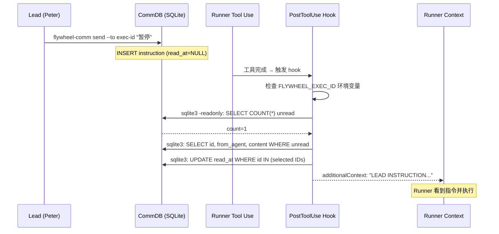

# Plan: Runner Inbox PostToolUse Hook

**Version**: v1.12.0
**Issue**: GEO-266
**Date**: 2026-03-26
**Source**: `doc/engineer/exploration/new/GEO-266-runner-inbox-polling.md`, `doc/engineer/research/new/GEO-266-runner-inbox-hook.md`
**Status**: codex-approved

## Summary

GEO-206 Phase 2 的 Lead → Runner 指令通道（`flywheel-comm send/inbox`）在实际使用中完全失效——Runner 从不主动检查 inbox。根因是 prompt engineering 无法强制 LLM 在连续工具调用中插入自发的 shell 命令。

修复方案：使用 Claude Code 的 **PostToolUse hook** 机制，在每次工具调用后自动检查 CommDB 并将 Lead 指令通过 `additionalContext` 注入到 Runner 的对话上下文中。

**两阶段交付**:
- **Phase 1（本 plan）**: Hook 自动注入 + TmuxAdapter env + Blueprint prompt 更新 + setup skill — 修复 bug
- **Phase 2（follow-up plan）**: 添加 priority 字段（urgent/normal）— 增强功能

## Architecture



## Prerequisites

- macOS with `/usr/bin/sqlite3`（内置）
- `jq` CLI（`brew install jq`，setup skill 会检查）

## Implementation Steps

### Step 0: Smoke Test — Verify additionalContext Delivery

**目标**: 在任何代码修改前，验证 Claude Code 的 `PostToolUse` hook 返回的 `additionalContext` 确实能被 Runner 模型看到。

**步骤**:
1. 创建临时 hook 脚本 `/tmp/flywheel-smoke-test-hook.sh`：
   ```bash
   #!/bin/bash
   echo '{"hookSpecificOutput":{"hookEventName":"PostToolUse","additionalContext":"FLYWHEEL_SMOKE_TEST: If you can see this, acknowledge it by saying SMOKE_TEST_CONFIRMED."}}'
   exit 0
   ```
2. **安全注册**到 `~/.claude/settings.json`（复用 Step 4 的 merge 模式）：
   - 备份 settings.json
   - 用 `jq` 结构化追加临时 hook 到 PostToolUse 数组
   - 验证 JSON 有效后写入
3. 启动一个 scratch Claude Code session（interactive 或 tmux）
4. 执行任意工具调用（如 `ls`）
5. 验证模型输出中包含 `SMOKE_TEST_CONFIRMED` 或类似 acknowledgment
6. **安全清理**：用 `jq` 结构化移除临时 hook，恢复原 PostToolUse 数组

**如果失败**: 停止本 plan，调查 additionalContext 不工作的原因。可能需要切换到 `systemMessage` 或其他注入方式。

### Step 1: TmuxAdapter Environment Variable

**目标**: 注入 `FLYWHEEL_EXEC_ID` 环境变量到 Runner 进程。

**文件**: `packages/claude-runner/src/TmuxAdapter.ts`

在 `FLYWHEEL_COMM_DB` 注入之后（约 line 141）追加：

```typescript
// GEO-266: Inject execution ID for inbox hook
envArgs.push("-e", `FLYWHEEL_EXEC_ID=${ctx.executionId}`);
```

无条件注入——所有模式下 inbox hook 都需要 execution ID。

`ctx.executionId` 在 `AdapterExecutionContext`（`adapter-types.ts:137`）中定义，已在 TmuxAdapter 多处使用。

### Step 2: Hook Script

**目标**: 创建 inbox-check hook 脚本。

**唯一 source of truth**: `scripts/hooks/inbox-check.sh`（Flywheel 仓库内）
**部署位置**: `$HOME/.flywheel/hooks/inbox-check.sh`（由 setup skill **复制** repo 脚本，解析为绝对路径）
**更新流程**: Flywheel 更新后重新运行 `/setup-flywheel-hooks` 覆盖已安装副本

脚本逻辑：
1. 检查 `FLYWHEEL_EXEC_ID` 和 `FLYWHEEL_COMM_DB` 环境变量 — 不存在则 exit 0
2. `sqlite3 -readonly` + `PRAGMA busy_timeout=5000` 查询未读 instruction 数量 — 0 则 exit 0
3. 查询具体 message IDs 和 content：`SELECT id, from_agent, content FROM messages WHERE to_agent=? AND type='instruction' AND read_at IS NULL AND expires_at > datetime('now')`
4. **仅标记已查询到的 IDs 为已读**：`UPDATE messages SET read_at=datetime('now') WHERE id IN ({retrieved_ids})`（避免 race condition 丢失后到的指令）
5. 构建 header: "LEAD INSTRUCTION — Read and act on these instructions"
6. 输出 JSON: `{ hookSpecificOutput: { hookEventName: "PostToolUse", additionalContext: "..." } }`

**关键设计决策**:
- （Codex R1 #2）不使用 blanket `UPDATE ... WHERE read_at IS NULL`，只 mark 已查询的 IDs
- （Codex R2 #2）所有 sqlite3 CLI 调用添加 `PRAGMA busy_timeout=5000`，处理 SQLITE_BUSY 时 exit 0（不输出，下次 tool use 时重试）
- （Codex R2 #1）脚本在 repo 中维护（`scripts/hooks/inbox-check.sh`），setup skill 复制到 `$HOME/.flywheel/hooks/`，不内联生成

**性能**: 非 Runner 会话 <1ms；Runner 无指令 ~5ms；有指令 ~15ms。

**依赖**: sqlite3（macOS 内置）、jq（brew install）。

### Step 3: Blueprint Prompt Update

**目标**: 更新 Runner 的 inbox 指令 prompt。

**文件**: `packages/edge-worker/src/Blueprint.ts` (lines 312-321)

**关键决策（Codex R1 feedback #3）**: 不完全移除手动 inbox 检查指令。改为 hybrid prompt，告知 Runner 指令会自动注入，但保留手动检查作为 fallback（兼容未安装 hook 的环境）。

**替换旧 prompt**:
```
Additionally, your Lead may send you proactive instructions.
Periodically check for instructions with `node ... inbox --exec-id ...`.
Check at task boundaries...
```

**改为**:
```typescript
systemPromptLines.push(
  `Your Lead may send you instructions during your session. ` +
    `If a PostToolUse hook is installed, instructions appear automatically as context after your tool calls. ` +
    `Otherwise, periodically check with \`node ${commCliPath} inbox --exec-id ${executionId}\` at task boundaries. ` +
    `When you receive a Lead instruction, evaluate urgency and act accordingly. ` +
    `Always briefly acknowledge received instructions.`,
);
```

### Step 4: Setup Skill

**目标**: 创建 `/setup-flywheel-hooks` skill 自动安装 hook。

**文件**: `.claude/commands/setup-flywheel-hooks.md`

步骤：
1. 检查 `sqlite3` 可用性 → 应该总是有（macOS 内置）
2. 检查 `jq` 可用性 → 如果没有，`brew install jq`
3. `mkdir -p ~/.flywheel/hooks/`
4. **复制** `scripts/hooks/inbox-check.sh` 到 `$HOME/.flywheel/hooks/inbox-check.sh`（Codex R2 fix: 单一 source of truth，不内联生成）
5. `chmod +x ~/.flywheel/hooks/inbox-check.sh`
6. **备份** `~/.claude/settings.json` 到 `~/.claude/settings.json.bak.$(date +%s)`
7. 读取 `~/.claude/settings.json`
8. **结构化 JSON merge**（Codex R1 feedback #7）：
   - 用 `jq` 解析现有 settings
   - 检查 PostToolUse 中是否已有包含 `inbox-check.sh` 的 hook → 有则跳过
   - 在 PostToolUse 数组末尾追加新条目（保留现有数组顺序）
   - 注册时使用**解析后的绝对路径**（`$HOME/.flywheel/hooks/inbox-check.sh`），不用 `~`（Codex R1 feedback #4）
   ```json
   {
     "matcher": "*",
     "hooks": [{
       "type": "command",
       "command": "/Users/xiaorongli/.flywheel/hooks/inbox-check.sh",
       "timeout": 5
     }]
   }
   ```
9. **验证输出 JSON** 有效后，写回 `~/.claude/settings.json`
10. 验证：`FLYWHEEL_EXEC_ID= ~/.flywheel/hooks/inbox-check.sh; echo $?` → 0

**幂等**: 步骤 8 防止重复添加。
**安全**: 步骤 6 备份，步骤 9 验证后再写入。
**单一 source of truth**: repo 中的 `scripts/hooks/inbox-check.sh` 是唯一模板。Setup skill 复制（不内联生成），更新时重新运行 setup 覆盖。安装后 `$HOME/.flywheel/hooks/inbox-check.sh` 独立运行，不引用 Flywheel 仓库路径。

### Step 5: Unit Tests

#### 5a. TmuxAdapter test (`packages/claude-runner/test/TmuxAdapter.test.ts`)

扩展现有测试套件：
```
- execute passes FLYWHEEL_EXEC_ID in tmux new-window -e args
```

验证 `execFileFn` 调用中包含 `-e FLYWHEEL_EXEC_ID=<executionId>`。

#### 5b. Hook script smoke test

创建可执行的 hook 脚本测试（bash 脚本或 test file）：
```
- hook exits 0 with no output when FLYWHEEL_EXEC_ID is empty
- hook exits 0 with no output when FLYWHEEL_COMM_DB doesn't exist
- hook exits 0 with no output when DB has no unread instructions
- hook outputs valid JSON with additionalContext when DB has unread instructions
- hook only marks retrieved instruction IDs as read (not blanket update)
- hook handles SQLITE_BUSY gracefully (exit 0, retry on next tool use)
```

使用 fixture SQLite DB 进行测试。

#### 5c. Existing test suite updates

- `packages/flywheel-comm/src/__tests__/db.test.ts` — 无需修改（Phase 1 不改 CommDB schema）
- `packages/flywheel-comm/src/__tests__/commands.test.ts` — 无需修改（Phase 1 不改 send CLI）
- `scripts/test-geo206-integration.ts` — 无需修改（instruction contract 不变）

### Step 6: E2E Test (Peter)

1. 运行 Step 0 smoke test 确认 additionalContext 工作
2. 运行 `/setup-flywheel-hooks` 安装 hook
3. 启动 Runner（`run-issue.ts` 运行测试 issue）
4. 等 Runner 开始工作
5. `flywheel-comm send --to {exec-id} "请报告当前进度"` — 发送普通指令
6. 观察 Runner — 在下一个 tool use 后收到并回应
7. `flywheel-comm send --to {exec-id} "立即暂停所有工作"` — 发送暂停指令
8. 观察 Runner — 收到并暂停
9. 验证：同一指令不会重复注入（mark as read 工作正常）

## File Change Summary

| File | Action | Lines (est.) |
|------|--------|-------------|
| `packages/claude-runner/src/TmuxAdapter.ts` | modify | +2 |
| `packages/edge-worker/src/Blueprint.ts` | modify | ~8 (replace prompt) |
| `scripts/hooks/inbox-check.sh` | **new** | ~50 |
| `.claude/commands/setup-flywheel-hooks.md` | **new** | ~80 |
| `packages/claude-runner/test/TmuxAdapter.test.ts` | modify | +10 |

## Phase 2 (Follow-up Plan — NOT in this PR)

在 Phase 1 验证 hook 机制可靠后，Phase 2 将添加 priority 支持：

- `flywheel-comm/src/types.ts` — Message interface 添加 `priority: 'urgent' | 'normal'`
- `flywheel-comm/src/db.ts` — Schema + migration + insertInstruction + getUnreadInstructions
- `flywheel-comm/src/commands/send.ts` — SendArgs + priority 参数
- `flywheel-comm/src/index.ts` — `--priority` CLI flag + inbox 输出
- `scripts/hooks/inbox-check.sh` — 根据 priority 生成不同 header
- 相应测试更新

## Risks

| Risk | Mitigation |
|------|-----------|
| additionalContext 不工作 | Step 0 smoke test 先验证；失败则停止并调查 |
| jq not installed | Setup skill 检查并通过 brew 安装 |
| sqlite3 concurrent write conflict | WAL mode; hook sets `PRAGMA busy_timeout=5000`; on SQLITE_BUSY exit 0 and retry next tool use |
| Race: instruction arrives between SELECT and UPDATE | 只 mark 已查询的 IDs，新到的不受影响（Codex R1 fix） |
| Hook overhead on every tool call | Non-Runner: <1ms; Runner no inbox: ~5ms |
| Model ignores additionalContext | Strong wording; future: priority in Phase 2 |
| 未安装 hook 的环境 | Blueprint prompt 保留手动 inbox 检查 fallback（Codex R1 fix） |

## Out of Scope

- Priority field (urgent/normal) — Phase 2 follow-up
- SDK migration (Option C) — future work for v2.0
- Project-level hook deployment (Option A) — rejected, user-level is simpler
- Auto-run setup on first `run-issue.ts` — manual skill invocation for now
- Migrating existing `flywheel-session-end.sh` to `~/.flywheel/hooks/` — separate cleanup
