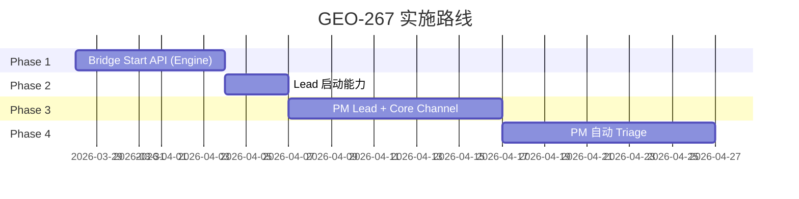
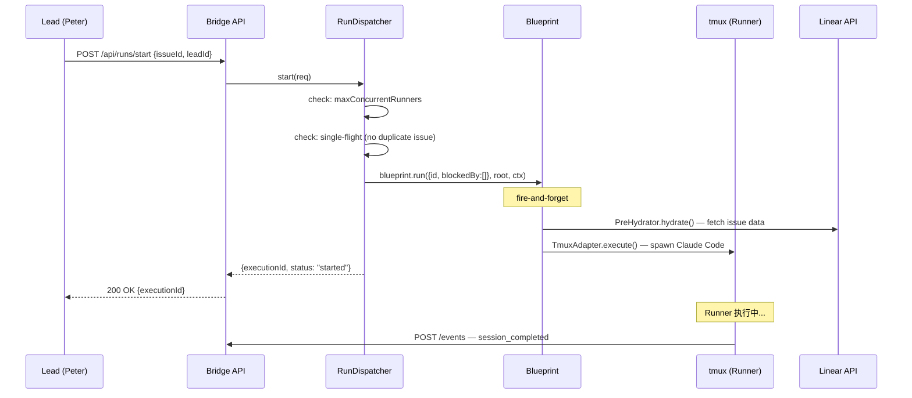
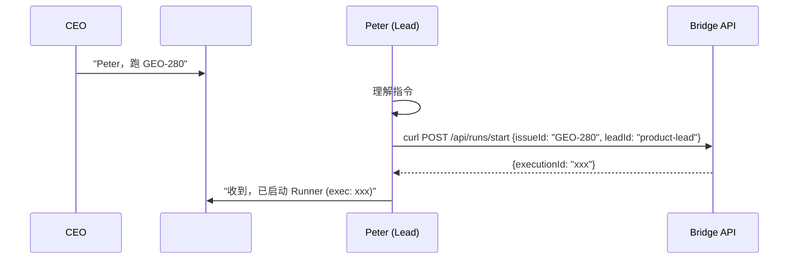
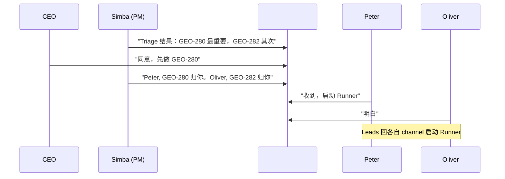
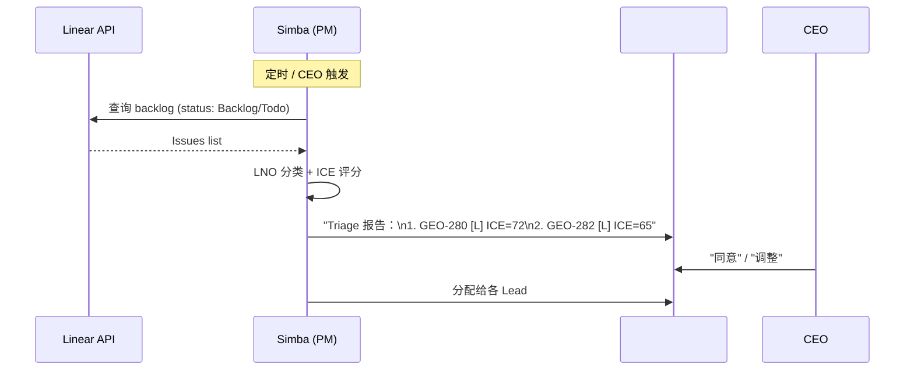

# Plan: Lead 自动启动 Runner + PM Lead (Simba)

**Version**: v1.13.0
**Issue**: GEO-267
**Date**: 2026-03-27
**Source**: `doc/engineer/exploration/new/GEO-267-lead-auto-start-runner.md`, `doc/engineer/research/new/GEO-267-lead-auto-start-runner.md`
**Status**: codex-approved

**Goal:** 让 Lead 通过 Bridge API 启动 Runner（去掉手动 run-issue.ts），并引入 PM Lead (Simba) 在 #geoforge3d-core channel 做 triage 和任务分配。

**Architecture:** Bridge daemon 新增 `POST /api/runs/start` 端点，复用 RetryDispatcher 的 fire-and-forget Blueprint.run() 模式。新增 PM Lead (Simba) 作为 Chief of Staff，在统一 Core Channel 中与所有 Lead 和 CEO 协作。4 个 Phase 渐进实现。

**Research doc:** `doc/engineer/research/new/GEO-267-lead-auto-start-runner.md`

---

## Phase Overview



---

## Phase 1: Bridge Start API (Engine)

### What We're Building

在 Bridge daemon 中添加 "启动 Runner" 的能力。这是所有后续 Phase 的基础设施——无论是 Lead 手动启动、PM 分配后启动、还是未来自动调度，底层都调用同一个 API。

核心改动：
1. 新增 `IStartDispatcher` 接口和 `RunDispatcher` 实现
2. 新增 `POST /api/runs/start` HTTP 端点
3. 新增 `maxConcurrentRunners` 并发控制
4. Bridge daemon 启动时初始化 RunDispatcher（复用现有 Blueprint 实例）

### Data Flow



### Tasks

| # | Task | What It Does | Deliverable |
|---|------|-------------|-------------|
| 1 | StartRequest + IStartDispatcher 接口 | 定义启动 Runner 的请求格式和调度器接口 | 新接口文件 |
| 2 | maxConcurrentRunners 配置 | Bridge 配置中增加最大并发 Runner 数 | 配置字段 + env var |
| 3 | RunDispatcher 实现 | 继承 RetryDispatcher，添加 start() + 并发控制 | 新类 |
| 4 | setupRuntime 扩展 | 初始化 RunDispatcher 替代 RetryDispatcher | 更新初始化函数 |
| 5 | POST /api/runs/start 路由 | HTTP 端点接收启动请求 | 新路由 |
| 6 | Bridge 集成 | plugin.ts + run-bridge.ts 使用 RunDispatcher | 更新入口 |
| 7 | 测试 | 单元测试 + E2E 测试 | 测试文件 |

### Phase Deliverables

- **Demo**: `curl -X POST http://127.0.0.1:9876/api/runs/start -d '{"issueId":"GEO-XXX","projectName":"GeoForge3D","leadId":"product-lead"}'` → Runner 在 tmux 中启动
- **Verification**: `GET /api/sessions?mode=active` 返回新 session + `tmux list-windows -t retry-GeoForge3D` 显示新 window
- **Artifacts**: RunDispatcher 类, start route, 测试
- **Prerequisite**: Bridge env 必须有 `LINEAR_API_KEY`（PreHydrator 依赖）

---

## Phase 2: Lead 启动能力

### What We're Building

更新 Lead (Peter/Oliver) 的 agent 配置，让他们知道如何使用新的 start API。当 CEO 或 PM 告诉 Lead "跑 GEO-XXX"，Lead 能自主调用 Bridge API 启动 Runner。

### Data Flow



### Tasks

| # | Task | What It Does | Deliverable |
|---|------|-------------|-------------|
| 1 | 更新 Lead TOOLS.md | 添加 start API 文档到 Peter/Oliver 的 TOOLS.md | TOOLS.md 更新 |
| 2 | 更新 Lead agent.md | 添加行为规则：收到启动指令后自动调用 start API | agent.md 更新 |
| 3 | E2E 验证 | CEO 在 Discord 说 "Peter 跑 GEO-XXX" → Runner 启动 | 验证记录 |

### Phase Deliverables

- **Demo**: 在 Discord 对 Peter 说 "跑 GEO-265" → Peter 自动调用 API → Runner 启动
- **Verification**: CEO 看到 Peter 回复 "已启动" + tmux 中出现 Runner
- **Artifacts**: 更新的 TOOLS.md, agent.md

---

## Phase 3: PM Lead (Simba) + Core Channel

### What We're Building

创建第三个 Lead agent —— **Simba** (Chief of Staff / PM Lead)。建立 #geoforge3d-core 统一 channel，所有 agent 和 CEO 在此协作。Simba 负责 triage Linear backlog 并分配任务。

### Data Flow



### Tasks

| # | Task | What It Does | Deliverable |
|---|------|-------------|-------------|
| 1 | 创建 Simba Discord Bot | 注册 bot, 获取 token, 设置头像 | Bot 配置 |
| 2 | 创建 #geoforge3d-core channel | Discord server 中建立统一 channel | Channel |
| 3 | 所有 bot 加入 core channel | 修改 access.json，让 PM + Peter + Oliver 都能看到 core channel | access.json 更新 |
| 4 | projects.json 添加 Simba | PM Lead 配置条目 | 配置更新 |
| 5 | Simba agent.md | PM 身份 + triage 行为 + 分配规则 + core channel 路由规则 | agent 文件 |
| 6 | Core channel 路由规则 | 所有 bot 的 agent.md 添加 core channel 行为规则（被叫名字才回复，默认 Simba 接管） | agent.md 更新 |
| 7 | claude-lead.sh 启动 Simba | 用现有脚本启动 PM Lead | 验证 |

### Phase Deliverables

- **Demo**: Simba 在 #geoforge3d-core 发布 triage 结果，CEO 确认后 Simba 分配给各 Lead
- **Verification**: CEO 在 core channel 看到 Simba、Peter、Oliver 都能回复
- **Artifacts**: Simba bot, core channel, 更新的 agent 文件

---

## Phase 4: PM 自动 Triage

### What We're Building

让 Simba 能自动扫描 Linear backlog，使用 LNO/ICE 框架评估优先级，生成 triage 报告并在 core channel 发起讨论。

### Data Flow



### Tasks

| # | Task | What It Does | Deliverable |
|---|------|-------------|-------------|
| 1 | Simba Linear API 访问 | PM agent 通过 MCP 或 curl 查询 Linear | 配置 |
| 2 | Triage 逻辑 | 复用 pm-triage skill 的 LNO/ICE 框架到 agent 行为 | agent.md 更新 |
| 3 | 报告模板 | 标准化的 triage 报告格式（Discord message） | 模板 |
| 4 | CEO 触发 | CEO 说 "Simba, triage" → 立即执行 | 行为规则 |
| 5 | E2E 验证 | 完整流程：triage → 讨论 → 分配 → Lead 启动 Runner | 验证记录 |

### Phase Deliverables

- **Demo**: CEO 说 "Simba, triage" → Simba 发布优先级报告 → 分配 → Runner 启动
- **Verification**: CEO 全程在 #geoforge3d-core 操作，不需要打开终端
- **Artifacts**: Triage 逻辑, 报告模板

---

## Risk Assessment

| Risk | Probability | Impact | Mitigation |
|------|------------|--------|------------|
| PreHydrator 无法 fetch issue (LINEAR_API_KEY 未设置) | 中 | 高 | Bridge env 必须有 LINEAR_API_KEY。Phase 1 不支持 request-body fallback——简化实现 |
| 多 bot 在 core channel 抢答 | 中 | 低 | Prompt-level 路由规则；误判时人工干预；后续可加硬逻辑 |
| maxConcurrentRunners 限制太低，Lead 等待过久 | 低 | 中 | 可配置；未来扩容到第二台机器 |
| Blueprint.run() 失败但 start API 已返回 200 | 中 | 中 | Fire-and-forget 设计意图；Lead 通过 session 状态查询检测失败 |
| Trust prompt 阻塞 Runner 启动 | 低 | 高 | Claude Code `--trust-dir` 全局信任项目目录 |

---

## Issue 拆分建议

GEO-267 scope 已扩展。建议拆为：

| Issue | Phase | Scope |
|-------|-------|-------|
| GEO-267 | Phase 1 | Bridge Start API (Engine) — 本 PR |
| 新 Issue | Phase 2 | Lead 启动能力 (TOOLS.md + agent.md) |
| 新 Issue | Phase 3 | PM Lead Simba + Core Channel |
| 新 Issue | Phase 4 | PM 自动 Triage |

Phase 1 是本次实现范围。Phase 2-4 在 Phase 1 合并后创建新 issue。

---

# Part 2: Technical Appendix

> **For Claude:** Use /implement to execute tasks from this section.
> **For Codex:** Review interfaces, data schemas, and test coverage.

**Scope: Phase 1 only** — Bridge Start API (Engine)

### Codex Round 1 Feedback — Issues Addressed

| # | Issue | Resolution |
|---|-------|-----------|
| 1 | `/api/runs/start` 挂在 404 handler 后不可达 | Route 注册移到 `createBridgeApp()` 内，在 404 handler 之前 |
| 2 | DirectEventSink 无 RuntimeRegistry，事件发给错误 Lead | 给 DirectEventSink 添加延迟注入 registry 的能力（`setRegistry()`），bridge 启动后补注入 |
| 3 | Issue hydration fallback 与代码不符 | 简化：StartRequest 只含 `issueId` + `projectName` + `leadId`，删除可选 issue metadata。Bridge 必须有 `LINEAR_API_KEY` |
| 4 | 缺少 active session + lead scope 检查 | 路由层添加 StateStore 检查 (getActiveSessions) + matchesLead scope 验证，对齐 handleRetry 模式 |
| 5 | 测试计划不可执行 | 使用 `createBridgeApp()` + `fetch` 做 E2E（对齐 bridge-e2e.test.ts），避免 supertest；RunDispatcher 测试放 scripts 层 |
| 6 | 验收标准与 tmux 拓扑不符 | 改为检查 `retry-<project>` session 内 tmux window + StateStore session |

### Codex Round 2 Feedback — Issues Addressed

| # | Issue | Resolution |
|---|-------|-----------|
| 1 | `accepting` is private, RunDispatcher can't access | Change `accepting` to `protected` alongside `inflight` and `blueprintsByProject` |
| 2 | maxConcurrentRunners only counts inflight, misses StateStore | Move cap check to route layer: `store.getActiveSessions().length + dispatcher.getInflightIssues().size` |
| 3 | leadId can diverge from event routing | Phase 1 known limitation: caller-supplied leadId + project membership check. Full server-side resolution deferred to Phase 2 |
| 4 | Wiring not concrete (two alternatives, positional vs opts) | Pinned: create RuntimeRegistry first → pass to setupRetryRuntime → pass to startBridge opts |
| 5 | tmux session rename retry→start unnecessary | Reverted: keep `retry-<project>` naming, fix verification criteria only |

---

## Task 1: IStartDispatcher 接口 + StartRequest 类型

**Files:**
- Modify: `packages/teamlead/src/bridge/retry-dispatcher.ts`

**Implementation:**

Append to `packages/teamlead/src/bridge/retry-dispatcher.ts`:

```typescript
/** GEO-267: Start a new Runner execution (no predecessor session) */
export interface StartRequest {
  issueId: string;
  projectName: string;
  leadId?: string;
}

export interface StartResult {
  executionId: string;
  issueId: string;
}

export interface IStartDispatcher {
  start(req: StartRequest): Promise<StartResult>;
  /** Current count of inflight (dispatched but not yet completed) executions */
  getInflightCount(): number;
}
```

Note: No optional issue metadata (issueTitle/issueDescription/labels). Bridge relies on `LINEAR_API_KEY` + `createFetchIssue()` for hydration.

**Commit:** `feat: add IStartDispatcher interface and StartRequest types (GEO-267)`

---

## Task 2: maxConcurrentRunners 配置

**Files:**
- Modify: `packages/teamlead/src/bridge/types.ts` — add field to BridgeConfig
- Modify: `packages/teamlead/src/config.ts` — parse env var

**Implementation:**

In `packages/teamlead/src/bridge/types.ts`, add to `BridgeConfig`:
```typescript
maxConcurrentRunners: number;
```

In `packages/teamlead/src/config.ts`, in `loadConfig()`:
```typescript
const maxConcurrentRunners = parseInt(
  process.env.TEAMLEAD_MAX_CONCURRENT_RUNNERS ?? "3", 10,
);
if (maxConcurrentRunners < 1 || maxConcurrentRunners > 20) {
  throw new Error(
    `TEAMLEAD_MAX_CONCURRENT_RUNNERS must be 1-20, got ${maxConcurrentRunners}`,
  );
}
```

**Test:** Add to existing config test file to verify default=3 and env override.

**Commit:** `feat: add maxConcurrentRunners config (GEO-267)`

---

## Task 3: RunDispatcher 实现

**Files:**
- Modify: `scripts/lib/retry-dispatcher.ts` — change `private` → `protected` on `inflight` and `blueprintsByProject`, add `RunDispatcher` class

**Key design decisions:**
- `RunDispatcher extends RetryDispatcher` — all existing `IRetryDispatcher` methods preserved
- `start()` checks: (1) shutdown guard, (2) maxConcurrentRunners, (3) single-flight per issue
- Fire-and-forget `blueprint.run()` identical to `dispatch()` pattern
- `getInflightCount()` returns `inflight.size`

**Implementation:**

```typescript
import type {
  StartRequest, StartResult, IStartDispatcher,
} from "../../packages/teamlead/dist/bridge/retry-dispatcher.js";

export class RunDispatcher extends RetryDispatcher implements IStartDispatcher {
  constructor(
    blueprintsByProject: Map<string, ProjectRuntime>,
    cleanupHandles: Array<() => Promise<void>>,
    private maxConcurrentRunners: number = 3,
  ) {
    super(blueprintsByProject, cleanupHandles);
  }

  getInflightCount(): number {
    return this.getInflightIssues().size;
  }

  async start(req: StartRequest): Promise<StartResult> {
    if (!this.accepting) {
      throw new Error("RunDispatcher is shutting down");
    }
    if (this.getInflightCount() >= this.maxConcurrentRunners) {
      throw new Error(
        `Max concurrent runners reached (${this.maxConcurrentRunners}). Currently running: ${this.getInflightCount()}`,
      );
    }
    if (this.inflight.has(req.issueId)) {
      throw new Error(`Run already in progress for issue ${req.issueId}`);
    }

    const runtime = this.blueprintsByProject.get(req.projectName);
    if (!runtime) {
      throw new Error(`No runtime for project: ${req.projectName}`);
    }

    const executionId = randomUUID();
    const entry = { executionId, promise: null! as Promise<void> };
    this.inflight.set(req.issueId, entry);

    const ctx: BlueprintContext = {
      teamName: "eng",
      runnerName: "claude",
      projectName: req.projectName,
      executionId,
      leadId: req.leadId,
    };

    entry.promise = runtime.blueprint
      .run({ id: req.issueId, blockedBy: [] }, runtime.projectRoot, ctx)
      .then(() => console.log(`[RunDispatcher] ${executionId} completed for ${req.issueId}`))
      .catch((err) => console.error(`[RunDispatcher] ${executionId} failed:`, (err as Error).message))
      .finally(() => this.inflight.delete(req.issueId));

    return { executionId, issueId: req.issueId };
  }
}
```

**Prerequisite refactor:** Change `RetryDispatcher.inflight`, `RetryDispatcher.blueprintsByProject`, and `RetryDispatcher.accepting` from `private` to `protected`.

**Commit:** `feat: implement RunDispatcher with start() and concurrency control (GEO-267)`

---

## Task 4: RuntimeRegistry 初始化顺序重排

**Files:**
- Modify: `scripts/lib/retry-runtime.ts` — accept `registry?: RuntimeRegistry` parameter
- Modify: `scripts/run-bridge.ts` — create RuntimeRegistry before setupRetryRuntime

**Why:** `DirectEventSink` constructor already accepts optional `registry` parameter (`DirectEventSink.ts:33-39`). Currently `setupRetryRuntime()` doesn't pass it, so events fall back to `defaultLeadAgentId`. Fix: create `RuntimeRegistry` first, pass to `setupRetryRuntime()`.

**Implementation:**
1. `run-bridge.ts`: Create `RuntimeRegistry` before calling `setupRetryRuntime()`
2. `setupRetryRuntime()`: Accept optional `registry` parameter, pass to `DirectEventSink` constructor
3. `startBridge()`: Receive same `RuntimeRegistry` instance (registers Lead runtimes into it)

No `setRegistry()` method needed — constructor injection only.

**Commit:** `fix: inject RuntimeRegistry into DirectEventSink during setup (GEO-267)`

---

## Task 5: setupRuntime 扩展

**Files:**
- Modify: `scripts/lib/retry-runtime.ts` — return RunDispatcher (keep existing `retry-<project>` tmux naming)

**Changes:**
1. Import `RunDispatcher` instead of `RetryDispatcher`
2. Change return type to `RunDispatcher`
3. Pass `bridgeConfig.maxConcurrentRunners` to constructor
4. Keep existing `retry-${projectName}` tmux session naming (Codex R2 Issue #5 — no unnecessary rename)
5. Accept optional `RuntimeRegistry` parameter for DirectEventSink injection (Codex R2 Issue #4)

```typescript
import { RunDispatcher } from "./retry-dispatcher.js";

export async function setupRetryRuntime(
  store: StateStore,
  bridgeConfig: BridgeConfig,
  projects: ProjectEntry[],
  registry?: RuntimeRegistry,  // GEO-267: injected from run-bridge.ts
): Promise<RunDispatcher> {
  // ... existing setup, pass registry to DirectEventSink constructor ...
  return new RunDispatcher(projectRuntimes, cleanupHandles, bridgeConfig.maxConcurrentRunners);
}
```

**Commit:** `feat: setupRetryRuntime returns RunDispatcher (GEO-267)`

---

## Task 6: POST /api/runs/start 路由 + Bridge 集成

**Files:**
- Create: `packages/teamlead/src/bridge/runs-route.ts` — route handler
- Modify: `packages/teamlead/src/bridge/plugin.ts` — register route **inside** `createBridgeApp()` (before 404 handler)
- Modify: `scripts/run-bridge.ts` — pass RunDispatcher as startDispatcher

**Route registration (CRITICAL — Codex Issue #1):**

The runs route MUST be registered inside `createBridgeApp()`, BEFORE the 404 catch-all handler (plugin.ts:614-634). NOT in `startBridge()` after app creation.

```typescript
// Static import at top of plugin.ts (Codex R3 #2 — keep createBridgeApp sync):
import { createRunsRouter } from "./runs-route.js";

// In createBridgeApp(), before the 404 handler:
// MUST use same auth middleware as other /api/* routes (Codex R4 #2):
if (startDispatcher) {
  const runsRouter = createRunsRouter(startDispatcher, store, projects, config.maxConcurrentRunners);
  if (config.apiToken) {
    app.use("/api/runs", tokenAuthMiddleware(config.apiToken), runsRouter);
  } else {
    app.use("/api/runs", runsRouter);
  }
}
// ... then 404 handler ...
```

**Signature change (Codex R4 #2):** `startDispatcher` APPENDED as the LAST optional parameter to `createBridgeApp()`, after all existing parameters. This preserves all existing positional call sites (including `tools.test.ts:542-555`). Same for `startBridge()` opts: add `startDispatcher?: IStartDispatcher` and `registry?: RuntimeRegistry` to the opts object (not positional).

`createBridgeApp()` stays synchronous.

**Route handler with StateStore + lead scope checks (Codex Issue #4):**

```typescript
// packages/teamlead/src/bridge/runs-route.ts
import { Router } from "express";
import type { IStartDispatcher } from "./retry-dispatcher.js";
import type { StateStore } from "../StateStore.js";
import type { ProjectEntry } from "../ProjectConfig.js";
import { resolveLeadForIssue } from "../ProjectConfig.js";

export function createRunsRouter(
  startDispatcher: IStartDispatcher,
  store: StateStore,
  projects: ProjectEntry[],
  maxConcurrentRunners: number,
): Router {
  const router = Router();

  router.post("/start", async (req, res) => {
    const { issueId, projectName, leadId } = req.body;

    // Input validation
    if (!issueId || typeof issueId !== "string") {
      res.status(400).json({ success: false, message: "issueId is required" });
      return;
    }
    if (!projectName || typeof projectName !== "string") {
      res.status(400).json({ success: false, message: "projectName is required" });
      return;
    }

    // Check: no active session for this issue (Codex R1 Issue #4)
    const activeSessions = store.getActiveSessions();
    const alreadyActive = activeSessions.find(
      (s) => s.issue_id === issueId &&
        ["running", "awaiting_review"].includes(s.status),
    );
    if (alreadyActive) {
      res.status(409).json({
        success: false,
        message: `Issue ${issueId} already has an active session (${alreadyActive.execution_id}, status: ${alreadyActive.status})`,
      });
      return;
    }

    // Concurrency cap: StateStore running + inflight reservations (Codex R2 #2, R3 #1)
    const runningInStore = activeSessions.filter((s) => s.status === "running").length;
    const inflightCount = startDispatcher.getInflightCount();
    const totalActive = runningInStore + inflightCount;
    if (totalActive >= maxConcurrentRunners) {
      res.status(429).json({
        success: false,
        message: `Max concurrent runners reached (${maxConcurrentRunners}). Running: ${runningInStore}, inflight: ${inflightCount}`,
      });
      return;
    }

    // Lead scope validation — project membership check (Codex R1 #4, R2 #3)
    // Phase 1 known limitation: caller-supplied leadId is trusted after membership check.
    // Full label-based resolution (resolveLeadForIssue) requires pre-hydrating the issue
    // from Linear, which adds latency and complexity. Deferred to Phase 2.
    if (leadId) {
      const project = projects.find((p) => p.projectName === projectName);
      if (project) {
        const leadExists = project.leads.some((l) => l.agentId === leadId);
        if (!leadExists) {
          res.status(403).json({
            success: false,
            message: `Lead "${leadId}" is not configured for project "${projectName}"`,
          });
          return;
        }
      }
    }

    try {
      const result = await startDispatcher.start({ issueId, projectName, leadId });
      res.json({
        success: true,
        executionId: result.executionId,
        issueId: result.issueId,
        message: `Runner started for ${issueId}`,
      });
    } catch (err) {
      const message = err instanceof Error ? err.message : String(err);
      if (message.includes("Max concurrent") || message.includes("max concurrent")) {
        res.status(429).json({ success: false, message });
      } else if (message.includes("already in progress")) {
        res.status(409).json({ success: false, message });
      } else if (message.includes("No runtime for project")) {
        res.status(404).json({ success: false, message });
      } else {
        console.error("[runs/start] Unexpected error:", message);
        res.status(500).json({ success: false, message });
      }
    }
  });

  router.get("/active", (_req, res) => {
    const running = store.getActiveSessions().filter((s) => s.status === "running").length;
    const inflight = startDispatcher.getInflightCount();
    res.json({ running, inflight, total: running + inflight, max: maxConcurrentRunners });
  });

  return router;
}
```

**run-bridge.ts update (Codex R2 Issue #4 — concrete wiring):**

```typescript
// Phase 1: Store
const store = await StateStore.create(config.dbPath);

// Phase 2: RuntimeRegistry (created BEFORE setupRetryRuntime)
// Note: runtimes are registered inside startBridge(), but the registry
// object is created here so it can be passed to both setupRetryRuntime and startBridge
const registry = new RuntimeRegistry();

// Phase 3: RunDispatcher (gets registry for DirectEventSink)
const runDispatcher = await setupRetryRuntime(store, config, projects, registry);

// Phase 4: Memory
const memoryService = await createMemoryService({...});

// Phase 5: Bridge (startBridge registers runtimes into registry)
const { close } = await startBridge(config, projects, {
  store,
  retryDispatcher: runDispatcher,    // IRetryDispatcher (existing)
  startDispatcher: runDispatcher,    // IStartDispatcher (new)
  memoryService,
  registry,  // passed through so startBridge registers Lead runtimes into it
});
```

This requires adding `startDispatcher?: IStartDispatcher` and `registry?: RuntimeRegistry` to `startBridge` opts type. The `createBridgeApp()` function also needs `startDispatcher` in its params (before 404 handler).

**Commit:** `feat: add POST /api/runs/start route with active session + scope checks (GEO-267)`

---

## Task 7: Tests

**Files:**
- Create: `packages/teamlead/src/__tests__/start-e2e.test.ts`
- Extend: `packages/teamlead/src/__tests__/start-dispatcher.test.ts` (for interface + config tests)

**Testing approach (Codex Issue #5):**

Use existing patterns:
- **E2E**: `createBridgeApp()` + native `fetch()` (like `bridge-e2e.test.ts`). NO `supertest`.
- **Unit**: RunDispatcher tests in `scripts/` level, require prior `pnpm build`.
- **Config**: Extend existing config tests for `maxConcurrentRunners`.

**E2E test structure** (following `bridge-e2e.test.ts` pattern):

```typescript
// packages/teamlead/src/__tests__/start-e2e.test.ts
describe("Start API E2E", () => {
  // Setup: createBridgeApp() with mock RunDispatcher + :memory: StateStore
  // No supertest — use native fetch()

  it("POST /api/runs/start → 200 + executionId", async () => {
    const res = await fetch(`http://127.0.0.1:${port}/api/runs/start`, {
      method: "POST",
      headers: { "Content-Type": "application/json" },
      body: JSON.stringify({ issueId: "GEO-TEST", projectName: "TestProject" }),
    });
    expect(res.status).toBe(200);
    const body = await res.json();
    expect(body.success).toBe(true);
    expect(body.executionId).toBeDefined();
  });

  it("POST duplicate issue → 409", async () => { /* ... */ });
  it("POST exceeding maxConcurrent → 429", async () => { /* ... */ });
  it("POST with active session in StateStore → 409", async () => { /* ... */ });
  it("POST with invalid leadId → 403", async () => { /* ... */ });
  it("GET /api/runs/active → count", async () => { /* ... */ });
});
```

**Commit:** `test: add Start API E2E + unit tests (GEO-267)`

---

## Task 8: Exports + VERSION bump

**Files:**
- Modify: `packages/teamlead/src/index.ts` — export new types
- Modify: `doc/VERSION` — bump to v1.13.0

**Implementation:**

```typescript
// packages/teamlead/src/index.ts
export type { IStartDispatcher, StartRequest, StartResult } from "./bridge/retry-dispatcher.js";
export { createRunsRouter } from "./bridge/runs-route.js";
```

```
// doc/VERSION
v1.13.0
```

**Commit:** `chore: export start dispatcher types + bump version to v1.13.0 (GEO-267)`
