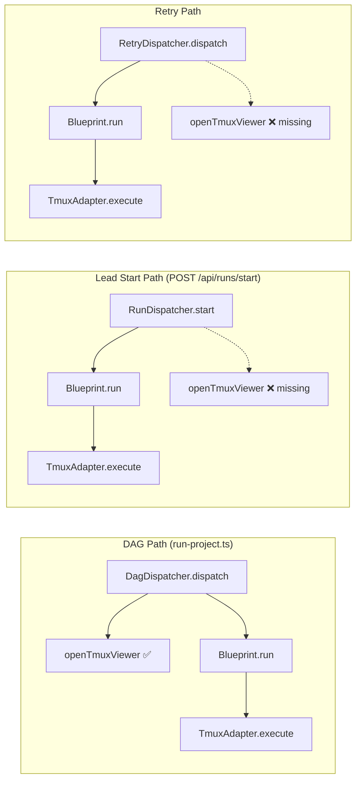
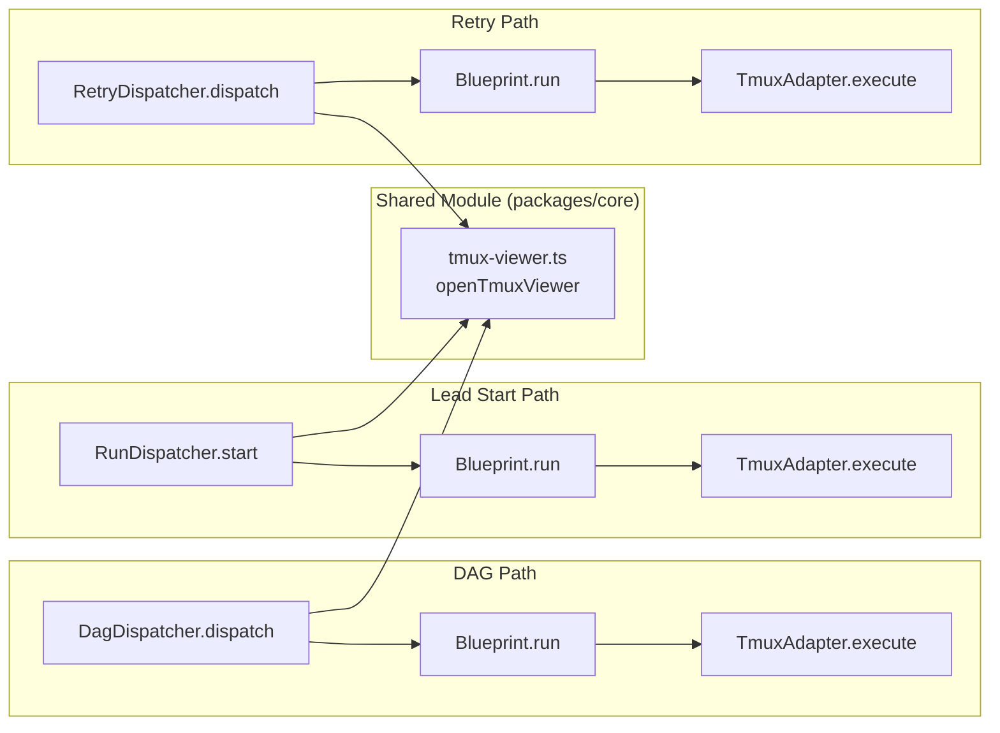

# Plan: Runner 启动自动打开 Terminal.app

**Version**: v1.15.0
**Issue**: GEO-277
**Date**: 2026-03-27
**Source**: Linear issue GEO-277, GEO-179 参考实现
**Status**: codex-approved

## Background

当前 Runner 通过 TmuxAdapter 在 tmux session 中启动 Claude Code CLI。CEO 看不到 Runner 在跑 — 没有 Terminal 窗口自动弹出。

已有的 Terminal 打开逻辑在 `DagDispatcher.openTmuxViewer()`（GEO-179），但只在 DAG dispatch 流程中调用。Lead 通过 `POST /api/runs/start` → `RunDispatcher.start()` → `Blueprint.run()` 和 Retry 通过 `RetryDispatcher.dispatch()` → `Blueprint.run()` 启动 Runner 时**不经过 DagDispatcher**，所以没有 Terminal 弹窗。

**关键时序**：所有三条路径（DAG / Lead start / Retry）都在 `Blueprint.run()` 之前调用 `openTmuxViewer()`，而 tmux session 由 `TmuxAdapter.ensureSession()` 在 `Blueprint.run()` → `adapter.execute()` 内部创建（`TmuxAdapter.ts:80-82`）。中间还有 hydrate、worktree、git preflight 等步骤（`Blueprint.ts:123-229`），session 出现可能延迟数秒到数十秒。

## Goal

每次新 Runner 启动时（DAG / Lead start / Retry 三条路径），Terminal.app 自动弹出并显示 tmux session，CEO 能直接看到 Runner 执行过程。

## Acceptance Criteria

- [ ] 每次新 Runner 启动时，Terminal.app 自动弹出并等待 tmux session 出现后显示（等待上限 120 秒）
- [ ] 已有 viewer attached 时不重复打开（best-effort dedup）
- [ ] tmux session 结束后 Terminal 窗口自动关闭
- [ ] DAG dispatch、Lead start、Retry dispatch 三条路径都触发
- [ ] 失败不影响 Runner 正常运行（best-effort）
- [ ] 不依赖非 macOS 默认命令（纯 POSIX shell + AppleScript）

### 关于 Auto-Close 的范围说明

Auto-close 是**session 级**的：当 tmux session 不再有活跃 client 时（session 被销毁或所有 window 关闭），Terminal 窗口自动关闭。**不是** runner/window 级的 — 多个 Runner 共享一个 session 时，Terminal 保持打开直到最后一个 Runner 完成。

Lead start 路径使用长期存活的 `retry-<project>` session，auto-close 依赖 GEO-270（Runner 完成后自动清理 tmux session）来触发。在 GEO-270 之前，CEO 需要手动关闭 Terminal 窗口或者等所有 Runner 完成后 session 空闲。

## Architecture

### Current State



### Target State



## Design Decisions

### 触发位置：调用方（不是 TmuxAdapter）

**选项 A**: 在 TmuxAdapter.execute() 内触发
- TmuxAdapter 是纯 tmux 操作层，不应关心 Terminal.app UI
- TmuxAdapter 用 injectable `execFileFn`，引入 async `osascript` 调用破坏 synchronous 设计
- 并行 Runner 时每个 window 都会尝试打开

**选项 B**: 在调用方（DagDispatcher / RunDispatcher / RetryDispatcher）触发 ✅
- 关注点分离：TmuxAdapter 管 tmux，调用方管 UI
- 不改 TmuxAdapter 接口
- 与 GEO-179 现有模式一致

**选择 B**。

### Session Name 获取方式

`Blueprint` 不持有 tmux session name，也没有 `getSessionName()` 方法。Session name 的真实来源是：
- DAG 路径：`DagDispatcher` 构造函数 `tmuxSessionName` 参数（default `"flywheel"`）
- Lead/Retry 路径：`setupComponents({ tmuxSessionName: \`retry-\${project.projectName}\` })` → 闭包捕获 → `new TmuxAdapter()`

**方案**：扩展 `ProjectRuntime` 接口，加 `tmuxSessionName` 字段。在 `setupRetryRuntime()` 建 runtime map 时保存它。

### Dedup 策略

Dedup 基于 `tmux list-clients` 检查，是 **best-effort** 的。由于 `openTmuxViewer()` 是 fire-and-forget 的 osascript 调用，client attach 是异步的。两个几乎同时的 `start()` 调用可能都通过检查。这在实际场景中几乎不会发生（需要毫秒级并发），即使发生也只是多开一个 Terminal 窗口，不影响功能。不值得为此加进程内 mutex。

### 等待策略与 Auto-Close 的两阶段设计

**问题**：`openTmuxViewer()` 在 `Blueprint.run()` 之前调用，但 tmux session 由 `TmuxAdapter.ensureSession()` 在 `execute()` 内部创建（`TmuxAdapter.ts:80-82`）。在所有三条路径中，`Blueprint.run()` 在走到 `adapter.execute()` 之前还要经历 hydrate、worktree、git preflight、skill injection 等步骤（`Blueprint.ts:123-229`），session 出现可能延迟数秒到数十秒。

**冲突**：DagDispatcher 现有的 AppleScript auto-close 机制检测 `processes of viewerTab` 是否包含 `"tmux"`。在等待阶段（session 尚未创建），shell 运行的是 `sleep`/`tmux has-session`（瞬时），进程列表中大部分时间没有 `tmux`。如果 auto-close 立即开始轮询，会在等待阶段误关窗口。

**额外冲突**：等待循环中 `tmux has-session` 是一个短命的 `tmux` 进程（< 10ms），AppleScript 的 `processes of viewerTab` 可能偶尔抓到它，误判为 `tmux attach` 已成功。需要一个 **attach-only** 信号来区分。

**解决方案：`tmux list-clients` 作为 Phase 1 attach 判定 + AppleScript 两阶段状态机**

核心洞察：`tmux has-session` 探测不创建 client，`tmux attach` 创建 client。因此 `tmux list-clients -t '=SESSION'` 的输出从空变非空，是一个**仅在 attach 成功后才出现的信号**，完全消除了 probe-vs-attach 歧义。

```
Phase 1 (等待 attach): AppleScript 通过 `do shell script "tmux list-clients ..."` 轮询
  ↓ list-clients 返回空 → session 未被 attach → 继续等待
  ↓ list-clients 返回非空 → attach 已成功 → 进入 Phase 2
  ↓ 120 秒超时 → 关窗

Phase 2 (监控 tmux 消失): AppleScript 轮询 `processes of viewerTab`
  ↓ processes 包含 "tmux" → attach 仍在 → 继续
  ↓ processes 不含 "tmux" → session 结束 → 关窗
```

AppleScript 伪代码（`TMUX` = 绝对路径，如 `/usr/local/bin/tmux`）：

```applescript
tell application "Terminal"
  set viewerTab to do script "SHELL_CMD"
  set viewerWindow to front window
  activate

  -- Phase 1: Wait for a real tmux client to attach (bounded 120 seconds)
  -- Uses absolute path to tmux — do shell script runs /bin/sh without user PATH
  -- tmux list-clients is the attach-only signal:
  --   tmux has-session (probe) does NOT create a client → empty
  --   tmux attach (connect) DOES create a client → non-empty
  set maxWait to 120
  set waited to 0
  set attached to false
  repeat while waited < maxWait
    delay 3
    set waited to waited + 3
    try
      set clients to do shell script "TMUX list-clients -t '=SESSION' 2>/dev/null || true"
      if clients is not "" then
        set attached to true
        exit repeat
      end if
    end try
  end repeat

  -- If no client ever attached, close and bail
  if not attached then
    close viewerWindow
    return
  end if

  -- Phase 2: Auto-close when tmux exits from our Terminal tab
  repeat
    delay 3
    try
      set p to (processes of viewerTab) as string
      if p does not contain "tmux" then
        close viewerWindow
        exit repeat
      end if
    on error
      exit repeat
    end try
  end repeat
end tell
```

Shell 命令（纯 POSIX，使用 tmux 绝对路径）：

```bash
i=0; while [ $i -lt 120 ] && ! TMUX has-session -t '=SESSION' 2>/dev/null; do sleep 1; i=$((i+1)); done; exec TMUX attach -t '=SESSION' 2>/dev/null
```

其中 `TMUX` 在 Node.js 侧通过 `execFileSync("which", ["tmux"]).toString().trim()` 解析为绝对路径（如 `/usr/local/bin/tmux`），然后插入到 shell 命令和 AppleScript `do shell script` 中。

**注意**：Terminal tab 内执行的 shell 命令也使用绝对路径，因为 Terminal 的交互式 shell 通常有完整 PATH，但为一致性和可靠性统一使用绝对路径。

**关键设计点**：
- **Phase 1 用 `tmux list-clients`（attach-only 信号）**：`has-session` 探测不创建 client，`attach` 创建 client。这是一个严格可判定的状态切换条件，不存在 probe-vs-attach 歧义
- **Phase 2 用 `processes of viewerTab`（tab 级信号）**：检测我们 Terminal tab 里的 tmux 进程是否退出。这与 GEO-179 的现有 auto-close 机制一致
- **`exec tmux attach`**：替换 shell 进程，tab 前台变为纯 tmux。Session 结束时 tmux 退出，Phase 2 检测到并关窗
- **不依赖 `timeout` 命令**（macOS 默认无 GNU coreutils），用纯 shell 计数器实现 120 秒上限
- Phase 1 每 3 秒检查一次 `tmux list-clients`，最多等 120 秒（40 次检查）

**为什么 `tmux list-clients` 是可靠的 attach 判定**：
- `tmux has-session -t '=S'`：查询 tmux server，**不**注册 client → `list-clients` 仍为空
- `tmux attach -t '=S'`：注册为 client → `list-clients` 返回 client 信息（tty, session, size）
- 信号是二值的（空/非空），不依赖进程采样时序

**边界场景**：
| Scenario | Behavior |
|----------|----------|
| Session 已存在（重复 start / DAG 已初始化） | Shell 立即 exec attach → list-clients 非空 → Phase 2 |
| Session 5 秒后出现 | Shell 轮询 → has-session 成功 → exec attach → list-clients 非空 → Phase 2 |
| Session 30 秒后出现 | Shell 轮询 30 次 → exec attach → list-clients 非空 → Phase 2 |
| 探测期 has-session 运行中 | list-clients 为空（probe 不注册 client）→ Phase 1 继续等待 |
| Session 永不出现（Blueprint 失败） | Shell 循环 120 次退出 → exec attach 失败 → list-clients 始终空 → Phase 1 超时 → 关窗 |
| Session 正常结束 | Phase 2 检测 tab 内 tmux 进程退出 → 关窗 |
| 已有 viewer attached（dedup） | `openTmuxViewer()` 入口 `list-clients` 检查 → 非空 → 跳过 |

## Implementation

### Step 1: 提取共享模块 `tmux-viewer.ts`

**File**: `packages/core/src/tmux-viewer.ts`

从 `DagDispatcher.openTmuxViewer()` 提取为独立函数，包含 AppleScript 两阶段状态机。

使用 `node:child_process` 的 `execFileSync`（dedup check）和 `execFile`（fire-and-forget osascript），与现有模式一致。

函数签名：
```typescript
export function openTmuxViewer(sessionName: string): void
```

核心实现要点：
- **tmux 路径解析**：函数入口用 `execFileSync("which", ["tmux"])` 解析绝对路径（如 `/usr/local/bin/tmux`），所有后续命令使用绝对路径。原因：AppleScript 的 `do shell script` 运行在 `/bin/sh` 中，不加载用户 profile，默认 PATH 不含 `/usr/local/bin` 或 `/opt/homebrew/bin`（Homebrew 安装路径）
- Dedup: `execFileSync(tmuxPath, ["list-clients", "-t", `=${sessionName}`])` — 非空则跳过
- Shell 命令: 纯 POSIX 计数器，使用绝对路径 `i=0; while [ $i -lt 120 ] && ! /abs/path/tmux has-session; do sleep 1; i=$((i+1)); done; exec /abs/path/tmux attach`
- AppleScript Phase 1: `do shell script "/abs/path/tmux list-clients -t '=SESSION' 2>/dev/null || true"` — attach-only 信号，绝对路径确保可执行
- AppleScript Phase 2: `processes of viewerTab contains "tmux"` — tab 级 auto-close（与 GEO-179 一致）
- Fire-and-forget: `execFile("osascript", ...)` 异步执行，failure warn 不 throw
- 如果 `which tmux` 失败（tmux 未安装），函数 warn 并返回（best-effort）

从 `packages/core/src/index.ts` 导出。

### Step 2: DagDispatcher 改用共享模块

**File**: `packages/edge-worker/src/DagDispatcher.ts`

- 导入 `openTmuxViewer` from `flywheel-core`
- `dispatch()` 中 `this.openTmuxViewer()` → `openTmuxViewer(this.tmuxSessionName)`
- 删除整个 `private openTmuxViewer()` 方法（lines 193-247）
- 清理不再需要的 `execFile`/`execFileSync` import（如果没有其他使用处）

### Step 3: 扩展 ProjectRuntime 并修改 RunDispatcher / RetryDispatcher

**File**: `scripts/lib/retry-dispatcher.ts`

- 扩展 `ProjectRuntime` 接口加 `tmuxSessionName: string`
- 导入 `openTmuxViewer` from `../../packages/core/dist/index.js`（遵循 scripts/ 层现有的相对路径 import 约定）
- `RetryDispatcher.dispatch()` 中在 `Blueprint.run()` 之前调用 `openTmuxViewer(runtime.tmuxSessionName)`
- `RunDispatcher.start()` 中在 `runtime.blueprint.run()` 之前调用 `openTmuxViewer(runtime.tmuxSessionName)`

**File**: `scripts/lib/retry-runtime.ts` (line 119-122)

- `projectRuntimes.set()` 时加 `tmuxSessionName: \`retry-\${project.projectName}\``

### Step 4: Core package 导出

**File**: `packages/core/src/index.ts`

在 tmux-naming 导出后加：
```typescript
// Tmux viewer utility (GEO-277)
export { openTmuxViewer } from "./tmux-viewer.js";
```

### Step 5: 测试

#### 5a. 单元测试 — `packages/core/test/tmux-viewer.test.ts`

覆盖 `openTmuxViewer()` 函数本身。Mock `node:child_process` 的 `execFileSync` 和 `execFile`。

| Test Case | Setup | Assertion |
|-----------|-------|-----------|
| 已有 client attached 时 skip | `execFileSync` 返回 `/dev/ttys000` | `execFile` 不被调用 |
| 无 client 时打开 viewer | `execFileSync` 返回空字符串 | `execFile` 被调用 with `osascript` |
| session 不存在时仍打开 | `execFileSync` throw `"can't find session"` | `execFile` 被调用 |
| 其他 tmux 错误时 warn + 打开 | `execFileSync` throw `"server exited"` | `console.warn` + `execFile` 被调用 |
| osascript 失败时 warn 不 throw | `execFile` callback with error | `console.warn` 被调用，函数不 throw |
| AppleScript 包含 session name | - | script arg 包含正确 `sessionName` |
| Shell 用 exec + 纯 POSIX 计数器 | - | script 不含 `timeout`；包含 `while [ $i -lt 120 ]` 和 `exec .../tmux attach` |
| Phase 1 用 list-clients + 绝对路径 | - | script 包含 `do shell script ".../tmux list-clients"` 而非 `processes contains "tmux"` |
| Phase 2 用 processes 检查 | - | script 包含 `processes of viewerTab`、`does not contain "tmux"` |
| tmux 路径解析 | mock `execFileSync("which", ["tmux"])` 返回 `/usr/local/bin/tmux` | 所有 tmux 调用使用绝对路径 |
| tmux 未安装时 warn 返回 | `execFileSync("which", ["tmux"])` throw | `console.warn` 被调用，函数不 throw，`execFile` 不被调用 |

测试位于 `packages/core/test/`，由 `pnpm -r test` 的 core 包 vitest 执行。

#### 5b. DagDispatcher 现有测试调整

`packages/edge-worker/src/__tests__/DagDispatcher.test.ts:780-847` 已有 viewer 测试。提取后需调整：
- Mock `flywheel-core` 的 `openTmuxViewer` 导入（`vi.mock("flywheel-core", ...)`）
- 断言 `dispatch()` 调用 `openTmuxViewer(tmuxSessionName)`
- 原有的 dedup/error 分支测试迁移到 5a 的单元测试

#### 5c. RetryDispatcher / RunDispatcher — E2E 验证

`scripts/` 目录无 vitest 入口。对 dispatcher 层做 manual E2E 验证，不新建测试基础设施。理由：dispatcher 只是调用 `openTmuxViewer(name)` 一行，逻辑在 helper 中，helper 已有完整测试。

E2E 验证步骤：
1. 启动 Bridge + retry runtime
2. Lead 通过 `POST /api/runs/start` 启动 Runner
3. 验证 Terminal.app 自动弹出并等待 → 显示 tmux session
4. 验证 Runner 完成后（如果 session 被清理）Terminal 关闭

### Step 6: 版本号

**File**: `doc/VERSION`

v1.13.0 → v1.15.0（当前 committed 基线为 v1.13.0；v1.14.0 应在 GEO-274 PR #56 后更新但尚未 committed，本 PR 直接跳到 v1.15.0）

## File Changes Summary

| File | Action | Description |
|------|--------|-------------|
| `packages/core/src/tmux-viewer.ts` | **新建** | 共享 Terminal viewer（AppleScript 两阶段状态机） |
| `packages/core/src/index.ts` | 修改 | 导出 `openTmuxViewer` |
| `packages/core/test/tmux-viewer.test.ts` | **新建** | 10 个单元测试 |
| `packages/edge-worker/src/DagDispatcher.ts` | 修改 | 删除私有 `openTmuxViewer()`，改用 `flywheel-core` 导入 |
| `packages/edge-worker/src/__tests__/DagDispatcher.test.ts` | 修改 | 调整 viewer 测试为 mock `openTmuxViewer` |
| `scripts/lib/retry-dispatcher.ts` | 修改 | `ProjectRuntime` 加 `tmuxSessionName`；dispatch/start 调用 `openTmuxViewer` |
| `scripts/lib/retry-runtime.ts` | 修改 | 构建 runtime 时保存 `tmuxSessionName` |
| `doc/VERSION` | 修改 | v1.13.0 → v1.15.0 |

## Scope

### In Scope
- DAG dispatch 路径（DagDispatcher）
- Lead start 路径（RunDispatcher）
- Retry 路径（RetryDispatcher）

### Out of Scope
- 自定义 Terminal profile/theme
- Runner 完成后自动清理 tmux session（GEO-270） — auto-close 依赖此 issue
- 非 macOS 平台支持（Linux 无 Terminal.app）
- 窗口标题包含 issue ID — tmux session name 已包含项目名，窗口标题由 tmux 管理不由 Terminal.app 控制

## Risks & Mitigations

| Risk | Impact | Mitigation |
|------|--------|------------|
| 并发 start 时 dedup 失效 | 多开一个 Terminal 窗口 | Best-effort 可接受，实际场景极少并发 |
| Lead session 长期存活不 auto-close | Terminal 窗口常驻 | 设计意图：CEO 可持续观察；GEO-270 后可改善 |
| macOS 以外无 osascript | 函数 warn 但不 crash | 已有模式：fire-and-forget + catch |
| Blueprint 失败 session 永不出现 | Terminal 等 120 秒后关窗 | 纯 shell 计数器 + AppleScript Phase 1 超时双重保障 |
