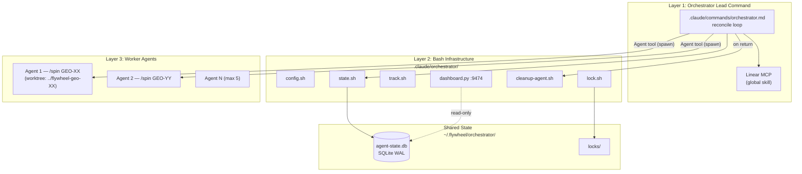
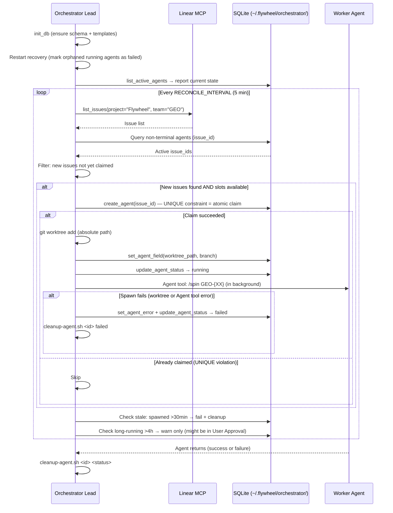

# Plan: Flywheel Orchestrator

**Version**: v1.16.0
**Issue**: GEO-291
**Date**: 2026-03-28
**Source**: `doc/engineer/exploration/new/GEO-291-flywheel-orchestrator.md`, `doc/engineer/research/new/GEO-291-orchestrator-adaptation.md`
**Status**: codex-approved

---

## Overview

将 GeoForge3D 的 orchestrator（bash + SQLite 多 agent 编排系统）适配到 Flywheel repo，使 Flywheel 项目开发支持多 agent 并行。

**Scope**：
- Layer 2（bash infrastructure）：7 个脚本文件 + schema
- Layer 1（orchestrator lead command）：1 个 orchestrator command

**不做的事**：
- 不改 Flywheel 产品代码（Bridge/Lead/Runner）
- 不和 Simba/Discord 集成
- 不做 PM triage
- 不修改 /spin 命令本身
- 不要求 worker 写 track.sh（v1 用 coarse tracking，lead 更新状态）

---

## Architecture



### Shared State 模型

**关键决策**：DB 和 locks 放在 `~/.flywheel/orchestrator/`，不在 repo tree 内。

**原因**：Orchestrator lead 和 worker 各自在不同 worktree 里运行。如果 DB 跟着 `git rev-parse --show-toplevel` 走，每个 worktree 会有自己的 DB，shared control plane 坏掉。

```
~/.flywheel/orchestrator/
├── agent-state.db       (shared SQLite, WAL mode)
├── agent-state.db-shm
├── agent-state.db-wal
└── locks/               (mkdir-based distributed locks)
```

脚本文件仍在 repo 内（`.claude/orchestrator/`），版本控制。运行时数据在 `~/.flywheel/orchestrator/`。

### Worker Tracking 模型 (v1: Coarse)

v1 不要求 worker 调用 track.sh。Orchestrator lead 负责更新状态：

```
Lead creates agent → status: spawned
Lead spawns Agent tool → status: running
Agent tool returns success → Lead calls cleanup → status: completed
Agent tool returns failure → Lead calls cleanup → status: failed
Lead detects stale → status: failed
```

**trade-off**：Dashboard 只显示 agent 级状态（spawned/running/completed/failed），不显示 step 级进度。Step templates 保留在 schema 中供将来 v2 fine-grained tracking 使用。

**将来 v2**：worker 注入 AGENT_ID + track.sh 路径，显式报告 step 进度。需要修改 /spin 或创建 worker wrapper。

### Orchestrator Lead Protocol



### 和 /spin 的关系

Worker agent = Claude Code session 执行 `/spin GEO-XX`。

- /spin 检测到已有 worktree 时复用（Step 0e: "If worktree already exists: enter it"）
- /spin 的交互确认点由 worker agent 自己处理
- /spin 的 User Approval gate 仍需 CEO 审批
- Worker 不需要知道自己被 orchestrator 管理
- Orchestrator 不干预 worker 内部流程，只管 spawn 和 cleanup

### 全局 Skill 依赖

Orchestrator 和 worker 依赖以下**全局 skills**（非 repo-local commands）：

| Skill | 用途 | 是否 repo-local |
|-------|------|----------------|
| `/spin` | Worker 执行完整 pipeline | ✅ repo-local (`.claude/commands/spin.md`) |
| `/brainstorm` | /spin 调用 | ❌ 全局 skill |
| `/research` | /spin 调用 | ❌ 全局 skill |
| `/write-plan` | /spin 调用 | ❌ 全局 skill |
| `/codex-design-review` | /spin 调用 | ❌ 全局 skill |
| `/implement` | /spin 调用 | ❌ 全局 skill |
| `/codex-code-review` | /spin 调用 | ❌ 全局 skill |
| `/ship-pr` | /spin 调用 | ❌ 全局 skill |
| Linear MCP | Orchestrator 查 issue | ❌ MCP server (name varies by environment — startup probe required, see orchestrator.md) |

---

## Public Shell API

### config.sh

**Variables**:

```bash
# Script location → repo root (works from any checkout)
ORCHESTRATOR_DIR="$(cd "$(dirname "${BASH_SOURCE[0]}")" && pwd)"
PROJECT_ROOT="$(cd "$ORCHESTRATOR_DIR/../.." && pwd)"

# Shared state (outside repo tree — shared across worktrees)
SHARED_STATE_DIR="$HOME/.flywheel/orchestrator"
DB_PATH="$SHARED_STATE_DIR/agent-state.db"
LOCK_DIR="$SHARED_STATE_DIR/locks"

# Doc paths (relative to PROJECT_ROOT — main repo checkout)
PLAN_NEW="$PROJECT_ROOT/doc/engineer/plan/new"
PLAN_DRAFT="$PROJECT_ROOT/doc/engineer/plan/draft"
PLAN_INPROGRESS="$PROJECT_ROOT/doc/engineer/plan/inprogress"
PLAN_ARCHIVE="$PROJECT_ROOT/doc/engineer/plan/archive"
EXPLORATION_NEW="$PROJECT_ROOT/doc/engineer/exploration/new"
EXPLORATION_ARCHIVE="$PROJECT_ROOT/doc/engineer/exploration/archive"
RESEARCH_NEW="$PROJECT_ROOT/doc/engineer/research/new"
RESEARCH_ARCHIVE="$PROJECT_ROOT/doc/engineer/research/archive"

# Limits
MAX_CONCURRENT_AGENTS=5
DOCS_LOCK_TIMEOUT=120      # 2 min
RECONCILE_INTERVAL=300      # 5 min

# Dashboard
DASHBOARD_PORT=9474

# Claude
CLAUDE_MODEL="opus"

# Version
VERSION_FILE="$PROJECT_ROOT/doc/VERSION"
```

**Note**: `PROJECT_ROOT` 通过脚本相对路径推导（`.claude/orchestrator/` → `../../`），不依赖 `git rev-parse`。这始终指向包含 `.claude/orchestrator/` 的那个 checkout（通常是 main repo）。DB/locks 在 `~/.flywheel/orchestrator/` — 所有 worktree 共享。

**Functions**:
| Function | Signature | Returns |
|----------|-----------|---------|
| `get_feature_version` | `get_feature_version()` | Version string (e.g. "v1.16.0") |
| `bump_feature_version` | `bump_feature_version <minor\|patch>` | New version string |

### state.sh

**SQL Helpers** (internal):
| Function | Tier | Failure |
|----------|------|---------|
| `sql_escape <string>` | — | N/A |
| `_sql <query>` | 1 | Retries 3x on lock, exits on error |
| `state_critical <fn> [args]` | 2 | Retries 3x, logs error |
| `state_try <fn> [args]` | 3 | Suppresses errors |

**DB Init**:
| Function | Notes |
|----------|-------|
| `init_db` | Creates `~/.flywheel/orchestrator/` dir, DB from schema.sql, WAL mode, seeds templates |
| `init_step_templates` | Seeds 9-step executor template |

**Agent Lifecycle**:
| Function | Signature | Notes |
|----------|-----------|-------|
| `create_agent` | `<id> <domain> <version> <slug> <issue_id> [plan_file] [branch] [worktree_path]` | issue_id must be unique |
| `update_agent_status` | `<agent_id> <new_status>` | Terminal states immutable |
| `set_agent_pr` | `<agent_id> <pr_number>` | |
| `set_agent_error` | `<agent_id> <error_message>` | |
| `set_agent_field` | `<agent_id> <field> <value>` | Whitelist: plan_file, branch, worktree_path only |

**Step Tracking** (for future v2):
| Function | Signature |
|----------|-----------|
| `init_steps` | `<agent_id> <agent_type>` |
| `start_step` | `<agent_id> <step_key> [step_name]` |
| `complete_step` | `<agent_id> <step_key>` |
| `fail_step` | `<agent_id> <step_key> [notes]` |
| `skip_step` | `<agent_id> <step_key> [notes]` |
| `get_current_step` | `<agent_id>` |
| `check_step_completed` | `<agent_id> <step_key>` |

**Artifacts**:
| Function | Signature | Notes |
|----------|-----------|-------|
| `add_artifact` | `<agent_id> <type> <value> [metadata]` | Types: pr, commit, test_result, codex_review, deploy, screenshot, exploration_doc, research_doc, plan_doc, other |
| `get_artifact_value` | `<agent_id> <type>` | Returns value of most recent matching artifact (ORDER BY id DESC) |

**Queries**:
| Function | Returns |
|----------|---------|
| `list_active_agents` | id\|worktree_path\|domain\|version\|status |
| `get_agent_summary <id>` | Agent metadata + current step |
| `get_all_agents_dashboard` | All non-terminal agents |
| `get_agent_history` | Terminal agents with duration |
| `get_agent_steps <id>` | All steps with status |
| `get_agent_artifacts <id>` | All artifacts |

### track.sh

```
track.sh <agent_id> <action> [args...]

Actions:
  start    <step_key> [step_name]   — Mark step in_progress
  complete <step_key>               — Mark step completed
  artifact <type> <value> [meta]    — Record artifact
  status                            — Print steps + artifacts
  gate     <step_key>               — Check prerequisites (exit 0/1)

Gate chain: 1→2→3→4→5→5a→5b→6→7
```

Note: v1 workers 不调用 track.sh。此工具供 orchestrator lead 和将来 v2 worker 使用。

### cleanup-agent.sh

```
cleanup-agent.sh <agent_id> [terminal_status=completed]

Steps:
  1. Query agent info from SQLite (plan_file, branch, worktree_path)
  2. Update status → terminal
  3. Remove worktree (rename → prune → background rm)
  4. Delete branch
  5. Release locks (docs-update, version-bump)
  6. Sound notification
```

Note: v1 不做文档归档 — 文档归档由 /spin 的 Post-Ship step 在 worker 内完成。Cleanup 只负责资源清理。

### lock.sh

```
Sourced API: acquire_lock, release_lock, wait_for_lock, with_lock, lock_holder, lock_age
CLI mode: lock.sh {acquire|release|wait|holder|age} <args>
```

---

## Implementation Steps

### Step 1: 创建目录结构

Repo 内（版本控制）：
```
flywheel/.claude/orchestrator/
├── config.sh
├── state.sh
├── track.sh
├── lock.sh
├── cleanup-agent.sh
├── dashboard.py
└── schema.sql
```

Runtime（自动创建）：
```
~/.flywheel/orchestrator/
├── agent-state.db
└── locks/
```

### Step 2: schema.sql

```sql
-- schema.sql — Flywheel Agent Orchestrator v1

PRAGMA user_version = 1;

CREATE TABLE IF NOT EXISTS agents (
    id TEXT PRIMARY KEY,
    domain TEXT NOT NULL DEFAULT 'executor'
        CHECK(domain IN ('executor')),
    version TEXT NOT NULL,
    slug TEXT NOT NULL,
    issue_id TEXT UNIQUE,
    plan_file TEXT,
    branch TEXT DEFAULT '',
    worktree_path TEXT,
    pr_number INTEGER,
    status TEXT NOT NULL DEFAULT 'spawned'
        CHECK(status IN ('spawned','running','awaiting_approval','shipping','completed','failed','stopped')),
    error_message TEXT,
    spawned_at DATETIME DEFAULT (datetime('now')),
    completed_at DATETIME,
    updated_at DATETIME DEFAULT (datetime('now'))
);

CREATE TABLE IF NOT EXISTS step_templates (
    agent_type TEXT NOT NULL DEFAULT 'executor'
        CHECK(agent_type IN ('executor')),
    step_key TEXT NOT NULL,
    step_name TEXT NOT NULL,
    step_order INTEGER NOT NULL,
    is_aggregate BOOLEAN NOT NULL DEFAULT 0,
    PRIMARY KEY (agent_type, step_key)
);

CREATE TABLE IF NOT EXISTS agent_steps (
    agent_id TEXT NOT NULL REFERENCES agents(id) ON DELETE CASCADE,
    step_key TEXT NOT NULL,
    step_name TEXT NOT NULL,
    step_order INTEGER NOT NULL,
    is_aggregate BOOLEAN NOT NULL DEFAULT 0,
    status TEXT NOT NULL DEFAULT 'pending'
        CHECK(status IN ('pending','in_progress','completed','skipped','failed')),
    started_at DATETIME,
    completed_at DATETIME,
    notes TEXT,
    PRIMARY KEY (agent_id, step_key)
);

CREATE TABLE IF NOT EXISTS artifacts (
    id INTEGER PRIMARY KEY AUTOINCREMENT,
    agent_id TEXT NOT NULL REFERENCES agents(id) ON DELETE CASCADE,
    artifact_type TEXT NOT NULL
        CHECK(artifact_type IN ('pr','commit','test_result','codex_review','deploy','screenshot','exploration_doc','research_doc','plan_doc','other')),
    value TEXT NOT NULL,
    metadata TEXT,
    created_at DATETIME DEFAULT (datetime('now'))
);

CREATE INDEX IF NOT EXISTS idx_agents_status ON agents(status);
CREATE INDEX IF NOT EXISTS idx_agents_issue ON agents(issue_id);
CREATE INDEX IF NOT EXISTS idx_agent_steps_agent ON agent_steps(agent_id, status);
CREATE INDEX IF NOT EXISTS idx_artifacts_agent ON artifacts(agent_id);
```

### Step 3: config.sh

从 GeoForge3D 复制，修改：

1. `PROJECT_ROOT` 通过脚本相对路径推导（`$ORCHESTRATOR_DIR/../..`）
2. `DB_PATH` 和 `LOCK_DIR` 指向 `~/.flywheel/orchestrator/`
3. 删除所有 domain-specific 路径和 `ENV_LEASE_TIMEOUT`
4. 新增 Flywheel doc 路径变量
5. `MAX_CONCURRENT_AGENTS=5`, `DASHBOARD_PORT=9474`
6. `get_feature_version()` 删除 filesystem fallback
7. `init_db()` 确保 `~/.flywheel/orchestrator/` 目录存在

### Step 4: lock.sh

从 GeoForge3D **原样复制**。

### Step 5: state.sh

从 GeoForge3D 复制，修改：

**删除** 6 个函数：
- 3 个 migration 函数
- `insert_plan_step()`, `count_plan_steps()`, `reset_steps_from()`

**修改**：
- `init_db()`: 删迁移逻辑，`mkdir -p "$SHARED_STATE_DIR"` 确保目录存在
- `init_step_templates()`: 只 seed executor 9 步
- `create_agent()`: 参数顺序 `<id> <domain> <version> <slug> <issue_id> [plan_file] [branch] [worktree_path]`

**新增**：
- `set_agent_field()`: 白名单限制可改列（plan_file, branch, worktree_path）

```bash
set_agent_field() {
    local agent_id="$1" field="$2" value="$3"
    case "$field" in
        plan_file|branch|worktree_path) ;;
        *) echo "ERROR: set_agent_field: field '$field' not in whitelist" >&2; return 1 ;;
    esac
    _sql "UPDATE agents SET ${field}='$(sql_escape "$value")', updated_at=datetime('now')
          WHERE id='$(sql_escape "$agent_id")'
            AND status NOT IN ('completed','failed','stopped');"
}
```

- `get_artifact_value()`: ORDER BY id DESC（稳定排序）

```bash
get_artifact_value() {
    local agent_id="$1" type="$2"
    _sql "SELECT value FROM artifacts
          WHERE agent_id='$(sql_escape "$agent_id")' AND artifact_type='$(sql_escape "$type")'
          ORDER BY id DESC LIMIT 1;"
}
```

### Step 6: track.sh

从 GeoForge3D 复制，gate 新增 step 7：
```bash
7) PREV="6" ;;  # Post-Ship requires Ship
```

### Step 7: cleanup-agent.sh

从 GeoForge3D 复制，重写为真实可执行的 bash：

```bash
#!/usr/bin/env bash
set -euo pipefail

SCRIPT_DIR="$(cd "$(dirname "${BASH_SOURCE[0]}")" && pwd)"
source "$SCRIPT_DIR/config.sh"
source "$SCRIPT_DIR/state.sh"

AGENT_ID="${1:?Usage: cleanup-agent.sh <agent_id> [terminal_status]}"
TERMINAL_STATUS="${2:-completed}"

# 1. Update status (terminal states are immutable — safe to call multiple times)
state_critical update_agent_status "$AGENT_ID" "$TERMINAL_STATUS"

# 2. Get agent info from DB
agent_info=$(_sql "SELECT branch, worktree_path FROM agents WHERE id='$(sql_escape "$AGENT_ID")';")
agent_branch=$(echo "$agent_info" | cut -d'|' -f1)
agent_worktree=$(echo "$agent_info" | cut -d'|' -f2)

# 3. Remove worktree (macOS-safe: rename → prune → background rm)
if [ -n "$agent_worktree" ]; then
    if [ -d "$agent_worktree" ]; then
        tmp_path="${agent_worktree}.removing.$$"
        if mv "$agent_worktree" "$tmp_path" 2>/dev/null; then
            git -C "$PROJECT_ROOT" worktree prune 2>/dev/null || true
            rm -rf "$tmp_path" &
        else
            echo "WARNING: Could not rename worktree $agent_worktree for removal" >&2
        fi
    else
        # Worktree directory already gone — just prune stale references
        git -C "$PROJECT_ROOT" worktree prune 2>/dev/null || true
    fi
fi

# 4. Delete branch (only suppress "not found" errors)
if [ -n "$agent_branch" ]; then
    delete_output=$(git -C "$PROJECT_ROOT" branch -D "$agent_branch" 2>&1) || {
        if echo "$delete_output" | grep -q "not found"; then
            : # Branch already deleted (by PR merge or manual cleanup) — idempotent
        else
            echo "WARNING: git branch -D $agent_branch failed: $delete_output" >&2
        fi
    }
fi

# 5. Release any locks held by this agent
for lock_name in docs-update version-bump; do
    held_by=$(lock_holder "$lock_name")
    if [ "$held_by" = "$AGENT_ID" ]; then
        release_lock "$lock_name"
    fi
done

# 6. Sound notification
afplay /System/Library/Sounds/Funk.aiff &>/dev/null &
```

**关键设计**：
- v1 不做文档归档 — /spin 的 Post-Ship step 在 worker worktree 内完成归档
- `git -C "$PROJECT_ROOT"` 确保 git 操作在正确的 repo 上
- 只对 worktree rename 失败发 WARNING，不中断清理流程
- branch 删除失败静默（可能已被 PR merge 删除）

### Step 8: dashboard.py

从 GeoForge3D 复制，修改：
1. 端口: 9474
2. 标题: "Flywheel Orchestrator"
3. DB_PATH 默认: `~/.flywheel/orchestrator/agent-state.db`
4. Overview 中 domain 列改为 issue_id 列

### Step 9: orchestrator.md（Lead Command）

新建 `.claude/commands/orchestrator.md`：

```markdown
# Orchestrator — Multi-Agent Development Manager

Manages parallel agent execution for Flywheel development.

## Startup
1. source .claude/orchestrator/state.sh && init_db
2. **Linear MCP probe**: Try calling the Linear list_issues tool. The MCP namespace varies by environment. If the tool is not available, report error and exit. Cache the working tool handle for this session.
3. **Restart recovery**: Query agents in running/spawned state. Mark all as failed ("lead session restarted"). Run cleanup for each.
4. list_active_agents → report current state
5. Start dashboard: python3 .claude/orchestrator/dashboard.py &

## Reconcile Loop (every 5 min)

### Discover Issues
- Linear list_issues (namespace resolved at startup)(project="Flywheel", team="GEO")
- Exclude: status = Done/Cancelled
- Exclude: issue_id already in agents table (non-terminal)

### Check Capacity
- Count non-terminal agents
- If >= MAX_CONCURRENT_AGENTS (5): skip spawning, report "at capacity"

### Claim & Spawn (for each new issue, up to available slots)
1. create_agent(id, "executor", version, slug, issue_id)
   - If UNIQUE violation: skip (already claimed)
2. Compute absolute worktree path: `$(cd "$PROJECT_ROOT/.." && pwd)/flywheel-geo-{XX}`
3. git worktree add <absolute_path> -b feat/GEO-{XX}-{slug}
   - If fails: set_agent_error + update_agent_status failed + cleanup → skip
4. set_agent_field(id, "worktree_path", "<absolute_path>")
5. set_agent_field(id, "branch", "feat/GEO-{XX}-{slug}")
6. update_agent_status(id, "running")
7. Spawn worker: Agent tool (run_in_background=true) with prompt "/spin GEO-{XX}"
   - If Agent tool spawn fails: set_agent_error + cleanup-agent.sh <id> failed

### Health Check
- spawned >30 min without running → fail + cleanup (spawn likely failed)
- running >4h → warn only (might be in User Approval gate)

### Handle Completions
- When background Agent returns:
  - Success → cleanup-agent.sh <id> completed
  - Failure → set_agent_error + cleanup-agent.sh <id> failed

## Interactive Commands
- "status" → list_active_agents + get_agent_history
- "stop <id>" → update_agent_status failed + cleanup-agent.sh
- "stop all" → stop all non-terminal agents
- "dashboard" → open http://localhost:9474 in browser

## Restart Recovery
Agent tool background workers cannot be reattached after lead session restart. On restart:
- ALL agents in "running" or "spawned" state → mark as **failed** with error "lead session restarted, agent unrecoverable"
- Run cleanup-agent.sh for each (removes worktrees, releases locks)
- Report which agents were terminated and their issue_ids
- User can manually re-queue by running `/orchestrator` again (issues will be re-discovered from Linear)

This is an explicit design choice: we accept that lead restart = all in-flight work is lost. The alternative (persisting reattachable handles) adds significant complexity for a rare scenario. The cost is re-running /spin from scratch for affected issues.
```

### Step 10: .gitignore

```
# Orchestrator scripts are tracked; runtime data is in ~/.flywheel/
# No .gitignore entries needed for orchestrator
```

Note: DB 和 locks 在 `~/.flywheel/orchestrator/`（不在 repo 内），所以不需要 .gitignore 条目。

### Step 11: 验证测试

#### 11a. Smoke Test（脚本级）

```bash
cd /path/to/flywheel
source .claude/orchestrator/state.sh && init_db

# Verify shared state location
ls ~/.flywheel/orchestrator/agent-state.db
# → exists

# Schema
sqlite3 "$DB_PATH" ".tables"
# → agents  agent_steps  artifacts  step_templates

sqlite3 "$DB_PATH" "SELECT count(*) FROM step_templates WHERE agent_type='executor';"
# → 9

# Agent lifecycle
create_agent "test-1" "executor" "v1.16.0" "test-slug" "GEO-999"
set_agent_field "test-1" "plan_file" "v1.16.0-GEO-999-test.md"
set_agent_field "test-1" "branch" "feat/GEO-999-test"
sqlite3 "$DB_PATH" "SELECT issue_id, plan_file, branch FROM agents WHERE id='test-1';"
# → GEO-999|v1.16.0-GEO-999-test.md|feat/GEO-999-test

# Whitelist enforcement
set_agent_field "test-1" "status" "completed" 2>&1 | grep "not in whitelist"
# → ERROR message
```

#### 11b. Duplicate Claim

```bash
create_agent "test-2" "executor" "v1.16.0" "slug-a" "GEO-888"
create_agent "test-3" "executor" "v1.16.0" "slug-b" "GEO-888" 2>&1
# → ERROR (UNIQUE constraint on issue_id)

sqlite3 "$DB_PATH" "SELECT count(*) FROM agents WHERE issue_id='GEO-888';"
# → 1
```

#### 11c. Lock

```bash
source .claude/orchestrator/lock.sh
acquire_lock "test-lock" "agent-1" && echo "acquired" || echo "blocked"
# → acquired
acquire_lock "test-lock" "agent-2" && echo "acquired" || echo "blocked"
# → blocked
release_lock "test-lock"
```

#### 11d. Cleanup Idempotency

```bash
update_agent_status "test-1" "completed"
./.claude/orchestrator/cleanup-agent.sh test-1 completed
./.claude/orchestrator/cleanup-agent.sh test-1 completed
# → No error on second run (terminal state immutable, worktree already gone)
```

#### 11e. Dashboard

```bash
python3 .claude/orchestrator/dashboard.py &
PID=$!; sleep 1
curl -s http://localhost:9474/ | grep -o "Flywheel Orchestrator"
# → Flywheel Orchestrator
kill $PID
```

#### 11f. /spin as Background Worker (E2E Validation)

This test validates the core assumption: a background Agent tool can drive /spin through its confirmation points.

```bash
# From main repo, spawn a background Agent with /spin on a test issue
# The agent should:
# 1. Detect pipeline stage
# 2. Auto-respond to "Proceed?" (not block)
# 3. Complete or reach User Approval gate

# Test: spawn agent with a known simple issue, verify it progresses past stage detection
# If it blocks at "Proceed?" → the /spin-as-worker model is invalid, need headless mode
# If it progresses → model validated for v1
```

This is a **pass/fail gate** for the orchestrator design. If the background Agent cannot drive /spin past confirmation points, the plan must be revised to either add a `--orchestrated` flag to /spin or create a dedicated worker command.

#### 11g. Cross-Worktree Shared DB

```bash
# From main repo
source /path/to/flywheel/.claude/orchestrator/state.sh && init_db
create_agent "cross-1" "executor" "v1.16.0" "cross-test" "GEO-777"

# From a different worktree (if exists)
source /path/to/flywheel-geo-291/.claude/orchestrator/state.sh
sqlite3 "$DB_PATH" "SELECT id FROM agents WHERE issue_id='GEO-777';"
# → cross-1 (same DB accessed from both checkouts)
```

---

## File Summary

| File | Action | Lines (est.) | Effort |
|------|--------|-------------|--------|
| schema.sql | 新建 | ~60 | 小 |
| config.sh | 复制 + 改路径 + shared state | ~90 | 小 |
| lock.sh | 原样复制 | ~85 | 无 |
| state.sh | 复制 + 删 6 + 改 3 + 新增 2 | ~380 | 中 |
| track.sh | 复制 + gate 加 step 7 | ~50 | 小 |
| cleanup-agent.sh | 重写（简化 + macOS-safe） | ~50 | 中 |
| dashboard.py | 复制 + 换端口/标题/issue_id | ~200 | 小 |
| orchestrator.md | 新建（lead command） | ~100 | 中 |

**总计**：~1015 行（8 个文件）

---

## Risk Mitigation

| 风险 | 缓解 |
|------|------|
| state.sh 精简误删 | Public Shell API + smoke test 覆盖 |
| 同一 issue 重复 spawn | issue_id UNIQUE + test 11b |
| Worktree 残留 | rename → prune → rm（macOS-safe）+ cleanup 幂等 |
| Worker 卡在 User Approval | Health check warn（不 auto-fail） |
| Lead 重启丢失 running agent | Restart recovery 检查 worktree 存在性 |
| 跨 worktree DB 分裂 | `~/.flywheel/orchestrator/` shared state + test 11f |
| set_agent_field SQL 注入 | 白名单限制可改列 |

---

## Success Criteria

1. `init_db` 创建 `~/.flywheel/orchestrator/agent-state.db` + seed 9 步 template
2. `create_agent` 带 issue_id UNIQUE 防重复
3. `set_agent_field` 白名单只允许 plan_file/branch/worktree_path
4. `get_artifact_value` 按 id DESC 稳定排序
5. `cleanup-agent.sh` 幂等 + macOS-safe + 从任意 checkout 运行
6. `dashboard.py` 在 :9474 显示
7. **Background Agent can drive /spin past confirmation points** (test 11f — pass/fail gate)
8. 跨 worktree 共享同一 DB（test 11g）
9. Linear MCP startup probe detects correct namespace
10. orchestrator.md 定义完整的 lead protocol (including restart recovery)

---

## Codex Design Review History

### Round 1 → Round 2 Changes
| # | Issue | Resolution |
|---|-------|------------|
| 1 | /spin 交互式 | Clarified: worker 是 Claude Code session，支持交互 |
| 2 | 缺 lead protocol | Added: orchestrator.md command |
| 3 | PROJECT_ROOT 硬编码 | Fixed: 脚本相对路径推导 |
| 4 | 缺原子 claim | Fixed: issue_id UNIQUE |
| 5 | plan_file 不闭环 | Fixed: set_agent_field + get_artifact_value |
| 6 | Worktree cleanup 弱 | Fixed: rename → prune → rm |
| 7 | create_agent 签名不一致 | Fixed: Public Shell API 统一 |
| 8 | 验证太浅 | Fixed: 新增 11b, 11e |

### Round 2 → Round 3 Changes
| # | Issue | Resolution |
|---|-------|------------|
| 1 | DB 在多 worktree 下分裂 | Fixed: DB/locks 移到 `~/.flywheel/orchestrator/` |
| 2 | Worker 不写 track.sh = 无进度 | Accepted: v1 coarse tracking（lead 更新），v2 加 fine-grained |
| 3 | MCP 名称错误 + 命令依赖不清 | Fixed: 明确全局 skill vs repo-local，MCP namespace 通过 startup probe 动态解析 |
| 4 | cleanup-agent.sh 不可执行 | Fixed: 重写为真实 bash，去掉顶层 `local`，用 `git -C` |
| 5 | set_agent_field 无白名单 | Fixed: case 白名单 + get_artifact_value ORDER BY id DESC |

### Round 3 → Round 4 Changes
| # | Issue | Resolution |
|---|-------|------------|
| 1 | /spin 是交互式的 | **Disagree**: Agent tool spawns a Claude Code session that handles /spin's "Proceed?" naturally. LLM agents don't block on confirmation prompts — they respond. This is the same model as GeoForge3D executors. |
| 2 | Restart recovery 假设 tmux | **Fixed**: Lead restart = all running agents marked failed + cleanup. Explicit design choice: restart kills in-flight work, issues re-discovered from Linear on next run. |
| 3 | worktree_path 存相对路径 | **Fixed**: Claim & spawn 时计算绝对路径存入 DB。cleanup/recovery 直接使用绝对路径。 |
| 4 | Linear MCP 名字错 | **Resolved**: MCP namespace 不再硬编码，改为 startup probe 动态解析。环境差异不再是问题。 |
| 5 | cleanup 错误处理太宽 | **Partially fixed**: Branch 删除区分 "not found"（幂等容错）vs 其他错误（WARNING）。Worktree 不存在时只 prune。其余 git 错误保留信号。 |

### Round 4 → Round 5 Changes
| # | Issue | Resolution |
|---|-------|------------|
| 1 | /spin 作为 worker 未被证明 | **Accepted compromise**: 新增 test 11f 作为 pass/fail gate。如果 background Agent 无法驱动 /spin 过确认点，plan 必须修改。这是验证而非假设。 |
| 2 | Linear MCP 名字不对 | **Fixed**: orchestrator.md startup 加 MCP probe，不硬编码 namespace。自动检测可用的 Linear MCP tool。 |
