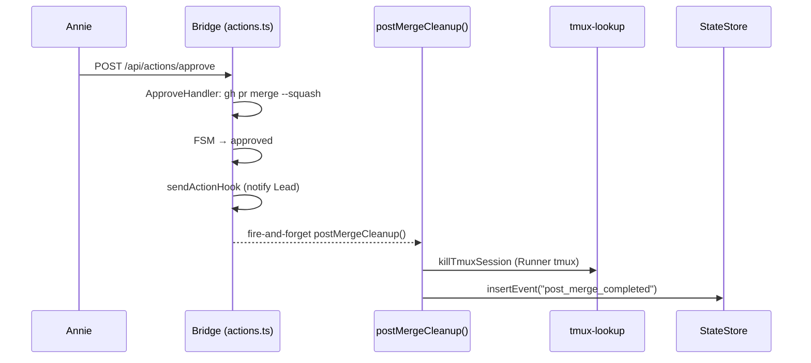

# Plan: Sprint 收尾流程 — Post-Merge tmux Cleanup (Revised)

**Version**: v1.17.0
**Issue**: GEO-280
**Date**: 2026-03-29 (revised per Annie's feedback + Codex R1)
**Source**: `doc/engineer/exploration/new/GEO-280-sprint-closing.md`, `doc/engineer/research/new/GEO-280-post-merge-runner.md`
**Status**: codex-approved

## 背景

PR merge (approve action) 后自动关闭 Runner tmux session。这是 Runner 唯一无法自己做的清理任务（Runner 跑在 tmux 里，不能 kill 自己的 session）。

其他清理任务（worktree、doc archive、MEMORY.md）由 Runner/Orchestrator 负责：
- `/spin` Archive 阶段 (`.claude/commands/spin.md` line 154-189)
- `cleanup-agent.sh` (`.claude/orchestrator/cleanup-agent.sh`)

**注意**: `/spin` 和 `cleanup-agent.sh` 是手动触发的工作流，不由 Bridge approve 自动触发。自动触发 Runner/Orchestrator 清理是未来工作，不在 GEO-280 scope 内。

## 当前状态（已存在的代码）

GEO-280 Phase 1 已部分实现。以下代码**已存在于分支上**：

| 组件 | 状态 | 位置 |
|------|------|------|
| `postMergeCleanup()` 函数 | ✅ 已存在 | `packages/teamlead/src/bridge/post-merge.ts` |
| `onApproved` callback in `approveExecution()` | ✅ 已存在 | `packages/teamlead/src/bridge/actions.ts:292` |
| `onApproved` threading in `createActionRouter()` | ✅ 已存在 | `packages/teamlead/src/bridge/actions.ts:737` |
| `onApproved` injection in `plugin.ts` | ✅ 已存在 | `packages/teamlead/src/bridge/plugin.ts:262` |
| `WorktreeRemoveFn` type + wiring | ✅ 已存在 (需移除) | `post-merge.ts`, `plugin.ts`, `startBridge()` |
| `post-merge.test.ts` (11 tests) | ✅ 已存在 (需瘦身) | `packages/teamlead/src/__tests__/post-merge.test.ts` |
| `actions.test.ts` onApproved tests (4 tests) | ✅ 已存在 | `packages/teamlead/src/__tests__/actions.test.ts` |

## 本次变更 = 移除 worktree 清理 + 简化

这是一个**瘦身 migration**，不是从头构建。

## Architecture (修订后)



## 职责划分

| 任务 | 负责方 | 触发方式 |
|------|--------|----------|
| 关闭 Runner tmux session | **Bridge** (GEO-280) | approve 后 fire-and-forget 自动触发 |
| 审计事件 | **Bridge** (GEO-280) | approve 后自动 |
| worktree 清理 | Runner/Orchestrator | 手动 (`/spin` Archive / `cleanup-agent.sh`) |
| doc archive | Runner/Orchestrator | 手动 (`/spin` Archive) |
| MEMORY.md 更新 | Runner/Orchestrator | 手动 (`/spin` Archive) |

## 实现步骤 — 具体 diff

### Step 1: 修改 `post-merge.ts` — 移除 worktree 清理

**移除：**
- `WorktreeRemoveFn` type export
- `worktreeRemoveFn` parameter from `postMergeCleanup()`
- Step 2 worktree removal block (try/catch around `worktreeRemoveFn`)
- `worktreeRemoved` field from `PostMergeResult`
- `projectRoot` field from `PostMergeOpts` (only consumer was worktreeRemoveFn)
- `issueIdentifier` field from `PostMergeOpts` (never referenced in function body)
- `ProjectLock` import + instance + acquire/release — tmux kill-session 是幂等操作，不需要串行化锁
- `_postMergeLock` export

**保留：**
- `PostMergeOpts` interface (executionId, issueId, projectName)
- tmux close logic (`getTmuxTargetFromCommDb` + `killTmuxSession`)
- Audit event (`insertEvent`)

**修改后签名：**
```typescript
export interface PostMergeOpts {
  executionId: string;
  issueId: string;
  projectName: string;
}

export interface PostMergeResult {
  tmuxClosed: boolean;
  errors: string[];
}

export async function postMergeCleanup(
  opts: PostMergeOpts,
  store: StateStore,
): Promise<PostMergeResult>
```

### Step 2: 修改 `plugin.ts` — 移除 WorktreeRemoveFn wiring

**移除：**
- `WorktreeRemoveFn` import from `post-merge.js`
- `worktreeRemoveFn` parameter from `createBridgeApp()`
- `worktreeRemoveFn` parameter from `startBridge()` opts
- `worktreeRemoveFn` pass-through in `onApproved` callback → `postMergeCleanup()`
- `projects.find(...)` gating in `onApproved` (no longer needed without `projectRoot`)

**保留：**
- `postMergeCleanup` import and call
- `onApproved` callback construction and injection

**简化 `onApproved` callback**:
```typescript
const onApproved = (executionId: string, session: { issue_id: string; project_name: string }) => {
  postMergeCleanup(
    { executionId, issueId: session.issue_id, projectName: session.project_name },
    store,
  ).catch((err) => { ... });
};
```

### Step 3: 修改 `scripts/run-bridge.ts` — 移除 WorktreeManager wiring

**必改** — `run-bridge.ts` 是 Bridge daemon 的入口脚本。当前代码：
- Line 19: `import { WorktreeManager } from "../packages/edge-worker/dist/WorktreeManager.js";`
- Line 73-75: `const worktreeManager = new WorktreeManager(); const worktreeRemoveFn = ...`
- Line 84: `worktreeRemoveFn` passed to `startBridge()`

**移除：**
- `WorktreeManager` import (line 19)
- `worktreeManager` instance + `worktreeRemoveFn` binding (lines 73-75, Phase 5 comment block)
- `worktreeRemoveFn` from `startBridge()` opts (line 84)

**注意**: `run-bridge.ts` imports from `dist/` 目录。代码变更后需要 build 才能在运行时生效。

### Step 4: 更新测试 `post-merge.test.ts`

**移除测试：**
- "calls worktreeRemoveFn when provided" (tests worktree removal)
- "skips worktree when worktreeRemoveFn not provided" (tests skip)
- "captures worktree error without throwing" (tests worktree error handling)
- "tmux error does not block worktree cleanup" (tests error isolation between steps)
- "serializes concurrent cleanups for same project" (tests ProjectLock — no longer needed)

**保留测试：**
- "closes tmux when CommDB has target"
- "skips tmux when no CommDB target"
- "captures tmux kill error without throwing"
- "captures tmux lookup exception without throwing"
- "records post_merge_completed audit event on success"
- "records post_merge_partial audit event on partial failure"

**更新：** Remove `WorktreeRemoveFn` import. Update result assertions to not check `worktreeRemoved`.

### Step 5: 更新测试 `actions.test.ts`

**保留所有 4 个 onApproved 测试** (they test callback invocation, not worktree):
- "approve calls onApproved" — callback invoked
- "no onApproved on merge failure" — not called
- "no onApproved on FSM rejection" — not called
- "onApproved error doesn't affect approve" — approve succeeds

### Step 6: 更新文档注释

Update any comments that say "Phase 1: tmux close + worktree" → "tmux close + audit".

### Step 7: 验证

```bash
# Package-level tests + build
pnpm --filter flywheel-teamlead test
pnpm --filter flywheel-teamlead build

# Daemon entry point static typecheck — run-bridge.ts imports from dist/,
# must verify post-build that it matches freshly built declarations.
# (run-bridge.ts is outside packages/teamlead/tsconfig.json, so package
# typecheck does NOT cover it. tsx is a runtime tool, not tsc.)
pnpm --filter flywheel-teamlead exec tsc --noEmit \
  --module NodeNext --moduleResolution NodeNext \
  --target ES2022 --lib ES2022 --types node \
  --strict --esModuleInterop --allowSyntheticDefaultImports \
  --skipLibCheck ../../scripts/run-bridge.ts

# Full test suite
pnpm -r test
```

**关键**：`scripts/run-bridge.ts` 从 `packages/teamlead/dist/` 导入 `startBridge`。如果修改了 `startBridge` 的签名但没有同步更新 `run-bridge.ts`，只有显式 `tsc --noEmit` 能捕获这类 src/dist 接口漂移。`tsx` 是 esbuild 运行器，会跳过类型检查；而且 `run-bridge.ts` 模块尾部直接调用 `main()`，import 它会启动真实 daemon。

## 文件变更清单

| 文件 | 操作 | 描述 |
|------|------|------|
| `packages/teamlead/src/bridge/post-merge.ts` | **修改** | 移除 WorktreeRemoveFn + ProjectLock + worktreeRemoved |
| `packages/teamlead/src/bridge/plugin.ts` | **修改** | 移除 worktreeRemoveFn param + wiring |
| `packages/teamlead/src/__tests__/post-merge.test.ts` | **修改** | 移除 5 个 worktree/lock 测试，更新 result 断言 |
| `packages/teamlead/src/__tests__/actions.test.ts` | **不变** | 4 个 onApproved 测试不涉及 worktree |
| `scripts/run-bridge.ts` | **修改** | 移除 WorktreeManager import + 实例 + worktreeRemoveFn |

## 不做的事

1. 不改 FSM — approved 仍是终态
2. 不做 worktree 清理 — Runner/Orchestrator 职责
3. 不做 doc archive — Runner/Orchestrator 职责
4. 不更新 MEMORY/CLAUDE/Linear — Runner/Orchestrator 职责
5. 不新增 Bridge 端点
6. 不 block approve
7. 不改 EventFilter
8. 不自动触发 Runner/Orchestrator 清理（未来工作）

## 风险

| 风险 | 概率 | 缓解 |
|------|------|------|
| tmux already dead | 低 | killTmuxSession handles gracefully |
| No CommDB record | 低 | returns undefined, skip |
| Callback throws | 低 | Promise isolation in actions.ts |

## Review History

- **R1 (Codex)**: Plan was stale (code already exists); missing removal list; ProjectLock unnecessary for tmux-only; no Runner trigger. Accepted all. Rewrote as delta migration plan, added explicit removal checklist, dropped ProjectLock, acknowledged trigger gap as future work.
- **R2 (Codex)**: Dead `projectRoot`/`issueIdentifier` params; `run-bridge.ts` is must-change not optional; missing build/verify step. Accepted all. Removed dead params from PostMergeOpts, made run-bridge.ts an explicit step with removal list, added Step 7 verification.
- **R3 (Codex)**: Step 7 doesn't verify daemon entry point (`scripts/run-bridge.ts` imports from `dist/`, not covered by package typecheck). Accepted. Added `tsx --eval` import check.
- **R4 (Codex)**: `tsx` is runtime (esbuild), not static typecheck; `run-bridge.ts` runs `main()` on import so `tsx --eval` would start daemon. Accepted. Replaced with explicit `tsc --noEmit` for `scripts/run-bridge.ts` post-build.
