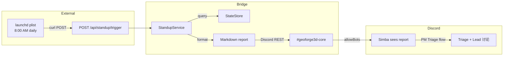

# Plan: Daily Standup v2 — System Status Report + Cron Trigger

**Version**: v1.17.0
**Issue**: GEO-288
**Date**: 2026-03-29
**Source**: `doc/engineer/exploration/new/GEO-288-daily-standup.md`, `doc/engineer/research/new/GEO-288-daily-standup.md`
**Status**: codex-approved (Round 5, override — Codex requested implementation, not design changes)
**Review**: 5 rounds. R1: 7 issues fixed. R2: 2 fixed. R3: 3 fixed. R4: 1 fixed. R5: override (plan vs code confusion)

## Overview

精简版 Daily Standup：Bridge API 端点生成 System Status + Completions(24h) 报告，发到 Discord #geoforge3d-core，触发 Simba 已有的 PM Triage 流程。调度通过外部 cron（macOS launchd），不在 Bridge 内部轮询。

**与 v1 的区别**：删除 StandupScheduler（setInterval）、删除 Linear backlog 查询、删除 Blockers 段。这些都由 PM Triage (GEO-276) 已有功能覆盖。

## Architecture



## Key Design Decisions

### 1. 外部 Cron 替代内部 Scheduler

**选择**: macOS launchd plist
**理由**: Bridge 是无状态 HTTP 服务，不应持有调度状态。launchd 精确到分钟、macOS 原生支持。
**Catch-up 语义**: Best-effort 每日 8:00 AM 触发。`StartCalendarInterval` 在系统从 sleep 唤醒时会补执行一次最近错过的调度。不保证 missed-run 100% catch-up，但对 standup 场景足够——晚发一次日报是可接受的。**不使用 `RunAtLoad`**（避免每次 load/reboot 时重复发送）。
**替代方案**: Claude Code `/schedule` (Remote Trigger) — 功能更强但需要 Claude API 调用，对简单 curl 调用过于 heavy。

### 2. 不重复 PM Triage 的 Linear 查询

**选择**: 报告只包含 System Status + Completions。Backlog 和 Blockers 由 Simba 的 triage 流程处理。
**理由**: Simba 已有完整 triage 能力（查 Linear、ICE 打分、生成报告、Lead 讨论、Annie 确认、分配）。重复实现是浪费。

### 3. Bot Token 策略 — 用非 Simba 的 token 发消息

**选择**: `STANDUP_LEAD_ID` 默认选第一个非 cos-lead（通常是 product-lead/Peter）
**理由**:
- Simba 的 Discord plugin 不会收到自己发的消息（不在自己的 allowBots 里）
- 用 Peter 的 token 发 → Peter 的 bot ID 在 Simba 的 allowBots 里 → Simba 能看到
- 报告末尾 @mention Simba → 触发 Simba 的 core channel 路由规则（"被叫名字 → 回复"）

### 4. Triage 触发机制

报告末尾追加：`<@1487339075563290745> 系统日报已发，请执行今日 triage`

Simba 在 #geoforge3d-core 看到带自己名字的消息 → 按 agent.md 定义的 triage 流程执行（查 Linear、查 sessions、生成 triage 报告、@Peter @Oliver 讨论）。

### 5. Report 只含 System Status + Completions

报告日期使用 **Pacific Time** (`America/Los_Angeles`)，与 Simba agent.md 的用户可见时间约定一致。避免 UTC 日期在 PT 晚间/凌晨显示"明天"的日期。

报告**强制为单条 Discord 消息**（≤ `MAX_DISCORD_MESSAGE_LENGTH` = 1900 字符，与 `discord-utils.ts:6` 对齐）。`formatStandupReport()` 实现以下保证：
- System Status 段固定 4 行（~150 chars）
- Completions 段最多显示 **10 条**，超出用 `…and N more` 截断
- `simbaMention` 固定追加在末尾
- formatter 输出后 **preflight 检查**: `if (result.length > MAX_DISCORD_MESSAGE_LENGTH)` → warn + 进一步截断 completions 直到 fit
- `deliver()` 在发送前断言 `splitDiscordMessage(markdown).length === 1`，多于 1 chunk 则 throw 而不发送
- `deliver()` 改为**任一 chunk 失败 → 整体失败**（而非"至少一个成功就算成功"）
- 测试: 补 1901-char 回归测试，证明不会进入分片发送

```
## ☀️ Good Morning — 2026-03-29
**Project**: GeoForge3D

### System Status
- Running Runners: **1**/3
- Awaiting Review: **2**
- Stuck: **0**
- Stale (completed/failed >24h): **1**

### Completions (24h) — 3
- **GEO-288** — Daily Standup [completed] (product-lead)
- **GEO-302** — CI lint fix [completed]
- **GEO-285** — Context Window [approved] (ops-lead)

<@1487339075563290745> 系统日报已发，请执行今日 triage
```

简洁、聚焦系统健康度。`oldCompletedFailedBlockedCount`（stale sessions）保留——这是 system health 的有用信号。Backlog 分析交给 Simba。

## Implementation Steps

### Step 1: 精简 standup-service.ts

**保留**:
- `StandupReport` type（删除 `blockers` 和 `backlogIssues` 字段，保留 `systemStatus.oldCompletedFailedBlockedCount`）
- `aggregateStandup()` — 只查 system status + completions。删除 `linearQuerier` 和 `linearProjectName` 参数
- `formatStandupReport()` — 精简格式（System Status + Completions + triage 触发行）
- `StandupService` class — aggregate + deliver + run/runDryRun
- `splitDiscordMessage()` — 已移至 discord-utils.ts

**删除**:
- `StandupScheduler` class — 整个删掉（含 `StandupConfig` type）
- `LinearQuerier` interface + `LinearClientQuerier` class — PM Triage 负责
- `blockers` 聚合逻辑（issue 去重、Linear query、blockersFromLinear/blockersFromSessions）
- `backlogIssues` 聚合逻辑

**修改**:
- `simbaMention` 参数 — 可配置的 @mention 字符串，附加在 `formatStandupReport()` 输出末尾
- 移除 `StandupService` constructor 中的 `linearQuerier`、`linearProjectName` 参数
- 报告日期改用 Pacific Time：`new Intl.DateTimeFormat('en-CA', { timeZone: 'America/Los_Angeles' }).format(new Date())` 替代 `new Date().toISOString().slice(0, 10)`（`en-CA` locale 产生 YYYY-MM-DD 格式）
- `resolveOwner()` helper 保留
- `formatStandupReport()` 添加硬预算：completions 最多 10 条（超出用 `…and N more`），输出 preflight 检查 `> MAX_DISCORD_MESSAGE_LENGTH (1900)` → 进一步截断
- `deliver()` 发送前断言 `splitDiscordMessage(markdown).length === 1`（多 chunk 则 throw 不发送）
- `deliver()` 语义改为 **all-or-nothing**：任一 chunk 失败 → throw（当前实现是"至少一个成功"就返回 200）

### Step 2: 精简 standup-route.ts

**保留**:
- `POST /api/standup/trigger` — `dryRun`（可选）

**修改**:
- project 解析改为使用 `standupProjectName`（从 `STANDUP_PROJECT_NAME` 或 `projects[0].projectName` 获取）
- route 函数签名: `createStandupRoute(service, standupProjectName)` — 不再接收 `scheduler` 和 `projects` 数组
- `projectName` request body 参数**忽略**（始终用预配置的 `standupProjectName`）

**删除**:
- `markDelivered` request body 参数
- `scheduler` 函数参数
- `scheduler.markDelivered()` 调用
- multi-project guard 逻辑（由 plugin.ts 在启动时处理）

**Multi-project 策略**: GEO-288 **只支持 single standup project**。新增 `STANDUP_PROJECT_NAME` 环境变量：
- **Single-project**: 默认 `projects[0].projectName`，无需手动配置
- **Multi-project**: 必填。未设 → **跳过 standup route 注册**（warn log，standup 端点不可用，外部调用得到 404）
- **启动校验**: `standupProjectName` 必须命中 `projects` 数组中某个 `ProjectEntry.projectName`。不匹配 → 跳过注册 + warn（与未配置行为一致）
- route 忽略 request body 中的 `projectName`，始终使用预配置的 `standupProjectName`
- `STANDUP_CHANNEL`/`STANDUP_LEAD_ID`/`STANDUP_SIMBA_MENTION` 全局配置，固定服务于 `standupProjectName` 指定的项目
- Per-project channel/sender/mention 配置属于 multi-project standup，列入 Out of Scope

### Step 3: 精简 plugin.ts 集成

**保留**:
- 读 `STANDUP_CHANNEL` 和 `STANDUP_LEAD_ID` 环境变量
- 创建 `StandupService`
- 挂载 standup route

**删除**:
- `STANDUP_ENABLED`、`STANDUP_HOUR`、`STANDUP_CHECK_INTERVAL_MS`、`STANDUP_LINEAR_PROJECT` 环境变量读取
- `StandupScheduler` 创建/start/stop
- 多项目 guard（scheduler 专用）
- `LinearClientQuerier` 创建
- `createBridgeApp()` 函数签名中的 `standupScheduler?: StandupScheduler` 参数（第 221 行）
- `BridgeApp.standupScheduler` 属性及 `stop()` 中的 `scheduler.stop()` 调用

**新增**:
- `STANDUP_SIMBA_MENTION` 环境变量（默认 `<@1487339075563290745>`）
- `STANDUP_PROJECT_NAME` 环境变量解析逻辑:
  1. single-project → 默认 `projects[0].projectName`
  2. multi-project + 未设 → warn + 跳过 standup（不注册 route、不创建 service）
  3. 值不匹配任何 `ProjectEntry.projectName` → warn + 跳过 standup
  4. 匹配成功 → 创建 StandupService + 注册 route，传入 `standupProjectName`

### Step 4: 新增 cron 脚本

**`scripts/daily-standup.sh`**:
```bash
#!/usr/bin/env bash
# Daily Standup — called by launchd at 8:00 AM Pacific
set -euo pipefail

# Source environment (TEAMLEAD_API_TOKEN, STANDUP_CHANNEL, etc.)
# Same pattern as claude-lead.sh
ENV_FILE="${HOME}/.flywheel/.env"
if [ -f "$ENV_FILE" ]; then
  # shellcheck disable=SC1090
  source "$ENV_FILE"
fi

BRIDGE_URL="${BRIDGE_URL:-http://localhost:9876}"

# Build curl args — avoid shell quoting issues with auth header
CURL_ARGS=(-sf -X POST "$BRIDGE_URL/api/standup/trigger" -H "Content-Type: application/json" -d '{}')
if [ -n "${TEAMLEAD_API_TOKEN:-}" ]; then
  CURL_ARGS+=(-H "Authorization: Bearer $TEAMLEAD_API_TOKEN")
fi

curl "${CURL_ARGS[@]}" \
  || { code=$?; echo "[daily-standup] Bridge API call failed (exit $code)" >&2; exit $code; }
```

**`scripts/com.flywheel.daily-standup.plist`**:
```xml
<?xml version="1.0" encoding="UTF-8"?>
<!DOCTYPE plist PUBLIC "-//Apple//DTD PLIST 1.0//EN"
  "http://www.apple.com/DTDs/PropertyList-1.0.dtd">
<plist version="1.0">
<dict>
    <key>Label</key><string>com.flywheel.daily-standup</string>
    <key>ProgramArguments</key>
    <array>
        <string>/bin/bash</string>
        <string>/Users/xiaorongli/Dev/flywheel/scripts/daily-standup.sh</string>
    </array>
    <key>StartCalendarInterval</key>
    <dict>
        <key>Hour</key><integer>8</integer>
        <key>Minute</key><integer>0</integer>
    </dict>
    <key>StandardOutPath</key><string>/tmp/flywheel-standup.log</string>
    <key>StandardErrorPath</key><string>/tmp/flywheel-standup.log</string>
</dict>
</plist>
```

**注意**:
- plist 指向 main repo 路径（`/Users/xiaorongli/Dev/flywheel/scripts/`），PR merge 后该路径有效
- **不使用 `RunAtLoad`** — 避免 load/reboot 时重复发送。`StartCalendarInterval` 在 sleep 唤醒后会自动补执行一次最近错过的调度
- 脚本通过 `source ~/.flywheel/.env` 获取环境变量，与 `claude-lead.sh` 保持一致
- 默认端口 `9876`（Bridge 默认端口，见 `config.ts:54`）

安装:
```bash
cp scripts/com.flywheel.daily-standup.plist ~/Library/LaunchAgents/
launchctl load ~/Library/LaunchAgents/com.flywheel.daily-standup.plist
```

### Step 5: 更新测试

测试文件位置: `packages/teamlead/src/__tests__/standup-service.test.ts` 和 `packages/teamlead/src/__tests__/standup-route.test.ts`

**精简 standup-service.test.ts**:
- 保留: system status 聚合（含 `oldCompletedFailedBlockedCount`）、completions 24h 过滤、project_name 过滤、lead routing、空 store、格式化输出、splitDiscordMessage
- 删除: blocker 去重测试、Linear backlog 测试、StandupScheduler 测试（整个 describe block）
- 新增:
  - triage 触发行测试（simbaMention 出现在格式化输出末尾）
  - Pacific Time 日期测试（报告 header 日期使用 `America/Los_Angeles` 而非 UTC）

**精简 standup-route.test.ts**:
- 保留: dryRun、auth、no channel → 400、delivery mock
- 删除: markDelivered 测试、multi-project → 400 测试（由 plugin.ts startup 处理）
- 新增: route 使用预配置 `standupProjectName` 而非 request body `projectName`
- 注意: route 不再接收 `scheduler` 或 `projects` 参数

**plugin.ts standup 注册测试**（可加入现有 plugin test 或 standup-route.test.ts）:
- `STANDUP_PROJECT_NAME` 未设 + multi-project → standup 不注册
- `STANDUP_PROJECT_NAME` 不匹配 projects → standup 不注册
- `STANDUP_PROJECT_NAME` 匹配 → standup 正常注册

### Step 6: discord-utils.ts（保持不变）

已从 v1 提取，保留 `DISCORD_API` + `splitDiscordMessage()`。

## 环境变量（最终）

| 变量 | 默认值 | 说明 |
|------|--------|------|
| `STANDUP_CHANNEL` | 无（投递必填） | Discord channel ID |
| `STANDUP_LEAD_ID` | 第一个非 cos lead | 用哪个 bot token 发消息 |
| `STANDUP_SIMBA_MENTION` | `<@1487339075563290745>` | Simba @mention（triage 触发） |
| `STANDUP_PROJECT_NAME` | `projects[0].projectName`（单项目时） | standup 目标项目名（多项目时必填） |

复用: `TEAMLEAD_API_TOKEN`（Bridge auth）、各 Lead 的 `botTokenEnv`、`TEAMLEAD_STALE_THRESHOLD_HOURS`。

## Dependencies

- 无新依赖。删除对 `@linear/sdk` 的新增使用（保留已有用法）。

## Test Coverage Target

60+ tests（从 v1 的 878 精简，去掉 scheduler + linear + blocker 相关测试）。

## Rollout

### Pre-launch Verification (Rollout Gate)

**Bot-to-bot visibility** — 必须在上线前验证（不是 follow-up）：
1. 确认 sender bot（默认 Peter）在 #geoforge3d-core 有 SEND_MESSAGES 权限
2. 确认 Simba 的 `allowBots` 包含 sender bot 的 bot ID
3. dry-run → real delivery → 观察 Simba 是否响应并进入 triage 流程

### 步骤

1. 在 `~/.flywheel/.env` 设置 `STANDUP_CHANNEL=<channel-id>`（如未设置）
2. Merge PR #70
3. 重启 Bridge
4. Dry-run 测试:
   ```bash
   curl -sf -X POST http://localhost:9876/api/standup/trigger \
     -H "Content-Type: application/json" \
     -H "Authorization: Bearer $TEAMLEAD_API_TOKEN" \
     -d '{"dryRun":true}'
   ```
5. 实际投递测试:
   ```bash
   curl -sf -X POST http://localhost:9876/api/standup/trigger \
     -H "Content-Type: application/json" \
     -H "Authorization: Bearer $TEAMLEAD_API_TOKEN" \
     -d '{}'
   ```
6. 验证 Simba 在 Discord 看到报告并开始 triage（**rollout gate**）
7. 安装 launchd:
   ```bash
   cp scripts/com.flywheel.daily-standup.plist ~/Library/LaunchAgents/
   launchctl load ~/Library/LaunchAgents/com.flywheel.daily-standup.plist
   ```

## Out of Scope

- Simba agent.md 更新（GeoForge3D repo，follow-up PR）
- Multi-project standup（per-project channel/sender/mention 配置）
- Lead auto-discussion turn-taking
- Auto-assign issues (GEO-289)
- HTML report (GEO-294)
- Standup history/persistence

## Follow-up

- **GeoForge3D PR**: 更新 Simba agent.md，添加"看到 Daily Standup 日报时自动执行 triage"规则

## Review History

### Round 1 (CHANGES REQUESTED — 7 issues)

| # | Issue | Verdict | Response |
|---|-------|---------|----------|
| 1 | Script/plist 硬错误（端口、路径、auth quoting） | Accept | 修正默认端口 9876，bash array 避免 quoting 问题，source env file |
| 2 | launchd catch-up 语义不明 | Partially accept | 明确 best-effort + StartCalendarInterval 补执行语义，不加 RunAtLoad，不加持久化 marker |
| 3 | 环境变量注入缺失 | Accept | 脚本 `source ~/.flywheel/.env`，与 claude-lead.sh 一致 |
| 4 | UTC vs Pacific Time 日期 | Accept | `Intl.DateTimeFormat` with `America/Los_Angeles`，补 timezone test |
| 5 | 部分 chunk 投递成功但 trigger 丢失 | Partially accept | 报告设计为单条消息 (<2000 chars)，文档化约束 |
| 6 | 遗漏的联动清理（createBridgeApp 签名、测试路径、stale count、multi-project） | Accept | 全部写入实施步骤 |
| 7 | Bot-to-bot 可见性应为 rollout gate | Accept | 从 follow-up 提升为 rollout 验收项 |

### Round 2 (CHANGES REQUESTED — 2 issues)

| # | Issue | Verdict | Response |
|---|-------|---------|----------|
| 1 | Partial chunk delivery 只有文档约束无代码保证 | Accept | formatter 加 completions 10 条上限 + 2000 char 硬预算，deliver() 改 all-or-nothing 语义 |
| 2 | Multi-project 半支持（channel/sender/mention 全局） | Accept | 明确 scope 为 single standup project，per-project 配置列入 Out of Scope |

### Round 3 (CHANGES REQUESTED — 3 issues)

| # | Issue | Verdict | Response |
|---|-------|---------|----------|
| 1 | 单消息预算 2000 与 splitDiscordMessage 1900 阈值不对齐 | Accept | 预算改为 `MAX_DISCORD_MESSAGE_LENGTH (1900)`，deliver() 发送前断言 chunks === 1，补 1901-char 回归测试 |
| 2 | single-project 声明与 route 保留多项目入口矛盾 | Accept | 新增 `STANDUP_PROJECT_NAME` env var，route 不再读 request body projectName，multi-project 未配 → 400 |
| 3 | cron 脚本吞掉 curl 失败退出码 | Accept | `|| { code=$?; echo ... >&2; exit $code; }` 保留非零退出 |

### Round 4 (CHANGES REQUESTED — 1 issue)

| # | Issue | Verdict | Response |
|---|-------|---------|----------|
| 1 | STANDUP_PROJECT_NAME 行为矛盾（400 vs 跳过注册/404）+ 缺少 projectName 合法性校验 | Accept | 统一为"跳过注册"行为（未配/不匹配 → warn + 不注册 route），启动时校验 projectName 必须命中 projects 数组，补测试 |
