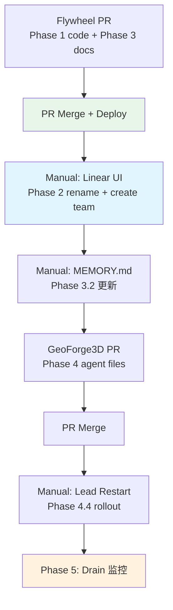

# Plan: Linear 升级后 Team 重组

**Version**: v1.17.0
**Issue**: GEO-298
**Date**: 2026-03-28
**Source**: `doc/engineer/exploration/new/GEO-298-linear-team-reorg.md`
**Status**: codex-approved

---

## 概述

方案 C: 拆 Team + 新 issue 分流（不迁移历史 issue）。

- Rename Studio → GeoForge3D（保留 GEO- prefix）
- 创建 Flywheel team（FLY- prefix）
- 新 Flywheel issue 进 FLY-，旧 GEO- issue 自然 drain
- 当 GEO- 下 active Flywheel issue = 0 时，清理双 team 配置

---

## Phase 1: Bridge API 改动（代码）— 先部署

> Bridge 代码必须先于 Linear UI 操作部署，避免过渡窗口中 `teams.nodes[0]` 投错 team。

### 1.1 `POST /api/linear/create-issue` — team-aware + project-aware

**问题 1**: 当前代码 `teams.nodes[0]` 取第一个 team，双 team 后会投到不确定的 team。
**问题 2**: 当前不传 `projectId`，新 FLY- issue 不会关联到 Flywheel project，导致 `project=Flywheel` 查询看不到。

**文件**: `packages/teamlead/src/bridge/plugin.ts` (line ~724-790)

**改动**:

```typescript
// 新增 team 和 project parameters
const { title, description, priority, labels, team, project } = req.body ?? {};

// ...existing validation for title, description, priority, labels...

// team validation
if (team !== undefined && typeof team !== "string") {
  res.status(400).json({ error: "team must be a string (team key, e.g. 'FLY')" });
  return;
}
// project validation
if (project !== undefined && typeof project !== "string") {
  res.status(400).json({ error: "project must be a string (project name)" });
  return;
}

const { LinearClient } = await import("@linear/sdk");
const client = new LinearClient({ apiKey: config.linearApiKey });

// --- Team resolution ---
const allTeams = await client.teams();
let targetTeam;
if (team) {
  targetTeam = allTeams.nodes.find(t => t.key === team);
  if (!targetTeam) {
    res.status(404).json({
      error: `Linear team with key "${team}" not found. Available: ${allTeams.nodes.map(t => t.key).join(", ")}`,
    });
    return;
  }
} else if (allTeams.nodes.length === 1) {
  targetTeam = allTeams.nodes[0];
} else {
  res.status(400).json({
    error: `Multiple teams found (${allTeams.nodes.map(t => t.key).join(", ")}). "team" parameter is required.`,
  });
  return;
}

// --- Project resolution (optional) ---
let projectId: string | undefined;
if (project) {
  const projects = await client.projects({ filter: { name: { eq: project } } });
  const matched = projects.nodes[0];
  if (!matched) {
    res.status(404).json({ error: `Linear project "${project}" not found` });
    return;
  }
  projectId = matched.id;
}

const issue = await client.createIssue({
  teamId: targetTeam.id,
  title,
  description: description ?? "",
  priority: priority ?? 0,
  labelIds: labels,  // NOTE: labels are label IDs, not names
  ...(projectId && { projectId }),
});
```

**关键设计决策**:
- `team`: 多 team workspace 时必填（400 if missing），单 team 时可省略
- `project`: optional，传 project name，通过 `client.projects()` 按名称匹配解析为 ID
- `labels`: 保持现状 — 传 label IDs（不是 names）。所有文档统一为此契约
- 使用 `client.teams()` + `find(t => t.key)` 而非 `client.team(key)`（SDK `team()` 接受 ID 不接受 key）

### 1.2 测试

**新建文件**: `packages/teamlead/src/__tests__/create-issue.test.ts`（当前无 create-issue 测试）

测试用例:
- `team: "FLY"` → 匹配到 FLY team → 创建 issue
- `team: "GEO"` → 匹配到 GEO team → 创建 issue
- `team: "INVALID"` → 404 with available teams list
- `team: 123` (non-string) → 400
- 无 `team` + 单 team workspace → 默认第一个 team
- 无 `team` + 多 team workspace → 400 with team list
- `project: "Flywheel"` → 匹配到 project → issue 关联 projectId
- `project: "NonExistent"` → 404
- `team: "FLY", project: "Flywheel"` → 完整闭环创建

### 1.3 `GET /api/linear/issues` — 无改动

当前用 GraphQL `IssueFilter` 按 `project` name / `state` / `labels` 过滤，不含 team 条件。查询 `project=Flywheel` 自动覆盖 GEO- 和 FLY- 两边 issue。见 `plugin.ts:861-980`。✅

### 1.4 `POST /api/runs/start` — 无改动

使用 `client.issue(issueId)` 直接查 issue，team-agnostic。见 `runs-route.ts:97-124`。✅

---

## Phase 2: Linear UI 操作（Annie 手动）

> **前置条件**: Phase 1 的 Flywheel PR 已合并部署。

### 2.1 Rename Studio → GeoForge3D

- Linear Settings → Teams → Studio → rename to "GeoForge3D"
- Prefix 保持 GEO-（Linear rename team 不改 prefix）
- 所有现有 issue ID 不变

### 2.2 创建 Flywheel Team

- Linear Settings → Teams → Create Team
- Name: `Flywheel`
- Prefix: `FLY`
- Workflow states: 使用 Linear 默认 (Backlog → Todo → In Progress → Done → Cancelled)

### 2.3 关联现有 Flywheel Project（关键！）

- 打开**现有** Flywheel project (ID: `764d7ab4-9a3b-43ea-99d9-7e881bb3b376`)
- Project Settings → Teams → 追加关联 FLY team（保留 GEO team 关联）
- **不要** 在 FLY team 下创建新的同名 Flywheel project
- 原因: `GET /api/linear/issues?project=Flywheel` 依赖单一 project name

### 2.4 Label 清理（Optional）

- 删除冗余 label: `backlog`（与 Linear 状态重复）
- 考虑创建 workspace-level labels（跨 team 共享）

---

## Phase 3: 文档更新（Flywheel repo + 本地）

### 3.1 Flywheel CLAUDE.md（Flywheel PR）

> 当前 CLAUDE.md 没有 `## Linear Project` section。新增。

在 `## Tech Stack` section 之后、`## Core Behaviors` section 之前，新增:

```markdown
## Linear Project

- **GeoForge3D Team** (prefix: GEO) — 产品 issue + 历史 Flywheel issue
- **Flywheel Team** (prefix: FLY) — 新 Flywheel 基础设施 issue
- **Project**: Flywheel (ID: `764d7ab4-9a3b-43ea-99d9-7e881bb3b376`)

> **过渡期规则**:
> - 历史 Flywheel issue 仍在 GEO- team 下，不迁移
> - 查询 Flywheel issue: 按 project name 过滤（自动覆盖两个 team）
> - 新建 Flywheel issue: **必须**指定 `team: "FLY"` 和 `project: "Flywheel"`
> - 当 GEO- 下 active Flywheel issue 归零后，移除此过渡期说明
```

### 3.2 MEMORY.md（本地操作，不进 PR）

更新 `~/.claude/projects/-Users-xiaorongli-Dev-flywheel/memory/MEMORY.md` 中 `## Linear Project` section:

```markdown
## Linear Project
- **GeoForge3D Team**: key GEO (原 Studio team, renamed)
- **Flywheel Team**: key FLY (新建)
- **Project**: Flywheel (ID: `764d7ab4-9a3b-43ea-99d9-7e881bb3b376`)
- **过渡期**: 查 Flywheel issue 按 project name；建 Flywheel issue 用 `team: "FLY"` + `project: "Flywheel"`
```

### 3.3 参考文档统一（Flywheel PR）

更新 `doc/reference/product-lead-TOOLS.md` 中 `POST /api/linear/create-issue` 完整 request contract:
- 统一 `labels` 为 label IDs（与代码 `labelIds: labels` 一致）
- 添加 `team` 参数（team key，多 team 必填）
- 添加 `project` 参数（project name，optional）
- 与 Phase 4.3 GeoForge3D TOOLS.md 保持一致的契约

### 3.4 现有 GEO-xxx 历史引用

**不改动**。CLAUDE.md、MEMORY.md、doc 文件名中的 GEO-xxx 引用保持原样。

---

## Phase 4: Agent 配置更新（GeoForge3D PR）

### 4.1 文件路径（已验证）

| Lead | Agent File | TOOLS |
|------|-----------|-------|
| Peter (product-lead) | `GeoForge3D/product/.lead/product-lead/agent.md` | `GeoForge3D/product/.lead/product-lead/TOOLS.md` |
| Oliver (ops-lead) | `GeoForge3D/operations/.lead/ops-lead/agent.md` | — |
| Simba (cos-lead) | `GeoForge3D/.lead/cos-lead/agent.md` | — |

### 4.2 Agent.md 更新内容

### Peter / Oliver agent.md — 两处改动

**改动 1: 添加 Linear Team 规则** (新 section):

```markdown
## Linear Team 规则
- 查询 Flywheel issue: `GET /api/linear/issues?project=Flywheel`（自动覆盖 GEO- 和 FLY- 两个 team）
- 创建 Flywheel issue: `POST /api/linear/create-issue` body 加 `"team": "FLY", "project": "Flywheel"`
- 创建 GeoForge3D issue: body 加 `"team": "GEO", "project": "GeoForge3D"`
```

**改动 2: 修改现有 identifier 解析为 prefix-agnostic**:

当前 agent.md 中所有 `GEO-XX` 硬编码解析需要泛化:
- 触��词、action 表、启动 Runner 示例中的 `GEO-XX` → 改为 "issue identifier（如 `GEO-123` 或 `FLY-456`）"
- CEO 指令解析示例（如 "跑 GEO-274"）补充一个 FLY- 示例（如 "跑 FLY-1"）
- `runs/start` 调用示例 body 中的 `issueId: "GEO-XX"` → `issueId: "<identifier>"` 并注明 GEO/FLY 均可
- 不需要逐行改所有历史 GEO-XX 引用（如 changelog），只改行为规则和示例中的

同步更新 Flywheel 侧参考文档:
- `doc/reference/product-lead-TOOLS.md`: runs/start 和 action/query 中的 GEO-only 示例改为 prefix-agnostic
- `doc/reference/product-lead-SOUL.md`: 泛化现有 GEO-only 行为规则（已确认存在于 line ~61-90）

### Simba agent.md — 修改现有 triage 文本（不是追加）

> Simba 保持只读，不创建 issue（与当前 agent 契约一致）。

**必须修改**（不能仅追加，否则会与旧规则冲突）:
- `cos-lead/agent.md` 的 PM Triage Step 1: 将"只查 `project=GeoForge3D`，绝不包含 Flywheel project" **改写为** "主 triage 列表查 `project=GeoForge3D`；triage 完成后额外执行 Flywheel drain check"
- 删除或改写任何 "绝不查 Flywheel" 的绝对语句

**新增段落**:

```markdown
### Flywheel Drain 检测（过渡期）
- 每次 triage 结束后，额外查: `GET /api/linear/issues?project=Flywheel&state=backlog,unstarted,started`
- 检查结果中是否还有 GEO- 前缀的 issue
- 当 GEO- active Flywheel issue = 0 时通知 Annie: drain 完成，可清理过渡期配置
- 此段落在 drain 完成后移除
```

**验收标准**: 最终 Simba agent 文本中不同时出现互相否定的查询规则

### 4.3 TOOLS.md 更新

更新 Peter 的 `TOOLS.md` 中 `POST /api/linear/create-issue` 文档:

```markdown
### POST /api/linear/create-issue
Body:
- title (string, required) — 500 chars max
- description (string, optional)
- priority (0-4, optional) — 0=None, 1=Urgent, 2=High, 3=Normal, 4=Low
- labels (string[], optional) — label IDs (not names)
- team (string, required for multi-team workspace) — team key, e.g., "FLY" or "GEO"
- project (string, optional) — project name, e.g., "Flywheel" or "GeoForge3D"
```

### 4.4 Rollout

Agent file 改完后不会自动生效（启动时 copy 到 `~/.claude/agents/{leadId}.md`）:

1. GeoForge3D PR merge 后，重启对应 Lead session 加载新 agent file
2. 验证: 启动日志中看到 `[lead] Agent file installed: ... (copied from ...)`
3. 可以统一重启三个 Lead

---

## Phase 5: Drain 完成后清理（Future — 自动触发）

**触发条件**: GEO- team 下 active（非 Done/Cancelled）Flywheel project issue = 0

**检测方式**: Simba 每次 triage 完成后额外查:
```
GET /api/linear/issues?project=Flywheel&state=backlog,unstarted,started
```
如果结果中所有 issue identifier 都以 `FLY-` 开头（无 GEO-），则 drain 完成。

**清理内容**:
1. CLAUDE.md: 移除过渡期说明，只保留 FLY- team 信息
2. MEMORY.md: 同上
3. Agent files: 移除 "两个 team" 查询说明
4. Optional: 移除 Flywheel project 与 GEO- team 的关联
5. 代码: `team` 和 `project` 参数保留（通用能力，不回退）

---

## 交付物清单

| 交付物 | 内容 | 载体 |
|--------|------|------|
| **Flywheel PR** | Phase 1 代码 + 测试 + Phase 3 CLAUDE.md + 参考文档 | GitHub PR (flywheel repo) |
| **GeoForge3D PR** | Phase 4 agent files + TOOLS.md | GitHub PR (GeoForge3D repo) |
| **Manual Ops** | Phase 2 Linear UI + Phase 3 MEMORY.md + Phase 4 Lead restart | Annie 手动 + checklist |

### 实施顺序



---

## 影响范围

| 组件 | 改动 | 风险 |
|------|------|------|
| Bridge `create-issue` | 添加 `team` + `project` params | 低 — 新参数，单 team 向后兼容 |
| Bridge `list-issues` | 无改动 | 无 |
| Bridge `runs/start` | 无改动 | 无 |
| CLAUDE.md | 新增 `## Linear Project` section | 无 |
| MEMORY.md | 更新 Linear Project section（本地） | 无 |
| 参考文档 | 统一 labels 契约为 IDs | 无 |
| Agent files (3) | 添加 team + project 规则 | 低 |
| TOOLS.md (1) | 更新 create-issue 参数文档 | 无 |

**不改动的**:
- 所有现有 GEO-xxx issue ID 引用
- projects.json
- Edge-worker / RepositoryRouter
- CI/CD 流程

---

## 测试计划

- [ ] `create-issue` with `team: "FLY"` → issue created in FLY team
- [ ] `create-issue` with `team: "GEO"` → issue created in GEO team
- [ ] `create-issue` with `team: "INVALID"` → 404 with available teams
- [ ] `create-issue` with `team: 123` → 400 (non-string)
- [ ] `create-issue` without `team` + single team → default
- [ ] `create-issue` without `team` + multi team → 400
- [ ] `create-issue` with `project: "Flywheel"` → issue associated with Flywheel project
- [ ] `create-issue` with `project: "NonExistent"` → 404
- [ ] `create-issue` with `team: "FLY", project: "Flywheel"` → 完整闭环
- [ ] `list-issues?project=Flywheel` → 返回 GEO 和 FLY 两边 issue
- [ ] Agent restart → new agent file loaded
- [ ] Peter/Oliver 能正确处理 `FLY-XX` identifier（query/run/action）
- [ ] Simba triage → 正确查询 Flywheel drain 状态（只读，不创建）
- [ ] Simba agent 文本无互相矛盾的查询规则
