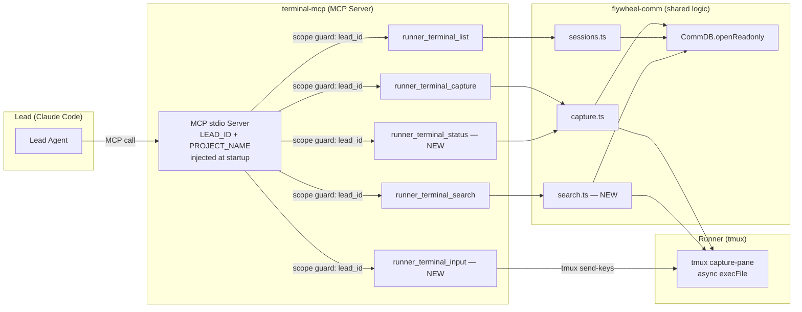

# Plan: Terminal Observation MCP Tool

**Version**: v1.18.0
**Issue**: FLY-11
**Date**: 2026-03-31
**Source**: `doc/engineer/exploration/new/FLY-11-terminal-mcp-tool.md`, `doc/engineer/research/new/FLY-11-terminal-mcp-tool.md`
**Status**: codex-approved

---

## Summary

让 Lead 通过 MCP tool 直接观察 Runner 终端输出。当前 Lead 通过 Bridge REST API 间接观察（HTTP → Bridge → tmux），新方案让 Lead 通过本地 MCP server 直接读取 tmux（MCP → tmux）。

**架构**：flywheel-comm CLI 扩展（search command） + thin MCP server wrapper（直接 import flywheel-comm functions）。

**Scope**：Read-write，5 个 MCP tools（capture + list + search + status + input），snapshot 模式 + Pod Binding 风格 write。

## Architecture



## Implementation Steps

### Step 1: Shared `validateProjectName()` + integrate into `resolveDbPath()`

**Files**:
- NEW: `packages/flywheel-comm/src/validate.ts`
- MODIFY: `packages/flywheel-comm/src/resolve-db-path.ts` (call validateProjectName)

Bridge 的 `session-capture.ts:72-78` 已有 path traversal guard (`/[/\\]|\.\./.test(projectName)`)。抽成共享 utility，**并直接嵌入 `resolveDbPath()`**，这样所有通过 `--project` 进入的 CLI 命令自动继承校验。

```typescript
// validate.ts
/**
 * Validate project name to prevent path traversal.
 * Rejects names containing /, \, or ..
 * Used by CLI (via resolveDbPath), Bridge, and MCP server.
 */
export function validateProjectName(name: string): void {
  if (/[/\\]|\.\./.test(name)) {
    throw new Error(`Invalid project name: '${name}'`);
  }
}
```

```typescript
// resolve-db-path.ts — add validation
import { validateProjectName } from "./validate.js";

export function resolveDbPath(opts: { db?: string; project?: string }): string {
  if (opts.db) return opts.db;
  const envPath = process.env.FLYWHEEL_COMM_DB;
  if (envPath) return envPath;
  if (opts.project) {
    validateProjectName(opts.project);  // NEW: guard against path traversal
    return join(homedir(), ".flywheel", "comm", opts.project, "comm.db");
  }
  throw new Error("No DB path specified. Use --db, --project, or set FLYWHEEL_COMM_DB.");
}
```

同时在 `lib.ts` 中 re-export `validateProjectName`。Bridge `session-capture.ts` 可在后续 PR 迁移到共享 utility（scope 外但记录为 TODO）。

### Step 2: flywheel-comm — Add `search` command

**Files**:
- NEW: `packages/flywheel-comm/src/commands/search.ts`
- MODIFY: `packages/flywheel-comm/src/index.ts` (register command + update help text)

**search.ts** 沿用 `capture.ts` 模式，但使用 `CommDB.openReadonly()` + async `execFile`（对齐 Bridge `session-capture.ts` 的稳妥模式）：

```typescript
import { execFile } from "node:child_process";
import { existsSync } from "node:fs";
import { promisify } from "node:util";
import { CommDB } from "../db.js";

const execFileAsync = promisify(execFile);

export interface SearchArgs {
  execId: string;
  pattern: string;
  dbPath: string;
  lines?: number;
}

export interface SearchMatch {
  line: number;
  text: string;
}

export interface SearchResult {
  matches: SearchMatch[];
  total_lines: number;
  pattern: string;
}

export async function search(args: SearchArgs): Promise<SearchResult> {
  if (!existsSync(args.dbPath)) {
    throw new Error(`Database not found: ${args.dbPath}`);
  }

  // Validate pattern (guard against ReDoS)
  if (args.pattern.length > 200) {
    throw new Error("Pattern too long (max 200 chars)");
  }

  const db = CommDB.openReadonly(args.dbPath);
  let tmuxTarget: string;
  try {
    const session = db.getSession(args.execId);
    if (!session) {
      throw new Error(`No session found for execution: ${args.execId}`);
    }
    tmuxTarget = session.tmux_window;
  } finally {
    db.close();
  }

  const lines = args.lines ?? 500;
  let output: string;
  try {
    const result = await execFileAsync(
      "tmux",
      ["capture-pane", "-t", tmuxTarget, "-p", "-S", `-${lines}`],
      { encoding: "utf-8", timeout: 5000 },
    );
    output = result.stdout;
  } catch {
    throw new Error(`tmux window not found: ${tmuxTarget}`);
  }

  const regex = new RegExp(args.pattern, "i");
  const allLines = output.split("\n");
  const matches: SearchMatch[] = [];
  for (let i = 0; i < allLines.length; i++) {
    if (regex.test(allLines[i]!)) {
      matches.push({ line: i + 1, text: allLines[i]! });
    }
  }

  return { matches, total_lines: allLines.length, pattern: args.pattern };
}
```

**index.ts changes**: Add `runSearch()` (async, matching new async pattern) + update `printUsage()` help text.

### Step 3: flywheel-comm — Enhance `sessions` with lead_id filter

**Files**:
- MODIFY: `packages/flywheel-comm/src/commands/sessions.ts`
- MODIFY: `packages/flywheel-comm/src/index.ts` (add `--lead` flag + update help)

```typescript
export interface SessionsArgs {
  dbPath: string;
  projectName?: string;
  activeOnly?: boolean;
  leadId?: string;  // NEW: scope filtering
}

export function sessions(args: SessionsArgs): Session[] {
  if (!existsSync(args.dbPath)) return [];
  const db = new CommDB(args.dbPath, false);
  try {
    let results: Session[];
    if (args.activeOnly) {
      results = db.getActiveSessions(args.projectName);
    } else {
      results = db.listSessions(args.projectName);
    }
    if (args.leadId) {
      results = results.filter(s => s.lead_id === args.leadId);
    }
    return results;
  } finally {
    db.close();
  }
}
```

### Step 4: flywheel-comm — Export for library consumers

**Files**:
- MODIFY: `packages/flywheel-comm/src/lib.ts`

Add re-exports:

```typescript
// Existing exports (keep)
export type { CleanupOptions, CleanupResult } from "./cleanup.js";
export { cleanupStaleSessions } from "./cleanup.js";
export { CommDB } from "./db.js";
export type { CheckResult, Message, PendingQuestion, Session } from "./types.js";

// NEW: command functions for MCP server
export { capture } from "./commands/capture.js";
export type { CaptureArgs } from "./commands/capture.js";
export { search } from "./commands/search.js";
export type { SearchArgs, SearchResult, SearchMatch } from "./commands/search.js";
export { sessions } from "./commands/sessions.js";
export type { SessionsArgs } from "./commands/sessions.js";
export { validateProjectName } from "./validate.js";
```

### Step 5: Create `packages/terminal-mcp/` — MCP Server

**Files**:
- NEW: `packages/terminal-mcp/package.json`
- NEW: `packages/terminal-mcp/tsconfig.json`
- NEW: `packages/terminal-mcp/src/index.ts`

**package.json**:

```json
{
  "name": "flywheel-terminal-mcp",
  "version": "0.1.0",
  "description": "MCP server for Lead terminal observation of Runner tmux sessions",
  "type": "module",
  "main": "dist/index.js",
  "bin": {
    "flywheel-terminal-mcp": "dist/index.js"
  },
  "scripts": {
    "build": "tsc",
    "dev": "tsc --watch",
    "test": "vitest run",
    "test:watch": "vitest --watch",
    "typecheck": "tsc --noEmit"
  },
  "dependencies": {
    "@modelcontextprotocol/sdk": "^1.25.2",
    "flywheel-comm": "workspace:*",
    "zod": "^4.3.6"
  },
  "devDependencies": {
    "@types/node": "^20.0.0",
    "typescript": "^5.3.3",
    "vitest": "^3.1.4"
  }
}
```

**src/index.ts** — Key design decisions addressing Codex feedback:

1. **Server-side scope enforcement**: `FLYWHEEL_LEAD_ID` env var injected at startup. All tools validate `session.lead_id === leadId` before allowing access. `lead_id` is NOT a tool input parameter.
2. **`CommDB.openReadonly()`**: No write operations, no schema migration side effects.
3. **Async tmux exec**: `execFile` (not `execFileSync`) to avoid blocking the MCP server event loop.
4. **Path traversal guard**: Uses shared `validateProjectName()` from flywheel-comm.
5. **tmux liveness check in list**: Uses `tmux has-session -t` to verify session is alive, adds `alive` field.

```typescript
#!/usr/bin/env node
import { execFile } from "node:child_process";
import { homedir } from "node:os";
import { join } from "node:path";
import { promisify } from "node:util";
import { McpServer } from "@modelcontextprotocol/sdk/server/mcp.js";
import { StdioServerTransport } from "@modelcontextprotocol/sdk/server/stdio.js";
import { z } from "zod";
import { CommDB, validateProjectName } from "flywheel-comm/db";

const execFileAsync = promisify(execFile);

// ── Required env vars (injected by claude-lead.sh) ──
const projectName = process.env.FLYWHEEL_PROJECT_NAME;
const leadId = process.env.FLYWHEEL_LEAD_ID;

if (!projectName) {
  process.stderr.write("FLYWHEEL_PROJECT_NAME is required\n");
  process.exit(1);
}
if (!leadId) {
  process.stderr.write("FLYWHEEL_LEAD_ID is required\n");
  process.exit(1);
}

validateProjectName(projectName);
const dbPath = join(homedir(), ".flywheel", "comm", projectName, "comm.db");

// ── Helpers ──

function openDb(): CommDB {
  return CommDB.openReadonly(dbPath);
}

/**
 * Scope guard: verify session belongs to this Lead.
 *
 * Policy on null lead_id (documented design decision):
 * Sessions with lead_id = null are "unscoped" — they were created before
 * lead_id tagging was added, or by system processes. These are visible to
 * ALL leads. This is intentional: rejecting null would create orphan sessions
 * that no Lead can observe. Once all session creation paths tag lead_id
 * (which they do as of GEO-206 Phase 2), new sessions will always have
 * lead_id set, and this null-open behavior only applies to legacy entries.
 */
function getSessionScoped(db: CommDB, sessionId: string) {
  const session = db.getSession(sessionId);
  if (!session) {
    throw new Error(`No session found: ${sessionId}`);
  }
  // Strict scope: reject if session has a lead_id that doesn't match.
  // Null lead_id = unscoped legacy session, visible to all leads.
  if (session.lead_id !== null && session.lead_id !== leadId) {
    throw new Error(`Session ${sessionId} is not in scope for lead ${leadId}`);
  }
  return session;
}

async function tmuxCapture(target: string, lines: number): Promise<string> {
  const { stdout } = await execFileAsync(
    "tmux",
    ["capture-pane", "-t", target, "-p", "-S", `-${lines}`],
    { encoding: "utf-8", timeout: 5000 },
  );
  return stdout;
}

async function tmuxAlive(sessionName: string): Promise<boolean> {
  try {
    await execFileAsync("tmux", ["has-session", "-t", `=${sessionName}`], { timeout: 3000 });
    return true;
  } catch {
    return false;
  }
}

// ── MCP Server ──

const server = new McpServer({
  name: "flywheel-terminal",
  version: "0.1.0",
});

// Tool 1: runner_terminal_capture
server.tool(
  "runner_terminal_capture",
  "Capture the last N lines of a Runner's terminal output.",
  {
    session_id: z.string().describe("Execution ID of the Runner session"),
    lines: z.number().min(1).max(500).default(100)
      .describe("Number of lines to capture (default 100)"),
  },
  async ({ session_id, lines }) => {
    try {
      const db = openDb();
      let tmuxTarget: string;
      try {
        const session = getSessionScoped(db, session_id);
        tmuxTarget = session.tmux_window;
      } finally {
        db.close();
      }
      const output = await tmuxCapture(tmuxTarget, lines);
      return { content: [{ type: "text" as const, text: output }] };
    } catch (e) {
      return {
        content: [{ type: "text" as const, text: `Error: ${e instanceof Error ? e.message : String(e)}` }],
        isError: true,
      };
    }
  }
);

// Tool 2: runner_terminal_list
server.tool(
  "runner_terminal_list",
  "List Runner sessions observable by this Lead. Shows session IDs, tmux targets, issue IDs, and liveness status.",
  {
    active_only: z.boolean().default(true)
      .describe("Only show running sessions (default true)"),
  },
  async ({ active_only }) => {
    try {
      const db = openDb();
      let results;
      try {
        if (active_only) {
          results = db.getActiveSessions(projectName);
        } else {
          results = db.listSessions(projectName);
        }
      } finally {
        db.close();
      }

      // Scope filter: sessions with matching lead_id OR null (unscoped legacy).
      // Same policy as getSessionScoped() — null lead_id is visible to all leads.
      results = results.filter(s => s.lead_id === null || s.lead_id === leadId);

      if (results.length === 0) {
        return { content: [{ type: "text" as const, text: "No sessions found." }] };
      }

      // Best-effort liveness check
      const lines: string[] = [];
      for (const s of results) {
        const sessionName = s.tmux_window.split(":")[0] ?? s.tmux_window;
        const alive = await tmuxAlive(sessionName);
        lines.push(
          `[${s.execution_id}] tmux=${s.tmux_window} issue=${s.issue_id ?? "-"} status=${s.status} alive=${alive} started=${s.started_at}`
        );
      }
      return { content: [{ type: "text" as const, text: lines.join("\n") }] };
    } catch (e) {
      return {
        content: [{ type: "text" as const, text: `Error: ${e instanceof Error ? e.message : String(e)}` }],
        isError: true,
      };
    }
  }
);

// Tool 3: runner_terminal_search
server.tool(
  "runner_terminal_search",
  "Search a Runner's terminal output for a regex pattern. Returns matching lines with line numbers.",
  {
    session_id: z.string().describe("Execution ID of the Runner session"),
    pattern: z.string().max(200).describe("Regex pattern (case-insensitive, max 200 chars)"),
    lines: z.number().min(1).max(2000).default(500)
      .describe("Lines of history to search (default 500)"),
  },
  async ({ session_id, pattern, lines }) => {
    try {
      const db = openDb();
      let tmuxTarget: string;
      try {
        const session = getSessionScoped(db, session_id);
        tmuxTarget = session.tmux_window;
      } finally {
        db.close();
      }

      const output = await tmuxCapture(tmuxTarget, lines);
      const regex = new RegExp(pattern, "i");
      const allLines = output.split("\n");
      const matches: string[] = [];
      for (let i = 0; i < allLines.length; i++) {
        if (regex.test(allLines[i]!)) {
          matches.push(`${i + 1}: ${allLines[i]}`);
        }
      }

      if (matches.length === 0) {
        return { content: [{ type: "text" as const, text: `No matches for "${pattern}" in ${allLines.length} lines.` }] };
      }
      return {
        content: [{ type: "text" as const, text: `${matches.length} matches in ${allLines.length} lines:\n${matches.join("\n")}` }],
      };
    } catch (e) {
      return {
        content: [{ type: "text" as const, text: `Error: ${e instanceof Error ? e.message : String(e)}` }],
        isError: true,
      };
    }
  }
);

const transport = new StdioServerTransport();
await server.connect(transport);
```

### Step 6: Lead 启动集成

**Files**:
- MODIFY: `packages/teamlead/scripts/claude-lead.sh`

修改 repo 内的真实启动脚本。脚本中已有 `LEAD_ID`、`PROJECT_NAME`、`SCRIPT_DIR` 变量。用 `SCRIPT_DIR` 计算 MCP server 路径：

```bash
# Compute MCP server path relative to script location
TERMINAL_MCP_BIN="$(cd "$SCRIPT_DIR/../../terminal-mcp/dist" && pwd)/index.js"

# Add to claude command's --mcp-config
--mcp-config "{\"flywheel-terminal\":{\"command\":\"node\",\"args\":[\"$TERMINAL_MCP_BIN\"],\"env\":{\"FLYWHEEL_PROJECT_NAME\":\"$PROJECT_NAME\",\"FLYWHEEL_LEAD_ID\":\"$LEAD_ID\"}}}"
```

只使用 `--mcp-config`（已实机验证 Claude CLI 支持），不使用 `--mcp` 或 `.claude/settings.json`。

### Step 7: Tests

**New test files**:
- `packages/flywheel-comm/src/__tests__/search.test.ts` — search command unit tests
- `packages/flywheel-comm/src/__tests__/validate.test.ts` — validateProjectName tests
- `packages/terminal-mcp/src/__tests__/tools.test.ts` — MCP tool tests

**search.test.ts**:
```typescript
describe("search command", () => {
  it("should find matching lines in terminal output");
  it("should return empty matches when pattern not found");
  it("should throw on missing session");
  it("should throw on missing database");
  it("should reject pattern longer than 200 chars");
  it("should support case-insensitive matching");
  it("should report total_lines accurately");
});
```

**validate.test.ts**:
```typescript
describe("validateProjectName", () => {
  it("should accept valid project names");
  it("should reject names with forward slash");
  it("should reject names with backslash");
  it("should reject names with ..");
});
```

**tools.test.ts** (MCP server):
```typescript
describe("MCP tools", () => {
  it("runner_terminal_capture should return terminal text");
  it("runner_terminal_capture should reject out-of-scope session");
  it("runner_terminal_list should return active sessions with liveness");
  it("runner_terminal_list should filter by server's lead_id");
  it("runner_terminal_search should return matching lines");
  it("runner_terminal_search should handle missing session");
});
```

**Test strategy — two layers**:

1. **Function-level unit tests** (search.test.ts, tools.test.ts): Import the function directly, mock `execFile`/`execFileSync` via `vi.mock("node:child_process")`. Use real CommDB with temp directory (following existing `commands.test.ts` pattern). This is where tmux-dependent logic is tested.

2. **CLI subprocess tests** (cli.test.ts): The existing cli.test.ts spawns a real subprocess (`execFileSync("node", [CLI_PATH, ...])`), so parent-process mocks don't apply. CLI-level tests for `search` and `sessions --lead` will focus on **argument parsing and output format** using a pre-populated DB where the session's tmux target doesn't need to be real (test that missing tmux produces the expected error message). No tmux mock needed — we test the error path, and the success path is covered at the function level.

```typescript
// In cli.test.ts — test parse + error path (no tmux mock needed)
describe("CLI search command", () => {
  it("should require --exec-id and --pattern");
  it("should print error when tmux window not found");
  it("should output JSON format when --json flag used");
});

describe("CLI sessions --lead filter", () => {
  it("should accept --lead flag without error");
});
```

### Step 8: Write Capability — `runner_terminal_status` + `runner_terminal_input`

**Files**:
- NEW: `packages/terminal-mcp/src/status.ts`
- MODIFY: `packages/terminal-mcp/src/index.ts`
- NEW: `packages/terminal-mcp/src/__tests__/status.test.ts`

**设计决策**（Annie 要求，按 AgentsMesh Pod Binding 模式）：

不分 Phase，直接在同一 PR 中加入 write 能力。

**status.ts** — 独立模块，便于单元测试：

```typescript
export type TerminalStatus = "executing" | "waiting" | "idle" | "dead";

// WAITING_PATTERNS: [Y/n], (yes/no), Do you want to, Would you like to,
//   Should I, Allow?, [Allow], [Deny], Press Enter, etc.
// IDLE_PATTERNS: bare shell prompt ($, ❯, >, %, #), user@host:~ $

export function detectTerminalStatus(output: string): {
  status: TerminalStatus;
  reason: string;
}
```

**runner_terminal_status** (Tool 4):
- 输入: `session_id`
- 输出: `{ status, reason }` (JSON)
- 逻辑: scope guard → tmux alive check → capture 30 lines → `detectTerminalStatus()`
- dead tmux 返回 `{ status: "dead" }`

**runner_terminal_input** (Tool 5):
- 输入: `session_id`, `text` (max 2000), `enter` (default true)
- 输出: confirmation message
- 逻辑: scope guard → tmux alive check → `tmux send-keys -t target text [Enter]`
- Safety: tool description 明确提示 "Only use when runner_terminal_status reports 'waiting'"

**Tests**: 14 tests covering all status detection patterns (waiting/idle/executing/empty/priority).

## File Changes Summary

| File | Action | Description |
|------|--------|-------------|
| `packages/flywheel-comm/src/validate.ts` | NEW | Shared `validateProjectName()` |
| `packages/flywheel-comm/src/commands/search.ts` | NEW | search command (async, openReadonly) |
| `packages/flywheel-comm/src/index.ts` | MODIFY | Register search, add --lead to sessions, update printUsage() |
| `packages/flywheel-comm/src/commands/sessions.ts` | MODIFY | Add leadId filter parameter |
| `packages/flywheel-comm/src/lib.ts` | MODIFY | Export search, capture, sessions, validateProjectName |
| `packages/flywheel-comm/src/__tests__/search.test.ts` | NEW | search command tests |
| `packages/flywheel-comm/src/__tests__/validate.test.ts` | NEW | validateProjectName tests |
| `packages/terminal-mcp/package.json` | NEW | Package config (with zod dep) |
| `packages/terminal-mcp/tsconfig.json` | NEW | TypeScript config |
| `packages/terminal-mcp/src/index.ts` | NEW | MCP server (3 tools, scope enforcement) |
| `packages/terminal-mcp/src/status.ts` | NEW | Status detection (executing/waiting/idle) |
| `packages/terminal-mcp/src/__tests__/tools.test.ts` | NEW | MCP scope tests |
| `packages/terminal-mcp/src/__tests__/status.test.ts` | NEW | Status detection tests (14 cases) |
| `packages/teamlead/scripts/claude-lead.sh` | MODIFY | Add --mcp-config for terminal-mcp |
| `packages/teamlead/src/bridge/session-capture.ts` | MODIFY | Use shared validateProjectName() |

## Estimated Size

- flywheel-comm changes: ~150 lines new code + ~40 lines modifications
- terminal-mcp package: ~180 lines
- Tests: ~250 lines
- Lead startup: ~10 lines
- **Write capability (Step 8)**: ~180 lines code + ~120 lines tests
- **Total**: ~930 lines

## Out of Scope

- ❌ WebSocket streaming
- ❌ Bridge `/api/sessions/:id/capture` removal (keep for dashboard/audit)
- ❌ Lead agent.md / TOOLS.md update (MCP tools auto-exposed to Lead)

## Risks

| Risk | Mitigation |
|------|------------|
| flywheel-comm lib.ts exports break existing consumers | Only add exports, don't modify existing |
| MCP SDK API changes | Pin version in package.json |
| tmux not installed | capture/search have error handling, return MCP error response |
| CommDB path traversal | Shared `validateProjectName()` used by all consumers |
| Regex pattern causes hang | 200 char limit via zod schema + 5s tmux timeout |
| tmux liveness check is slow | `has-session` is fast (~5ms), bounded by 3s timeout |
| `openReadonly()` fails on missing DB | Check `existsSync` before opening |

## Codex Review — Changes Incorporated

### Round 1 (6 issues)

| Codex Issue | Resolution |
|-------------|------------|
| #1 Lead scope: server-side hard guard | ✅ `FLYWHEEL_LEAD_ID` env, `getSessionScoped()` validates every tool call |
| #2 Step 5 path mismatch | ✅ Fixed to `packages/teamlead/scripts/claude-lead.sh`, use `SCRIPT_DIR` |
| #3 Read-only: use openReadonly + async | ✅ MCP server uses `CommDB.openReadonly()` + `execFileAsync` |
| #4 Path safety | ✅ Shared `validateProjectName()` in flywheel-comm, used by CLI/Bridge/MCP |
| #5 List liveness check | ✅ `tmux has-session` per session, `alive` field in output |
| #6 Build/test gaps | ✅ Added zod dep, CLI tests, validate tests, printUsage update |

### Round 2 (3 issues)

| Codex Issue | Resolution |
|-------------|------------|
| #1 null lead_id scope leak | ✅ Documented design decision: null = unscoped legacy, visible to all leads. Explicit `!== null` check + code comment explaining policy |
| #2 validateProjectName not in CLI path | ✅ Integrated into `resolveDbPath()` itself — all CLI `--project` commands auto-inherit |
| #3 CLI test subprocess mock infeasible | ✅ Two-layer strategy: function tests mock tmux, CLI tests only test parse + error paths |
