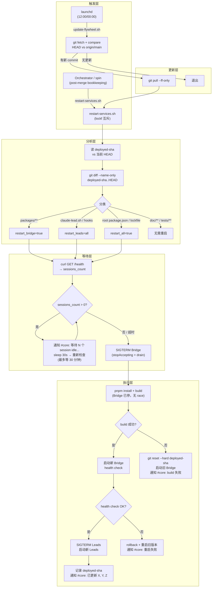

# Plan: Auto-restart Bridge + Lead after Merge

**Version**: v1.18.0
**Issue**: FLY-20
**Date**: 2026-03-30
**Source**: `doc/engineer/exploration/new/FLY-20-auto-restart-cd.md`, `doc/engineer/research/new/FLY-20-auto-restart-cd.md`
**Status**: codex-approved

---

## Summary

PR merge 后自动 `git pull` + `pnpm build` + 重启受影响的 Bridge/Lead 服务。主路径由 Orchestrator post-merge 触发，launchd 每天两次兜底检查。

## Annie 确认的决定

1. **智能检测** — diff 分析，只重启受影响的服务
2. **等 idle** — 先停派发新 task，等 in-flight session 完成再重启
3. **Build 失败** — 自动回滚到上一个 known-good commit
4. **通知** — #geoforge3d-core
5. **主路径** — Orchestrator merge 后触发 skill
6. **兜底** — launchd 每天 12:00 + 00:00 检查

---

## Architecture



---

## Deliverables

### D1: `scripts/restart-services.sh` — 核心重启脚本

**职责**: diff → 等 idle → build → restart → health check → 通知

**参数**:
```bash
restart-services.sh [--force] [--dry-run]
```
- `--force`: 跳过 idle 等待
- `--dry-run`: 只打印计划，不执行

**关键设计决策**:

#### 1. Deployed-SHA 而非 before/after HEAD

不用 `--skip-pull` + 比较脚本执行前后的 HEAD（Orchestrator 已 pull 过时 OLD==NEW 会 no-op）。
改为维护 `~/.flywheel/deployed-sha`，始终比较 "已部署 commit" vs "repo 当前 HEAD"。

```bash
DEPLOYED_SHA_FILE="${HOME}/.flywheel/deployed-sha"
DEPLOYED_SHA=$(cat "$DEPLOYED_SHA_FILE" 2>/dev/null || echo "")
CURRENT_HEAD=$(git -C "$FLYWHEEL_DIR" rev-parse HEAD)

if [[ "$DEPLOYED_SHA" == "$CURRENT_HEAD" ]]; then
    log "Already deployed at ${CURRENT_HEAD:0:7}, exiting."
    exit 0
fi

# Bootstrap: deployed-sha 不存在时，视为首次运行，强制全量重启
# 不能用当前 HEAD 初始化后退出，否则 ship FLY-20 后第一次运行会跳过重启
FIRST_RUN=false
if [[ -z "$DEPLOYED_SHA" ]]; then
    log "No deployed-sha found — first run, forcing full restart"
    FIRST_RUN=true
fi

# diff 分类（仅非首次运行时执行，首次运行直接全量重启）
if [[ "$FIRST_RUN" == "true" ]]; then
    restart_bridge=true
    restart_all_leads=true
    need_install=true
else
    CHANGED=$(git -C "$FLYWHEEL_DIR" diff --name-only "$DEPLOYED_SHA" "$CURRENT_HEAD")
    eval "$(classify_changes)"
fi
```

#### 2. Idle 等待 + Stop-then-Build 顺序

`GET /health` 无需 auth，返回 `{ ok, uptime, sessions_count }`。

**关于 `sessions_count` 的语义**: `/health.sessions_count` 由 `StateStore.getActiveSessions()` 驱动，包含 `running` 和 `awaiting_review` 两种状态。虽然 `awaiting_review` session 的 Runner 已停止、不会受重启影响，但我们选择保守等待：`awaiting_review` 通常会很快被 Lead 处理（approve/retry），等它们清空再重启更安全。如果 `awaiting_review` 长时间未处理，30 分钟超时会兜底。不使用 `/api/runs/active`，因为该端点需要 `TEAMLEAD_API_TOKEN` 认证，增加脚本复杂度且引入额外故障点。

**Drain 语义 — SIGTERM-first approach**: 不添加新 Bridge API。利用 Bridge 已有的 SIGTERM → `stopAccepting()` + `drain()` 机制。关键变更：**先停 Bridge，再 build，最后启动新 Bridge**。

执行顺序变为：
1. `wait_for_idle()` — 轮询 `/health` 等 `sessions_count == 0`
2. `SIGTERM Bridge` — 触发 `stopAccepting()` + `drain()`，Bridge graceful exit
3. `pnpm install + pnpm build` — Bridge 已停，不会接新 session
4. 启动新 Bridge

这彻底消除了 race window：Bridge 在 build 期间不运行。downtime = build 时间（~30s），Lead 期间调 Bridge API 会失败但不会 crash（已有容错）。

```bash
wait_for_idle() {
    local elapsed=0
    while (( elapsed < MAX_WAIT_SECONDS )); do
        local count
        count=$(curl -sf "$BRIDGE_URL/health" | jq '.sessions_count // 0') || count=0
        if (( count == 0 )); then return 0; fi
        if (( elapsed == 0 || elapsed % 300 == 0 )); then
            notify_discord "⏳ 等待 ${count} 个 active session idle... (${elapsed}s/${MAX_WAIT_SECONDS}s)"
        fi
        sleep "$POLL_INTERVAL"
        elapsed=$((elapsed + POLL_INTERVAL))
    done
    log "WARNING: Timeout waiting for idle after ${MAX_WAIT_SECONDS}s"
    return 1
}
```

**deploy_and_verify 顺序** (更新):
```
wait_for_idle → stop_bridge (SIGTERM, wait for graceful exit)
→ pnpm install + build → start_bridge → health check
→ stop_leads (if needed) → start_leads → update deployed-sha
```

#### 3. Lead Supervisor PID File + Manifest

**问题**: `pgrep -f "claude.*--agent lead-id"` 会命中 Claude child 而非 supervisor。`claude-lead.sh` supervisor 收到 SIGTERM 会 forward 给 child 然后 exit，但 pgrep 可能先杀 child 导致 supervisor 误以为 crash → 重启旧版本。

**解决**: 修改 `claude-lead.sh`，在 supervisor 启动时写 PID file：

```bash
# 在 claude-lead.sh 的 supervisor loop 开始前添加：
PID_FILE="${HOME}/.flywheel/pids/${PROJECT_NAME}-${LEAD_ID}.pid"
mkdir -p "$(dirname "$PID_FILE")"
echo $$ > "$PID_FILE"

# cleanup() 中添加：
rm -f "$PID_FILE"
```

同时写一个 manifest file 记录启动参数（写在 LEAD_WORKSPACE 解析之后，约 L245 后）：

```bash
# 在 claude-lead.sh 的 LEAD_WORKSPACE 解析之后添加：
MANIFEST_FILE="${HOME}/.flywheel/manifests/${PROJECT_NAME}-${LEAD_ID}.json"
mkdir -p "$(dirname "$MANIFEST_FILE")"
jq -n \
  --arg leadId "$LEAD_ID" \
  --arg projectDir "$PROJECT_DIR" \
  --arg projectName "$PROJECT_NAME" \
  --arg subdir "${LEAD_SUBDIR:-}" \
  --arg workspace "$LEAD_WORKSPACE" \
  --arg botTokenEnv "$BOT_TOKEN_ENV_NAME" \
  --arg pid "$$" \
  '{leadId: $leadId, projectDir: $projectDir, projectName: $projectName, subdir: $subdir, workspace: $workspace, botTokenEnv: $botTokenEnv, pid: ($pid | tonumber)}' \
  > "$MANIFEST_FILE"
```

重启逻辑消费 manifest：

```bash
restart_lead() {
    local lead_id="$1"
    # nullglob-safe manifest lookup — 不能让 ls 在 set -euo pipefail 下崩溃
    local manifest=""
    local -a matches=()
    shopt -s nullglob
    matches=("${HOME}/.flywheel/manifests/"*"-${lead_id}.json")
    shopt -u nullglob
    if (( ${#matches[@]} > 0 )); then
        manifest="${matches[0]}"
    fi

    if [[ -z "$manifest" ]]; then
        log "WARNING: No manifest for $lead_id, skipping (will retry after next Lead startup)"
        return 2  # 返回 2 = skipped (区别于 0=success, 1=error)
    fi

    local project_dir project_name subdir bot_token_env workspace
    project_dir=$(jq -r '.projectDir' "$manifest")
    project_name=$(jq -r '.projectName' "$manifest")
    subdir=$(jq -r '.subdir // ""' "$manifest")
    bot_token_env=$(jq -r '.botTokenEnv' "$manifest")
    workspace=$(jq -r '.workspace // ""' "$manifest")

    # 用 PID file 精确定位 supervisor
    local pid_file="${HOME}/.flywheel/pids/${project_name}-${lead_id}.pid"
    if [[ -f "$pid_file" ]]; then
        local pid=$(cat "$pid_file")
        if kill -0 "$pid" 2>/dev/null; then
            kill -TERM "$pid"
            local wait_count=0
            while kill -0 "$pid" 2>/dev/null && (( wait_count < 60 )); do
                sleep 1
                ((wait_count++))
            done
            # 确认旧进程已退出，否则 fail-fast 防止双启动
            if kill -0 "$pid" 2>/dev/null; then
                log "ERROR: Old supervisor for $lead_id (PID $pid) still alive after 60s"
                notify_discord "⚠️ Lead $lead_id 旧 supervisor (PID $pid) 60s 后仍未退出，跳过重启避免双启动"
                return 1
            fi
        fi
        rm -f "$pid_file"
    fi

    local subdir_args=""
    [[ -n "$subdir" && "$subdir" != "null" ]] && subdir_args="--subdir $subdir"

    # Fail-fast: bot token env must be defined
    if [[ -z "${!bot_token_env:-}" ]]; then
        log "ERROR: $bot_token_env is not set, cannot restart $lead_id"
        notify_discord "⚠️ Lead $lead_id 重启失败: \`$bot_token_env\` 未定义"
        return 1
    fi

    # 透传所有启动参数确保 manifest 不漂移
    # 如果 manifest 记录了自定义 workspace，通过 env var 直接传回
    # 注意：shell 不支持通过变量展开创建 env assignment，必须用 env 命令或直接写字面量
    if [[ -n "$workspace" && "$workspace" != "null" ]]; then
        LEAD_WORKSPACE="$workspace" DISCORD_BOT_TOKEN="${!bot_token_env}" \
            nohup "$FLYWHEEL_DIR/packages/teamlead/scripts/claude-lead.sh" \
            "$lead_id" "$project_dir" "$project_name" $subdir_args \
            --bot-token-env "$bot_token_env" \
            >> "/tmp/flywheel-lead-${lead_id}.log" 2>&1 &
    else
        DISCORD_BOT_TOKEN="${!bot_token_env}" \
            nohup "$FLYWHEEL_DIR/packages/teamlead/scripts/claude-lead.sh" \
            "$lead_id" "$project_dir" "$project_name" $subdir_args \
            --bot-token-env "$bot_token_env" \
            >> "/tmp/flywheel-lead-${lead_id}.log" 2>&1 &
    fi
    log "Lead $lead_id restarted (PID $!)"
}

# 重启所有 Lead，输出 "skipped:N failed:M" 到 stdout（唯一一行）
# 所有日志走 stderr，stdout 只用于机器可读的结果
# Bash 3.2 兼容（macOS /bin/bash）：不用 associative array，不用 grep -P
do_restart_all_leads() {
    local skipped=0
    local failed=0

    # 来源 1: 从 manifest 文件收集已有 Lead ID
    local manifest_leads=""  # space-separated lead IDs
    shopt -s nullglob
    local manifests=("${HOME}/.flywheel/manifests/"*.json)
    shopt -u nullglob
    for mf in "${manifests[@]}"; do
        local lid
        lid=$(jq -r '.leadId' "$mf")
        manifest_leads="$manifest_leads $lid"
    done

    # 来源 2: 检测正在运行但无 manifest 的 legacy Lead
    # pgrep -af 输出: "PID claude-lead.sh <lead_id> <project_dir> ..."
    # 用 awk 提取 lead_id（claude-lead.sh 后第一个参数）
    while IFS= read -r cmd_line; do
        [[ -z "$cmd_line" ]] && continue
        local lid
        lid=$(echo "$cmd_line" | awk -F'claude-lead.sh ' '{print $2}' | awk '{print $1}')
        if [[ -n "$lid" ]] && ! echo "$manifest_leads" | grep -qw "$lid"; then
            log "WARNING: Lead $lid is running but has no manifest — needs manual restart to generate manifest" >&2
            ((skipped++))
        fi
    done < <(pgrep -af "claude-lead.sh" 2>/dev/null || true)

    # 重启有 manifest 的 Lead
    for mf in "${manifests[@]}"; do
        local lid
        lid=$(jq -r '.leadId' "$mf")
        local rc=0
        restart_lead "$lid" >&2 || rc=$?
        if (( rc == 2 )); then
            ((skipped++))
        elif (( rc == 1 )); then
            ((failed++))
        fi
    done

    if (( ${#manifests[@]} == 0 && skipped == 0 )); then
        log "WARNING: No Leads found (no manifests, no running processes)" >&2
    fi

    # stdout 上的唯一输出 — 调用方通过 $() 捕获
    echo "skipped:${skipped} failed:${failed}"
}
```

#### 4. Diff 分类规则（完整 workspace 覆盖）

```bash
classify_changes() {
    local restart_bridge=false
    local restart_all_leads=false
    local need_install=false

    while IFS= read -r file; do
        case "$file" in
            # Bridge 影响面: teamlead + 所有依赖 packages + scripts
            packages/teamlead/*)         restart_bridge=true ;;
            packages/core/*)             restart_bridge=true ;;
            packages/edge-worker/*)      restart_bridge=true ;;
            packages/flywheel-comm/*)    restart_bridge=true; restart_all_leads=true ;;
            scripts/run-bridge.ts)       restart_bridge=true ;;
            scripts/lib/*)               restart_bridge=true ;;

            # Lead 影响面
            packages/teamlead/scripts/claude-lead.sh)   restart_all_leads=true ;;
            packages/teamlead/scripts/post-compact*)     restart_all_leads=true ;;

            # 依赖变更 → 全部
            package.json)                need_install=true; restart_bridge=true; restart_all_leads=true ;;
            pnpm-lock.yaml)              need_install=true; restart_bridge=true; restart_all_leads=true ;;
            pnpm-workspace.yaml)         need_install=true; restart_bridge=true; restart_all_leads=true ;;

            # 无需重启
            doc/*|tests/*|.claude/*|.github/*|*.md)  ;;
            *)  ;;
        esac
    done <<< "$CHANGED"

    echo "restart_bridge=$restart_bridge"
    echo "restart_all_leads=$restart_all_leads"
    echo "need_install=$need_install"
}
```

#### 5. 互斥锁 — macOS lockf

macOS 无 `flock`，改用 `lockf`：

```bash
LOCK_FILE="${HOME}/.flywheel/restart.lock"

acquire_lock() {
    exec 200>"$LOCK_FILE"
    if ! lockf -t 0 "$LOCK_FILE" true 2>/dev/null; then
        log "Another restart in progress, exiting."
        exit 0
    fi
    # Alternative: atomic mkdir lock
    if ! mkdir "${LOCK_FILE}.d" 2>/dev/null; then
        log "Another restart in progress, exiting."
        exit 0
    fi
    trap 'rmdir "${LOCK_FILE}.d" 2>/dev/null' EXIT
}
```

实际使用更可靠的 `mkdir` 原子锁：

```bash
LOCK_DIR="${HOME}/.flywheel/restart.lock.d"

acquire_lock() {
    if ! mkdir "$LOCK_DIR" 2>/dev/null; then
        # 检查锁是否 stale (>2 小时)
        local lock_age=$(( $(date +%s) - $(stat -f %m "$LOCK_DIR" 2>/dev/null || echo 0) ))
        if (( lock_age > 7200 )); then
            log "Stale lock detected (${lock_age}s), breaking."
            rmdir "$LOCK_DIR" 2>/dev/null
            mkdir "$LOCK_DIR" 2>/dev/null || { log "Lock contention, exiting."; exit 0; }
        else
            log "Another restart in progress (${lock_age}s old), exiting."
            exit 0
        fi
    fi
    trap 'rmdir "$LOCK_DIR" 2>/dev/null' EXIT
}
```

#### 6. Discord 通知 — 安全 JSON

```bash
notify_discord() {
    local message="$1"
    local payload
    payload=$(jq -n --arg content "$message" '{content: $content}')
    curl -sf -X POST "https://discord.com/api/v10/channels/${DISCORD_CORE_CHANNEL}/messages" \
        -H "Authorization: Bot ${NOTIFY_BOT_TOKEN}" \
        -H "Content-Type: application/json" \
        -d "$payload" \
        --max-time 5 || log "WARNING: Discord notification failed"
}
```

#### 7. Env 加载 — 入口统一

```bash
# 脚本入口，所有逻辑之前
ENV_FILE="${HOME}/.flywheel/.env"
if [[ -f "$ENV_FILE" ]]; then
    source "$ENV_FILE"
else
    log "WARNING: $ENV_FILE not found"
fi

# 校验关键变量
: "${DISCORD_CORE_CHANNEL:?DISCORD_CORE_CHANNEL must be set}"
: "${SIMBA_BOT_TOKEN:=${DISCORD_BOT_TOKEN:?No bot token available}}"
NOTIFY_BOT_TOKEN="$SIMBA_BOT_TOKEN"
BRIDGE_URL="${BRIDGE_URL:-http://localhost:9876}"
```

#### 8. Deploy, Verify, Rollback

**Rollback 覆盖三种失败**: build 失败、restart 后 health check 失败、以及 restart 本身失败。

```bash
deploy_and_verify() {
    local restarted=()

    # Step 1: Stop Bridge FIRST (triggers stopAccepting + drain)
    # This ensures no new sessions are accepted during build
    if [[ "$restart_bridge" == "true" ]]; then
        stop_bridge
    fi

    # Step 2: Build (Bridge is stopped, no race possible)
    if ! build_with_rollback; then
        # Build failed, rollback already done. Restart old Bridge if we stopped it
        if [[ "$restart_bridge" == "true" ]]; then
            start_bridge
        fi
        return 1
    fi

    # Step 3: Start new Bridge
    if [[ "$restart_bridge" == "true" ]]; then
        start_bridge
        restarted+=("Bridge")

        # Health check — wait for new Bridge to be ready (最多 60s)
        local hc_ok=false
        for i in $(seq 1 30); do
            if curl -sf "$BRIDGE_URL/health" | jq -e '.ok' > /dev/null 2>&1; then
                hc_ok=true
                break
            fi
            sleep 2
        done
        if [[ "$hc_ok" != "true" ]]; then
            log "ERROR: Bridge health check failed after restart. Attempting rollback."
            rollback_and_restart "$DEPLOYED_SHA"
            return 1
        fi
    fi

    # Step 4: Restart Leads (after Bridge is confirmed healthy)
    local leads_skipped=0
    local leads_failed=0
    if [[ "$restart_all_leads" == "true" ]]; then
        local lead_result
        lead_result=$(do_restart_all_leads)
        leads_skipped=$(echo "$lead_result" | sed 's/.*skipped:\([0-9]*\).*/\1/')
        leads_failed=$(echo "$lead_result" | sed 's/.*failed:\([0-9]*\).*/\1/')
        restarted+=("All Leads")
    fi

    # Step 5: Update deployed-sha
    # 阻止前进的条件：Lead 被跳过（无 manifest）或 Lead 重启失败（双启动/token 缺失等）
    if (( leads_failed > 0 )); then
        log "ERROR: ${leads_failed} lead(s) failed to restart. deployed-sha NOT advanced."
        notify_discord "⚠️ Flywheel 更新到 \`${CURRENT_HEAD:0:7}\` 部分失败。${leads_failed} 个 Lead 重启失败。\ndeployed-sha 未前进，下次运行会重试。\n请检查 Lead 日志。"
        return 1
    fi
    if (( leads_skipped > 0 )); then
        log "WARNING: ${leads_skipped} lead(s) skipped (no manifest). deployed-sha NOT advanced."
        notify_discord "⚠️ Flywheel 部分更新到 \`${CURRENT_HEAD:0:7}\`。${leads_skipped} 个 Lead 因缺少 manifest 被跳过。\n请手动重启这些 Lead 一次以生成 manifest，下次自动更新会重试。\n已重启: ${restarted[*]:-无}"
        return 0
    fi

    echo "$CURRENT_HEAD" > "$DEPLOYED_SHA_FILE"
    log "deployed-sha updated to ${CURRENT_HEAD:0:7}"

    notify_discord "✅ Flywheel 已更新到 \`${CURRENT_HEAD:0:7}\`。重启了: ${restarted[*]:-无}"
}

rollback_and_restart() {
    local rollback_sha="$1"

    # Guard: 首次运行没有 known-good SHA，不能 rollback，只能 fail-closed
    if [[ -z "$rollback_sha" ]]; then
        log "ERROR: No known-good SHA for rollback (first run). Manual intervention required."
        notify_discord "🚨 Flywheel 首次部署失败且无法自动回滚（无 known-good SHA）。需要手动介入。\n请手动检查 Bridge/Lead 状态并运行 \`restart-services.sh --force\`"
        return 1
    fi

    log "Rolling back to ${rollback_sha:0:7}"

    # Fail-closed: 工作区不干净时拒绝 rollback，避免破坏 uncommitted 工作
    if [[ -n "$(git -C "$FLYWHEEL_DIR" status --porcelain)" ]]; then
        log "ERROR: Working directory not clean, refusing rollback to protect uncommitted changes"
        notify_discord "🚨 Flywheel rollback 被阻止: 工作区不干净。需要手动介入。\n请先 \`cd ~/Dev/flywheel && git stash\` 再重试。"
        return 1
    fi

    git -C "$FLYWHEEL_DIR" reset --hard "$rollback_sha"

    # Best-effort: rebuild 旧版本并重启
    if pnpm -C "$FLYWHEEL_DIR" install --frozen-lockfile && \
       pnpm -C "$FLYWHEEL_DIR" build; then
        # 重启到旧版本
        if [[ "$restart_bridge" == "true" ]]; then
            stop_bridge
            start_bridge
        fi
        if [[ "$restart_all_leads" == "true" ]]; then
            do_restart_all_leads > /dev/null
        fi
        notify_discord "⚠️ Flywheel 更新到 \`${CURRENT_HEAD:0:7}\` 失败 (health check)。已回滚到 \`${rollback_sha:0:7}\` 并重启旧版本。请检查新代码。"
    else
        notify_discord "🚨 Flywheel 更新失败且回滚 build 也失败。服务可能处于异常状态。需要手动介入。\nTarget: \`${CURRENT_HEAD:0:7}\`, Rollback: \`${rollback_sha:0:7}\`"
    fi
}
```

#### 9. Bridge Stop / Start (分离)

Bridge stop 和 start 分离，因为 build 需要在两者之间执行。

```bash
stop_bridge() {
    local pid=$(pgrep -f "run-bridge.ts" || true)
    if [[ -z "$pid" ]]; then
        log "Bridge not running, nothing to stop"
        return 0
    fi
    kill -TERM "$pid"
    # 等待 graceful shutdown 完成（drain inflight → teardown → close DB）
    # 不设 kill -9 兜底 — 让 drain 完整执行
    local wait_count=0
    while kill -0 "$pid" 2>/dev/null && (( wait_count < 120 )); do
        sleep 1
        ((wait_count++))
    done
    if kill -0 "$pid" 2>/dev/null; then
        log "WARNING: Bridge still alive after 120s, force killing"
        kill -9 "$pid" 2>/dev/null || true
    fi
    log "Bridge stopped (was PID $pid, waited ${wait_count}s)"
}

start_bridge() {
    cd "$FLYWHEEL_DIR"
    nohup npx tsx scripts/run-bridge.ts \
        >> /tmp/flywheel-bridge.log 2>&1 &
    log "Bridge started (PID $!)"
    cd - > /dev/null
}
```

Note: Bridge 是单进程 Node.js，`pgrep -f "run-bridge.ts"` 是准确的。SIGTERM 触发 `run-bridge.ts` 的 `close()` → `stopAccepting()` + `drain()` + teardown。120s timeout 足够 drain 完成（一般 <30s）。

---

### D2: `claude-lead.sh` 修改 — PID file + Manifest + `--bot-token-env`

#### 新增参数: `--bot-token-env`

在 arg parsing 阶段（~L100-175）新增可选参数：

```bash
# 新增变量
BOT_TOKEN_ENV_NAME=""

# arg parsing loop 中添加：
--bot-token-env)
    BOT_TOKEN_ENV_NAME="$2"
    shift 2
    ;;
```

调用方式变更（从启动脚本或手动启动）：
```bash
# Before:
DISCORD_BOT_TOKEN=$PETER_BOT_TOKEN ./claude-lead.sh product-lead /path/to/project geoforge3d --subdir product

# After:
DISCORD_BOT_TOKEN=$PETER_BOT_TOKEN ./claude-lead.sh product-lead /path/to/project geoforge3d --subdir product --bot-token-env PETER_BOT_TOKEN
```

如果不传 `--bot-token-env`，默认值为 `DISCORD_BOT_TOKEN`（向后兼容）。

#### PID file — supervisor loop 开始前（约 L445 前）：
```bash
PID_DIR="${HOME}/.flywheel/pids"
PID_FILE="${PID_DIR}/${PROJECT_NAME}-${LEAD_ID}.pid"
mkdir -p "$PID_DIR"
echo $$ > "$PID_FILE"
```

#### Manifest — preflight 阶段末尾（约 L440 前）：

使用现有变量 `LEAD_SUBDIR`（L133-145 中已解析）、`LEAD_WORKSPACE`（L203-245 中已解析）和新的 `BOT_TOKEN_ENV_NAME`。

Manifest 写在 LEAD_WORKSPACE 解析之后（约 L245 后），这样可以记录 resolved workspace path：

```bash
MANIFEST_DIR="${HOME}/.flywheel/manifests"
MANIFEST_FILE="${MANIFEST_DIR}/${PROJECT_NAME}-${LEAD_ID}.json"
mkdir -p "$MANIFEST_DIR"

jq -n \
  --arg leadId "$LEAD_ID" \
  --arg projectDir "$PROJECT_DIR" \
  --arg projectName "$PROJECT_NAME" \
  --arg subdir "${LEAD_SUBDIR:-}" \
  --arg workspace "$LEAD_WORKSPACE" \
  --arg botTokenEnv "${BOT_TOKEN_ENV_NAME:-DISCORD_BOT_TOKEN}" \
  --arg pid "$$" \
  '{leadId: $leadId, projectDir: $projectDir, projectName: $projectName, subdir: $subdir, workspace: $workspace, botTokenEnv: $botTokenEnv, pid: ($pid | tonumber)}' \
  > "$MANIFEST_FILE"
```

#### Cleanup — `cleanup()` 函数中添加：
```bash
rm -f "$PID_FILE"
```

Note: manifest 写在 preflight 尾部（一次性），PID file 写在 supervisor loop 前（进程存在就有 PID），cleanup 时删 PID file（graceful exit 后不残留）。Manifest 不删（restart script 需要读）。

---

### D3: `scripts/update-flywheel.sh` — launchd 兜底脚本

**关键设计**: 不在 update-flywheel.sh 中判断是否需要更新，始终交给 restart-services.sh 的 `deployed-sha` 逻辑决定。这样即使上次 git pull 成功但 build/restart 失败，launchd 兜底仍会重试。

```bash
#!/usr/bin/env bash
set -euo pipefail

FLYWHEEL_DIR="${HOME}/Dev/flywheel"
SCRIPT_DIR="$(cd "$(dirname "$0")" && pwd)"
ENV_FILE="${HOME}/.flywheel/.env"
DEPLOYED_SHA_FILE="${HOME}/.flywheel/deployed-sha"

[[ -f "$ENV_FILE" ]] && source "$ENV_FILE"

log() { echo "[$(date '+%Y-%m-%d %H:%M:%S')] [flywheel-updater] $*"; }

DISCORD_CORE_CHANNEL="${DISCORD_CORE_CHANNEL:-1485787822894878955}"
NOTIFY_BOT_TOKEN="${SIMBA_BOT_TOKEN:-${DISCORD_BOT_TOKEN:-}}"

notify_discord() {
    [[ -z "$NOTIFY_BOT_TOKEN" ]] && return
    local payload
    payload=$(jq -n --arg content "$1" '{content: $content}')
    curl -sf -X POST "https://discord.com/api/v10/channels/${DISCORD_CORE_CHANNEL}/messages" \
        -H "Authorization: Bot ${NOTIFY_BOT_TOKEN}" \
        -H "Content-Type: application/json" \
        -d "$payload" \
        --max-time 5 || log "WARNING: Discord notification failed"
}

# Fetch latest
git -C "$FLYWHEEL_DIR" fetch origin main --quiet

LOCAL=$(git -C "$FLYWHEEL_DIR" rev-parse HEAD)
REMOTE=$(git -C "$FLYWHEEL_DIR" rev-parse origin/main)
DEPLOYED=$(cat "$DEPLOYED_SHA_FILE" 2>/dev/null || echo "")

# Quick exit: repo up to date AND deployed matches
if [[ "$LOCAL" == "$REMOTE" && "$DEPLOYED" == "$LOCAL" ]]; then
    log "Up to date and deployed at ${LOCAL:0:7}"
    exit 0
fi

# Pull if remote is ahead
if [[ "$LOCAL" != "$REMOTE" ]]; then
    log "Local ${LOCAL:0:7} != remote ${REMOTE:0:7}. Pulling..."
    git -C "$FLYWHEEL_DIR" pull origin main --ff-only || {
        log "ERROR: git pull failed"
        notify_discord "⚠️ launchd 兜底: git pull 失败。可能有 local changes 冲突。"
        exit 1
    }

    # 通知兜底被触发（说明 Orchestrator 没跑）
    notify_discord "⚠️ **launchd 兜底更新触发** — Orchestrator 似乎未在 merge 后执行 restart。\nLocal: \`${LOCAL:0:7}\` → Remote: \`${REMOTE:0:7}\`"
elif [[ "$DEPLOYED" != "$LOCAL" ]]; then
    log "Repo at ${LOCAL:0:7} but deployed at ${DEPLOYED:0:7}. Retrying failed deploy."
fi

# Always delegate to restart-services.sh (deployed-sha is the gate)
"${SCRIPT_DIR}/restart-services.sh"
```

---

### D4: `scripts/com.flywheel.updater.plist` — launchd 配置

```xml
<?xml version="1.0" encoding="UTF-8"?>
<!DOCTYPE plist PUBLIC "-//Apple//DTD PLIST 1.0//EN"
  "http://www.apple.com/DTDs/PropertyList-1.0.dtd">
<plist version="1.0">
<dict>
    <key>Label</key><string>com.flywheel.updater</string>
    <key>ProgramArguments</key>
    <array>
        <string>/bin/bash</string>
        <string>/Users/xiaorongli/Dev/flywheel/scripts/update-flywheel.sh</string>
    </array>
    <key>StartCalendarInterval</key>
    <array>
        <dict>
            <key>Hour</key><integer>0</integer>
            <key>Minute</key><integer>0</integer>
        </dict>
        <dict>
            <key>Hour</key><integer>12</integer>
            <key>Minute</key><integer>0</integer>
        </dict>
    </array>
    <key>StandardOutPath</key><string>/tmp/flywheel-updater.log</string>
    <key>StandardErrorPath</key><string>/tmp/flywheel-updater.log</string>
</dict>
</plist>
```

---

### D5: Orchestrator / Spin 集成

在 Orchestrator Section 7 Ship+Cleanup 和 Spin Ship stage 的 post-merge bookkeeping 末尾加入：

```markdown
### Step: Restart Services (Flywheel repo only)

After all post-merge bookkeeping (doc archive, CLAUDE.md, VERSION, MEMORY.md, Linear):

```bash
# Only for Flywheel repo merges (not GeoForge3D or other product repos)
if [[ "$(basename "$PWD")" == "flywheel" ]] || [[ "$PROJECT_NAME" == "flywheel" ]]; then
    bash ~/Dev/flywheel/scripts/restart-services.sh 2>&1 | tee -a /tmp/flywheel-restart.log
fi
```

If restart-services.sh fails, log the error and notify team-lead. Do not block cleanup completion.
```

---

## Implementation Steps

### Phase 1: Infrastructure (PID + Manifest)

1. **修改 `claude-lead.sh`**: 添加 PID file + manifest 写入 + cleanup
   - PID file: `~/.flywheel/pids/{project}-{lead}.pid`
   - Manifest: `~/.flywheel/manifests/{project}-{lead}.json`
   - 需要在 arg parsing 阶段保存 `BOT_TOKEN_ENV_NAME`

### Phase 2: Core Script

2. **创建 `scripts/restart-services.sh`**: 完整重启逻辑
   - Env 加载 + 变量校验
   - `mkdir` 原子锁 + stale lock 检测
   - `deployed-sha` 比较
   - diff 分类（完整 workspace 覆盖）
   - `/health` idle 等待（30min timeout, 5min 通知间隔）
   - `pnpm install` (条件) + `pnpm build` with rollback
   - Bridge `pgrep` + `SIGTERM` → `nohup` 重启
   - Lead 从 manifest 读配置 → PID file `SIGTERM` → `nohup` 重启
   - Health check → 更新 `deployed-sha`
   - Discord 通知（`jq` 构建 JSON payload）

3. **创建 `scripts/update-flywheel.sh`**: launchd 兜底
4. **创建 `scripts/com.flywheel.updater.plist`**: 12:00 + 00:00

### Phase 3: Orchestrator 集成

5. **更新 `.claude/commands/orchestrator.md`**: Section 7 加 restart step
6. **更新 `.claude/commands/spin.md`**: Ship stage 加 restart step

### Phase 4: 测试

7. **Shell 测试: `scripts/test-restart-services.sh`**
   - diff 分类测试 (mock git diff → verify targets)
   - `mkdir` lock 互斥测试
   - deployed-sha 初始化 + 比较测试
   - notify_discord JSON 转义测试

8. **E2E 验证**
   - `restart-services.sh --dry-run` 验证 diff 分类
   - 手动 `restart-services.sh` 验证实际重启 + health check
   - 安装 launchd plist → 验证 12:00/00:00 触发

---

## 文件清单

| 文件 | 操作 | 说明 |
|------|------|------|
| `packages/teamlead/scripts/claude-lead.sh` | 修改 | 添加 PID file + manifest 写入 |
| `scripts/restart-services.sh` | 新建 | 核心重启逻辑 |
| `scripts/update-flywheel.sh` | 新建 | launchd 兜底脚本 |
| `scripts/com.flywheel.updater.plist` | 新建 | launchd 配置 |
| `.claude/commands/orchestrator.md` | 修改 | Section 7 加 restart step |
| `.claude/commands/spin.md` | 修改 | Ship stage 加 restart step |
| `scripts/test-restart-services.sh` | 新建 | 测试脚本 |

---

## Risks & Mitigations

| 风险 | 影响 | 缓解 |
|------|------|------|
| manifest/PID file 不存在 | Lead 无法重启 | 检查并 warn，不 crash。已有 Lead 需重启一次以生成 manifest |
| Bridge pgrep 匹配多个进程 | 杀错进程 | `run-bridge.ts` pattern 唯一；`pgrep -f` 加 `head -1` |
| Build 失败 | 服务停在旧版本 | `git reset --hard` 回滚到 deployed-sha + Discord 通知 |
| Orchestrator + launchd 同时触发 | 冲突 | `mkdir` 原子锁 + stale lock 检测 (2h) |
| Bridge 重启时 Lead 调 API 失败 | Lead 暂时无法获取状态 | Lead 已有容错，Bridge ~30s downtime 可忍受 |
| nohup 启动后进程 env 不完整 | 服务启动失败 | 入口统一 source ~/.flywheel/.env |
| 等 idle 永远等不到 | 更新被阻塞 | 30 分钟超时后强制重启 + Discord 通知 |
| Health check 失败 | deployed-sha 不更新 | 下次运行自动重试 |
| 工作区不干净时 rollback | 丢失本地修改 | 主仓库应始终 clean (worktree workflow)；rollback 前检查 `git status` |

---

## Out of Scope

1. **GeoForge3D agent.md 变更检测** — `.lead/` 在 GeoForge3D repo，后续 issue 处理
2. **launchd KeepAlive 迁移** — 不改 Bridge/Lead 的长驻进程管理方式
3. **Zero-downtime 热更新** — 超出当前需求
4. **多项目支持** — 当前只处理 Flywheel repo
5. **显式 Bridge drain mode API** — 不添加新 API。用 double-check + SIGTERM 内置 drain 覆盖（详见"Idle 等待 + Double-Check"节）
6. **Staging checkout 分离** — 不在独立 checkout/worktree 中 build 验证后切换。直接在主仓库 build + rollback（worktree workflow 保证主仓库 clean）
