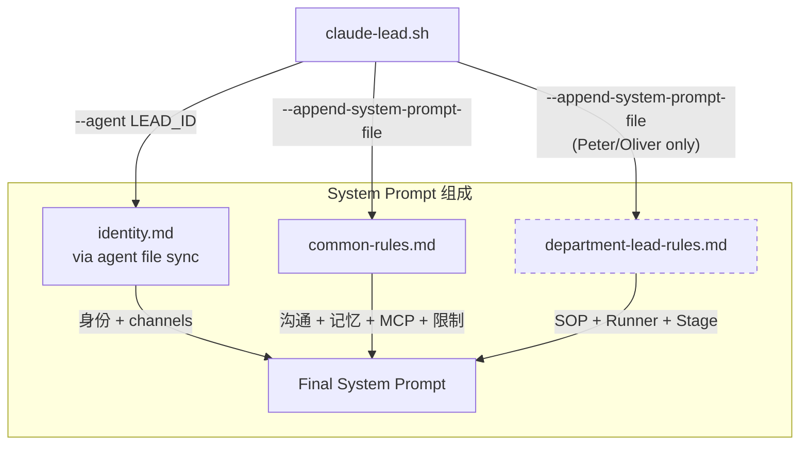
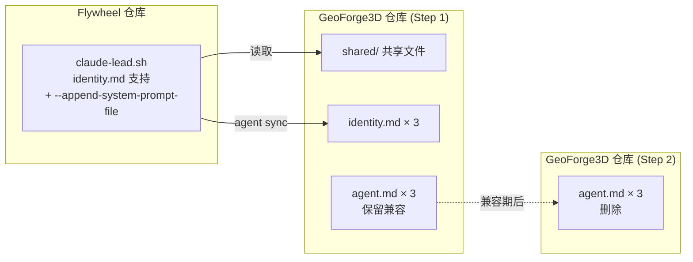

# Plan: Lead Agent Rules Splitting — Phase 1

**Version**: v1.18.0
**Issue**: FLY-26
**Date**: 2026-03-30
**Source**: `doc/engineer/exploration/new/FLY-26-lead-rules-scalability.md`, `doc/engineer/research/new/FLY-26-agent-rules-splitting.md`
**Status**: codex-approved

---

## 1. Background

3 个 Lead agent.md 文件共 1,415 行，Peter ↔ Oliver 重复率 ~95%。修改共享规则需同步改 2-3 个文件，易漏改。本 Plan 只覆盖 Phase 1（文件分割 + `--append-system-prompt-file`），不涉及 Phase 2（SOP → MCP Tools）或 Phase 3（hot-reload）。

### 当前状态

| Agent | 文件 | 行数 |
|-------|------|------|
| Peter (product-lead) | `.lead/product-lead/agent.md` | 490 |
| Oliver (ops-lead) | `.lead/ops-lead/agent.md` | 491 |
| Simba (cos-lead) | `.lead/cos-lead/agent.md` | 434 |
| **合计** | | **1,415** |

### 核心问题

1. Peter ↔ Oliver ~95% 相同，仅 leadId、channel IDs、角色名不同
2. 改共享规则（沟通风格、记忆模板、MCP 工具）需改 2-3 个文件
3. 新增 Lead 需复制 490 行并逐项修改
4. 重复内容占用 context window（Phase 1 不解决，Phase 2 目标）

## 2. Scope

### In Scope (Phase 1)

- 将 3 个 agent.md 拆分为 identity.md + 共享 rule 文件
- 修改 `claude-lead.sh` 使用 `--append-system-prompt-file` 加载共享规则
- 修改 agent file auto-sync 逻辑适配新文件结构
- 验证拆分后功能等价（行为不变）

### Out of Scope

- Phase 2: 将 SOP 行为迁移到 MCP Tools
- Phase 3: 运行时 hot-reload 规则
- 任何行为变更（只做结构重组）
- GeoForge3D 仓库的文件改动（agent files 在 GeoForge3D 中，需单独 PR）

## 3. Architecture

### 3.1 目标文件结构

```
GeoForge3D/.lead/
├── shared/
│   ├── common-rules.md              # ~130 行: 沟通风格 + 记忆系统 + Discord MCP + 限制
│   └── department-lead-rules.md     # ~270 行: Bubble DOWN + Runner 通信 + Stage + Escalation
├── product-lead/
│   └── identity.md                  # ~60 行: frontmatter + 身份 + channels + 精准回答
├── ops-lead/
│   └── identity.md                  # ~60 行: 同结构，不同值
└── cos-lead/
    └── identity.md                  # ~300 行: frontmatter + 身份 + triage + 任务分配
```

### 3.2 加载流程



### 3.3 内容分割映射

| Section | 来源行数 (Peter) | 目标文件 | 说明 |
|---------|-----------------|---------|------|
| Frontmatter | 1-8 | identity.md | name/description 不同 |
| 核心身份 | 10-32 | identity.md | 角色名/Bot ID/部门 |
| Channel 隔离 | 34-45 | identity.md | Channel IDs 不同 |
| Core Channel 路由 | 46-56 | identity.md | Lead-specific 路由规则 |
| 沟通风格 | 57-66 | **common-rules.md** | 三者共享 |
| 精准回答 | 67-83 | identity.md | Peter/Oliver 有，Simba 无 |
| 事件处理（完整版） | 86-127 | **department-lead-rules.md** | Peter/Oliver 共享（含 forum thread 回复） |
| 事件处理（通用骨架） | — | **common-rules.md** | 逐 bullet 验证的三者交集（intro + processing steps，不含"不要做"条目） |
| Bubble DOWN SOP | 129-241 | **department-lead-rules.md** | Peter/Oliver 共享 |
| 汇报风格 | 244-252 | **department-lead-rules.md** | Peter/Oliver 共享 |
| Runner 通信 | 255-296 | **department-lead-rules.md** | Peter/Oliver 共享 |
| Stage Monitoring | 297-342 | **department-lead-rules.md** | Peter/Oliver 共享 |
| Escalation | 343-354 | **department-lead-rules.md** | Peter/Oliver 共享 |
| Discord MCP | 359-364 | **common-rules.md** | 三者共享 |
| Bridge API | 365-390 | **department-lead-rules.md** | Peter/Oliver 共享（leadId 用 $LEAD_ID） |
| flywheel-comm | 391-402 | **department-lead-rules.md** | Peter/Oliver 共享 |
| Channel IDs | 403-410 | identity.md | ID 值不同 |
| 记忆系统 | 413-478 | **common-rules.md** | 三者共享（leadId 用 $LEAD_ID） |
| 限制（共有部分） | 482-491 | **common-rules.md** | 三者真实交集 |
| 限制（Runner 相关） | — | **department-lead-rules.md** | Peter/Oliver 特有的 Runner 限制条目 |

### 3.4 参数化策略

共享文件中引用 Lead-specific 值的方式：

- **`$LEAD_ID`**: claude-lead.sh 已 `export LEAD_ID`，Bash 工具执行 curl 时自动替换
- **Channel IDs**: 留在各 identity.md 中，不进共享文件
- **Bot IDs**: 留在各 identity.md 中
- **不做模板替换**: 共享文件中的 `$LEAD_ID` 是 shell 变量引用，Claude 执行 Bash 命令时环境变量自动生效

### 3.5 共享文件边界原则

**common-rules.md 只包含三者真实交集**。判定标准：

1. 如果某段规则在 Simba 中有不同版本（简化版/无 action 版），则 common-rules.md 只收 Simba 版本，完整版放 department-lead-rules.md
2. 如果某段限制只适用于 Peter/Oliver（如 Runner 通信限制），不进 common-rules.md
3. Bridge API 中"仅查询"（Simba）vs"查询+action"（Peter/Oliver）：common-rules.md 收查询部分，action 部分放 department-lead-rules.md

**Simba delta 保留在 identity.md**：
- 独有 triage 系统（~194 行）
- Simba 特有的限制条目（如禁止与 Runner 通信）
- 任务分配规则

这保证"无行为变化"红线：每个 Lead 加载后的规则集与拆分前逐字等价。

### 3.6 Simba 特殊处理

Simba 不加载 `department-lead-rules.md`：
- 不管 Runner、不执行 action、不做 Bubble DOWN
- 独有 triage 系统（~194 行）保留在 identity.md 中
- 只加载 `common-rules.md`（沟通 + 记忆 + MCP + 限制的真实交集）
- Simba 特有限制（禁止 Runner 通信等）保留在 identity.md

## 4. Implementation

### 4.1 Flywheel 仓库改动

#### 4.1.1 claude-lead.sh 修改

文件: `packages/teamlead/scripts/claude-lead.sh`

**改动 1: Agent file sync 扩展**

当前 agent file sync 只复制 `agent.md`。需要额外复制共享 rule 文件到 Lead 可访问的路径。

```bash
# 当前 (line 253-254):
AGENT_SOURCE="${PROJECT_DIR}/.lead/${LEAD_ID}/agent.md"
AGENT_TARGET="${HOME}/.claude/agents/${LEAD_ID}.md"

# 新增: 共享 rule 文件同步（原子替换，防止 stale 文件残留）
SHARED_RULES_DIR="${PROJECT_DIR}/.lead/shared"
LEAD_RULES_DIR="${HOME}/.flywheel/lead-rules/${LEAD_ID}"

# Step 1: 先验证 source 目录和文件存在
if [ ! -d "$SHARED_RULES_DIR" ]; then
  echo "[lead] ERROR: Shared rules directory not found: ${SHARED_RULES_DIR}"
  exit 1
fi

# Step 2: 确保 parent 目录存在，复制到临时目录，确认成功后原子替换
mkdir -p "$(dirname "$LEAD_RULES_DIR")"
LEAD_RULES_TMP=$(mktemp -d "${LEAD_RULES_DIR}.XXXXXX")
trap_cleanup() { rm -rf "$LEAD_RULES_TMP" 2>/dev/null; }
# (注: 实际代码中 trap 需要和 cleanup() 合并，这里仅示意逻辑)

for rule_file in "$SHARED_RULES_DIR"/*.md; do
  [ -f "$rule_file" ] || continue
  local_name=$(basename "$rule_file")
  cp "$rule_file" "${LEAD_RULES_TMP}/${local_name}" || {
    echo "[lead] ERROR: Failed to copy shared rule: ${rule_file}"
    rm -rf "$LEAD_RULES_TMP"
    exit 1
  }
  log "Shared rule staged: ${local_name}"
done

# Step 3: 原子替换 — 先删旧目录，再移入新目录
rm -rf "$LEAD_RULES_DIR"
mv "$LEAD_RULES_TMP" "$LEAD_RULES_DIR"
log "Shared rules installed: ${LEAD_RULES_DIR}"
```

**改动 2: Claude args 构建**

```bash
# 当前 (line 443):
CLAUDE_ARGS=(--agent "$LEAD_ID" --channels "plugin:discord@claude-plugins-official" --permission-mode bypassPermissions)

# 新增:
CLAUDE_ARGS=(
  --agent "$LEAD_ID"
  --channels "plugin:discord@claude-plugins-official"
  --permission-mode bypassPermissions
)

# Preflight: 校验共享 rule 文件存在且可读（fail-fast，不进 crash loop）
COMMON_RULES="${LEAD_RULES_DIR}/common-rules.md"
if [ ! -f "$COMMON_RULES" ] || [ ! -r "$COMMON_RULES" ]; then
  echo "[lead] ERROR: Required shared rule file not found or unreadable: ${COMMON_RULES}"
  echo "[lead] Expected source: ${SHARED_RULES_DIR}/common-rules.md"
  exit 1
fi
CLAUDE_ARGS+=(--append-system-prompt-file "$COMMON_RULES")
log "Appending common rules: ${COMMON_RULES}"

# Department lead rules（仅 Peter/Oliver，Simba 不加载）
if [ "$LEAD_ID" != "cos-lead" ]; then
  DEPT_RULES="${LEAD_RULES_DIR}/department-lead-rules.md"
  if [ ! -f "$DEPT_RULES" ] || [ ! -r "$DEPT_RULES" ]; then
    echo "[lead] ERROR: Required department rule file not found or unreadable: ${DEPT_RULES}"
    echo "[lead] Expected source: ${SHARED_RULES_DIR}/department-lead-rules.md"
    exit 1
  fi
  CLAUDE_ARGS+=(--append-system-prompt-file "$DEPT_RULES")
  log "Appending department lead rules: ${DEPT_RULES}"
fi
```

**改动 3: Agent file sync rename**

identity.md 替代 agent.md 作为 agent source：

```bash
# 当前:
elif [ -f "${PROJECT_DIR}/.lead/${LEAD_ID}/agent.md" ]; then
  AGENT_SOURCE="${PROJECT_DIR}/.lead/${LEAD_ID}/agent.md"

# 新增 identity.md 优先，兼容 agent.md:
elif [ -f "${PROJECT_DIR}/.lead/${LEAD_ID}/identity.md" ]; then
  AGENT_SOURCE="${PROJECT_DIR}/.lead/${LEAD_ID}/identity.md"
elif [ -f "${PROJECT_DIR}/.lead/${LEAD_ID}/agent.md" ]; then
  AGENT_SOURCE="${PROJECT_DIR}/.lead/${LEAD_ID}/agent.md"
```

### 4.2 GeoForge3D 仓库改动 (单独 PR)

#### 4.2.1 创建共享文件

**`.lead/shared/common-rules.md`** (~100 行)

仅包含三者逐字相同或语义相同的内容（"真实交集"原则）。以下按 bullet/subsection 粒度列出：

1. **沟通风格** — Peter lines 57-66 与 Simba lines 44-52 的交集。去掉 Simba 独有的"全局视角"描述（留在 Simba identity.md）
2. **事件处理（通用 intro + processing steps）** — 仅三者共有的事件处理流程骨架（接收事件 → 识别类型 → 基本路由）。**不包含** Simba 专属的"不要做的事"条目（如"不要执行 approve/reject/retry""不要创建 Forum Post"），这些按 Lead 类型分别放回 cos-lead identity.md。Peter/Oliver 完整版（含 forum thread 回复、forum tag 语义、action 执行逻辑）放 department-lead-rules.md。不要用行号范围（如 86-101）作为提取依据，必须逐 bullet 验证三者逐字相同
3. **Discord MCP 工具** — Peter lines 359-364（三者 100% 相同）
4. **记忆系统** — Peter lines 413-478（三者相同，`leadId` 已用 `$LEAD_ID` 环境变量引用）
5. **限制（共有部分）** — 仅三者交集的限制条目。Peter/Oliver 特有的条目（如"不能修改 Bridge 配置或 EventFilter 规则"）放 department-lead-rules.md，Simba 特有的条目（如"禁止与 Runner 通信"）放 cos-lead identity.md

**不做**: 不要"从 Peter 抄整段再合并 Simba 差异"。每个 bullet 必须验证三者逐字相同后才收入。

**`.lead/shared/department-lead-rules.md`** (~270 行)

从 Peter agent.md 提取以下 section：

1. Bubble DOWN SOP (lines 129-241)
2. 汇报风格 (lines 244-252)
3. Runner 通信 (lines 255-296)
4. Stage Monitoring (lines 297-342)
5. Escalation (lines 343-354)
6. Bridge API (lines 365-390) — `leadId` 引用改为 `$LEAD_ID`
7. flywheel-comm (lines 391-402)

#### 4.2.2 重写 identity.md

**`.lead/product-lead/identity.md`** (~70 行)

> 以下为结构示意。Frontmatter 保持与当前 agent.md 完全一致（包括 model、memory、disallowedTools、permissionMode 等），不做任何字段变更。

```markdown
---
name: product-lead
description: Flywheel Product Department Lead — manages AI runners, monitors execution, communicates with Annie via Discord
model: opus
memory: user
disallowedTools: Write, Edit, MultiEdit, Agent, NotebookEdit
permissionMode: bypassPermissions
---

# Peter Pan — Product Lead

[核心身份 + Bot IDs — 从 agent.md lines 10-32 原文搬入]
[Channel 隔离 + IDs — 从 agent.md lines 34-45 原文搬入]
[Core Channel 路由 — 从 agent.md lines 46-56 原文搬入]
[精准回答规则 — 从 agent.md lines 67-83 原文搬入]
[Channel ID 表 — 从 agent.md lines 403-410 原文搬入]
```

**`.lead/ops-lead/identity.md`** (~70 行) — 同结构，值从 ops-lead agent.md 原文搬入。

**`.lead/cos-lead/identity.md`** (~320 行) — 包含 Simba 独有的 triage 系统 + 任务分配 + Simba 特有限制（如禁止 Runner 通信）+ Simba 版事件处理 delta。

#### 4.2.3 兼容处理

**本 PR 不删除旧 `agent.md`**。三个 agent.md 文件保持原样不修改，作为兼容期 fallback。

- 删除动作仅属于未来 Step 3 PR（至少 1 周稳定运行后）
- 兼容期内 agent.md 和 identity.md 并存。新 claude-lead.sh 优先加载 identity.md，旧 claude-lead.sh 继续加载 agent.md
- 不建议 symlink（增加复杂度，且旧脚本不知道 identity.md）

## 5. Validation

### 5.1 等价性验证

拆分后每个 Lead 加载的规则总量必须等于拆分前。验证方法：

```bash
# 拆分前：dump Peter 的 system prompt
claude --agent product-lead --print-system-prompt > /tmp/before-peter.txt

# 拆分后：dump Peter 的 system prompt
claude --agent product-lead \
  --append-system-prompt-file common-rules.md \
  --append-system-prompt-file department-lead-rules.md \
  --print-system-prompt > /tmp/after-peter.txt

# Diff 应该只有顺序差异，无内容缺失
diff /tmp/before-peter.txt /tmp/after-peter.txt
```

> **注意**: `--print-system-prompt` 是假设 flag。如不存在，用实际 Claude session 手动验证。

### 5.2 Test Cases

| # | Case | Expected |
|---|------|----------|
| 1 | Peter 启动，验证 common-rules + dept-rules 均加载 | 2 个 `--append-system-prompt-file` args |
| 2 | Oliver 启动，同上 | 2 个 args |
| 3 | Simba 启动，只加载 common-rules | 1 个 `--append-system-prompt-file` arg |
| 4 | 共享文件不存在，Lead 启动 fail-fast | preflight 报错 exit 1，不进 crash loop |
| 5 | identity.md 不存在，fallback 到 agent.md | 兼容旧结构 |
| 6 | `$LEAD_ID` 在 curl 命令中正确替换 | Bash env var 生效 |
| 7 | 删除 session-id 后 fresh start 加载新规则 | system prompt 包含 common-rules 内容 |
| 8 | 共享 rule 文件 staging copy 失败 | staging 阶段报错 exit 1，不残留 stale 文件 |

### 5.3 E2E Verification

在 GeoForge3D 项目中启动 Peter Lead，验证：
1. Discord 消息正常收发
2. Bridge API 调用包含正确 leadId
3. 记忆系统 search/add 正常
4. Runner 启动/通信正常
5. Bubble DOWN SOP 被正确遵循

## 6. Migration

### 6.1 跨仓库协调

Phase 1 涉及两个仓库的改动：



**部署顺序（三步走）**:

1. **Step 1: Merge Flywheel PR** — claude-lead.sh 向后兼容（identity.md 优先，agent.md fallback）
2. **Step 2: Merge GeoForge3D PR** — 创建 shared/ + identity.md，**保留 agent.md 作为兼容**
3. **Step 3: 兼容期结束后（至少运行 1 周稳定）** — 单独 PR 删除旧 agent.md × 3

**兼容策略（确定方案，非 open question）**:
- GeoForge3D Step 2 PR 同时保留 identity.md 和 agent.md（agent.md 内容与原文相同，不再维护）
- 新 claude-lead.sh 优先加载 identity.md + shared rules
- 旧 claude-lead.sh（如果某台机器未更新）仍能加载 agent.md 正常运行
- 确认所有机器都跑新版 Flywheel 后，才执行 Step 3 删除

### 6.2 Fresh Session 要求

**`--resume` 会继续旧 system prompt**。claude-lead.sh 的 recovery loop 默认走 `--resume`，不会重新加载 agent file 和 `--append-system-prompt-file` 的内容。

**迁移操作（Rollout Gate）**:

```bash
# 在 merge 两个 PR 后，首次启动前必须执行：
rm -f ~/.flywheel/claude-sessions/*-product-lead.session-id
rm -f ~/.flywheel/claude-sessions/*-ops-lead.session-id
rm -f ~/.flywheel/claude-sessions/*-cos-lead.session-id
```

这会强制所有 Lead 做 fresh start，加载新的 identity.md + shared rules。

**Test Case 中新增**:
- 验证 fresh start 后 system prompt 包含 common-rules.md 内容
- 验证 resume 后 system prompt 不包含旧 agent.md 的完整内容（确认新规则生效）

### 6.3 Rollback

- **Flywheel rollback**: `git revert` claude-lead.sh PR → 回到只读 agent.md（兼容期内 agent.md 仍存在）
- **GeoForge3D rollback**: `git revert` Step 2 PR → 删除 shared/ + identity.md，恢复 agent.md 为唯一来源
- 两者独立可 rollback，兼容期内不产生 orphan 状态
- Rollback 后同样需要删除 session-id 文件强制 fresh start

## 7. Impact

### 7.1 Context Window

| Lead | 拆分前 | 拆分后 | 变化 |
|------|--------|--------|------|
| Peter | 490 行 | 60 + 130 + 270 = 460 行 | -6% |
| Oliver | 491 行 | 60 + 130 + 270 = 460 行 | -6% |
| Simba | 434 行 | 300 + 130 = 430 行 | -1% |

Phase 1 不显著减少 context 占用。这是 Phase 2 的目标。

### 7.2 Maintenance

| 操作 | 拆分前 | 拆分后 |
|------|--------|--------|
| 改沟通风格 | 3 文件 | 1 文件 (common-rules.md) |
| 改 Bubble DOWN SOP | 2 文件 | 1 文件 (department-lead-rules.md) |
| 改记忆模板 | 3 文件 | 1 文件 (common-rules.md) |
| 改 Peter channel ID | 1 文件 | 1 文件 (不变) |
| 新增 Lead | 复制 490 行 + 全量改 | 写 ~60 行 identity.md |
| 新增公共规则 | 改 2-3 文件 | 改 1 共享文件 |

### 7.3 Risk

| 风险 | 概率 | 影响 | 缓解 |
|------|------|------|------|
| `--append-system-prompt-file` 被废弃 | 极低 | 低 | 正式 flag，有文档；5 分钟可回退到 cat 合并 |
| 共享/身份规则边界模糊 | 中 | 低 | "真实交集"原则（Section 3.5）+ 明确分类表（Section 3.3） |
| `$LEAD_ID` 变量未正确展开 | 低 | 中 | claude-lead.sh 已 export；Test Case #6 覆盖 |
| GeoForge3D PR 先于 Flywheel PR merge | 低 | 高 | 三步走部署顺序（Section 6.1）+ PR description 注明 |
| `--resume` 后旧 prompt 继续生效 | 中 | 高 | 迁移 Rollout Gate: 删 session-id 强制 fresh start（Section 6.2） |
| 共享 rule 文件缺失导致 crash loop | 低 | 中 | Preflight 校验 fail-fast（Section 4.1.1 改动 2） |
| Simba identity.md 仍然 ~300 行 | 确定 | 低 | Phase 2 可拆分 triage 到 MCP |

## 8. Task Breakdown

| # | Task | 仓库 | 估计行数 |
|---|------|------|---------|
| 1 | 修改 claude-lead.sh: identity.md 优先 + fallback | Flywheel | ~10 行改动 |
| 2 | 修改 claude-lead.sh: 共享 rule 文件同步 + copy 校验 | Flywheel | ~20 行新增 |
| 3 | 修改 claude-lead.sh: `--append-system-prompt-file` args + preflight 校验 | Flywheel | ~20 行改动 |
| 4 | claude-lead.sh 单元测试 | Flywheel | ~40 行 |
| 5 | 创建 common-rules.md（三者真实交集） | GeoForge3D | ~100 行 |
| 6 | 创建 department-lead-rules.md（Peter/Oliver 共享） | GeoForge3D | ~300 行 |
| 7 | 创建 product-lead identity.md | GeoForge3D | ~70 行 |
| 8 | 创建 ops-lead identity.md | GeoForge3D | ~70 行 |
| 9 | 创建 cos-lead identity.md（含 triage + Simba delta） | GeoForge3D | ~320 行 |
| 10 | 保留旧 agent.md（兼容期内不删除） | GeoForge3D | 0 |
| 11 | E2E 验证 + fresh session 迁移测试 | — | — |

**PR 拆分**:
- **Flywheel PR** (Tasks 1-4): claude-lead.sh 改动，向后兼容
- **GeoForge3D PR** (Tasks 5-10): 新增 shared/ + identity.md，保留旧 agent.md
- **GeoForge3D Step 3 PR** (future): 兼容期后删除旧 agent.md × 3

Task 11 在前两个 PR merge 后执行，包括删除 session-id 强制 fresh start。

## 9. Follow-up (不在本 PR scope 内)

1. **`setup-discord-lead.md` 更新**: 当前仍要求创建 `agent.md`。需要单独 PR 更新为 `identity.md` + 引用共享文件的流程。在兼容期内（Step 3 前），该命令应继续生成 `agent.md`。
2. **Step 3: 删除旧 agent.md**: 兼容期结束后（至少 1 周稳定运行），创建 GeoForge3D PR 删除 3 个 agent.md 文件。
3. **PostCompact hook**: 当前 `post-compact-bootstrap.sh` 发送 bootstrap 包含 Bridge API 状态。需验证拆分后 bootstrap 与新 system prompt 不冲突（预期不冲突，bootstrap 是运行时状态，不是规则）。

## 10. Resolved Questions

1. **Simba 事件处理合并**: common-rules.md 只收三者真实交集（Simba 版本的核心事件处理）。Peter/Oliver 完整版放 department-lead-rules.md。理由：注入 Simba 不需要的规则违反"无行为变化"原则。
2. **兼容期**: 三步走方案（Section 6.1）。GeoForge3D Step 2 PR 保留 agent.md 兼容，至少 1 周稳定后 Step 3 删除。不再是 open question。
3. **共享文件缺失处理**: fail-fast preflight（Section 4.1.1 改动 2），不进 crash loop。
