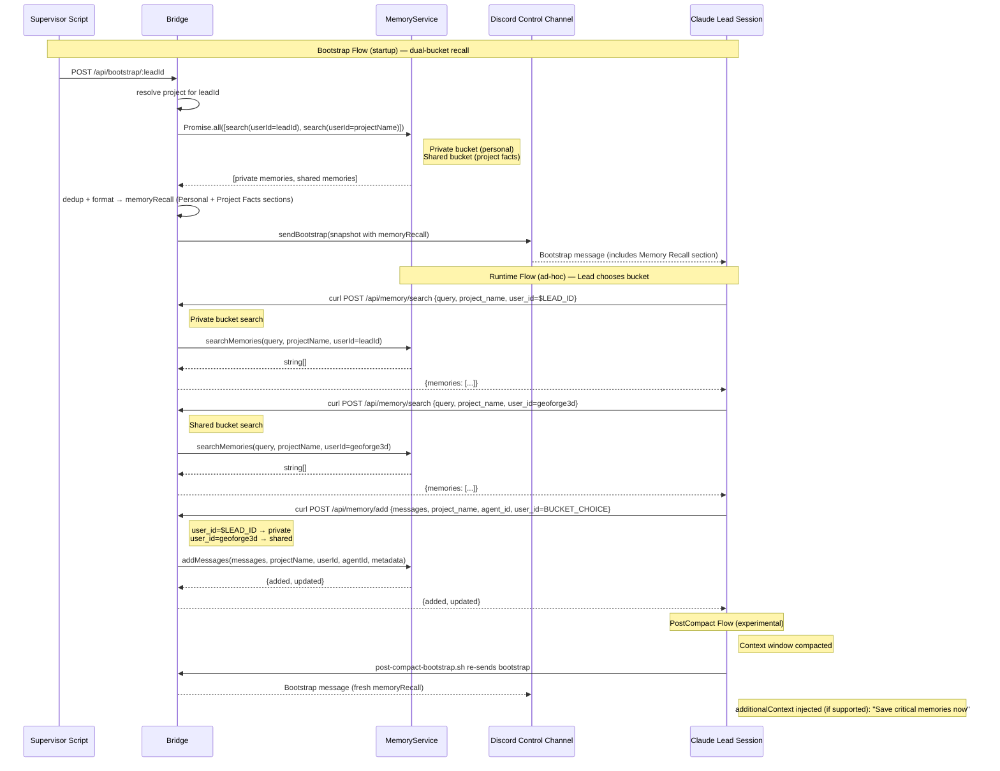
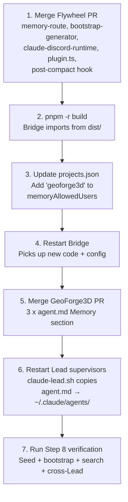

# Plan: Claude Lead mem0 Memory Integration

**Version**: v1.18.0
**Issue**: GEO-203
**Date**: 2026-03-30
**Source**: `doc/engineer/exploration/new/GEO-203-claude-lead-mem0-memory.md`, `doc/engineer/research/new/GEO-203-claude-lead-mem0-memory.md`
**Status**: codex-approved (6 rounds: R1-R3 original, R4-R6 dual-bucket redesign)
**Review**: R1 — 5 issues. R2 — 3 issues. R3 — APPROVED. R4 — 4 issues (dual-bucket redesign, PostCompact hardcode, timeout budget, ProjectConfig tests, cross-bootstrap). R5 — 2 issues (chunk analysis, test matrix). R6 — APPROVED (Gemini, Codex rate-limited).

## Overview

Give all 3 Claude Lead sessions (Peter/product-lead, Oliver/ops-lead, Simba/cos-lead) mem0 memory read/write ability via a **dual-bucket model**: each Lead has a private memory bucket for personal decisions/experience, plus a shared project-wide bucket for facts visible to all Leads. Both backed by the same Supabase pgvector memory layer.

Three dimensions:

1. **Bootstrap recall** — Bridge server-side preloads layered memories at startup (role-specific + project-wide, parallelized)
2. **Runtime access** — Leads use Bash curl to directly call Bridge Memory API for ad-hoc reads/writes
3. **PostCompact checkpoint** — (Experimental) Hook injects additionalContext reminding Lead to save critical memories after context compression

**Core decision**: Bash curl direct call (not MCP server). Rationale: simple I/O, single-user, stateless, zero extra processes, LLM curl proficiency is high.

## Architecture



## Decisions (from Brainstorm + Research)

| Decision | Choice | Rationale |
|----------|--------|-----------|
| Approach | Bash curl direct call | Zero new code/processes, fast, low token, bypassPermissions = zero friction |
| Write format | Natural language + optional metadata (Format D) | Best mem0 extraction quality, metadata for future filtering |
| **user_id** | **Hybrid dual-bucket** — private (`$LEAD_ID`) + shared (`geoforge3d`) | Annie directive: Leads need personal memory (decisions, experience) isolated per-Lead, plus shared project facts (PR status, architecture decisions). Private bucket = `userId=$LEAD_ID`; shared bucket = `userId="geoforge3d"`. (Round 4 redesign: pure shared bucket merged personal+project memories, losing Lead personality) |
| Bootstrap recall | Parallel (Promise.allSettled) private + shared | Dual-bucket parallel recall, 5s timeout each, soft limit 1500 chars. Worst-case ~11s (within 15s curl budget) |
| PostCompact | **Experimental** — verify additionalContext support first | GEO-285 archive notes known issues with hook additionalContext. Gate behind smoke test. |
| Coverage | All 3 Leads (Peter, Oliver, Simba) | Annie confirmed |
| Version | v1.18.0 | Sprint-shared version |
| Agent files | **3 root-level agent.md only** | Supervisor loads from `PROJECT_DIR/.lead/<lead-id>/agent.md`. Department subdirectory copies are not in the runtime load path. |

## mem0 Identity Model (Round 4 — dual-bucket redesign)

```
mem0 identity mapping:
  app_id   = projectName       (per-project — already wired via MemoryService)
  agentId  = leadId            (per-Lead — source attribution on all writes)

Two memory buckets per Lead:

  PRIVATE bucket (personal decisions, experience, judgments):
    userId   = leadId           (e.g. "product-lead")
    agentId  = leadId           (source attribution)
    Isolated: only this Lead can see its own private memories

  SHARED bucket (project facts: PR merged, issue status, architecture decisions):
    userId   = "geoforge3d"    (project-level — all Leads can read)
    agentId  = leadId           (source attribution — who wrote it)

Search scopes:
  Private (own memories):  userId=$LEAD_ID                        → only this Lead's personal memories
  Shared (all project):    userId="geoforge3d" + no agentId       → all project-wide facts from all Leads
  Shared (by source):      userId="geoforge3d" + agentId=$LEAD_ID → project facts written by a specific Lead

Write targets:
  Private: userId=$LEAD_ID,     agentId=$LEAD_ID → personal decision/experience
  Shared:  userId="geoforge3d", agentId=$LEAD_ID → project fact visible to all Leads
```

**Config prerequisite**: `memoryAllowedUsers` must include both lead IDs (private bucket) and project name (shared bucket):
```json
"memoryAllowedUsers": ["annie", "product-lead", "ops-lead", "cos-lead", "geoforge3d"]
```

Lead IDs are already present. Only `"geoforge3d"` needs to be added.

## Implementation Steps

### Step 1: Memory route — agent_id optional for search (TDD)

**File**: `packages/teamlead/src/bridge/memory-route.ts`
**Test**: `packages/teamlead/src/__tests__/memory-route.test.ts`

**Change**: `/api/memory/search` — `agent_id` from required to optional. `user_id` stays required.

```typescript
// Before:
if (!isNonEmptyString(agent_id)) {
  res.status(400).json({ error: "agent_id must be a non-empty string" });
  return;
}

// After:
if (agent_id !== undefined && !isNonEmptyString(agent_id)) {
  res.status(400).json({ error: "agent_id must be a non-empty string if provided" });
  return;
}
```

Also extend `validateMemoryIds()` to support optional `agentId` (Round 2 fix — avoid duplicating validation logic in the route):

**File**: `packages/teamlead/src/ProjectConfig.ts`

```typescript
// Rename existing function and make agentId optional:
export function validateMemoryIds(
  projects: ProjectEntry[],
  projectName: string,
  agentId: string | undefined,  // Round 2: optional for search
  userId: string,
): { valid: true } | { valid: false; error: string } {
  const project = projects.find((p) => p.projectName === projectName);
  if (!project) {
    return { valid: false, error: `unknown project_name: "${projectName}"` };
  }
  // agentId validation only when provided (search can omit for cross-agent queries)
  if (agentId !== undefined) {
    const knownAgents = project.leads.map((l) => l.agentId);
    if (!knownAgents.includes(agentId)) {
      return { valid: false, error: `unknown agent_id: "${agentId}" for project "${projectName}"` };
    }
  }
  if (!project.memoryAllowedUsers) {
    return { valid: false, error: `memory not configured for project "${projectName}" (missing memoryAllowedUsers)` };
  }
  if (!project.memoryAllowedUsers.includes(userId)) {
    return { valid: false, error: `unknown user_id: "${userId}" for project "${projectName}"` };
  }
  return { valid: true };
}
```

Then in `memory-route.ts`, the search endpoint simply calls:
```typescript
const idCheck = validateMemoryIds(projects, project_name, agent_id ?? undefined, user_id);
if (!idCheck.valid) { res.status(400).json({ error: idCheck.error }); return; }
```

This preserves fail-closed semantics (missing `memoryAllowedUsers` → rejection) and avoids duplicating validation logic.

**Direct unit tests for `validateMemoryIds()`** (in `packages/teamlead/src/__tests__/ProjectConfig.test.ts` — extend existing test suite):
1. `agentId = undefined` + `userId = "geoforge3d"` → valid (shared bucket search — the core dual-bucket contract change)
2. `agentId = undefined` + `userId = "product-lead"` → valid (private bucket search, no agent check)
3. `agentId = undefined` + `userId = "unknown-user"` → invalid (optional agentId does NOT relax user allowlist)
4. `agentId = "product-lead"` + `userId = "product-lead"` → valid (private bucket with explicit agent)
5. `agentId = "product-lead"` + `userId = "geoforge3d"` → valid (shared bucket with agent attribution)
6. `agentId = "unknown-agent"` + `userId = "geoforge3d"` → invalid (agent not in leads)
7. Missing `memoryAllowedUsers` → invalid (fail-closed, regardless of agentId)

Pass `agentId` as `agent_id || undefined` to `searchMemories()`.

`/api/memory/add` — NO CHANGES. `agent_id` stays required (writes must tag source).

**Note on dual-bucket at route level**: The route itself doesn't need to know about the dual-bucket model — it just validates `user_id` against `memoryAllowedUsers` (which includes both lead IDs and `"geoforge3d"`). Bucket selection is the Lead's choice at call time via the `user_id` field.

**Tests (write first)**:
1. Search without `agent_id` → 200 + memories
2. Search with empty string `agent_id` → 400
3. Search with `agent_id: undefined` (not in body) → 200
4. Add without `agent_id` → 400 (unchanged)
5. Existing search tests still pass
6. **Search with `user_id="product-lead"` (private bucket) → 200** (Round 4 — lead IDs are valid userIds)
7. **Search with `user_id="geoforge3d"` (shared bucket) → 200** (Round 4)
8. **Add with `user_id="product-lead"` (private write) → 200** (Round 4)

### Step 2: Bootstrap generator — parallel layered recall (TDD)

**File**: `packages/teamlead/src/bridge/bootstrap-generator.ts`
**Test**: `packages/teamlead/src/__tests__/bootstrap-generator.test.ts`

**2a. Add `memoryService` optional parameter:**

```typescript
export async function generateBootstrap(
  leadId: string,
  store: StateStore,
  projects: ProjectEntry[],
  memoryService?: MemoryService,  // NEW
): Promise<LeadBootstrap>
```

**2b. New `findProjectForLead()` helper (Round 1 fix — correct project resolution):**

```typescript
function findProjectForLead(
  leadId: string,
  projects: ProjectEntry[],
): string | undefined {
  const project = projects.find(p =>
    p.leads.some(l => l.agentId === leadId)
  );
  return project?.projectName;
}
```

**2c. New `recallMemories()` helper — dual-bucket parallel recall:**

```typescript
async function recallMemories(
  memoryService: MemoryService,
  leadId: string,
  projects: ProjectEntry[],
): Promise<string | null> {
  const projectName = findProjectForLead(leadId, projects);
  if (!projectName) return null;

  const RECALL_TIMEOUT_MS = 5_000; // Round 4 fix: fits within curl --max-time 15 budget

  // Dual-bucket parallel recall:
  //   1. Private bucket (userId=leadId) — personal decisions, experience, judgments
  //   2. Shared bucket (userId=projectName) — project-wide facts from all Leads
  const [privateResult, sharedResult] = await Promise.allSettled([
    withTimeout(
      memoryService.searchMemories({
        query: "my recent decisions, experience, and learnings",
        projectName,
        userId: leadId,       // PRIVATE bucket — only this Lead's memories
        agentId: leadId,
        limit: 10,
      }),
      RECALL_TIMEOUT_MS,
    ),
    withTimeout(
      memoryService.searchMemories({
        query: "project facts, architecture decisions, and cross-team context",
        projectName,
        userId: projectName,  // SHARED bucket — all Leads' project-wide facts
        // no agentId → search all agents in shared bucket
        limit: 5,
      }),
      RECALL_TIMEOUT_MS,
    ),
  ]);

  const privateMems = privateResult.status === "fulfilled" ? privateResult.value : [];
  const sharedMems = sharedResult.status === "fulfilled" ? sharedResult.value : [];

  if (privateResult.status === "rejected") {
    console.warn(`[bootstrap] Private memory recall failed for ${leadId}: ${privateResult.reason}`);
  }
  if (sharedResult.status === "rejected") {
    console.warn(`[bootstrap] Shared memory recall failed for ${leadId}: ${sharedResult.reason}`);
  }

  // Dedup: remove shared items that overlap with private
  const privateSet = new Set(privateMems);
  const uniqueShared = sharedMems.filter(m => !privateSet.has(m));

  if (privateMems.length === 0 && uniqueShared.length === 0) return null;

  const sections: string[] = [];
  if (privateMems.length > 0) {
    sections.push("### Personal Memory (private)");
    sections.push(...privateMems.map(m => `- ${m}`));
  }
  if (uniqueShared.length > 0) {
    sections.push("### Project Facts (shared)");
    sections.push(...uniqueShared.map(m => `- ${m}`));
  }

  // Round 5 fix: soft limit to keep memoryRecall within 1-2 Discord chunks.
  // Bootstrap header (~400 chars) + memoryRecall must stay under ~3800 chars
  // (2 × 2000-char Discord limit) to keep sendBootstrap() at ≤2 POSTs.
  const MEMORY_RECALL_SOFT_LIMIT = 1500;
  const result = sections.join("\n");
  if (result.length > MEMORY_RECALL_SOFT_LIMIT) {
    return result.slice(0, MEMORY_RECALL_SOFT_LIMIT) + "\n\n*(truncated — search for more via Memory API)*";
  }
  return result;
}
```

**2d. Wire in `generateBootstrap()`:**

```typescript
const memoryRecall = memoryService
  ? await recallMemories(memoryService, leadId, projects)
  : null;
```

**`withTimeout` reuse**: Import from `memory-route.ts` or extract to a shared utility. If extraction is too noisy, inline an equivalent.

**Timeout budget (Round 4+5 fix)**: Recall uses `RECALL_TIMEOUT_MS = 5_000` (parallel, so worst-case = 5s). `MEMORY_RECALL_SOFT_LIMIT = 1500` chars ensures memoryRecall stays within 1-2 Discord chunks. Total bootstrap worst-case: state queries (~instant) + recall (5s) + Discord send (3s × 2 chunks max = 6s) = ~11s. Both client-side curl timeouts must be bumped from 10s to 15s:
- `packages/teamlead/scripts/claude-lead.sh` — fresh-start bootstrap curl `--max-time 10` → `--max-time 15`
- `packages/teamlead/scripts/post-compact-bootstrap.sh` — PostCompact bootstrap curl `--max-time 10` → `--max-time 15`

**Tests (write first)**:
1. No memoryService → `memoryRecall: null` (backward compat)
2. Private + shared both return → merged with both section headers ("Personal Memory" + "Project Facts"), deduped
3. Private has content, shared empty → personal memory only
4. Both empty → `memoryRecall: null`
5. memoryService throws → `memoryRecall: null`, other fields normal
6. Private timeout, shared succeeds → project facts only (graceful degradation)
7. Shared timeout, private succeeds → personal memory only
8. Shared has duplicates of private → deduped
9. **leadId not found in any project → `memoryRecall: null`** (Round 1 fix)
10. **Private search uses userId=leadId; shared search uses userId=projectName** (Round 4 dual-bucket)
11. **Private search includes agentId=leadId; shared search omits agentId** (Round 4 dual-bucket)

### Step 3: Bootstrap formatting — remove truncation (TDD)

**File**: `packages/teamlead/src/bridge/claude-discord-runtime.ts`
**Test**: `packages/teamlead/src/__tests__/claude-discord-runtime.test.ts`

**Change**: Remove 500-char truncation in `formatBootstrap()`:

```typescript
// Before:
sections.push(snapshot.memoryRecall.slice(0, 500));

// After:
sections.push(snapshot.memoryRecall);
```

`splitDiscordMessage()` already handles Discord 2000-char fragmentation in `sendBootstrap()`.

**Tests (write first)**:
1. `memoryRecall` up to 1500 chars → `sendBootstrap()` sends in ≤2 Discord POSTs (bootstrap header + memoryRecall)
2. First chunk contains `### Memory Recall` header
3. `memoryRecall` > 1500 chars → soft-truncated with "*(truncated — search for more)*" suffix (tested in bootstrap-generator tests)

### Step 4: Plugin.ts — pass memoryService to bootstrap

**File**: `packages/teamlead/src/bridge/plugin.ts`

**Change** (~1 line): Pass `memoryService` to `generateBootstrap()` at the bootstrap endpoint:

```typescript
// Before (line ~1123):
const snapshot = await generateBootstrap(leadId, store, projects);

// After:
const snapshot = await generateBootstrap(leadId, store, projects, memoryService);
```

`memoryService` is already available in `createBridgeApp()` scope (optional param, line 213).

**Test**: Integration test using a mock runtime that captures `sendBootstrap(snapshot)` calls. Assert that `snapshot.memoryRecall` is non-null when memoryService is provided and returns data. The bootstrap HTTP endpoint returns `{delivered: true, summary: {...}}` — it does NOT expose `memoryRecall` in the response body, so test via the mock runtime's `sendBootstrap` spy, not the HTTP response.

### Step 5: PostCompact hook — memory save reminder (EXPERIMENTAL)

**File**: `packages/teamlead/scripts/post-compact-bootstrap.sh`

**Prerequisite**: Verify PostCompact hook supports `additionalContext` output. Known issue: GEO-285 archive research notes reliability concerns with hook additionalContext in agent workflows.

**Step 5a: Smoke test** — Before implementing, manually test in a Lead session:
1. Create a test PostCompact hook that outputs `additionalContext` JSON
2. Trigger auto-compact
3. Verify the injected context appears in the Lead's conversation

**Step 5b: If verified**, append additionalContext JSON output after existing bootstrap curl:

```bash
# Memory save reminder via additionalContext injection
# (follows GEO-266 inbox-check.sh pattern)
MEMORY_REMINDER="CONTEXT COMPACTED — Memory Checkpoint

Your context window was just compacted. Critical information may have been lost.
Please save any important context to persistent memory NOW:

1. Active decisions and their reasoning
2. Key Annie instructions from this session
3. Current blockers or constraints discovered

Save to PRIVATE bucket (personal decisions/experience — user_id=\$LEAD_ID):
  curl -s -X POST \"\$BRIDGE_URL/api/memory/add\" \\
    -H \"Authorization: Bearer \$TEAMLEAD_API_TOKEN\" \\
    -H \"Content-Type: application/json\" \\
    -d '{\"messages\":[{\"role\":\"assistant\",\"content\":\"YOUR_MEMORY_HERE\"}],\"project_name\":\"\$PROJECT_NAME\",\"agent_id\":\"\$LEAD_ID\",\"user_id\":\"\$LEAD_ID\"}'

Save to SHARED bucket (project facts — user_id=\$PROJECT_NAME):
  curl -s -X POST \"\$BRIDGE_URL/api/memory/add\" \\
    -H \"Authorization: Bearer \$TEAMLEAD_API_TOKEN\" \\
    -H \"Content-Type: application/json\" \\
    -d '{\"messages\":[{\"role\":\"assistant\",\"content\":\"YOUR_MEMORY_HERE\"}],\"project_name\":\"\$PROJECT_NAME\",\"agent_id\":\"\$LEAD_ID\",\"user_id\":\"\$PROJECT_NAME\"}'
"

jq -n --arg ctx "$MEMORY_REMINDER" '{
  hookSpecificOutput: {
    hookEventName: "PostCompact",
    additionalContext: $ctx
  }
}'
```

**Step 5c: If NOT verified (additionalContext doesn't work for PostCompact)**, skip code changes. The memory save guidance is already in agent.md (Step 6). Bootstrap re-send already restores memory recall context.

### Step 6: Agent files — Memory section (GeoForge3D repo)

**Files** (3 root-level agent.md — the only files in the supervisor load path):
1. `.lead/product-lead/agent.md` — Peter
2. `.lead/ops-lead/agent.md` — Oliver
3. `.lead/cos-lead/agent.md` — Simba

**Note on department subdirectory copies** (`product/.lead/...`, `operations/.lead/...`): These are NOT in the supervisor's runtime load path. `claude-lead.sh` copies from `PROJECT_DIR/.lead/<lead-id>/agent.md` to `~/.claude/agents/`. Department copies are historical artifacts. Do not modify them in this PR to avoid doc drift. Consider a separate cleanup issue if sync is desired.

**Changes per file**:

**6a. Bridge API table** — Add 2 rows:

| Endpoint | Method | Description |
|----------|--------|-------------|
| `/api/memory/search` | POST | Search project memories |
| `/api/memory/add` | POST | Write memory |

**6b. New "记忆" section** (after Bridge API table):

```markdown
## 记忆

你有两个记忆桶（memory bucket），帮助你保持跨 session 的连续性。Bootstrap 启动时已预加载两个桶的记忆。

### 双桶模型

| 桶 | user_id | 用途 | 可见性 |
|----|---------|------|--------|
| **私有桶** | `$LEAD_ID` | 你的个人决策、经验、判断、教训 | 仅你自己 |
| **共享桶** | `geoforge3d` | 项目事实：PR merged、issue 状态、架构决定、Annie 指令 | 所有 Lead |

**写入时你必须选择桶**。问自己：这条记忆是我个人的经验/判断，还是全团队都该知道的项目事实？

### 何时搜索记忆

- 做重要决策前（approve/reject/retry），先查相关 issue 的历史
- Annie 问你上下文时，先查记忆
- 对某个 issue 不确定时，搜索相关记忆

### 何时写入记忆

**Must-write（每次都写）**:
- 做完重要决策后 → **私有桶**（决策 + 理由 + 你的判断）
- Annie 给出关键指示 → **共享桶**（团队都需要知道）
- PR merged / issue 状态变化 → **共享桶**
- 发现新的项目约束或架构 pattern → **共享桶**
- 个人踩坑/教训 → **私有桶**
- Context 被压缩后，保存关键状态 → 按内容分到对应桶

### 写入格式

用自然语言描述事实。可选加 metadata 标注 issue 和类型。

**写入私有桶**（个人决策/经验）:
```
curl -s -X POST "$BRIDGE_URL/api/memory/add" \
  -H "Authorization: Bearer $TEAMLEAD_API_TOKEN" \
  -H "Content-Type: application/json" \
  -d '{"messages":[{"role":"assistant","content":"NATURAL_LANGUAGE_DESCRIPTION"}],"project_name":"geoforge3d","agent_id":"'"$LEAD_ID"'","user_id":"'"$LEAD_ID"'","metadata":{"issue":"GEO-XXX","type":"decision"}}'
```

**写入共享桶**（项目事实）:
```
curl -s -X POST "$BRIDGE_URL/api/memory/add" \
  -H "Authorization: Bearer $TEAMLEAD_API_TOKEN" \
  -H "Content-Type: application/json" \
  -d '{"messages":[{"role":"assistant","content":"NATURAL_LANGUAGE_DESCRIPTION"}],"project_name":"geoforge3d","agent_id":"'"$LEAD_ID"'","user_id":"geoforge3d","metadata":{"issue":"GEO-XXX","type":"fact"}}'
```

### 搜索记忆（我的私有桶）

```
curl -s -X POST "$BRIDGE_URL/api/memory/search" \
  -H "Authorization: Bearer $TEAMLEAD_API_TOKEN" \
  -H "Content-Type: application/json" \
  -d '{"query":"describe what you want to find","project_name":"geoforge3d","agent_id":"'"$LEAD_ID"'","user_id":"'"$LEAD_ID"'"}'
```

### 搜索记忆（共享桶，全局，跨 Lead）

```
curl -s -X POST "$BRIDGE_URL/api/memory/search" \
  -H "Authorization: Bearer $TEAMLEAD_API_TOKEN" \
  -H "Content-Type: application/json" \
  -d '{"query":"describe what you want to find","project_name":"geoforge3d","user_id":"geoforge3d"}'
```
```

**Simba adaptation**: Same section content, same dual-bucket model. Simba 的私有桶存 triage 决策/经验，共享桶存协调结果/项目事实。

### Step 7: Config — memoryAllowedUsers update (preflight check)

**File**: `~/.flywheel/projects.json` (runtime config, not in repo)

**Current state**: `memoryAllowedUsers` already includes `["annie", "product-lead", "ops-lead", "cos-lead"]`.

**Required addition**: Add `"geoforge3d"` (the shared project-level userId):
```json
"memoryAllowedUsers": ["annie", "product-lead", "ops-lead", "cos-lead", "geoforge3d"]
```

**Preflight**: Verify this is set before integration testing. Bridge restart required after config change.

### Step 8: Integration verification

**Build**: `pnpm -r build` (Bridge imports from `dist/`)

**Preflight**: Bridge startup logs show `[Memory] Service enabled (Supabase pgvector)` and RuntimeRegistry registration messages.

**Manual verification steps**:

**Layer 1: Deterministic API verification** (automated unit/integration tests cover this):
- `validateMemoryIds()` with optional agentId
- Bootstrap generator returns `memoryRecall` content via mock runtime spy
- Search route returns 200 with/without agent_id
- Add route still rejects missing agent_id

**Layer 2: Manual end-to-end verification** with semantically aligned seed data:

1. **Seed private memory** (matches bootstrap private query "my recent decisions, experience"):
   ```bash
   curl -s -X POST http://localhost:9876/api/memory/add \
     -H "Authorization: Bearer $TEAMLEAD_API_TOKEN" \
     -H "Content-Type: application/json" \
     -d '{"messages":[{"role":"assistant","content":"Decision: approved GEO-203 PR after code review. My experience: dual-bucket memory design works well for isolating personal judgments from project facts."}],"project_name":"geoforge3d","agent_id":"product-lead","user_id":"product-lead"}'
   ```

2. **Seed shared memory** (matches bootstrap shared query "project facts, architecture decisions"):
   ```bash
   curl -s -X POST http://localhost:9876/api/memory/add \
     -H "Authorization: Bearer $TEAMLEAD_API_TOKEN" \
     -H "Content-Type: application/json" \
     -d '{"messages":[{"role":"assistant","content":"Project fact: all Leads must use Bridge API for Runner management. Architecture decision: dual-bucket memory model adopted — private per-Lead + shared project-wide."}],"project_name":"geoforge3d","agent_id":"ops-lead","user_id":"geoforge3d"}'
   ```

3. **Bootstrap verification**: `POST /api/bootstrap/product-lead` → response `{delivered: true}`. Check Discord control channel for both "### Personal Memory" and "### Project Facts" sections. Pass criteria: sections exist and contain content from respective buckets.

4. **Private bucket isolation**: search with `user_id=product-lead` → 200 + should include product-lead's private seeded memory, NOT ops-lead's shared memory

5. **Shared bucket cross-Lead**: search with `user_id=geoforge3d`, no agent_id → 200 + should include the shared fact seeded by ops-lead

6. **Write to both buckets**: `POST /api/memory/add` with `user_id=$LEAD_ID` → private. Same with `user_id=geoforge3d` → shared. Both return `{added: 1, updated: 0}`

7. **Cross-bucket isolation (route)**: search with `user_id=product-lead` should NOT return memories written with `user_id=geoforge3d`, and vice versa

8. **Cross-bootstrap isolation (Round 4 fix)**: After seeding product-lead's private memory in step 1, execute `POST /api/bootstrap/ops-lead`. Verify ops-lead's bootstrap contains "### Project Facts" (shared) but does NOT contain Peter's private memory. This validates that the server-side `recallMemories()` correctly isolates private buckets across Leads.

9. **Dual-direction bootstrap isolation** (optional, stronger guarantee): Seed an ops-lead private memory, then bootstrap product-lead again. Verify product-lead sees its own private + shared, but NOT ops-lead's private.

10. **PostCompact** (if Step 5a verified): Trigger manual compact → verify additionalContext contains dual-bucket memory reminder

## File Change Summary

| File | Change Type | Repo | Lines (est.) |
|------|------------|------|-------------|
| `packages/teamlead/src/bridge/memory-route.ts` | modify | flywheel | ~15 |
| `packages/teamlead/src/ProjectConfig.ts` | modify | flywheel | ~10 |
| `packages/teamlead/src/bridge/bootstrap-generator.ts` | modify | flywheel | ~60 |
| `packages/teamlead/src/bridge/claude-discord-runtime.ts` | modify | flywheel | ~2 |
| `packages/teamlead/src/bridge/plugin.ts` | modify | flywheel | ~2 |
| `packages/teamlead/scripts/post-compact-bootstrap.sh` | modify (conditional) | flywheel | ~25 |
| `packages/teamlead/scripts/claude-lead.sh` | modify | flywheel | ~2 (--max-time 10→15) |
| `packages/teamlead/src/__tests__/memory-route.test.ts` | modify | flywheel | ~40 |
| `packages/teamlead/src/__tests__/ProjectConfig.test.ts` | modify | flywheel | ~30 |
| `packages/teamlead/src/__tests__/bootstrap-generator.test.ts` | modify | flywheel | ~100 |
| `packages/teamlead/src/__tests__/claude-discord-runtime.test.ts` | modify | flywheel | ~30 |
| `.lead/product-lead/agent.md` | modify | geoforge3d | ~50 |
| `.lead/ops-lead/agent.md` | modify | geoforge3d | ~50 |
| `.lead/cos-lead/agent.md` | modify | geoforge3d | ~50 |

**Total**: ~465 lines (incl. tests), 11 flywheel files + 3 geoforge3d files

## Rollout Sequencing (Round 2 fix)

This change spans 3 state surfaces: Flywheel repo, GeoForge3D repo, and runtime config. The following order ensures each change is effective:



**Key constraint**: Lead supervisors must be restarted AFTER GeoForge3D agent.md changes are on disk — `claude-lead.sh` copies from `PROJECT_DIR/.lead/<lead-id>/agent.md` to `~/.claude/agents/` at startup.

**PR structure**: Two PRs — Flywheel (code) and GeoForge3D (agent files). Merge order: Flywheel first (no dependency on agent files), then GeoForge3D.

## Out of Scope

- MCP server (decision excluded)
- OpenClaw Lead memory changes (already has TOOLS.md docs)
- mem0 data model / schema changes
- Cross-project memory sharing
- Memory API rate limiting
- Supervisor script structural changes (not needed — env vars already present). Note: `--max-time` bump IS in scope (see below).
- Department subdirectory agent.md copies (not in runtime load path)

## Risks & Mitigations

| Risk | Impact | Mitigation |
|------|--------|-----------|
| Bootstrap startup delay (two mem0 searches) | Normal 2-5s, worst ~11s (parallelized recall 5s + Discord 6s) | `Promise.allSettled` — each search independent, 5s timeout, soft limit 1500 chars (≤2 Discord chunks), client curl --max-time 15 |
| Discord message too long | Fragmented readability | `splitDiscordMessage()` already handles; observe and add soft limit if needed |
| Lead doesn't use memory API | Memory capability goes unused | agent.md must-write guidance + PostCompact reminder (if verified) |
| agent_id optional breaks existing tests | Test regression | TDD — write tests first |
| MemoryService not enabled | Bootstrap recall + API both unavailable | Preflight check + documented degradation (memoryRecall=null) |
| PostCompact additionalContext not supported | Reminder doesn't appear | **Gated behind smoke test** (Step 5a). Fallback: agent.md guidance only |
| memoryAllowedUsers missing shared userId | All Lead memory calls get 400 | Preflight check documented in Step 7 |
| Lead writes to wrong bucket | Personal opinions visible to all Leads, or project facts siloed | agent.md dual-bucket guidance with clear examples. Private=experience/judgment, shared=facts/decisions. LLM comprehension is high for this distinction |
| Private bucket grows large over many sessions | Slow bootstrap recall for long-running Leads | limit=10 cap. Monitor and add time-based filtering if needed |

## Dependencies

- GEO-198 (PR #36) -- Bridge Memory API (merged)
- GEO-195 (PR #37) -- Claude Discord Runtime + Bootstrap (merged)
- GEO-285 (PR #68) -- PostCompact hook infrastructure (merged)
- GEO-266 (PR #51) -- additionalContext injection pattern (merged)
- Runtime config: `memoryAllowedUsers` must include `"geoforge3d"` before deploy
