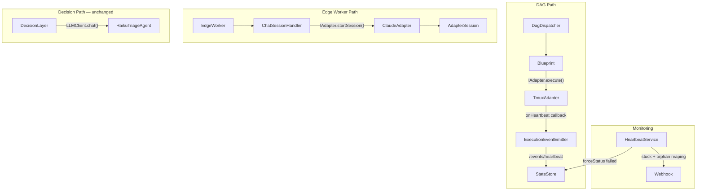
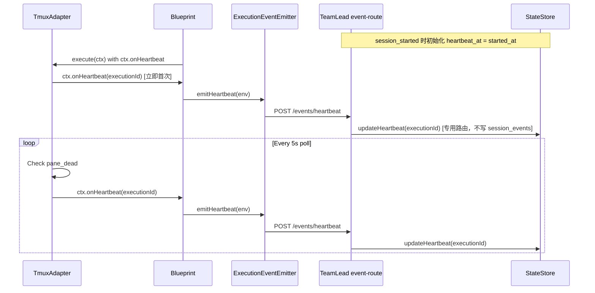
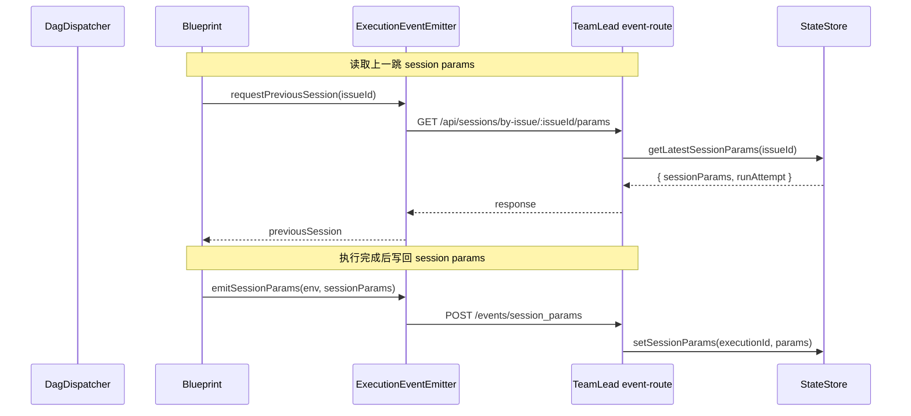

# Plan: Unified IAdapter Protocol + HeartbeatService

**Version**: v1.2.0
**Issue**: GEO-157
**Date**: 2026-03-15
**Source**: `doc/engineer/exploration/new/GEO-157-adapter-protocol-heartbeat.md`, `doc/engineer/research/new/GEO-157-adapter-unification-codebase-analysis.md`
**Status**: codex-reviewed (user override R8)
**Review**: R1-R8 Codex review (8 rounds). R1-R5 issues all resolved. R6-R8 session recovery details — user override (implementation-level details to resolve during coding).
**Status**: codex-reviewed (user override after R8)

---

## Goal

统一 Flywheel 的三套 runner 接口（`IFlywheelRunner`、`IAgentRunner`、`ISimpleAgentRunner`）为一个 `IAdapter` 接口，同时增强 StuckWatcher → HeartbeatService（orphan reaping + session persistence）。

**核心价值**：
1. 一个接口统一自治执行和交互式 session
2. Orphan session 自动清理（crash 后不再永远 stuck）
3. Session state 跨执行持久化（retry 带上下文）
4. 为未来 Codex/Gemini adapter 打好基础

---

## Architecture

### Before

```mermaid
graph TD
    subgraph "DAG Path"
        D1[DagDispatcher] --> B1[Blueprint]
        B1 -->|"IFlywheelRunner.run()"| T1[TmuxRunner]
    end
    subgraph "Edge Worker Path"
        E1[EdgeWorker] --> C1[ChatSessionHandler]
        C1 -->|"IAgentRunner.startStreaming()"| R1[ClaudeRunner]
    end
    subgraph "Decision Path"
        DL[DecisionLayer] -->|"LLMClient.chat()"| H1[HaikuTriageAgent]
    end
    subgraph "Monitoring"
        SW[StuckWatcher] -->|"stuck only"| WH[Webhook]
    end
```



### After



---

## Interface Design

### IAdapter（核心接口）

```typescript
interface IAdapter {
  /** Adapter 类型标识 */
  readonly type: string;   // "claude-cli" | "claude-sdk" | "codex-cli" | ...

  /** 环境预检 */
  checkEnvironment(): Promise<AdapterHealthCheck>;

  /** Fire-and-forget 执行（DAG 路径） */
  execute(ctx: AdapterExecutionContext): Promise<AdapterExecutionResult>;

  /** 执行后清理 */
  cleanup?(ctx: AdapterExecutionContext): Promise<void>;

  /** 是否支持交互式 streaming */
  readonly supportsStreaming: boolean;

  /** 启动交互式 session（Edge Worker 路径） */
  startSession?(ctx: AdapterExecutionContext): Promise<AdapterSession>;
}
```

### AdapterSession（交互式 session）

```typescript
interface AdapterSession {
  readonly sessionId: string | null;
  readonly startedAt: Date;
  /** Adapter/provider 类型标识（AgentSessionManager 需要用来决定写 claudeSessionId 等） */
  readonly adapterType: string;

  /** 注入消息到运行中的 session */
  addMessage(content: string): void;
  /** 标记消息流结束 */
  completeStream(): void;
  /** 是否在 streaming 状态 */
  isStreaming(): boolean;
  /** 停止 session */
  stop(): void;
  /** 是否在运行 */
  isRunning(): boolean;
  /** 获取所有消息 */
  getMessages(): AgentMessage[];
  /** 获取格式化器 */
  getFormatter(): IMessageFormatter;
}
```

### AdapterExecutionContext（执行上下文）

```typescript
interface AdapterExecutionContext {
  // 身份
  executionId: string;  // 与现有 DAG/Blueprint/StateStore 的 executionId 保持一致，不另起 ID
  issueId: string;

  // 执行参数
  prompt: string;
  cwd: string;
  model?: string;
  permissionMode?: string;
  appendSystemPrompt?: string;
  allowedTools?: string[];
  maxTurns?: number;
  timeoutMs?: number;

  // Session persistence
  // NOTE: TmuxAdapter 不支持 previousSession（tmux 交互模式不支持 resume）
  // ClaudeCodeAdapter 支持（通过 --resume flag 恢复 headless session）
  previousSession?: Record<string, unknown>;

  // DAG 路径特有
  label?: string;
  sentinelPath?: string;
  sessionDisplayName?: string;

  // Edge Worker 路径特有
  workspaceName?: string;
  allowedDirectories?: string[];
  flywheelHome?: string;
  mcpConfigPath?: string | string[];
  mcpConfig?: Record<string, unknown>;
  hooks?: Record<string, unknown>;
  onAskUserQuestion?: OnAskUserQuestion;

  // Callbacks
  onLog?: (stream: "stdout" | "stderr", chunk: string) => void;
  onMessage?: (message: AgentMessage) => void | Promise<void>;
  onError?: (error: Error) => void | Promise<void>;
  onComplete?: (messages: AgentMessage[]) => void | Promise<void>;

  // Heartbeat callback（跨包传输，不直接依赖 StateStore）
  onHeartbeat?: (executionId: string) => void;
}
```

### AdapterExecutionResult（执行结果）

```typescript
interface AdapterExecutionResult {
  success: boolean;
  sessionId: string;
  durationMs?: number;
  timedOut?: boolean;
  costUsd?: number;
  numTurns?: number;
  resultText?: string;

  // Session persistence
  sessionParams?: Record<string, unknown>;

  // DAG 路径特有
  tmuxWindow?: string;

  // Usage tracking
  usage?: { inputTokens: number; outputTokens: number };

  // 消息历史（Edge Worker 非 streaming 路径的 GitHub reply 需要）
  messages?: AgentMessage[];
}
```

### AdapterConfig（替代 AgentRunnerConfig）

```typescript
/** 通用 adapter 配置（从 AgentRunnerConfig 迁移） */
interface AdapterConfig {
  workingDirectory?: string;
  allowedTools?: string[];
  disallowedTools?: string[];
  allowedDirectories?: string[];
  resumeSessionId?: string;
  workspaceName?: string;
  appendSystemPrompt?: string;
  mcpConfigPath?: string | string[];
  mcpConfig?: Record<string, McpServerConfig>;
  model?: string;
  fallbackModel?: string;
  maxTurns?: number;
  tools?: string[];
  flywheelHome: string;
  promptVersions?: { userPromptVersion?: string; systemPromptVersion?: string };
  hooks?: Partial<Record<HookEvent, HookCallbackMatcher[]>>;
  onAskUserQuestion?: OnAskUserQuestion;
  onMessage?: (message: AgentMessage) => void | Promise<void>;
  onError?: (error: Error) => void | Promise<void>;
  onComplete?: (messages: AgentMessage[]) => void | Promise<void>;
}

/** Claude SDK adapter 的 provider-specific 配置扩展（覆盖 ClaudeRunnerConfig 的所有字段） */
interface ClaudeAdapterConfig extends AdapterConfig {
  /** Logger instance (ClaudeRunner 内部使用) */
  logger?: ILogger;
  /** 额外 CLI 参数（key-value 或 key-null 对，透传给 SDK query options） */
  extraArgs?: Record<string, string | null>;
  /** Output format 配置 */
  outputFormat?: OutputFormatConfig;
  /** System prompt（ClaudeRunner 运行时使用，部分 test-scripts 依赖此字段） */
  systemPrompt?: string;
}
```

**注意**：`AdapterConfig` 是通用基础，`ClaudeAdapterConfig` 等 provider-specific 配置继承它。`EdgeWorker.buildAgentRunnerConfig()` 目前返回包含 `logger`、`extraArgs` 等字段的对象，迁移到 `buildAdapterConfig()` 时需返回 `ClaudeAdapterConfig`。

---

## Codex Review R1: Issues Addressed

| # | Codex Issue | Resolution |
|---|-------------|-----------|
| 1 | Heartbeat 跨包边界 — TmuxAdapter 不应直接依赖 StateStore | ✅ `AdapterExecutionContext.onHeartbeat` 回调。Blueprint 注入回调，通过 `ExecutionEventEmitter.emitHeartbeat()` 传到 TeamLead。TmuxAdapter 只调回调，不知道 StateStore |
| 2 | TmuxRunner 不支持 session resume + ClaudeCodeRunner 归类错误 | ✅ `previousSession` 在 AdapterExecutionContext 标注为 TmuxAdapter 不支持。ClaudeCodeRunner 实现的是 IFlywheelRunner（不是 IAgentRunner），归入 Wave 2 (DAG 路径) 而非 Wave 3 |
| 3 | Edge Worker 迁移面低估，遗漏 GlobalSessionRegistry/PersistenceManager | ✅ Wave 4 拆为 4a (兼容层) + 4b (完全迁移)。新增 `GlobalSessionRegistry.ts`、`PersistenceManager` 到改动清单。第一阶段保留 `agentRunner` 兼容字段 |
| 4 | execute() 没有 messages，GitHub reply 路径需要 | ✅ `AdapterExecutionResult.messages` 新增可选字段。Edge Worker 非 streaming 路径用 `execute()` 时可返回消息历史 |
| 5 | 删 AgentRunnerConfig 会打爆 EdgeWorker | ✅ 新增 `AdapterConfig` 类型先定义在 `adapter-types.ts`，Wave 4a 原子替换 `buildAgentRunnerConfig()` → `buildAdapterConfig()`，然后再删 `AgentRunnerConfig` |
| 6 | HeartbeatService 缺 orphan 独立阈值 | ✅ `BridgeConfig` 新增 `orphanThresholdMinutes`（必须 > stuckThresholdMinutes）。Reap 通知用 `session_orphaned` event type 区分 |
| 7 | 文件重命名打断脚本引用 | ✅ 保留 compat 导出文件（`TmuxRunner.ts` 含 `ExecFileFn` re-export，`ClaudeRunner` 临时 compat export）。Wave 6 显式验证：`scripts/lib/setup.ts`、`scripts/e2e-tmux-runner.ts`、`scripts/smoke-test.ts`（改写 dist import）、`TrustPromptHandler.ts`、`claude-runner/test-scripts/*.js`、`edge-worker/test/EdgeWorker.label-based-prompt-command.test.ts` |

---

## Implementation Waves

### Wave 1: 类型定义 + AdapterRegistry（Day 1-2）

**目标**：定义所有新类型，创建 AdapterRegistry，更新 core exports。

| Task | File | Action |
|------|------|--------|
| 1.1 | `core/src/adapter-types.ts` | 新建。定义 IAdapter, AdapterSession, AdapterExecutionContext, AdapterExecutionResult, AdapterHealthCheck, AdapterConfig |
| 1.2 | `core/src/FlywheelRunnerRegistry.ts` → `core/src/AdapterRegistry.ts` | 重命名。`Map<string, IFlywheelRunner>` → `Map<string, IAdapter>`。旧文件保留为 compat re-export |
| 1.3 | `core/src/index.ts` | 更新 exports：新增 adapter-types，更新 AdapterRegistry。**保留旧 types 的 compat re-exports**（编译兼容，Wave 6 删除） |
| 1.4 | `core/test/FlywheelRunnerRegistry.test.ts` → `core/test/AdapterRegistry.test.ts` | 更新 8 个测试 |

**验证**：`pnpm --filter flywheel-core test` 全绿。

### Wave 2: TmuxAdapter + ClaudeCodeAdapter — DAG 路径（Day 2-5）

**目标**：实现 DAG 路径的两个 adapter，迁移 Blueprint。

| Task | File | Action |
|------|------|--------|
| 2.1 | `claude-runner/src/TmuxAdapter.ts` | 新建。implements IAdapter（`supportsStreaming: false`）。`execute()` 从 TmuxRunner.run() 迁移。新增 `checkEnvironment()`。`cleanup()` 释放 tmux window。轮询循环中调用 `ctx.onHeartbeat?.(executionId)` |
| 2.2 | `claude-runner/src/TmuxRunner.ts` | **保留为 compat 薄转发**：`export class TmuxRunner extends TmuxAdapter {}` + `export type { ExecFileFn }`。`TrustPromptHandler.ts:1` 直接从 `./TmuxRunner.js` 导入 `ExecFileFn`，必须保留 |
| 2.3 | `claude-runner/src/ClaudeCodeAdapter.ts` | 新建。wrap ClaudeCodeRunner（它实现 IFlywheelRunner，不是 IAgentRunner）。`supportsStreaming: false`。支持 `previousSession.sessionId`（通过 `--resume` flag，不是 `--session-id`） |
| 2.4 | `claude-runner/src/index.ts` | 新增 exports：TmuxAdapter, ClaudeCodeAdapter。保留 TmuxRunner compat export |
| 2.5 | `edge-worker/src/Blueprint.ts` | `getRunner: (name) => IFlywheelRunner` → `getAdapter: (name) => IAdapter`。`runner.run(request)` → `adapter.execute(ctx)`。注入 `onHeartbeat` 回调（通过 `ExecutionEventEmitter.emitHeartbeat(env)`） |
| 2.6 | `edge-worker/src/ExecutionEventEmitter.ts` | 新增 `emitHeartbeat(env: EventEnvelope)` 方法 |
| 2.7 | `teamlead/src/bridge/event-route.ts` | 新增 **专用** `/events/heartbeat` 路由：只调 `store.updateHeartbeat(executionId)`。**不写 `session_events` 表，不触发 OpenClaw 通知**。同时在 `session_started` handler 中初始化 `heartbeat_at = started_at` |
| 2.8 | Blueprint 测试更新 | 所有 Blueprint test files：`makeMockRunner()` → `makeMockAdapter()`，类型更新 |
| 2.9 | `claude-runner/test/TmuxAdapter.test.ts` | 新建（从 TmuxRunner.test.ts 迁移 + 新增 checkEnvironment/onHeartbeat 测试） |
| 2.10 | DagDispatcher 测试更新 | `e2e-core-loop.test.ts`, `parallel-dispatch-e2e.test.ts`, `DagDispatcher.test.ts` |

**验证**：`pnpm --filter flywheel-edge-worker test && pnpm --filter flywheel-claude-runner test` 全绿。

### Wave 3: ClaudeAdapter + AdapterSession（Day 5-8）

**目标**：实现 Edge Worker 路径的 adapter，引入 AdapterSession。

| Task | File | Action |
|------|------|--------|
| 3.1 | `claude-runner/src/ClaudeAdapterSession.ts` | 新建。implements AdapterSession。包装 ClaudeRunner 的 streaming 方法 |
| 3.2 | `claude-runner/src/ClaudeAdapter.ts` | 新建。implements IAdapter（`supportsStreaming: true`）。`execute()` = start + wait + 返回 messages。`startSession()` = 创建 ClaudeAdapterSession |
| 3.3 | `claude-runner/src/ClaudeRunner.ts` | 保留为 internal。ClaudeAdapter 内部使用。**但 index.ts 暂保留 compat export**（test-scripts 和外部测试文件直接引用 `ClaudeRunner`，如 `test-scripts/test-readable-logging.js:25`、`test-scripts/test-get-child-issues.js:6`、`edge-worker/test/EdgeWorker.label-based-prompt-command.test.ts:3`） |
| 3.4 | `claude-runner/src/index.ts` | 新增 ClaudeAdapter, ClaudeAdapterSession exports。**保留** ClaudeRunner compat export（Wave 6 清理） |
| 3.5 | `core/src/simple-agent-runner-types.ts` | **不在此 Wave 删除**。标记 `@deprecated`。推迟到 Wave 6 和其他 compat 文件一起删（避免 `core/src/index.ts` re-export 断裂） |

**验证**：`pnpm --filter flywheel-claude-runner test` 全绿。

### Wave 4a: Edge Worker 兼容层（Day 8-10）

**目标**：在 Edge Worker 引入 adapter 类型，保留 `agentRunner` 兼容字段。

| Task | File | Action |
|------|------|--------|
| 4a.1 | `core/src/CyrusAgentSession.ts` | 新增 `adapterSession?: AdapterSession` 字段（**保留** `agentRunner` 字段暂时不删） |
| 4a.2 | `edge-worker/src/AgentSessionManager.ts` | 新增 `addAdapterSession()`、`getAdapterSession()`、`getAllAdapterSessions()` 方法。旧方法 `addAgentRunner()` 等**保留但标记 deprecated**，内部转发到新方法 |
| 4a.3 | `edge-worker/src/ChatSessionHandler.ts` | `new ClaudeRunner(config)` → `new ClaudeAdapter(config)`。创建后同时调 `addAgentRunner()`（compat）和 `addAdapterSession()`。`postReply` 签名保持（暂时） |
| 4a.4 | `edge-worker/src/GlobalSessionRegistry.ts` | 序列化排除列表新增 `adapterSession`（和 `agentRunner` 一样不序列化） |
| 4a.5 | `core/src/agent-runner-types.ts` | **保留全部类型**（AgentRunnerConfig, IAgentRunner 等），标记 `@deprecated` |
| 4a.6 | `core/src/adapter-types.ts` | 确保 `AdapterConfig` 覆盖 `AgentRunnerConfig` 的所有字段 |

**验证**：`pnpm --filter flywheel-edge-worker test` 全绿。**两套方法并存，零行为变更。**

### Wave 4b: Edge Worker 完全迁移（Day 10-13）

**目标**：切换所有消费者到 adapter 类型，删除旧接口。

| Task | File | Action |
|------|------|--------|
| 4b.1 | `edge-worker/src/EdgeWorker.ts` | `buildAgentRunnerConfig()` → `buildAdapterConfig()`。所有 `runner.start()` / `startStreaming()` → `adapter.execute()` / `adapter.startSession()`。`runner.stop()` → `session.stop()`。`runner.getMessages()` → `session.getMessages()`。GitHub reply 路径：`execute()` result 带 `messages` |
| 4b.2 | `edge-worker/src/ChatSessionHandler.ts` | 完全切到 AdapterSession。`postReply(event, session: AdapterSession)` |
| 4b.3 | `edge-worker/src/SlackChatAdapter.ts` | `postReply(event, session: AdapterSession)` |
| 4b.4 | `edge-worker/src/AgentSessionManager.ts` | 删除 deprecated `addAgentRunner()` 等旧方法。存储改为 `adapterSession` |
| 4b.5 | `core/src/CyrusAgentSession.ts` | 删除 `agentRunner` 字段 |
| 4b.6 | `core/src/agent-runner-types.ts` | 删除 `IAgentRunner`、`AgentRunnerConfig`、`AgentSessionInfo`。**保留** `AskUserQuestion*` types、`IMessageFormatter`、`AgentMessage` 等辅助类型（被 AdapterSession 使用） |
| 4b.7 | `edge-worker/src/AgentSessionManager.ts` 序列化 | **主接缝**：`serializeState()` (L1839-1843) 排除列表新增 `adapterSession`（和 `agentRunner` 一样不序列化）。`restoreState()` 相应更新。这是实际持久化路径（`EdgeWorker.serializeMappings()` → `AgentSessionManager.serializeState()`），不是 GlobalSessionRegistry |
| 4b.7b | `core/src/PersistenceManager.ts` | 如有直接引用 `agentRunner` 的序列化逻辑，同步更新 |
| 4b.7c | `edge-worker/src/GlobalSessionRegistry.ts` | 补充接缝：序列化排除列表新增 `adapterSession` |
| 4b.8 | `edge-worker/src/EdgeWorker.ts` busy/shutdown | 迁移 `isAnyRunnerBusy()` 相关逻辑（~L1268-1317）：遍历 `IAgentRunner[]` → 遍历 `AdapterSession[]`。`getAllRunners()` → `getAllSessions()` |
| 4b.9 | `edge-worker/src/ChatSessionHandler.ts` | 迁移 `isAnyRunnerBusy()` / `getAllRunners()` (L275-287) → `isAnySessionBusy()` / `getAllSessions()` |
| 4b.10 | Edge Worker 测试更新 | 所有引用旧类型的测试文件，包括 `EdgeWorker.label-based-prompt-command.test.ts` 等 |

**验证**：`pnpm --filter flywheel-edge-worker test` 全绿。

### Wave 5: HeartbeatService + StateStore（Day 10-12，与 Wave 4a 并行）

**目标**：增强 StuckWatcher → HeartbeatService，StateStore 新增列。

| Task | File | Action |
|------|------|--------|
| 5.1 | `teamlead/src/StateStore.ts` | 新增 idempotent migration（4 列）。新增 `updateHeartbeat()`、`getOrphanSessions()`、`getSessionParams()` / `setSessionParams()` |
| 5.2 | `teamlead/src/StuckWatcher.ts` → `teamlead/src/HeartbeatService.ts` | 重命名。保留 stuck 检测。新增 `reapOrphans()`：查 `heartbeat_at` 超时的 running session → `forceStatus("failed")` → 通知 Slack |
| 5.3 | `teamlead/src/bridge/types.ts` | `BridgeConfig` 新增 `orphanThresholdMinutes`（必须 > `stuckThresholdMinutes`） |
| 5.4 | `teamlead/src/bridge/hook-payload.ts` | 支持 `event_type: "session_orphaned"`（区分 stuck 和 orphan） |
| 5.5 | `teamlead/src/bridge/plugin.ts` | `StuckWatcher` → `HeartbeatService`，传入 orphanThreshold |
| 5.6 | `teamlead/src/config.ts` | 新增 orphanThresholdMinutes 配置（默认 60 分钟） |
| 5.7 | `teamlead/src/index.ts` | 更新 exports |
| 5.8 | `teamlead/src/__tests__/StateStore.test.ts` | 新增 4 列 + 3 方法测试 |
| 5.9 | `teamlead/src/__tests__/StuckWatcher.test.ts` → `HeartbeatService.test.ts` | 重命名 + 新增 orphan reaping 测试 + session_orphaned event 测试 |
| 5.10 | `teamlead/src/bridge/dashboard-data.ts` | 如需更新 dashboard 显示 orphan 状态 |

**验证**：`pnpm --filter flywheel-teamlead test` 全绿。

### Wave 6: 集成验证 + 清理（Day 13-15）

| Task | File | Action |
|------|------|--------|
| 6.1 | 全量测试 | `pnpm test` — 所有 packages 全绿 |
| 6.2 | TypeCheck | `pnpm typecheck` — 零错误 |
| 6.3 | 脚本验证 + 迁移 | **显式验证并迁移**：`scripts/lib/setup.ts`（Runner → Adapter）、`scripts/e2e-tmux-runner.ts`（TmuxRunner → TmuxAdapter）、`scripts/smoke-test.ts`（**改写 `../packages/core/dist/flywheel-runner-types.js` import → adapter-types**）、`claude-runner/src/TrustPromptHandler.ts`（ExecFileFn import path）、`claude-runner/test-scripts/test-readable-logging.js`（ClaudeRunner → ClaudeAdapter）、`claude-runner/test-scripts/test-get-child-issues.js`（同上）、`edge-worker/test/EdgeWorker.label-based-prompt-command.test.ts`（ClaudeRunner → ClaudeAdapter） |
| 6.4 | 更新 `scripts/lib/setup.ts` | Runner 创建 → Adapter 创建。Registry 注册更新 |
| 6.5 | Repo-wide search gate | **删除 compat 前必须先跑两条搜索**。搜索 1（类名）：`rg -e "ClaudeRunner" -e "TmuxRunner" -e "IFlywheelRunner" -e "IAgentRunner" -e "ISimpleAgentRunner" -e "ISimpleAgentRunnerConfig" -e "AgentRunnerConfig" -e "AgentSessionInfo" -e "FlywheelRunRequest" -e "FlywheelRunResult" packages/ scripts/ --type ts --type js`。搜索 2（文件名引用）：`rg -e "flywheel-runner-types" -e "agent-runner-types" -e "simple-agent-runner-types" packages/ scripts/ --type ts --type js`。**确认两条搜索都零残留后**再删 compat 文件。如果发现遗漏消费者，先迁移再删 |
| 6.6 | core/src/index.ts 最终清理 | 移除所有 deprecated re-exports |
| 6.7 | 更新 `doc/VERSION` | `v1.1.0` → `v1.2.0` |

---

## StateStore Schema Changes

```sql
-- Idempotent migration in StateStore.migrate()
ALTER TABLE sessions ADD COLUMN session_params TEXT;
ALTER TABLE sessions ADD COLUMN heartbeat_at TEXT;
ALTER TABLE sessions ADD COLUMN adapter_type TEXT;
ALTER TABLE sessions ADD COLUMN run_attempt INTEGER DEFAULT 0;
```

**新增查询方法**：
```typescript
updateHeartbeat(executionId: string): void
// UPDATE sessions SET heartbeat_at = datetime('now') WHERE execution_id = ?

getOrphanSessions(thresholdMinutes: number): Session[]
// WHERE status='running' AND heartbeat_at IS NOT NULL AND heartbeat_at < threshold

getSessionParams(executionId: string): Record<string, unknown> | undefined
setSessionParams(executionId: string, params: Record<string, unknown>): void
```

---

## Heartbeat Transport Design



**关键设计决策**：
1. **首次 heartbeat**：`session_started` event handler 中将 `heartbeat_at` 初始化为 `started_at`。TmuxAdapter 在 execute() 启动后立即发一次 heartbeat（不等第一次 5s poll），双重保证。
2. **专用路由**：`/events/heartbeat` 是独立路由，**不写 `session_events` 表，不触发 OpenClaw 通知**。只做 `store.updateHeartbeat(executionId)` 一行操作。避免每 5s 产生一条低价值事件。
3. **包依赖不变**：TmuxAdapter (claude-runner) → 只依赖 core。回调由 Blueprint (edge-worker) 注入。TeamLead 通过 HTTP event route 接收。

---

## Session Persistence

| Adapter | previousSession 支持 | 说明 |
|---------|---------------------|------|
| TmuxAdapter | ❌ 不支持 | tmux 交互模式不支持 resume（代码明确注释 `sessionId intentionally ignored`）。`--session-id` 在 TmuxRunner 中只用于启动标识，不是 resume |
| ClaudeCodeAdapter | ✅ 支持 | 通过 `--resume` flag（不是 `--session-id`）。见 `ClaudeCodeRunner.ts:78-80` |
| ClaudeAdapter (SDK) | ✅ 支持 | 通过 `resumeSessionId` config 参数 |

**sessionParams 内容**：
- `sessionId: string` — Claude session ID
- `lastPromptHash?: string` — 上次 prompt 哈希（检测是否需要 full restart）
- adapter-specific 自定义字段

---

## Session Recovery Design

**问题**：DagDispatcher 每次调度生成新 `executionId`。retry 时如何找到上一次执行的 `sessionParams`？

**方案**：通过 event-based transport（和 heartbeat 一致的跨包设计），不让 Blueprint 直接访问 StateStore。

### Transport 设计



**包依赖不变**：Blueprint (edge-worker) → ExecutionEventEmitter → TeamLead HTTP API。和 heartbeat 走同样的跨包模式。Blueprint 不直接依赖 StateStore。

### TeamLead 新增 API

```typescript
// 读取（GET route，和 /api/sessions/* 系列一致）
GET /api/sessions/by-issue/:issueId/params
→ { sessionParams: Record<string, unknown> | null, runAttempt: number }

// 写入（event route，和 /events/heartbeat 一样的专用路由）
POST /events/session_params
body: { executionId, sessionParams }
→ store.setSessionParams(executionId, params)
// 不写 session_events，不触发通知
```

### StateStore 新增方法

```typescript
/** 获取同 issue 最近一次有 session_params 的 session */
getLatestSessionParams(issueId: string): { sessionParams: Record<string, unknown>; runAttempt: number } | undefined {
  // SELECT session_params, run_attempt FROM sessions
  // WHERE issue_id = ? AND session_params IS NOT NULL
  // ORDER BY last_activity_at DESC LIMIT 1
  // NOTE: 不限定 terminal status — 避免 crash window 导致漏读
}
```

### 写入时机

- Blueprint `runInner()` 执行完成后（成功或失败），通过 `emitSessionParams(env, result.sessionParams)` 写回
- 在 `emitCompleted` / `emitFailed` **之后**发送（先确保 status 已 terminal，再写 params）
- 如果进程在 emitTerminal 和 emitSessionParams 之间崩溃：params 丢失，但下次 recovery 会拿到更早一次的 params（graceful degradation）

### 读取时机

- Blueprint `runInner()` 开始前，通过 `ExecutionEventEmitter.requestPreviousSession(issueId)` 获取
- 拿到后通过 `AdapterExecutionContext.previousSession` 传给 adapter

### `run_attempt` 递增

- `getLatestSessionParams()` 同时返回 `runAttempt`
- 新 execution 的 `run_attempt = previous.runAttempt + 1`（首次为 0）
- 写入 `upsertSession()` 时带入

### Retry 语义兼容

当前 retry 机制（`actions.ts:113-115`）把旧 execution 行 `forceStatus` 回 `running`。这和 recovery 设计不冲突：
- 查询用 `session_params IS NOT NULL` 而非 terminal status
- Retry 后旧行变回 `running`，但它的 `session_params` 仍在，仍可被查到
- 未来如果改为"retry = 创建新 execution"（更干净），recovery 设计不需要变

### Scope 限制

**v1.2.0 中 session recovery 只做基础设施**：定义 API、StateStore 方法、transport。**不改 DagDispatcher 或 retry 行为**。实际启用 recovery 需要在 Blueprint 中接入读写调用，可以在后续版本逐步启用。

**NOTE**：TmuxAdapter 不支持 `previousSession`（忽略），ClaudeCodeAdapter 用它做 `--resume`。

---

## Migration Strategy

### IFlywheelRunner → IAdapter.execute()

| FlywheelRunRequest field | AdapterExecutionContext field | 备注 |
|--------------------------|------------------------------|------|
| prompt | prompt | 不变 |
| cwd | cwd | 不变 |
| allowedTools | allowedTools | 不变 |
| maxTurns | maxTurns | 不变 |
| maxCostUsd | （移除） | 从未被 TmuxRunner 使用 |
| sessionId | previousSession.sessionId | 迁入 previousSession。注意：ClaudeCodeAdapter 用 `--resume`（不是 `--session-id`）来恢复 |
| label | label | 不变 |
| issueId | issueId | 提升为必填 |
| timeoutMs | timeoutMs | 不变 |
| model | model | 不变 |
| permissionMode | permissionMode | 不变 |
| appendSystemPrompt | appendSystemPrompt | 不变 |
| sessionDisplayName | sessionDisplayName | 不变 |
| sentinelPath | sentinelPath | 不变 |
| （无） | executionId | 由 DagDispatcher 生成（UUID），Blueprint 传入 |
| （无） | previousSession | 新增 |
| （无） | onHeartbeat | 新增（Blueprint 注入） |

### IAgentRunner → IAdapter.startSession()

| IAgentRunner method | 新位置 | 备注 |
|---------------------|--------|------|
| start(prompt) | IAdapter.execute(ctx) | 简单模式，result 带 messages |
| startStreaming(prompt?) | IAdapter.startSession(ctx) | 返回 AdapterSession |
| addStreamMessage(content) | AdapterSession.addMessage(content) | 重命名 |
| completeStream() | AdapterSession.completeStream() | 不变 |
| isStreaming() | AdapterSession.isStreaming() | 不变 |
| stop() | AdapterSession.stop() | 不变 |
| isRunning() | AdapterSession.isRunning() | 不变 |
| getMessages() | AdapterSession.getMessages() | 不变 |
| getFormatter() | AdapterSession.getFormatter() | 不变 |
| supportsStreamingInput | IAdapter.supportsStreaming | 重命名 |

### AgentRunnerConfig → AdapterConfig

在 `adapter-types.ts` 中定义 `AdapterConfig`，字段 1:1 映射 `AgentRunnerConfig`。Wave 4b 原子替换 `buildAgentRunnerConfig()` → `buildAdapterConfig()` 后删除旧类型。

---

## Risk Mitigation

| 风险 | 缓解措施 |
|------|---------|
| EdgeWorker (5786 行) 改动面大 | Wave 4 拆为 4a (兼容层，零行为变更) + 4b (完全迁移) |
| AgentSessionManager (1984 行) 改名链路长 | 4a 先加新方法并存，4b 再删旧方法 |
| GlobalSessionRegistry 序列化断裂 | 4a.4 显式处理序列化排除 |
| ClaudeRunner 拆分 streaming 方法 | 保留 ClaudeRunner 为 internal，ClaudeAdapter 包装它 |
| Heartbeat 跨包依赖 | 回调注入模式，不打破 claude-runner → core 的单向依赖 |
| 文件重命名打断脚本 | 保留 compat 转发文件，Wave 6 显式验证脚本清单 |
| 回归：Linear @ mention 不工作 | Wave 4a 零行为变更先落地，4b 再切换 |
| StateStore migration 对现有数据 | ALTER TABLE ADD COLUMN 是 SQLite 安全操作，默认 NULL |

---

## Out of Scope

- Codex/Gemini adapter 实现（先只做 Claude）
- Decision Layer 迁移到 IAdapter（HaikuTriageAgent 直接用 LLMClient，不动）
- 数据库迁移到 Postgres（保持 sql.js）
- Cost budget enforcement（订阅制，不需要）

---

## Acceptance Criteria

- [ ] `IAdapter` 接口定义完成（adapter-types.ts），有 JSDoc
- [ ] `TmuxAdapter` 实现 `IAdapter`（supportsStreaming: false），`execute()` 通过现有 Blueprint 测试
- [ ] `ClaudeCodeAdapter` 实现 `IAdapter`（supportsStreaming: false），支持 previousSession resume
- [ ] `ClaudeAdapter` 实现 `IAdapter`（supportsStreaming: true），`startSession()` 返回 `AdapterSession`
- [ ] `AdapterSession` 包装 ClaudeRunner 的 streaming 方法
- [ ] `AdapterRegistry` 替代 `FlywheelRunnerRegistry`
- [ ] `Blueprint` 使用 `getAdapter().execute(ctx)` 替代 `getRunner().run(request)`
- [ ] Heartbeat 通过 `onHeartbeat` 回调 → `ExecutionEventEmitter` → TeamLead event route 传输（不打破包边界）
- [ ] `EdgeWorker` + `ChatSessionHandler` 使用 `IAdapter` + `AdapterSession`
- [ ] `AgentSessionManager` 存储/检索 `AdapterSession`
- [ ] `GlobalSessionRegistry` 序列化正确排除 `adapterSession`
- [ ] `HeartbeatService` 包含 stuck 检测 + orphan reaping（标记 failed + 通知 Slack，`session_orphaned` event type）
- [ ] `StateStore` 新增 4 列 + 4 个新方法
- [ ] `BridgeConfig` 新增 `orphanThresholdMinutes`（> stuckThresholdMinutes）
- [ ] `IFlywheelRunner`, `IAgentRunner`, `ISimpleAgentRunner` 接口定义已删除
- [ ] 脚本验证通过：`setup.ts`, `e2e-tmux-runner.ts`, `smoke-test.ts`, `TrustPromptHandler.ts`
- [ ] `pnpm test` 全绿（所有 packages）
- [ ] `pnpm typecheck` 零错误
