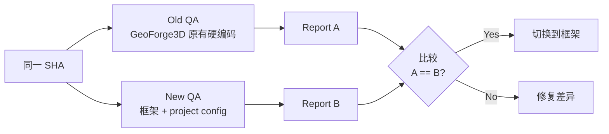
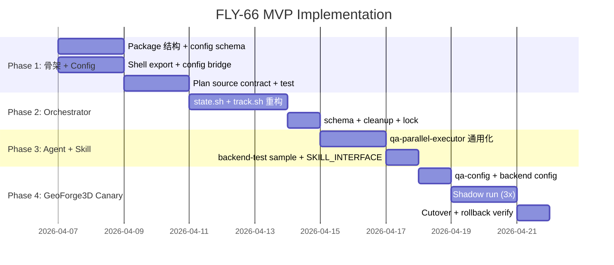

# Plan: Global QA Agent Framework

**Version**: v1.21.0
**Issue**: FLY-66
**Date**: 2026-04-03
**Source**: `doc/engineer/exploration/new/FLY-66-global-qa-framework.md`, `doc/engineer/research/new/FLY-66-qa-framework-extraction.md`
**Status**: codex-approved
**Codex Review**: Round 1 — 7 issues. Round 2 — 4 issues. Round 3 — 3 issues. **Round 4 — APPROVED.**

---

## 1. Executive Summary

从 GeoForge3D 的 QA Agent v2 (GEO-308) 提取通用 QA 框架到 Flywheel `packages/qa-framework`。框架遵循**协议与配置分离**原则：通用 5 步 QA 协议 + sample skills + orchestrator 状态管理作为框架层，项目通过 typed config + 自定义 skill config 接入。

### MVP Scope（Round 1 反馈后收窄）

**In MVP**:
1. `packages/qa-framework/` — TS workspace package（复用 `packages/config` 的 ConfigLoader 模式）
2. 一个通用 agent：`qa-parallel-executor.md`（5 步协议）
3. 一个 sample skill：`backend-test/SKILL.md`
4. Orchestrator 核心：`state.sh` + `track.sh` + `lock.sh`（重构去除 GeoForge3D 硬编码）
5. Typed config loader：复用 `packages/config` 的 YAML/TS 模式
6. GeoForge3D canary migration（shadow run 验证）
7. Plan source contract（解决 GEO-310 跨 worktree 问题）

**Deferred（follow-up issues）**:
- `qa-executor.md`（v1 简化版）
- `qa-plan-generator-executor.md`（fix plan 生成器）
- `frontend-test`、`e2e-test` sample skills
- Flywheel Discord Agent 行为 E2E skill

**设计约束**（Annie 确认）：
- 本 issue 不解决安装形态问题，但设计时保持可提取性
- Sample skills 不含任何 GeoForge3D 特定内容
- 验证方式是 agent 智能判断，不预定义固定模式

---

## 2. Architecture

### 2.1 两层分离

```mermaid
graph TB
    subgraph "Layer 1: packages/qa-framework (Flywheel 提供)"
        A[qa-parallel-executor.md<br/>通用 5 步协议]
        S1[backend-test/SKILL.md<br/>通用 API 测试]
        O[orchestrator/<br/>state.sh + track.sh + lock.sh]
        CL[src/config/<br/>QaConfigLoader.ts + schema]
        IF[SKILL_INTERFACE.md<br/>Skill 契约]
        PSC[PLAN_SOURCE_CONTRACT.md<br/>Plan 路径规范]
    end

    subgraph "Layer 2: 项目 .claude/ (每个项目自定义)"
        PC[qa-config.yaml]
        C1[backend-test/{project}-test-suite.md]
        OC[orchestrator/config.sh<br/>从 typed config 读取]
    end

    A -->|读取| PC
    A -->|加载| S1
    S1 -->|读取| C1
    O -->|配置来源| OC
    OC -->|调用| CL
    CL -->|解析| PC
```

### 2.2 Package 结构

```
packages/qa-framework/
├── src/
│   ├── config/
│   │   ├── QaConfigLoader.ts        # 复用 packages/config 的 ConfigLoader 模式
│   │   ├── qa-config.schema.ts      # Zod schema for qa-config.yaml
│   │   ├── types.ts                 # QaConfig, Domain, SkillRef types
│   │   └── shell-export.ts          # TS config → shell env vars (供 orchestrator 消费)
│   └── index.ts
├── agents/
│   └── qa-parallel-executor.md      # 通用 5 步协议（MVP）
├── skills/
│   ├── SKILL_INTERFACE.md           # 所有 skill 必须遵守的契约
│   └── backend-test/
│       └── SKILL.md                 # 通用 API/backend 测试流程（MVP）
├── orchestrator/
│   ├── state.sh                     # 重构：agent taxonomy 从配置读取
│   ├── track.sh                     # 重构：step 模板从配置注入
│   ├── lock.sh                      # copy（已通用）
│   ├── schema.sql                   # 重构：去掉 domain/agent_type CHECK
│   ├── cleanup-agent.sh             # 重构：domain 清理外置
│   └── config-bridge.sh             # NEW: 调用 shell-export.ts 导入配置
├── contracts/
│   └── PLAN_SOURCE_CONTRACT.md      # 解决跨 worktree plan 路径（GEO-310）
├── templates/
│   ├── qa-config.yaml               # 项目配置模板（带注释）
│   └── backend-test-suite.md        # Backend skill 配置模板
├── examples/
│   └── geoforge3d/
│       ├── qa-config.yaml           # GeoForge3D 完整示例
│       └── geoforge3d-backend-suite.md
├── __tests__/
│   ├── QaConfigLoader.test.ts       # Config 加载测试
│   ├── shell-export.test.ts         # Shell 导出测试
│   └── worktree-plan.test.sh        # 跨 worktree plan 路径测试
├── package.json                     # pnpm workspace package
├── tsconfig.json
├── vitest.config.ts
└── README.md
```

### 2.3 qa-config.yaml Schema（typed, 完整版）

```yaml
# qa-config.yaml — QA Framework Configuration
# Validated by QaConfigLoader.ts (Zod schema)

project:
  name: "MyProject"
  description: "One-line description"

qa:
  doc_root: "doc/qa"                    # QA 文档目录
  test_report_dir: "doc/qa/test-reports"
  context_file: "doc/qa/qa-context.md"  # 历史经验文档

# Plan source contract（解决 GEO-310）
plan:
  source: "worktree"                    # "worktree" | "branch_fetch"
  fetch_strategy: "checkout_file"       # "checkout_file" | "copy_from_root"
  # worktree: plan 在当前 worktree 中（默认）
  # branch_fetch: QA agent fetch main agent branch 并 checkout plan 文件

# 可用 domain
domains:
  - name: "backend"
    dir: "."
    test_skill: "backend-test"
    config_file: ".claude/skills/backend-test/myproject-test-suite.md"
    cleanup_script: null               # 可选：domain 清理脚本路径

# API 配置（可选）
api:
  openapi_spec: null
  base_url: "http://localhost:3000"

# Orchestrator 配置
orchestrator:
  db_path: "~/.flywheel/orchestrator/qa.db"
  max_concurrent_agents: 2
  artifact_retention_days: 30
  # Agent taxonomy — 框架支持的 agent 类型（替代硬编码）
  # 对齐真实 schema：step_templates 表，含 key/name/order/prerequisite
  agent_types:
    - name: "qa-parallel"
      step_templates:
        - { key: "onboard", name: "Onboard", order: 1, prerequisite: null }
        - { key: "analyze_plan", name: "Analyze + Plan", order: 2, prerequisite: "onboard" }
        - { key: "research", name: "Research", order: 3, prerequisite: "analyze_plan" }
        - { key: "write_execute", name: "Write + Execute", order: 4, prerequisite: "research" }
        - { key: "finalize", name: "Finalize", order: 5, prerequisite: "write_execute" }
  # state.sh init_steps() 和 track.sh gate 从此配置读取

# 版本管理
version:
  file: "doc/VERSION"                  # VERSION 文件路径

# 环境变量引用（不存储值，只引用 env var 名）
env_refs:
  api_token: "API_TOKEN"              # 项目自定义的 env var 名
  gcloud_project: "GCP_PROJECT"
```

### 2.4 Config Loader（复用 packages/config 模式）

```typescript
// packages/qa-framework/src/config/QaConfigLoader.ts
import { z } from 'zod';
import { readFileSync } from 'fs';
import { parse as parseYaml } from 'yaml';

const QaConfigSchema = z.object({
  project: z.object({
    name: z.string(),
    description: z.string(),
  }),
  qa: z.object({
    doc_root: z.string(),
    test_report_dir: z.string(),
    context_file: z.string().optional(),
  }),
  plan: z.object({
    source: z.enum(['worktree', 'branch_fetch']).default('worktree'),
    fetch_strategy: z.enum(['checkout_file', 'copy_from_root']).default('checkout_file'),
  }).optional(),
  domains: z.array(z.object({
    name: z.string(),
    dir: z.string(),
    test_skill: z.string(),
    config_file: z.string(),
    cleanup_script: z.string().nullable().optional(),
  })),
  api: z.object({
    openapi_spec: z.string().nullable().optional(),
    base_url: z.string().optional(),
  }).optional(),
  orchestrator: z.object({
    db_path: z.string(),
    max_concurrent_agents: z.number().default(2),
    artifact_retention_days: z.number().default(30),
    agent_types: z.array(z.object({
      name: z.string(),
      step_templates: z.array(z.object({
        key: z.string(),
        name: z.string(),
        order: z.number(),
        prerequisite: z.string().nullable(),
      })),
    })),
  }),
  version: z.object({
    file: z.string(),
  }).optional(),
  env_refs: z.record(z.string()).optional(),
});

export type QaConfig = z.infer<typeof QaConfigSchema>;

export function loadQaConfig(configPath: string): QaConfig {
  const raw = readFileSync(configPath, 'utf-8');
  const parsed = parseYaml(raw);
  return QaConfigSchema.parse(parsed);
}
```

### 2.5 Shell Export Bridge

```typescript
// packages/qa-framework/src/config/shell-export.ts
// 供 orchestrator bash 脚本消费：
// node packages/qa-framework/dist/shell-export.js .claude/qa-config.yaml
// 输出 shell-safe export 语句，orchestrator source 它

import { loadQaConfig } from './QaConfigLoader.js';

const config = loadQaConfig(process.argv[2]);

// Project metadata
console.log(`export QA_PROJECT_NAME=${JSON.stringify(config.project.name)}`);
console.log(`export QA_DOC_ROOT=${JSON.stringify(config.qa.doc_root)}`);
console.log(`export QA_REPORT_DIR=${JSON.stringify(config.qa.test_report_dir)}`);

// Domain 配置
for (const [i, domain] of config.domains.entries()) {
  console.log(`export QA_DOMAIN_${i}_NAME=${JSON.stringify(domain.name)}`);
  console.log(`export QA_DOMAIN_${i}_DIR=${JSON.stringify(domain.dir)}`);
  console.log(`export QA_DOMAIN_${i}_SKILL=${JSON.stringify(domain.test_skill)}`);
}
console.log(`export QA_DOMAIN_COUNT=${config.domains.length}`);

// Agent type step templates（供 state.sh init_steps / track.sh gate 消费）
for (const agentType of config.orchestrator.agent_types) {
  const prefix = `QA_AGENT_TYPE_${agentType.name.replace(/-/g, '_')}`;
  for (const [j, step] of agentType.step_templates.entries()) {
    console.log(`export ${prefix}_STEP_${j}_KEY=${JSON.stringify(step.key)}`);
    console.log(`export ${prefix}_STEP_${j}_NAME=${JSON.stringify(step.name)}`);
    console.log(`export ${prefix}_STEP_${j}_ORDER=${step.order}`);
    console.log(`export ${prefix}_STEP_${j}_PREREQ=${JSON.stringify(step.prerequisite ?? '')}`);
  }
  console.log(`export ${prefix}_STEP_COUNT=${agentType.step_templates.length}`);
}
```

---

## 3. Plan Source Contract（解决 GEO-310）

### 3.1 问题

QA agent 在独立 worktree 运行，但 plan 文件只存在于 main agent 的 feature branch。跨 worktree 绝对路径读取脆弱且不可靠。

### 3.2 契约

```markdown
# PLAN_SOURCE_CONTRACT.md

## 术语
- PLAN_RELPATH: plan 文件相对于 repo root 的路径（repo-relative pathspec）
  例：`doc/backend/plan/inprogress/v3.32.1-GEO-308-dynamic-qa-v2.md`
- MAIN_AGENT_BRANCH: main agent 的 feature branch 名
  例：`feat/GEO-308-dynamic-qa-v2`

## 规则
1. QA agent 的 worktree 在 Step 1 (Onboard) 必须自包含 plan 文件
2. Spawn 参数（orchestrator → QA agent）必须传递：
   - `PLAN_RELPATH`（repo-relative，不是绝对路径）
   - `MAIN_AGENT_BRANCH`
3. Plan 获取策略由 qa-config.yaml 的 `plan.source` 控制：
   - `worktree`（默认）：plan 已在当前 worktree（适用于同 worktree QA）
   - `branch_fetch`：QA agent 在 Step 1 执行：
     ```bash
     git fetch origin ${MAIN_AGENT_BRANCH}
     git checkout origin/${MAIN_AGENT_BRANCH} -- ${PLAN_RELPATH}
     ```
     前置条件：MAIN_AGENT_BRANCH 上已包含 plan 文件的 commit
4. 绝对路径读取**被禁止** — 不允许跨 worktree 文件系统访问
5. Plan 文件在 QA worktree 中是 **只读副本** — QA 不修改 plan
6. 如果 fetch 失败，QA agent 报错退出（fail-fast），不降级到绝对路径

## 路径规范化
Orchestrator 端**必须**传 `PLAN_RELPATH`（repo-relative）。如果遗留代码传入绝对路径，
Step 1 用 Node helper 转换（跨平台兼容，macOS 无 `realpath --relative-to`）：
```bash
PLAN_RELPATH=$(node -e "
  const path = require('path');
  const { execFileSync } = require('child_process');
  const repoRoot = execFileSync('git', ['rev-parse', '--show-toplevel']).toString().trim();
  console.log(path.relative(repoRoot, process.argv[1]));
" "$PLAN_PATH")
```
变量名规范（对齐 GeoForge3D 现有 spawn 参数）：
- `WORKTREE_PATH` — QA agent 的 worktree 绝对路径
- `PLAN_RELPATH` — plan 文件 repo-relative 路径（新增）
- `MAIN_AGENT_BRANCH` — main agent feature branch 名（新增）
```

### 3.3 验证

- Phase 1 gate：worktree 集成测试（`__tests__/worktree-plan.test.sh`）
  - 创建两个 worktree
  - 在 worktree A 创建 plan 文件并提交到 branch
  - 在 worktree B 运行 fetch + checkout
  - 验证 plan 文件存在于 worktree B

---

## 4. QA Agent 5 步协议（通用化改造）

### 4.1 当前 vs 目标

| 步骤 | GeoForge3D 当前 | 通用化目标 |
|------|-----------------|-----------|
| **Step 1: Onboard** | 硬编码 Shopify/3MF 产品知识 | 读 `qa-config.yaml` + 项目 config.md + plan source fetch |
| **Step 2: Analyze+Plan** | 硬编码 `GeoForge3D-Frontend/` 路径 | 从 `domains[]` 配置推断 change type |
| **Step 3: Research** | 硬编码 OpenAPI spec 路径 | `api.openapi_spec` 配置（null = 跳过）|
| **Step 4: Write+Execute** | 硬编码 skill 名列表 | 从 `domains[].test_skill` 动态加载 |
| **Step 5: Finalize** | 硬编码 `product/doc/qa/` 路径 | `qa.doc_root` 配置项 |

### 4.2 关键改造：Agent Taxonomy 动态化

**当前问题**（Codex Round 1 #2）：`state.sh` 硬编码了 agent types 和 step templates。

**解决方案**：`qa-config.yaml` 的 `orchestrator.agent_types` 定义支持的 agent 类型和步骤。`state.sh` 中的 `init_steps()` 从配置读取，不再硬编码。

```bash
# state.sh（重构后）— 对齐 step_templates/agent_steps schema
init_steps() {
    local agent_id="$1"
    local agent_type="$2"
    
    # 从 shell-export 导入的配置读取 step templates
    # 格式：QA_AGENT_TYPE_qa_parallel_STEP_{N}_{KEY,NAME,ORDER,PREREQ}
    local n=0
    while true; do
        local key_var="QA_AGENT_TYPE_${agent_type}_STEP_${n}_KEY"
        local name_var="QA_AGENT_TYPE_${agent_type}_STEP_${n}_NAME"
        local order_var="QA_AGENT_TYPE_${agent_type}_STEP_${n}_ORDER"
        local prereq_var="QA_AGENT_TYPE_${agent_type}_STEP_${n}_PREREQ"
        
        local step_key="${!key_var}"
        [[ -z "$step_key" ]] && break
        
        _sql "INSERT INTO agent_steps (agent_id, step_key, step_name, step_order, prerequisite, status)
              VALUES ('$agent_id', '$step_key', '${!name_var}', ${!order_var}, '${!prereq_var}', 'pending')"
        n=$((n + 1))
    done
}
```

**track.sh gate 重构**：`track.sh` 的 step gating 不再硬编码前驱关系，改为查询 `agent_steps.prerequisite` 字段：
```bash
# track.sh（重构后）
check_step_gate() {
    local agent_id="$1"
    local step_key="$2"
    
    local prereq
    prereq=$(_sql "SELECT prerequisite FROM agent_steps WHERE agent_id='$agent_id' AND step_key='$step_key'")
    
    if [[ -n "$prereq" && "$prereq" != "null" ]]; then
        local prereq_status
        prereq_status=$(_sql "SELECT status FROM agent_steps WHERE agent_id='$agent_id' AND step_key='$prereq'")
        [[ "$prereq_status" == "completed" ]] || return 1
    fi
    return 0
}
```

---

## 5. Sample Skill: backend-test（MVP）

### 5.1 通用方法论

```markdown
# Backend Test (Generic Sample)

## 输入
1. project config → api.base_url, api.openapi_spec
2. skill config → {project}-test-suite.md（测试用例表、验证规则）
3. plan AC → acceptance criteria to verify

## 流程
Step 0: 读取 skill config，解析测试套件
Step 1: Pre-flight（环境检查、API 可达性）
Step 2: 运行回归测试（已有测试套件）
Step 3: 运行 AC 驱动测试（根据 plan 生成）
Step 4: 下载产物（如果有）
Step 5: 验证产物（按 skill config 规则）
Step 6: 生成报告

## 输出
- 测试报告（markdown）
- 失败分类：product_bug / test_bug / infra_flake
```

### 5.2 配置模板

```markdown
# Backend Test Suite Template — {project}-test-suite.md

## API Configuration
- Base URL: {from qa-config.yaml or override here}
- Auth: {env var name, e.g., API_TOKEN}

## Test Suites
| # | Label | Endpoint | Method | Payload | Expected | Timeout |
|---|-------|----------|--------|---------|----------|---------|
| 1 | Health Check | /health | GET | - | 200 OK | 10s |
| 2 | {your test} | {path} | {method} | {json} | {expectation} | {timeout} |

## Artifact Validation
| Artifact | Validation | Threshold |
|----------|-----------|-----------|
| {file type} | {check} | {value} |

## Known Issues
{list of known bugs affecting test results}
```

---

## 6. Migration Strategy（Round 1 #5 反馈）

### 6.1 Shadow Run（GeoForge3D 回迁验证）



1. **Shadow scope**：仅限 **backend/API/infra** change type 的 ticket。Frontend 类 ticket 不纳入 shadow 比较（因为 MVP 没有 frontend-test skill）
2. **Shadow phase**：在 GeoForge3D 的同一 SHA 上并行运行 old QA 和 new QA
3. **比较**：backend 测试结果、报告格式、失败分类、skill 更新行为
4. **Unsupported change type**：new QA 遇到无 skill 覆盖的 domain 时，标记为 `SKIPPED_NO_SKILL` 并记录日志（不 fail）
5. **Cutover criteria**：连续 3 次 backend 类 shadow run 结果一致
6. **Rollback**：GeoForge3D 保留原有 `.claude/agents/qa-parallel-executor.md` 直到 cutover 完成，一键切回

### 6.2 消费模型（GeoForge3D Phase 4 具体机制）

本 issue 不解决通用安装形态，但 GeoForge3D 作为已知客户需要具体的消费路径：

**方案：copy/sync wrapper**

```bash
# GeoForge3D/.claude/scripts/sync-qa-framework.sh
# 从 Flywheel 仓库同步 QA 框架到本项目
# 运行时机：手动或 CI 触发

FLYWHEEL_REPO="${FLYWHEEL_REPO:-$HOME/Dev/flywheel}"
QA_FW_SRC="$FLYWHEEL_REPO/packages/qa-framework"
QA_FW_DST=".claude/qa-framework"

# 同步框架资产（agents, skills, orchestrator, contracts）
rsync -av --delete \
  "$QA_FW_SRC/agents/" "$QA_FW_DST/agents/"
rsync -av --delete \
  "$QA_FW_SRC/skills/" "$QA_FW_DST/skills/"
rsync -av --delete \
  "$QA_FW_SRC/orchestrator/" "$QA_FW_DST/orchestrator/"
rsync -av --delete \
  "$QA_FW_SRC/contracts/" "$QA_FW_DST/contracts/"

# config loader 编译产物
(cd "$FLYWHEEL_REPO" && pnpm --filter ./packages/qa-framework build)
cp "$QA_FW_SRC/dist/shell-export.js" "$QA_FW_DST/bin/"
```

**项目侧文件布局**：
```
GeoForge3D/.claude/
├── qa-framework/                    # 框架资产（sync 产物，不手动编辑）
│   ├── agents/qa-parallel-executor.md
│   ├── skills/backend-test/SKILL.md
│   ├── orchestrator/{state,track,lock}.sh
│   ├── contracts/PLAN_SOURCE_CONTRACT.md
│   └── bin/shell-export.js
├── skills/                          # 项目自定义 skill configs（手动编辑）
│   └── backend-test/geoforge3d-backend-suite.md
├── qa-config.yaml                   # 项目配置
└── orchestrator/config.sh           # wrapper: source qa-framework/orchestrator + 本地配置
```

**GeoForge3D agent 引用**：
```markdown
# .claude/agents/qa-parallel-executor.md（GeoForge3D 版）
# 直接使用框架版：
Read(".claude/qa-framework/agents/qa-parallel-executor.md")
# 框架版已经参数化，会读取 .claude/qa-config.yaml
```

### 6.3 切换步骤

1. `sync-qa-framework.sh` 同步框架资产到 GeoForge3D
2. 创建 `qa-config.yaml` + `geoforge3d-backend-suite.md`
3. 原 `qa-parallel-executor.md` 重命名为 `.bak`（保留 1 周）
4. 新 `qa-parallel-executor.md` 改为 Read() 框架版
5. Shadow run 通过 → 正式切换 → 确认无回归 → 删除 .bak

---

## 7. Implementation Phases

### Phase 1: Framework 骨架 + Config + Plan Contract（3-4 天）

| 任务 | 具体工作 | 文件 |
|------|---------|------|
| 创建 package | `packages/qa-framework/` + package.json + tsconfig + vitest | 新目录 |
| Config schema | `QaConfigLoader.ts` + Zod schema + types.ts | `src/config/` |
| Shell export | `shell-export.ts`（TS config → shell env） | `src/config/` |
| Plan contract | `PLAN_SOURCE_CONTRACT.md` + worktree 集成测试 | `contracts/` + `__tests__/` |
| Config bridge | `config-bridge.sh`（调用 shell-export） | `orchestrator/` |
| Config template | `qa-config.yaml` 带完整注释 | `templates/` |
| Tests | Config loader + shell export 单元测试 | `__tests__/` |

### Phase 2: Orchestrator 重构（3-4 天）

| 任务 | 具体工作 | 文件 |
|------|---------|------|
| state.sh 重构 | Agent taxonomy 从配置读取，去除硬编码 step templates | `orchestrator/state.sh` |
| track.sh 迁移 | 去除 GeoForge3D 特定 gating 逻辑 | `orchestrator/track.sh` |
| schema.sql 重构 | 删除 domain/agent_type CHECK 约束 | `orchestrator/schema.sql` |
| cleanup 重构 | domain 清理外置到 config.cleanup_script | `orchestrator/cleanup-agent.sh` |
| lock.sh | 直接复制（已通用） | `orchestrator/lock.sh` |
| Tests | Orchestrator 回归测试 | `__tests__/` |

### Phase 3: Agent 协议通用化（2-3 天）

| 任务 | 具体工作 | 文件 |
|------|---------|------|
| qa-parallel-executor | 去掉 GeoForge3D 硬编码，参数化，纳入 GEO-310 fix | `agents/qa-parallel-executor.md` |
| SKILL_INTERFACE | Skill 契约文档 | `skills/SKILL_INTERFACE.md` |
| backend-test sample | 通用 API 测试流程 | `skills/backend-test/SKILL.md` |
| Skill config template | Backend test suite 配置模板 | `templates/backend-test-suite.md` |

### Phase 4: GeoForge3D Canary Migration（3-4 天）

| 任务 | 具体工作 | 文件 |
|------|---------|------|
| 创建 qa-config | GeoForge3D 的完整配置 | `examples/geoforge3d/qa-config.yaml` |
| 提取 backend config | 从原 skill 提取 GeoForge3D backend 特定内容 | `examples/geoforge3d/geoforge3d-backend-suite.md` |
| Shadow run setup | 并行运行 old/new QA 的脚本 | GeoForge3D worktree |
| Shadow run execution | 至少 3 次，比较结果 | Manual |
| Cutover | 切换 GeoForge3D 到框架版 + 回滚路径验证 | GeoForge3D repo |
| 文档 | README + migration guide | `README.md` |

---

## 8. Critical Path



**总计：~15-18 天**（MVP，不含 deferred items）

---

## 9. Validation Plan

### Phase 1 验收（Gate：Plan Contract）
- [ ] `packages/qa-framework/` 是标准 pnpm workspace package（build + typecheck + test 通过）
- [ ] package.json name 为 `flywheel-qa-framework`（对齐 `flywheel-*` 约定）
- [ ] `QaConfigLoader.ts` + Zod schema 能解析 qa-config.yaml（含 `step_templates[{key,name,order,prerequisite}]`）
- [ ] `shell-export.ts` 输出合法 shell export 语句，包含 `QA_AGENT_TYPE_*_STEP_*_{KEY,NAME,ORDER,PREREQ}` 变量
- [ ] Worktree plan 集成测试通过（fetch + checkout 策略，使用 `PLAN_RELPATH` 非绝对路径）
- [ ] Config template 包含完整注释

### Phase 2 验收
- [ ] `state.sh` 的 init_steps 从配置读取 agent types 和 steps
- [ ] `track.sh` 不含 GeoForge3D 特定 gating 逻辑
- [ ] `schema.sql` 无 domain/agent_type 硬编码约束
- [ ] Orchestrator 回归测试通过

### Phase 3 验收
- [ ] `qa-parallel-executor.md` 不含任何 GeoForge3D 字符串
- [ ] Plan source fetch 逻辑包含在 Step 1（GEO-310 fix）
- [ ] `backend-test/SKILL.md` 不含任何项目特定内容
- [ ] `SKILL_INTERFACE.md` 定义输入/输出/自定义点

### Phase 4 验收（Gate：Shadow Run）
- [ ] GeoForge3D qa-config.yaml 包含所有原硬编码值
- [ ] Shadow run: old vs new 结果一致（3 次连续）
- [ ] Cutover 后 GeoForge3D QA 正常运行
- [ ] 回滚路径验证通过

---

## 10. Deferred Work（follow-up issues）

| Item | 理由 | 前置条件 |
|------|------|---------|
| `qa-executor.md`（v1 简化版） | 非核心，MVP 只需 parallel executor | Phase 3 完成 |
| `qa-plan-generator-executor.md` | 依赖 qa-executor，且 GeoForge3D 特有 | Phase 4 完成 |
| `frontend-test` sample skill | 需要 Playwright 通用化研究 | Phase 3 完成 |
| `e2e-test` sample skill | 需要 frontend + backend 组合 | frontend-test 完成 |
| `onboard-qa` sample skill | 优先级低于核心测试 skill | Phase 3 完成 |
| Flywheel Agent 行为 E2E | Chrome Discord 自动化，独立研发 | Phase 4 完成 |
| 其他项目 config 模板 | 等 MVP 验证后再扩展 | Phase 4 完成 |

---

## 11. Risk Assessment

| 风险 | 影响 | 缓解 |
|------|------|------|
| state.sh 重构破坏 GeoForge3D | 生产 QA 中断 | Shadow run + cutover criteria + 回滚路径 |
| track.sh 依赖未完全理清 | 框架 step gating 不工作 | Phase 2 专门处理 track.sh，测试覆盖 |
| Config schema 不够灵活 | 新项目无法适配 | 从 GeoForge3D 实际值推导 schema，Zod optional 字段 |
| GEO-310 fix 与通用化冲突 | Plan fetch 行为不一致 | Plan source contract 明确定义两种策略 |
| Shadow run 发现大量差异 | 切换延期 | 预留 2 天修复时间在 Phase 4 |

---

## 12. Architecture Decisions

| 决策 | 选择 | 备选 | 理由 |
|------|------|------|------|
| Config loader | **TypeScript Zod**（复用 packages/config 模式） | yq (shell) | Codex #3: 仓内已有 TS config 体系，yq 是新依赖 |
| Shell 消费 | shell-export.ts 生成 export 语句 | 直接 yq | TS 是 source of truth，shell 只消费导出 |
| MVP agent | 只含 qa-parallel-executor | 全部 3 个 agent | Codex #6: 收窄 MVP，qa-executor/QPG 延后 |
| MVP skill | 只含 backend-test | 全部 4 个 skill | 同上，frontend/e2e 延后 |
| Agent taxonomy | 配置定义（orchestrator.agent_types） | 硬编码 | Codex #2: state.sh 必须可配置化 |
| Plan 路径 | Plan source contract + branch_fetch 策略 | 绝对路径 | Codex #4: 解决 GEO-310，framework-level 契约 |
| 迁移策略 | Shadow run + cutover criteria | 直接切换 | Codex #5: 零回归需要 burn-in 验证 |
| Package 形态 | TS workspace package（src/ + tests + build） | Shell/markdown 资产包 | Codex #7: 对齐 Flywheel monorepo 约定 |
| 包名 | `flywheel-qa-framework`（package.json name） | `qa-framework` | Codex R3 #3: 对齐 `flywheel-*` 命名约定。脚本中用路径过滤 `--filter ./packages/qa-framework` |
