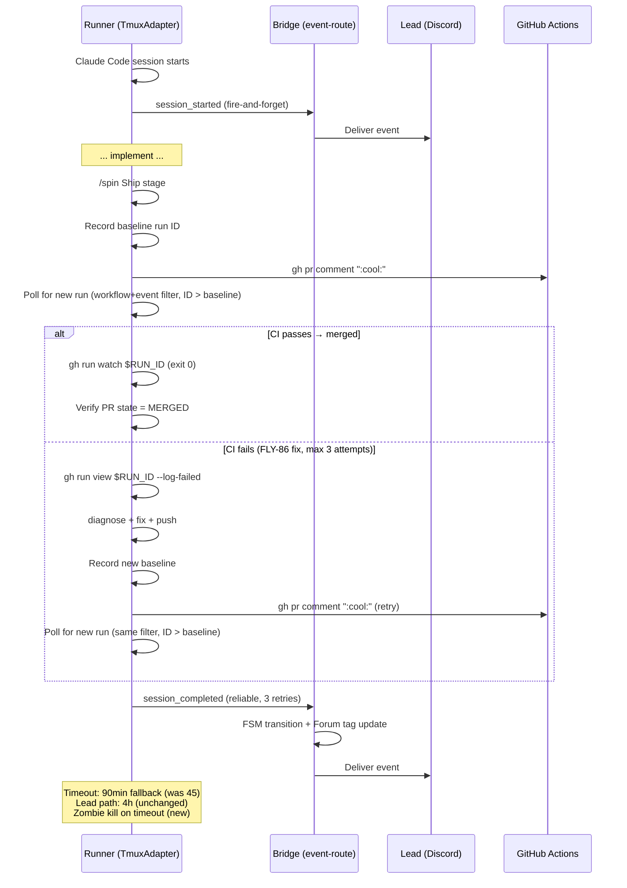

# Plan: E2E Pipeline Full-Chain Fixes

**Version**: v1.22.0
**Issue**: FLY-86
**Date**: 2026-04-10
**Status**: draft

## Background

FLY-80 E2E 验证暴露了 pipeline 从 Runner 启动到 Ship merge 的多个链路断点。这些 bug 单独影响不大，但组合起来导致整个 E2E 流程无法自动完成。本 plan 批量修复 5 个问题（Bug 1 已在 PR #129 修复，Bug 6 为 QA 期间发现的 approve→ship 衔接问题）。

## Bug List & Fix Plan

### Bug 1: restart-services.sh env export ✅ ALREADY FIXED

**问题**: `source ~/.flywheel/.env` 不 export 变量到子进程
**状态**: PR #129 (FLY-80) 已修复，`set -a && source && set +a` 已在 main
**Action**: 无需修改

### Bug 2: Session timeout 太短（45 min）

**问题**: Runner 在 Ship 阶段等 CI + merge 时被 timeout 杀掉。

**Root Cause**: 系统有 5 处 45-min timeout 源（2 个 fallback + 3 个显式配置）：

| Source | Type | Path |
|--------|------|------|
| `Blueprint.ts:458` | fallback | `ctx.sessionTimeoutMs ?? 2_700_000` |
| `TmuxAdapter.ts:38` | fallback | constructor default |
| `scripts/lib/setup.ts:118` | explicit | `sessionTimeoutMs = 2_700_000` |
| `scripts/run-issue.ts:479` | explicit | `sessionTimeoutMs: 2_700_000` |
| `scripts/run-project.ts:123` | explicit | `sessionTimeoutMs: 2_700_000` |

Lead path (run-infra.ts): `createRunBlueprint(... sessionTimeoutMs=14_400_000)` → 4h，不受影响。
FLY-80 实际执行通过 Lead path（4h），所以不是此次 root cause。但所有 scripts path 仍是 45-min。

**Fix**: 全量修改所有 5 处为 90 min（`5_400_000`）：
1. `packages/edge-worker/src/Blueprint.ts:458`: `2_700_000` → `5_400_000`
2. `packages/claude-runner/src/TmuxAdapter.ts:38`: `2_700_000` → `5_400_000`
3. `scripts/lib/setup.ts:118`: `2_700_000` → `5_400_000`
4. `scripts/run-issue.ts:479`: `2_700_000` → `5_400_000`
5. `scripts/run-project.ts:123`: `2_700_000` → `5_400_000`
- 更新 TmuxAdapter.ts 注释中的 "45-min" 引用

**Why 90 min**: Ship 阶段最长路径 ~40 min + implement ~30 min = ~70 min。90 min 留 buffer。Lead 路径的 4h 不变（已够用）。

**Risk**: 低。Lead path 不受影响（4h）。Scripts path 从 45→90 min，给 ship 阶段更多空间。

### Bug 3: Zombie tmux window after timeout

**问题**: Timeout 后 tmux window 不被关闭（`remain-on-exit on`），Bridge session 已标记 timeout 但 tmux 还在 → 状态不同步。

**Root Cause**: `TmuxAdapter.execute()` 的 `finally` block 只更新 CommDB status，不处理 tmux cleanup。

**Existing contract**: TmuxAdapter 日志写 "preserved for inspection"，测试 `TmuxAdapter.test.ts:523` 也验证 "preserves window for inspection"。

**Decision**: 改为 timeout 后立即 kill-window。理由：
1. 实际运维中没有人 inspect timeout 后的 dead tmux（Lead 通过 CommDB/API 获取状态）
2. Zombie window 导致 Lead 状态不同步是 real bug
3. 现有 cleanup patrol 是延迟执行，不能及时清理

**Fix**:
- File: `packages/claude-runner/src/TmuxAdapter.ts`
- 在 `execute()` finally block，`sessionStatus === "timeout"` 时执行 `kill-window`
- 更新日志从 "preserved for inspection" 改为 "cleaned up"
- File: `packages/claude-runner/test/TmuxAdapter.test.ts`
- 更新测试名 "preserves window for inspection" → 验证 kill-window 被调用

```typescript
// In the finally block, after CommDB status update:
if (sessionStatus === "timeout") {
    try {
        this.execFileFn("tmux", ["kill-window", "-t", windowId]);
    } catch {
        // Window may already be gone — non-fatal
    }
}
```

Also update `settle(true)` log in `waitForCompletion`:
```typescript
// Change from:
`Window ${windowId} preserved for inspection.`
// To:
`Window ${windowId} will be cleaned up.`
```

**Risk**: 低。行为变更明确，测试同步更新。不影响正常完成的 session。

### Bug 4: session_completed event delivery reliability

**问题**: Runner 发 `session_completed` 到 Bridge，可能因网络问题丢失 → Forum tag 停在 "In Progress"。

**Root Cause**: `TeamLeadClient.postEventReliable()` 的 `maxRetries = 1`（共 2 次请求）。对 terminal event 不够可靠。

**event-route.ts catch**: PR #129 已修复（delivery 失败不再假标 delivered）。

**Fix**:
- File: `packages/edge-worker/src/ExecutionEventEmitter.ts`
- Change: `maxRetries = 1` → `maxRetries = 3`（共 4 次请求）
- File: `packages/edge-worker/src/__tests__/ExecutionEventEmitter.test.ts`
- 更新 line 299: `expect(requestCount).toBe(2)` → `toBe(4)`
  （line 174 不需改：该测试 server 第一次返回 500，第二次返回 200，总是 2 次请求）

**Worst case timing**: 4 requests × (5s fetch timeout + 1s backoff) = ~24s。这是终端事件，Runner 即将退出，24s 延迟可接受，换来的是显著更高可靠性。Bridge 正常响应时仍然是 1 次请求（几十 ms）。

**Risk**: 低。retry 只在 5xx/429/network error 时触发。4xx permanent error 不重试。

### Bug 5: /spin Ship stage 不主动修 CI

**问题**: `/spin` Ship 阶段只被动等 PR 状态变化，CI 失败也不诊断修复。Runner 在 FLY-80 中等了 42 分钟无操作。

**Root Cause**: spin.md Ship Step 2 只有被动 polling + 一行模糊提示。

**Fix approach**: 分离两阶段：`:cool:` 触发后专门追踪 `ship-on-comment.yml` 的 workflow run，不混用 `gh pr checks --watch`。使用 baseline run ID 消除竞态。

**Key insight**: `ship-on-comment.yml` 触发方式是 `issue_comment`（不是 PR push），workflow name = `"Ship on :cool: Comment"`。注意：`issue_comment` 事件的 `headBranch` 是默认分支（main），不是 PR head branch，因此 `--branch` 过滤不可用。run discovery 使用双重约束 + baseline ID 消除竞态：
1. `-w "ship-on-comment.yml"` — 只看 ship workflow
2. `-e issue_comment` — 只看 comment 触发的 run（排除 push/PR 触发的其他 workflow）
3. `databaseId > PREV_RUN_ID` — 只接受比 baseline 更新的 run

注：不使用 `--branch` 过滤，因为 `issue_comment` run 的 headBranch 是 main 而非 PR branch。跨 PR 竞态在实际使用中概率极低（Flywheel 通常单 PR ship），且 baseline ID 已足以消歧。

**Fix**:
- File: `.claude/commands/spin.md`
- 替换 Ship Step 2 的被动 polling loop：

```markdown
**Step 2: Trigger ship and monitor the ship workflow**

**Phase A: Record baseline and trigger**
```bash
# Dual filter: workflow + event (no --branch: issue_comment runs on default branch, not PR branch)
PREV_RUN_ID=$(gh run list -w "ship-on-comment.yml" -e issue_comment --limit 1 --json databaseId -q '.[0].databaseId' 2>/dev/null || echo "0")

# Trigger ship
gh pr comment {PR_NUMBER} --body ":cool:"
```

**Phase B: Locate the NEW ship run (must be newer than baseline)**
```bash
# Poll until a new run appears (databaseId > PREV_RUN_ID), same dual filter
FOUND_RUN=false
for i in $(seq 1 12); do  # max 60s (12 × 5s)
  sleep 5
  RUN_ID=$(gh run list -w "ship-on-comment.yml" -e issue_comment --limit 1 --json databaseId -q '.[0].databaseId' 2>/dev/null || echo "0")
  if [ "$RUN_ID" != "$PREV_RUN_ID" ] && [ "$RUN_ID" != "0" ]; then
    echo "[ship] Found new run: $RUN_ID"
    FOUND_RUN=true
    break
  fi
  # Also check if PR was already merged (e.g., by a prior queued run)
  STATE=$(gh pr view {PR_NUMBER} --json state -q '.state')
  if [ "$STATE" = "MERGED" ]; then echo "[ship] PR already merged!"; FOUND_RUN=merged; break; fi
done
if [ "$FOUND_RUN" = "merged" ]; then
  echo "[ship] PR already merged — skipping Phase C, jumping to Phase D."
elif [ "$FOUND_RUN" = "false" ]; then
  echo "[ship] ERROR: no new ship-on-comment.yml run appeared within 60s. Escalating."
  exit 1  # Hard stop — do NOT proceed with stale RUN_ID
fi
```

**Phase C: Watch the run and fix CI failures (max 3 attempts)**
Skip this phase entirely if `FOUND_RUN=merged` (jump to Phase D).
```bash
ATTEMPT=0
MAX_ATTEMPTS=3
while [ $ATTEMPT -lt $MAX_ATTEMPTS ]; do
  ATTEMPT=$((ATTEMPT + 1))

  # Watch the ship workflow run
  gh run watch "$RUN_ID" --exit-status && break  # exits 0 if passed

  # Run failed — diagnose
  echo "[ship] CI failed (attempt $ATTEMPT/$MAX_ATTEMPTS). Diagnosing..."
  gh run view "$RUN_ID" --log-failed

  if [ $ATTEMPT -ge $MAX_ATTEMPTS ]; then
    echo "[ship] FAILED after $MAX_ATTEMPTS attempts. Escalating."
    break
  fi

  # Fix the issue:
  # 1. Read the failure logs above
  # 2. Diagnose root cause (lint/type/test/build)
  # 3. Fix, commit, push
  # 4. Re-trigger with baseline disambiguation
  PREV_RUN_ID="$RUN_ID"
  gh pr comment {PR_NUMBER} --body ":cool:"
  # Wait for new run (same dual filter as Phase B, with fail-close)
  FOUND_RETRY_RUN=false
  for i in $(seq 1 12); do
    sleep 5
    RUN_ID=$(gh run list -w "ship-on-comment.yml" -e issue_comment --limit 1 --json databaseId -q '.[0].databaseId' 2>/dev/null || echo "0")
    if [ "$RUN_ID" != "$PREV_RUN_ID" ] && [ "$RUN_ID" != "0" ]; then FOUND_RETRY_RUN=true; break; fi
  done
  if [ "$FOUND_RETRY_RUN" = "false" ]; then
    echo "[ship] ERROR: no new run appeared after retry within 60s. Escalating."
    break
  fi
done
```

**Phase D: Verify merge**
```bash
STATE=$(gh pr view {PR_NUMBER} --json state -q '.state')
if [ "$STATE" = "MERGED" ]; then echo "[ship] PR merged!"; fi
if [ "$STATE" = "OPEN" ]; then echo "[ship] ERROR: CI passed but PR not merged. Check workflow logs."; fi
```

If all 3 attempts fail, report to Lead/Annie with the last failure details.
**Never proceed to Step 3 with red CI. Never merge manually.**
```

**Risk**: 中。Runner 对 CI 修复能力取决于 Claude Code 对错误的理解能力。3 次上限防止无限 loop。双重约束（workflow + event）+ baseline run ID 消除并发竞态。不使用 `--branch` 因为 `issue_comment` run headBranch 是 main。

### Bug 6: Global spin.md approve 阶段缺少 CommDB gate（QA 发现）

**问题**: GeoForge3D Runner 完成实现、创建 PR 后，进入 approve 阶段时不会通过 CommDB gate 等待 Annie 审批。Runner 显示 "AWAITING YOUR REVIEW" 并等待终端输入，但 Annie 通过 Discord → Lead → CommDB 回复，Runner 永远读不到。

**Root Cause**: 两个不兼容的 spin.md：
- **Flywheel project spin.md** (`flywheel/.claude/commands/spin.md`) — 有 `flywheel-comm gate approve_to_ship` CommDB 阻塞机制
- **Global spin.md** (`~/.claude/commands/spin.md`) — "User Approval" 阶段只显示状态块 + "WAIT for explicit user response"，无 CommDB 轮询

GeoForge3D 没有 project-specific spin.md，所以 Runner 使用 global spin.md → 永远读不到 CommDB gate response → idle 直到 timeout。

**Fix**:
- File: `~/.claude/commands/spin.md` (global, 非 repo 文件)
- 在 "User Approval" 阶段添加 CommDB gate：
  - 当 `FLYWHEEL_COMM_CLI` + `FLYWHEEL_LEAD_ID` + `FLYWHEEL_EXEC_ID` 环境变量存在时 → 使用 `flywheel-comm gate approve_to_ship`（同 Flywheel project spin.md）
  - 当环境变量不存在时 → 保持原有终端输入等待行为
- Ship 阶段无需修改：global spin.md 的 Ship 调用 `/ship-pr` skill，已处理 `:cool:` + Cloudflare 两种部署方式

**Risk**: 低。仅在 env vars 存在时激活 CommDB gate，否则行为不变。修改的是 global 文件（非 repo），立即对所有未来 Runner session 生效。

## Files Changed

| File | Change |
|------|--------|
| `packages/claude-runner/src/TmuxAdapter.ts` | timeout 45→90 min + zombie kill-window + update log |
| `packages/claude-runner/test/TmuxAdapter.test.ts` | Update "preserves window" test to verify kill-window |
| `packages/edge-worker/src/Blueprint.ts` | timeout fallback 45→90 min |
| `packages/edge-worker/src/ExecutionEventEmitter.ts` | maxRetries 1→3 |
| `packages/edge-worker/src/__tests__/ExecutionEventEmitter.test.ts` | Update retry count assertion (line 299) |
| `scripts/lib/setup.ts` | sessionTimeoutMs 45→90 min |
| `scripts/run-issue.ts` | sessionTimeoutMs 45→90 min |
| `scripts/run-project.ts` | sessionTimeoutMs 45→90 min |
| `.claude/commands/spin.md` | Ship Step 2: targeted ship-on-comment.yml monitoring |
| `~/.claude/commands/spin.md` (global) | User Approval: add CommDB gate when env vars present |

## Architecture Diagram



## Test Plan

- [ ] **Unit**: `ExecutionEventEmitter.test.ts` line 299 — `requestCount` assertion updated to 4
- [ ] **Unit**: `TmuxAdapter.test.ts` line 523 — test updated to verify kill-window on timeout
- [ ] **Code review**: `Blueprint.ts:458` and `TmuxAdapter.ts:38` both show `5_400_000`
- [ ] **Build**: `pnpm build` passes clean
- [ ] **Existing tests**: `pnpm --filter flywheel-edge-worker test` all pass (902 tests)
- [ ] **E2E (manual)**: Full `/spin` cycle:
  - Runner does not timeout during Ship stage
  - Zombie tmux windows killed on timeout
  - session_completed event reaches Bridge → Forum tag updates
  - CI failure triggers auto-fix attempt
  - **Bug 6**: GeoForge3D Runner approve→ship transition works via CommDB gate (not terminal wait)

## Assumptions

1. restart-services.sh env export 已在 PR #129 修复
2. event-route.ts catch 已在 PR #129 修复
3. Lead path (run-infra.ts) 的 4h timeout 不需要改
4. 90 min fallback 对 scripts 路径足够
5. orchestrator.md 的 CI fix 模式已验证可行，可复用
