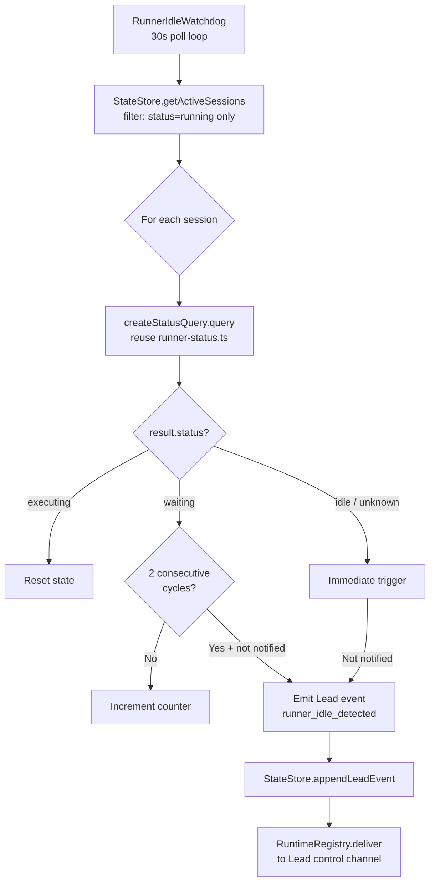

# Plan: Runner Idle Watchdog — System-Level Idle Detection

**Version**: v1.22.0
**Issue**: FLY-92
**Date**: 2026-04-12
**Source**: Agent Team source code analysis (`claude-code/src/utils/swarm/`)
**Status**: draft

---

## Problem

Runner (Claude Code in tmux) stops and waits for user input (MCP OAuth, permission prompt, needs Annie's decision), but Lead has no idea. Runner has CommDB gate tools (`flywheel-comm ask`) but Claude doesn't recognize "I'm stuck" and doesn't use them.

**Real case**: GEO-312 — Runner hit Linear MCP OAuth wall, stuck at `❯` prompt. Peter didn't know.

**Annie's direction**: No prompt patches. System-level hook/state detection, referencing Claude Code Agent Team's idle detection mechanism.

## Agent Team Reference Architecture

Agent Team uses two idle detection paths (both event-driven, zero debounce):

### Path 1: In-Process (`inProcessRunner.ts:1311-1347`)
```
runAgent() for-await ends → isIdle = true → sendIdleNotification()
→ leader receives via 500ms mailbox poll
```

### Path 2: Process-Based (`teammateInit.ts:97-126`)
```
Claude Code session Stop hook fires → createIdleNotification()
→ writeToMailbox(leaderName, notification)
```

Both paths share:
- **Instant trigger** — zero debounce, fires on state transition
- **Dedup** — `wasAlreadyIdle` flag prevents duplicate notifications
- **Structured notification** — `{ type: 'idle_notification', from, timestamp, idleReason, summary }`
- **Three idle reasons** — `available | interrupted | failed`

### Why Flywheel Can't Use Either Path
Flywheel Runners are independent tmux processes, not in-process subagents or co-located teammates. No shared memory, no lifecycle hooks. Must use **external observation** via `tmux capture-pane`.

## Design

### Architecture



### Design Decisions (All Referencing Agent Team)

| Decision | Agent Team | Flywheel Equivalent | Rationale |
|----------|-----------|---------------------|-----------|
| **Poll interval** | Instant (event-driven) + 500ms mailbox | **30s** | tmux capture-pane has 5s timeout per session; multiple sessions fan out. Agent Team is instant because it's in-process. |
| **Trigger threshold** | Zero debounce | **waiting: 2 cycles (60s); idle/unknown: immediate** | Agent Team has zero debounce because event-driven detection can't false-positive. tmux capture may catch transient prompts (brief permission dialogs), so 2-cycle filter. idle/unknown are definitive. |
| **Architecture** | Embedded in agent loop / Stop hook | **Independent `RunnerIdleWatchdog.ts`** (peer of HeartbeatService) | Agent Team embeds because same process. External observation requires independent service. |
| **Notification content** | `{ type, from, idleReason, summary }` | HookPayload with `event_type: 'runner_idle_detected'` + `summary` (terminal snapshot) | Uses existing Lead event system, not CommDB gate questions. |
| **Dedup** | `wasAlreadyIdle` flag per task | `Map<executionId, { notifiedForStatus, transitionCounter }>` | Same logic: only notify on state transition. Transition counter is **monotonically increasing** (never resets); `executing` only clears `notifiedForStatus` and `waitingCycleCount`, so re-entry into same idle status generates a new unique eventId. |
| **Notification channel** | Mailbox → leader poll | **Direct Lead event** via `StateStore.appendLeadEvent()` + `RuntimeRegistry.deliver()` | Reuse existing Lead event pipeline (same as HeartbeatService). NOT CommDB gate questions — those would pollute Runner's dynamic timeout semantics (see Codex review Round 1). |
| **Session eligibility** | All teammates | **Only `running` sessions** | `awaiting_review` and `approved_to_ship` already have dedicated gate questions via existing GatePoller. Monitoring them would cause double notifications. |
| **Delivery reliability** | In-process (no delivery failure possible) | **Guardrail event** — `runner_idle_detected` added to `GUARDRAIL_EVENT_TYPES`; undelivered events retried by `HeartbeatService.retryUndeliveredGuardrailEvents()` | Agent Team is in-process so delivery is infallible. Flywheel uses IPC via Discord, which can fail. Reuse existing guardrail retry (max 3 delivery attempts, cumulative across heartbeat cycles — matches `RegistryHeartbeatNotifier.MAX_DELIVERY_ATTEMPTS`). |
| **Infra error handling** | N/A (in-process) | **`captureErrorStatus` check** — skip idle notification when capture fails with non-tmux errors (400/404/CommDB 502) | `createStatusQuery()` distinguishes tmux-unreachable (`unknown`, no `captureErrorStatus`) from infra errors (`unknown` + `captureErrorStatus`). Only tmux-unreachable is a valid idle signal. |

### Why NOT CommDB Gate Questions

Codex Round 1 identified a critical issue: CommDB gate questions are not a pure notification channel.

Using `insertQuestion()` with `checkpoint: 'IDLE_DETECTED'` would:
1. **Change Runner timeout semantics**: `TmuxAdapter.checkDynamicTimeout()` calls `hasPendingQuestionsFrom(executionId)`, changing the timeout behavior for the Runner
2. **Pollute bootstrap**: `bootstrap-generator.ts` includes all `checkpoint != null` pending questions as real gate questions in crash recovery
3. **Duplicate with existing gates**: `approve_to_ship` gates already exist for certain stages; synthetic idle gates would create confusion

Instead, we use the **direct Lead event channel** — same pattern as `HeartbeatService` for `session_stuck` / `session_orphaned` events. This is a one-way notification to the Lead, with no side effects on Runner behavior.

### Idle Reason Mapping

| Runner Status | Agent Team Equivalent | Event Summary |
|--------------|----------------------|---------------|
| `waiting` (2 cycles) | Permission bridge intercept | "Runner waiting for input: {terminal last 15 lines}" |
| `idle` (shell prompt) | idle (available) | "Runner exited to shell prompt — may need restart" |
| `unknown` (tmux gone) | idle (failed) | "Runner tmux session unreachable" |

Note: `unknown` is the correct status when tmux is unreachable — this comes from `createStatusQuery()` in `runner-status.ts`, not from `detectTerminalStatus()` which only returns `executing | waiting | idle`.

### Code Structure

```typescript
// packages/teamlead/src/RunnerIdleWatchdog.ts

import { type StatusQueryResult, createStatusQuery } from "./bridge/runner-status.js";
import type { LeadConfig, ProjectEntry } from "./ProjectConfig.js";
import { resolveLeadForIssue } from "./ProjectConfig.js";
import type { StateStore } from "./StateStore.js";
import { parseSessionLabels } from "./bridge/lead-scope.js";
import type { HookPayload } from "./bridge/hook-payload.js";
import type { RuntimeRegistry } from "./bridge/runtime-registry.js";
import type { CaptureSessionFn } from "./bridge/tools.js";

export interface IdleWatchdogConfig {
  pollIntervalMs: number;          // 30_000
  waitingThresholdCycles: number;   // 2
  projects: ProjectEntry[];
  store: StateStore;
  runtimeRegistry: RuntimeRegistry;
  captureSessionFn: CaptureSessionFn;  // injected, same as tools.ts
}

type IdleStatus = "waiting" | "idle" | "unknown";

type SessionIdleState = {
  lastStatus: string;              // last detected status
  waitingCycleCount: number;       // consecutive "waiting" cycles
  notifiedForStatus: IdleStatus | null;  // dedup: what we last notified for
  transitionCounter: number;       // increments on each executing→idle transition (for unique eventId)
};

export class RunnerIdleWatchdog {
  private stateMap = new Map<string, SessionIdleState>();
  private timerHandle: ReturnType<typeof setInterval> | null = null;
  private polling = false;
  private statusQuery: ReturnType<typeof createStatusQuery>;

  constructor(private config: IdleWatchdogConfig) {
    // Reuse the composed status query from runner-status.ts
    // (capture → heuristic → 45s stall watchdog)
    this.statusQuery = createStatusQuery(config.captureSessionFn);
  }

  start(): void {
    if (this.timerHandle) return;
    this.timerHandle = setInterval(() => this.poll(), this.config.pollIntervalMs);
  }

  stop(): void {
    if (this.timerHandle) {
      clearInterval(this.timerHandle);
      this.timerHandle = null;
    }
    this.statusQuery.stopEviction();
  }

  private async poll(): Promise<void> {
    if (this.polling) return;
    this.polling = true;
    try {
      // Only monitor "running" sessions — awaiting_review/approved_to_ship
      // already have dedicated gate questions via GatePoller
      const sessions = this.config.store
        .getActiveSessions()
        .filter(s => s.status === "running");

      // Evict stale entries for sessions no longer active
      const activeIds = new Set(sessions.map(s => s.execution_id));
      for (const key of this.stateMap.keys()) {
        if (!activeIds.has(key)) this.stateMap.delete(key);
      }

      for (const session of sessions) {
        await this.checkSession(session);
      }
    } finally {
      this.polling = false;
    }
  }

  private async checkSession(session: Session): Promise<void> {
    try {
      const { result, captureErrorStatus } = await this.statusQuery.query(
        session.execution_id,
        session.project_name,
      );

      // Skip idle notification for infra errors (400/404/CommDB 502).
      // Only tmux-unreachable (no captureErrorStatus) is a valid idle signal.
      if (captureErrorStatus) {
        console.warn(
          `[IdleWatchdog] Infra error for ${session.execution_id} (HTTP ${captureErrorStatus}): ${result.reason} — skipping`,
        );
        return;
      }

      const state = this.stateMap.get(session.execution_id) ?? {
        lastStatus: "executing",
        waitingCycleCount: 0,
        notifiedForStatus: null,
        transitionCounter: 0,
      };

      state.lastStatus = result.status;

      if (result.status === "executing") {
        // Active — clear dedup state only; transitionCounter stays monotonic
        state.waitingCycleCount = 0;
        state.notifiedForStatus = null;
      } else if (result.status === "waiting") {
        state.waitingCycleCount++;
        if (
          state.waitingCycleCount >= this.config.waitingThresholdCycles &&
          state.notifiedForStatus !== "waiting"
        ) {
          state.transitionCounter++;
          const delivered = await this.emitIdleEvent(session, "waiting", result.reason, state.transitionCounter);
          if (delivered) state.notifiedForStatus = "waiting";
        }
      } else {
        // "idle" or "unknown" — immediate trigger
        const idleStatus = result.status as IdleStatus;
        if (state.notifiedForStatus !== idleStatus) {
          state.transitionCounter++;
          const delivered = await this.emitIdleEvent(session, idleStatus, result.reason, state.transitionCounter);
          if (delivered) state.notifiedForStatus = idleStatus;
        }
      }

      this.stateMap.set(session.execution_id, state);
    } catch (err) {
      console.warn(
        `[IdleWatchdog] Error checking ${session.execution_id}:`,
        err instanceof Error ? err.message : String(err),
      );
    }
  }

  /**
   * Emit a runner_idle_detected Lead event.
   * Returns true if the event was persisted (delivery will be retried by guardrail if needed).
   */
  private async emitIdleEvent(
    session: Session,
    detectedStatus: IdleStatus,
    reason: string,
    transitionCounter: number,
  ): Promise<boolean> {
    // Resolve which Lead owns this session
    const labels = parseSessionLabels(session);
    let lead: LeadConfig;
    try {
      ({ lead } = resolveLeadForIssue(
        this.config.projects,
        session.project_name,
        labels,
      ));
    } catch {
      return false; // No lead resolved
    }

    // Transition-scoped eventId: transitionCounter is monotonically increasing
    // (never resets), so re-entry into the same idle status generates a new unique event.
    const eventId = `idle_${session.execution_id}_${detectedStatus}_${transitionCounter}`;
    if (this.config.store.isLeadEventDelivered(lead.agentId, eventId)) return true;

    const payload: HookPayload = {
      event_type: "runner_idle_detected",
      execution_id: session.execution_id,
      issue_id: session.issue_id,
      issue_identifier: session.issue_identifier,
      project_name: session.project_name,
      status: detectedStatus,
      summary: reason,
      session_role: session.session_role ?? "main",
    };

    const seq = this.config.store.appendLeadEvent(
      lead.agentId,
      eventId,
      "runner_idle_detected",
      JSON.stringify(payload),
      session.execution_id,
    );

    // Event is now persisted — even if delivery fails here,
    // retryUndeliveredGuardrailEvents() will pick it up next heartbeat cycle.
    const runtime = this.config.runtimeRegistry.getForLead(lead.agentId);
    if (runtime) {
      const envelope = { seq, event: payload, sessionKey: session.execution_id, leadId: lead.agentId, timestamp: new Date().toISOString() };
      const result = await runtime.deliver(envelope);
      if (result.delivered) {
        this.config.store.markLeadEventDelivered(seq);
      } else {
        this.config.store.recordDeliveryFailure(seq, result.error ?? "deliver returned false");
      }
    }

    console.log(`[IdleWatchdog] Emitted runner_idle_detected for ${session.execution_id} (${detectedStatus}: ${reason})`);
    return true; // Persisted — safe to update notifiedForStatus
  }
}
```

### Integration Points

| Component | How Used | Changes Needed |
|-----------|---------|----------------|
| `runner-status.ts` → `createStatusQuery()` | Reuse composed status query (capture + heuristic + stall watchdog) | None |
| `StateStore.appendLeadEvent()` | Persist event for delivery tracking | None |
| `RuntimeRegistry.deliver()` | Deliver to Lead's Discord control channel | None |
| `StateStore.getActiveSessions()` | List sessions to monitor | None |
| `plugin.ts` | Start/stop watchdog alongside other services | Add watchdog instantiation |
| `lead-scope.ts` → `parseSessionLabels()` / `resolveLeadForIssue()` | Route event to correct Lead | None |
| `lead-runtime.ts` → `GUARDRAIL_EVENT_TYPES` | Add `runner_idle_detected` for delivery retry | **Add to set** |
| `HeartbeatService` → `retryUndeliveredGuardrailEvents()` | Retry undelivered idle events each heartbeat cycle | None (already handles all guardrail event types) |

### Relationship with FLY-88 (cmux-sync)

**Independent implementation** — different concerns, different tech stacks:
- cmux-sync = shell script for workspace mirroring (tmux → cmux)
- IdleWatchdog = TypeScript service for state detection + Lead notification
- Shared: session enumeration via `StateStore.getActiveSessions()`
- No coupling — cmux-sync may be replaced/removed; watchdog is core infrastructure

## Implementation Steps

### Step 1: Create `RunnerIdleWatchdog.ts`

New file: `packages/teamlead/src/RunnerIdleWatchdog.ts`

Core logic:
1. Constructor takes `IdleWatchdogConfig` including `captureSessionFn` (injected)
2. Creates `statusQuery` via `createStatusQuery(captureSessionFn)` — reuses all existing runner-status logic
3. Poll loop (30s interval, guard against concurrent polls)
4. Session enumeration from `StateStore.getActiveSessions()`, filtered to `running` only
5. Per-session status check via `statusQuery.query(executionId, projectName)`
6. **`captureErrorStatus` check** — skip idle notification for infra errors (400/404/CommDB 502); only tmux-unreachable (`unknown` without `captureErrorStatus`) is a valid idle signal
7. State machine (executing→clear dedup state, waiting→count with 2-cycle threshold, idle/unknown→immediate)
8. **Transition-scoped eventId** — `idle_${executionId}_${status}_${transitionCounter}`; counter is monotonically increasing (increments on each idle entry, never resets), so re-entry into the same idle status generates a new unique eventId
9. Lead event emission via `StateStore.appendLeadEvent()` + `RuntimeRegistry.deliver()`
10. **Conditional dedup update** — `notifiedForStatus` only set after `emitIdleEvent()` confirms event persisted; delivery failures are retried by guardrail mechanism
11. Stale entry eviction (remove entries for sessions no longer active)

### Step 2: Add `runner_idle_detected` to `GUARDRAIL_EVENT_TYPES`

In `packages/teamlead/src/bridge/lead-runtime.ts`:
```typescript
export const GUARDRAIL_EVENT_TYPES = new Set([
  "session_stuck",
  "session_orphaned",
  "session_stale_completed",
  "runner_idle_detected",  // FLY-92: idle watchdog events must be reliably delivered
]);
```

This ensures `HeartbeatService.retryUndeliveredGuardrailEvents()` picks up undelivered idle events on each heartbeat cycle — no new retry code needed.

### Step 3: Wire into `plugin.ts`

Add alongside HeartbeatService and GatePoller (around line 1544):
```typescript
import { RunnerIdleWatchdog } from "../RunnerIdleWatchdog.js";

const idleWatchdog = new RunnerIdleWatchdog({
  pollIntervalMs: 30_000,
  waitingThresholdCycles: 2,
  projects,
  store,
  runtimeRegistry: registry,
  captureSessionFn: defaultCaptureSession,
});
idleWatchdog.start();
```

Add `idleWatchdog.stop()` to the `close` function.

### Step 4: Tests

New file: `packages/teamlead/src/__tests__/runner-idle-watchdog.test.ts`

Test cases:
1. **State transitions**: executing→waiting→waiting (triggers) → executing (clears dedup state, counter stays monotonic)
2. **Dedup**: Same status doesn't re-notify within one transition
3. **Re-entry dedup**: executing→waiting (notifies) → executing→waiting (notifies again with new eventId)
4. **Immediate trigger**: idle/unknown status triggers without debounce
5. **Event payload**: Correct event_type, execution_id, status, summary
6. **Session eligibility**: Only `running` sessions monitored (not `awaiting_review`)
7. **Stale entry eviction**: Entries removed when session no longer active
8. **Concurrent poll guard**: Second poll skipped if first still running
9. **captureErrorStatus**: Infra errors (400/404) skip idle notification, only tmux-unreachable triggers
10. **Delivery failure**: Event persisted even if `deliver()` fails; `notifiedForStatus` updated (no duplicate append on next poll); undelivered event retried by `HeartbeatService.retryUndeliveredGuardrailEvents()`
11. **GUARDRAIL_EVENT_TYPES**: Verify `runner_idle_detected` is included

## File Changes

| File | Change |
|------|--------|
| `packages/teamlead/src/RunnerIdleWatchdog.ts` | **NEW** — Core watchdog service |
| `packages/teamlead/src/bridge/plugin.ts` | MODIFY — Start/stop watchdog |
| `packages/teamlead/src/bridge/lead-runtime.ts` | MODIFY — Add `runner_idle_detected` to `GUARDRAIL_EVENT_TYPES` |
| `packages/teamlead/src/__tests__/runner-idle-watchdog.test.ts` | **NEW** — Unit tests |

## Scope Boundaries (Not Touched)

- ❌ HeartbeatService — not modified; its `retryUndeliveredGuardrailEvents()` automatically picks up the new event type via `GUARDRAIL_EVENT_TYPES`
- ❌ GatePoller — not involved; idle notifications use direct Lead events
- ❌ CommDB — no gate questions; no schema changes
- ❌ terminal-mcp — no cross-package import (layer violation per runner-status.ts comment)
- ❌ runner-status.ts — only consumed, not modified
- ❌ Runner prompt/rules — Annie explicitly rejected prompt patches

## Risks

| Risk | Mitigation |
|------|-----------|
| tmux capture-pane fails for some sessions | `createStatusQuery()` already handles: returns `unknown` for tmux failures. Watchdog wraps each session in try/catch. |
| False positive on transient "waiting" state | 2-cycle debounce (60s) filters brief permission prompts. Reuses 45s stall watchdog from runner-status.ts. |
| Too many events if Runner stays stuck | Dedup — only one notification per status transition. `executing` clears dedup state for the current transition; `transitionCounter` remains monotonic. |
| Double notification with existing gates | Only monitor `running` sessions. `awaiting_review`/`approved_to_ship` excluded. |
| Watchdog adds CPU overhead | 30s interval is conservative; capture-pane is lightweight (~5ms). |

## Codex Review History

### Round 1 (2026-04-12)
**Status**: CHANGES REQUESTED

Issues addressed:
1. ✅ **Don't use CommDB gate questions** → Changed to direct Lead event via `RuntimeRegistry`
2. ✅ **Cross-package import violation** → Reuse `createStatusQuery()` from `runner-status.ts` (same package)
3. ✅ **`dead` status source inaccurate** → Changed to `unknown` (from `createStatusQuery()`)
4. ✅ **Monitoring scope too wide** → Filter to `running` sessions only
5. ✅ **Should reuse stall watchdog** → Use `createStatusQuery()` which includes 45s stall watchdog

### Round 2 (2026-04-12)
**Status**: CHANGES REQUESTED

Issues addressed:
1. ✅ **eventId permanent dedup** → Changed to transition-scoped eventId: `idle_${executionId}_${status}_${transitionCounter}`. Counter is monotonically increasing (never resets); `executing` only clears `notifiedForStatus` and `waitingCycleCount`. Second entry into same idle status generates new unique eventId.
2. ✅ **`captureErrorStatus` ignored** → Added explicit check: if `captureErrorStatus` is set (400/404/CommDB 502), skip idle notification and log warning. Only tmux-unreachable (`unknown` without `captureErrorStatus`) triggers idle event.
3. ✅ **Delivery failure not retried** → Added `runner_idle_detected` to `GUARDRAIL_EVENT_TYPES` in `lead-runtime.ts`. `notifiedForStatus` only updated after `emitIdleEvent()` confirms event persisted. Undelivered events retried by existing `HeartbeatService.retryUndeliveredGuardrailEvents()` each heartbeat cycle.

### Round 3 (2026-04-12)
**Status**: CHANGES REQUESTED

Issues addressed:
1. ✅ **transitionCounter "reset on executing" text contradiction** → All text updated: counter is monotonically increasing, never resets. `executing` only clears `notifiedForStatus` and `waitingCycleCount`. Code already correct; text was misleading.
2. ✅ **Test case 10 delivery failure semantics** → Updated to match actual model: event persisted → `notifiedForStatus` updated → delivery failure retried by `HeartbeatService.retryUndeliveredGuardrailEvents()`. No duplicate append on next watchdog poll.
3. ✅ **Retry attempt upper limit** → Changed from "max 5 attempts per heartbeat cycle" to "max 3 delivery attempts, cumulative across heartbeat cycles" — matches `RegistryHeartbeatNotifier.MAX_DELIVERY_ATTEMPTS = 3`.

### Round 4 (2026-04-12)
**Status**: CHANGES REQUESTED

Issues addressed:
1. ✅ **Code block comments still said "reset"** → Updated two inline comments: `// Active — reset all counters; next idle entry gets a new transition ID` → `// Active — clear dedup state only; transitionCounter stays monotonic`; `// Transition-scoped eventId: resets when Runner returns to "executing"` → `// transitionCounter is monotonically increasing (never resets)`.

### Round 5 (2026-04-12)
**Status**: CHANGES REQUESTED

Issues addressed:
1. ✅ **Risk table "resets all state"** → Changed to "`executing` clears dedup state for the current transition; `transitionCounter` remains monotonic". Also updated remaining "reset" references in implementation steps and test cases for full consistency.
