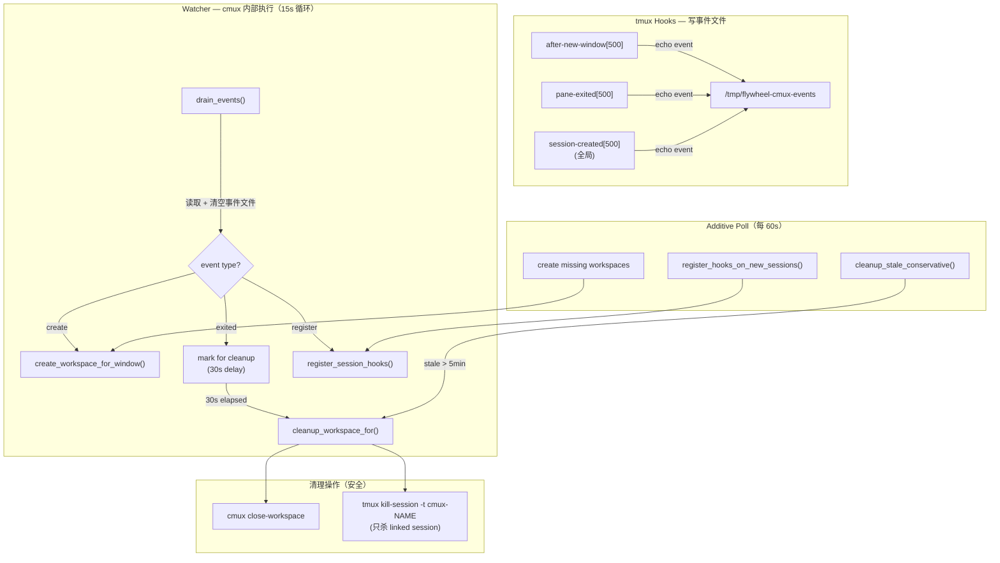

# Plan: Runner Bash Timeout + cmux-sync 架构修复

**Version**: v1.23.0
**Issue**: FLY-102
**Date**: 2026-04-13
**Source**: Runner crash investigation (GEO-312, GEO-349, GEO-358), brainstorm + research
**Status**: codex-approved

## 问题

Runner (Claude Code CLI) 存在两个独立的稳定性问题：

### 问题 1: Bash 工具 10 分钟超时杀死 gate 命令

Runner 的 gate 命令（`flywheel-comm gate brainstorm/approve_to_ship`）通过 Claude Code 的 Bash 工具执行。Bash 工具有 `BASH_MAX_TIMEOUT_MS`（默认 600,000ms = 10 分钟）硬上限，无视 gate 自身的 `--timeout 86400000`（24h）。gate 被杀后 fail-close → Runner 退出。

**证据**: Annie 在 Runner 终端截图中看到 `Running... (2m 47s · timeout 10m)`。

### 问题 2: cmux-sync watcher 导致 Runner crash

`flywheel-cmux-sync.sh` 每 10 秒运行一次 sync 循环，为所有 tmux 窗口（包括 Runner）创建 linked sessions + cmux workspaces。三次 crash 时间与 watcher 操作精确对应：

| Crash | Runner 最后活动 | Watcher cleanup | 差值 |
|-------|----------------|-----------------|------|
| GEO-349 | ~19:48 UTC | 19:48:27 UTC | ~0s |
| GEO-312 | 20:38:58 UTC | 20:39:00 UTC | 2s |
| GEO-358 | ~21:05 UTC | 21:05:57 UTC | ~0s |

## 根因分析

### Bash timeout 根因

Claude Code 源码 `ShellCommand.ts` 中 `BASH_MAX_TIMEOUT_MS` 环境变量可覆盖最大超时：
```
const BASH_MAX_TIMEOUT_MS = parseInt(process.env.BASH_MAX_TIMEOUT_MS ?? "600000")
```
Runner 启动时未注入此变量。

### cmux-sync 架构分析

#### 当前设计的根本问题

**1. 每 10 秒 Polling + 激进清理 = Runner 不安全**

watcher 每 10 秒执行 `sync_once()`，对 runner-* session 的窗口执行：
- `tmux new-session -d -t runner-geoforge3d -s cmux-xxx` — 创建 linked session（加入 session group）
- `tmux kill-session -t cmux-xxx` — 清理 stale linked sessions
- `cmux close-workspace` / `cmux new-workspace` — 管理 cmux workspace

高频创建/删除 linked sessions 可能触发 tmux 3.5a session group 管理的 race condition，间接导致 Runner session 异常。

**2. Linked session + session group 机制脆弱**

`tmux new-session -d -t SOURCE` 创建的 linked session 共享 SOURCE 的**所有窗口**。一个 runner-geoforge3d session 可能有多个 linked sessions（每个 Runner 窗口一个），增加 tmux server 的 session group 管理负担。

**3. cos-lead 疯狂循环暴露设计缺陷**

cos-lead 由 launchd `KeepAlive: true, ThrottleInterval: 30` 管理。crash 后 30 秒重启 → 新窗口 → watcher 清理旧的 + 创建新的 → 循环。watcher log 435 条 cos-lead 记录。虽然不是 Runner crash 的直接原因，但暴露了 polling + 激进清理的设计脆弱性。

#### 排除的直接因果机制

| 机制 | 结论 |
|------|------|
| tmux `destroy-unattached` / `exit-unattached` | ❌ 均为 OFF |
| tmux hooks | ❌ runner/flywheel session 无自定义 hooks |
| Terminal MCP (FLY-11) | ❌ 只有 `capture-pane`（只读） |
| RunnerIdleWatchdog | ❌ 只 emit events，不 kill |
| Blueprint/Decision Layer | ❌ 在 Runner 退出后才运行 |
| TmuxAdapter timeout | ❌ 24h（FLY-97），远超 crash 时间 |

#### 推测的间接因果链

1. cmux watcher 每 10s 对 runner session 的 linked sessions 执行 kill + create
2. 高频 session group 变更触发 tmux 内部 race condition（或 cmux close-workspace 的信号传播）
3. Runner 的 tmux pane 异常退出

## 约束

1. **Runner 窗口必须在 cmux 中可见** — Annie 需要看到 Runner 终端
2. **cmux-sync 绝不能杀 Runner** — 这是底线
3. **Linked session 机制保留** — 用于独立 current-window pointer（cmux 每个 workspace 看不同窗口）
4. **兼容现有 Lead 窗口** — 改动不能影响 Lead workspace 正常工作
5. **cmux CLI 只能从 cmux 内部进程调用** — 外部进程（包括 tmux `run-shell`）无法访问 cmux socket

## 架构设计：Event-Signaled Polling

### 设计原则

- **事件信号 + 内部执行**: tmux hooks 写事件文件（tmux-only），watcher 在 cmux 内部消费事件并执行 cmux 操作
- **Polling 补漏**: watcher 每 15s 检查事件文件，每 60s 做 additive 扫描
- **清理靠事件**: `pane-exited` hook 信号触发清理，polling 只做 5 分钟保守清理兜底
- **不能杀 Runner**: 清理操作只针对 linked session 和 cmux workspace，绝不碰源 session
- **启动不清理**: `--watch` 启动时只做 additive bootstrap（创建缺失），不执行 cleanup

### 架构图



### 关键设计决策

**为什么用 event file 而不是 hooks 直接调 cmux？**

cmux CLI 只能从 cmux 内部进程调用（需要 cmux socket 上下文）。tmux `run-shell -b` 启动的 hook 进程不在 cmux 环境中，无法执行 `cmux new-workspace` 等命令。因此 hooks 只写事件到文件，watcher（已在 cmux 内部运行）负责消费事件并执行 cmux 操作。

**为什么用 `pane-exited` 而不是 `pane-died`？**

tmux 3.5a 同时提供两个 hook：
- `pane-died`: 仅在 `remain-on-exit on` 时触发
- `pane-exited`: 无论 `remain-on-exit` 设置如何，pane 程序退出时都触发

使用 `pane-exited` 统一覆盖 Runner 和 Lead 窗口（均设置了 `remain-on-exit on`），消除两套清理路径的复杂度。注意：`remain-on-exit on` 意味着 pane 退出后 tmux window 仍存在（显示退出码），因此 cleanup 判定不能依赖 "window 是否存在"，必须检查 `#{pane_dead}` 状态。

**为什么不用 `window-renamed` hook？**

Runner 窗口名由 `tmux new-window -n <name>` 在创建时设定（`TmuxAdapter.ts:183-184`），运行期间不会改名。`window-renamed` hook 只增加复杂度而无实际收益。如果未来需要 rename 支持，应基于 window_id 建立状态映射，而非当前的 window_name 匹配。

**为什么 hook 使用 array index `[500]`？**

tmux 3.5a 中 hook 是 array option。不指定 index 的 `set-hook` 会**清空整个数组并设置第一个元素**。使用高 index `[500]` 避免覆盖其他工具可能注册的 hooks，同时保证重复注册幂等（覆盖同一 index）。

### tmux hooks 环境

| Hook | 触发条件 | 作用域 | 使用的 format 变量 |
|------|---------|--------|-------------------|
| `after-new-window[500]` | 新窗口创建 | per-session | `#{hook_session_name}`, `#{hook_window}`, `#{hook_window_name}` |
| `pane-exited[500]` | pane 程序退出 | per-session | `#{hook_session_name}`, `#{hook_window_name}` |
| `session-created[500]` | 新 session 创建 | **全局** | `#{hook_session_name}` |

### Event File

路径: `/tmp/flywheel-cmux-events`

格式（每行一个事件，**不含时间戳**——时间戳由 watcher drain 时添加）:
```
create|<session_name>|<window_id>|<window_name>
exited|<session_name>|<window_name>
register|<session_name>
```

**为什么事件不含时间戳？** hook 命令在 `register_session_hooks()` 时被 shell 求值。如果在 hook 命令里写 `$(date +%s)`，shell 会在注册时展开为常量，而非每次触发时求值。把时间戳推迟到 watcher `drain_events()` 时用 `$(date +%s)` 生成，保证时间精确反映事件实际到达时间。

原子性：hooks 使用 `>>` append（POSIX 原子 for single write < PIPE_BUF）。watcher 使用 `mv` + read + process 避免读写竞争。

### Hook 注册

```bash
SYNC_CMD="$HOME/.flywheel/bin/flywheel-cmux-sync"
EVENT_FILE="/tmp/flywheel-cmux-events"

register_session_hooks() {
  local session="$1"
  # 只管理 flywheel 和 runner-* sessions
  case "$session" in
    flywheel|runner-*) ;;
    *) return 0 ;;
  esac

  # 使用 array index [500] 避免覆盖其他 hooks，重复注册幂等
  # 注意：不含 $(date +%s) — 时间戳由 watcher drain 时添加（避免注册时静态展开）
  tmux set-hook -t "$session" 'after-new-window[500]' \
    "run-shell -b 'echo \"create|#{hook_session_name}|#{hook_window}|#{hook_window_name}\" >> $EVENT_FILE'"
  tmux set-hook -t "$session" 'pane-exited[500]' \
    "run-shell -b 'echo \"exited|#{hook_session_name}|#{hook_window_name}\" >> $EVENT_FILE'"
  log "Hooks registered on session: $session"
}

register_global_hooks() {
  tmux set-hook -g 'session-created[500]' \
    "run-shell -b 'echo \"register|#{hook_session_name}\" >> $EVENT_FILE'"
}
```

### Event Drain（watcher 侧）

```bash
drain_events() {
  [[ ! -f "$EVENT_FILE" ]] && return 0

  # 原子读取：mv → read → process
  local tmp_events="/tmp/flywheel-cmux-events.processing"
  mv "$EVENT_FILE" "$tmp_events" 2>/dev/null || return 0

  # 时间戳在 drain 时生成（不在 hook 注册时，避免静态展开问题）
  local now
  now=$(date +%s)

  while IFS='|' read -r etype arg1 arg2 arg3; do
    case "$etype" in
      create)
        local session="$arg1" wid="$arg2" wname="$arg3"
        [[ "$wname" == "zsh" || "$wname" == "bash" ]] && continue
        if ! workspace_exists_for "$wname"; then
          create_workspace_for_window "$session" "$wid" "$wname"
        fi
        ;;
      exited)
        local session="$arg1" wname="$arg2"
        [[ "$wname" == "zsh" || "$wname" == "bash" ]] && continue
        # 用 drain 时的时间戳记录退出时间，延迟清理
        mark_for_cleanup "$wname" "$now"
        ;;
      register)
        local session="$arg1"
        register_session_hooks "$session"
        ;;
    esac
  done < "$tmp_events"
  rm -f "$tmp_events"
}
```

### 延迟清理

```bash
CLEANUP_PENDING="/tmp/flywheel-cmux-cleanup-pending"

is_pane_alive() {
  # 检查指定窗口名的 pane 是否仍活着（非 dead）
  # remain-on-exit on 时 window 仍存在但 pane_dead=1 → 返回 false
  # window 不存在 → 返回 false
  # window 存在且 pane 活着 → 返回 true
  local wname="$1"
  local sessions
  sessions=$(get_tmux_agent_windows | grep "|${wname}$" || true)
  [[ -z "$sessions" ]] && return 1

  while IFS='|' read -r sess wid name; do
    local dead
    dead=$(tmux display-message -p -t "=${sess}:=${name}" "#{pane_dead}" 2>/dev/null || echo "1")
    if [[ "$dead" == "0" ]]; then
      return 0  # 至少一个 pane 是活的
    fi
  done <<< "$sessions"
  return 1  # 所有匹配的 pane 都是 dead 或不存在
}

mark_for_cleanup() {
  local wname="$1" ts="$2"
  # 只在没有 pending 记录时添加
  grep -q "^${wname}|" "$CLEANUP_PENDING" 2>/dev/null || \
    echo "${wname}|${ts}" >> "$CLEANUP_PENDING"
}

process_pending_cleanups() {
  [[ ! -f "$CLEANUP_PENDING" ]] && return 0

  local now remaining=""
  now=$(date +%s)

  while IFS='|' read -r wname ts; do
    # Pane 又活了（新进程启动） → 取消清理
    # 注意：不能用 "window 是否存在" 判断，因为 remain-on-exit on 时
    # window 仍存在但 pane 已 dead。必须检查 #{pane_dead} 状态。
    if is_pane_alive "$wname"; then
      continue
    fi
    # 未满 30s → 保留
    if (( now - ts < 30 )); then
      remaining+="${wname}|${ts}"$'\n'
      continue
    fi
    # 满 30s + pane 确实已死 → 清理
    log "Event cleanup: '$wname' (exited $((now - ts))s ago)"
    cleanup_workspace_for "$wname"
  done < "$CLEANUP_PENDING"

  # 回写剩余
  if [[ -n "$remaining" ]]; then
    echo -n "$remaining" > "$CLEANUP_PENDING"
  else
    rm -f "$CLEANUP_PENDING"
  fi
}
```

### 保守清理（5 分钟阈值，polling fallback）

```bash
STALE_STATE="/tmp/flywheel-cmux-stale.state"

cleanup_stale_conservative() {
  local active_names
  active_names=$(get_tmux_agent_windows | cut -d'|' -f3)

  local linked_sessions
  linked_sessions=$(tmux list-sessions -F '#{session_name}' 2>/dev/null | grep "^${VIEW_PREFIX}" || true)
  [[ -z "$linked_sessions" ]] && return 0

  local now
  now=$(date +%s)

  while read -r sess; do
    local agent_name="${sess#${VIEW_PREFIX}}"
    if ! echo "$active_names" | grep -qx "$agent_name"; then
      local first_stale
      first_stale=$(grep "^${agent_name}|" "$STALE_STATE" 2>/dev/null | cut -d'|' -f2 || true)
      if [[ -z "$first_stale" ]]; then
        echo "${agent_name}|${now}" >> "$STALE_STATE"
      elif (( now - first_stale >= 300 )); then
        log "Conservative cleanup: $sess (stale for $((now - first_stale))s)"
        cleanup_workspace_for "$agent_name"
        sed -i '' "/^${agent_name}|/d" "$STALE_STATE"
      fi
    else
      sed -i '' "/^${agent_name}|/d" "$STALE_STATE" 2>/dev/null || true
    fi
  done <<< "$linked_sessions"
}
```

### Watcher 主循环

```bash
--watch)
  log "Watch mode: event-signaled polling (15s event drain, 60s additive)"
  # 1. 注册 hooks
  register_global_hooks
  register_hooks_on_new_sessions
  # 2. Additive-only bootstrap（绝不 cleanup）
  sync_additive_bootstrap
  # 3. 轮询循环
  local tick=0
  while true; do
    sleep 15
    tick=$((tick + 1))
    # 每 15s: drain events + process pending cleanups
    drain_events
    process_pending_cleanups
    # 每 60s: additive scan + conservative stale cleanup
    if (( tick % 4 == 0 )); then
      sync_additive
    fi
  done
  ;;
```

### sync_additive_bootstrap（启动时 additive-only）

```bash
sync_additive_bootstrap() {
  local tmux_windows
  tmux_windows=$(get_tmux_agent_windows)
  [[ -z "$tmux_windows" ]] && return 0

  # 1. Reconcile: 修复 "workspace 存在但 linked session 已死" 的状态
  #    （保留 FLY-98 reconcile 语义——关闭 broken workspace 让 create 重建）
  reconcile_existing_workspaces

  # 2. Refresh linked sessions（修复 stale window pointer）
  refresh_linked_sessions

  # 3. 创建缺失 workspace（additive only，不做激进 cleanup）
  while IFS='|' read -r src_sess wid wname; do
    if ! workspace_exists_for "$wname"; then
      create_workspace_for_window "$src_sess" "$wid" "$wname"
    fi
  done <<< "$tmux_windows"
}
```

### sync_additive（60s 轮询）

```bash
sync_additive() {
  # 1. 检测新 session → 注册 hooks（补漏）
  register_hooks_on_new_sessions

  local tmux_windows
  tmux_windows=$(get_tmux_agent_windows)
  [[ -z "$tmux_windows" ]] && return 0

  # 2. Reconcile: 修复 "workspace 存在但 linked session 已死" 的状态
  reconcile_existing_workspaces

  # 3. Refresh linked sessions
  refresh_linked_sessions

  # 4. 创建缺失 workspace（仅 additive）
  while IFS='|' read -r src_sess wid wname; do
    if ! workspace_exists_for "$wname"; then
      create_workspace_for_window "$src_sess" "$wid" "$wname"
    fi
  done <<< "$tmux_windows"

  # 5. 保守清理（stale > 5 分钟）
  cleanup_stale_conservative
}
```

### CLI 模式

| 模式 | 用途 | 调用者 |
|------|------|--------|
| `--once` | 全量同步（保留，不变） | **手动**使用 |
| `--watch` | Event-signaled polling | autostart.sh |
| `--refresh` | tmux-only 修复（保留，不变） | Lead 启动时 |

注意：不再有 `--hook-*` CLI 模式。hooks 直接写 event file，不调用脚本。

## 修复方案

### Fix 1: BASH_MAX_TIMEOUT_MS 环境变量注入（已实现 ✅）

**文件**: `packages/claude-runner/src/TmuxAdapter.ts` (line 169-172)

在 Runner tmux 启动命令中注入 `-e BASH_MAX_TIMEOUT_MS=86400000`，让 Bash 工具的最大超时匹配 session timeout（24h）。

### Fix 2: Pane exit diagnostics（已实现 ✅）

**文件**: `packages/claude-runner/src/TmuxAdapter.ts`

在 v0.1.1 和 v0.2 两个 poller 中，`#{pane_dead}` → `#{pane_dead}|#{pane_dead_status}`，pane 死亡时记录 exit code。

### Fix 3: cmux-sync Event-Signaled Polling 重构

**文件**: `scripts/flywheel-cmux-sync.sh`

**变更内容**:

1. **新增**: `register_session_hooks()` — 注册 per-session tmux hooks（array index `[500]`）
2. **新增**: `register_global_hooks()` — 注册全局 `session-created[500]` hook
3. **新增**: `register_hooks_on_new_sessions()` — 扫描并注册 hooks
4. **新增**: `drain_events()` — 读取 event file，执行 create/register，记录 cleanup pending
5. **新增**: `is_pane_alive()` — 检查 pane 是否仍活着（使用 `#{pane_dead}`，正确处理 `remain-on-exit`）
6. **新增**: `mark_for_cleanup()` + `process_pending_cleanups()` — 30s 延迟清理（使用 `is_pane_alive` 而非 window 存在性检查）
7. **新增**: `cleanup_workspace_for()` — 单个 workspace 清理辅助函数
7. **新增**: `cleanup_stale_conservative()` — 5 分钟阈值保守清理
8. **新增**: `sync_additive_bootstrap()` — 启动时 additive-only 初始化（含 reconcile repair）
9. **新增**: `sync_additive()` — 60s polling 主函数（reconcile + additive + conservative cleanup）
10. **修改**: `--watch` 模式 — hooks + event drain (15s) + additive poll (60s)
11. **保留**: `--once`, `--refresh` 不变
12. **保留**: `sync_once()` 仅用于手动 `--once`
13. **保留**: `reconcile_existing_workspaces()` — 修复 "workspace 存在但 linked session 已死" 状态（FLY-98 语义）

**关键改动对比**:

| 维度 | 旧设计 | 新设计 |
|------|--------|--------|
| 同步模式 | Polling only (10s) | Event-signaled polling (15s drain + 60s additive) |
| 创建 workspace | Polling 检测 (≤10s) | Event 信号 ≤15s + Polling 补漏 ≤60s |
| 清理 workspace | Polling 立即清理 (10s) | Event 延迟清理 (30s) + 保守清理 (5min) |
| cmux 操作位置 | watcher 直接执行 | watcher 在 cmux 内部执行（hooks 不碰 cmux） |
| Hook 注册 | 无 | 全局 `session-created[500]` + per-session `after-new-window[500]` / `pane-exited[500]` |
| Runner 风险 | **高**: 每 10s 操作 linked sessions | **极低**: 事件驱动，清理有 30s 延迟确认 |
| 启动行为 | `sync_once()`（含激进清理） | `sync_additive_bootstrap()`（仅创建） |

## 变更摘要

| 文件 | 变更 | 估算行数 |
|------|------|----------|
| `packages/claude-runner/src/TmuxAdapter.ts` | BASH_MAX_TIMEOUT_MS + pane_dead_status（已完成） | +27/-4 |
| `scripts/flywheel-cmux-sync.sh` | Event-Signaled Polling 重构 | +180/-20 |

## 实施顺序

1. ~~Fix 1: BASH_MAX_TIMEOUT_MS~~ ✅ 已在 PR #146
2. ~~Fix 2: pane_dead_status~~ ✅ 已在 PR #146
3. Fix 3: cmux-sync 重构（本次实施重点）
   - Step 1: 新增 `cleanup_workspace_for()` 辅助函数（从 `cleanup_stale_workspaces` 提取）
   - Step 2: 新增 event file infrastructure（`drain_events`, `mark_for_cleanup`, `process_pending_cleanups`）
   - Step 3: 新增 hook 注册函数（`register_session_hooks`, `register_global_hooks`, `register_hooks_on_new_sessions`）
   - Step 4: 新增 `sync_additive_bootstrap()` + `sync_additive()` + `cleanup_stale_conservative()`
   - Step 5: 修改 `--watch` 模式主循环
   - Step 6: 测试验证

## 测试计划

### Event 功能测试

1. **创建事件**: `tmux new-window -t flywheel -n test-hook` → event file 出现 `create|...` 行 → 15s 内 cmux workspace 出现
2. **退出事件**: kill Runner pane → event file 出现 `exited|...` 行 → 30-45s 内 workspace 清理（15s drain 周期 + 30s 延迟）
3. **Session 事件**: 创建新 runner-* session → event file 出现 `register|...` 行 → hooks 自动注册

### Polling fallback 测试

4. **补漏**: 手动删除 event file → 创建新窗口 → 60s 内 workspace 出现
5. **保守清理**: 手动关闭 tmux 窗口 → 5 分钟后 workspace 清理

### remain-on-exit 场景测试（核心验收）

6. **Runner pane 退出 + window 留存**: kill Runner pane → 确认 tmux window 仍存在（`remain-on-exit`）→ 确认 `is_pane_alive` 返回 false → 30-45s 内 cmux workspace 和 linked session 被清理
7. **Lead pane 退出**: Lead 进程退出 → 同上验证 cleanup 在 30-45s 内正确执行
8. **Pane 重启取消清理**: Runner pane 退出 → 10s 内新进程启动 → cleanup 被取消

### Runner 稳定性测试

9. **长时间运行**: Runner 启动 → gate 等待 > 30 分钟 → Runner 保持稳定
10. **cmux 可见性**: Runner 窗口出现在 cmux workspace tabs 中
11. **watcher log**: Runner 相关条目只有 create，无 cleanup（除非 Runner 正常退出）

### 回归测试

12. **Lead 窗口**: Lead workspace 正常显示、切换
13. **cmux 重启**: 关闭 cmux → 重新打开 → workspace 在 60s 内重建
14. **watcher 重启**: kill watcher → autostart 重启 → hooks 重新注册，workspace 不中断
15. **Hook 幂等**: 重复注册 hooks → 无副作用（同一 array index 覆盖）

## 风险评估

| 风险 | 级别 | 缓解 |
|------|------|------|
| tmux hook 在 3.5a 中不稳定 | 低 | 已验证 `after-new-window`, `pane-exited`, `session-created` 在 3.5a man page 中存在。`run-shell -b` 异步执行不阻塞 tmux |
| Hook 覆盖已有 hooks | 无 | 使用 array index `[500]` 避免覆盖其他工具的 hooks。重复注册覆盖同一 index |
| Event file 竞争写入 | 极低 | `echo ... >> file` 是 POSIX 原子操作（< PIPE_BUF）。Watcher 用 `mv` drain 避免读写同时发生 |
| `pane-exited` 比 `pane-died` 触发范围更广 | 可接受 | 这是优点：统一覆盖 Runner + Lead 窗口，无需区分 `remain-on-exit` 设置 |
| 全局 `session-created` hook 影响其他 session | 低 | Hook 只 echo 到 event file。Watcher 在消费时检查 session name，非 flywheel/runner-* 直接跳过 |
| 30s 延迟清理不够/太长 | 可接受 | 30s 远超正常 pane restart 时间（< 5s），同时不影响用户体验。可通过环境变量配置 |
| 5 分钟保守清理兜底不够 | 可接受 | 最坏情况：stale workspace 多存在 5 分钟。无功能影响 |
| `--once` 模式仍有激进清理 | 可接受 | `--once` 仅用于手动场景，用户明确知道在做什么 |

## 已实施的鲁棒性加固（Codex Round 1 反馈采纳）

- **`cleanup_stale_conservative()` 使用 `is_pane_alive()`**: 替代原先的 window 存在性检查，覆盖 `remain-on-exit on` 下 "window 留存但 pane 已死" 的场景。闭合了 event 丢失 + remain-on-exit 组合导致的 workspace/linked-session leak 边缘场景。
- **`drain_events` crash recovery**: drain 开始时若检测到 `${EVENT_FILE}.processing` 遗留（上次 drain 中断），先将其合并回当前 event file 再执行 `mv`，保证事件跨 watcher crash 不丢失。
- **测试文件路径覆盖**: `EVENT_FILE` / `CLEANUP_PENDING` / `STALE_STATE` 改用 `${VAR:-default}` 赋值，允许测试通过 export 指向 tempdir，不再污染 `/tmp` 实际生产状态文件。

## 后续工作（独立 issue）

1. **cos-lead 稳定性**: 调查 cos-lead 频繁 crash 的根因（与 cmux-sync 架构无关）
2. **Event file → unix socket**: 如果 event file 方案有性能/可靠性问题，可升级为 unix socket IPC
