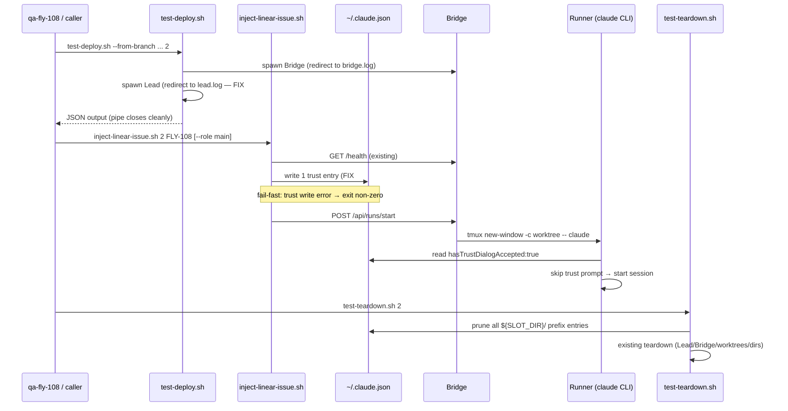

# Plan: FLY-115 Framework Fix — Runner Trust Prompt + Lead tail pipe + teardown crashes

**Version**: v1.24.1
**Issue**: FLY-115 follow-up (framework bug from qa-fly-108 Round 2 pre-flight + teardown)
**Date**: 2026-04-18
**Source**: `doc/engineer/exploration/new/FLY-115-fix-runner-trust.md`, `doc/engineer/research/new/FLY-115-fix-runner-trust.md`
**Status**: draft
**Owner**: worker-fly-115

---

## 1. Problem Statement

v1.24.0 (PR #157) 已把 QA framework 的 **real Runner mode** merged。qa-fly-108 第一次真跑就暴露三个 framework 级 defect：

1. **CRITICAL (#1)**: Runner 在 sandbox worktree (`/private/tmp/flywheel-test-slot-2/project-slot-2-FLY-108`) 启动 `claude` CLI 时被交互式 trust prompt 卡住 → S2-S6 全部 blocked。
2. **UX paper-cut (#2)**: `scripts/test-deploy.sh ... | tail -40` 永久 hang，因为 backgrounded Lead (`claude-lead.sh`) 继承了 stdout pipe 且不退出。
3. **CRITICAL (#3)**: `scripts/test-teardown.sh` 自身坏了，两条独立 bug：
   - **#3(a)**: line 117 + 135 用 `mapfile -t`，macOS 默认 `/bin/bash` 3.2 没有 `mapfile`（bash 4+ builtin）→ 在 `set -euo pipefail` 下从这两行之一直接 abort → 后续 worktree prune / `rm -rf SLOT_DIR` / lock 释放 / trust prune / CommDB 全部跳过。
   - **#3(b)**: line 477-480 记下的 `BRIDGE_PID = $!` 其实是 `npx tsx` 最外层 `npm exec` wrapper 的 PID（3 层 fork chain：`npm exec → tsx CLI → node`）。teardown `kill $BRIDGE_PID` 有时不 cascade 到 grandchild → 真正的 node 进程脱离 job control 继续 listen on `SLOT_PORT` → slot 2 的 19872 端口被 zombie 占住，下次 deploy 撞端口。

这四条都是 framework 问题，不动任何 production runner / prod Lead 代码；但阻塞了 FLY-108/99/109/83 四个 PR 的 real E2E QA，也就阻塞了 sprint close。

---

## 2. Root Cause (from Research)

### #1 Runner trust prompt
- Claude CLI 在首次进入**任何 path** 时（canonical 绝对路径为 key）写 `~/.claude.json` 的 `projects[path].hasTrustDialogAccepted` 字段，**必须为 true** 才能跳过 `Do you trust the files in this folder?` 交互式 prompt。
- 每个 QA slot 都 fresh clone 到 `/tmp/flywheel-test-slot-N/project-slot-N`，然后 Runner worktree 在 `/tmp/flywheel-test-slot-N/project-slot-N-<issueId>[-<role>]`。这些 path 从没在用户 `~/.claude.json` 里被 accept 过。
- 实证（Research §2）：
  - Option A (`--dangerously-skip-permissions`) — 不跳过 trust，只跳过 tool permission。REJECTED。
  - Option B (pre-write `hasTrustDialogAccepted:true`) — 直接进入 Welcome。CONFIRMED。

### #2 Lead tail pipe
- `test-deploy.sh:389-390` `bash claude-lead.sh ... &` 把 Lead 放后台，但**没有 redirect stdout/stderr**。即使 test-deploy.sh 自己 exit，Lead 仍持有继承的 fd 1 → `| tail` 的另一端永不 EOF → tail block → caller block。
- 同文件 472-478 的 Bridge spawn 已经有 `> bridge.log 2>&1` 模式；这个修复就是把 Lead 的 spawn 对齐。

### #3(a) macOS bash 3.2 + `mapfile`
- `scripts/test-teardown.sh` shebang 是 `#!/usr/bin/env bash`；Annie dev 机的 `/bin/bash` = `GNU bash 3.2.57`。
- `mapfile` 是 bash 4.0 引入的 builtin，3.2 没有。实证：`bash -c 'mapfile -t X < <(echo a)'` → `bash: mapfile: command not found`。
- Line 117、135 两处 `mapfile -t ... < <(cmd)` 在 `set -euo pipefail` 下命中第一处就让整个 `teardown_slot()` 非零退出。
- 后果链：Step 5b (FLY-115 worktree prune) 未完成 → Step 6 `rm -rf SLOT_DIR` 未跑 → lock 没释放 → 下轮 deploy 需要人工清 slot dir + 人工 `tmux kill-session`。

### #3(b) `npx tsx` 3-层 fork chain + `$!` 只拿最外层
- 实证进程链：`npm exec tsx run-bridge.ts` (wrapper，`$!`)  → `tsx CLI` (`.pnpm/tsx@4.20.6/dist/cli.mjs`) → `node --import tsx/dist/loader.mjs run-bridge.ts` (真正的 Bridge)。
- `BRIDGE_PID=$!` 拿到的是最外层 wrapper；`echo "$BRIDGE_PID" > bridge.pid` 写的也是 wrapper。
- 当 teardown `kill $BRIDGE_PID` 时：
  - **成功路径**：wrapper 活着 → 收 SIGTERM → cascade 到子孙 → 全部死 ✅
  - **失败路径**（qa-fly-108 观察到）：wrapper 早已 exit（npm exec 只 fork 完就等），`kill -0` 返回 0（僵尸还在 pid table），但真实 Bridge node 已被 init 领养，脱离 job 控制，`kill $BRIDGE_PID` 落空；端口被 node 继续持 ❌
- 根因是 PID 记错，不是 kill 逻辑错。修方向二选一：
  - (a) 改 `test-deploy.sh` spawn 时就记对 PID（需要 poll `pgrep -P`，脆弱）
  - (b) teardown 用 port 做 source of truth（`lsof -ti :${SLOT_PORT}` 100% 准确，选这个）。

---

## 3. Design

### 3.1 方案选择

| 候选 | 判定 |
|---|---|
| A. `--dangerously-skip-permissions` | REJECTED — 实证无效 |
| **B. inject-linear-issue.sh 预写 trust + test-teardown.sh 清理** | **SELECTED** — 实证有效、scope 最小、zero prod impact |
| C. Bridge `/api/runs/start` 预写 trust | REJECTED — 把 test scaffolding 逻辑放进 prod Bridge 路由，职责混乱 |
| D. sandbox 挂载到已 trust 目录 | REJECTED — 破坏 FLY-95 worktree 隔离 |
| E. 激活 `TrustPromptHandler` 死代码 | REJECTED — 死代码激活风险太大，另开 follow-up |
| F. `--settings` JSON 覆盖 | REJECTED — `settings` schema 不含 trust flag |

### 3.2 流程 (Option B)



### 3.3 Trust entry derivation (在 `inject-linear-issue.sh`)

Runner worktree path 由 Blueprint.ts:179-183 + WorktreeManager.ts 决定：

```
basename(HOST_REPO).toLowerCase()          # project-slot-2
worktreeIssueId = role=="main" ? issueId : "${issueId}-${role}"
worktreeName    = "${basename}-${worktreeIssueId}"
worktreeDir     = path.dirname(HOST_REPO) + "/" + worktreeName
```

所以对 `inject-linear-issue.sh 2 FLY-108 [--role main|qa]` 我们**只**为 Runner worktree 路径 pre-write：

| path | 为什么 |
|---|---|
| `${HOST_REPO}-${WORKTREE_ISSUE_ID}` | Runner worktree（role 经过 Blueprint sanitization 后拼装） |

**为什么不写 `${HOST_REPO}`**（Codex R1 #2）：`claude-lead.sh` 在启动 Claude CLI 前套了 `expect` wrapper（`packages/teamlead/scripts/claude-lead.sh:550-580, 625-639`），该 wrapper 检测到任何带 "confirm" footer 的 TUI menu 会自动 `send "1\r"`——trust prompt 正是这种 menu，所以 Lead 路径**已经自动处理**。qa-fly-108 的 bug report 也佐证：Lead 在 slot 2 下成功启动（用户 `~/.claude.json` 当前无 `flywheel-test-slot-*` 条目，唯一解释就是 expect wrapper 点掉了）。因此 HOST_REPO trust write **不是** bug 的真正修复项，写了反而扩大 `~/.claude.json` 的干扰面。**此项从计划移除**。

**Role sanitization**（Codex R1 #3）：Blueprint 对 `rawRole` 执行 `rawRole.replace(/[^a-zA-Z0-9-]/g, "").toLowerCase() || "main"`，然后 `worktreeIssueId = role==="main" ? issueId : "${issueId}-${role}"`。shell 端有两种对齐方式：
- **选择的方案**：显式 whitelist。`inject-linear-issue.sh` 校验 `--role` 必须 ∈ `{main, qa}`，否则 exit 非 0。这对齐当前实际 callsite（qa-fly-108 / worker 只用 main/qa），也让 trust path 推导精确。未来新增 role 时同步改两端（shell 校验 + Blueprint）。
- Rejected：在 shell 里复用 Blueprint 的 regex sanitization — 两端逻辑漂移风险更高，且当前只有两个角色，不值得。

`pwd -P` 用来做 path canonicalization（macOS `/tmp` → `/private/tmp`）。canonical 后作 JSON key。

### 3.4 原子写策略

**Same-filesystem tempfile**（Codex R1 #1）：`rename(2)` 只在同 filesystem 才 atomic。macOS `mv(1)` 跨 fs 会退化为 `cp + rm`。`mktemp -t` 放到 `$TMPDIR`（Darwin `/var/folders/...`），和 `$HOME` 虽然在本机恰好同 fs，但**实现不能依赖该前提**。tempfile 必须和 target 同目录。

**Invalid-JSON 语义**（Codex R2 #2）：文件存在且 **jq -e . 失败** = 用户的 `~/.claude.json` 已损坏。此时不能 `{}` 覆写（会丢掉用户所有真实 project trust 记录）。Inject 必须 **fail-fast exit** 让调用者感知问题。Missing / empty 才允许初始化为 `{}`。

**Fail-fast 失败语义**（Codex R2 #1）：`mktemp` 失败、jq 过滤失败、或 `mv` 失败 → `write_trust_entry` 返回非 0，`inject-linear-issue.sh` 随即 exit 非 0（不写 trust 就 POST runs/start 等于把 hang bug 原样放回去）。

```bash
CLAUDE_JSON="$HOME/.claude.json"

# 1) Validate existing file if present
input_source=""
if [[ -s "$CLAUDE_JSON" ]]; then
  if jq -e . "$CLAUDE_JSON" >/dev/null 2>&1; then
    input_source="$CLAUDE_JSON"
  else
    echo "[inject] ERROR: ${CLAUDE_JSON} exists but is not valid JSON — refusing to overwrite user state" >&2
    return 1
  fi
fi

# 2) Same-dir tempfile for atomic rename
tmp_json="$(mktemp "${CLAUDE_JSON}.XXXXXX")" \
  || { echo "[inject] ERROR: mktemp failed near ${CLAUDE_JSON}" >&2; return 1; }
cleanup() { rm -f "$tmp_json" "${tmp_json}.2"; }

# 3) Two-step merge (file-based, not via argv — avoids ARG_MAX on large files)
if [[ -z "$input_source" ]]; then
  # missing / empty → init to {}
  echo '{}' > "${tmp_json}.2" || { cleanup; return 1; }
  input_source="${tmp_json}.2"
fi

if ! jq --arg p "$CANONICAL" \
      '.projects = ((.projects // {}) | .[$p] |= ((. // {}) + {hasTrustDialogAccepted: true}))' \
      "$input_source" > "$tmp_json"; then
  cleanup
  echo "[inject] ERROR: jq filter failed for ${CANONICAL}" >&2
  return 1
fi

# 4) Atomic replace
if ! mv "$tmp_json" "$CLAUDE_JSON"; then
  cleanup
  echo "[inject] ERROR: mv failed replacing ${CLAUDE_JSON}" >&2
  return 1
fi
rm -f "${tmp_json}.2"
echo "[inject] trust accepted: ${CANONICAL}" >&2
```

- `mv "$tmp_json" "$CLAUDE_JSON"` 在同目录 → `rename(2)` atomic → Claude CLI 永远看到 valid JSON。
- `(.projects // {})` + `.[$p] |= ((. // {}) + {...})` 双 fallback: `.projects` 为 null/缺失时视为 `{}`, 该 path entry 为 null/缺失时视为 `{}`。
- 所有失败路径都 return 非 0 / exit 非 0 — 绝不静默 fall-through。
- 接受 "Claude CLI 在 read 和 mv 之间自己写入 → 被覆盖" 的小 race，只丢 performance stats，不丢 trust 状态（Research §4）。
- 不用 `flock` — Claude CLI 本身不用，加 lock 只保护我们一侧，无意义。

### 3.5 Teardown trust cleanup

`test-teardown.sh` 新增 `prune_trust_entries` 函数。

**重要语义**：`test-teardown.sh` 顶部启用了 `set -euo pipefail`（line 14）。裸调用 `mktemp` / `mv` 失败会让 `set -e` 直接终止整个脚本，违反 "cleanup best-effort, never block teardown" 的设计意图（Codex R3 #1）。因此**每个** fs 操作必须用显式 `|| { log WARN; return 0; }` 包起来。

```bash
prune_trust_entries() {
  local SLOT_DIR="$1"                           # /tmp/flywheel-test-slot-N
  local CLAUDE_JSON="$HOME/.claude.json"

  # Guard 1: file missing / empty → nothing to prune
  [[ -s "$CLAUDE_JSON" ]] || return 0

  # Guard 2: file invalid → skip (do NOT overwrite user state)
  jq -e . "$CLAUDE_JSON" >/dev/null 2>&1 \
    || { log "WARN: ${CLAUDE_JSON} not valid JSON, skipping trust prune"; return 0; }

  # canonical slot dir (macOS /tmp → /private/tmp)
  local CANONICAL_SLOT_DIR
  CANONICAL_SLOT_DIR=$(python3 -c \
    "import os,sys; print(os.path.realpath(sys.argv[1]))" "$SLOT_DIR") \
    || { log "WARN: realpath failed for ${SLOT_DIR}, skipping trust prune"; return 0; }

  # Same-fs tempfile for atomic rename (Codex R1 #1). Wrap to defeat set -e.
  local tmp_json
  tmp_json="$(mktemp "${HOME}/.claude.json.XXXXXX")" \
    || { log "WARN: mktemp near ${CLAUDE_JSON} failed, skipping trust prune"; return 0; }

  # (.projects // {}) fallback for missing/null (Codex R1 #4).
  # Trailing slash prevents prefix collision (slot-1 vs slot-10).
  # Combined jq+mv guarded as a unit; on any failure we log and continue.
  if jq --arg prefix "${CANONICAL_SLOT_DIR}/" \
        '.projects = ((.projects // {}) | with_entries(select(.key | startswith($prefix) | not)))' \
        "$CLAUDE_JSON" > "$tmp_json" \
     && mv "$tmp_json" "$CLAUDE_JSON"; then
    :
  else
    rm -f "$tmp_json"
    log "WARN: trust cleanup failed for ${SLOT_DIR} (jq or mv error)"
    return 0
  fi
}
```

- `${CANONICAL_SLOT_DIR}/` 带 trailing slash 确保不会误删相邻 slot（slot-1 不 match `flywheel-test-slot-10/`）。
- `jq -e .` 先校验 valid JSON，再动手；如果不 valid，log WARN 后 return，让 teardown 继续完成其它 cleanup。
- `(.projects // {})` 防御 missing/null projects 字段（Codex R1 #4）。
- 失败不 abort teardown — trust 残留最多让 `~/.claude.json` 膨胀，不是 critical。
- **执行时机**：放在 `rm -rf "$SLOT_DIR"` **之后**（先清硬盘，再清 JSON 引用），符合 "后向" cleanup 语义。对正确性没影响，两者独立。

### 3.6 UX #2 (Lead tail pipe)

`scripts/test-deploy.sh:389-390`，改成：

```bash
bash "${REPO_ROOT}/packages/teamlead/scripts/claude-lead.sh" \
    "${AGENT_ID}" "${HOST_REPO}" "${TEST_PROJECT_NAME}" \
    > "${SLOT_DIR}/lead.log" 2>&1 &
```

并在最终 JSON 输出（526-547 行块）加 `"leadLog": "${SLOT_DIR}/lead.log"`。

`$LEAD_BG_PID=$!` 捕获不受影响（`$!` 来自 `&`，和重定向正交）。

### 3.7 Defect #3(a) — `mapfile` portable replacement

`scripts/test-teardown.sh:117, 135` 两处 `mapfile -t`，用标准 bash 3.2-compatible `while read` loop 替换。**对当前两个 git 命令**语义等价（`git worktree list --porcelain` 和 `git for-each-ref --format` 的输出都以 newline 结尾），但**一般来说**两者在 "最后一行无 trailing newline" 的生产者上会分歧：`mapfile -t` 保留该 partial line，`while IFS= read -r` 会丢掉。为了让这段模式未来复用到别的 producer 也安全，加 `|| [[ -n "$line" ]]` 收尾（Codex R5 #3）。

```bash
# Before (line 117)
mapfile -t SLOT_WORKTREES < <(
  git -C "$HOST_REPO" worktree list --porcelain 2>/dev/null \
    | awk '/^worktree /{print $2}' \
    | grep -F "$SLOT_DIR/" || true
)

# After (handles last-line-no-newline via `|| [[ -n "$line" ]]`)
local SLOT_WORKTREES=()
while IFS= read -r line || [[ -n "$line" ]]; do
  [[ -z "$line" ]] && continue
  SLOT_WORKTREES+=("$line")
done < <(
  git -C "$HOST_REPO" worktree list --porcelain 2>/dev/null \
    | awk '/^worktree /{print $2}' \
    | grep -F "$SLOT_DIR/" || true
)
```

Line 135 同模式改 `LOCAL_BRANCHES`。

**`set -e` 安全性**：`local ARR=()` 永远 exit 0；`while IFS= read -r line || [[ -n "$line" ]]; do ARR+=("$line"); done < <(cmd)` 的 `read` 在 EOF 时 exit 非 0，但整段被 `||` 接住；`while` 的 test 位置失败也是 `set -e` 的 carve-out。整段完整覆盖 `mapfile -t` 的语义。

**为什么加 `[[ -z "$line" ]] && continue`**：`|| [[ -n "$line" ]]` 在 EOF 时如果最后一段是空字符串，还是会进入 loop body 一次；`continue` 保证空行（例如 grep 无命中时的 `|| true` 输出）不会变成数组元素。与原 `mapfile -t` + `grep` 组合的过滤行为等价。

**测试**：本地 `/bin/bash` 3.2 下 `./scripts/test-teardown.sh 1` 不应因 `mapfile: command not found` 报错。

### 3.8 Defect #3(b) — port-based straggler kill

**策略**（Research §10.2 方案 D）：teardown 不改变现有 PID-based kill 逻辑（清洁 shutdown 路径仍生效），在 Step 5 结尾追加 port-based belt-and-suspenders：

```bash
# Step 5c (FLY-115 follow-up): Kill any process still holding SLOT_PORT.
# npx tsx spawns a 3-level process chain (npm → tsx CLI → node). Depending on
# timing, SIGTERM to the outermost wrapper may not cascade to the grandchild
# node process, which then becomes an orphan still listening on SLOT_PORT.
# lsof gives us a single source of truth regardless of fork depth.
local SLOT_PORT=""
# Bounds check SLOT_IDX before jq (Codex R5 #2): negative indices map to
# the last slot (e.g. `jq '.slots[-1]'` returns the last element), which
# would cause `test-teardown.sh 0` to straggler-kill slot 4's port.
if (( SLOT_IDX >= 0 )); then
  SLOT_PORT=$(jq -r ".slots[${SLOT_IDX}].bridgePort // empty" "$SLOTS_FILE" 2>/dev/null || true)
fi
if [[ -n "$SLOT_PORT" ]]; then
  # Narrow to TCP LISTEN sockets only (Codex R5 #1). Bare `lsof -ti :PORT`
  # also matches client connections whose local or remote port == PORT,
  # which could kill unrelated processes.
  local STRAGGLERS
  STRAGGLERS=$(lsof -nP -t -iTCP:"${SLOT_PORT}" -sTCP:LISTEN 2>/dev/null | sort -u || true)
  if [[ -n "$STRAGGLERS" ]]; then
    log "Killing port stragglers on :${SLOT_PORT} (LISTEN): $(echo "$STRAGGLERS" | tr '\n' ' ')"
    echo "$STRAGGLERS" | xargs kill -TERM 2>/dev/null || true
    sleep 2
    STRAGGLERS=$(lsof -nP -t -iTCP:"${SLOT_PORT}" -sTCP:LISTEN 2>/dev/null | sort -u || true)
    if [[ -n "$STRAGGLERS" ]]; then
      log "SIGTERM did not free :${SLOT_PORT}, escalating to SIGKILL"
      echo "$STRAGGLERS" | xargs kill -9 2>/dev/null || true
    fi
  fi
fi
```

**为什么 `lsof` 要加 `-iTCP:PORT -sTCP:LISTEN`**（Codex R5 #1）：macOS/BSD `lsof -ti :PORT` 会匹配 "本地或远端端口号 == PORT" 的任何网络文件，**包括 client side 连接**。想象一下：别的进程如果恰好拿 ephemeral port 等于 `SLOT_PORT` 跟谁建了 outgoing 连接，也会被扫进来。收窄到 `-iTCP:PORT -sTCP:LISTEN` 只保留监听 socket，严格对应 "谁在持这个端口"。

**为什么 `SLOT_IDX` 要做 bounds check**（Codex R5 #2 + R7 #1）：`jq '.slots[-1]'` 返回**最后**一个元素（不是空），所以 `.slots[SLOT_IDX] // empty` 在 `SLOT_IDX < 0` 时不会 fall back 到空串。`teardown_slot()` line 27 `SLOT_IDX=$((SLOT - 1))` 对 `SLOT=0` 给出 `SLOT_IDX=-1`。**双层防御**：
1. **第一层（主防）** — §4.2 Change 0：`teardown_slot()` 入口 regex 校验 `^[1-9][0-9]*$`，非法 SLOT 直接 `return 1`，函数不进入任何 jq / AGENT_ID / lead-workspace / Step 5c 代码路径。这是 Codex R7 #1 要求的 fail-fast。
2. **第二层（defense-in-depth）** — 本节 `(( SLOT_IDX >= 0 ))` guard：即使未来某处绕过 Change 0（例如新调用者不走 `teardown_slot()` 直接复用 Step 5c 代码块），guard 仍能挡住负索引 jq 查询。两层都留是为了让 Step 5c 代码块自身是独立 safe 的，而不是隐含依赖上游校验。

**为什么不改 `test-deploy.sh` 来记对 PID**：
- `pgrep -P "$WRAPPER" → pgrep -P "$CHILD"` 需要 poll 到 grandchild 出现，timing 脆弱。
- tsx / npm 内部 fork 层数受 pnpm / tsx 版本影响；今天是 3 层，明天升级可能是 2 或 4。
- `lsof -iTCP:PORT -sTCP:LISTEN` 是不变量：不管进程链怎么变，谁在 LISTEN 就是它。

**`set -e` 安全性**：
- `local SLOT_PORT=""` / `(( SLOT_IDX >= 0 ))` — 算术表达式，表达式为真时 exit 0。表达式为假 (SLOT_IDX < 0) 时 exit 1；但该行作为 `if` test position，是 `set -e` carve-out。
- `jq -r "... // empty"` 在字段缺失或值是 null 时 exit 0 输出空串，`SLOT_PORT` 为空时整段 skip。（负索引 bounds 已在外层挡掉。）
- `$(lsof ... || true)` 保证永远 exit 0。
- `xargs kill ... || true` 保证永远 exit 0。
- 唯一 bare call 是 `sleep 2`，不会失败。

**端口变空的边界**：如果 `kill -TERM` 足够温和（node 的 `server.close()` 处理完当前连接才释放 port），2s 后检查 `lsof` 仍非空是可能的 → 升级 SIGKILL 一次性解决。

**log 预期**：清洁路径（BRIDGE_PID kill 已 cascade 成功）→ `lsof -iTCP:LISTEN` 返回空 → **零额外 log**。只在真的有 LISTEN straggler 时才打 "Killing port stragglers"。

---

## 4. File-Level Changes

### 4.1 `scripts/inject-linear-issue.sh` (modify)

**Changes**：

1. **Role whitelist**（Codex R1 #3）：argparse loop 里对 `--role` 值做校验：
   ```bash
   case "$ROLE" in
     main|qa) ;;
     *) echo "ERROR: --role must be 'main' or 'qa' (got: '${ROLE}')" >&2; exit 1 ;;
   esac
   ```
2. **Derive Runner worktree path** 在 curl 之前：
   ```bash
   SLOT_DIR="/tmp/flywheel-test-slot-${SLOT}"
   HOST_REPO="${SLOT_DIR}/project-slot-${SLOT}"
   if [[ "$ROLE" == "main" ]]; then
     WORKTREE_ISSUE_ID="$ISSUE_ID"
   else
     WORKTREE_ISSUE_ID="${ISSUE_ID}-${ROLE}"
   fi
   RUNNER_WORKTREE="${HOST_REPO}-${WORKTREE_ISSUE_ID}"
   ```
3. **Call `write_trust_entry "$RUNNER_WORKTREE"`** —— 只写这一条（Codex R1 #2, drop HOST_REPO）。
4. **Update header docstring** 声明会修改 `~/.claude.json`。

**`write_trust_entry` helper**（same-fs tempfile + fail-fast + file-based two-step jq）：

```bash
# Returns 0 on success, non-0 on any failure. Caller MUST propagate failure.
write_trust_entry() {
  local target="$1"
  local CLAUDE_JSON="$HOME/.claude.json"

  # canonical path: parent must exist (slot-dir is created by test-deploy.sh
  # before inject is called), but target itself does not have to —— Runner
  # worktree will be created by Bridge shortly after we return.
  local parent basename canonical_parent CANONICAL
  parent="$(dirname "$target")"
  basename="$(basename "$target")"
  if [[ ! -d "$parent" ]]; then
    echo "[inject] ERROR: parent ${parent} missing — cannot resolve canonical path for ${target}" >&2
    return 1
  fi
  canonical_parent="$(cd "$parent" && pwd -P)" || return 1
  CANONICAL="${canonical_parent}/${basename}"

  # Validate existing file if present; refuse to overwrite invalid state (§3.4).
  local input_source=""
  if [[ -s "$CLAUDE_JSON" ]]; then
    if jq -e . "$CLAUDE_JSON" >/dev/null 2>&1; then
      input_source="$CLAUDE_JSON"
    else
      echo "[inject] ERROR: ${CLAUDE_JSON} exists but is not valid JSON — refusing to overwrite user state" >&2
      return 1
    fi
  fi

  # Same-filesystem tempfile (§3.4, Codex R1 #1).
  local tmp_json
  tmp_json="$(mktemp "${CLAUDE_JSON}.XXXXXX")" \
    || { echo "[inject] ERROR: mktemp failed near ${CLAUDE_JSON}" >&2; return 1; }

  # File-based two-step merge (§3.4, avoids ARG_MAX via argv).
  if [[ -z "$input_source" ]]; then
    echo '{}' > "${tmp_json}.2" \
      || { rm -f "$tmp_json" "${tmp_json}.2"; return 1; }
    input_source="${tmp_json}.2"
  fi

  if ! jq --arg p "$CANONICAL" \
        '.projects = ((.projects // {}) | .[$p] |= ((. // {}) + {hasTrustDialogAccepted: true}))' \
        "$input_source" > "$tmp_json"; then
    rm -f "$tmp_json" "${tmp_json}.2"
    echo "[inject] ERROR: jq filter failed for ${CANONICAL}" >&2
    return 1
  fi

  if ! mv "$tmp_json" "$CLAUDE_JSON"; then
    rm -f "$tmp_json" "${tmp_json}.2"
    echo "[inject] ERROR: mv failed replacing ${CLAUDE_JSON}" >&2
    return 1
  fi
  rm -f "${tmp_json}.2"
  echo "[inject] trust accepted: ${CANONICAL}" >&2
  return 0
}
```

**Caller pattern**（在 curl POST /api/runs/start **之前**、**Bridge /health 之后**，Codex R2 #1）：

```bash
# ... existing /health check passes ...

write_trust_entry "$RUNNER_WORKTREE" \
  || { echo "[inject] FATAL: trust write failed — refusing to POST /api/runs/start (would hang on trust prompt)" >&2; exit 7; }

# ... existing curl POST ...
```

Exit code 7 避开已有的 2-6；document 在 header docstring。

### 4.2 `scripts/test-teardown.sh` (modify)

**Change 0** — **SLOT input validation**（Codex R7 #1）：在 `teardown_slot()` 函数**最开头**（line 18 之后，line 26 `SLOTS_FILE=...` 之前）加正整数校验。如果 `SLOT` 不是正整数，立即 `log ERROR + return 1`，避免任何 `SLOT_IDX=$((SLOT - 1))` 的负值流入下游 jq lookup / `AGENT_ID` 解析 / lead workspace 删除（这些都会误匹配最后一个 slot）。

```bash
teardown_slot() {
  local SLOT="$1"
  # Validate: SLOT must be a positive integer. Prevents negative SLOT_IDX
  # from poisoning the `.slots[${SLOT_IDX}]` jq lookup (line 29) and the
  # downstream AGENT_ID / lead workspace cleanup. Without this guard,
  # `test-teardown.sh 0` would resolve to the LAST slot's agent and delete
  # its lead workspace.
  if ! [[ "$SLOT" =~ ^[1-9][0-9]*$ ]]; then
    log "ERROR: invalid slot '${SLOT}' — must be a positive integer"
    return 1
  fi
  local SLOT_DIR="/tmp/flywheel-test-slot-${SLOT}"
  # ... rest unchanged ...
```

**Change 1** — §3.7 fix Defect #3(a)：`scripts/test-teardown.sh:117` + `:135` 两处 `mapfile -t` → portable `while IFS= read -r line || [[ -n "$line" ]]; do [[ -z "$line" ]] && continue; ARR+=("$line"); done < <(cmd)` pattern（带 "最后一行无 newline" 守尾 + 空行过滤，见 §3.7 完整代码）。

**Change 2** — §3.8 fix Defect #3(b)：在 Step 5（Kill Bridge）末尾，紧跟在现有 PID kill 之后、Step 5b（Runner worktrees）之前，插入 port-based straggler kill 块。该块已在 §3.8 给出完整代码，依赖 `SLOTS_FILE` / `SLOT_IDX`（已在函数顶部 line 26-27 resolved）。

**Change 3** — §3.5 Trust cleanup：**Add** `prune_trust_entries "$SLOT_DIR"` 调用，放在 Step 6 `rm -rf "$SLOT_DIR"` 之后、CommDB 清理之前。

**Change 4** — **Add** `prune_trust_entries()` 函数（§3.5 上面给出的完整代码），放在 `teardown_slot()` 之前。

### 4.3 `scripts/test-deploy.sh` (modify)

- Line 389-390：加 `> "${SLOT_DIR}/lead.log" 2>&1`。
- Line 526-547 JSON 块：加 `"leadLog": "${SLOT_DIR}/lead.log"` 字段，紧挨 `bridgeLog`。

### 4.4 Documentation (archive in main PR)

按 `feedback_archive_docs_in_main_pr.md`，最后一个 commit 里把三个 doc 移过去：

```
git mv doc/engineer/exploration/new/FLY-115-fix-runner-trust.md \
       doc/engineer/exploration/archive/
git mv doc/engineer/research/new/FLY-115-fix-runner-trust.md \
       doc/engineer/research/archive/
git mv doc/engineer/plan/new/v1.24.1-FLY-115-fix-runner-trust.md \
       doc/engineer/plan/archive/
```

---

## 5. Testing

### 5.1 Unit / script tests

**None newly added**。理由：
- 改动全在 shell 脚本（`inject-linear-issue.sh`, `test-teardown.sh`, `test-deploy.sh`），没有 TypeScript 逻辑可以 vitest。
- 现有 repo 没有 bats / shellcheck 框架；新建框架 = scope creep。
- 核心行为靠 qa-fly-108 Round 2 的 real E2E 验证，那才是产品级 acceptance test。

### 5.2 Manual smoke test (pre-PR, local)

1. `scripts/test-deploy.sh --from-branch feat/v1.23.0-FLY-108-... 1 | tail -40`
   - ✅ 期望：JSON 输出完整，tail 在 Lead 启动后 <5s 自然退出。
   - ✅ `ls /tmp/flywheel-test-slot-1/lead.log` 存在且有内容。
2. `scripts/inject-linear-issue.sh 1 FLY-108`
   - ✅ stderr 出现**恰好一条** `[inject] trust accepted: /private/tmp/flywheel-test-slot-1/project-slot-1-FLY-108`（Runner worktree only，HOST_REPO 不写）。
   - ✅ `jq '.projects["/private/tmp/flywheel-test-slot-1/project-slot-1-FLY-108"]' ~/.claude.json` 返回 `{hasTrustDialogAccepted:true}`。
   - ✅ `jq '.projects["/private/tmp/flywheel-test-slot-1/project-slot-1"]' ~/.claude.json` 返回 `null`（确认 HOST_REPO **没被写**）。
   - ✅ inject 退出码 0（成功路径）。
3. `tmux capture-pane -t runner-test-slot-1 -p` — Runner pane 展示 Claude Welcome / session 开始，**没有 trust prompt**。
4. **Fail-fast 检查**：手动 `mv ~/.claude.json ~/.claude.json.bak && echo 'not-json' > ~/.claude.json`，再跑 `scripts/inject-linear-issue.sh 1 FLY-108`，
   - ✅ 期望：exit code = 7（caller 把 write_trust_entry 的 return 1 升级为 `exit 7`）。
   - ✅ stderr 里有 `ERROR: ~/.claude.json exists but is not valid JSON — refusing to overwrite user state`。
   - ✅ 此时 `~/.claude.json` **仍是** `not-json`（没被 `{}` 覆写）。之后 `mv ~/.claude.json.bak ~/.claude.json` 恢复。
5. `scripts/test-teardown.sh 1`
   - ✅ `jq '.projects | keys[] | select(startswith("/private/tmp/flywheel-test-slot-1/"))' ~/.claude.json` 返回空。
   - ✅ slot dir / tmux / PID 清理保持现有行为。
6. `jq . ~/.claude.json > /dev/null && echo OK` — 文件仍 valid JSON。
7. **Defect #3(a) regression check**（bash 3.2 compatibility）：
   ```bash
   /bin/bash -n scripts/test-teardown.sh          # syntax check under 3.2
   /bin/bash -c 'command -v mapfile' || echo "OK: mapfile absent under /bin/bash"
   grep -n "mapfile" scripts/test-teardown.sh      # should return 0 matches
   /bin/bash scripts/test-teardown.sh 1           # runs to "Slot 1 torn down" line
   ```
   - ✅ 期望：`grep mapfile` 0 hit；teardown 一路跑到最后 log 行。
8. **Defect #3(b) regression check**（port-based kill，narrowed to LISTEN）：
   ```bash
   # Spawn a dummy TCP LISTEN socket on slot 1's port, simulating an orphan
   SLOT_PORT=$(jq -r '.slots[0].bridgePort' ~/.flywheel/test-slots.json)
   python3 -c "import socket; s=socket.socket(); s.bind(('127.0.0.1',${SLOT_PORT})); s.listen(1); import time; time.sleep(600)" &
   ZOMBIE_PID=$!
   # Fake a bridge.pid pointing at a long-gone process to skip the PID path
   mkdir -p "/tmp/flywheel-test-slot-1"
   echo 99999 > /tmp/flywheel-test-slot-1/bridge.pid
   # Run teardown — port kill should catch the zombie
   scripts/test-teardown.sh 1
   # Verify port freed
   lsof -nP -t -iTCP:"${SLOT_PORT}" -sTCP:LISTEN && echo "FAIL: LISTEN still held" || echo "OK: port freed"
   kill $ZOMBIE_PID 2>/dev/null || true
   ```
   - ✅ 期望：teardown log 出现 `Killing port stragglers on :${SLOT_PORT} (LISTEN)`；`lsof -iTCP:$PORT -sTCP:LISTEN` 最终返回空。
9. **Defect #3(b) — client connection to SLOT_PORT NOT killed**（Codex R5 #1 / R6 #1 regression）：
   ```bash
   SLOT_PORT=$(jq -r '.slots[0].bridgePort' ~/.flywheel/test-slots.json)
   # (a) Start a dummy LISTEN on SLOT_PORT (simulates orphan Bridge)
   python3 -c "import socket,time;
   s=socket.socket(); s.setsockopt(socket.SOL_SOCKET, socket.SO_REUSEADDR,1);
   s.bind(('127.0.0.1',${SLOT_PORT})); s.listen(1); time.sleep(600)" &
   LISTENER_PID=$!
   sleep 1
   # (b) Start a SEPARATE process that connects to 127.0.0.1:SLOT_PORT as a client
   python3 -c "import socket,time;
   c=socket.socket(); c.connect(('127.0.0.1', ${SLOT_PORT}));
   # Keep the connection open; local port is ephemeral, remote port == SLOT_PORT.
   # Under old `lsof -ti :PORT` filter, THIS process would also be killed.
   time.sleep(600)" &
   CLIENT_PID=$!
   sleep 1
   # (c) Run teardown — should kill LISTENER_PID but leave CLIENT_PID alive
   scripts/test-teardown.sh 1
   # (d) Assertions
   kill -0 $LISTENER_PID 2>/dev/null && echo "FAIL: listener survived" || echo "OK: listener killed"
   kill -0 $CLIENT_PID 2>/dev/null && echo "OK: client survived" || echo "FAIL: client was killed (filter too wide)"
   # cleanup
   kill $LISTENER_PID $CLIENT_PID 2>/dev/null || true
   ```
   - ✅ 期望：listener killed（由 Step 5c port-kill 处理）；client 仍存活（`-sTCP:LISTEN` filter 不匹配 client-side connection）。这**真正**覆盖 Codex R5 #1 的回归风险：即使某进程连到 `SLOT_PORT`，因为它 socket 状态不是 LISTEN，不会被误杀。
10. **Defect #3(b) — invalid SLOT fail-fast with real state-based collateral-damage check**（Codex R5 #2 + R7 #1 + R8 #1）：
    Codex R8 指出：`rm -rf "$LEAD_WORKSPACE"` 在 `scripts/test-teardown.sh:172` 本身**没有日志**，所以单靠 `grep "Removing lead workspace"` 的断言是 vacuously true。改用**状态断言 + 隔离 HOME sentinel**，真正验证 Change 0 的 fail-fast 能保住最后一个 slot 的 lead workspace：

    ```bash
    # 保存 + 恢复调用者 HOME，避免 smoke test 污染后续 shell（Codex R9 #2）
    ORIG_HOME="$HOME"
    TMPHOME=$(mktemp -d)
    export HOME="$TMPHOME"
    mkdir -p "${HOME}/.flywheel"

    # 构造 stub test-slots.json：最后一个 slot (index 3) 的 botName = "sentinel-bot"
    cat > "${HOME}/.flywheel/test-slots.json" <<'JSON'
    {
      "slots": [
        { "slot": 1, "botName": "bot-1", "bridgePort": 19871 },
        { "slot": 2, "botName": "bot-2", "bridgePort": 19872 },
        { "slot": 3, "botName": "bot-3", "bridgePort": 19873 },
        { "slot": 4, "botName": "sentinel-bot", "bridgePort": 19874 }
      ]
    }
    JSON

    # sentinel lead workspace：如果 SLOT=0 误把 AGENT_ID 解析成 "sentinel-bot"，
    # teardown line 172 会把这个目录删掉。Change 0 fail-fast 后它应当完整保留。
    SENTINEL="${HOME}/.flywheel/lead-workspace/sentinel-bot"
    mkdir -p "$SENTINEL"
    touch "${SENTINEL}/canary.txt"

    # 所有预期失败的调用都用 `if ...; then rc=0; else rc=$?; fi` 包裹，
    # 避免在 `set -e` 下被直接打断（Codex R10 #1）。
    if scripts/test-teardown.sh 0 2>/tmp/teardown-invalid.err; then rc=0; else rc=$?; fi

    # (a) 非零退出
    [[ $rc -ne 0 ]] && echo "OK: rc=$rc" || echo "FAIL: expected non-zero exit"
    # (b) fail-fast ERROR log
    grep -q "ERROR: invalid slot '0'" /tmp/teardown-invalid.err \
      && echo "OK: fail-fast logged" || echo "FAIL: no ERROR log"
    # (c) 真实状态断言：sentinel 目录 + canary 文件仍然存在
    [[ -d "$SENTINEL" && -f "${SENTINEL}/canary.txt" ]] \
      && echo "OK: sentinel workspace intact" || echo "FAIL: sentinel deleted by teardown 0"
    # (d) 旁证：stderr 没有 Step 5c port-kill log
    grep -q "Killing port stragglers" /tmp/teardown-invalid.err \
      && echo "FAIL: Step 5c ran" || echo "OK: Step 5c skipped"

    # 重复测试其他非法形式（Change 0 regex 路径）。注意：**不包含空串**，
    # 因为 scripts/test-teardown.sh:185 入口 `TARGET="${1:?Usage...}"` 会先于
    # teardown_slot() 拦截空参数（Codex R9 #1），空串的语义是 CLI usage error，
    # 不走 Change 0 regex。每个调用都用 if/else 包裹以兼容 set -e (Codex R10 #1)。
    for bad in "-1" "abc" "1.5"; do
      mkdir -p "$SENTINEL" && touch "${SENTINEL}/canary.txt"
      if scripts/test-teardown.sh "$bad" 2>/tmp/teardown-invalid.err; then rc_bad=0; else rc_bad=$?; fi
      [[ $rc_bad -ne 0 ]] \
        && grep -q "ERROR: invalid slot" /tmp/teardown-invalid.err \
        && [[ -d "$SENTINEL" && -f "${SENTINEL}/canary.txt" ]] \
        && echo "OK: '$bad' rejected + sentinel intact" \
        || echo "FAIL: '$bad' handling (rc=$rc_bad)"
    done

    # 单独验证 CLI usage：空参数走的是 ${1:?Usage...} 路径，期望退出且有 Usage 提示
    mkdir -p "$SENTINEL" && touch "${SENTINEL}/canary.txt"
    if scripts/test-teardown.sh "" 2>/tmp/teardown-usage.err; then rc_empty=0; else rc_empty=$?; fi
    [[ $rc_empty -ne 0 ]] && grep -q "Usage:" /tmp/teardown-usage.err \
      && [[ -d "$SENTINEL" && -f "${SENTINEL}/canary.txt" ]] \
      && echo "OK: empty arg → Usage error, no damage" \
      || echo "FAIL: empty arg handling"

    # cleanup — 恢复调用者原始 HOME，只清临时目录 + 本测试内部变量
    export HOME="$ORIG_HOME"
    rm -rf "$TMPHOME"
    unset TMPHOME ORIG_HOME SENTINEL rc rc_bad rc_empty bad
    ```
    - ✅ 期望：所有 non-positive-integer SLOT 都在 `teardown_slot()` **第一步** `return 1`，stderr 有 `ERROR: invalid slot '<value>' — must be a positive integer`。**最后一个 slot 的 sentinel lead workspace 目录 + canary 文件完好**（直接证明 line 172 `rm -rf` 没有执行），Step 5c port-kill log 也不出现。Codex R7 #1 的 collateral damage 担忧被真实状态验证覆盖；R8 #1 指出的假阳性断言（grep 不存在的日志）被换成真实 filesystem 检查。

### 5.3 E2E (post-merge)

qa-fly-108 重跑 FLY-108 Round 2 S1-S6。合格条件：S2-S6 不再因 trust prompt blocked；S1 不 regress。

### 5.4 Race 10-round test

```bash
for i in $(seq 1 10); do
  scripts/test-deploy.sh --from-branch feat/v1.23.0-FLY-108-... 1 > /tmp/d.out 2>&1
  scripts/inject-linear-issue.sh 1 FLY-108 || true
  sleep 5
  scripts/test-teardown.sh 1
  jq . ~/.claude.json > /dev/null || { echo "CORRUPT at round $i"; break; }
done
```

✅ A5 passes: ~/.claude.json 10 round 后仍 valid。

---

## 6. Risk & Mitigation (from Research §8, re-stated)

| Risk | Prob | Impact | Mitigation |
|---|---|---|---|
| ~/.claude.json write race 吞掉 Claude CLI 自写的 perf stats | 低 | 低 | 接受 trade-off；启动期只写一次 |
| Claude CLI schema 变更要求更多必填字段 | 低 | 中 | 实证已验证当前 schema 足够；未来失败再 fall back |
| Cross-fs mv non-atomic | 极低（改用 same-dir tempfile 后消除） | 高→无 | `mktemp "${HOME}/.claude.json.XXXXXX"` 保证同目录 |
| `~/.claude.json` missing / `.projects` null | 低 | 中 | `(.projects // {})` + `jq -e .` pre-validate |
| Unexpected `--role` value 导致 trust path 与 Runner path 不匹配 | 低 | 中 | argparse whitelist `main\|qa` + 明确错误 exit |
| teardown 前缀误删其它 slot | 低 | 高 | canonical slot dir + trailing slash |
| Linux CI 上 canonical 行为差异 | 极低 | 低 | `pwd -P` / `python3 os.path.realpath` 跨平台一致 |
| `while IFS= read -r` 吞掉最后一行（无尾 newline） | 极低 | 低 | `git worktree list --porcelain` / `git for-each-ref` 输出恒带 newline；实证等价 `mapfile -t` |
| `lsof -iTCP:PORT -sTCP:LISTEN` 在 Linux/macOS 语义差异 | 极低 | 低 | 两者 `-iTCP -sTCP:LISTEN` 语义一致；macOS `man lsof` 和 Linux `lsof(8)` 都支持此过滤 |
| bare `lsof -ti :PORT` 误伤客户端连接 (Codex R5 #1) | 低 | 中 | 改用 `-iTCP:PORT -sTCP:LISTEN` 仅匹配监听 socket |
| `SLOT_IDX < 0` 让 `jq '.slots[-1]'` 命中最后一个 slot (Codex R5 #2) | 低 | 高 | §4.2 Change 0 `teardown_slot()` 入口 regex fail-fast + §3.8 Step 5c `(( SLOT_IDX >= 0 ))` defense-in-depth |
| `teardown_slot()` 被 `SLOT=0 / 负数 / 非数字` 误触发 → line 29 `jq '.slots[-1].botName'` 拿到最后一个 slot 的 AGENT_ID → line 170 `rm -rf lead-workspace/${AGENT_ID}` 删错 slot 资源 (Codex R7 #1) | 低 | 高 | §4.2 Change 0：`teardown_slot()` 第一步 `[[ "$SLOT" =~ ^[1-9][0-9]*$ ]]` regex；非法直接 `log ERROR + return 1`，函数不进入任何下游路径 |
| `while IFS= read -r` 丢弃无尾 newline 的最后一行 (Codex R5 #3) | 低 | 低 | 加 `|| [[ -n "$line" ]]` 尾守；当前两个 git 命令本身带 newline，仅为 future-proof |

---

## 7. Out of Scope

- Activate `packages/claude-runner/src/TrustPromptHandler.ts` — another issue
- Change Claude CLI launch args — Option A 已实证失败
- Rewrite `WorktreeManager` env hook — FLY-115 v1.24.0 已做
- `--settings` JSON — schema 不支持 trust
- Prod Runner / prod Lead — 本补丁 test-only
- **Other wrapper-PID sites** (Codex R5 #4): `scripts/daily-standup.sh:74-87` 和 `scripts/discord-e2e.sh:47-49` 同样把 `$!` of `npx tsx` / `nohup npx tsx` 当作 "Bridge 真实 PID" 使用。本次修复只让 `test-teardown.sh` 不再依赖 `bridge.pid` 作为单一真相源；这两处 liveness check 代码继续把 wrapper PID 当作 "Bridge 还活着" 的粗筛仍然够用，但**应视为 follow-up**：未来如果要做 "真正的 Bridge 健康状态" 检测，需要切到 `curl /health` + port ownership。建议 follow-up 单独开 issue，不并入本补丁以控制 blast radius。

---

## 8. Rollout

- Worktree: `worktrees/fly-115-fix`
- Branch: `feat/v1.24.1-FLY-115-fix-runner-trust`
- PR target: `main`
- Review: `/codex-code-review-rescue` ≥1 round until APPROVED
- After merge: team-lead 通知 qa-fly-108 重跑 Round 2

---

## 9. Acceptance (Research §7 + §10.4)

- **A1** Runner 不再 stuck 在 trust prompt。
- **A2** `test-deploy.sh ... | tail -40` 自然返回。
- **A3** teardown 后 `~/.claude.json` 里 `${SLOT_DIR}/` 前缀记录清空。
- **A4** prod 零影响。
- **A5** 10-round smoke 后 `jq .` 仍 valid。
- **A6** (Defect #3a) 在 `/bin/bash` 3.2 下，teardown 跑完所有 6 个 Step；`grep mapfile scripts/test-teardown.sh` 无命中。
- **A7** (Defect #3b) teardown 结束后 `lsof -nP -t -iTCP:${SLOT_PORT} -sTCP:LISTEN` 返回空（即 LISTEN socket 被释放），即使 Bridge node 进程从 wrapper 手里脱离；与此同时任何连到该端口的**客户端**进程不应被 teardown 误杀（Codex R5 #1 / R6 #1）。
- **A8** (Codex R7 #1) 用 `SLOT=0` 或任何 non-positive-integer 调用 `scripts/test-teardown.sh` 时，函数在第一步 `return 1` 并产生 `ERROR: invalid slot '<value>' — must be a positive integer` 日志；**没有**任何 jq lookup、AGENT_ID 解析、lead workspace rm、或 Step 5c port-kill 执行（即其他 slot 的资源零污染）。

---

## 10. Implementation Checklist

- [ ] `scripts/inject-linear-issue.sh`: whitelist `--role` to `main|qa`（fail fast otherwise）
- [ ] `scripts/inject-linear-issue.sh`: add `write_trust_entry` helper（same-fs tempfile + jq defensive fallback）
- [ ] `scripts/inject-linear-issue.sh`: derive Runner worktree path + call `write_trust_entry` **once**（不写 HOST_REPO）
- [ ] `scripts/inject-linear-issue.sh`: update header docstring（声明会修改 `~/.claude.json`）
- [ ] `scripts/test-teardown.sh`: **add positive-integer SLOT validation** at `teardown_slot()` entry（`^[1-9][0-9]*$` regex, `return 1` + ERROR log; Codex R7 #1: prevents `SLOT_IDX=-1` from poisoning botName/lead-workspace cleanup）
- [ ] `scripts/test-teardown.sh`: **replace `mapfile -t` at line 117 and 135** with portable `while IFS= read -r line || [[ -n "$line" ]]; do [[ -z "$line" ]] && continue; ARR+=("$line"); done < <(cmd)` pattern（Defect #3a; last-line-no-newline safe）
- [ ] `scripts/test-teardown.sh`: add port-based straggler kill block at end of Step 5，resolve `SLOT_PORT` from `~/.flywheel/test-slots.json`，SIGTERM→2s→SIGKILL（Defect #3b）
- [ ] `scripts/test-teardown.sh`: add `prune_trust_entries` helper（same-fs tempfile + `(.projects // {})` fallback）
- [ ] `scripts/test-teardown.sh`: call `prune_trust_entries "$SLOT_DIR"` after `rm -rf "$SLOT_DIR"`（Step 6 之后）
- [ ] `scripts/test-deploy.sh:389-390`: redirect Lead stdout/stderr to `lead.log`
- [ ] `scripts/test-deploy.sh:526-547`: add `leadLog` field to JSON output
- [ ] Manual smoke test (§5.2 step 1-6) all ✅
- [ ] Defect #3 smoke tests (§5.2 step 7-10) all ✅ (bash 3.2 regression + LISTEN port kill + client-not-killed + SLOT fail-fast with no collateral damage)
- [ ] Race 10-round test (§5.4) all ✅
- [ ] `/codex-code-review-rescue` APPROVED
- [ ] Archive three docs in last commit of the PR
