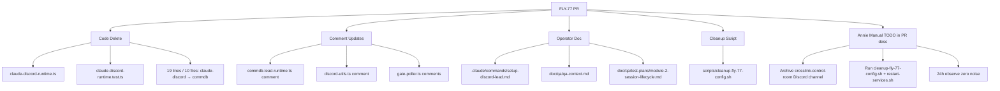

# Plan: 移除 Discord control channel — dead code cleanup

**Version**: v1.25.0
**Issue**: FLY-77
**Date**: 2026-05-03
**Source**: Linear FLY-77 (issue body 即 brainstorm/research 凝结，无独立 exploration/research doc)
**Status**: in-progress

---

## §1 现状 + 目标

### 1.1 背景

FLY-47（PR #119, 2026-03-16 merged）落地 CommDB 统一 Bridge → Lead 通信，`CommDBLeadRuntime` 替代了原先的 `ClaudeDiscordRuntime`（GEO-195, 2025-Q4 引入）。当时为了减小 PR 风险只换了运行时注入路径，没有清理被替代的 class、env 变量、config schema、operator doc，导致 ~6 周 dead code 累积。

Annie 2026-04-15 在 `Crosslink Control Room` Discord channel 看到仍有消息，担心 legacy code path 还活着——issue 因此从 Medium → High。

### 1.2 阶段 0 audit 结论（2026-05-03）

**Bridge runtime 路径已经是 CommDB-only**，与 issue body "残留 legacy code path 仍会向 control room 发消息" 的描述不符：

| 检查项 | 当前状态 |
|---|---|
| `createLeadRuntime()` (`plugin.ts:70-141`) | 只构造 `CommDBLeadRuntime`，无 fallback / 无 type 分支 |
| `LeadConfig` schema (`packages/teamlead/src/ProjectConfig.ts`) | 已不含 `controlChannel` / `runtime` 字段 |
| `~/.flywheel/projects.json` (prod) | 已 clean，无 `controlChannel` / `runtime` 字段 |
| `gate-poller.ts` | 走 `runtimeRegistry.getForLead()` → 注册的只有 CommDBLeadRuntime，无 control channel 投递分支（仅注释还提 control channel） |
| `CLAUDEBOT_TOKEN` env var | `grep packages/ scripts/ --include="*.ts" --include="*.sh"` 零功能引用 |
| `ClaudeDiscordRuntime` class | 唯一引用：自己的单元测试 `claude-discord-runtime.test.ts` |
| `~/Dev/GeoForge3D` | 零 dead code 引用（grep `controlChannel`/`ClaudeDiscordRuntime`/`CLAUDEBOT_TOKEN` 全空） |

→ Annie 4-15 看到的 noise **大概率不来自 Bridge 当前代码**：可能是当时跑的旧 binary（FLY-47 ship 后未重启）、Lead bot 自己进 control channel chat（access.json 仍允许）、或者更早期 message 残留。**根治方案**：从 access.json 把 control channel ID + ClaudeBot user ID 一并踢出，Lead bot 完全失去对该 channel 的读写权限，无论 noise 来源都消失。

### 1.3 目标

- 删除所有 `ClaudeDiscordRuntime` / `controlChannel` / `CLAUDEBOT_TOKEN` 功能性引用
- 让 Lead bot 在 access.json 里失去对 control channel 的 group permission
- 同步 operator-facing doc（`setup-discord-lead.md`、active QA docs）到 CommDB-only 状态
- 提供脚本化的 repo 外配置 cleanup，确保 4-slot dogfood 重启前一定执行
- 在 PR description 单列 "Annie 手动 cleanup TODO" 提醒 Discord channel archive

### 1.4 不在本次范围

- **不动** chat / forum / core room / chat thread 任何路径
- **不动** historical archive 文档（`doc/*/archive/*`，保留 v1.21.0 FLY-47 / GEO-246 / GEO-195 等的设计记录）
- **不动** GeoForge3D repo（无功能引用）
- **不重写** CommDB runtime（已 prod-active）
- **不动** plugin.ts / gate-poller.ts 的运行时逻辑（无可删的 control channel 分支，只更新 stale 注释）
- **active design doc 仅做 inline 名字替换**，不重写 v2.0-FLY-31 / FLY-52 整文（避免 scope creep；只把 "ClaudeDiscordRuntime" / "claude-discord-runtime.ts" 字面替换成 CommDB equivalent，让未来 worker 不会按已删文件名找路）

---

## §2 改动文件清单

### 2.1 代码删除（repo 内，PR 改）

| # | 文件 | 操作 | 说明 |
|---|---|---|---|
| 1 | `packages/teamlead/src/bridge/claude-discord-runtime.ts` | 删整个文件 (273 LOC) | prod 路径已不引用，仅自身测试 import |
| 2 | `packages/teamlead/src/__tests__/claude-discord-runtime.test.ts` | 删整个文件 | 是 (1) 的单元测试，跟 (1) 一起删 |
| 3 | 19 行 mock `type: "claude-discord"` → `type: "commdb"`（line 16 of `runtime-registry.test.ts` 包含 2 处字符串，`sed -g` 一次替换全部） | 改 | 跨 10 个测试文件（见下表），mock 只是 inline LeadRuntime object，类型字符串不参与运行逻辑，但跟 prod (`CommDBLeadRuntime.type === "commdb"`) 对齐 |
| 4 | `packages/teamlead/src/bridge/commdb-lead-runtime.ts:4` | 改注释 | 把 "Replaces ClaudeDiscordRuntime: …" 留作历史 reference 即可（class 已删，注释作为 git blame 之外的 quick context） |
| 5 | `packages/teamlead/src/bridge/discord-utils.ts:2` | 改注释 | "used by standup-service and claude-discord-runtime" → 只剩 "standup-service" |
| 6 | `packages/teamlead/src/bridge/gate-poller.ts:190, 213` | 改注释 | "Post to Lead's control channel (for Claude Code consumption)" / "FLY-47: Chat relay removed — Lead receives gate_question via control channel" → 改成 CommDB instruction 表述 |

#### 2.1.1 (3) 19 行 mock 改动定位（10 个测试文件）

| 文件 | 行号 | 行数 |
|---|---|---|
| `packages/teamlead/src/__tests__/event-route.test.ts` | 312, 637 | 2 |
| `packages/teamlead/src/__tests__/DirectEventSink.test.ts` | 276, 642, 767 | 3 |
| `packages/teamlead/src/__tests__/runtime-registry.test.ts` | 16 (函数签名 `type: "claude-discord" = "claude-discord"`，单行 2 处字符串), 55, 56 | 3 |
| `packages/teamlead/src/__tests__/bridge-e2e.test.ts` | 214, 361 | 2 |
| `packages/teamlead/src/__tests__/StuckWatcher.test.ts` | 131 | 1 |
| `packages/teamlead/src/__tests__/events-routing.integration.test.ts` | 57 | 1 |
| `packages/teamlead/src/__tests__/actions.test.ts` | 435, 549, 602 | 3 |
| `packages/teamlead/src/__tests__/HeartbeatService.test.ts` | 266, 394 | 2 |
| `packages/teamlead/src/__tests__/session-lifecycle.integration.test.ts` | 62 | 1 |
| `packages/teamlead/src/__tests__/event-filter-e2e.test.ts` | 84 | 1 |
| **总计** | | **19 行 / 10 文件**（line 16 含 2 处 → sed `g` flag 一次替换 20 处字符串） |

策略：用 `sed -i '' 's/type: "claude-discord"/type: "commdb"/g'` 单文件修改，最后 vitest 跑确认全绿。

### 2.2 Operator doc 改动（repo 内，PR 改）

#### 2.2.1 `.claude/commands/setup-discord-lead.md`（按当前文件实际行号）

| 行/区块 | 当前内容 | 改动 |
|---|---|---|
| L133 | `"{control-channel-id}": { "requireMention": false, "allowFrom": [] }` 在 `access.json` template 里 | **删除该行**（保留 chat / forum 两 entry） |
| L178-211 | Step 6 "Create Control Channel (Optional)" — Discord channel 创建说明 + control category | **删除从 `## Step 6` 到下一个 `---` 水平线之前的整段** |
| L212-239 | Step 6b "Repair Existing Control Channel Permissions"（含底部 "Verify by sending a test message" 验证 block） | **删除从 `### Step 6b` 到下一个 `---` 水平线之前的整段** |
| **L254-265** | **Step 8 `projects.json` 示例** — 当前包含 `"runtime": "claude-discord"` 和 `"controlChannel": "{control-id}"` 两行 | **删除这两行** —— 最终 example 仅保留 `agentId`, `forumChannel`, `chatChannel`, `match` 四字段；如果上下文还有讲 "runtime" 字段含义的散文，一起改成 CommDB-only 表述 |
| L300 | troubleshooting 表 row：`Bridge 403 on control channel \| Lead bot missing SEND_MESSAGES \| Run Step 6b` | **删除该行** |
| L315 | Reference: `Control Category: 1486031301764190270` | **删除该行** |
| 后续 step numbering | Step 7 / 8 / 9 / 10 ... | 顺序前推（手动修复 markdown 编号） |

#### 2.2.2 `doc/qa/qa-context.md`（marked-as-historical，整段保留作为 reference）

| 行 | 当前段落 | 改动 |
|---|---|---|
| L23-30 | "P0 Bug: GatePoller → Lead Relay Broken (found 2026-04-06)" — 描述 ClaudeBot 拿不到 control channel + Fix needed CLAUDEBOT_TOKEN | **整段加 historical 标记**：标题改为 `### [HISTORICAL — fixed by FLY-47/77] P0 Bug: GatePoller → Lead Relay Broken (2026-04-06)`，段尾追加一行 `**Resolution**: FLY-47 (PR #119) 改用 CommDBLeadRuntime；FLY-77 (PR #TBD) 删除 ClaudeDiscordRuntime + CLAUDEBOT_TOKEN。Bridge → Lead 现走 CommDB file inbox + flywheel_inbox MCP，不再 post Discord 任何 channel。` |
| L32-35 | "GatePoller Chat Dedup Bug (found 2026-04-06)" — 描述 control channel deliver 失败导致 chat 重复 | **同样加 historical 标记**：标题 `### [HISTORICAL — control channel removed by FLY-77]`，段尾追加 `**Resolution**: FLY-47 / FLY-77 后无 control channel deliver 路径，dedup 问题随之消失。` |

#### 2.2.3 `doc/qa/test-plans/module-2-session-lifecycle.md`（control-channel scenario 整段废弃）

| 行 | 当前内容 | 改动 |
|---|---|---|
| L5 | `**Related components**: gate-poller, event-route, ForumPostCreator, ForumTagUpdater, claude-discord-runtime` | 删 `, claude-discord-runtime`，追加 `, commdb-lead-runtime, flywheel-inbox-mcp` |
| L10 | `source ~/.flywheel/.env (CLAUDEBOT_TOKEN, PETER_BOT_TOKEN, TEAMLEAD_INGEST_TOKEN, TEAMLEAD_API_TOKEN)` | 删 `CLAUDEBOT_TOKEN, ` |
| L13 | `**access.json** contains \`allowBots\` with ClaudeBot user ID (L5)` | **整行删除**（L5 即将被废弃） |
| L43 | `Sender is **Peter - Product Lead** (NOT ClaudeBot)` | 保留（仍是当前断言） |
| L87 | `Sender is **Peter - Product Lead** (Lead identity, NOT ClaudeBot)` | 保留 |
| L89 | `> PASS = Peter spoke. "No ClaudeBot message" alone is NOT a pass.` | 保留 |
| L92 | `ClaudeBot posted gate_question JSON envelope (machine-to-machine event)` | 改为 `Bridge wrote gate_question to CommDB inbox (machine-to-machine, no Discord post)` |
| L120-138 | `### L5: Lead Receives Control Channel Event` 整节 | **整节删除**（L6-L8 编号顺势上移） |

#### 2.2.4 其他 active doc 中的 stale code-path 引用（轻量化处理 — 不重写整段）

| 文件 | 行 | 当前内容 | 改动 |
|---|---|---|---|
| `doc/engineer/plan/new/v2.0-FLY-31-flywheel-next-gen-architecture.md` | L192 | `ClaudeDiscordRuntime.deliver() 捕获 transport failure...` | 改 `CommDBLeadRuntime.deliver() 捕获 transport failure...` |
| 同上 | L195 | `**影响范围**：LeadRuntime interface, ClaudeDiscordRuntime, HeartbeatService` | 改 `LeadRuntime interface, CommDBLeadRuntime, HeartbeatService` |
| 同上 | L206 | `packages/teamlead/src/bridge/claude-discord-runtime.ts (transport error 暴露)` | 改 `packages/teamlead/src/bridge/commdb-lead-runtime.ts (transport error 暴露)` |
| `doc/engineer/exploration/new/FLY-52-product-experience-deep-design.md` | L28 | architecture diagram: `→ EventFilter → ClaudeDiscordRuntime → Discord control channel → Lead` | 改为 `→ EventFilter → CommDBLeadRuntime → file inbox → Lead (flywheel_inbox MCP)` |

**不动**：`doc/architecture/*.md`、`packages/qa-framework/*`、`CLAUDE.md`、`packages/CLAUDE.md`、所有 `doc/*/archive/*` 历史档（保留 v1.21.0 FLY-47 / GEO-246 / GEO-195 等设计记录）—— grep 确认零功能引用 / archive 应保留历史现状。

### 2.3 Repo 外配置清理脚本（repo 内，PR 改 — Annie 跑一次）

新增 `scripts/cleanup-fly-77-config.sh`：

```bash
#!/usr/bin/env bash
# FLY-77: Remove Discord control channel dead config from operator state.
#
# Idempotent — safe to re-run. Backs up files before mutating.
# Run order: BEFORE first restart-services after FLY-77 PR merges
#   (or before test-deploy in QA validation flow on the worktree).
set -euo pipefail

FLYWHEEL_HOME="${FLYWHEEL_HOME:-$HOME/.flywheel}"
CHANNELS_DIR="${CHANNELS_DIR:-$HOME/.claude/channels}"
TS=$(date +%Y%m%d-%H%M%S)

# Preflight: jq is required for access.json mutation.
if ! command -v jq >/dev/null 2>&1; then
  echo "[cleanup] ERROR: jq is required but not installed. Install via 'brew install jq' and re-run." >&2
  exit 1
fi

# 1. ~/.flywheel/.env: drop CLAUDEBOT_TOKEN line.
#    NOTE: grep -v exits 1 when zero lines are emitted (e.g. if .env contains only the matched line),
#    which would abort under `set -e`. Use `awk` (always exit 0) and a temp file via `mktemp`.
ENV_FILE="$FLYWHEEL_HOME/.env"
if [[ -f "$ENV_FILE" ]] && grep -q '^CLAUDEBOT_TOKEN=' "$ENV_FILE"; then
  cp "$ENV_FILE" "$ENV_FILE.bak-$TS"
  tmp_env=$(mktemp)
  awk '!/^CLAUDEBOT_TOKEN=/' "$ENV_FILE" > "$tmp_env"
  mv "$tmp_env" "$ENV_FILE"
  chmod 600 "$ENV_FILE"
  echo "[cleanup] removed CLAUDEBOT_TOKEN from $ENV_FILE (backup: $ENV_FILE.bak-$TS)"
fi

# 2. Drop projects.json backup files (legacy with controlChannel).
for bak in "$FLYWHEEL_HOME/projects.json.bak" "$FLYWHEEL_HOME/projects.json.bak2"; do
  if [[ -f "$bak" ]]; then
    rm "$bak"
    echo "[cleanup] removed legacy backup $bak"
  fi
done

# 3. Each Lead's access.json: drop control channel from groups + ClaudeBot from allowBots.
declare -a LEAD_CONTROL_PAIRS=(
  "discord-product-lead:1486419006540742769"
  "discord-ops-lead:1486419059267342459"
  "discord-cos-lead:1487340752995487865"
)
CLAUDEBOT_USER_ID="1484685699004497940"

for pair in "${LEAD_CONTROL_PAIRS[@]}"; do
  lead="${pair%%:*}"
  ctrl="${pair##*:}"
  acc="$CHANNELS_DIR/$lead/access.json"
  [[ -f "$acc" ]] || { echo "[cleanup] skip (missing): $acc"; continue; }
  cp "$acc" "$acc.bak-$TS"
  tmp_acc=$(mktemp)
  jq --arg ctrl "$ctrl" --arg bot "$CLAUDEBOT_USER_ID" '
    .groups    = ((.groups // {}) | with_entries(select(.key != $ctrl)))
    | .allowBots = ((.allowBots // []) | map(select(. != $bot)))
  ' "$acc" > "$tmp_acc"
  mv "$tmp_acc" "$acc"
  chmod 600 "$acc"
  echo "[cleanup] $acc: removed group $ctrl + allowBots $bot (backup: $acc.bak-$TS)"
done

# 4. Verify acceptance — control channel key + ClaudeBot removed; remaining groups printed for manual review.
echo ""
echo "[verify] post-cleanup access.json state:"
for pair in "${LEAD_CONTROL_PAIRS[@]}"; do
  lead="${pair%%:*}"
  ctrl="${pair##*:}"
  acc="$CHANNELS_DIR/$lead/access.json"
  [[ -f "$acc" ]] || continue
  has_ctrl=$(jq --arg ctrl "$ctrl" '.groups | has($ctrl)' "$acc")
  remaining_groups=$(jq -r '.groups | keys | join(",")' "$acc")
  has_bot=$(jq --arg bot "$CLAUDEBOT_USER_ID" '(.allowBots // []) | any(. == $bot)' "$acc")
  echo "[verify] $lead: control_present=$has_ctrl claudebot_present=$has_bot remaining_groups=[$remaining_groups]"
  if [[ "$has_ctrl" != "false" || "$has_bot" != "false" ]]; then
    echo "[verify] FAIL: $acc still references control or ClaudeBot — investigate." >&2
    exit 2
  fi
done
echo "[verify] If a remaining_groups list looks wrong (chat/forum/core room channel missing), restore from .bak-$TS."

echo "[cleanup] done. Restart Bridge + Leads to apply: bash scripts/restart-services.sh"
```

依赖：`jq`（macOS 标配 `brew install jq`；脚本前置 preflight 检查）。脚本特性：
- **Idempotent**：再跑一次 awk/jq filter 仍输出同样结果。
- **Safe defaults**：`(.groups // {})` / `(.allowBots // [])` 兜底缺字段情况。
- **Verification gate**：第 4 步 jq 验证 control entry 真的没了 + ClaudeBot 真的不在 allowBots，任何 lead 残留即非零退出。
- **Backup**：每次 mutate 前 `.bak-<ts>` 备份，可手动 rollback。
- **Permission**：操作完 `chmod 600`，跟 setup-discord-lead skill 默认一致。

### 2.4 文件 inventory 总结

| 类型 | 文件数 | 备注 |
|---|---|---|
| 删除（src） | 2 | claude-discord-runtime.ts + 同名 test |
| 修改（test mocks） | 10 个测试文件 | 19 行 mock（line 16 of runtime-registry 含 2 处字符串） |
| 修改（src 注释） | 3 | commdb-lead-runtime, discord-utils, gate-poller |
| 修改（operator doc） | 3 | setup-discord-lead.md, qa-context.md, module-2-session-lifecycle.md |
| 修改（active design doc 轻量化） | 2 | v2.0-FLY-31 plan, FLY-52 exploration（小幅 inline 替换 ClaudeDiscordRuntime → CommDBLeadRuntime，避免误导未来 worker） |
| 新增（脚本） | 1 | scripts/cleanup-fly-77-config.sh |

总计 ~21 个文件改动，纯 cleanup + 已有 prod 路径名校准，无新功能。

---

## §3 验证

### 3.1 单元 + 集成测试（CI gate）

```bash
cd /Users/xiaorongli/Dev/flywheel/worktrees/fly-77
pnpm install
pnpm -F teamlead build
pnpm -F teamlead test
```

期望：
- `claude-discord-runtime.test.ts` 删除后 vitest 不报 "no tests found"（pnpm test 自动 skip 不存在的 file pattern）
- 所有改了 mock type 的测试继续 pass（type 字段不参与运行逻辑）
- 全 packages CI 跑过：`pnpm -r build && pnpm -r test`

### 3.2 4-slot dogfood E2E（Annie default 验证路径）

按 packages/qa-framework `reference_qa_framework.md` 流程。`~/.flywheel/test-slots.json` 配置 4 slots（slot 1 cos, slot 2-4 lead）：

```bash
# 1. 在 fly-77 worktree 跑 cleanup script（清 ~/.flywheel/.env + access.json）
#    NOTE: 这里"先 cleanup 再 deploy"是 QA 验证场景 — 我们要测试 new code + cleaned operator state；
#    在生产场景里 Annie ship-PR 后跑一次 cleanup 在 restart-services 之前，跟这边 QA 顺序一致。
bash scripts/cleanup-fly-77-config.sh

# 2. 4-slot test deploy
bash scripts/test-deploy.sh 1   # cos (flywheel-test-1)
bash scripts/test-deploy.sh 2   # lead (flywheel-test-2)
bash scripts/test-deploy.sh 3   # lead (flywheel-test-3)
bash scripts/test-deploy.sh 4   # lead (flywheel-test-4)

# 3. 触发 E2E 三类 event
bash scripts/discord-e2e.sh basic       # 基本 issue 路由
bash scripts/discord-e2e.sh lifecycle   # session lifecycle 全流程
bash scripts/discord-e2e.sh error       # error / failure 路径

# 4. 监控 control room — 全程 Chrome Discord 观察 crosslink-control-room
#    expectation: 0 new messages during E2E
```

验证 acceptance：
- ✅ `crosslink-control-room` 在整个 E2E 期间 0 新消息
- ✅ chat / forum / core / chat thread 全部正常工作（Lead 发到对应 chat channel，不漏发）
- ✅ Bridge log 无 `[claude-discord]` / `[bridge-bot]` 等遗留 prefix
- ✅ `gh pr checks` CI 全绿
- ✅ 24h observation：Annie restart Bridge 后 1 天回头看 control room 仍 0 新消息（写在 PR description 作为 ship 后回访）

### 3.3 Cleanup script verification（脚本内置 + 手动 cross-check）

脚本第 4 步会自动验证 control entry / ClaudeBot 已从 access.json 清除。Annie 再手动 cross-check chat / forum 仍可达：

```bash
# 1) 看每个 Lead access.json 现存 group keys
for lead in discord-product-lead discord-ops-lead discord-cos-lead; do
  echo "--- $lead ---"
  jq '.groups | keys' ~/.claude/channels/$lead/access.json
done
# 期望：每个 Lead 仅剩 chat / forum / core room channel ID，无 control channel ID

# 2) 触发一次 chat → confirm Lead bot 仍接 message + 仍能 reply
#    (Annie 在 Discord 各 Lead 的 chat channel 发 "ping"，预期 Lead 回复，不超时)
```

### 3.4 Codex code review

PR 创建后跑 `/codex-code-review-rescue`。Codex 关注点：
- `git diff` 看是否漏删 `ClaudeDiscordRuntime` 的某处引用
- mock type 改动是否引入 type-error
- cleanup script 是否幂等、是否处理 missing file 情况
- 是否有 active doc 漏改（重点：`v2.0-FLY-31` plan, `FLY-52` exploration, `qa-context.md`, `module-2-session-lifecycle.md`）

### 3.5 不需要的验证

- 不需要写新的单元测试（纯删除，没有新行为引入）
- 不需要 perf benchmark（无性能影响）

---

## §4 Annie 手动 cleanup TODO（PR description 必列段）

PR ship 后 Annie 需要做的人工步骤（脚本化无法 cover Discord 侧）：

- [ ] **Archive `crosslink-control-room` channel**（保留 history 但隐藏，避免误用）
  - Discord channel settings → Archive (or 改成 hidden category)
- [ ] **检查每个 Lead 是否还有自己的 control channel**（若当年 setup-discord-lead skill 给每个 Lead 创了独立的 control channel，对应 channel 也一起 archive）
  - 候选 channel ID：`1486419006540742769` (product-lead)、`1486419059267342459` (ops-lead)、`1487340752995487865` (cos-lead)
- [ ] **跑 cleanup script**：`bash scripts/cleanup-fly-77-config.sh && bash scripts/restart-services.sh`（在 main repo merge 后第一次重启前跑）
- [ ] **24h 后回访**：打开 archived channel 看 history，确认 ship 后没有任何新消息（acceptance criteria #3）

### 4.1 Plan archive 时机

按 memory rule "consolidate held PR stack into one PR" + "archive docs in main PR"：
- Plan codex-approved 后：`git mv plan/draft → plan/new`（commit）
- Implement 开始时：`git mv plan/new → plan/inprogress`（commit）
- PR ship 时**最后一个 commit**：`git mv plan/inprogress → plan/archive`（不开 follow-up PR）

---

## §5 Risks

| Risk | 概率 | 影响 | 缓解 |
|---|---|---|---|
| 漏删某个 dynamic import / string ref | 低 | Bridge 启动失败 | grep 全 codebase + Codex review + CI build 三层 gate；脚本式删除可重复 audit |
| Mock type 改动破坏某个 test 的隐式 assertion | 极低 | CI 红 | 19 行（10 测试文件）都是 inline mock 的 `type` 字段 — `LeadRuntime.type: string`，无 narrow type discrimination；vitest 跑过即 confirm |
| `cleanup-fly-77-config.sh` 在 Annie 机器上 jq 缺失 | 低 | 脚本失败 | 脚本前置检查 `command -v jq` 缺失则提示 `brew install jq`；备份在 `.bak-<ts>` 可恢复 |
| Lead bot 因为 access.json 改动反而漏掉合法 message | 低 | Lead 不响应 chat | 只删 control channel ID；chat / forum / core 那几个 channel 在 `groups` 里完整保留 |
| 4-15 看到的 noise 来源不是 access.json，删 access.json 后还有消息 | 低 | acceptance 不达标 | 24h observe 期；如果还有 noise，回头进一步 grep（standup-service / forum / dashboard 已 audit 过，无 control channel ref，所以兜底已经做） |

**Open questions**: 无 — Annie Round 1 答复后所有问题已闭合。

---

## §6 实现顺序（实施 checklist）

1. 删 `claude-discord-runtime.ts` + 同名 test 文件
2. `sed -i '' 's/type: "claude-discord"/type: "commdb"/g'` → 19 行 / 10 测试文件 → 跑 `pnpm -F teamlead test` 全绿
3. 改 3 处 stale src 注释（commdb-lead-runtime, discord-utils, gate-poller）
4. 改 `.claude/commands/setup-discord-lead.md`（按 §2.2.1 的精确行号删除 control channel 步骤 + 修复 step numbering）
5. 改 `doc/qa/qa-context.md`（按 §2.2.2 加 historical 标记）
6. 改 `doc/qa/test-plans/module-2-session-lifecycle.md`（按 §2.2.3 删 L5 整节 + 部分行）
7. 改 `doc/engineer/plan/new/v2.0-FLY-31-flywheel-next-gen-architecture.md` 三处 + `doc/engineer/exploration/new/FLY-52-product-experience-deep-design.md` L28（轻量化 inline 替换）
8. 写 `scripts/cleanup-fly-77-config.sh`（按 §2.3 完整脚本，确认 jq preflight + awk + verification）
9. `pnpm -r build && pnpm -r test` 全绿
10. Commit + push
11. Create PR — description 包含 §4 manual TODO
12. SendMessage team-lead "PR created"
13. 跑 `/codex-code-review-rescue`
14. Codex amend 循环（按 sprint v26 经验，3-4 轮 amend 正常）
15. 等 team-lead "ship 信号" + Annie cleanup script run + 4-slot dogfood verdict
16. ship 时最后一个 commit：`git mv plan/inprogress → plan/archive`

---

## §7 Mermaid: 改动 footprint


