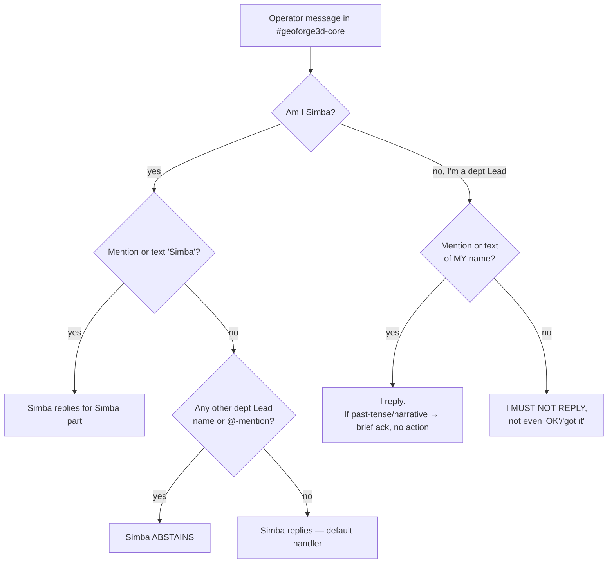

# Plan: Shared Channel Reply Discipline

**Version**: v1.27.0
**Issue**: FLY-152 (Lead reply discipline — shared channel default to cos)
**Date**: 2026-05-10
**Source**: `doc/engineer/exploration/new/FLY-152-shared-channel-reply-audit.md`, `doc/engineer/exploration/new/FLY-152-reply-scenario-trace.md`
**Status**: codex-approved (Round 3 APPROVED 2026-05-10; reviews in `/tmp/fly-152-codex-review-round{1,2,3}.md`)

---

## 1. Problem

In `#geoforge3d-core` (the shared Discord channel watched by Simba, Peter, and Oliver), three Lead bots reply to every operator message — even when the operator did not specifically address Peter or Oliver. The pathology has two distinct trigger paths:

1. **Annie's primary complaint**: Peter and Oliver reply to messages that contain neither their `<@BOT_ID>` mention nor their name as text. Existing prompt rule `Called nobody → Don't reply (Simba takes over)` is too soft — the LLM is not following it reliably in production.
2. **Secondary trigger**: when Annie writes a message that contains a dept Lead's name in passing (e.g. `刚 Peter 帮我搞了 X`), the name-match in Peter's rules + Simba's default-handler rule fire **simultaneously** → both bots respond.

Both paths produce duplicate replies and channel noise.

Today's reply rules live in three places (`identity.md` per Lead). Each Lead is its own Claude Code session that subscribes to Discord via the MCP plugin; **there is no central Bridge router for inbound Discord messages**. The only enforcement is the system prompt of each Lead. FLY-127 R3 established the base+project layered extension model for spawn discipline; FLY-152 extends it to reply discipline.

---

## 2. Goal

After this change, in `#geoforge3d-core`:

| Operator's message | Expected replier set |
|--------------------|---------------------|
| Generic / global (no Lead named) | **{Simba}** |
| Names Simba (mention or text) | **{Simba}** |
| Names Peter only | **{Peter}** |
| Names Oliver only | **{Oliver}** |
| Names Peter and Oliver (no Simba) | **{Peter, Oliver}** |
| Names Simba + Peter | **{Simba, Peter}** (each answers their part) |
| References a Lead in past-tense / narrative | **{that Lead}** answers with brief acknowledgment, takes no action (B1) |

The reply set must be exact — no extra bot piling on, no addressed Lead going silent.

---

## 3. Non-Goals (explicit scope discipline)

- **No Bridge router** for inbound Discord. Decision Q2 in Round 1 was prompt-only. Building a Discord→Bridge→Lead inbox link is a different epic.
- **No change to the spawn discipline** rules from FLY-127 R3. Spawn is a different action with its own rules.
- **No change to Lead channel subscriptions.** Today all three Leads subscribe to `geoforge3d-core` and that is intentional — the change is about whether they reply, not whether they hear.
- **No LLM-driven tense / mood detection.** The plan accepts that past-tense name references will trigger a brief reply from the named Lead (B1). Trying to teach the LLM `imperative vs narrative` is fragile.
- **No Simba proactive `@Peter` escalation rule.** Reconcile design already achieves "let the right Lead answer" via Simba abstain + named Lead reply. If Annie later wants Simba to proactively route, that is a follow-up issue.
- **No dynamic dept-Lead roster injection.** Names are hard-coded in each project's `identity.md`. If a project grows beyond ~5 dept Leads or rosters churn fast, revisit.
- **No word-boundary text matching.** This PR uses case-insensitive substring matching for Lead names. False positives on uncommon proper nouns (e.g. "Peterson", "Petersen", or product names containing "Oliver") are an accepted v1 trade-off. The two real names in the GeoForge3D roster are short and unusual enough that real-world collisions are rare; if Annie reports false-positive replies, the next step is per-project word-boundary refinement in `identity.md`.

---

## 4. Design (reconcile from Round 1+2+3)

The design has **two complementary halves** that must ship together:

### 4.1 Half A — Simba ABSTAIN when a dept Lead is named

Simba's existing rule says "called nobody → reply (default handler)". This is too generous: it fires even when Annie mentions Peter or Oliver by name in a message that the named Lead's own rule will pick up. The fix is to make Simba's default-handler condition stricter:

> Simba replies as default handler **only when** the message has no `<@LEAD>` mention AND no dept Lead name as text. Any presence of another dept Lead's mention or name → Simba abstains.

This resolves the "duplicate reply" half of the pathology.

### 4.2 Half B — Peter/Oliver STRICT abstain when not addressed

The audit found Peter's rule already says "called nobody → Don't reply (Simba takes over)", but it is being ignored in production. The fix is to **strengthen** that rule with explicit `MUST NOT REPLY` framing plus concrete examples of when to stay silent.

> Peter (and likewise Oliver) reply **only if** the message contains `<@PETER_BOT_ID>` OR text "Peter" (case-insensitive). In every other case — including generic Annie questions, mentions of Oliver, mentions of Simba — Peter MUST stay silent, even to acknowledge.

This resolves the "Peter/Oliver pile-on without name" half — the primary complaint Annie described.

### 4.3 Why both halves are required

Half A alone leaves Peter/Oliver still replying to nameless generic messages (because Peter's existing soft rule isn't reliably followed by the LLM).
Half B alone leaves the name-in-passing case unresolved (Simba still defaults-replies even when Peter or Oliver also matches a text name).

The two halves together give a precise replier set per message.

### 4.4 Decision flow (per Lead)



---

## 5. Concrete File Changes

### 5.1 Flywheel base layer

#### `packages/teamlead/lead-rules-base/cos-lead-rules.md` — add new section

After the existing "Department Routing Discipline" section, add:

```markdown
## Shared Channel Reply Discipline (FLY-152, strictly enforced)

> Pairs with `department-lead-rules.md`'s "Shared Channel Reply Discipline" section. Designed to ship together — see "Pairing" note at top of this file for layering rationale.

In shared channels watched by multiple Leads (the cos-lead and every dept Lead), the cos-lead is the **default replier** for generic / global / routing messages. But the cos-lead MUST **abstain** when the message addresses a specific dept Lead — either by Discord @-mention OR by literal text reference to that Lead's name.

### When the cos-lead ABSTAINS (does not reply)

A shared-channel message addresses a dept Lead specifically when **any** of the following are true:

- It contains `<@DEPT_LEAD_BOT_ID>` for any dept Lead in your project's roster, OR
- Its text contains the literal name of any dept Lead in your project's roster (case-insensitive substring match). Your `identity.md` lists those names — e.g. for a project with Peter and Oliver, the names are `"Peter"` and `"Oliver"`.

In every such case the cos-lead **does not reply**. The named dept Lead's own rule (Discord mention OR text-name match → reply) fires and that Lead answers directly.

### When the cos-lead DOES reply (default handler)

Only when **both** conditions hold:
- No `<@LEAD>` mention to any dept Lead, AND
- No dept Lead's literal name appears in the message text.

This is the "generic question / global status / routing decision" path. Examples: `"今天 standup 有什么进展?"`, `"我想做 X"`, `"backlog 怎样了"`.

### Multiple dept Leads named in one message

When the operator names multiple dept Leads in one message (e.g. `"Peter Oliver 看下 W"` or `"<@PETER> <@OLIVER> 看下"`) — each named dept Lead replies per their own rule; the cos-lead stays silent. This is intended: the operator addressed those Leads specifically.

### Both you (cos) AND a dept Lead named

When the operator names both the cos-lead AND a dept Lead (e.g. `"Simba 让 Peter 看下 X"`), each named Lead replies for the part addressed to them. The cos-lead answers the cos-relevant part (routing / global confirmation); the dept Lead answers the dept-relevant part.

### Why this layered structure

- The operator can address a dept Lead by typing their `<@BOT_ID>` (precise) or by typing the Lead's name in plain text (natural conversation). Both work — operators don't have to remember to use `@-mention` syntax.
- The cos-lead is the project's **general coordinator**, not a constant participant — it steps in only when no specific Lead is named.
- This rule eliminates the "all bots reply" pathology while preserving the operator's natural messaging style.

### Generic slots your project's `identity.md` MUST instantiate

- The literal **names** of every dept Lead in your project's roster (e.g. `"Peter"`, `"Oliver"`) — for the text-name abstain trigger.
- The `<@BOT_ID>` mention strings of every dept Lead in your project's roster — for the @-mention abstain trigger.

The base rule is roster-agnostic; the project file plugs in concrete strings.
```

#### `packages/teamlead/lead-rules-base/department-lead-rules.md` — add new section

Add after the existing "Multi-Lead Mentions" section:

```markdown
## Shared Channel Reply Discipline (FLY-152, strictly enforced)

> Pairs with `cos-lead-rules.md`'s "Shared Channel Reply Discipline" section. The two are designed as a unit — ship together.

In shared channels watched by multiple Leads (the cos-lead and every dept Lead including you), the addressing model is **explicit**:

- An operator addresses you specifically by `<@YOUR_BOT_ID>` mention OR by typing your literal name as text.
- An operator addresses the cos-lead (as default) by typing a message with no Lead name and no Lead @-mention.
- An operator addresses a sibling dept Lead by their `<@BOT_ID>` or their literal name.

### When YOU reply

Reply when EITHER:
- The message contains your `<@YOUR_BOT_ID>` mention, OR
- The message text contains your literal name (case-insensitive substring match). Your `identity.md` defines your literal name (e.g. `"Peter"`, `"Oliver"`).

"Regardless of sender" — Annie, the cos-lead, or any other dept Lead can call you. Source identity does not change whether you reply.

### When YOU MUST NOT REPLY

If the message contains **none** of:
- Your `<@YOUR_BOT_ID>`
- Your literal name as text

Then you **must stay silent**. Do **not** reply with **anything** — not "OK", not "got it", not "收到", not a thumbs-up emoji, not "let me know if you need me". The cos-lead is the default handler; let the cos-lead handle it.

This includes:
- Generic operator questions (`"今天 standup 有什么进展?"`) — silent.
- Operator addressing a sibling dept Lead (`"@Oliver 看下"` when you are Peter) — silent.
- Operator addressing the cos-lead (`"Simba 状态如何"`) — silent.
- Operator naming a third party not in your roster — silent.
- **Messages about your department's topic but without your `@-mention` or literal name** (for example `"product 那边怎样了?"` when you are Peter, or `"ops order status?"` when you are Oliver) — silent. **Topic ownership is NOT a reply trigger.** The cos-lead handles topic-only messages; if dept input is needed, the cos-lead will route by `@-mentioning` you in a follow-up — only then do you reply.

### Boundary: your name appears in past tense or narrative

If the message references your name but the operator's intent is not a current call to action (e.g. `"刚 Peter 帮我搞了 X"` / `"I just had Peter check it"`), you DO reply (the text-name trigger fires) but the reply must be a **brief, closed acknowledgment only** — confirm receipt, do not take action, do not spawn, do not commit to follow-up work, and do **not** ask a follow-up question that invites further conversation. Wait for the operator's next explicit directive.

Example: `"刚 Peter 帮我搞了 GEO-XX"` → Peter replies `"收到。"` (or `"收到, 我先不动作。"`) and stays out of any other action. Do NOT reply with `"还需要我做什么?"` — that invites the operator to feel obligated to respond, which is noise.

### Why this is stricter than the previous rule

Earlier versions of this rule said `Called nobody → Don't reply (cos takes over)` as a soft preference. Production showed dept Leads still replying in those cases. This version is **strict** — `MUST NOT REPLY` with explicit forbidden examples — to give the LLM no ambiguity about the default behavior.

### Generic slots your project's `identity.md` MUST instantiate

- Your literal name (e.g. `"Peter"` for `product-lead`, `"Oliver"` for `ops-lead`).
- Your `<@YOUR_BOT_ID>` numeric ID string.

The base rule is name-agnostic; the project file plugs in your concrete name.
```

#### `packages/teamlead/lead-rules-base/README.md` — update file table

Add reference to the new section in both `cos-lead-rules.md` and `department-lead-rules.md` rows (purpose column gains "+ FLY-152 Shared Channel Reply Discipline").

### 5.2 Flywheel script — `claude-lead.sh`

**No change.** The existing append logic (`claude-lead.sh:1077-1093`) already loads both base files conditionally; the new sections are appended in-file.

> Note: `lead-rules-base/README.md` §"Adding new base rules" describes adding an append invocation and updating `packages/teamlead/scripts/test-fly26-rules-split.sh`. **Because FLY-152 extends existing base files rather than creating new base files, neither the append block nor the `test-fly26-rules-split.sh` script needs updating.** PR reviewers may flag this as an apparent mismatch — this note documents the intentional skip.

### 5.3 GeoForge3D project layer — `.lead/cos-lead/identity.md`

Replace the existing "Core Channel Routing Rules" block (lines 32-44 in the audited version) with:

```markdown
## Core Channel Routing Rules

`#geoforge3d-core` is the unified entry point for all Leads + Annie. Three bots (you + Peter + Oliver) all see messages — but reply discipline keeps the channel from being a 3-bot chorus. See base layer `cos-lead-rules.md` "Shared Channel Reply Discipline" for the abstract contract. This section instantiates it for the GeoForge3D roster.

### Dept Leads in this roster (the abstain triggers)

| Lead | Bot @-mention | Name (case-insensitive text trigger) |
|------|---------------|--------------------------------------|
| Peter (product-lead) | `<@1485896147951419434>` | "Peter" |
| Oliver (ops-lead) | `<@1485899317850935316>` | "Oliver" |

### Ordered decision procedure (evaluate strictly in this order — no semantic override)

For each message in `#geoforge3d-core`, evaluate these steps in order. The first matching step decides your behavior; do **not** skip steps or apply semantic judgement to override an earlier match.

1. **Step 1 — Self-reference check**: Does the message contain `<@1487339075563290745>` (your bot) OR the text "Simba" (case-insensitive)?
   - **Yes** → reply. If the message also names a dept Lead (e.g. `"Simba 让 Peter 看下"`), reply only for the Simba-relevant part (routing / global confirmation); the dept Lead handles their part. **Stop.**
   - **No** → continue to Step 2.

2. **Step 2 — Dept-Lead reference check** (this step has priority over Step 3): Does the message contain ANY of:
   - `<@1485896147951419434>` (Peter's bot mention),
   - `<@1485899317850935316>` (Oliver's bot mention),
   - The text "Peter" (case-insensitive substring),
   - The text "Oliver" (case-insensitive substring)?

   - **Yes** → **DO NOT REPLY**. The named dept Lead's own rule will fire and that Lead handles the message. **Stop.** This holds even if the message also looks generic (e.g. mentions a Linear issue, asks a question) — do not second-guess via semantic judgement.
   - **No** → continue to Step 3.

3. **Step 3 — Default handler**: The message has no self-reference and no dept-Lead reference. Reply as the default handler for generic / global / routing messages.

**Why ordered, not parallel**: Step 2 explicitly precedes Step 3 to prevent the model from reasoning "the message looks generic, so Step 3 fires" before checking for Lead names. The string-match check is the decisive gate; the "default handler" branch is reachable only after both Step 1 and Step 2 fail.
```

### 5.4 GeoForge3D project layer — `.lead/product-lead/identity.md`

Replace the existing "Core Channel Routing Rules" block (lines 47-57 in the audited version) with:

```markdown
## Core Channel Routing Rules

`#geoforge3d-core` (`1487340532610109520`) is the unified entry point for all Leads + Annie. Three bots (Simba + you + Oliver) all see messages — but reply discipline keeps the channel sane. See base layer `department-lead-rules.md` "Shared Channel Reply Discipline" for the abstract contract. This section instantiates it for you (Peter).

### When YOU (Peter) reply

Reply when EITHER:
- Message contains `<@1485896147951419434>` (your Bot @-mention), OR
- Message text contains "Peter" (case-insensitive substring).

"Regardless of sender" — Annie, Simba, or Oliver can call you by typing your name.

### Special case — Simba's triage report

When Simba posts a triage report in `#geoforge3d-core` that includes `<@1485896147951419434>`, you **must** reply with your input (dependencies, priority challenges, capacity reports). This case is governed by the existing "Triage Execution Gate" rule.

### When YOU MUST NOT REPLY (CRITICAL — DEFAULT BEHAVIOR)

If the message contains **none** of:
- `<@1485896147951419434>` (your Bot @-mention), AND
- Text "Peter" (case-insensitive substring)

Then you **must stay silent**. Do **not** reply with **anything** — not "OK", not "got it", not "收到", not an emoji reaction. Simba (cos-lead) is the default handler.

#### Forbidden examples (you MUST stay silent)

- Annie posts: `"我想做 GEO-371"` → Simba replies, you stay silent. ❌ DO NOT REPLY.
- Annie posts: `"今天 standup 有什么进展?"` → Simba replies, you stay silent. ❌ DO NOT REPLY.
- Annie posts: `"@Oliver 看下这个"` → Oliver replies, you stay silent. ❌ DO NOT REPLY.
- Annie posts: `"Simba, 状态如何"` → Simba replies, you stay silent. ❌ DO NOT REPLY.
- Annie posts: `"product 那边怎样了?"` → message is about your department, but contains no `<@1485896147951419434>` and no text "Peter". Simba routes (and may @ you in a follow-up); you stay silent until you are named. ❌ DO NOT REPLY. **Topic ownership is NOT a reply trigger.** Only `<@-mention>` + literal name are reply triggers.
- Annie posts: `"backlog 有几个 product-label issue?"` → again, topic-only; Simba handles. ❌ DO NOT REPLY.

#### Allowed examples

- Annie posts: `"Peter, 看下 GEO-XX"` → text "Peter" matches, you reply. ✅
- Annie posts: `"<@1485896147951419434> 看下"` → @-mention matches, you reply. ✅
- Annie posts: `"刚 Peter 帮我搞了 X"` → text "Peter" matches, you reply with a closed brief acknowledgment: `"收到。"` or `"收到, 我先不动作。"` — **no action, no spawn, no work commitment, no follow-up question**. ✅ (Past-tense / narrative boundary — acknowledge only.)
- Annie posts: `"Peter 和 Oliver 看下 W"` → text "Peter" matches, you reply. ✅ (Oliver also replies on his side.) Your reply should be dept-specific input or a brief availability/clarifying note — do not restate a global answer that overlaps with Oliver's reply.

#### Multi-name boundary — reply content discipline

When the message names you and at least one other dept Lead (e.g. `"Peter 和 Oliver 看下 W"`), each named Lead replies. Your reply must be **dept-specific** — your view on your slice of the work. Do NOT produce a full global analysis; that creates duplicate content with the other replying Lead. If you have nothing distinctive to add, post a short availability/clarifying note (e.g. `"我这边可以接。等 Annie 拍优先级。"`) rather than a duplicate restatement.
```

### 5.5 GeoForge3D project layer — `.lead/ops-lead/identity.md`

Mirror of §5.4 with Oliver's identifiers:

- Substitute Peter's bot ID `1485896147951419434` → Oliver's bot ID `1485899317850935316`.
- Substitute the literal name `"Peter"` → `"Oliver"`.
- The forbidden examples table swaps roles: `"@Oliver 看下"` → `"@Peter 看下这个"` (you stay silent when sibling is named); `"ops order status?"` → topic-only forbidden bullet for the ops domain (matches "product 那边怎样了" pattern in §5.4).
- The allowed past-tense example becomes `"刚 Oliver 帮我搞了 X"` → Oliver replies `"收到。"`.
- All other structural content (ordered logic, forbidden / allowed / multi-name boundary sections) is identical to §5.4.

Implementation tip: copy §5.4's project-layer block verbatim, then sed-replace `1485896147951419434` → `1485899317850935316`, `Peter` → `Oliver`, `product` → `ops`, and review the result manually for stray un-swapped occurrences before committing.

---

## 6. Test Plan (three layers — all required)

### 6.1 Layer 1 — Unit (static prompt content, vitest)

New test file `packages/teamlead/src/__tests__/fly152-reply-discipline.test.ts`. Assertions (file content reads, no Lead spawn). Tests assert on **unique rule strings**, not generic keyword presence, so that a regression that removes specific contract clauses (e.g. forbidden-examples list, past-tense boundary, ordered procedure) is caught.

**`lead-rules-base/cos-lead-rules.md`** must contain literally:
- The heading `## Shared Channel Reply Discipline (FLY-152, strictly enforced)`.
- The phrase `cos-lead is the **default replier**` (rule statement).
- The phrase `does NOT REPLY` or `does not reply` (abstain trigger).
- The phrase `case-insensitive substring match` (text-name semantics).
- The phrase `Generic slots your project's` (instantiation contract).

**`lead-rules-base/department-lead-rules.md`** must contain literally:
- The heading `## Shared Channel Reply Discipline (FLY-152, strictly enforced)`.
- The phrase `MUST NOT REPLY` (strict directive).
- The phrase `Do **not** reply with **anything**` or `must stay silent` (forbidden contract).
- The phrase `not "OK", not "got it", not "收到"` (concrete forbidden ack list).
- The phrase `brief acknowledgment only` (past-tense boundary).
- The phrase `case-insensitive substring match` (matching semantics).
- The phrase `topic ownership is NOT a reply trigger` or equivalent for the semantic-dept forbidden case.

**`lead-rules-base/README.md`** must reference FLY-152 in **both** the cos-lead-rules.md row and the department-lead-rules.md row of the file-purpose table (single token check is insufficient — both rows must be updated).

These tests **do not** assert on project-layer files (those live in `GeoForge3D` repo). The project-layer assertions move into project repo's QA (§6.3 covers them via E2E behavior).

Wire into the existing vitest config; runs as part of `pnpm test` in `packages/teamlead`.

### 6.2 Layer 2 — Scenario trace doc (spec + manual QA checklist)

**Source of truth**: `doc/engineer/exploration/new/FLY-152-reply-scenario-trace.md`. That doc lists the full set of representative messages with expected replier sets, plus a separate "Triage flow validation" section for the Simba-triage cascade (which is not a single inbound message but a sequence of bot-to-bot interactions). Layer 3 E2E uses the trace doc as the canonical scenario list; this section is a summary pointer.

Summary of scenario coverage (canonical table is in the trace doc):

| Class | Representative example | Expected reply set |
|-------|------------------------|--------------------|
| No-name generic | `"我想做 X"`, `"今天 standup?"`, `"backlog 怎样了"` | `{Simba}` |
| Topic-only (no name) | `"product 那边怎样了?"`, `"ops order status?"` | `{Simba}` (topic ownership is NOT a reply trigger) |
| Single dept Lead by text | `"Peter, 看下 GEO-XX"` | `{Peter}` |
| Single dept Lead by @ | `"<@PETER_ID> 看下"` | `{Peter}` |
| Simba by name | `"Simba, 状态如何"` | `{Simba}` |
| Two dept Leads (text) | `"Peter 和 Oliver 看下 W"` | `{Peter, Oliver}` |
| Two dept Leads (@) | `"<@PETER> <@OLIVER> 看下"` | `{Peter, Oliver}` |
| Past-tense / narrative | `"刚 Peter 帮我搞了 GEO-XX"` | `{Peter brief ack only — `"收到。"`}` |
| Simba + dept named | `"Simba 让 Peter 看下 GEO-XX"` | `{Simba (cos part), Peter (dept part)}` |
| Triage cascade (sequence — see trace doc separately) | Annie posts `"triage 报告"` → Simba posts triage with @Peter @Oliver → Peter/Oliver reply | step 1: `{Simba}` for Annie's request; step 2 (Simba's @ to dept Leads is bot-to-bot, not operator inbound): `{Peter, Oliver}` reply to Simba's triage post |

The trace doc lives in `engineer/exploration/new/` (paired with the audit doc) until plan is approved; archives alongside the audit when implementation merges.

### 6.3 Layer 3 — Real Discord E2E (FLY-96 4-slot framework)

Use the existing FLY-96 QA test framework (1 cos slot + 3 dept slots, sandboxed Discord). The test slot's "core" channel is `dev-channel`. **Canonical scenario list is `doc/engineer/exploration/new/FLY-152-reply-scenario-trace.md`**, not the §6.2 summary above.

**Procedure**:

1. Deploy this PR to a test bridge with **production-mirror topology**: 1 cos test bot + 2 dept test bots (`flywheel-test-1` as cos / Simba role, `flywheel-test-2` as Peter / product role, `flywheel-test-3` as Oliver / ops role). Inject test identity.md with names "Peter" / "Oliver" so the rule path is identical to prod. **`flywheel-test-4` is NOT used for FLY-152 E2E** — if the FLY-96 framework defaults to spinning all 4 slots, explicitly disable / unsubscribe `flywheel-test-4` from `dev-channel` for this test run, OR add an explicit pass criterion below that `flywheel-test-4` must produce 0 messages across all rows.
2. **Force fresh Lead sessions** (do not resume): for each of the 3 active test Leads, stop the daemon, remove `~/.flywheel/lead-sessions/<lead>.session-id` (the GEO-285 session-id file), then start fresh. Resuming a session keeps the previous system prompt — fresh session is required to verify the new appended rule files are loaded. (See §7.2 for the prod equivalent.)
3. For each row in the trace doc's **Section A — Single inbound operator message scenarios** table, post the message in `dev-channel` from the test operator account, separated by ≥30 s.
4. After each post, wait 60 s, then fetch the last 30 messages via Discord MCP `fetch_messages`. Count which bot accounts (Simba/Peter/Oliver test bots) posted a response that addresses the original message.
5. For the trace doc's **Section B — Triage flow validation** section (a multi-step cascade, not a single inbound), validate each step's replier set separately: (a) Annie's `"triage 报告"` request → Simba reply only; (b) after Simba's @Peter @Oliver triage post → Peter and Oliver each reply per existing Triage Execution Gate rule.
6. **Pass criterion**: actual replier set === expected replier set per the trace doc for **every** row. Additional requirements:
   - **Past-tense brief-ack content check (Section A scenario 12)**: if Peter replies but the response body includes action verbs (`start runner`, `pushed`, `created`, `已 ship`) or open-ended questions (`还需要我做什么`, `要不要起`), scenario 12 fails even if Peter alone replied.
   - **Non-participating bot must be silent**: `flywheel-test-4` must produce 0 messages in `dev-channel` across all Section A rows and Section B steps (if it was not disabled in step 1). Any reply from `flywheel-test-4` is a fail, regardless of which prod role it is configured as.
7. **Failure handling**: if any scenario fails, capture the full message + each bot's response + the Lead daemon's tmux output for that bot, escalate to Annie via Discord (not auto-retry — bug is interesting and worth surfacing).

The framework already exists from FLY-96 / FLY-115; this PR does not add new framework code, only a new test suite invocation.

### 6.4 What is **not** tested in this PR

- We do not test the LLM's accuracy at distinguishing past-tense vs imperative — the design accepts B1 (brief ack) for both.
- We do not test message ordering or rate limiting — that is a separate concern.
- We do not exercise the spawn-discipline rules from FLY-127 R3 (assumed unchanged).

---

## 7. Rollout

### 7.1 PRs

This change touches both repos:

- **flywheel PR** (~5 files):
  - `packages/teamlead/lead-rules-base/cos-lead-rules.md` (+section)
  - `packages/teamlead/lead-rules-base/department-lead-rules.md` (+section)
  - `packages/teamlead/lead-rules-base/README.md` (table update)
  - `packages/teamlead/src/__tests__/fly152-reply-discipline.test.ts` (new)
  - `doc/engineer/plan/draft/v1.27.0-FLY-152-lead-reply-discipline.md` (this plan; `git mv` to `inprogress/` then `archive/` per lifecycle)
  - `doc/engineer/exploration/new/FLY-152-shared-channel-reply-audit.md` (audit; already committed)
  - `doc/engineer/exploration/new/FLY-152-reply-scenario-trace.md` (new scenario doc)

- **GeoForge3D PR** (~3 files):
  - `.lead/cos-lead/identity.md` (Core Channel Routing Rules block replaced)
  - `.lead/product-lead/identity.md` (Core Channel Routing Rules block replaced)
  - `.lead/ops-lead/identity.md` (Core Channel Routing Rules block replaced)

Per the FLY-127 R3 deploy precedent, flywheel PR ships **first** (so base rules are present), then GeoForge3D PR (so identity.md changes align with new base contract). Atomic-squash deploy of both is also OK.

### 7.2 Deploy verification

After both PRs merge:

1. Restart Bridge daemon + all three Lead daemons (existing CD flow).
2. **Force fresh Lead sessions (REQUIRED)** — resumed Claude Code sessions preserve their original system prompt context and will not pick up the new appended `lead-rules-base/*` content even if the daemon process restarts. For each Lead (Simba / Peter / Oliver), the deploy procedure must:
   - Stop the daemon via the normal stop hook.
   - Delete (or rotate) the saved session-id file `~/.flywheel/lead-sessions/<lead>.session-id` (per GEO-285 crash-recovery contract — absence triggers a fresh `--session-id` UUID bootstrap rather than `--resume`).
   - Start the daemon. Confirm the launch log shows `Appending base cos-lead rules` or `Appending base dept-lead rules` (existing log lines from `claude-lead.sh:1084,1091`) and that no `Resuming session …` log line appears.
3. Tail Lead launch log for `Appending base cos-lead rules` (Simba) and `Appending base dept-lead rules` (Peter, Oliver) — confirms the base files are present and loaded.
4. Run Layer 3 E2E in test slot one more time **post-deploy** to confirm prod parity.
5. Spot-check prod by posting `#geoforge3d-core` with `"我想看 backlog"` — only Simba should reply. No Peter, no Oliver. Then post `"product 那边怎样了?"` — only Simba should reply (topic ownership is not a trigger). Then post `"Peter, 看下 GEO-XX"` — only Peter should reply.

### 7.3 Rollback

If post-deploy reveals regression, **revert BOTH PRs** — flywheel and GeoForge3D. Reverting only the flywheel PR leaves the GeoForge3D `identity.md` files with the new strict project-layer rules **and** dangling references to the base sections that no longer exist; the result is incoherent rule state, not the pre-FLY-152 state.

**Intermediate states (during partial rollout / rollback)**:
- **flywheel-only deployed (GeoForge3D not yet)**: project-layer `identity.md` is still the pre-FLY-152 version. The new base rules are present but the project layer references the old `Core Channel Routing Rules` block; reply behavior remains the under-followed soft rule. Acceptable degraded state — no improvement, no regression.
- **GeoForge3D-only deployed (flywheel reverted while GeoForge3D not)**: project-layer identity has new strict rules with concrete IDs (which work standalone) but the cross-reference `See base layer cos-lead-rules.md "Shared Channel Reply Discipline"` is dangling. Behaviorally still works because the project-layer rules are self-contained; only the doc cross-reference is stale. Acceptable short-term, but fix forward by re-landing flywheel PR.
- **Both reverted**: returns to pre-FLY-152 state (soft `Called nobody → Don't reply` rule). System was functional in this state — bug present but data is fine.

Recommended rollback order if both PRs need reverting: revert the GeoForge3D PR first (the project-layer rules are the user-visible reply behavior), then the flywheel PR (the base rules just back the abstract contract).

---

## 8. Risks & Mitigations

| Risk | Likelihood | Mitigation |
|------|-----------|-----------|
| LLM still ignores strict `MUST NOT REPLY` framing | Medium | Half B includes 6 forbidden examples (incl. topic-only `"product 那边怎样了"`) + 4 allowed examples to give the LLM concrete grounding, not just abstract rule. If still ignored after prompt rewording, the **next real escalation is a Discord-router / outbound-gate** (Bridge or MCP-level filter) — not more prompt iteration. Prompt-only enforcement is fundamentally probabilistic; if E2E variance proves intolerable, that's the signal to add a deterministic gate. |
| Prompt-only enforcement remains probabilistic — exact replier set is not guaranteed | Medium | Layer 3 E2E samples the behavior in a controlled test environment. Expected E2E pass rate is high but not 100% for prompt-only systems. **Acceptance**: ≥95% across the trace doc's 15+ scenarios on 3 consecutive runs. Failure mode is documented (per above) — escalate to deterministic gate, do not loop on prompt iteration. |
| Lead bot replies to bot-generated messages (Simba's own triage post, gate-poller relays) unexpectedly | Medium | Layer 3 E2E "Triage flow validation" section explicitly tests the Simba-triage cascade. Half B's `MUST NOT REPLY` rule treats any message lacking your name/@ as silent — including messages from other bots. The Triage Execution Gate flow uses explicit `<@-mention>` to dept Leads, which is the legitimate reply trigger. |
| Text-name match has substring false-positives (e.g. message contains "Peters" or "Peterson") | Low | Names in roster are short and uncommon. Case-insensitive substring is the simplest readable spec. Non-goal §3 explicitly accepts these false positives. Per-Lead identity.md can later sharpen to word-boundary if Annie reports a real-world collision. |
| Annie types a Lead name in past tense (B1 ack-only) but Peter forgets the "no action" half | Low | Half B explicitly says `brief acknowledgment only — no action, no spawn, no follow-up question`. Concrete forbidden phrase `"还需要我做什么?"`. Layer 3 E2E pass criterion (§6.3 step 6) checks reply body for action verbs / question marks. |
| Multi-name message expansion (e.g. operator names 5 Leads in one channel of 10 Leads) | Future | Out of scope for this PR — current roster is 2 dept Leads. If roster grows, revisit whether base rule needs an "max N replies per message" cap. |
| New project added without instantiating the dept-Lead names list in `identity.md` | Medium | The base rule explicitly calls out the required slots ("Generic slots your project's `identity.md` MUST instantiate"). New-project setup checklist (FLY-26 / `setup-discord-lead` skill) should reference the new slot. Layer 1 unit test does not enforce this for non-GeoForge3D projects — onboarding doc owns it. |
| The strengthened `MUST NOT REPLY` framing accidentally suppresses Simba's triage-report follow-ups (Peter MUST reply when Simba @s Peter in triage) | Low | Triage-report rule already exists and uses `<@PETER_ID>` mention, which matches Half B's reply condition. Trace doc "Triage flow validation" section verifies. |
| Resumed Lead sessions ignore new appended prompt files | Medium | §7.2 rollout step 2 mandates fresh sessions (delete session-id file) for all three Leads post-deploy. Without this, daemons restart but Claude `--resume` keeps the old prompt. This is the single most common deploy regression for prompt-rule changes. |

---

## 9. Open Questions (closed before plan promote)

| Q | Decision |
|---|---------|
| Q1 (Round 1) scope = core only? | YES — `#geoforge3d-core` only |
| Q2 (Round 1) prompt-only vs Bridge router? | Prompt-only |
| Q3 (Round 1) cut text-name matching entirely? | NO — keep text-name match; reconcile via Half A + Half B |
| Q-a (Round 2) hard-code names or dynamic config? | Hard-code in project `identity.md` |
| Q-b (Round 2) past-tense behavior? | B1 — named Lead replies briefly, no action |
| Q-c (Round 2) test layer coverage? | All three layers required |
| Round 3 Annie observation | Peter/Oliver are replying when nobody is named — Half B (strict `MUST NOT REPLY` + examples) added in response |

---

## 10. Lifecycle

- **Draft** (this state): submit to Codex design-review.
- **codex-approved** → `git mv` to `doc/engineer/plan/new/`.
- **Implementation start** → `git mv` to `doc/engineer/plan/inprogress/`.
- **PR merged** → `git mv` to `doc/engineer/plan/archive/` and update MEMORY.md + Linear FLY-152.
