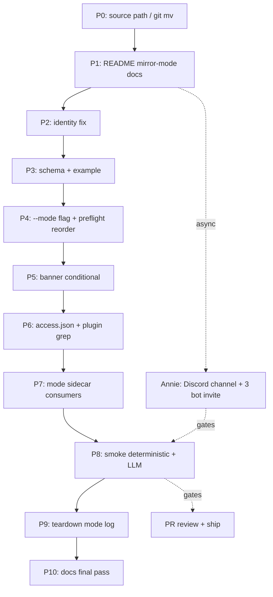

# Plan: QA Framework Mirror Channel Mode for Multi-Lead Cascade Testing

**Version**: v1.27.0
**Issue**: FLY-153
**Date**: 2026-05-12
**Source**: `worktrees/fly-152/doc/engineer/exploration/new/FLY-152-ship-options.md`, `/tmp/qa-fly-152-report.md`, Linear issue FLY-153
**Status**: codex-approved (Round 3, 2026-05-12) — implementation in progress
**Round 1 Codex review**: applied 11 items (slot identity gap, bot-origin smoke fixture, mirror-mode preflight ordering, allowBots semantics, banner substitution wording, Discord permission scope-down, botAppId terminology, mode sidecar load-bearing, CommDB side-effect assertion, source path fix, smoke deterministic/LLM split).
**Round 2 Codex review**: applied 4 items (smoke B1 user-origin can't be bash-automated → dropped; cross-worktree mutation → FLY-152 ship-options doc is reference only, no mutation; persist FLYWHEEL_PROJECTS to file for deterministic check; add per-bot REST probe to mirror channel before declaring deploy ready).
**Round 3 Codex review**: APPROVED with 3 polish items applied (deduped failure-artifacts paragraph, aligned 1/2 LLM pass threshold across plan + risk table, documented 1/2 rationale).

---

## 1. 背景 / Problem

FLY-152 ship 卡在 Layer 3 sandbox E2E 跑不了 multi-Lead cascade。qa-fly-152 在崩溃前定位了 FLY-96 4-slot framework 的两条物理限制：

1. **Per-slot channelId**: `~/.flywheel/test-slots.json` 给每个 slot 配一个独立的 `channelId` (`cos-test`, `product-lead-test`, `ops-lead-test`, `finance-lead-test`)。Prod `#geoforge3d-core` 的 *3 Lead 同 channel* topology 在 sandbox 不存在。
2. **TEST OVERRIDE banner** (`scripts/test-deploy.sh:385-407`): 显式告诉 LLM "Your ONLY channel: <#${CHAT_CHANNEL_ID}>. **Ignore** all other channel IDs in 'Channel Isolation Rules', 'Core Channel Routing', 'Discord Channel IDs'." 这跟 FLY-152 的 channel-scoped rule (rules 写在 `#geoforge3d-core` 的 routing 段) 冲突 — 即使 single-Lead E2E 也无法 attribute reply 行为是 FLY-152 rule 还是 generic per-Lead default.

**Round 1 评审还揭出第 3 条 framework 限制**:

3. **Slot identity 写死**: `scripts/test-deploy.sh:367-369` 把 `role: "lead"` 全部映射到 `${HOME}/Dev/GeoForge3D/.lead/product-lead/identity.md`。`~/.flywheel/test-slots.json` 已经有 `identitySource: "ops-lead"` 字段（slot 3 = ops），但脚本不读。Mirror mode 下 slot 3 会加载 Peter 的 identity，cascade 测试就变成 "Simba + Peter + Peter"，跟 prod "Simba + Peter + Oliver" 不一致 —— 必须先修这个再做 mirror。

本 plan 在现有 framework 基础上加 **mirror mode** — 让 cos / product / ops 三个 Lead 订阅同一个 sandbox shared channel (`#test-core-mirror`)，同时保留 4-slot legacy mode 作 fallback。**额外修 slot identity 写死的 bug**（小动作但 blocking）。

## 2. 目标

| Goal | 验证方式 |
|------|---------|
| G1: Slot 3 加载 Oliver identity (不是 Peter) | `cat /tmp/flywheel-test-slot-3/test-identity.md` 检查 production identity 段含 Oliver 关键字 |
| G2: 3 Leads 共订阅同一 channel，cascade 行为 deterministic 可观察 | smoke deterministic phase: 验证 3 Bridge 的 access.json + FLYWHEEL_PROJECTS chatChannel 全部 = mirror channel id；smoke LLM phase: bot-origin fixture 触发 cross-Lead delivery |
| G3: TEST OVERRIDE banner 在 mirror mode 不再 strip channel-scoped rules + 显式告诉 LLM "production `#geoforge3d-core` references map to mirror channel" | banner 渲染对比: legacy mode 含 "Ignore all other channel IDs"; mirror mode 含 "interpret #geoforge3d-core references as the mirror channel" |
| G4: 4-slot legacy mode 行为 0 regression | 跑 `scripts/test-deploy.sh 4` (legacy slot 4) + 现有 `scripts/qa-fly-60-driver.sh` HP scenario 验证 |
| G5: Mirror mode + legacy mode 不冲突运行 | 同 host 上 `--mode mirror 1` + `4` 并存不互相干扰 |
| G6: Mirror mode prevents accidental Runner E2E | `inject-linear-issue.sh` 对 mirror slot 默认拒绝（除非显式 override） |

## 3. 范围 / Out of Scope

**In scope** (本 PR):
- `scripts/test-deploy.sh` 改：（a）`--mode {slot,mirror}` flag；（b）使用 `identitySource` 字段而不是写死 `role→subdir` 映射；（c）TEST OVERRIDE banner 拆分；（d）mirror mode 写 `access.json.allowBots` + `groups[mirrorChannel]` + `mode` sidecar；（e）mirror mode preflight (mode parse 在 expensive preflight 之前)
- `scripts/test-slots.example.json` 加 `mirrorChannel` block + 完整 `identitySource` / `department` / `deptLabel` 示例
- `scripts/test-teardown.sh` log mirror mode（行为不变）
- `scripts/inject-linear-issue.sh` 加 mirror slot guard（默认 refuse；`--allow-mirror` 显式 override）
- `scripts/qa-fly-60-driver.sh` 加 assert `mode != mirror`（hard gate suite 是 Runner E2E）
- `packages/qa-framework/README.md` mirror mode 完整章节 + Annie Discord setup step-by-step
- `scripts/qa-fly-153-mirror-smoke.sh` 新 smoke：deterministic phase + LLM phase

**Out of scope**:
- 自动跑 FLY-152 14 条 Section A + Section B cascade（qa-fly-152 用新 framework 跑）
- Production `#geoforge3d-core` 改动
- Slot 4 finance mirror 模式（finance 没 prod 对应物）
- Mirror mode 下的 Runner E2E（FLY-115 real Runner 跟 mirror mode 正交，不混进来）
- FLY-127 多 dept 越权 spawn 测试改造

## 4. 设计

### 4.1 Slot identity 修正（new — Round 1 P0 fix）

**Bug**: `scripts/test-deploy.sh:367-369` 写死了:
```bash
case "$SLOT_ROLE" in
  cos)  SOURCE_SUBDIR="cos-lead" ;;
  lead) SOURCE_SUBDIR="product-lead" ;;
esac
```
这让所有 `role: "lead"` 的 slot 都加载 Peter，slot 3 (ops, identitySource=ops-lead) 的 prod identity 永远没被用。

**Fix**: 让脚本读 slot 的 `identitySource` 字段（`~/.flywheel/test-slots.json` 已经有），allowlist 限定 `cos-lead | product-lead | ops-lead` 三个值。`role` 字段保留只用作 `FLYWHEEL_LEAD_ROLE=cos|lead`（base rule 文件 cos vs department 区分）：

```bash
IDENTITY_SOURCE=$(jq -r ".slots[${SLOT_IDX}].identitySource // empty" "$SLOTS_FILE")
# Backward compat: legacy slots without identitySource fall back to role mapping
if [[ -z "$IDENTITY_SOURCE" ]]; then
  case "$SLOT_ROLE" in
    cos)  IDENTITY_SOURCE="cos-lead" ;;
    lead) IDENTITY_SOURCE="product-lead" ;;
    *) error ;;
  esac
fi
case "$IDENTITY_SOURCE" in
  cos-lead|product-lead|ops-lead) ;;
  *) echo "ERROR: identitySource '${IDENTITY_SOURCE}' must be cos-lead|product-lead|ops-lead" >&2; exit 1 ;;
esac
PROD_IDENTITY="${HOME}/Dev/GeoForge3D/.lead/${IDENTITY_SOURCE}/identity.md"
```

**Verification 路径**: 当前 `~/.flywheel/test-slots.json` slot 3 已有 `identitySource: "ops-lead"`，所以这个 fix 升级后 slot 3 立即加载 Oliver。Slot 4 (finance, `identitySource: "product-lead"`) 也维持现状。

**Backward compat**: 没 `identitySource` 字段的 slot 继续按 role 走，零 regression。

### 4.2 Mode flag — slot vs mirror

`test-slots.json` 加顶层 `mirrorChannel` block：

```json
{
  "slots": [...],
  "categoryId": "...",
  "guildId": "...",
  "mirrorChannel": {
    "channelId": "<shared-mirror-channel-id>",
    "channelName": "test-core-mirror",
    "_comment": "FLY-153: 3-Lead shared channel, mirrors prod #geoforge3d-core. Bot invite instructions in packages/qa-framework/README.md §Mirror mode."
  }
}
```

`test-deploy.sh` 加 `--mode {slot,mirror}` (default `slot`):

```bash
scripts/test-deploy.sh --mode mirror 1   # cos
scripts/test-deploy.sh --mode mirror 2   # product
scripts/test-deploy.sh --mode mirror 3   # ops
```

Mirror mode 下 `CHAT_CHANNEL_ID` 从 `mirrorChannel.channelId` 取，**override** slot 自己的 `channelId`。

**Mode validation**:
- Mirror mode 只接受 slot ∈ {1, 2, 3}。请求 slot 4 / >4 → fail-fast `ERROR: mirror mode supports slots 1-3 (cos/product/ops); slot ${N} has no prod analog.`
- `mirrorChannel.channelId` 缺失 → fail-fast `ERROR: --mode mirror requires mirrorChannel.channelId in ${SLOTS_FILE}.`
- `mirrorChannel.channelId == "<placeholder>"` 也 fail-fast（防止 example 直接拷过去）。
- **Auto-allocation 限制 (Round 1 #3 fix)**: mirror mode 下省略 slot 时，auto-claim loop 限定 `seq 1 3`（不要意外占用 slot 4）。

### 4.3 Preflight ordering (Round 1 #3 fix)

当前 `test-deploy.sh` 顺序是 preflight (gh / pnpm rebuild) → claim slot → validation。Mirror mode 下，**mode parse + mirror 字段验证必须早于 preflight**，否则跑 60s preflight 后才发现 slot 4 不允许是浪费 + 占用其它 slot 的 preflight lock。

新顺序：
1. Argparse `--mode` + `--from-branch` + slot number
2. Mirror mode 验证：`mirrorChannel.channelId` 存在、slot ∈ {1,2,3}（如果指定）
3. preflight (gh/pnpm) — 不变
4. claim slot — 不变
5. slot config validation — 不变

### 4.4 TEST OVERRIDE banner — conditional rendering (Round 1 #5 fix)

现 banner 包含两层 override (lines 385-429):
- **Identity override** (bot ID / leadId scope-check) — mirror mode **保留**
- **Channel scope override** ("Your ONLY channel" + "Ignore all other channel IDs in Channel Isolation Rules / Core Channel Routing / Discord Channel IDs") — mirror mode **替换为 mirror-specific block**

Mirror-mode replacement block (Round 1 #5 — 显式 production-to-mirror 替换语言):

```
## CHANNEL CONTEXT — MIRROR MODE (highest priority)

This slot subscribes to test guild's shared mirror channel `<#${MIRROR_CHANNEL_ID}>`,
which simulates production `#geoforge3d-core` topology (3 Leads share one channel).

**Production → Mirror substitution**:
- Every reference to `#geoforge3d-core` (channel ID `1487340532610109520`) in the
  production identity below MUST be interpreted as `<#${MIRROR_CHANNEL_ID}>` for
  this test slot.
- Channel-scoped rules anchored on `#geoforge3d-core` (e.g. "Core Channel Routing
  Rules", FLY-152 Shared Channel Reply Discipline) DO apply, but against the
  mirror channel.
- All OTHER production channel IDs ("Channel Isolation Rules" enumerated channels
  not equal to `#geoforge3d-core`) remain production-only — you MUST NOT post to
  them.
- **Your ONLY channel** for any outbound message: `<#${MIRROR_CHANNEL_ID}>`.
- If a received message's `chat_id` is not `${MIRROR_CHANNEL_ID}`, silently ignore
  it (no reply, no action).
```

Identity override block (bot ID / leadId scope-check) 保持不变。Production identity append (line 430) 不动 — 仍然 `cat "$PROD_IDENTITY" >> "${SLOT_DIR}/test-identity.md"`。

Implementation: 把当前 heredoc 拆成 3 段（pre-channel + channel-block + post-channel），channel-block 根据 `MODE` 选 legacy 或 mirror 版本。Production identity append 保持原行。

### 4.5 access.json — bot-to-bot delivery (Round 1 #4 fix — 改正 plan 表述)

**Discord plugin gate flow (verified from `~/.claude/plugins/cache/claude-plugins-official/discord/0.0.4/server.ts`)**:
1. `messageCreate` handler 收到消息
2. **Pre-gate bot filter** (line 856-858): `if (msg.author.bot && !access.allowBots?.includes(msg.author.id)) return` — drop bot-authored messages unless allowlisted
3. `gate()` (line 280+): channel allowlist (`access.groups[channelId]`) + `requireMention` + user `allowFrom`

Mirror mode 下需要：
- `access.groups[mirrorChannel] = {requireMention: false, allowFrom: []}` — 让该 channel 的 inbound 都进 (user-origin from Annie)
- `access.allowBots = [<self-bot-id>, <other-mirror-slot-1-bot-id>, <other-mirror-slot-2-bot-id>]` — 让其它 mirror Lead 的 bot message (Simba's triage report → Peter / Oliver) 不被 pre-gate filter drop

Legacy mode 不变（只有 self bot ID）。

**Deploy-time checks (Round 1 #4 + Round 2 #4)**:

1. **Plugin grep**: 启动前 grep 缓存的 Discord plugin server 文件确认 `allowBots` 字段被消费（防 stale plugin cache）：

```bash
PLUGIN_PATH="${HOME}/.claude/plugins/cache/claude-plugins-official/discord"
LATEST_PLUGIN=$(ls -dt "$PLUGIN_PATH"/*/ | head -1)
grep -q "access.allowBots" "${LATEST_PLUGIN}/server.ts" \
  || fail_preflight "Discord plugin at ${LATEST_PLUGIN} does not consume access.allowBots — mirror mode cascade will silently fail. Run: claude plugin update discord@claude-plugins-official"
```

2. **Per-bot mirror channel REST probe (Round 2 #4)**: mirror mode 下，Bridge 启动前用本 slot 的 bot token 对 mirror channel 做 `GET /channels/{id}` REST 调用，验证 (a) channel 存在 (b) bot 有 View Channel 权限 (c) bot 是 channel member。失败时 fail-fast 并提示 README 的 invite 步骤：

```bash
PROBE=$(curl -sf -H "Authorization: Bot ${TEST_BOT_TOKEN}" \
  "https://discord.com/api/v10/channels/${MIRROR_CHANNEL_ID}" \
  -o /dev/null -w "%{http_code}" || echo "000")
case "$PROBE" in
  200) log "Mirror channel probe OK for ${AGENT_ID}" ;;
  403|404) fail_preflight "Mirror channel ${MIRROR_CHANNEL_ID} inaccessible to bot ${AGENT_ID} (HTTP ${PROBE}). See packages/qa-framework/README.md §Mirror mode — invite this bot with View Channel + Send Messages + Read Message History." ;;
  *) fail_preflight "Mirror channel probe network error (HTTP ${PROBE}) for bot ${AGENT_ID}" ;;
esac
```

`Send Messages` permission 在 GET 阶段查不到；smoke Phase A 会先用一个 ephemeral test message (post + immediate delete) 来主动验。

### 4.6 FLYWHEEL_PROJECTS.leads[].chatChannel + 持久化 (Round 2 #3)

Mirror mode 下 `$chatChannel = MIRROR_CHANNEL_ID`，3 个 Bridge 各自 `loadProjects()` 看到自己的 `chatChannel = mirror channel`。3 个 Bridge 都监听这一个 channel，Discord 服务器端 broadcast，无 race（prod `#geoforge3d-core` 已经验证）。

`ProjectConfig.loadProjects()` (lines 80-260) 不强制 channel 唯一性，每个 Bridge 进程独立 load — 跨 Bridge collision 在框架层不存在。

**Persist FLYWHEEL_PROJECTS to file (Round 2 #3 fix)**: 当前 `test-deploy.sh` 把 `FLYWHEEL_PROJECTS` 通过 process env 传给 `run-bridge.ts`，不落盘。Smoke Phase A 想验 `chatChannel` 配置只能 scrape live process env (脆 + 跨平台不一致)。改为 deploy 时显式写 `${SLOT_DIR}/flywheel-projects.json`：

```bash
echo "$FLYWHEEL_PROJECTS" > "${SLOT_DIR}/flywheel-projects.json"
```

并在 deploy JSON output 加 `"flywheelProjectsFile": "${SLOT_DIR}/flywheel-projects.json"`。Smoke 直接 `jq` 这个文件 — deterministic check 落实。Bridge 仍然按原路径走 env (双写) — 不改 Bridge runtime。

**FLY-91 Chat Thread caveat**: chat-thread 创建 (`bridge/bootstrap-generator.ts:260`, `DirectEventSink.ts:188`) dedupe key 是 `chatChannel + issueId`。3 Bridge 跑同 issue 会创 3 个独立 thread (各自 StateStore)。Out of scope §3 已 disclaimer，README 加 caveat。

### 4.7 Smoke test — deterministic + LLM split (Round 1 #2 + #11, Round 2 #1 + #3 fix)

`scripts/qa-fly-153-mirror-smoke.sh` 是纯 bash 脚本，**只用 Discord REST API + bot token**（不依赖 Claude MCP 工具）。分两 phase。

**Round 2 #1 explicit decision**: B1 (user-origin Annie message) 不能在 bash 里 automate (MCP 是 agent-only)，**dropped from automated smoke**。B2 + B3 (bot-origin) 才是 framework 的真正 verdict — `allowBots` 路径只能用 bot token 触发。User-origin 行为是 FLY-152 的 LLM rule scope，不是 framework smoke 的 scope，留给 qa-fly-152 在新 framework 上跑 14 条 fixture 时自然覆盖。

#### Phase A — Deterministic preflight (no retries)
1. `~/.flywheel/test-slots.json` 含 `mirrorChannel.channelId` 且非 `<placeholder>`
2. Discord plugin cache `server.ts` 含 `access.allowBots`（防 stale plugin）
3. 跑 `test-deploy.sh --mode mirror 1`、`2`、`3`（顺序，wait Bridge ready）。每个 deploy 内置 §4.5 REST probe — 失败的话 deploy 自己 fail-fast。
4. 检查 3 个 slot 的 access.json:
   - `groups[<mirror-channel-id>]` 存在
   - `allowBots` 含 3 个 bot user ID（自己 + 其它两个 mirror slot）
5. 检查 3 个 slot 的 `${SLOT_DIR}/flywheel-projects.json` (Round 2 #3 — `test-deploy.sh` 现在显式落地这个文件而不是 process env): `leads[0].chatChannel == <mirror-channel-id>`
6. 检查 3 个 slot 的 `test-identity.md`:
   - 不含 "Ignore all other channel IDs" 字符串
   - 含 "## CHANNEL CONTEXT — MIRROR MODE"
   - Slot 3 production identity 段含 Oliver 关键字（验证 §4.1 fix）
7. 用每个 slot 的 bot token 跑一次 ephemeral probe — POST 一条 `__qa-fly-153-probe-{slot}__` message 到 mirror channel，5s 后用 `DELETE /channels/{id}/messages/{msg-id}` 清理。如果 POST 200 失败 → fail-fast (Send Messages 权限缺失)。

任何 Phase A 检查失败 → exit 非 0 + 自动 dump artifacts（详见 Failure artifacts 段）。

#### Phase B — LLM behavior (bot-origin only, 1 retry per fixture)

**Fixture B2 — Bot-origin cross-Lead delivery to Peter (validates `allowBots` path, Round 1 #2 critical)**:
1. 从 slot 1 (Simba) bot token 用 Discord REST API POST `/channels/${MIRROR_CHANNEL_ID}/messages` body `{"content":"<@${slot2.botAppId}> 看下 FLY-1，按 reply discipline 回","allowed_mentions":{"users":["${slot2.botAppId}"]}}`
2. 等 60s
3. `GET /channels/${MIRROR_CHANNEL_ID}/messages?limit=20` (用任一 bot token 即可)
4. 断言: 至少 1 条 author.id == slot2.botAppId 的 reply 在窗口内；author.id ∈ {slot1, slot3} 的 reply 不存在
5. **Side-effect assertion (Round 1 #9 fix)**: grep 3 slot 的 bridge.log:
   - 没有任何 slot log `/api/runs/start` 调用
   - 没有任何 slot log chat-thread create (DirectEventSink `ensureChatThread` log)
   - sqlite3 check slot 1 / slot 3 的 StateStore (`${SLOT_DIR}/teamlead.db`) — `SELECT count(*) FROM sessions` 等于 deploy 时的 baseline (=0)

**Fixture B3 — 同 B2 但 mention slot 3 (Oliver)** — 验证 Oliver identity + allowlist 对称性。同样的 side-effect assertion。

LLM phase 每个 fixture 1 retry (网络 / message lag tolerance)。Deterministic 全 pass + LLM ≥ 1/2 fixture pass → smoke success (single fixture pass = mirror transport works；2/2 = 双向对称都好)。0/2 LLM pass 三次 → revert P5 banner 并重新评。

#### Failure artifacts
失败时自动 dump 到 `/tmp/qa-fly-153-mirror-smoke-${TIMESTAMP}/`:
- 3 slot 的 `test-identity.md`
- 3 slot 的 `access.json`
- 3 slot 的 `flywheel-projects.json`
- 3 slot 的 `bridge.log` 最后 200 行
- 最近 30 条 mirror channel Discord message JSON dump

#### Manual user-origin sanity (out of automated smoke)
README 加一段 manual smoke instruction — Annie 自己在 Discord 发 `"Peter, 看下 FLY-1"` 后用 Discord 客户端肉眼看 reply set。这是 informal sanity check，不算 framework verdict，不阻塞 PR。Framework verdict 锚定 Phase A + B2/B3。

### 4.8 Mode sidecar — 真正 load-bearing (Round 1 #8 fix)

Slot lock dir (`/tmp/flywheel-test-slot-N.lock/`) 加 `mode` 文件，内容 `slot` 或 `mirror`。

**Consumers** (确保不空有):
- `inject-linear-issue.sh`: 启动前读 `mode` 文件，若 `mode=mirror` 且未带 `--allow-mirror` flag → 拒绝 + 打印 `ERROR: slot ${N} is in mirror mode (Runner E2E intentionally out of scope for FLY-153). Pass --allow-mirror to override.`
- `scripts/qa-fly-60-driver.sh`: 启动前 assert `mode != mirror`（hard-gate suite 是 Runner E2E，跟 mirror mode 不兼容）。
- `test-teardown.sh`: 读 `mode` 只为 log（`[test-teardown] tearing down slot ${N} (mode=${mode})`）

不为 sidecar 写代码就不加 sidecar — 这次它有真正用户。

### 4.9 命令对外接口

```bash
# Legacy mode (default, 0 regression)
scripts/test-deploy.sh 1
scripts/test-deploy.sh --from-branch <br> 2

# Mirror mode (new) — only slots 1-3 allowed
scripts/test-deploy.sh --mode mirror 1
scripts/test-deploy.sh --mode mirror 2
scripts/test-deploy.sh --mode mirror 3

# Inject Linear issue — refuses mirror slot by default
scripts/inject-linear-issue.sh 1 FLY-1     # OK if slot 1 in slot mode; refused if mirror
scripts/inject-linear-issue.sh 1 FLY-1 --allow-mirror   # explicit override

# Teardown — mode-agnostic
scripts/test-teardown.sh 1
```

## 5. Discord guild 设置 (Annie 跑一次) — Round 1 #6 scope-down

新增 channel:

| 字段 | 值 |
|------|---|
| Channel name | `test-core-mirror` |
| Type | Text channel |
| Guild | `1485787271192907816` (test guild) |
| Category | `1493080958889496760` (QA Testing) |
| Members | Annie + 3 bots (`flywheel-test-1` / `-2` / `-3`) |
| Per-bot permissions | **View Channel + Send Messages + Read Message History** |
| Optional | Mention Everyone — only if future test 用 `@everyone`/`@here`/role ping。本 PR 用 `<@bot-user-id>` direct mention，不需要。 |

**Bot user ID terminology (Round 1 #7 fix)**: README + script comments 把 `botAppId` 注释成 "bot user ID (equals Application ID for these single-bot apps; observed as `msg.author.id`)" — 不再混叫 "bot ID" 含糊术语。Smoke phase A 还会 `echo` 三个 bot user ID 出来，方便 Annie 对照。

README 的 step-by-step (Discord UI 路径 + 截图描述) 写在 `packages/qa-framework/README.md` 新增的 `## Mirror Mode (FLY-153)` 章节。

## 6. 实现 phases (commit 粒度)

| Phase | 改动 | 验证 |
|-------|------|-----|
| P0 — Plan move to inprogress | `git mv` plan to inprogress (Round 1 #10 — Source field already cites sibling worktree as historical reference; FLY-153 PR doesn't mutate FLY-152 worktree) | path 可访问 |
| P1 — README mirror-mode 章节 | `packages/qa-framework/README.md` 加 mirror mode 完整文档（Annie Discord setup 指引、命令表、caveats、manual user-origin sanity instruction）| markdown render |
| P2 — Slot identity fix (Round 1 #1) | `test-deploy.sh` 用 `identitySource` 字段；backward-compat fallback 保留 | `test-deploy.sh 3` 后 identity.md 含 Oliver |
| P3 — Schema + example | `scripts/test-slots.example.json` 加 `mirrorChannel` block + `identitySource` / `department` / `deptLabel` 完整示例 | `jq -e '.mirrorChannel.channelId'` |
| P4 — Mode flag + preflight reorder + persist FLYWHEEL_PROJECTS (Round 2 #3) | `test-deploy.sh` 加 `--mode`，move mode parse 到 preflight 之前；mirror slot validation；auto-allocation 限定 1-3；写 `${SLOT_DIR}/flywheel-projects.json` + 加 deploy JSON 字段 | `--mode mirror 4` fail-fast；`flywheel-projects.json` 落盘 |
| P5 — TEST OVERRIDE banner conditional | banner 拆 3 段，mirror block 用 §4.4 wording | `cat test-identity.md` mirror mode 含 "MIRROR MODE" 不含 "Ignore all other" |
| P6 — access.json multi-bot allowBots + plugin grep + REST probe (Round 2 #4) | mirror mode 写 3-bot allowBots；deploy preflight grep plugin server.ts 验 `access.allowBots`；mirror mode 加 per-bot `GET /channels/{id}` REST probe (View Channel verification) | `cat access.json` 3 bot ID；fail 时打印 invite instructions |
| P7 — Mode sidecar load-bearing | 写 `mode` 文件；`inject-linear-issue.sh` + `qa-fly-60-driver.sh` 读 + 拒绝 mirror | `inject-linear-issue.sh 1 FLY-1` 在 mirror slot fail |
| P8 — Smoke test deterministic + LLM (Round 2 #1 — bot-origin only) | `scripts/qa-fly-153-mirror-smoke.sh` Phase A 含 ephemeral POST/DELETE 探活；Phase B 只跑 B2/B3 bot-origin；failure artifacts dump | `bash qa-fly-153-mirror-smoke.sh` exit 0 |
| P9 — Teardown mode-aware logging | `test-teardown.sh` log mode | `test-teardown.sh 1` 日志含 `mode=mirror` |
| P10 — Final docs | README 收尾 + plan front-matter 同步 | render |

每 phase 1 commit。P8 smoke test 是 review hard gate。

## 7. Test Plan

### Layer 1 — Lint / static
- `bash -n scripts/test-deploy.sh scripts/test-teardown.sh scripts/inject-linear-issue.sh scripts/qa-fly-60-driver.sh scripts/qa-fly-153-mirror-smoke.sh`
- `jq -e '.mirrorChannel.channelId' scripts/test-slots.example.json`
- `pnpm -w lint` + `pnpm -w typecheck` (无 TS 改动应 0 影响)

### Layer 2 — Smoke test (mirror mode) — §4.7

### Layer 3 — Legacy mode regression (G4 + G5 + G6 + identity fix verify)
1. `scripts/test-deploy.sh 4` (legacy slot 4 — finance) — 必须照常起来；identity.md production 段是 Peter (因为 slot 4 identitySource=product-lead)
2. `scripts/test-deploy.sh 3` (legacy slot 3 — ops) — 现在 identity.md 应该是 Oliver（fix 直接生效）
3. `scripts/test-deploy.sh --mode mirror 1` 同时跑不冲突
4. `scripts/inject-linear-issue.sh 1 FLY-1` 在 mirror slot 1 失败（无 `--allow-mirror`）；slot 4 OK
5. teardown 全部干净退出
6. （可选）跑 `scripts/qa-fly-60-driver.sh --slot 4 --scenario hp` 验证 hard-gate suite 在 legacy mode 仍 pass

### Layer 4 — Skip
不跑 FLY-152 14 条 cascade（归 qa-fly-152）。

## 8. Rollback / Failure modes

- **Mirror channel 删除 / 权限丢**: §4.5 per-bot REST probe 在 deploy 阶段 fail-fast `ERROR: Mirror channel ... inaccessible to bot ...`. Smoke Phase A 的 ephemeral POST/DELETE 还会进一步 catch Send Messages 缺失。Legacy mode 0 影响。
- **Smoke test LLM phase flake**: 1 retry per fixture，1/2 pass 算 success；连续 3 次 0/2 → revert P5 (banner)。
- **Slot identity fix regression**: P2 改动 backward-compat — 没 `identitySource` 字段的 slot 走 role fallback。最坏 revert P2，slot 3 退回 Peter（mirror 失效但 legacy 仍跑）。
- **`identitySource` allowlist 漏网值**: 加 default reject — `case` 列出 cos-lead/product-lead/ops-lead，其它 fail-fast。
- **Mode sidecar consumer 漏掉**: P7 显式覆盖 inject + qa-fly-60-driver；其它脚本启动 mirror slot Runner 不在 P7 验证内 → README 列 known-incompatible scripts，user 自己注意。
- **Plugin server.ts grep miss (e.g. minified / repacked)**: P6 grep fail-fast 提示 `claude plugin update`。

## 9. Risk

| Risk | 严重度 | Mitigation |
|------|-------|------------|
| Banner 改坏让 mirror Lead 完全不 reply | M | P8 smoke 是 hard gate；deterministic phase 验 banner content 后才进 LLM phase |
| 3 Bridge 监听同 channel 出现 race / dup chat-thread | L | smoke 不走 chat-thread；prod `#geoforge3d-core` 3 Lead 已跑数月无 race |
| `~/.flywheel/test-slots.json` 升级摩擦 | L | `mirrorChannel` 顶层 optional；`identitySource` 已存在用户配置；fallback 路径覆盖 missing field |
| Annie Discord 手动 invite 步骤错 | L | README 列具体 channel name / category ID / per-bot perm bits / bot user ID 对照 |
| Smoke LLM probabilistic flake | M | Deterministic phase 锁住 wiring；LLM phase 1 retry per fixture，**1/2** pass 算 success（框架 smoke 只需要证 mirror transport 通一次；2/2 是 nice-to-have 双向对称。Reply-discipline rule 完整覆盖不在框架 smoke scope，留给 qa-fly-152 跑 14 条 fixture） |
| Pre-gate `allowBots` 因 plugin upgrade 删字段 | L | P6 deploy preflight grep plugin server.ts；fail-fast 提示 update plugin |
| 用户在 mirror slot 跑 Runner 后炸 | M | P7 mode sidecar + `inject-linear-issue.sh` guard + qa driver assert，多层 + README warning |

## 10. Files touched

```
scripts/test-deploy.sh                                            # mode flag + identity fix + banner + access.json + sidecar + preflight reorder + REST probe + persist projects.json
scripts/test-teardown.sh                                          # mode-aware log
scripts/inject-linear-issue.sh                                    # mirror slot guard
scripts/qa-fly-60-driver.sh                                       # assert mode != mirror
scripts/test-slots.example.json                                   # mirrorChannel + identitySource 示例
scripts/qa-fly-153-mirror-smoke.sh                                # NEW (Phase A deterministic + Phase B bot-origin)
packages/qa-framework/README.md                                   # mirror mode 章节 (Annie setup, manual user-origin sanity)
doc/engineer/plan/draft/v1.27.0-FLY-153-framework-mirror-channel.md  # this plan (move to inprogress on /implement)
```

完全不动 TypeScript / runtime code（Bridge / Lead / ProjectConfig / Discord plugin source）。**Cross-worktree mutation 移除 (Round 2 #2)**: FLY-152 ship-options doc 在 `worktrees/fly-152/` 是 sibling worktree, FLY-153 PR 不动它；本 plan Source field 已记录为 historical reference。如果将来想给 FLY-152 doc 加注脚 "Option B 已实施"，作为单独 doc PR 处理。

## 11. Open questions

无技术问题。Annie 唯一手动动作是 Phase 1 Discord channel + bot invite — README 给完整 instructions，Worker 在 Phase 1 commit 后再让 Annie 跑（不阻塞 P2-P10 的 commit / review）。

## 12. Sequencing



P1 README commit 后 Annie 跑 Discord setup（async，不阻塞 P2-P7 dev）。P8 smoke 必须等 Annie setup 完才能跑通。

---

**Status flow**:
- `draft/` → `/codex-design-review` 通过后 `git mv` → `new/`
- `new/` → `/implement` 开始时 `git mv` → `inprogress/`
- `inprogress/` → PR merged 后 `git mv` → `archive/`
