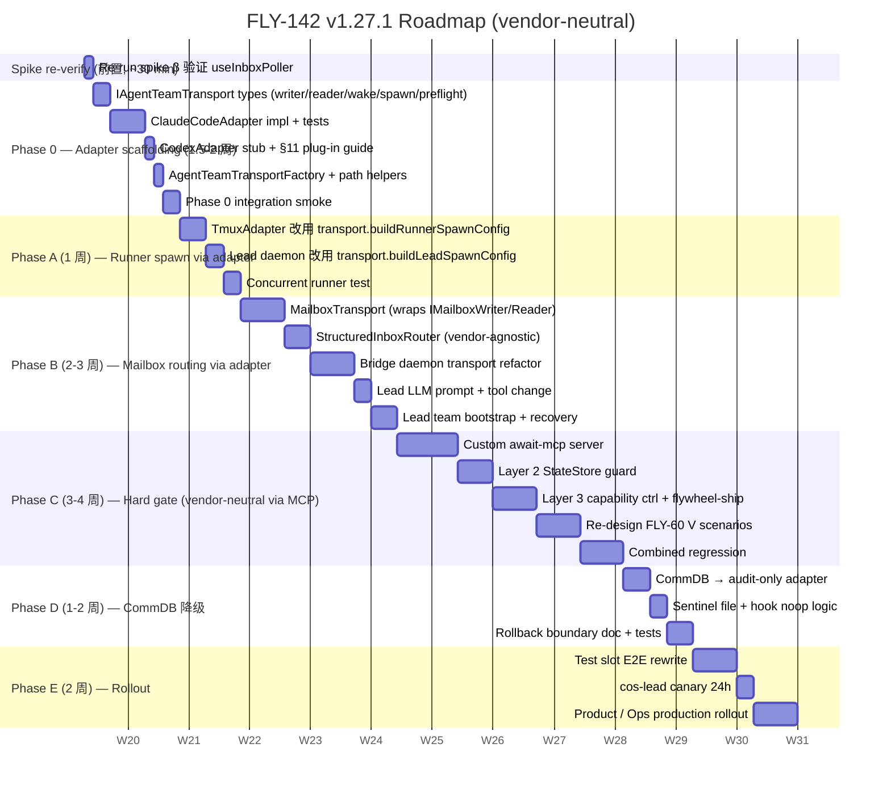
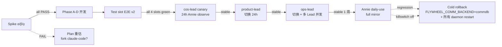
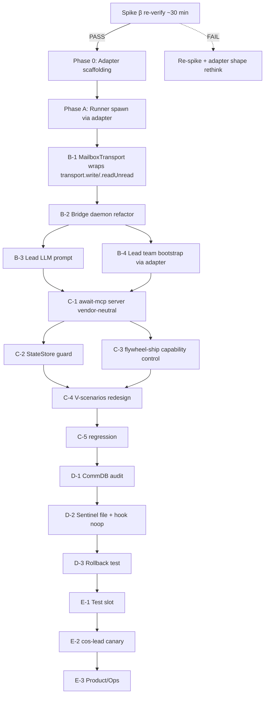

# Plan: Lead↔Runner 通信切 Agent Team 镜像 + Vendor-Neutral Transport（Option 6c full mirror, vendor-neutral revision）

**Version**: v1.27.1 (vendor-neutral revision of v1.27.0)
**Issue**: FLY-142 (Runner doesn't wake on Lead respond)
**Date**: 2026-05-09 (revised), originally 2026-05-06
**Source**:
- `doc/engineer/exploration/new/FLY-142-runner-wake-bug-audit.md`
- `doc/engineer/exploration/new/FLY-142-option4-detail.md`
- `doc/engineer/implementation/v1.27.0-FLY-142-spike-results.md` (spike α/β/γ)
**Status**: codex-approved (v1.27.1 — Codex Round 5 APPROVED 2026-05-09; 5 rounds: R1=11→R2=7→R3=5→R4=3→R5 APPROVED w/ 3 low-priority cleanup notes folded into PR 1.1)

---

## 0. Annie 决策记录

> "我希望我们的 solution 要和 claude-code agent team 是一样的。" — 2026-04-27
>
> "我们一定不能绑定在 Claude Code 上面。之后想用 Codex 之类其他 agent 也必须能 work。" — 2026-05-09

- ✅ 选 Option 6c full mirror（Lead↔Runner 走 mailbox + receiver-side polling）
- ✅ 接受 6-9 周 → **修订为 10-14 周**（Codex round 1 严审）
- ✅ **2026-05-09 追加约束：vendor-neutral transport adapter 必须先建，所有 wake/send 走 adapter，不直 hook claude-code 内部 API**
- ❌ <u>不</u> 走 Option 1 hook quick fix
- ❌ <u>不</u> 把 claude-code Agent Team 当唯一 backend — Codex / 其他 vendor 必须能 plug-in
- 后果：Runner 现 ask/respond 路径仍 broken **until 6c ship**（10-14 周窗口；vendor-neutral 改造预估再加 1-2 周，详 §3）。窗口期间 incident 用 `tmux send-keys` 救急

## 1. 目标

把 Lead↔Runner 通信从 "CommDB SQLite + PostToolUse hook + flywheel-comm CLI subprocess" 整套切到 "**vendor-neutral mailbox + 可插拔 wake transport**"。当前默认 backend = claude-code Agent Team（mailbox file + SendMessageTool builtin + useInboxPoller 1s receiver-side polling），但 wake/send 调用全部走 **AgentTeamTransport adapter**，不直接 import claude-code 内部 API。

**1:1 镜像目标 + vendor neutrality**：
- Lead 在自己 process 内通过 `transport.write()` (IMailboxWriter) 写 mailbox（不 spawn subprocess）— ClaudeCodeAdapter 内部用 `ClaudeMailboxCodec` 写 stock-compatible TeammateMessage[]，CodexAdapter (stub) 用自己 codec
- Runner 是 Agent Team teammate（带 vendor-specific identity flags 由 `transport.buildRunnerSpawnConfig()` (IAgentSpawnTransport) 提供），由 adapter capability 决定是 vendor builtin polling (claude-code) 还是外部 watcher (Codex 用 IReceiverWakeTransport.createReceiver)
- Lead↔Runner DM、permission relay、shutdown 都走 adapter
- Hard gate (brainstorm / approve_to_ship) 用 **custom MCP tool** + **外部 enforcement**（不依赖 LLM 自觉，且 MCP 是跨 vendor 标准）
- **mailbox JSON schema、目录布局、await-mcp tool spec、flywheel-ship CLI 都是 vendor-neutral contract**（pin 在 §2.0）

**非目标**：
- Cross-host (mailbox file 同 CommDB 都是单机存储)
- Memory / pgvector 改造
- Discord plugin 通信改造
- Lead↔Lead 通信（已走 SendMessage tool）
- **CodexAdapter 完整实现** — 本 plan 只提供接口 stub + plug-in guide（§11），让未来切 Codex 时 ~1-2 周可完成；不在本 sprint 实现

## 2. 核心 Contract（必须 nail down 才能进 Phase 0/A）

> Codex round 1 finding #12: 缺 contract section 导致 plan 像 intent。这里 nail。
> **2026-05-09 vendor-neutral revision**: 加 §2.0 把 transport adapter 接口 + vendor-neutral mailbox schema 拉到最前，所有后续 §2.x 实现细节都只是 ClaudeCodeAdapter 的 vendor-specific 实现。

### 2.0 Vendor Neutrality / Transport Adapter 层（**2026-05-09 新增**）

#### 2.0.1 设计动机

Annie 5/9 决策：**不绑定在 Claude Code 上面**。Plan v1.27.0 整篇直接 hook claude-code 内部 (`useInboxPoller`、`SendMessageTool`、`isAgentSwarmsEnabled`、GrowthBook killswitch、`~/.claude/teams/<lead>/inboxes/` 路径)，未来要切 Codex 或其他 vendor 必须 rewrite 大半个 codebase。

Vendor-neutral revision 目标：**所有 wake/send 路径 imports 只从 adapter package 拿，不直接 import claude-code 内部模块**。换 vendor = 换 adapter 实例 + 加 `CodexAdapter` 实现，不动 Bridge / StateStore / await-mcp / flywheel-ship / hooks。

#### 2.0.2 中立 contract（不变层 — pin 在 flywheel）

下列 contract 是 flywheel 自己定义的，不依赖任何 vendor 实现：

| Contract | 描述 | Spec 位置 |
|----------|------|-----------|
| **Mailbox semantic payload** | `MailboxPayload` 字段：`from`, `to`, `content`, `metadata?` (含 caller-provided `flywheelId` idempotency key)。Adapter 各自负责 wire envelope。 | §2.0.6 |
| **Mailbox directory layout** | `<TEAMS_DIR>/<lead-name>/inboxes/<agent>.json`；`TEAMS_DIR` 是 env-configurable | §2.0.6 |
| **Structured-inbox layout** | requests: `<FLYWHEEL_STATE>/inbox-structured/<lead-name>/requests/{ts}-{request_id}.json`； responses: `<FLYWHEEL_STATE>/inbox-structured/<runner-name>/responses/{request_id}.json`（独立目录，不被任何 vendor poller 读） | §2.6（已存在）|
| **await-mcp tool spec** | MCP 标准 tool def，跨 vendor 都能 load | §2.4（已存在）|
| **flywheel-ship CLI** | 受控 ship 入口，capability control 唯一通道 | §2.4（已存在）|
| **Approval token format** | Base64-encoded HMAC + nonce + expiry + action_class | §2.4（已存在）|
| **CommDB audit schema** | append-only 写 audit log（rollback path） | §2.5（已存在）|

#### 2.0.3 Adapter 接口（**Codex r1 medium #7/#8 修订**: 拆细 + 去 vendor leak）

新 package: `packages/agent-team-transport/`（命名跟现 `IAdapter` runner-spawn 对齐：`I*Transport` 表 IPC 层）。

**接口拆三层** — 不再 conflate read/write/wake 到一个 interface：

```typescript
// packages/agent-team-transport/src/types.ts (新增)

// ====== Sender side (Lead-only writes) ======

export interface IMailboxWriter {
  /** Write a message; MUST be atomic, MUST throw on failure (no silent swallow). */
  write(args: { leadName: string; recipient: string; payload: MailboxPayload }): Promise<MailboxWriteResult>;

  /** Read-after-write verify — throws MailboxWriteError on mismatch. */
  verifyLastWrite(args: { leadName: string; recipient: string; expected: MailboxPayload }): Promise<void>;
}

// ====== Receiver-aware reads (await-mcp / Bridge route) ======

export interface IMailboxReader {
  /** Read all unread messages for given agent inbox. */
  readUnread(args: { leadName: string; agentName: string }): Promise<MailboxMessage[]>;

  /** Mark messages consumed (vendor-specific: claude-code flips `read`; flywheel sidecar tracks `delivered_at`). */
  ack(args: { leadName: string; agentName: string; messageIds: string[] }): Promise<void>;

  /** Dedupe key derivation — vendor decides what's stable (claude-code: `from+text+timestamp`; codex: own scheme). */
  dedupeKey(message: MailboxMessage): string;
}

// ====== Receiver wake mechanism (vendor-specific) ======

export interface IReceiverWakeTransport {
  /**
   * For vendors WITH a builtin in-binary poller, return null (claude-code).
   * For vendors WITHOUT (codex), return a watcher with explicit lifecycle:
   *   - start() : begin monitoring + dedupe
   *   - stop()  : graceful shutdown
   *   - health(): liveness for Bridge probe
   */
  createReceiver(ctx: RunnerSpawnContext): IMailboxWatcher | null;
}

export interface IMailboxWatcher {
  start(): Promise<void>;
  stop(): Promise<void>;
  health(): Promise<{ ok: boolean; lastEventTs?: number; pendingCount?: number }>;
  /** Hook for telemetry — fired when a message dedup-passes and is sent to receiver process. */
  onDelivered?: (msg: MailboxMessage) => void;
}

// ====== Spawn config (vendor-opaque output) ======

export interface IAgentSpawnTransport {
  /** Compose Runner spawn config — caller merges into TmuxAdapter invocation. */
  buildRunnerSpawnConfig(ctx: RunnerSpawnContext): RunnerSpawnConfig;
  /** Compose Lead daemon spawn config — caller merges into claude-lead.sh launcher (via shell helper, see §2.0.4-bis). */
  buildLeadSpawnConfig(ctx: LeadSpawnContext): LeadSpawnConfig;
}

export interface RunnerSpawnConfig {
  /** Vendor-specific CLI args (don't introspect — opaque to caller). */
  args: string[];
  /** Env vars to set in spawn shell. */
  env: Record<string, string>;
}

// ====== Health / preflight ======

export interface ITransportPreflight {
  preflight(opts: { logger: ILogger }): Promise<PreflightResult>;
}

export interface PreflightResult {
  ok: boolean;
  /** Vendor-specific risk signals — Bridge surfaces in alert, doesn't auto-decide. */
  availabilitySignals: AvailabilitySignal[];
  message?: string;
}

export interface AvailabilitySignal {
  kind: "ok" | "warn" | "error";
  /** Free-text vendor-specific signal name (e.g. "claude-code:tengu_amber_flint=stale-cached", "codex:watcher-pid-down") */
  name: string;
  detail?: string;
}

// ====== Adapter aggregate ======

/**
 * One adapter instance composes all transport facets for one vendor.
 * AgentTeamTransportFactory returns this based on FLYWHEEL_AGENT_BACKEND env.
 */
export interface IAgentTeamTransport
  extends IMailboxWriter,
    IMailboxReader,
    IReceiverWakeTransport,
    IAgentSpawnTransport,
    ITransportPreflight {
  vendorId(): "claude-code" | "codex" | string;
  capabilities(): TransportCapabilities;
  /** Filesystem helper for path resolution — used by Bridge for structured-inbox/sentinel coexistence. */
  getInboxPath(leadName: string, agentName: string): string;
  getStateDir(): string;
}

// ====== Capabilities (vendor-leak-free — Codex r1 medium #7) ======

export interface TransportCapabilities {
  /** Receiver wake style — drives whether IReceiverWakeTransport.createReceiver returns null. */
  wakeMode: "builtin-receiver" | "external-watcher" | "push-only";
  /** Is preflight reliable enough to be a hard gate at boot? */
  preflightIsHardGate: boolean;
  /** Does adapter preserve `metadata` round-trip? (claude-code: NO via main file, but YES via sidecar; codex: own choice) */
  preservesMetadata: boolean;
  /** Max payload size accepted by vendor wire format (claude-code stock TeammateMessage doesn't enforce — flywheel-imposed cap). */
  maxPayloadBytes: number;
  /** Whether spawn requires a stable agent identity across restarts (drives team file member persistence requirements). */
  requiresStableAgentIdentity: boolean;
}

// ====== Shared payload type (vendor-neutral semantic) ======

export interface MailboxPayload {
  from: string;
  to: string;
  content: string;
  metadata?: {
    /**
     * Caller-provided stable idempotency key (Codex r4 high #1). If set, adapter
     * checks sidecar dedupe and skips write on hit. Most callers have natural
     * source: await-mcp uses request_id; Bridge actions use eventId; Lead respond
     * uses source-message id. If omitted, write is best-effort (may duplicate on
     * retry). String, opaque to adapter.
     */
    flywheelId?: string;
    execId?: string;
    requestId?: string;
    checkpoint?: string;
    [key: string]: unknown;
  };
}

/** Vendor-decoded message (post-read, post-dedupe). */
export interface MailboxMessage extends MailboxPayload {
  /** Vendor-stable id (claude-code: `${from}:${timestamp}`; codex: own ULID) — used for ack & dedupe. */
  id: string;
  ts: number;       // unix ms (vendor-decoded from native format — claude-code parses ISO, codex parses epoch)
  read: boolean;
  deliveredAt?: number;  // sidecar-tracked on claude
}
```

**接口设计原则（Codex r1 medium #7 应对）**:
- ❌ 删 `identityFlagNames` — vendor 是不是有 CLI flags 由 `buildRunnerSpawnConfig()` 决定，不必上升到 capability 级
- ❌ 删 `hasRemoteKillswitch` — 太 Anthropic-specific，改成通用 `availabilitySignals[]` (preflight result里携带 vendor-specific 信号字符串)
- ✅ 加 `IMailboxWatcher` 显式 lifecycle (`start`/`stop`/`health`) + onDelivered hook
- ✅ 拆 read/write/wake 三 interface — Phase B `MailboxTransport` 显式 wraps `IMailboxWriter`+`IMailboxReader`，await-mcp 用 `IMailboxReader.readUnread()` 而不是直接 hit 底层文件

> **Open contract questions (Codex 把关)**：接口 shape 是建议稿，Codex round 2+ 可能调整。本 plan ship 时以 Codex APPROVED 后版本为准。

#### 2.0.4 ClaudeCodeAdapter（Phase 0 实现）

`packages/agent-team-transport/src/ClaudeCodeAdapter.ts`：

- `vendorId()` → `"claude-code"`
- `preflight()` → 跑 §2.8 behavioral probe（写 self message 验证 useInboxPoller 真 wake，1s 内 echo back）；同时 surface GrowthBook killswitch state（cached, may stale per Codex r2 finding #4）
- `buildRunnerSpawnConfig(ctx)` → 返回 §2.2 的 CLI args + env (`CLAUDE_CODE_EXPERIMENTAL_AGENT_TEAMS=1`, `--agent-id`, `--agent-name`, `--team-name`, `--parent-session-id`, ...)
- `buildLeadSpawnConfig(ctx)` → 同上但是 leader identity
- `createReceiver(ctx)` → null（claude-code 有 builtin useInboxPoller，不需要 IMailboxWatcher）
- `capabilities()` (per §2.0.3 `TransportCapabilities` schema):
  ```ts
  {
    wakeMode: "builtin-receiver",
    preflightIsHardGate: true,
    preservesMetadata: true,        // via sidecar .flywheel.jsonl
    maxPayloadBytes: 1_000_000,      // flywheel-imposed 1MB cap
    requiresStableAgentIdentity: true
  }
  ```
  Vendor-specific signals (e.g. GrowthBook killswitch state) surface through `preflight()` `availabilitySignals[]`, not capabilities.
- `IMailboxWriter.write()` / `IMailboxReader.readUnread()` 实现：底层用 `ClaudeMailboxCodec`（§2.0.6）**lock-cooperative + atomic write** stock-compatible `TeammateMessage[]` 顶层数组到 `<CLAUDE_CONFIG_DIR>/teams/<lead>/inboxes/<agent>.json` + sidecar `.flywheel.jsonl`。本 adapter **不**直接 import claude-code 内部 module — 而是自己实现一个 mailbox writer 匹配 stock 解析（lock cooperate + atomic temp+rename，~150 行）。
  - **决策**: 自己 own 写路径 + round-trip test gate（§2.0.6 acceptance）。这样跨 vendor 复用同一 codec API，但每 vendor 自己的 envelope。
  - **不**靠 fork claude-code — 只读 stock binary 验证我们 wire format 兼容（`spike β` 已 PASS once, Phase 0 acceptance 再跑一次锁定）

#### 2.0.4-bis Lead daemon launcher integration (Codex r1 critical #2 修订)

> **Codex r1 抓到**: 实际 Lead Claude session 是 `packages/teamlead/scripts/claude-lead.sh` 启动的（lines 992-1039 build CLAUDE_ARGS，`_launch_claude` 在 713-718 / 1168 / 1188 exec）。如果只改 TS 代码不改 shell，Lead 永远不会拿到 `CLAUDE_CODE_EXPERIMENTAL_AGENT_TEAMS=1` env，SendMessageTool 失活。

**修订后做法**: 提供一个 **shell-callable helper CLI** 让 bash launcher 拿 vendor-specific args，而不是把 bash launcher 改成 import TS。

新 helper：`packages/agent-team-transport/bin/agent-team-transport-cli.ts` 编译为 `agent-team-transport` CLI。

**Codex r2 high #4 修订 — `eval $(...)` + `CLAUDE_ARGS+=($(...))` 不安全**: 那两种用法对 含 spaces / quotes / globs / newlines 的值都会被 word split — 实际 lead name / config dir / prompt files 都可能含空格。

**安全做法**: helper 输出 ANSI-C `$'...'`-quoted 行, shell side 用 `eval "$(...)"` (DOUBLE-quoted command substitution preserves single string for eval — no word-split at boundary):

```bash
# In claude-lead.sh, replace hardcoded ENV/ARGS:
# helper writes: export CLAUDE_CODE_EXPERIMENTAL_AGENT_TEAMS=$'1'; export CLAUDE_CONFIG_DIR=$'/path with spaces'
eval "$(agent-team-transport lead-env --lead-id "${LEAD_ID}")"

# helper writes: FLYWHEEL_AGENT_TEAM_ARGS=( $'--agent-id' $'cos-lead@cos-lead' $'--agent-name' $'cos-lead' ... )
eval "$(agent-team-transport lead-args --lead-id "${LEAD_ID}")"
CLAUDE_ARGS+=( "${FLYWHEEL_AGENT_TEAM_ARGS[@]}" )    # array splat — quote-safe
```

> **Phase 0 implementation note (2026-05-10)**: PR 1.1 originally tried `source <(...)` + `declare -ag` per Codex r2 high #4 first-cut suggestion — but **macOS ships bash 3.2 (GPL3 licensing) which lacks `declare -g`**, and process-substitution variable assignments don't propagate to parent shell without `-g`. Fell back to `eval "$(...)"` + ANSI-C `$'...'` quoting. Quote-safety preserved by:
>   1. DOUBLE-quoting `"$(...)"` — output landed as one string, no word-split at the eval boundary
>   2. CLI emits `$'...'` ANSI-C quoting on EVERY value — safe vs spaces, single-quotes, `$VAR`, newlines, tabs
>
> Verified by `cli-helper.test.ts` adversarial suite: `lead with spaces`, `$PWD/test_$RANDOM` literal, `sess'with'quotes` all round-trip correctly.

Helper 内部所有 string value 用 Node `bashQuote(s)` (ANSI-C escape for `\`, `'`, `\n`, `\t`, `\r`)。

**Phase 0 测试 gate**: launcher tests 必须 cover `CLAUDE_CONFIG_DIR`, workspace, lead name, parent session value 含 spaces / quotes / `$VAR` / newline 的情况，验证 `CLAUDE_ARGS` 数组不被破坏。

CLI 内部就是 `transport.buildLeadSpawnConfig(ctx)` 的 shell adapter。Codex 切换时 helper 同样能用，bash launcher 只 source helper 输出，不需要改。

`claude-lead.sh` 改动 ~10-20 行（替换 hardcode env/args 段），加进 §4 manifest。

#### 2.0.5 CodexAdapter（Phase 0 stub + §11 plug-in guide）

`packages/agent-team-transport/src/CodexAdapter.ts` (Phase 0 ship 时只是 stub)：

```typescript
export class CodexAdapter implements IAgentTeamTransport {
  vendorId() { return "codex"; }

  preflight() {
    throw new Error("CodexAdapter not implemented yet. See doc §11 plug-in guide.");
  }

  buildRunnerSpawnConfig() {
    throw new Error("CodexAdapter not implemented yet. See doc §11 plug-in guide.");
  }

  // ... etc
}
```

Stub 故意 throw 而不是 silent noop，避 prod runtime 误启动。`AgentTeamTransportFactory` 用 env `FLYWHEEL_AGENT_BACKEND={claude-code,codex}` 决定实例化哪个，default `claude-code`，env 设为 `codex` 启动会立刻失败 + Discord alert "CodexAdapter not implemented yet"。

`§11` 提供完整 plug-in TODO list + spike α/β/γ 模板，让未来 1-2 周可补完 CodexAdapter。

#### 2.0.6 Mailbox payload schema (semantic-neutral) + per-adapter wire envelope

> **Codex r1 critical #1 修订**: 不能 pin "vendor-neutral on-disk schema" — claude-code 实际读的是 **top-level `TeammateMessage[]`** with fields `{from, text, timestamp, read, color?, summary?}` (`/Users/xiaorongli/Dev/claude-code/src/utils/teammateMailbox.ts:43-50`)。如果 Phase 0 写 `{messages:[{content,ts,...}]}`，stock useInboxPoller 会 read 失败 / 提交 `undefined` text → wake 不工作。

**正确 layering**:

(A) **Flywheel 内部语义 payload**（adapter 接口、上层代码全用这个）：

```typescript
export interface MailboxPayload {
  from: string;
  to: string;          // 物理收件人 agent name（多收件人多次 send，no fanout in payload）
  content: string;     // plain text；结构化数据走 §2.6 inbox-structured/，不走 mailbox
  metadata?: {         // 可选，仅在 metadata-preserving adapter 上保证传递
    flywheelId?: string;     // caller-provided opaque idempotency key (sidecar dedupe — Codex r4 high #1)
    execId?: string;
    requestId?: string;
    checkpoint?: string;
    // 其他 opaque key/value
  };
}
```

(B) **每个 adapter 自己 own on-disk wire envelope**：

- **ClaudeCodeAdapter**: 写 stock-compatible `TeammateMessage[]` 顶层数组，字段名 `{from, text, timestamp, read}`（外加 optional `color`/`summary` 如果 spawn ctx 给）。`content` 映射 `text`，`ts` 映射 `timestamp` (ISO string per stock format — verify in spike β re-run)。**Optional Flywheel fields (`flywheelId` / `metadata`) 一律不写在顶层 entry**，写在 separate sidecar file (`<inbox-name>.flywheel.jsonl` append-only) — 这样 stock binary 解析不被打扰，dedupe / metadata 走 sidecar。
- **CodexAdapter** (stub now, §11 future): 自己定 envelope，可能就是 `{messages:[]}` 或别的；watcher 只读自己 vendor 的格式

(C) **Round-trip test gate (Phase 0 acceptance)**：`ClaudeMailboxCodec` 单元测试必须 cover:
1. ClaudeCodeAdapter 写入 → 用 claude-code v2.1.132 `readMailbox` 真 parse → 字段还原
2. ClaudeCodeAdapter 写入 → stock useInboxPoller 真 wake Runner（spike β 等价）
3. Sidecar `flywheelId` dedupe — 同 `metadata.flywheelId` 二次 `write()`，sidecar **dedupe hit → adapter skip write** + return idempotent success（**Codex r3 high #2 + r4 medium #2 修订: caller-provided stable key, "hit → skip" 不是 "miss → skip"**）
4. **Concurrency test (Codex r2 critical #1)**: 一进程 stock `markMessagesAsRead()` 60s loop + 同时 adapter `write()` loop → 0 message loss + 0 corrupt JSON

(D) **重命名澄清**: codec 命名是 `ClaudeMailboxCodec`（claude-specific wire encoder/decoder）+ `MailboxPayload` (neutral semantic)。**Codec 不是 vendor-neutral —— payload 是**。CodexAdapter 未来会有自己的 codec (`CodexMailboxCodec` 或别的)。

- **必须 cooperate stock claude-code 的 `proper-lockfile` 协议（Codex r2 critical #1 + r3 medium #4 修订）**:
  - claude-code 在 `writeToMailbox()` / `markMessagesAsRead()` 用 `proper-lockfile` 锁 `${inboxPath}.lock`（`teammateMailbox.ts:134-185`, `:279-330`）
  - **flywheel ClaudeMailboxCodec 必须用相同 lockfile 路径 + 完全相同 lock options**:
    ```ts
    LOCK_OPTIONS = { retries: { retries: 10, minTimeout: 5, maxTimeout: 100 } }
    // NO realpath: false (stock 不设 — Codex r3 medium #4 修正之前误写)
    ```
  - **Pre-lock invariant**: `proper-lockfile` 要求 target file 存在；写之前必须 `if (!exists) writeFileSync(inboxPath, "[]")` (mirror stock behavior)。Phase 0 acceptance test 第一次 write 空 inbox 必须不 crash。
  - Sequence: `ensureFileExists(inboxPath, "[]")` → `acquire(${inboxPath}.lock, LOCK_OPTIONS)` → read main file → mutate → atomic write (temp+rename) → `release()` → 再处理 sidecar `.flywheel.jsonl` (sidecar 也用自己 lockfile `${inbox}.flywheel.jsonl.lock`，但 disjoint，不跟 stock 抢)
  - **不**能只 atomic rename — 否则 stock `markMessagesAsRead` 可能 read 旧 → flywheel rename 新 → stock write 旧的 read=true view → 新 message 被覆盖丢失
- **Sidecar idempotency 规则（Codex r3 high #2 → r4 high #1 修订: 用 caller-provided stable key, 不用 timestamp-derived hash）**:
  - **`flywheelId` 是 caller-provided stable idempotency key**, 不是 adapter 自己 hash 出来的:
    - **Required for idempotent writes**: caller MUST set `MailboxPayload.metadata.flywheelId` (string, opaque)。Most callers naturally have stable id source: await-mcp 用 `request_id`, Bridge actions 用 `eventId`, Lead daemon respond 用 source message id, ordinary Lead→Runner DM 用 `${execId}:${turnId}` etc.
    - **Best-effort writes (no idempotency)**: 如果 caller 不传 `metadata.flywheelId`，adapter 跳过 sidecar dedupe，按 best-effort 写 main file + sidecar 标 `idempotency: "best-effort"` 字段。重试可能产生 duplicate — caller 知情同意。
  - **Sidecar 写入 sequence (Codex r5 low #1: dedupe check + pending insert MUST be in same sidecar lock)**: 
    1. `acquire(${inbox}.flywheel.jsonl.lock)` — sidecar lock
    2. **(in lock)** check `metadata.flywheelId` 是否在 sidecar (finalized **or** pending) 中 → 命中 = idempotent skip + release + return success
    3. **(in lock)** 写 sidecar pending record `{flywheelId, status:"pending", payload-fingerprint, ts:<now>}`
    4. release sidecar lock
    5. 写 main file (with stock claude-code `${inboxPath}.lock` cooperation per §2.0.6 上文)
    6. acquire sidecar lock 再 update pending → finalized `{flywheelId, status:"finalized", timestampMs:<actual>, mainEntryRef}` + release
  - **Concurrent test gate (Codex r5 low #1)**: N parallel `write()` calls 同一 `metadata.flywheelId` → 1 main entry + 1 finalized sidecar record (其余 N-1 都 skip)
  - **Repair 规则**:
    - 主文件 write 成功 + sidecar finalize 失败 → next reconciliation: scan main 跟 sidecar mismatch → 找有 main entry 但 sidecar 是 pending 的 → finalize sidecar (用 main 的 timestamp 反查)
    - sidecar pending + main 失败 → next reconciliation: sidecar pending 超过 60s 没 finalize → drop pending (treat as never-written)
    - sidecar 成功 finalize + main 缺 entry → 数据 corrupt，alert + 让 ops 手动检查
    - 重复 caller-provided `flywheelId` (replay): adapter sidecar dedupe **hit → skip write** + return idempotent success
  - **Acceptance test gate**: Phase 0 必加 idempotency test — 同一 `metadata.flywheelId` 调 `write()` 100 次，main file 应该只有 1 entry, sidecar 应该只有 1 finalized record
- **Phase 0 必加 concurrency test**: 一进程跑 stock `markMessagesAsRead()` loop + 同时 adapter `write()` loop，跑 60s 验证 0 message loss + 0 corrupt JSON
- 写入必须 atomic (`temp + rename`，**在 lock 内**)
- File 上限 1MB（监控 alert per §2.3）
- `flywheelId` 跨 vendor — caller-provided opaque idempotency key (sidecar dedupe 来源)
- `metadata` 是 sidecar 字段 — 不在 stock claude-code 主文件里出现

#### 2.0.7 Path externalization (Codex r1 high #5 修订)

> **Codex r1 抓到**: claude-code 实际从 `CLAUDE_CONFIG_DIR + "/teams"` 读 teams 目录（`/Users/xiaorongli/Dev/claude-code/src/utils/envUtils.ts:8-17`），不是 `FLYWHEEL_TEAMS_DIR`。如果 Flywheel 写到 `FLYWHEEL_TEAMS_DIR` 但 claude polls `~/.claude/teams`，单元测试过、生产 wake 不工作。

**修订后规则**:

| Env var | 默认 | 用途 | 谁 own |
|---------|------|------|--------|
| `FLYWHEEL_AGENT_BACKEND` | `claude-code` | 选 adapter 实例 | flywheel |
| `CLAUDE_CONFIG_DIR` | `~/.claude` (claude-code default) | claude-code teams base — `<dir>/teams/<lead>/inboxes/<agent>.json` | **claude-code** (we set, claude reads) |
| `FLYWHEEL_STATE_DIR` | `~/.flywheel/state/` | structured-inbox + sentinel files (vendor-neutral) | flywheel |
| `FLYWHEEL_COMM_BACKEND` | `mailbox` | rollback flag (§2.5 已存在) | flywheel |

- **ClaudeCodeAdapter**: `transport.getInboxPath(leadName, agentName)` 内部解析为 `${CLAUDE_CONFIG_DIR}/teams/${leadName}/inboxes/${agentName}.json`，`CLAUDE_CONFIG_DIR` default `~/.claude`. **不**引入 `FLYWHEEL_TEAMS_DIR` 给 claude-code — 用 native `CLAUDE_CONFIG_DIR` 才能让 stock binary poll 正确路径。Adapter 启动时把 `CLAUDE_CONFIG_DIR` env 注入到 spawned tmux window（per `transport.buildRunnerSpawnConfig().env`）
- **CodexAdapter** (future): 自己定 path env (e.g. `FLYWHEEL_CODEX_INBOX_DIR`)，跟 `CLAUDE_CONFIG_DIR` 解耦
- **Vendor-neutral structured inbox + sentinel**: 总走 `FLYWHEEL_STATE_DIR` — 这部分不被任何 vendor binary read，只 flywheel 自己处理

所有路径 hardcode **必须**走 `transport.getInboxPath(leadName, agentName)` / `transport.getStateDir()` helper（part of `IAgentTeamTransport` aggregate, §2.0.3），禁止 `~/.claude/teams/` literal 出现在 `packages/agent-team-transport/src/claude/**` 之外的 production source。Phase 0 加 CI grep gate (§2.0 Phase 0 测试 Gate, allowlist scope 详见)。

#### 2.0.8 与现 IAdapter (runner-spawn) 的关系（Codex r1 low #11 修订路径）

现有 `IAdapter` 实际位置在 **`packages/core/src/adapter-types.ts`**（不是 `packages/claude-runner/src/`），实现类 `TmuxAdapter` / `ClaudeCodeAdapter` / `ClaudeAdapter` 在 `packages/claude-runner/src/`。这是 **runner process spawn** 层（决定怎么起 claude / claude-agent-sdk 进程）。

本 plan 的 `IAgentTeamTransport` (`IMailboxWriter`/`IMailboxReader`/`IReceiverWakeTransport`/`IAgentSpawnTransport`/`ITransportPreflight` 聚合) 是 **comm transport** 层（决定怎么 wake / send messages between Lead & Runner）。**两层正交**：spawn adapter 起进程，transport adapter 在进程之间传消息。

依赖方向：
```
TmuxAdapter (runner spawn, in claude-runner)
    ↓ uses
IAgentSpawnTransport.buildRunnerSpawnConfig() (拼 wake-related env/flags)

Lead daemon (in teamlead)
    ↓ uses for runtime IPC
IMailboxWriter (Lead-side outbound) + IMailboxReader (await-mcp inbound)
    ↓ for non-builtin vendors
IReceiverWakeTransport.createReceiver() → IMailboxWatcher
```

### 2.1 Agent Team feature 启用要求（**ClaudeCodeAdapter vendor-specific — Codex round 1 finding #1, #4**）

> 本节描述的 gating 机制是 **ClaudeCodeAdapter 内部 implementation detail**。上层代码不应直接 check `isAgentSwarmsEnabled` — 而是通过 `transport.preflight()` 拿 PreflightResult。

`isAgentSwarmsEnabled()` (`/Users/xiaorongli/Dev/claude-code/src/utils/agentSwarmsEnabled.ts:24-43`) 需要：
1. **Either** `CLAUDE_CODE_EXPERIMENTAL_AGENT_TEAMS=1` env **or** `--agent-teams` CLI flag
2. **Plus** GrowthBook killswitch `tengu_amber_flint` 为 true（Anthropic 可远程关）
3. Ant builds bypass; Flywheel 是 external build

→ Lead 和 Runner 启动时 **都** 必须设 env 或 flag，否则 `SendMessageTool.isEnabled()` 返回 false (`SendMessageTool.ts:535-537`)，identity flags 被接受但 useInboxPoller 不激活。

→ **Production risk (claude-code-only)**: Anthropic 通过 GrowthBook 关 killswitch，Flywheel mailbox 通信瞬间停摆。**Mitigation**: §2.8 behavioral probe（best-effort observability，**不**自动 rollback）— probe fail → Discord alert Annie，Annie 手动决策 cold rollback (见 §5)。
→ **Vendor neutrality note**: GrowthBook killswitch 状态由 `transport.preflight()` 返回的 `availabilitySignals[]` 携带（free-text vendor-specific 通道），不再是 capability boolean。Bridge alert 路径监 `availabilitySignals[].kind === "warn"|"error"`。CodexAdapter 不会发同样的 signal name。

### 2.2 CLI 启动 contract（**Codex r1 finding #2 + Spike α 修订 + 2026-05-09 vendor-neutral**）

> **⚠ Spike α (2026-05-06) 实测发现**: 在 `claude` v2.1.132 中 `--agent-teams` CLI flag **被 reject 为 unknown option** —— 该 flag 在外部 build 被 strip 掉了。<br/>
> 但 `CLAUDE_CODE_EXPERIMENTAL_AGENT_TEAMS=1` env var 单独足够激活 Agent Team。Spike β 已实测验证 useInboxPoller 真的会 wake Runner（6s 内）。<br/>
> 详见 `doc/engineer/implementation/v1.27.0-FLY-142-spike-results.md`。
>
> **Vendor neutrality**：以下 CLI 是 **ClaudeCodeAdapter.buildRunnerSpawnConfig() 内部输出**。`TmuxAdapter` 不再 hardcode 任何 claude-code-specific flag — 而是调 `transport.buildRunnerSpawnConfig(ctx)` 拿 `{ args: string[], env: Record<string, string> }` 然后 merge 到自己 spawn invocation。

Runner spawn 完整 CLI（**ClaudeCodeAdapter 输出**, applied in `packages/claude-runner/src/TmuxAdapter.ts:289-307`）：

```bash
# ⚠ NO --agent-teams flag (被外部 build strip)
CLAUDE_CODE_EXPERIMENTAL_AGENT_TEAMS=1 claude \
  --agent-id "${runnerName}@${teamName}" \
  --agent-name "${runnerName}" \
  --team-name "${teamName}" \
  --parent-session-id "${leadSessionId}" \
  --agent-color "${color}" \
  --session-id "${sessionId}" \
  --permission-mode "${permissionMode}" \
  --append-system-prompt "${systemPrompt}" \
  --model "${model}" \
  --allowed-tools SendMessage Bash Read Edit ... \
  --mcp-config "${awaitMcpConfig}" \      # ★ Phase C - custom await tool (vendor-neutral, MCP 标准)
  -- "${prompt}"
```

Env vars 必须存在: `CLAUDE_CODE_EXPERIMENTAL_AGENT_TEAMS=1` (★ 唯一 agent-teams 启用方式), `CLAUDE_CONFIG_DIR` (claude-code 自己的 teams base, 默认 `~/.claude`), `FLYWHEEL_EXEC_ID`, `FLYWHEEL_COMM_DB`（保留作 audit fallback, Phase D），`FLYWHEEL_AGENT_BACKEND=claude-code`, `FLYWHEEL_STATE_DIR`（vendor-neutral structured-inbox + sentinel 路径）。**不**用 `FLYWHEEL_TEAMS_DIR`（Codex r1 high #5 + r2 medium #6 修订）。

Lead daemon spawn 同样 identity flags + env var（无 `--agent-teams` flag），Lead 的 `--team-name` 跟所有它管的 Runner **共享**（见 §2.3）。Lead 也通过 `ClaudeCodeAdapter.buildLeadSpawnConfig()` 拿 args，不 hardcode。

Preflight verification 不能用 `claude --help`（hidden flags `.hideHelp()`）。改用 `transport.preflight()`，内部跑 `scripts/spike-mailbox-wake.sh` 等价 behavioral probe —— 真 spawn ephemeral test Runner + 写 sentinel + 验 echo（已 spike β PASS）。

> **CodexAdapter 等价对照**（§11 详）：CodexAdapter.buildRunnerSpawnConfig 会输出完全不同的 CLI（`codex resume [SESSION_ID] [PROMPT] -C <dir> --add-dir <dir> --profile <name>`，positional + flag 混合），不会有 `--agent-teams` / `--agent-id` 类 flag；外部 watcher (IMailboxWatcher) 替代 useInboxPoller。Bridge / TmuxAdapter / Blueprint 上层完全 agnostic。

### 2.3 Team 拓扑决策：**per-Lead team**（**Codex round 1 finding #4 — critical break**）

> Critical: `SendMessageTool.handleMessage()` 用 `getTeamName(appState.teamContext)` (`SendMessageTool.ts:149-171`) — 一个 Lead 进程只能 address 一个 team。
>
> 之前 plan 假设 "per-execution team (单 Runner 单 team)" → **Lead 用 SendMessage 给多 Runner 直接 break**。

**新拓扑**: per-Lead team。每个 Lead 一个 team，所有它管的 Runner 加入这个 team 当 member。

> **Vendor neutrality**: 路径 `~/.claude/teams/` 是 ClaudeCodeAdapter 默认值，由 `getTeamsDir(adapter)` helper 解析（adapter 暴露 `defaultTeamsDir`）。代码中所有路径构造**必须**走 helper，不能 hardcode。CodexAdapter 默认 `~/.flywheel/teams/`。

```
${CLAUDE_CONFIG_DIR}/teams/   # 默认 ~/.claude/teams/ — 通过 transport.getInboxPath() 解析，不直接 hardcode
  cos-lead/
    config.json           # team_name="cos-lead", leadAgentId="cos-lead@cos-lead", members=[{name:"runner-FLY-142", agentId:"runner-FLY-142@cos-lead", ...}, ...]
    inboxes/
      cos-lead.json       # Lead 自己 inbox（Runner reply 进这）
      runner-FLY-142.json # Runner inbox
      runner-FLY-150.json
  product-lead/
    config.json
    inboxes/
      product-lead.json
      runner-XYZ.json
  ops-lead/
    ...
```

**Trade-off + Codex r2 blocker #5 修订**: per-Lead team 的 stale message hazard 和并发写 config 风险。Mitigation:
- Runner agentName 必须包含 execution_id (`runner-${issueId}-${shortExecId}`)，永不复用
- Runner 退出时 Bridge `post-ship-finalization` 删掉它的 inbox file + 从 team config members 移除
- 监控 inbox 文件 size > 1MB 报警（说明 cleanup 漏了）
- **TTL cleanup**: cron 每天扫 `~/.claude/teams/<lead>/inboxes/` 和 team config members，删 > 7 天没活动的 entries（无 active session in StateStore）
- **Startup reconciliation**: Lead daemon 启动时扫 StateStore active session list vs team config members — 不一致 → 修正 config（用 lockfile）
- **Concurrent member add/remove**: claude-code stock TeamCreateTool 公共 API 实际只 expose `spawnTeam` / `cleanup` (Codex r1 high #4 audit)，没有 `addMember`/`removeMember` — flywheel 自己在 `packages/agent-team-transport/src/claude/team-bootstrap.ts` 实现 file mutation + 加 `proper-lockfile` wrap 所有 read-modify-write
- **Lead identity 清晰**: Lead 启动 flag 必须明确把自己设为 `team-lead@<lead-name>`（而不是普通 teammate）。如果同时是 teammate + leader，stock useInboxPoller 行为可能有差异 — spike-α 验证

**测试覆盖**: 
- 两 concurrent Runner 在一 Lead 下 send/reply 互不串扰
- 100 个 concurrent member-add/remove 操作 → config.json 不损坏
- Lead daemon 重启后 reconciliation 正确

### 2.4 Hard gate 设计：**custom MCP tool + 外部 enforcement**（**Codex round 1 finding #3, #7 — critical**）

> Codex 抓到：
> - **Finding #3**: `plan_approval_request` leader auto-approve **硬编码** (`useInboxPoller.ts:599-662`)，没 env/config switch。**C-1 (用 plan_approval 协议复刻 brainstorm gate) 不可行** unless fork claude-code.
> - **Finding #7**: 单纯 custom MCP tool 不够 — LLM 可能选择不调它直接 ship。需要外部 enforcement。

**新设计（r2 严重修订）**: 
1. **brainstorm gate** 和 **approve_to_ship gate** 都用同一个 custom MCP tool `await_lead_response`（不再尝试 plan_approval 协议复刻）
2. **外部 enforcement** — **三层 + capability control**（Codex r2 blocker #2/#3 修订）：
   - **Layer 1 — MCP tool block**: Runner LLM 调 `await_lead_response` 时，tool synchronous poll structured-inbox until match `request_id`，blocking
   - **Layer 2 — StateStore guard (单 transition boundary)**: 必须把 approval check 放在 **shared transition boundary** (`packages/teamlead/src/StateStore.ts` 的 `upsertSession` / `applyTransition.ts:applyTransition`)，不只 `post-ship-finalization`。任何 status 写到 `awaiting_review` / `approved_to_ship` / `merging` / `completed` 都必须带 valid approval token
   - **Layer 3 — Capability control（不是 string match）**: 替代 string match `gh pr merge` / `git push origin main` 等。改为：
     - Runner spawn 时 GitHub credential **不**直接给（不在 env / `~/.config/gh/hosts.yml`）
     - 提供一个 wrapper `flywheel-ship` CLI（`packages/flywheel-ship/`）—— 唯一 ship 入口；接受 `--token` param，向 Bridge verify 后才执行 GH API 调用
     - Runner system prompt: "shipping must use `flywheel-ship` only. `gh pr merge` / `git push` 等会被 Bridge 拒绝"
     - Pre-tool policy hook 仅作辅助：reject 直接调 `gh` / `git push` / `curl` GitHub / `node` 含 `octokit` 的命令（但承认 not exhaustive — Layer 2 才是 hard floor）

3. **Approval token design（Codex r2 blocker #2 + r3 修订 — secret 只在 Bridge）**：
   - **Signing secret 只在 Bridge process** — Lead daemon、Runner、await-mcp **都看不到** secret
   - Token 流程：
     1. Lead **批准 ship** 的 LLM 决策（或 Annie Discord OK） → Lead daemon 调 Bridge HTTP API `POST /approval/issue { request_id, exec_id, checkpoint, action_class }`
     2. **Bridge process** 生成 nonce + 签名 token: `t = sign(bridge_secret, {request_id, exec_id, checkpoint, action_class, expiry, nonce})` + insert nonce into `pending_nonces` SQLite table
     3. Bridge 返回 opaque token 给 Lead，Lead 把 token 字符串写入 mailbox response 给 Runner（response.content 含 opaque token，但**不**含 secret）
     4. Runner 用 `await_lead_response` MCP tool 收到 mailbox response，里面有 token 字符串
     5. Runner 调 `flywheel-ship --token <opaque>` → flywheel-ship 调 Bridge `POST /approval/verify { token, intended_action }` → Bridge HMAC re-compute + nonce 未消费 + 没过期 → consume nonce + execute ship
   - Runner 不能 forge token (没 secret)；不能 replay (nonce 一次性 in Bridge SQLite)
   - StateStore guard 在 `applyTransition.ts` 也走 Bridge verify（同一 verifier endpoint）
4. **FLY-60 V scenarios 重新设计 (capability-aware)**:
   - V-1: LLM 跳 await_lead_response 直接 spawn `flywheel-ship` → 没 token → Bridge reject
   - V-2: LLM 试图 forge token → HMAC fail → reject
   - V-3: LLM replay 旧 token → nonce 已 consumed → reject
   - V-4: LLM 直接 `gh pr merge` 或 `curl GH API` → 没 GH credential 在 env → fail
   - V-5: LLM 改 PreToolUse hook bypass → hook 是 root-owned 文件 Runner 不能改 → noop

### 2.5 Idempotency / Source of Truth（**Codex round 1 finding #8 — critical**）

> Codex 抓到：stock `useInboxPoller` mark all unread → read，没 `commId` field；现 PostToolUse hook 不能知 mailbox 已 deliver 哪些。
>
> 之前 plan "dual-write CommDB + mailbox + commId dedupe set" → 跟 stock poller 无法集成。

**新决策**: 
- **Phase D**: 当 mailbox 路径激活（Runner 启动时 `useInboxPoller` 真在跑），**禁用** PostToolUse hook 的 instruction inject path（hook 看到 mailbox-active sentinel file 就 noop）。**单路径 — mailbox**。
- CommDB **降级为审计 log dual-write**，只 append-write，不再被任何 routing path read（GatePoller 改读 mailbox file，详 §2.6）
- mailbox 自己的 read_at 标记用 stock 行为，**不**需要 commId（因为只有 mailbox 一个路径 in flight）
- **Rollback 路径**: env flag `FLYWHEEL_COMM_BACKEND={mailbox,commdb}`：
  - `mailbox`（默认 v1.27）: 启动 sentinel 文件 `~/.flywheel/runner-state/<execId>/mailbox-active`；hook 看到这个 file 就 noop；Lead 走 mailbox writeToMailbox + dual-write CommDB
  - `commdb`（rollback）: 不创建 sentinel；hook 走老路径；Lead 改用旧 flywheel-comm CLI（CommDB single-write）
  - **不存在 `both` 模式 mid-execution** — Codex finding #10 — 切换需要 Runner+Lead 进程 restart

### 2.6 Runner→Lead 入站 read path（**Codex r1 finding #6 + r2 blocker #1**）

> **Codex r2 抓到**: 我之前 plan 让 `StructuredInboxRouter` 跟 stock `useInboxPoller` 在同一 Lead inbox 跑 — race condition。Stock poller 会先读所有 unread + `markMessagesAsRead`（mark **all** read），结构化 `await_request` 被 stock poller 当 plain text 消费 + mark read，InboundRouter 看到时已经 read=true，错过。

**新决策（r2 修订 + 2026-05-09 vendor-neutral + Codex r2 critical #2 修订）**: 用 **separate file 路径**给结构化消息（请求 + 响应都走），避开 vendor builtin poller（claude-code 的 `useInboxPoller` 或 Codex 的外部 watcher）。Structured-inbox 路径**不**经过任何 vendor adapter — Bridge daemon 直接 fs.watch，跨 vendor 一致。

> **Codex r2 critical #2**: 之前只 separate Runner→Lead 请求，但 Lead→Runner 响应仍走 vendor inbox — Runner 自己 `useInboxPoller` 会先 read + `markMessagesAsRead`，await-mcp 后到的 read 拿不到 message → tool 永久 hang。**修订**: response 也走 structured 独立路径。

```
<CLAUDE_CONFIG_DIR>/teams/cos-lead/   # ★ 仅 claude-code (per Codex r1 #5)
  inboxes/
    cos-lead.json              # vendor builtin poller 消费 — plain text wake hint only
    runner-FLY-142.json        # 同上 — Runner LLM 自然 turn 用，不放结构化数据
${FLYWHEEL_STATE_DIR}/                # 默认 ~/.flywheel/state/ (vendor-neutral)
  inbox-structured/cos-lead/requests/   # Runner→Lead 结构化请求
    {ts}-{request_id}.json     # atomic write, processed → moved to ../requests-processed/
  inbox-structured/runner-FLY-142/responses/   # ★ Lead→Runner 结构化响应（新增）
    {request_id}.json          # 1 file per response, atomic write
                               # await-mcp 直接 fs.watch + 读这个目录，不 race vendor poller
```

**双路径协议**:
1. Runner LLM 调 `await_lead_response` → await-mcp 写 `inbox-structured/<lead>/requests/{ts}-{req}.json` + 同时调 `transport.write()` 给 Lead inbox 一条 plain text wake hint ("new gate request {req}; see structured inbox")
2. Lead daemon `StructuredInboxRouter` fs.watch requests/ → 路由到 GatePoller → Lead LLM 自然处理
3. Lead 决策完 → Bridge `/approval/issue` → Lead 写 **structured response** `inbox-structured/<runner>/responses/{req}.json`（含 opaque token）+ 同时调 `transport.write()` 给 Runner inbox plain text wake hint ("response for {req} ready; see structured inbox")
4. Runner 自己 `useInboxPoller` 收到 plain hint，触发 LLM new turn — but await-mcp tool 仍在 block，它直接 fs.watch responses/{req}.json appears → read + 返回 tool result，**不**race vendor poller

- Runner side：custom await-mcp tool 写到 `<flywheel-state>/inbox-structured/<lead-name>/<ts>-<req>.json`，**不**走 mailbox JSON file
- 同时也写一条 plain SendMessage to Lead mailbox 作为 wake hint（"new gate request submitted, see structured inbox"）— 让 Lead useInboxPoller 触发新 turn
- Lead daemon `StructuredInboxRouter` (`packages/teamlead/src/mailbox/StructuredInboxRouter.ts`) 监 `<flywheel-state>/inbox-structured/<lead-name>/`：
  - 用 fs.watch / chokidar — file create event
  - 读 file content → 转 GatePoller 格式 → 投 daemon
  - 处理完 atomic move file 到 `inbox-structured-processed/` 子目录（不删，作 audit）
- Lead 自己 useInboxPoller 只看到 plain text wake hint，会启动新 turn 让 Lead LLM 看到 "structured request pending"，但 daemon 已经独立 process 了

**优势**：
- 跟 stock poller 完全 disjoint，0 race
- File-system level atomic（move 操作 atomic）
- audit 自然（processed 文件保留）

**测试**: spike 验证 stock useInboxPoller 不读 `inbox-structured/`（因为它只读 `inboxes/<agent>.json`）— 这是合理 invariant 但要写 unit test 锁定。

### 2.7 Mailbox write 错误语义（**Codex round 1 finding #9**）

> Codex 抓到：`writeToMailbox()` swallows errors silently，wrapper 不能可靠 retry。

**新 wrapper**: `MailboxTransport.writeVerified()` (in `packages/teamlead/src/mailbox/MailboxTransport.ts`)
- 调 `writeToMailbox`，然后立即 `readMailbox` 验证最新一条 from/timestamp 匹配
- 不匹配 → throw（否则 silent fail）
- write 失败 typed error: `MailboxWriteError(code, recipient, retryable)`
- 上层调用必须捕获并 fallback 到 CommDB write（dual-write 路径，Phase D）+ alert
- 测试 cover: permission denied / lock timeout / missing dir / corrupted JSON

### 2.8 GrowthBook killswitch 监控（**Codex r2 blocker #4 — 降级为 best-effort observability**）

> Codex r2 抓到：`getFeatureValue_CACHED_MAY_BE_STALE` 默认 `true`，cache miss 时 false-negative。Probe 不能 reliable 自动 detect。

**修订设计**: 监控降级为 **best-effort observability + 手动 / canary 触发 rollback**，不是自动。

- **Behavioral probe**（spike-γ 的实质）: Lead daemon 启动时跑一个真 SendMessage 操作 + 读 own inbox 验证 useInboxPoller 真 wake：
  ```bash
  # 启动 ephemeral test team + 写 self message + 验证 1s 内 inbox 出现
  ```
- 失败 → daemon **不启动** + Discord alert "agent-teams 不可用"。Annie 手动决定 rollback
- **运行时**: 每 30 min behavioral probe 一次，失败计数 ≥ 3 alert
- **不**做自动 fallback — 因为：
  1. Cache 半 stale 时 false negative 概率高
  2. 自动切到 commdb 中途切换会破坏 in-flight messages
  3. Annie 手动决策 rollback 更安全（runbook 详 §5）
- Helper package `packages/agent-teams-probe/` 仍写 — 但只暴露 `behavioralProbe()` API + alert handler，不做 auto-rollback decisioning

## 3. Phase 拆分（v1.27.1 修订: 12-16 周 wall-clock，加 Phase 0 adapter scaffolding）

> v1.27.0 → v1.27.1 增加 Phase 0（vendor-neutral adapter scaffolding，~1.5-2 周）。其余 Phase A-E 实现内容不变，但所有 wake/send 调用改走 adapter。
>
> Spike α/β/γ **已完成**（5/6 PASS — 详 `doc/engineer/implementation/v1.27.0-FLY-142-spike-results.md`），不重排在 timeline 起点；Phase 0 启动前会 re-verify spike β（确认 4 天 stale spike 还 valid，~30 min 工作量）。



### 3.0 Ship mode 选项（Annie 决策 — 推荐 Mode 2）

> Annie 5/9: "既然都要改了, 不用从 Phase A 开始" — ship 边界可以重新切。下面 3 个 mode，Codex review 把关合理性，Annie 拍板。

#### Mode 1 — 5 个独立 PR（保守，原 plan 默认）
- 1 PR per Phase (0/A/B/C/D/E 共 6 PR)，每 PR 单独 ship + canary
- ✅ 风险隔离：每 PR ≤2 周，CI/code-review 容易
- ✅ Rollback 颗粒度细
- ❌ Phase 0+A 单独 ship 没用户价值（adapter 装好但 Runner 还没真用）— 6 周内 Annie 看不到 wake bug 修
- ❌ 6 个独立 PR scheduling overhead 大

#### Mode 2 — 3 个 ship batch（**推荐 — Codex r1 medium #9 修订: batch = release train of stacked PRs, NOT 单个大 PR**）

**Batch 1 release train: Phase 0 + Phase A + Phase B + Phase D-2**（~5-6 周）— "Mailbox transport works end-to-end on ClaudeCodeAdapter, single-path source-of-truth"

> **Codex r1 high #6 修订**: D-2 sentinel + hook noop **必须**跟 Phase A/B 一起 ship — 否则 mailbox 激活后 PostToolUse hook 仍跑老路径，违反 §2.5 single-path 决策，造成 dual-deliver。

  - **PR 1.1 (Codex r2 structural rec — moved compat tests up)**: Phase 0 package — types + ClaudeCodeAdapter + CodexAdapter stub + **ClaudeMailboxCodec lock-cooperative impl + 60s concurrency test + stock readMailbox round-trip + TeamFile fixture lock w/ `readTeamFileAsync` round-trip** + grep gate。No call sites changed; default `FLYWHEEL_COMM_BACKEND=commdb` keeps prod path. **Compatibility contract locked in PR 1.1 before any call sites depend on it.** ~2K lines but test-heavy.
  - **PR 1.2**: Runner spawn wiring (`TmuxAdapter` 改 transport.buildRunnerSpawnConfig) + Lead launcher (`claude-lead.sh` 改 `source <(agent-team-transport lead-env)` 等 quote-safe) — 接口从 PR 1.1 拿。Still default `commdb`. **~700 lines + shell** + launcher tests covering spaces/quotes/newline values
  - **PR 1.3**: 仅加 `StructuredInboxRouter` (no-behavior-flip — file watcher exists but Bridge doesn't subscribe to it for gate yet)。**Codex r3 critical #1 修订**: 不动 `commdb-lead-runtime.ts`，不动 `gate-poller` source。Still default `commdb`. **~500 lines**
  - **PR 1.4 (mailbox cutover, gate path 完全保留旧)**: 改 Lead→Runner ordinary wake / DM 走 `transport.write()` (mailbox) + sentinel file 写 + `inbox-check.sh` noop branch + flip default `FLYWHEEL_COMM_BACKEND=mailbox`。**Hard gate 路径 100% 保留**: `commdb-lead-runtime.ts` **不**删, `gate-poller` 仍读 CommDB, `flywheel-comm respond` Lead prompt 教法 **保留** (Codex r3 critical #1 — 否则 gate 断在 Batch 1 vs Batch 2 之间)。Lead LLM prompt 只加 "ordinary chat 用 SendMessage; gate 仍用 flywheel-comm respond"。**~700 lines**。This is the wake-bug-fix cutover PR but **gate stays on old path**。

  - **Batch 2 PR 2.1 cutover deltas (gate path replacement, moved from Batch 1 per Codex r3 critical #1)**: await-mcp ship 时同 PR 内 — 删 `commdb-lead-runtime.ts`、`gate-poller` 改 source from `StructuredInboxRouter`、删 Lead `flywheel-comm respond` prompt 教法（改 await-mcp tool 教法）。
  - Ship 时 wake bug **已修**（mailbox path 替代 broken hook path），且 **single-path** (sentinel 立即生效，hook 立即 noop)
  - Hard gate 仍走旧 enforcement — 临时妥协，Batch 2 修
  - Annie 看到 Runner 不再 stuck，价值兑现 ~5-6 周

**Batch 2 release train: Phase C + Phase D-1/D-3**（~4-5 周）— "Hard gate locked + CommDB fully demoted to audit"
  - **PR 2.1**: await-mcp server (Phase C-1) — separate package
  - **PR 2.2**: StateStore guard (Phase C-2) + ApprovalVerifier on Bridge — security-focused, 集中 review
  - **PR 2.3**: flywheel-ship CLI + capability control (Phase C-3) + pre-tool policy hook
  - **PR 2.4**: FLY-60 V scenarios v2 (Phase C-4) + combined regression (Phase C-5) + CommDB audit-only adapter (Phase D-1) + rollback runbook + 8-failure-mode tests (Phase D-3)
  - 完整 enforcement 三层 + rollback runbook fully tested

**Batch 3: Phase E**（~2 周）— "Production rollout"
  - Test slot E2E rewrite + cos-lead canary + product/ops rollout
  - 1 PR for E2E rewrite + 1 follow-up PR per Lead onboard

**收益对比**:
- ✅ Batch 1 cutover PR (1.4) 是最大单 PR ~1.5K 行 — 比之前预估 2.5K 半，Codex review 4-5 round 内可完
- ✅ D-2 sentinel 跟 mailbox cutover 同 PR — single-path 立即生效，no dual-deliver window
- ✅ Phase C (security) 集中在 Batch 2，Codex security review focused
- ✅ Rollback 路径 clean — 任何 PR 可以 revert 到下一前序 PR
- ⚠ 跨 PR 间 stacking dependency — 必须按顺序 land + 不能 reorder

#### Mode 3 — 1 个 big-bang PR（激进）
- 全部 12-16 周一个 PR
- ✅ Atomic ship，没有"半切"窗口
- ❌ PR 体量 ~5K 行 — Codex / human review 几乎不可能
- ❌ Rollback = 整个 revert，颗粒度太粗
- ❌ Annie 12-16 周看不到任何价值兑现
- **Codex 大概率 reject — 列在这只为完整性**

**推荐 Mode 2**：兑现速度 + review tractability + rollback clarity 都最好。Codex review 把关 Batch 1 是否真能 atomic ship（是不是有 Phase B 内部 sub-dependency 必须 split）。

### Spike 现状 — 已完成 (5/6) {#spikes}

| Spike | Status | 备注 |
|-------|--------|------|
| α — agent-teams CLI flag | ⚠ PASS w/ revision | `--agent-teams` flag 被 strip；env var only 工作。Plan §2.2 已 patched. |
| β — useInboxPoller wake | ✅ PASS | 6s 内 echo back. Phase 0 启动前 re-verify (~30 min) 防 stale. |
| γ — Lead SendMessage | ✅ PASS by inheritance | 同 mailbox writer，Phase B-3 焦点 spike 验 LLM addressing UX. |

> 详见 `doc/engineer/implementation/v1.27.0-FLY-142-spike-results.md` 已 commit @ d2540cf。

### Phase 0 — Vendor-neutral adapter scaffolding（**v1.27.1 新增, 1.5-2 周**） {#phase-0}

> 这是 vendor-neutral revision 的核心 deliverable。Phase A 之后所有 wake/send 调用都走 Phase 0 建的 adapter。

#### Phase 0 文件清单

新 package: `packages/agent-team-transport/`

- `src/types.ts` (~200 行) — `IAgentTeamTransport` aggregate + `IMailboxWriter`、`IMailboxReader`、`IReceiverWakeTransport`、`IAgentSpawnTransport`、`ITransportPreflight`、`IMailboxWatcher`、`MailboxPayload`、`MailboxMessage`、`TransportCapabilities`、`PreflightResult`、`AvailabilitySignal`、`MailboxWriteError` 等 type
- `src/path-helpers.ts` (~80 行) — `getTeamsDir(adapter)`、`getStateDir()`、`getInboxPath(leadName, agentName)`、`getStructuredInboxPath(leadName)`
- `src/claude/ClaudeMailboxCodec.ts` (~150 行) — claude-specific wire codec: top-level `TeammateMessage[]` 主文件 (lock-cooperative w/ stock proper-lockfile) + sidecar `.flywheel.jsonl`
- `src/AgentTeamTransportFactory.ts` (~100 行) — env `FLYWHEEL_AGENT_BACKEND` → adapter instance
- `src/claude/ClaudeCodeAdapter.ts` (~400 行) — full ClaudeCodeAdapter impl (`buildRunnerSpawnConfig` 拼 §2.2 CLI + env，`preflight` 跑 behavioral probe，`write`/`verifyLastWrite`/`readUnread`/`ack` 走 ClaudeMailboxCodec)
- `src/CodexAdapter.ts` (~80 行) — stub throwing "not implemented"，`§11` plug-in guide reference
- `src/__tests__/ClaudeCodeAdapter.test.ts` (~250 行) — preflight smoke、spawn-config snapshot、send/verify roundtrip
- `src/claude/__tests__/ClaudeMailboxCodec.test.ts` (~250 行) — round-trip w/ stock claude-code v2.1.132 readMailbox + sidecar dedupe + concurrency test (stock markMessagesAsRead loop vs adapter write loop, 60s, 0 loss)
- `src/index.ts` — re-exports

#### Phase 0 改动文件

- `packages/claude-runner/src/TmuxAdapter.ts` — `buildClaudeArgs` 接受 transport instance，调 `transport.buildRunnerSpawnConfig(ctx)` 拿 vendor-specific args；不 hardcode `--agent-teams` 类 flag
- `packages/teamlead/src/index.ts` — Lead daemon TS entry; 启动 `await transport.preflight(...)`，fail → daemon 不启动 + Discord alert (注意实际文件名 `index.ts`)
- `packages/edge-worker/src/Blueprint.ts` — DAG 决定 runner agentName 时记录 `vendor` field（让 Bridge route 时按 vendor 分流，将来 mixed-vendor 场景需要）

#### Phase 0 测试 Gate

- Unit: ClaudeCodeAdapter 全部 method passing
- Smoke: preflight 真跑 ephemeral team + behavioral probe (claude-code v2.1.132)
- CodexAdapter stub 实例化不 throw，但调任何 method throw "not implemented"
- Grep gate (CI script, **Codex r2 low #7 修订: scoped + allowlist**):
  - **Scope**: production source only — `packages/*/src/**` 加 `packages/teamlead/scripts/*.sh`；**不**扫 `**/*.test.*` / `**/__tests__/**` / `doc/**`
  - **`~/.claude/teams/` literal**: 禁止 except in `packages/agent-team-transport/src/claude/**` (allowlist)
  - **`import.*claude-code` / `from "@anthropic-ai/claude-code"`**: 禁止 except in `packages/agent-team-transport/src/claude/**` 加 `packages/agent-team-transport/src/claude/__tests__/**`（test fixture 真 import stock `readMailbox` / `readTeamFileAsync` 做 round-trip）
  - **`FLYWHEEL_TEAMS_DIR` literal**: 完全禁止（已废弃 — Codex r1 high #5）

#### Phase 0 验收

- [ ] `pnpm --filter agent-team-transport test` 全绿
- [ ] `node scripts/spike-mailbox-wake.sh` 仍 PASS（adapter 不破坏现 spike）
- [ ] CI grep-gate 通过

### Phase A — Runner spawn via adapter + team bootstrap（修订: 1 周, 改走 Phase 0 adapter）

**改动文件**（v1.27.1 — Phase A 不再直接 hardcode flags，全走 Phase 0 ClaudeCodeAdapter）：
- `packages/claude-runner/src/TmuxAdapter.ts` — `buildClaudeArgs` 调 `transport.buildRunnerSpawnConfig(ctx)` 取 vendor-specific args + env merge 进 spawn invocation；删除 hardcoded `--agent-id`/`--agent-name` 类逻辑（已搬进 ClaudeCodeAdapter）
- `packages/claude-runner/src/types.ts` — `AdapterExecutionContext` 加 `agentName` / `teamName` / `leadSessionId` / `color` / `vendor` (driven from Blueprint)
- `packages/edge-worker/src/Blueprint.ts` — DAG 决定 `runner-${issueId}-${shortExecId}` agentName + lead's team + record `vendor: "claude-code"` (default)
- **`packages/agent-team-transport/src/claude/team-bootstrap.ts`** (**新增 — Codex r1 high #4 + r2 medium #5 修订**) — Claude-specific team file mutation 已挪进 adapter package，不放 edge-worker:
  - 启动 Lead daemon 时 ensure team file at `<CLAUDE_CONFIG_DIR>/teams/<leadName>/config.json` exists
  - **真 schema 锁定 — literal fixture from stock TeamCreate output**, 跟 `/Users/xiaorongli/Dev/claude-code/src/utils/swarm/teamHelpers.ts:64-88` 完整 1:1：
    - top-level required: `name`, `leadAgentId`, `leadSessionId`, **`createdAt`** (Codex r2 medium #5 — 之前漏)
    - top-level optional: `description`, `hiddenPaneIds`, `teamAllowedPaths`
    - `members[]` required (**Codex r3 medium #3 修订 — 这些都是 stock required**): `name`, `agentId`, `joinedAt`, `tmuxPaneId`, `cwd`, `subscriptions`
    - `members[]` optional: `agentType`, `model`, `prompt`, `color`, `planModeRequired`, `worktreePath`, `sessionId`, `backendType`, `isActive`, `mode`
  - flywheel `addMember(...)` impl **必须**填全 required 字段（即使 `tmuxPaneId` 还没分配也要给 placeholder; `cwd` / `subscriptions` 默认值 from spawn ctx）— stock cleanup 等多路径会 read 这些字段
  - Phase 0 acceptance test: write team file → 用 stock `readTeamFileAsync()` 真 parse 回字段对齐 + behavioral spawn/reconnection 能 work
  - Add Runner 通过 internal helper（**不**用 `TeamCreateTool` 公共 API — 该 tool 实际只 expose `spawnTeam`/`cleanup`，没有 `addMember`/`removeMember`，per Codex r1 audit）
  - 删 Runner 通过 internal helper
  - 上层 (edge-worker / teamlead) 调 `transport.ensureLeadTeam(leadName)` / `transport.addMember(...)` / `transport.removeMember(...)` 等 vendor-neutral API；ClaudeCodeAdapter 内部走自己的 helper
- `scripts/preflight-runner.sh` (**新增**) — Cold-start probe via `transport.preflight()` (vendor-agnostic 入口)
- `scripts/spike-mailbox-wake.sh` (**已存在**) — keep, Phase A 改写为通过 transport API spawn

**测试**：
- Unit: TmuxAdapter test snapshot — `transport.buildRunnerSpawnConfig` 输出 merge 后的最终 args 跟 baseline 一致
- Unit: ClaudeCodeAdapter team-bootstrap fixture round-trip (write team file → claude-code source `teamHelpers.ts` 真 parse → 字段还原)
- Smoke: 改写自 spike β —— 通过 transport API spawn ephemeral Runner + 写 sentinel + ≤6s 内 Runner echo
- Concurrent: 两个 Runner 在同 Lead team 下 spawn，inbox 互不串扰

### Phase B — Lead daemon 改造（修订: 2-3 周，加了 read path）

#### B-1. 新 lib + InboundRouter (~7 天)

- `packages/teamlead/src/mailbox/MailboxTransport.ts` (**新增**, ~250 行) — **wraps Phase 0 `IMailboxWriter` + `IMailboxReader`**, adds verified-write + retry/error semantics
  - `writeVerified(recipient, payload, opts)` — 调 `transport.write()` 然后 `transport.verifyLastWrite()` 验证 (§2.7)
  - `readUnreadFromInbox(agentName)` — wrapper around `transport.readUnread()`
  - 错误 typed `MailboxWriteError`（surface from adapter）
- `packages/teamlead/src/mailbox/StructuredInboxRouter.ts` (**新增**, ~250 行)
  - **fs.watch / chokidar 监 `<flywheel-state>/inbox-structured/<lead-name>/`** — file create event
  - 路由 structured `await_request` → Bridge GatePoller 队列项
  - 处理后 atomic move file 到 `inbox-structured-processed/` 子目录（保留作 audit）
  - **不**polling Lead `~/.claude/teams/<lead>/inboxes/<lead>.json`（避 stock useInboxPoller race）— 那个 inbox stock poller 自己处理 plain text wake hint
- `packages/teamlead/src/mailbox/__tests__/...` (~250 行 tests)

#### B-2. Bridge daemon transport 切换 (~5 天，**Codex r3 critical #1 修订: gate path 删除挪到 Batch 2 跟 await-mcp 一起**)

**Batch 1 (PR 1.4) 内**:
- `packages/teamlead/src/bridge/actions.ts` — `flywheel-comm send` subprocess (ordinary Lead→Runner DM 部分) → `mailbox.writeVerified`. **gate-related 路径不动**
- `packages/teamlead/src/bridge/event-route.ts` — 同上 (ordinary 部分)
- `packages/teamlead/src/bridge/post-ship-finalization.ts` — 加 team file member cleanup

**Batch 2 (PR 2.1 await-mcp ship) 内**:
- `packages/teamlead/src/bridge/commdb-lead-runtime.ts` — 删除（被 StructuredInboxRouter 替代）
- `packages/teamlead/src/bridge/gate-poller.ts` — 改用 StructuredInboxRouter 来 source pending gate

#### B-3. Lead LLM prompt + tool (~2 天，**分两批**)

**Batch 1 (PR 1.4) prompt 改动**:
- 加 `SendMessage` tool 教法 for ordinary Lead→Runner DM
- **保留** `flywheel-comm respond` 教法 for hard gate (Batch 2 才删)
- 注意：Lead LLM 自己 inbox 也由 useInboxPoller deliver — Runner 直接发给 Lead 的 plain text 自动进 Lead 当 user turn

**Batch 2 (PR 2.1) prompt 改动**:
- 删 `flywheel-comm send/respond` 教法
- 加 await-mcp tool flow 教法

#### B-4. Lead team bootstrap (~3 天)

- `packages/teamlead/scripts/claude-lead.sh` (Codex r1 critical #2 + r2 high #4 修订) — replace hardcoded CLAUDE_ARGS env/identity assembly with `source <(agent-team-transport lead-env --lead-id ...)` + `source <(agent-team-transport lead-args --lead-id ...)` + `CLAUDE_ARGS+=( "${FLYWHEEL_AGENT_TEAM_ARGS[@]}" )`（quote-safe array splat — 不用 `eval $(...)` / `$(...)` word-split）
- `packages/teamlead/src/index.ts` (TS daemon entrypoint，**注意：实际文件名 `index.ts` 不是 `main.ts` — Codex r1 low #11 修正**) — 调 `transport.preflight()` 早期失败保护；fail → 不启动 + Discord alert
- 启动时 ensure 自己 team file（path 通过 `transport.getInboxPath(...)`，team-bootstrap 实现已挪到 ClaudeCodeAdapter — Codex r1 high #4 修订，详 §A）
- Recovery: daemon restart 扫 active runner StateStore，rebuild team members（仍 vendor-neutral 入口；Claude-specific add/remove 逻辑在 ClaudeCodeAdapter）

### Phase C — Hard gate 重写 (修订: 3-4 周，三层 enforcement)

#### C-1. await-mcp server (~7 天)

- 新 package `packages/await-mcp/` (~400 行)
  - MCP server boilerplate
  - Tool `await_lead_response`:
    - input: `request_id`, `checkpoint`, `message_to_lead`
    - 行为（**Codex r2 critical #2 修订: response 走 structured 独立路径，不 race Runner builtin poller**）：
      1. 写 structured request 到 `${FLYWHEEL_STATE_DIR}/inbox-structured/<lead-name>/requests/{ts}-{request_id}.json`（atomic write）
      2. 写一条 plain text wake hint 给 Lead inbox via `transport.write({ leadName, recipient: leadName, payload: { from: runnerName, to: leadName, content: "new gate request {request_id}; see structured inbox" } })` — Lead `useInboxPoller` 触发新 turn 让 Lead LLM 看到
      3. **fs.watch (chokidar)** 监 `${FLYWHEEL_STATE_DIR}/inbox-structured/<runner-name>/responses/{request_id}.json` 出现，atomic read → parse → 返回 tool result
      4. **不**poll Runner own vendor inbox — 因为那 inbox 由 Runner builtin `useInboxPoller` 消费 + `markMessagesAsRead`，await-mcp 后到读不到（Codex r2 critical #2）
      5. timeout / cleanup behavior 同现 gate.ts；超时 → cleanup partial files + tool throw
      6. 返回 `{response_content, approval_token}` 作 tool result（token 是 Bridge 给的 opaque 字符串，await-mcp 不解析、不验证、不签发）

- **Lead 写 response side**:
  - Lead 决策 ship → Lead daemon 调 Bridge `/approval/issue` 拿 opaque token → 写 `${FLYWHEEL_STATE_DIR}/inbox-structured/<runner-name>/responses/{request_id}.json` (含 token + content) → atomic write
  - 同时调 `transport.write()` 给 Runner inbox plain text wake hint — Runner builtin poller 触发 LLM new turn (UX 一致, message visible in conversation), 但 tool result 通过 await-mcp 的 fs.watch 路径返回

> **签名 secret 位置（明确 — 跟 §2.4 R5 决策一致）**: 只在 **Bridge process**。Lead daemon、await-mcp 服务器、Runner 进程都看不到 secret。token 流程: Lead 决策 ship → POST `/approval/issue` → Bridge sign + insert nonce → opaque token 回 Lead → Lead 写 structured response file → await-mcp fs.watch 拿到 → 返回 Runner LLM → Runner 调 `flywheel-ship --token <opaque>` → flywheel-ship POST `/approval/verify` → Bridge 验证 + consume nonce.

#### C-2. Layer 2 — StateStore + transition guard (~5 天，Codex r2 blocker #2/#6 修订)

Codex r2 catch：StateStore 实际位置是 `packages/teamlead/src/StateStore.ts`，不是 `packages/core`。且 status 写入有多个路径需统一 guard：
- `packages/teamlead/src/StateStore.ts` — `upsertSession()` direct writes
- `packages/teamlead/src/applyTransition.ts` — `applyTransition()` FSM transitions
- `packages/teamlead/src/DirectEventSink.ts` — event-driven transitions
- `packages/teamlead/src/bridge/event-route.ts` — route handler
- `packages/teamlead/src/bridge/actions.ts` — Bridge actions
- `packages/teamlead/src/bridge/post-ship-finalization.ts` — final cleanup

实现：
- 所有上述路径 transition 到 `awaiting_review` / `approved_to_ship` / `merging` / `completed` 时 **必须** 通过统一 guard `requireApprovalToken(transition)`（在 `applyTransition.ts` 入口加 check）
- guard 调 Bridge approval verifier (HTTP `POST /approval/verify { token }`) 拿 valid/invalid 决定
- secret 在 Bridge process（不在 Runner / Lead）
- token 是 opaque base64-encoded JSON（含 HMAC + nonce + expiry + action_class），Runner 见到的是字符串，无法 forge
- nonce 一次性消费（Bridge SQLite `consumed_nonces` 表）
- 测试：每个 status write 路径单独验证不带 token 时 reject

#### C-3. Layer 3 — Capability control + flywheel-ship CLI (~5 天，Codex r2 blocker #3 修订)

> Codex r2 抓到：string match `gh pr merge` / `git push.*main` 太窄，bypass 路径多（`hub`、`curl`、direct API、`git push HEAD:main` 等）。

**新设计**: capability control + 唯一 ship 入口

1. 新 package `packages/flywheel-ship/` (~300 行 CLI)
   - 唯一接口：`flywheel-ship --token <opaque> --pr <number> --action {merge,deploy}`
   - 内部调 GitHub API（用受控 credential）
   - 调用前 verify token via Bridge approval API
2. **Runner credential 受控**：
   - Runner spawn 时 env **不含** `GH_TOKEN` / `GITHUB_TOKEN`
   - `~/.config/gh/hosts.yml` 不预置（或权限 root-owned）
   - GH credential 仅 `flywheel-ship` 内部知道（从 Bridge 加密 endpoint 拿）
3. **Pre-tool policy hook 作辅助 default-deny**：
   - 新增 `~/.flywheel/hooks/pre-tool-policy.sh` (PreToolUse hook)
   - 阻拦 Runner 直接调 `gh` / `git push` / `curl.*api.github.com` / `node.*octokit` 等
   - 这是 **defense in depth**，不是 hard floor — Layer 2 才是 hard floor
   - hook file owned by root (Runner 不能改)
4. Runner system prompt: "Shipping requires `flywheel-ship` only. Direct `gh` / `git push` 命令将被 reject — 这是 by design。"
5. PreToolUse 输出 `{decision: "block", reason: "..."}` 阻 tool

注意：Layer 3 即使被绕过（unknown ship 路径），Layer 2 (StateStore guard) 仍 reject 没 token 的 transition — 所以 Annie session_completed 不会推进。

#### C-4. Re-design FLY-60 V scenarios (~5 天)

- V-1: LLM 跳 await tool 直接 ship → 验 Layer 2 reject + Layer 3 reject
- V-2: 伪造 token → Layer 2 reject (HMAC 不匹配)
- V-3: 等 await tool 时 spawn parallel ship → Layer 3 reject
- V-4 / V-5: 重新设计 attack vector
- 写在 `packages/qa-framework/suites/fly-60-hard-gate-v2.md` (新 suite 替代旧)

#### C-5. Combined regression (~5 天)

- 所有 HP scenario rewrite assertions（mailbox file 替代 SQLite query）
- 多 Lead 并发 hard gate 场景
- await tool timeout / cleanup 路径

### Phase D — CommDB 降级（修订: 1-2 周）

#### D-1. CommDB → audit-only adapter (~3 天)

- `packages/flywheel-comm/src/db.ts` — 加 `appendAuditRow(payload)` 方法
- 旧 `insertInstruction/Question/Response` 标 deprecated（保留 callable 但不 routing）
- MailboxTransport.writeVerified 内部 dual-write CommDB（audit）

#### D-2. Sentinel file + hook noop (~2 天)

- Runner 启动时（`TmuxAdapter`）创建 `~/.flywheel/runner-state/<execId>/mailbox-active` 空 file
- 改 `~/.flywheel/hooks/inbox-check.sh`:
  - 启动时 check sentinel — 存在 → exit 0 noop
  - 不存在 → 走老路径（rollback 模式）
  - 同时 fix Option 1 audit catch (control flow + read_at order — §2.5 必做即使 audit-only)

#### D-3. Rollback runbook + 测试 (~4 天，Codex r2 blocker 修订)

- `docs/rollback-flywheel-comm-backend.md` (**新增**)
- 必须 cover 以下 8 种 failure mode（Codex r2 列）：
  1. **Cold rollback** (planned): 切 env / 重启所有 daemon → 老路径完整恢复
  2. **Active execution interruption**: Runner 跑到一半要 rollback，怎么 graceful：先 abort active Runner → 等 in-flight mailbox messages 落 audit log → 再切 env
  3. **Pending mailbox replay/drop**: rollback 时 inbox 还有未消费 mailbox messages — 默认丢弃；选择 replay → CLI `flywheel-comm audit-replay --since <ts>`
  4. **Half-switched processes**: Lead 已 commdb，但有 Runner 还 mailbox → detect via probe + force restart Runner
  5. **Sentinel drift**: sentinel file 残留但模式已切 → cleanup script 启动时清
  6. **GrowthBook killswitch off during active execution**: Lead daemon probe detect → alert Annie → 等 Annie 决策 cold rollback；此期间 mailbox 已 cached enabled，新 message 仍可 deliver但 risk 累
  7. **Audit log reconciliation**: rollback 后 verify 所有 in-flight messages 在 CommDB audit log 里有 record
  8. **Team file / inbox cleanup post-rollback**: 切 commdb 模式后 team files 可保留（留 audit），但需 lock 不让 daemon 写入

- 测试：
  - cold-rollback e2e：active session 中切 commdb，重启 daemon，老路径走通
  - half-switched e2e：模拟 Lead 升级但 Runner 老 → 预期 reject + alert
  - sentinel drift e2e

### Phase E — Test + rollout（修订: 2 周）

参见原 plan §3 Phase E + 加：
- spike-γ probe 在 production 环境验证
- alert 路径（GrowthBook killswitch off / mailbox file size > 1MB）
- per-Lead canary 渐进切换（cos-lead 1 周观察 → product/ops）

## 4. File manifest 总览（v1.27.1 修订 — 加 Phase 0 adapter package）

### 新增（**新增**）

| File | Phase | 用途 | 行数估 |
|------|-------|------|------|
| `packages/agent-team-transport/src/types.ts` | **0** | `IAgentTeamTransport` 聚合 + `IMailboxWriter` / `IMailboxReader` / `IReceiverWakeTransport` / `IAgentSpawnTransport` / `ITransportPreflight` + capability types | ~200 |
| `packages/agent-team-transport/src/path-helpers.ts` | **0** | `getStateDir()`; ClaudeCodeAdapter 内部用 `CLAUDE_CONFIG_DIR` 拼 inbox path（不是 FLYWHEEL_TEAMS_DIR） | ~60 |
| `packages/agent-team-transport/src/claude/ClaudeMailboxCodec.ts` | **0** | claude-specific wire codec — top-level `TeammateMessage[]` + sidecar `.flywheel.jsonl` | ~150 |
| `packages/agent-team-transport/src/AgentTeamTransportFactory.ts` | **0** | env → adapter instance factory | ~100 |
| `packages/agent-team-transport/src/claude/ClaudeCodeAdapter.ts` | **0** | full claude-code adapter impl (read/write/wake-null/spawn/preflight + team-bootstrap claude helpers) | ~400 |
| `packages/agent-team-transport/src/claude/team-bootstrap.ts` | **0** | claude team file creation/mutation (real schema fixture-locked) | ~180 |
| `packages/agent-team-transport/src/codex/CodexAdapter.ts` | **0** | stub throwing "not implemented" + `§11` plug-in guide reference | ~80 |
| `packages/agent-team-transport/bin/agent-team-transport-cli.ts` | **0** | shell-callable CLI: `lead-env` / `lead-args` / `runner-env` / `runner-args` / `preflight` — for `claude-lead.sh` integration (Codex r1 critical #2) | ~150 |
| `packages/agent-team-transport/src/__tests__/...` | **0** | unit tests + round-trip codec test (claude-code v2.1.132 真 parse) + grep gate test | ~500 |
| `packages/teamlead/src/mailbox/MailboxTransport.ts` | B-1 | wraps `IMailboxWriter`+`IMailboxReader`, adds verified-write semantics | ~250 |
| `packages/teamlead/src/mailbox/StructuredInboxRouter.ts` | B-1 | structured-inbox watcher (vendor-agnostic) | ~250 |
| `packages/teamlead/src/mailbox/__tests__/...` | B-1 | unit tests | ~250 |
| `packages/await-mcp/src/server.ts` + tool def + tests | C-1 | MCP server (vendor-neutral by spec) | ~500 |
| `packages/await-mcp/package.json` + tsconfig | C-1 | wiring | ~50 |
| `packages/flywheel-ship/src/...` | C-3 | 唯一 ship 入口 (capability control) | ~350 |
| `packages/flywheel-ship/src/__tests__/...` | C-3 | tests | ~150 |
| `packages/teamlead/src/approval/ApprovalVerifier.ts` | C-2 | Bridge token verifier (HMAC + nonce store) | ~250 |
| `packages/teamlead/src/approval/__tests__/...` | C-2 | tests | ~200 |
| `packages/agent-teams-probe/src/index.ts` | C-1 | GrowthBook killswitch probe (claude-code-specific helper, surfaced via adapter capability) | ~150 |
| `~/.flywheel/hooks/pre-tool-policy.sh` | C-3 | Layer 3 ship enforcement | ~100 |
| `scripts/preflight-runner.sh` | A | wraps `transport.preflight()` | ~80 |
| `scripts/spike-mailbox-wake.sh` | (existing) | smoke test, kept | ~80 |
| `packages/flywheel-comm/src/commands/audit-export.ts` | D | audit log CLI | ~100 |
| `docs/rollback-flywheel-comm-backend.md` | D | rollback runbook | ~200 (md) |
| `docs/codex-adapter-plug-in-guide.md` | **0** | `§11` referenced doc — how to implement CodexAdapter when needed | ~250 (md) |

总: ~3,200 行 (v1.27.0) + ~1,230 行 (Phase 0 adapter package) ≈ **~4,430 行新代码** + ~450 行 docs。Phase 0 拆出来反而 net 减小其他 phase 的 churn（claude-code-specific 逻辑 colocate 在 adapter package）。

### 修改

| File | 修改内容 |
|------|---------|
| `packages/claude-runner/src/TmuxAdapter.ts` | buildClaudeArgs **改调 `transport.buildRunnerSpawnConfig(ctx)` merge args/env**（不再 hardcode flags） |
| `packages/claude-runner/src/types.ts` | AdapterExecutionContext 加 `agentName`/`teamName`/`leadSessionId`/`color`/`vendor` |
| `packages/claude-runner/test/TmuxAdapter.test.ts` | flag 注入 test (snapshot adapter output) |
| `packages/edge-worker/src/Blueprint.ts` | DAG 决定 team_name + `vendor: "claude-code"` field + system prompt 教 SendMessage + await_lead_response |
| `packages/teamlead/src/bridge/commdb-lead-runtime.ts` | **Batch 2 PR 2.1 only**: 删除 (替代为 StructuredInboxRouter, 跟 await-mcp 一起 ship — Codex r4 low #3) |
| `packages/teamlead/src/bridge/gate-poller.ts` | **Batch 2 PR 2.1 only**: source pending gate from StructuredInboxRouter |
| `packages/teamlead/src/bridge/actions.ts` | **Batch 1 PR 1.4**: ordinary DM 路径切 `mailboxTransport.writeVerified` (内部走 `transport.write()`); gate-related 路径不动 |
| `packages/teamlead/src/bridge/event-route.ts` | **Batch 1 PR 1.4**: 同上 (ordinary 部分) |
| `packages/teamlead/src/bridge/post-ship-finalization.ts` | **Batch 1 PR 1.4**: 加 team file member cleanup（path 通过 helper）。**Batch 2 PR 2.x**: 加 approval token check |
| `packages/teamlead/src/system-prompt/*.md` | LLM 教法改 SendMessage（vendor-neutral wording — not "claude-code SendMessage tool" specifically） |
| `packages/teamlead/src/index.ts` | Lead daemon TS entry — 调 `transport.preflight()` 早期失败保护; fail → 不启动 + alert (**注意：实际文件 `index.ts` 不是 `main.ts` — Codex r1 low #11**) |
| `packages/teamlead/scripts/claude-lead.sh` | **Codex r1 critical #2 + r2 high #4 修订** — lines ~992-1039: `source <(agent-team-transport lead-env --lead-id ${LEAD_ID})` + `source <(agent-team-transport lead-args --lead-id ${LEAD_ID})` + `CLAUDE_ARGS+=( "${FLYWHEEL_AGENT_TEAM_ARGS[@]}" )` (quote-safe) |
| `scripts/restart-services.sh` | restart 流程: `agent-team-transport preflight` 入口 + ensure team files via adapter helper |
| `packages/teamlead/src/StateStore.ts` + `applyTransition.ts` + `DirectEventSink.ts` | applyTransition 加 approval_token verify; StateStore 写路径统一 guard |
| `~/.flywheel/hooks/inbox-check.sh` | sentinel file noop + Option 1 audit fix |
| `packages/qa-framework/...` | 全 rewrite assertions; 加 mailbox query helpers (走 `transport.readUnread()`); FLY-60 V v2 |

### 保留 + 弱化

`flywheel-comm` 整 package 保留作 audit-only writer + rollback path；旧 CLI 仍 callable

## 5. Rollout plan（修订）



**Rollback 边界（Codex finding #10）**:
- env flag 切换 **必须** 同时重启 Lead daemon **+** 当前所有 active Runner（env / sentinel / tool config 都要 re-init）
- Mid-execution 切换 **不支持** — Runner 重启 = 当前 task 中断
- Pending mailbox messages 切回 commdb 时 — 从 audit log replay 或丢弃（runbook 详）

## 6. Risk matrix（修订）

| Risk | Phase | Probability | Impact | Mitigation |
|------|-------|-------------|--------|------------|
| **Adapter 接口仍 leak vendor specifics** (Codex r1 medium #7 修订后已显著降低) | **0** | Low → after Round 1 fixes | High | 接口拆 IMailboxWriter/Reader/IReceiverWakeTransport；删 identityFlagNames + hasRemoteKillswitch；改 availabilitySignals 通用通道 |
| **ClaudeMailboxCodec 跟 stock claude-code wire format drift** (Codex r1 critical #1 修订) | **0** | Low → after schema fix | Critical | 写 stock-compatible top-level `TeammateMessage[]` w/ `text`/`timestamp` fields，sidecar 写 flywheel extras；Phase 0 acceptance round-trip test 真用 claude-code v2.1.132 read parse |
| **Lead launcher shell 没改导致 SendMessageTool 失活** (Codex r1 critical #2 修订) | **0/A** | Low → after fix | Critical | `claude-lead.sh` 加 `agent-team-transport lead-env` shell helper；Phase 0 acceptance: real Lead spawn + behavioral probe 自检 SendMessageTool isEnabled |
| **`CLAUDE_CONFIG_DIR` 跟 `FLYWHEEL_TEAMS_DIR` 双 truth source 漂移** (Codex r1 high #5 修订) | **0** | Low → after fix | High | 不引入 `FLYWHEEL_TEAMS_DIR`；ClaudeCodeAdapter 全用 `CLAUDE_CONFIG_DIR`；CI grep gate 阻 hardcoded path |
| **D-2 sentinel 跟 mailbox cutover 不同 PR 造成 dual-deliver** (Codex r1 high #6 修订) | A/B | Low → after sequencing fix | High | Mode 2 Batch 1 PR 1.4 是 cutover PR，sentinel + hook noop + flip default backend 同 PR 一起 ship |
| **Path helper 漏 hardcode 检查** (某 file 偷偷写 `~/.claude/teams/`) | **0**+all | Medium | Medium | Phase 0 加 CI grep gate 阻断 PR |
| **Approval token secret 在 Lead env 而非 Bridge** (Codex r1 critical #3 修订 — 已 wording fix) | C-1 | Low → after wording fix | Critical | §C-1 已删 "secret in Lead daemon env" wording；token 始终 Bridge-issue + Bridge-verify |
| Spike-α FAIL (claude CLI 不支持 stable agent-teams) | (已完成) | — | — | ✅ 已 spike，PASS w/ revision；§2.2 patched |
| **GrowthBook killswitch off — Anthropic 远程关 agent-teams** | meta | Low (Anthropic 不会乱关) | **Critical** (Flywheel 整套失效) | spike-γ behavioral probe + 启动时 health check + Discord alert Annie；Annie 手动决策 cold rollback（**不**自动） |
| Custom await-mcp tool LLM 不调 / 绕过 | C | Medium | High | Layer 2 StateStore + Layer 3 Pre-tool 三层防御 |
| FLY-60 V (bypass) v2 漏 case | C-4 | High | Medium | Bar-Raiser security review |
| Per-Lead team stale message between Runner restart | A | Medium | Medium | unique runner agentName per execution + cleanup hook |
| Mailbox write fail (disk / lockfile) | B | Low | High | writeVerified throw + dual-write CommDB fallback |
| StructuredInboxRouter 漏 message (Lead daemon crash 时) | B | Medium | High | restart recovery: scan inbox 上次未 mark read 的，replay |
| Approval token HMAC secret leak | C | Low | High | secret rotation + env-only (never logged) |
| Runner / Lead 启动时缺 `--agent-teams` flag | A | Medium | High | preflight check + monitoring alert |
| Idempotency 在 sentinel-file 切换瞬间 race | D | Low | Medium | restart 后短暂的 dual-deliver 容忍（messages idempotent by content） |
| 旧 GatePoller 切 StructuredInboxRouter 漏 question | B | Medium | High | parallel run 1 周 |
| FLY-82 决定推翻 | meta | High (intentional) | Low | Annie 已明示 |
| Cross-host future req | meta | Unknown | Variable | 6c 不解决；future RPC layer 单独设计 |

## 7. Dependency graph（v1.27.1 修订 — 加 Phase 0）



## 8. 验收标准（v1.27.1 修订）

- [x] Spike α/β/γ all done (PASS / PASS / PASS by inheritance) — pre-Phase 0 re-verify spike β (~30 min)
- [ ] **Phase 0: ClaudeCodeAdapter `preflight()` 跑 behavioral probe 真 PASS in CI**
- [ ] **Phase 0: CodexAdapter stub instantiable + `vendorId() === "codex"` + 任何 method call throw "not implemented"**
- [ ] **Phase 0: CI grep gate — `~/.claude/teams/` literal 不出现在 adapter package 之外；`import.*claude-code` 不出现在 ClaudeCodeAdapter 之外**
- [ ] **Phase 0: ClaudeMailboxCodec round-trip：写入 → claude-code v2.1.132 真 read 回相同字段 + 60s concurrency test (stock markMessagesAsRead vs adapter write) 0 message loss**
- [ ] Phase A: Runner spawn 后 1 分钟内能从 mailbox 收 sentinel msg（via adapter）
- [ ] Phase A: 两个 concurrent Runner 在同 Lead 下 inbox 互不串扰
- [ ] Phase B (Batch 1 PR 1.4): Lead 通过 adapter.write() 发的 ordinary DM 1s 内到 Runner（idle 时）。Hard gate 路径仍走 CommDB unchanged through Batch 1。
- [ ] **Batch 2 PR 2.1 acceptance (await-mcp ship)**: Runner 通过 await_lead_response tool 提交 structured request 2s 内被 StructuredInboxRouter 路由到 GatePoller (replaces CommDB GatePoller — Codex r4 low #3)
- [ ] Phase C-1: await_lead_response tool block 直到 Lead reply (via fs.watch on responses/{request_id}.json)
- [ ] Phase C-2/3: V-1..V-5 attack scenarios 全部 reject
- [ ] Phase C-3: pre-tool policy 阻拦无 token 的 ship 命令
- [ ] Phase D: 切 `FLYWHEEL_COMM_BACKEND=commdb` + 重启所有 daemon → 老路径完全工作
- [ ] Phase D: GrowthBook killswitch off → adapter.preflight() 30s 内 detect + Discord alert（Annie 手动 cold rollback，**不**自动）
- [ ] Phase E: 4-slot QA framework 全绿；cos-lead canary 24h 无 regression
- [ ] Phase E: 多 Lead 并发场景 (3 Lead × 2-3 Runner each) 7 天稳定
- [ ] **§11 docs/codex-adapter-plug-in-guide.md 列出 CodexAdapter 实现 ETA: ≤2 周**

## 9. 不在 scope

- Cross-host runner — mailbox 单机
- Memory / pgvector
- Discord plugin / channel
- Lead↔Lead 通信（已用 SendMessage）
- v2 product vision
- Runner ↔ Runner 通信

## 10. 引用

| 概念 | File:Line |
|------|----------|
| **`isAgentSwarmsEnabled()` + GrowthBook killswitch** | `/Users/xiaorongli/Dev/claude-code/src/utils/agentSwarmsEnabled.ts:24-43` |
| **Plan approval auto-approve hardcoded** | `/Users/xiaorongli/Dev/claude-code/src/hooks/useInboxPoller.ts:599-662` |
| Hidden CLI flags | `/Users/xiaorongli/Dev/claude-code/src/main.tsx:3851-3857` |
| Identity precondition | `/Users/xiaorongli/Dev/claude-code/src/main.tsx:1193-1199` |
| isTeammate gate | `/Users/xiaorongli/Dev/claude-code/src/utils/teammate.ts:125-131` |
| useInboxPoller polling | `/Users/xiaorongli/Dev/claude-code/src/hooks/useInboxPoller.ts:107` |
| Mailbox path | `/Users/xiaorongli/Dev/claude-code/src/utils/teammateMailbox.ts:56` |
| SendMessageTool team resolution | `/Users/xiaorongli/Dev/claude-code/src/tools/SendMessageTool/SendMessageTool.ts:149-171` |
| SendMessageTool isEnabled gate | `/Users/xiaorongli/Dev/claude-code/src/tools/SendMessageTool/SendMessageTool.ts:535-537` |
| markMessagesAsRead (no commId) | `/Users/xiaorongli/Dev/claude-code/src/utils/teammateMailbox.ts:279-323` |
| writeToMailbox swallows errors | `/Users/xiaorongli/Dev/claude-code/src/utils/teammateMailbox.ts:148-160` |
| Tool execution awaits MCP result | `/Users/xiaorongli/Dev/claude-code/src/...toolExecution.ts:1206-1215` |
| Runner spawn (interactive claude) | `packages/claude-runner/src/TmuxAdapter.ts:118-200` |
| GatePoller (CommDB read path) | `packages/teamlead/src/bridge/gate-poller.ts:99-139` |
| CommDBLeadRuntime | `packages/teamlead/src/bridge/commdb-lead-runtime.ts:34-54` |
| Hard gate gate.ts | `packages/flywheel-comm/src/commands/gate.ts:111` |
| FLY-60 hard gate suite | `packages/qa-framework/suites/fly-60-hard-gate.md` |

## 11. Codex adapter — future plug-in guide stub（**v1.27.1 新增**）

> 本节是 Phase 0 deliverable 之一：让未来切 Codex 时 1-2 周可补完 `CodexAdapter`，**本 sprint 不实现**。完整 guide 落 `docs/codex-adapter-plug-in-guide.md`，本节摘要。

### 11.1 何时启用 CodexAdapter

env: `FLYWHEEL_AGENT_BACKEND=codex`. Default 仍是 `claude-code`. 切换 = 重启所有 daemon + 重启 active runner（mid-execution 不支持，runbook §5）.

### 11.2 必须实现的方法（按优先序）

| Method | 实现要点 | 预估工作量 |
|--------|---------|-----------|
| `vendorId()` | 返回 `"codex"` | trivial |
| `capabilities()` | `wakeMode: "external-watcher"`, `preflightIsHardGate: true`, `preservesMetadata: true`, `maxPayloadBytes`: vendor-decided, `requiresStableAgentIdentity`: TBD by spike-δ | 0.5 天 |
| `buildRunnerSpawnConfig(ctx)` | 返回 `codex` CLI args + env. **Local CLI surface (verified 2026-05-09 via `codex resume --help`)**: `codex resume [SESSION_ID] [PROMPT] -C/--cd <dir> --add-dir <dir> --profile <profile>`. **不**存在 `--session` 或 `--workspace` named flag — positional 参数。env: `CODEX_PROFILE` (per `~/.claude/rules/codex-multi-account.md`)。需要 spike-δ 实测确认 session ID stability + workspace isolation 行为 | 1-2 天 |
| `buildLeadSpawnConfig(ctx)` | Lead 是不是也跑 codex？还是 claude-code Lead + codex Runner mix？— **架构决策点**：本 plan 不预设，留 §11 spike-δ 决定 | 1 天 |
| `preflight()` | Spike-δ：codex CLI 真启动 + ping external watcher daemon 健康端点 | 1 天 |
| `createReceiver(ctx)` | 返回 `IMailboxWatcher` 实例 (start/stop/health/onDelivered lifecycle) — daemon process: fs.watch mailbox file → 收到新 msg → dedupe → tmux send-keys 到 codex pane wake LLM；同时管 ack 标记 | **3-5 天** (核心) |
| `IMailboxWriter.write()` | atomic 写自己的 codex-specific wire envelope via 自己的 codec (类似 ClaudeMailboxCodec 但 codex format)；不复用 ClaudeMailboxCodec | 1 天 |
| `IMailboxWriter.verifyLastWrite()` | 类似实现 — codex codec 自己的 read-after-write | 0.5 天 |
| `IMailboxReader.readUnread()` + `ack()` + `dedupeKey()` | codex-specific (vendor 自决 stable id 来源) | 1 天 |

### 11.3 Spike-δ — Codex CodexAdapter 启用前必做

实现 CodexAdapter 前必须先 spike：
1. **δ-1**: Codex CLI session resume 行为 — 验证 `codex resume <SESSION_ID> <PROMPT>` (positional) + `-C/--cd <dir>` 是否能 isolate workspace；是否需要 `--add-dir` 拼额外读路径
2. **δ-2**: tmux send-keys 真能 wake idle codex REPL？测延迟（vs claude-code useInboxPoller 6s）
3. **δ-3**: External watcher daemon vs 在 codex 内 inject MCP poller — 哪个更好？(Codex 支持 MCP server config 吗？)
4. **δ-4**: Lead 用 codex 跑会有什么 difference vs claude-code Lead？(KeyValue: Lead 一直 long-running，codex 会不会 session timeout?)

### 11.4 Phase 切分（Codex 切换时）

类似 v1.27.1 Phase 0 — 单独 PR 加 CodexAdapter 实现 + 关键 e2e test。所有 §2.x 业务逻辑 0 改动。

### 11.5 已知 risk

- **Wake latency**: external watcher 触发 tmux send-keys 比 claude-code builtin poller 慢（estimated 1-3s vs 1s）— acceptable but document
- **Idempotency**: tmux send-keys 重发可能 inject 两次 — watcher 必须 dedupe by mailbox `id` ULID before send
- **No remote killswitch**: 反而是好事 — 不会被 vendor 远程关，但失去 Anthropic 主动 disable 的 trust signal

### 11.6 Codex switch 验收

- [ ] CodexAdapter unit tests 全绿
- [ ] Spike-δ 1-4 PASS
- [ ] cos-test slot 跑 4-slot QA framework 全绿（Codex Runner）
- [ ] 至少 1 个 cos-lead canary 24h Codex Runner 无 regression
