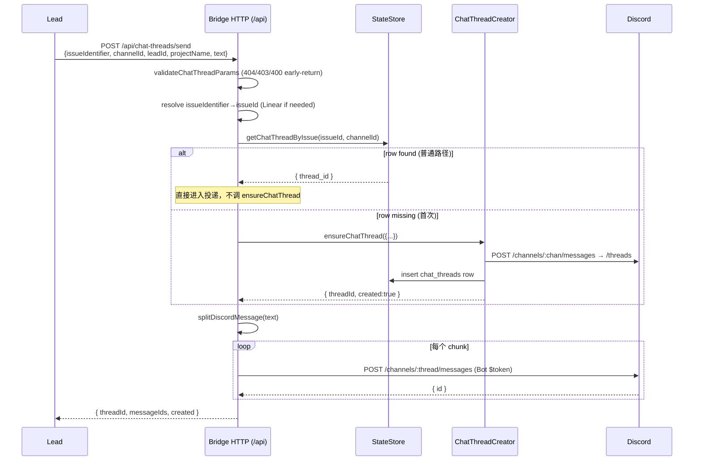
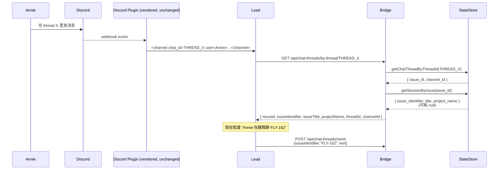

# Plan: Lead Thread Routing — FLY-162

**Version**: v1.28.0
**Issue**: FLY-162 ([workflow] Lead must auto-route messages to correct chat thread per Linear issue)
**Date**: 2026-05-19
**Source**: `doc/engineer/exploration/new/FLY-162-lead-thread-routing.md`
**Status**: Layer 1 codex-approved (Round 4); **Layer 2 (§12) codex-approved (Round 2, 2026-05-25)** — preventive plugin reply-guard; 3 non-blocking R2 notes folded in. Ready for `/implement`.

> Annie 已锁 scope (Option D hybrid，Codex framing "Lead autonomy on WHAT, system enforcement on WHERE")。本 plan 把 4 项 hybrid 落地成 phase / file change list / 16 ACs / risk matrix / rollout，回答 brainstorm §6 的 6 个 open questions。

---

## 0. Audit Baseline (已验证 codebase 事实)

| 资产 | 文件 / 行 | 状态 |
|------|-----------|------|
| `chat_threads(issue_id, channel_id, thread_id)` 表 + unique idx | `packages/teamlead/src/StateStore.ts:447,457` | ✅ |
| 正向 lookup `getChatThreadByIssue` | `StateStore.ts:1298-1316` | ✅ |
| **反向 lookup `getChatThreadByThreadId`** | `StateStore.ts:1318-1337` | ✅ 已存在 (FLY-91 Round 2) |
| `getSessionByIssue(issueId)` (含 `issue_identifier, title, project_name`) | `StateStore.ts:827+` | ✅ 可用于 inbound enrich |
| `POST /api/chat-threads/register` | `tools.ts:418-483` | ✅ |
| `POST /api/chat-threads/create` (ensure semantics + 主 channel notify) | `tools.ts:487-613` | ✅（注意：ensureChatThread 即使 reuse 也会发 main-channel notify，**不要每次 send 都走它**） |
| `GET /api/chat-threads?issueId=&channelId=` (正向 HTTP) | `tools.ts:615-633` | ✅ |
| `validateChatThreadParams(...)` 状态码 (404 unknown project / 403 unknown lead / 400 channel mismatch) | `packages/teamlead/src/bridge/chat-thread-register.ts` 被 `tools.ts:516` 调 | ✅ 必须复用，不发明新状态码 |
| Bridge → Discord REST 投递 pattern (bot token + `POST /channels/:id/messages`) | `ChatThreadCreator.ts:103,250`、`runner-ready-to-close-notifier.ts:114-145`、`ForumTagUpdater.ts:32` | ✅ 可复用 |
| `splitDiscordMessage(content)` 2000 字截断 | `discord-utils.ts:12` | ✅ 可复用 |
| `tokenAuthMiddleware(config.apiToken)` 中间件 | `plugin.ts:284,535+` | ✅ — **注意**：当 `apiToken` 未配置时中间件透传不挡，production 必须依赖 env `TEAMLEAD_API_TOKEN` 已设 |
| Lead rules 加载路径 — 角色分流（**Codex R2 issue #1**） | `claude-lead.sh:1108-1199`：cos role 只装 `common-rules.md`(project) + `cos-lead-rules.md`(base)；非 cos role 装 `common-rules.md`(project) + `department-lead-rules.md`(project + base) | ✅ — cos (Simba) **不会**加载 `department-lead-rules.md` |
| Lead rules base (Flywheel 自带) | `packages/teamlead/lead-rules-base/{department-lead-rules,cos-lead-rules,runner-messaging-rules}.md` (无 `common-rules.md`) | ✅ |
| Lead rules project source | `/Users/xiaorongli/Dev/GeoForge3D/.lead/shared/{common-rules.md, department-lead-rules.md}` | ✅ |
| 当前 FLY-91 chat-thread 段实际所在 | `/Users/xiaorongli/Dev/GeoForge3D/.lead/shared/department-lead-rules.md:112-156` | ✅ — **dept Lead 才看得到，cos 看不到** |
| `HookPayload.chat_thread_id` (outbound 字段) | `bridge/hook-payload.ts:47`、`DirectEventSink.ts:521` | ✅ |
| 已有 chat-threads feature flag | `config.ts:128`: `TEAMLEAD_CHAT_THREADS_ENABLED` → `BridgeConfig.chatThreadsEnabled` → `plugin.ts:542` → `createQueryRouter` | ✅ — 新 flag 必须沿用 `TEAMLEAD_*` 命名 |
| QA framework suites 目录 | `packages/qa-framework/suites/` (不是 `scenarios/`) | ✅ |

**结论**：数据层 + Discord 投递 plumbing 都在了。本 plan 主要工作量在 (1) HTTP endpoint 包装 + (2) Lead identity rules 改写（两个文件：base + project 源）+ (3) 测试。**Audit / dashboard / leak-estimate 移到 future work**（StateStore `session_events` schema 不适合，未来需要时再加专用表，不在本 plan）。

---

## 1. Goals & Non-Goals

### Goals (P0)

1. Lead 有一个工具 `reply.by_issue(issueId|issueIdentifier, text, replyTo?)`：传业务主键即可，Bridge 自动找到 canonical thread 投递。
2. Lead 收到 thread 消息后能立刻知道 thread 绑哪个 issue（反查 endpoint，**含 identifier / title / project 富信息**）。
3. Lead identity rules（**Flywheel base + GeoForge3D project layer**）改写：issue-bound reply **必须**走 `reply.by_issue`；自由消息 (core channel / chatChannel top-level 闲聊) 才用 `discord.reply(chat_id)`。
4. 灰度：feature flag → 用 test slot QA → enable for prod → 重启所有 Leads。

### Non-Goals (P1+，本 sprint 不做)

- Auto split (Option C 已 reject)。
- 修改 vendored discord plugin (Option B reject path)。
- 文本 `GEO-XXX` 扫描 reject。
- Bridge 主动阻断 `discord.reply` 命中 chat_threads row 的调用（plugin 改不了）。
- Lead 端 inbound 自动 enrichment（plugin 不可改 → Lead 主动 curl 反查）。
- **Audit log / adoption dashboard / leak-estimate endpoint**（Codex Round 1 指出 `session_events` schema 不匹配；需要时单独加 `lead_reply_audit` 表，不在本 plan）。
- **附件 (files multipart)**：Discord multipart 投递不是简单 JSON POST；MVP 不做。
- **Per-Lead allowlist**：全局 flag 已足够；若需细灰度后续单独加。

---

## 2. Open Questions Answered

### Q6.1 — `reply.by_issue` 怎么暴露给 Lead？

**选 (b) Bridge HTTP endpoint + curl 模板** （对齐现有 "Bubble DOWN — Annie command execution" 和 `runner-messaging-rules.md` 模式）。

**Endpoint**: `POST /api/chat-threads/send`

**Request body** (JSON):
```json
{
  "issueId": "linear-uuid",           // issueId 或 issueIdentifier 二选一必填；
  "issueIdentifier": "FLY-162",       //   两个都给时 Bridge resolve identifier→UUID 再校验匹配，不匹配则 400
  "channelId": "$CHAT_CHANNEL",
  "leadId": "$LEAD_ID",
  "projectName": "$PROJECT_NAME",
  "text": "投递内容（> 2000 字自动 split）",
  "replyTo": "discord-message-id"     // optional Discord reply 引用
}
```

**Response (success)**: `{ "threadId": "...", "messageIds": ["..."], "created": false }`

**Response (partial failure)** (Discord 4xx/5xx 在中途某条 chunk 时)：HTTP 502 + `{ "error": "...", "threadId": "...", "messageIds": [...], "chunksSent": 1, "chunksTotal": 3, "failedChunkIndex": 1, "remainingText": "<未发送的原文 suffix>" }`。
- **`remainingText`** = Bridge 用相同 `splitDiscordMessage` 算法切完后，把 `failedChunkIndex` 之后（含 failed chunk）的 chunks 重拼回。这是 **"split 后未发送的 suffix"**，**不保证与原文 byte-identical**（`splitDiscordMessage` 会修剪 chunk 边缘空白；Codex R4 LOW #3）。Lead 直接拿来当下次 `send` 的 `text` 字段重发即可，**不需要重新实现 split 算法**，**不要重发整段** (Codex R3 issue #3)。单测断言 `remainingText` 等于 `splitDiscordMessage(原 text).slice(failedChunkIndex).join("\n")`（按实现的实际 trim 行为），不要断言 byte-identical。
- 若 Bridge 内部状态错乱无法计算 `remainingText`，envelope 仍保证 `chunksSent` / `chunksTotal` 字段存在；Lead 按"重发整段"作为最末 fallback（identity rules 写明）。

**入参注意**：
- `issueId` / `issueIdentifier` 二选一必填；两个都给时 Bridge resolve identifier 到 UUID 并校验匹配，否则 400 `{ error: "issueId and issueIdentifier mismatch" }`（**Codex R2 issue #3**）。
- 文本 > 2000 字时调 `splitDiscordMessage` 自动分多条 POST。
- **不接受 `files`**（attachments）。
- Discord POST 必须显式设 `allowed_mentions: { parse: [] }`，避免 Lead 文本里 `@everyone` / `@role` 误触发（**Codex R2 issue #7**）。

**关键实现约束** — Lookup-first，不要每次 send 都触发 ensureChatThread：

```
1. validateChatThreadParams(channelId, leadId, projectName) → 404/403/400 早返回
2. 解析 issueId（如果只给了 identifier，需要 Linear preflight resolve；复用 create route 逻辑）
3. row = store.getChatThreadByIssue(issueId, channelId)
4. if row: threadId = row.thread_id；created = false
   else:
     result = chatThreadCreator.ensureChatThread({...})   ← 只在这里调
     threadId = result.threadId；created = result.created
5. chunks = splitDiscordMessage(text)
6. for chunk in chunks: POST DISCORD_API/channels/{threadId}/messages
7. 返回 {threadId, messageIds, created}
```

> ⚠ `ensureChatThread()` 会在 main channel 发 "FLY-162 thread created" notify；**reuse 路径不能走它**，否则每次 send 都污染 main channel。Codex Round 1 issue #8。

**错误处理**（与现有 routes 状态码对齐）：

| 场景 | Status | Body |
|------|--------|------|
| `chatThreadsEnabled=false` 或 `replyByIssueEnabled=false` | 404 | `{ error: "Chat threads not enabled" }` 或 `{ error: "reply.by_issue not enabled" }` |
| 缺 issueId/issueIdentifier 或 channelId/leadId/projectName | 400 | `{ error: "..." }` |
| project 不在 config | 404 | 由 `validateChatThreadParams` 决定 |
| lead 不在 project | 403 | 由 `validateChatThreadParams` 决定 |
| channel 与 lead.chatChannel 不匹配 | 400 | 由 `validateChatThreadParams` 决定 |
| LINEAR_API_KEY 未配 (需要 resolve identifier) | 503 | `{ error: "LINEAR_API_KEY not configured" }` |
| identifier 在 Linear 找不到 | 404 | `{ error: "Issue ... not found in Linear" }` |
| 无 botToken | 503 | `{ error: "No Discord bot token available" }` |
| Discord POST 失败 (rate limit / 5xx) | 502 | `{ error: "Discord post failed: ..." }` |

### Q6.2 — Inbound enrichment 怎么做？

**Lead-side lookup**（不动 discord plugin）：

- 新 endpoint `GET /api/chat-threads/by-thread/:threadId`
- Bridge 先 `store.getChatThreadByThreadId(threadId)` → 拿 `{thread_id, channel_id, issue_id}`
- 再 `store.getSessionByIssue(issue_id)` 顺手补 `{ issue_identifier, title, project_name }`（不调 Linear，纯本地）
- 若 session 没有（issue 还没跑过 Runner），返回 `{issueId, threadId, channelId}` + `null` identifier/title/project；Lead 端识别成功率仍然显著提升
- 不调 Linear preflight，保持便宜（localhost ~5ms）

**Response shape**:
```json
{
  "threadId": "...",
  "channelId": "...",
  "issueId": "linear-uuid",
  "issueIdentifier": "FLY-162" | null,
  "issueTitle": "[workflow] Lead must..." | null,
  "projectName": "Flywheel" | null
}
```

Lead identity rules 写明：收到 `<channel chat_id=THREAD_X>` 后**第一步** curl 反查，把 issueIdentifier 作为后续 `send` 的入参。

### Q6.3 — Vendored discord plugin 怎么不动？

**完全不动**。`reply.by_issue` 是 Bridge HTTP endpoint。Lead 同时拥有：

- `mcp__plugin_discord_discord__reply(chat_id, text)` — plugin tool，**仅限非 issue-bound** 消息 (core channel / chatChannel top-level)
- `curl POST /api/chat-threads/send` — Bridge HTTP，**issue-bound 唯一合法路径**

Identity rules 用文字 + 表格界定。

**真 leak detection**：Bridge 看不到 plugin 调用 → 不在本 plan 解决。MVP 验收依赖 QA E2E + Annie 人工观察 1 周（见 §6 / AC14）。

### Q6.4 — Lead prompt 更新范围

**改 3 个文件**（**关键修正 Codex R2 issue #1**：cos role 不加载 `department-lead-rules.md`，必须用 `common-rules.md` 才能覆盖 Simba）：

1. **Project source (覆盖所有 3 Leads — primary location)** — `/Users/xiaorongli/Dev/GeoForge3D/.lead/shared/common-rules.md`
   - 新增 §"Issue-Bound Reply (FLY-162)"：含 outbound `send` curl 模板（jq-safe）+ inbound `by-thread` 反查模板 + 消息分类表
   - **所有** Lead role (Peter/Oliver/Simba) 都加载 `common-rules.md`
2. **Project source — legacy cleanup** — `/Users/xiaorongli/Dev/GeoForge3D/.lead/shared/department-lead-rules.md` 第 112–156 行
   - **重写**现有 §"Chat Thread Reply (FLY-91)" → §"Issue-Bound Reply — see common-rules.md"，留 1 段 pointer 到 common-rules + §"Legacy fallback (when reply.by_issue disabled)" 描述 `chat_thread_id` 行为
3. **Flywheel base — canonical reference** — `packages/teamlead/lead-rules-base/department-lead-rules.md` + `packages/teamlead/lead-rules-base/cos-lead-rules.md`
   - 两份 base rule 各 append 一段简短 §"Issue-Bound Reply (FLY-162)"，模板内容与 project common-rules 一致（保证 Lead 在没有 project common-rules 的 fallback 场景下仍有完整规则）
   - 不再依赖 project common-rules 是唯一源，避免新项目接入时 Lead 完全不知道这个规则的存在

**不编造 sync 脚本**。`claude-lead.sh:1108-1199` 在每次 Lead 启动时把 project `.lead/shared/*.md` 拷到 `~/.flywheel/lead-rules/<lead>/` 并按 role 追加对应 base —— Lead **restart 即生效**。Rollout 步骤就是改 3 个源文件 + 重启 Leads（已有 `restart-services.sh` 流程）。

**Curl 模板必须 jq-safe**（Codex Round 1 issue #7 — LLM 写 shell 不能直接拼字符串）：

```bash
ISSUE="FLY-162"
TEXT=$(cat <<'EOF'
多行 Markdown 内容
包含 "引号" 和 'apostrophes' 都安全
EOF
)

PAYLOAD=$(jq -n \
  --arg issueIdentifier "$ISSUE" \
  --arg channelId      "$CHAT_CHANNEL" \
  --arg leadId         "$LEAD_ID" \
  --arg projectName    "$PROJECT_NAME" \
  --arg text           "$TEXT" \
  '{issueIdentifier: $issueIdentifier, channelId: $channelId, leadId: $leadId, projectName: $projectName, text: $text}')

curl -s -X POST \
  -H "Authorization: Bearer $TEAMLEAD_API_TOKEN" \
  -H "Content-Type: application/json" \
  "$BRIDGE_URL/api/chat-threads/send" \
  -d "$PAYLOAD"
```

**Inbound reverse-lookup 模板**：

```bash
curl -s -H "Authorization: Bearer $TEAMLEAD_API_TOKEN" \
  "$BRIDGE_URL/api/chat-threads/by-thread/$THREAD_ID"
# Returns: {"threadId":"...","channelId":"...","issueId":"...","issueIdentifier":"FLY-162","issueTitle":"...","projectName":"Flywheel"}
```

**分类表（写进两个文件）**：

| 消息类型 | 工具 | 例子 |
|---------|------|-----|
| Issue-bound — status / Q&A / 决策 / cross-issue 引用 | `POST /api/chat-threads/send` | "GEO-374 worker idle 15 min"、"FLY-161 unblocks FLY-162" |
| Core channel / 跨部门 | `mcp__plugin_discord_discord__reply` (chat_id=core_channel) | Standup / 总览 |
| chatChannel top-level 闲聊 / 一般问候 / `send` 不可用时 fallback | `mcp__plugin_discord_discord__reply` (chat_id=$CHAT_CHANNEL) | Annie 直接问 "how are you"、route 返回 404 时退化 |

Cross-issue case：Lead 显式两次 `send` 调用（每次一个 issueId）。

### Q6.5 — Out of scope

见 §1 Non-Goals。

### Q6.6 — Migration / Rollout

见 §6 Phases & Timeline + §8 Rollout。

成功度量（**人工**，因为没有 audit endpoint）：
1. QA E2E 在 test slot 跑过 5 条混合消息 scenario（AC14），0 cross-talk
2. Enable prod 后 1 周内 Annie 人工 sample ≥ 10 个 chat thread 看内容；发现 cross-talk 立刻关 flag
3. 同期主动跟 Annie 确认是否还看到漂移

---

## 3. Architecture (Mermaid)

### 3.1 Outbound — Lead → Bridge → Discord



### 3.2 Inbound — Lead 收到 thread 消息后反查



---

## 4. File Change List

### 4.1 Bridge (TypeScript)

| 文件 | 改动 | LOC ≈ |
|------|------|-------|
| `packages/teamlead/src/config.ts` | + `replyByIssueEnabled: process.env.TEAMLEAD_REPLY_BY_ISSUE_ENABLED === "true"` 字段 (与 `chatThreadsEnabled` 平行) | +5 |
| `packages/teamlead/src/types.ts` (or `bridge/types.ts`) | + `LeadReplyByIssueRequest`, `LeadReplyByIssueResponse`, `ByThreadLookupResponse` interfaces | +30 |
| `packages/teamlead/src/bridge/tools.ts` | + `POST /api/chat-threads/send` route (~120 行，调用 lookup→ensure→post 流程)<br>+ `GET /api/chat-threads/by-thread/:threadId` route (~40 行，调 `getChatThreadByThreadId` + `getSessionByIssue` 富化)<br>+ `createQueryRouter` opts 增 `replyByIssueEnabled` | +170 |
| `packages/teamlead/src/bridge/discord-utils.ts` (extend) | + `postDiscordMessageToChannel(threadId, text, botToken, { replyTo? }, fetchImpl?)` helper（封装 split + sequential POST + 错误映射）；每条 POST body 必含 `allowed_mentions: { parse: [] }` | +60 |
| `packages/teamlead/src/bridge/ChatThreadCreator.ts` | **(Codex R3 issue #2)** 在 line 110 (Step 1 channel POST `messageContent`) 和 line 257 (reuse-path "🧵 label — <#thread>" notify POST) 各加 `allowed_mentions: { parse: [] }`；line 136 thread-create body 不含 message content 无需改。覆盖 row-miss 首次 send 路径 + reuse notify 路径，保证"每一个会落到 Discord 的 message POST 都不会触发 @everyone/@here/role mention" | +4 |
| `packages/teamlead/src/bridge/plugin.ts` | 把 `config.replyByIssueEnabled` 透传给 `createQueryRouter`；mount 时无需新 route 块（都在 query router 里） | +3 |
| `packages/teamlead/src/bridge/__tests__/chat-thread-routes.test.ts` | + `describe("POST /api/chat-threads/send")` ≥ 8 cases<br>+ `describe("GET /api/chat-threads/by-thread/:threadId")` ≥ 4 cases | +400 |
| `packages/teamlead/src/bridge/__tests__/discord-utils.test.ts` (new or extend) | `postDiscordMessageToChannel` 单测（mocked fetch — split / partial fail / error / `allowed_mentions` 断言 / `remainingText` envelope） | +120 |
| `packages/teamlead/src/bridge/__tests__/ChatThreadCreator.test.ts` (extend) | **(Codex R3 issue #2)** 给现有 `ensureChatThread` 测试新增 mock-fetch 断言：line 110 + line 257 两个 POST 的 body JSON 都包含 `allowed_mentions: { parse: [] }`。无需改 happy-path 行为 | +30 |
| `scripts/test-deploy.sh` | **(Codex R3 issue #1 + R4 LOW #2)** 增加 opt-in env 块：当 `TEST_REPLY_BY_ISSUE=1` 时：(a) 计算 `TEST_TEAMLEAD_API_TOKEN="${TEST_API_TOKEN:-fly-162-test-$(uuidgen \| head -c 8)}"`；(b) 在 **Bridge `env ... run-bridge.ts`** 调用上注入 `TEAMLEAD_API_TOKEN="$TEST_TEAMLEAD_API_TOKEN"`（去掉 `env -u TEAMLEAD_API_TOKEN`）+ `TEAMLEAD_CHAT_THREADS_ENABLED=true` + `TEAMLEAD_REPLY_BY_ISSUE_ENABLED=true`；(c) 在 **Lead `env ... claude-lead.sh`** 调用上同样注入 `TEAMLEAD_API_TOKEN="$TEST_TEAMLEAD_API_TOKEN"`（不是写 `.env` 文件 — Lead 通过 process env 拿）。两边用同一个 token 字符串。默认 `TEST_REPLY_BY_ISSUE` 不设 → 旧行为不变。 | +25 |

**不动**：`StateStore.ts`（已有 `getChatThreadByThreadId` + `getSessionByIssue`）；vendored discord plugin。

> `ChatThreadCreator.ts` 整体逻辑不动（仍直接复用 `ensureChatThread`），仅给两个 Discord POST body 各补一条 `allowed_mentions: { parse: [] }` — 见上方第 4 行；这是为了让"所有 Discord POST 都安全"的 R3 承诺在 row-miss 首次 send 路径上真正成立。

### 4.2 Lead Identity Rules (Markdown — **3 个源文件，覆盖所有 Lead role**)

| 文件 | 改动 | 加载范围 |
|------|------|----------|
| `/Users/xiaorongli/Dev/GeoForge3D/.lead/shared/common-rules.md` | **+ §"Issue-Bound Reply (FLY-162)"**：jq-safe outbound + inbound curl 模板 + 消息分类表 | **所有 Lead (Peter/Oliver/Simba)** |
| `/Users/xiaorongli/Dev/GeoForge3D/.lead/shared/department-lead-rules.md` | 重写第 112–156 行原 §"Chat Thread Reply (FLY-91)" → §"Issue-Bound Reply — see common-rules.md" pointer + §"Legacy fallback (when reply.by_issue disabled)" 附录 | Peter/Oliver (dept) |
| `packages/teamlead/lead-rules-base/department-lead-rules.md` | + §"Issue-Bound Reply (FLY-162)"：与 common-rules 内容一致（base canonical 副本） | Peter/Oliver (dept, base append) |
| `packages/teamlead/lead-rules-base/cos-lead-rules.md` | + §"Issue-Bound Reply (FLY-162)"：与 common-rules 内容一致（base canonical 副本） | Simba (cos, base append) |
| `~/.flywheel/lead-rules/<lead>/*.md` (deploy cache) | **不手改**；Lead restart 时 `claude-lead.sh:1108-1199` 自动 pull | derived |

### 4.3 Feature flag

| 项 | 值 |
|----|----|
| Env var | `TEAMLEAD_REPLY_BY_ISSUE_ENABLED=true` |
| Config field | `BridgeConfig.replyByIssueEnabled: boolean` (`config.ts`) |
| Default | `false` |
| Wire | `plugin.ts` 把 `config.replyByIssueEnabled` 传 `createQueryRouter`；route 在 flag false 时返回 404 (与 chat-threads 现有 pattern 一致) |
| Production prereq | **`TEAMLEAD_API_TOKEN` 必须非空**。启动时若 `replyByIssueEnabled=true && !apiToken` → **fail startup**（`throw` 在 `config.ts` validate 阶段），不写任何 event（Codex R2 issue #2）。Endpoint 以 bot 身份投递 Discord，缺 auth = 公开暴露，绝不能 warn 跑过。 |

### 4.4 Tests / QA

| 文件 | 改动 |
|------|------|
| `packages/teamlead/src/bridge/__tests__/chat-thread-routes.test.ts` | 见 §4.1，覆盖 happy / ensure-on-miss / 5 error paths / split-long-text / flag-disabled / param validation status codes |
| `packages/qa-framework/suites/fly-162-thread-routing/` (new) | E2E suite：用 test slot Lead，发 5 条混合消息（2 issue-bound 不同 issue + 1 cross-issue 显式两次 send + 2 free-form），Chrome Discord 全程录屏，0 cross-talk 才 PASS |

---

## 5. Acceptance Criteria (16)

### Outbound (`POST /api/chat-threads/send`)

- **AC1**: Row 已存在时直接复用 thread_id 投递。**Bridge 内部不调 `ensureChatThread` / 也不调 `/chat-threads/create` 子流程**（避免 main-channel notify 污染）。响应 `{ threadId, messageIds:[...], created:false }`。
- **AC2**: Row 不存在时调一次 `chatThreadCreator.ensureChatThread`，写入 row → 投递；响应 `{ created:true }`。并发请求由 `chat_threads` unique idx 兜底，不出现重复 row。
- **AC3**: 入参验证 status 沿用 `validateChatThreadParams` 现有契约 — 缺字段 400、project 不在 config 404、lead 不在 project 403、channel mismatch 400；flag off 时 404；`LINEAR_API_KEY` 缺失（需要 resolve identifier 时）503；botToken 缺失 503；Discord 5xx/429 时 502；**`issueId` + `issueIdentifier` 都给且 mismatch → 400** `{ error: "issueId and issueIdentifier mismatch" }`。
- **AC4**: 文本 > 2000 字时调用 `splitDiscordMessage` 拆分并按序 POST；响应 `messageIds` 数组顺序与文本顺序一致；**任一 chunk 失败立即 fail-fast**（不 retry），返回 502 + `{ chunksSent, chunksTotal, failedChunkIndex, remainingText }`（Codex R2 issue #8 + R3 issue #3）—— `remainingText` 是未发原文 suffix，Lead 拿来当下次 `text` 重发，**不重发整段**。**每一个会落到 Discord 的 message POST 必须含 `allowed_mentions: { parse: [] }`** —— 覆盖 send route 的 chunk POST **以及 `ChatThreadCreator.ts` 的 row-miss 首次 send POST 和 reuse-notify POST**（Codex R2 issue #7 + R3 issue #2）。

### Inbound (`GET /api/chat-threads/by-thread/:threadId`)

- **AC5**: 已注册 thread 返回 `{ threadId, channelId, issueId, issueIdentifier, issueTitle, projectName }`；后三个字段在 `getSessionByIssue` 命中时填值，否则 `null`，整体仍 200。
- **AC6**: Thread 未注册 / 已标记 `discord_missing_at` → 返回 404 `{ error: "Thread not registered" }`。
- **AC7**: `chatThreadsEnabled=false`（不依赖 replyByIssueEnabled，因为反查也有用）→ 返回 404 `{ error: "Chat threads not enabled" }`；与现有 GET `/api/chat-threads` 一致。
- **AC8**: 反查不调用 Linear；纯本地 StateStore 查询。性能要求：p95 < 50ms（localhost）。

### Lead Identity Rules (3 文件，覆盖所有 Lead role)

- **AC9**: `/Users/xiaorongli/Dev/GeoForge3D/.lead/shared/common-rules.md` 含 §"Issue-Bound Reply (FLY-162)"：jq-safe outbound + inbound curl 模板 + 3 类消息分类表。**所有 3 Lead (Peter/Oliver/Simba) 都加载此文件**（Codex R2 issue #1）。
- **AC10**: `/Users/xiaorongli/Dev/GeoForge3D/.lead/shared/department-lead-rules.md` 第 112–156 行重写：原 §"Chat Thread Reply (FLY-91)" 变成 §"Issue-Bound Reply — see common-rules.md" pointer + §"Legacy fallback (when reply.by_issue disabled)" 附录，明确"仅在 `send` 返回 404 时才允许 `discord.reply(chat_id=chat_thread_id)`"。
- **AC11**: `packages/teamlead/lead-rules-base/department-lead-rules.md` **和** `cos-lead-rules.md` 各 append §"Issue-Bound Reply (FLY-162)" 副本（兼容未来其他项目）。Rollout 前 worker 重启 1 个 dept test Lead **和** 1 个 cos test Lead，分别 diff `~/.flywheel/lead-rules/<lead>/*.md` 确认两个 role 都看得到新规则。**Test slot 必须开 `TEST_REPLY_BY_ISSUE=1`**（见 §4.4 新增的 `test-deploy.sh` opt-in 块），否则 fail-startup throw 会让 Bridge 起不来、Lead 也拿不到 `TEAMLEAD_API_TOKEN` 走 curl 模板。
- **AC12**: 分类表清楚区分 3 类消息（issue-bound / core channel / free-form）；Cross-issue case 文档化"显式两次 send"模式。

### Tests / Rollout

- **AC13**: 单元测试覆盖：
  - `chat-thread-routes.test.ts` — `POST send` ≥ 9 cases（happy reuse / ensure-on-miss / 5 error paths / split-long-text fail-fast envelope **含 `failedChunkIndex` + `remainingText`** matching `splitDiscordMessage` output / issueId-identifier mismatch）+ `GET by-thread` ≥ 4 cases（happy with session enrich / happy without session / 404 not registered / flag disabled）。
  - **Auth coverage (Codex R4 LOW #1)** — 路由层 `chat-thread-routes.test.ts` 直接挂 `createQueryRouter`、绕过 `tokenAuthMiddleware`，**不能**用来证明 auth 行为。`POST /api/chat-threads/send` 和 `GET /api/chat-threads/by-thread/:threadId` 的 token 认证测试加在 `packages/teamlead/src/__tests__/bridge.test.ts`（plugin-level，挂完整 app）或新建 `chat-thread-auth.test.ts`，覆盖：缺 Authorization header → 401、错 token → 401、对 token → 200。
  - `discord-utils.test.ts` — `postDiscordMessageToChannel` 单测（mocked fetch），断言每条 chunk POST body 含 `allowed_mentions: { parse: [] }`，partial fail 时返回 envelope 含 `remainingText` 等于未发原文 suffix。
  - `ChatThreadCreator.test.ts`（extend，**R3 issue #2**）—— mock-fetch 断言 line 110 (Step 1 channel POST) 和 line 257 (reuse-notify POST) 两个 body 都含 `allowed_mentions: { parse: [] }`。
  - 命令：`pnpm -F flywheel-teamlead test`（Codex R2 issue #5；包名 `flywheel-teamlead`，不是 `@flywheel/teamlead`）。
- **AC14**: QA E2E suite 用 test slot Lead 跑 5 条混合消息序列；Chrome Discord 全程录屏；预期 0 cross-talk，所有 issue-bound 消息出现在正确 thread，所有 free-form 出现在 chatChannel top-level；Annie / QA gatekeeper sign-off。
- **AC15**: `TEAMLEAD_REPLY_BY_ISSUE_ENABLED` 默认 `false`。**Rollout 顺序严格如下**（Codex R2 issue #4 + R3 issue #4 — 新增 Lead pause 步骤消除 Bridge restart 窗口竞态）：
  1. Merge / deploy code（flag 默认 off，无新行为）
  2. 改 3 个 rules 源文件 + commit
  3. 通告 QA + Annie；选低活跃窗口（standup 之外、无 active Runner 投递期），并核对 `TEAMLEAD_API_TOKEN` 已在 Bridge env 中配置
  4. **Stop 所有 Leads**（kill claude-lead tmux sessions 或调 `restart-services.sh --stop-leads`，若该 flag 不存在则手动逐个 `tmux kill-session`）——保证后续 Bridge 重启窗口期没有 Lead 在打 `/api/*`
  5. Stop Bridge → set env `TEAMLEAD_REPLY_BY_ISSUE_ENABLED=true` → start Bridge → `curl /health` 200 + auth smoke (`curl -H "Authorization: Bearer $TEAMLEAD_API_TOKEN" /api/chat-threads?...` 200) 才进下一步
  6. Start 所有 Leads (`restart-services.sh` 或手动)，让新 rules 进入 prompt
  7. 1 个 dept Lead + 1 个 cos Lead 做 smoke `send` 验证 200
  8. 若任一步失败：env unset → restart Bridge + Leads → revert rules → 回滚。Bridge restart 窗口内若有 Lead 还活着收到 webhook，rules 中已写明"`send` 返回 503/5xx 时 fallback `discord.reply(chat_id=$CHAT_CHANNEL)` + 文本里写 issue identifier"——所以即使 Lead pause 步骤被跳过也不会 cross-talk，只会临时退化到 chat channel 顶层。
- **AC16**: Rollout plan：(1) merge 后 flag 默认 off；(2) 在 test slot 跑 QA E2E PASS；(3) 按 AC15 顺序全 Lead 启用并观察 1 周（Annie 人工 sample ≥ 10 thread）；(4) 若发现 cross-talk → 关 flag + revert rules + restart；(5) 1 周后稳定 → 在 rules 强化语气（移除 "fallback 允许" 描述）。

---

## 6. Phases & Timeline (estimate)

**重排（Codex Round 1 issue #12）**：先 config + 路由 contract，再实现，最后 rules + tests/QA。Audit / dashboard 移出。

| Phase | 内容 | Files | Days |
|-------|------|-------|------|
| **P1 — Config + Type contracts** | env 读 `TEAMLEAD_REPLY_BY_ISSUE_ENABLED` → `config.replyByIssueEnabled`；types interface 定义；plugin 透传 | config.ts / types.ts / plugin.ts | 0.3 |
| **P2 — Outbound `send` endpoint** | tools.ts 新增 route；discord-utils helper；lookup-first 实现；单测 happy + ensure-on-miss + 5 error paths | tools.ts / discord-utils.ts / test | 1.5 |
| **P3 — Inbound `by-thread` lookup** | tools.ts 新增 route；enrich 调 getSessionByIssue；单测 4 cases | tools.ts / test | 0.5 |
| **P4 — Lead identity rules rewrite** | 编辑 base + GeoForge3D project source；本地 restart 1 个 test Lead diff 验证 | lead-rules-base + GeoForge3D/.lead/shared | 0.7 |
| **P5 — QA E2E + rollout** | (a) `scripts/test-deploy.sh` 加 `TEST_REPLY_BY_ISSUE=1` opt-in (R3 issue #1)；(b) qa-framework suite / Chrome Discord run / Annie sign-off；(c) flip prod flag (含 Lead pause-then-Bridge-restart sequence, R3 issue #4)；(d) 1 周观察 | test-deploy.sh + qa-framework + rollout | 1.2 |
| **Total** |  |  | **~4.2 days** |

**先后约束**：P1 → P2 / P3（独立平行）→ P4 → P5。P5 在 prod 翻 flag 前必须 (a) test slot QA PASS (b) rules 已 ship + Leads 已重启。

---

## 7. Risk Matrix

| Risk | Likelihood | Impact | Mitigation |
|------|-----------|--------|------------|
| Lead identity rules 没覆盖到 cos role (Simba) — 只改 department-lead-rules | High | High | AC9 把规则放 project `common-rules.md` (全 role load) + AC11 双重测：dept + cos 各重启 1 个 test Lead 验证 deployed 内容 |
| Lead identity rules 漏改 GeoForge3D project 源（只改 Flywheel base）→ deployed 行为没变 | Med | High | AC9 + AC10 + AC11 强制改 3 个源文件；rollout 前 worker 重启 1 dept + 1 cos test Lead diff 验证 |
| 每次 send 都触发 ensureChatThread → main channel 被 "thread created" 通知刷屏 | Med | High | AC1 显式禁止；ensure 只在 row miss 时调；单测断言 reuse 路径不 call ensure |
| 并发 send 同时触发 ensureChatThread → race | Low | Low | StateStore 已有 unique idx 兜底；ChatThreadCreator 现成幂等 |
| `TEAMLEAD_API_TOKEN` 未配 → endpoint 无 auth 暴露 | Med | High | **Bridge fail-startup** 当 `replyByIssueEnabled && !apiToken`（config.ts validate throw）；不写 event；rollout checklist 第一条核对 env；测试覆盖 auth 配置时 401 |
| Lead 继续用老 `discord.reply(chat_id=$CHAT_THREAD_ID)` 跨 thread | Med | Med | A++ prompt + 分类表；Annie 人工 sample 1 周；发现就关 flag |
| Inbound 反查 Bridge 不可用 → Lead 不知道 issue | Low | Med | Identity rules 写 "反查失败 → fallback `discord.reply(chat_id=$CHAT_CHANNEL)` 并在文本里指明 issue identifier"；**不**承诺 thread-title 解析（plugin envelope 没暴露） |
| Discord rate limit 在长消息 split 时 429 | Low | Low | **Fail-fast，不 retry**；返回 502 + `{chunksSent, chunksTotal, failedChunkIndex, remainingText}` (R3 issue #3) 让 Lead 直接拿 `remainingText` 续发，**不重发整段文本** |
| 测试 build 因 sql.js / better-sqlite3 失败（FLY-153 后遗症） | Low | High | 遵守 `doc/qa/framework/dependency-build-policy.md`；不新增依赖 |
| Lead rules 改得太多 → Lead confuse 老 chat_thread_id 行为 | Med | Low | Rollout 先 test slot 跑 QA，再 prod；保留 legacy fallback 章节 |
| Bridge restart 窗口 Lead 仍在投递 → 5xx 退化到 chat channel 顶层 (R3 issue #4) | Med | Low | AC15 加 Lead pause-before-Bridge-restart 步骤；即使该步漏跑，identity rules 已写"`send` 503/5xx → chatChannel 顶层 + 文本里写 issue identifier"，不会 cross-talk |
| Test slot 跑不起来 — `test-deploy.sh` `env -u TEAMLEAD_API_TOKEN` + 默认 flag off (R3 issue #1) | Med | High | §4.4 新增 `TEST_REPLY_BY_ISSUE=1` opt-in 块，开启后注入 `TEAMLEAD_API_TOKEN` + 两个 flag + 把 token 透传给 Lead env；旧调用方默认行为不变 |
| `ChatThreadCreator.ts` row-miss 路径漏掉 `allowed_mentions` → Linear title 含 `@everyone` 误 ping (R3 issue #2) | Low | High | §4.1 把 ChatThreadCreator.ts 加进 file change list，line 110 + 257 两个 POST 各加 `allowed_mentions: { parse: [] }`；新增单测断言 |
| FLY-161 (runner_question Bridge event) Bridge event routing / types 冲突 (R3 issue #5 reword) | Med | Low | merge 时 rebase 检查 EventFilter / event-route / 共享 types，不仅看 `tools.ts`；冲突时 re-run `pnpm -F flywheel-teamlead test` |

---

## 8. Rollback Plan

1. **代码层**：`TEAMLEAD_REPLY_BY_ISSUE_ENABLED=false` → `POST /send` 返回 404。`GET /by-thread/:threadId` 不受 flag 影响（仍可用，作为 inbound enrich 工具，不会引入 leak）。
2. **Rules 层**：`git revert` 两个源文件 → 重启 Leads（`restart-services.sh`）。Lead 看到 `send` 404 → 按 §"Legacy fallback" 章节用 `discord.reply(chat_id=$CHAT_THREAD_ID)`，**仅当 event payload 已含 chat_thread_id**；否则用 `discord.reply(chat_id=$CHAT_CHANNEL)` 并在文本中显式 issue identifier。
3. **DB 层**：无 schema 改动，无需迁移。
4. **未 ship 的 audit / dashboard**：完全没引入，无需 rollback。

---

## 9. Open Items (resolved across Rounds 2–4, kept for trace)

| # | 来源 | 状态 |
|---|------|------|
| 9.1 | R2: in-process dedup (同 leadId + issueId + text hash 10s 内重复) | **DEFERRED** — 依赖 Lead 不重发；如后续观察到重发再加 |
| 9.2 | R2: `getSessionByIssue` 多 session 返回哪条 | StateStore 返回最近一条；对 inbound enrich 足够（identifier 不变）；不阻塞 |
| 9.3 | R2: rollout 是否需要并存 N 天 | **NOT NEEDED** — flag off → on 即切；rules 保留 fallback 段供 flag off 回滚 |
| 9.4 | R2: Discord `allowed_mentions` 设空 | **RESOLVED** — AC4 + request body 明列 `allowed_mentions: { parse: [] }` |
| 9.5 | R3 (Codex R2 issue #1): cos role 覆盖 | **RESOLVED** — primary rule 进 project `common-rules.md` + base 双 append |
| 9.6 | R3 (Codex R2 issue #2): startup warning event | **RESOLVED** — 改 fail-startup throw，无 event 写入 |
| 9.7 | R3 (Codex R2 issue #3): issueId/identifier mismatch | **RESOLVED** — Bridge resolve identifier → UUID 后校验，mismatch 返 400 |
| 9.8 | R3 (Codex R2 issue #4): Bridge restart 顺序 | **RESOLVED** — AC15 列 7 步 rollout sequence |
| 9.9 | R3 (Codex R2 issue #5): 测试命令 | **RESOLVED** — `pnpm -F flywheel-teamlead test` |
| 9.10 | R3 (Codex R2 issue #6): 文件引用偏移 | **RESOLVED** — `chat-thread-register.ts`、`StateStore.ts:827` 校正 |
| 9.11 | R3 (Codex R2 issue #7): allowed_mentions | **RESOLVED** — AC4 + request body |
| 9.12 | R3 (Codex R2 issue #8): retry 语气不一致 | **RESOLVED** — fail-fast 统一；risk matrix 同步 |
| 9.13 | R4 (Codex R3 issue #1): test-deploy.sh strip token + 默认 flag off → test slot 起不来 | **RESOLVED** — §4.4 增 `TEST_REPLY_BY_ISSUE=1` opt-in 块；AC11/AC14 引用；P5 增子任务 |
| 9.14 | R4 (Codex R3 issue #2): `ChatThreadCreator.ts` row-miss + reuse-notify 两个 POST 漏 `allowed_mentions` | **RESOLVED** — §4.1 加 ChatThreadCreator.ts，line 110/257 各加 `allowed_mentions: { parse: [] }`；AC13 加单测断言 |
| 9.15 | R4 (Codex R3 issue #3): 长消息 partial 失败 envelope 不足以精确恢复 | **RESOLVED** — 502 响应增 `failedChunkIndex` + `remainingText`；Lead identity rules 写明直接用 `remainingText` 续发 |
| 9.16 | R4 (Codex R3 issue #4): Bridge restart 窗口无 Lead pause → 5xx 退化 | **RESOLVED** — AC15 增 Lead pause-before-Bridge-restart 步骤（step 4）；rules fallback 兜底；Risk Matrix 加行 |
| 9.17 | R4 (Codex R3 issue #5 LOW): FLY-161 冲突描述太窄 | **RESOLVED** — Risk Matrix reword "tools.ts 冲突" → "Bridge event routing / types 冲突" |
| 9.18 | R4 LOW #1: auth 测试放在 route-level 但 route 不挂 middleware | **RESOLVED** — AC13 拆分：route-contract 测试在 `chat-thread-routes.test.ts`，auth 测试在 `bridge.test.ts` 或新 `chat-thread-auth.test.ts` |
| 9.19 | R4 LOW #2: test-deploy token 写 `.env` vs process env 含糊 | **RESOLVED** — §4.4 `test-deploy.sh` 行明确"同一 token 字符串同时注入 Bridge 和 Lead 的 process env，不写 `.env` 文件" |
| 9.20 | R4 LOW #3: `remainingText` 不一定 byte-identical | **RESOLVED** — Q6.1 + AC4 写明"split 后未发送 suffix，受 `splitDiscordMessage` trim 影响，单测断言对齐 helper 实际输出" |

---

## 10. References

- Brainstorm: `doc/engineer/exploration/new/FLY-162-lead-thread-routing.md`
- FLY-91 已 ship 部分: `doc/engineer/plan/inprogress/v1.22.0-FLY-91-discord-thread-reply.md`
- 数据层 + 路由 baseline:
  - `packages/teamlead/src/StateStore.ts:447,827,1283-1346`
  - `packages/teamlead/src/bridge/tools.ts:418-633`
  - `packages/teamlead/src/bridge/ChatThreadCreator.ts:103-220`
  - `packages/teamlead/src/bridge/runner-ready-to-close-notifier.ts:114-145`
  - `packages/teamlead/src/bridge/discord-utils.ts:12-28`
  - `packages/teamlead/src/bridge/chat-thread-register.ts`（`validateChatThreadParams` 状态码契约）
  - `packages/teamlead/src/config.ts:128-129`（feature flag pattern）
  - `packages/teamlead/src/bridge/plugin.ts:284,535+`（auth middleware）
- Lead rules:
  - `packages/teamlead/lead-rules-base/{department-lead-rules,cos-lead-rules}.md` (base canonical)
  - `/Users/xiaorongli/Dev/GeoForge3D/.lead/shared/common-rules.md` (primary，全 role)
  - `/Users/xiaorongli/Dev/GeoForge3D/.lead/shared/department-lead-rules.md:112-156` (legacy 段需重写)
  - `packages/teamlead/scripts/claude-lead.sh:1108-1199`（role-aware rules deploy 机制）
- 相关 sprint context:
  - FLY-153 better-sqlite3 root-cause → `doc/qa/framework/dependency-build-policy.md`
  - FLY-152 shared channel reply discipline（A++ prompt 基础）
  - FLY-161 runner_question Bridge event（同 sprint，可能改 tools.ts，merge 时 rebase）
  - FLY-29 vendored discord plugin fork 维护成本

---

## 11. Decisions Log

| Date | Decision | Source |
|------|----------|--------|
| 2026-05-19 | Endpoint shape `POST /api/chat-threads/send` + `GET /api/chat-threads/by-thread/:threadId` (Bridge HTTP, curl pattern, not MCP) | worker-fly-162-r + brainstorm §6.1 (b) |
| 2026-05-19 | Send 实现：lookup-first → 仅 row miss 时 ensureChatThread（避免 main-channel notify 污染） | Codex Round 1 issue #8 |
| 2026-05-19 | Inbound enrich 用 `getSessionByIssue`（本地 StateStore，不调 Linear），返回 identifier/title/project | Codex Round 1 issue #5 |
| 2026-05-19 | 不接受 attachments / files multipart；text-only | Codex Round 1 issue #6 |
| 2026-05-19 | Curl 模板用 `jq -n --arg` 编码 payload | Codex Round 1 issue #7 |
| 2026-05-19 | Feature flag 命名 `TEAMLEAD_REPLY_BY_ISSUE_ENABLED`（与 `TEAMLEAD_CHAT_THREADS_ENABLED` 一致） | Codex Round 1 issue #3 |
| 2026-05-19 | Status codes 沿用 `validateChatThreadParams` (404/403/400) 不发明新 matrix | Codex Round 1 issue #10 |
| 2026-05-19 | Lead rules 改两个文件：Flywheel base + GeoForge3D `.lead/shared`（不编造 sync 脚本；`claude-lead.sh` 自动 pull） | Codex Round 1 issue #4 |
| 2026-05-19 | Audit / adoption dashboard / leak-estimate 移到 future（`session_events` schema 不匹配） | Codex Round 1 issue #1 |
| 2026-05-19 | Rollback fallback 只承诺 `chat_thread_id`（当 payload 含）+ chatChannel top-level + 文本里写 identifier；不承诺 thread-title 解析 | Codex Round 1 issue #11 |
| 2026-05-19 | Phase 顺序：config → outbound → inbound → rules → tests/QA | Codex Round 1 issue #12 |
| 2026-05-19 | Rules primary location 改 project `common-rules.md`（cos role 也加载）；base 双 append；project `department-lead-rules.md` 重写为 pointer + legacy fallback | Codex Round 2 issue #1 |
| 2026-05-19 | `replyByIssueEnabled && !apiToken` → Bridge fail-startup throw（不写 event） | Codex Round 2 issue #2 |
| 2026-05-19 | `issueId` + `issueIdentifier` 都给时 resolve 后校验匹配，mismatch 返 400 | Codex Round 2 issue #3 |
| 2026-05-19 | Rollout 顺序固化 7 步（merge → rules → coordinate restart → Bridge env+restart → Lead restart → smoke → 1 周观察） | Codex Round 2 issue #4 |
| 2026-05-19 | 测试命令 `pnpm -F flywheel-teamlead test`；包名 `flywheel-teamlead` | Codex Round 2 issue #5 |
| 2026-05-19 | Discord POST 必须 `allowed_mentions: { parse: [] }` | Codex Round 2 issue #7 |
| 2026-05-19 | 长消息 split 失败 fail-fast，**不 retry**；返回 502 + chunksSent/chunksTotal | Codex Round 2 issue #8 |
| 2026-05-21 | `test-deploy.sh` 加 `TEST_REPLY_BY_ISSUE=1` opt-in：注入 `TEAMLEAD_API_TOKEN` + 两个 flag，把 token 透传给 Lead env | Codex Round 3 issue #1 |
| 2026-05-21 | `ChatThreadCreator.ts` 两个 message POST (line 110 / 257) 加 `allowed_mentions: { parse: [] }`；ChatThreadCreator.test.ts 加断言 | Codex Round 3 issue #2 |
| 2026-05-21 | Long-message partial 502 response 增 `failedChunkIndex` + `remainingText`；Lead 直接拿 `remainingText` 续发不重发整段 | Codex Round 3 issue #3 |
| 2026-05-21 | AC15 rollout 增 Lead pause-before-Bridge-restart 步骤（step 4）；identity rules 兜底 fallback 保证即使漏跑也不 cross-talk | Codex Round 3 issue #4 |
| 2026-05-21 | Risk matrix reword FLY-161 conflict "tools.ts" → "Bridge event routing / types"，merge 时 rebase 检查 EventFilter / event-route | Codex Round 3 issue #5 (LOW) |
| 2026-05-17 | Option D hybrid (4 项) | Annie via team-lead (brainstorm) |
| 2026-05-17 | 不做 auto-split (Option C) | Annie |
| 2026-05-17 | 不动 vendored discord plugin | worker-fly-162 audit + Annie |
| 2026-05-17 | Cross-issue → Lead 多次显式 `reply.by_issue` | Codex + Annie |

---

## 12. Layer 2 — Bridge-Enforced Reply Guard (NEW, 2026-05-23)

> **Status**: draft — Codex design review pending. 这是 plan 的 Layer 2 addendum，针对 Layer 1 (rules-only + `/send` endpoint) 在 QA 中 **3 个 cycle 全 FAIL TC-02** 后 Annie 拍板的 Option B（brainstorm §3 "Lead-side guardrail in reply tool"）。

### 12.1 为什么 Layer 1 不够 — TC-02 实证失败

**TC-02**：Lead 收到 cross-issue inbound（文本含 ≥2 个 `<TEAM>-<N>` token，如 "FLY-159 和 FLY-161 哪个先做？"）→ **100% 跳过 `/send`**，直接用 `mcp__plugin_discord_discord__reply(chat_id=$CHAT_CHANNEL)` 在 chat channel 顶层 quote-reply。零 `/send` 调用。

3 cycle 纯 prose 强化（worked example / anti-pattern / mechanical algorithm）全 FAIL。结论与 brainstorm §4 Codex framing 一致：**问题是 tool affordance，不是 prompt 不够严**。只要 `discord.reply(chat_id)` 这条 unguarded 写路径还能命中 issue channel，概率模型就会在 "一处答完更省事" 的判断下漂走。

### 12.2 Root cause — 两条写 Discord 的路径

| 路径 | 工具 | 守卫 | Bridge 可见 |
|------|------|------|-------------|
| (1) | `mcp__plugin_discord_discord__reply(chat_id, text)` — forked plugin `server.ts:652-704`，用 discord.js `ch.send()` 直投 | ❌ 无 | ❌ Bridge 完全看不到 |
| (2) | `POST /api/chat-threads/send`（Layer 1） | ✅ canonical routing | ✅ |

TC-02 = Lead 全程走 (1)。Layer 1 只造了路径 (2)，没堵 (1)。

### 12.3 Audit 结论（已验证 codebase 事实，2026-05-23）

| 事实 | 证据 |
|------|------|
| Bridge 是 **纯 outbound REST**，无 Discord gateway/websocket 连接 | `packages/teamlead/src/bridge/plugin.ts`（`FetchDiscordClient` REST-only）；全 `packages/teamlead` 无 `GatewayIntentBits`/`MESSAGE_CREATE` |
| Plugin fork 是我们控制的 git repo | `~/.flywheel/repos/claude-plugins-official`，remote `github.com/xrliAnnie/claude-plugins-official`（FLY-29/GEO-296） |
| `reply` handler 是干净的拦截点 | `~/.claude/plugins/cache/.../discord/0.0.4/server.ts:652-704` — 先 `chunk(text)`，再 `for ... ch.send()`；guard 可插在 send loop **之前** |
| Plugin 进程继承 Lead env | `claude-lead.sh:177-178` export `BRIDGE_URL` + `TEAMLEAD_API_TOKEN`；`LEAD_ID` 也已 export。Plugin 作为 Lead Claude Code 子进程读 `process.env.*`，**无需改 `.mcp.json`** |
| Bridge 已知每个 Lead 的 `chatChannel` | `ProjectConfig.ts:9` `LeadConfig.chatChannel`；`validateChatThreadParams` 已用它做 channel-match |
| Thread→issue 反查已存在 | `StateStore.getChatThreadByThreadId`（Layer 1 P3 已用） |

### 12.4 机制选型 — Preventive guard（推荐）vs Reactive observer（弃用）

| | (A) Reactive gateway-observer（team-lead 复盘前的 Layer 2b 假设） | (B) Preventive plugin reply-guard（**推荐**） |
|---|---|---|
| 原理 | Bridge 自建 Discord gateway 连接，观察 bot 顶层 post，命中 ≥2 issue token + 30s 无 `/send` → **删消息 + nudge** | forked `reply` handler 在 `ch.send()` 前调 Bridge guard endpoint；deny 时把结构化错误作为 tool result 返给 Lead，**不投递** |
| 新 gateway 连接 | 需要（每个 per-lead bot token 一条 = N 条连接） | ❌ 不需要 |
| 对 Annie 可见性 | 消息先出现再被删 → 闪烁；delete-and-nudge UX **需 Annie escalation** | 无删除、无闪烁、无 nudge loop |
| 时序 | reactive，有 30s race window | preventive，确定性 |
| 失败模式 | 删错消息 / nudge 死循环 | 仅 1 个 guard call，hybrid fail policy（free-form fail-open / issue-bearing fail-closed，见 §12.6） |
| 落地 Annie 的 "Option B" | 偏离（Option B 明确是 "reply tool guardrail"） | ✅ 正是 Option B + Codex "system enforces WHERE" framing |

**决策：选 (B)**。(A) 的删消息 UX 是 team-lead 标记要 escalate Annie 的痛点；(B) 走 preventive 直接消除该问题，且更贴 Annie 已批的 Option B。

### 12.5 Guard contract — `POST /api/discord/reply-guard`

**Request**（plugin 发，带 `Authorization: Bearer $TEAMLEAD_API_TOKEN`）：
```json
{ "projectName": "GeoForge3D", "leadId": "product-lead",
  "chatId": "<discord channel/thread id>", "text": "<reply 全文>" }
```

> **Codex R1 #1**：`leadId` 单独不够 —— `/api/chat-threads/send` 已用 `{ projectName, leadId, channelId }` 三元组校验。launcher 已 export `PROJECT_NAME` 到 Lead pane（`claude-lead.sh:702-703`），plugin 免费就能带上。若两个 project 复用同名 `product-lead`/`cos-lead`，仅按 leadId resolve 会挑错 `chatChannel`，把真 chat channel 误判成 `other` 而放行正是要堵的 top-level leak。

**Bridge 逻辑**：
1. 先按 `projectName` 找 project；再在该 project 内按 `agentId === leadId` 找 lead config。任一找不到 → `{ allow: true }`（fail-open，未知不拦）+ **记一行 `guard_bypass` log**（便于发现配错）。
2. 分类 `chatId`：
   - `== leadConfig.chatChannel` → `channel-top-level`
   - `store.getChatThreadByThreadId(chatId)` 命中 → `issue-thread`（带 boundIssueIdentifier）
   - 其它（core channel / alert / DM / 未注册）→ `other`
3. 扫描 text 里的 distinct issue token：**case-insensitive** 正则 `/\b([A-Za-z]{2,})-(\d+)\b/g`（**Codex R1 #6**），命中后 **normalize 到大写** 再跟 **normalize 过的已配置前缀**（`TEAMLEAD_ISSUE_PREFIXES`，默认 `FLY,GEO`）比对，**仅计入配置前缀**，避免 `HTTP-2`/`GPT-4` 误命中。涵盖 `fly-159`、`FLY-159/FLY-161`（无空格）、`[FLY-159](url)`（markdown link）、中文标点紧邻等形式。
4. 判定（**v1 hard-deny 边界见 §12.7**）：
   - `channel-top-level` 且 distinctIssues **≥ 1** → **DENY** `issue_at_top_level`，返回 `{ allow:false, reason, issues:[...], guidance }`
   - `issue-thread` 且 text 含 boundIssue 以外的配置前缀 issue token → **不 deny**，但返回 `{ allow:true, telemetry:"potential_wrong_thread", issues:[...] }` 并 Bridge log（**Codex R1 #7 soft telemetry**）
   - 其余 → `{ allow:true }`
5. Feature flag `TEAMLEAD_REPLY_GUARD_ENABLED`（默认 `false`）；off → 永远 allow。

**Response (deny)**：
```json
{ "allow": false, "reason": "issue_at_top_level", "issues": ["FLY-159","FLY-161"],
  "guidance": "This reply references issue(s) at the chat-channel top level. Issue-bound content must go to each issue's thread via POST /api/chat-threads/send (one call per issueIdentifier). Top-level replies are only for issue-free free-form messages." }
```

### 12.6 Plugin fork 改动（`reply` **和** `edit_message` handler）

**Codex R1 #2**：只堵 `reply` 不够 —— `edit_message`（`server.ts:734-738`，`msg.edit(args.text)`）也是 user-visible 文本写路径，Lead 可编辑一条顶层消息塞进 cross-issue 内容绕过。**两个 handler 都要前置 guard**。

在各 handler 的发送/编辑动作之前插入：
```ts
const guard = await callReplyGuard({
  projectName: process.env.PROJECT_NAME,
  leadId: process.env.LEAD_ID,
  chatId: chat_id,
  text,
})
if (guard && guard.allow === false) {
  return {
    content: [{ type: 'text', text:
      `BLOCKED by routing guard (${guard.reason}). Issues: ${(guard.issues ?? []).join(', ')}. ${guard.guidance}` }],
    isError: true,
  }
}
```

`callReplyGuard(args)` — **hybrid fail policy（Codex R1 #3）**：
- 读 `process.env.BRIDGE_URL` / `TEAMLEAD_API_TOKEN` / `LEAD_ID` / `PROJECT_NAME` / `TEAMLEAD_ISSUE_PREFIXES`。
- POST `${BRIDGE_URL}/api/discord/reply-guard`，**短 timeout（~1500ms）**。
- **正常 200** → 按 response allow/deny。
- **Bridge 调用失败**（network / 非 200 / timeout / env 缺失）时，按"本地是否检测到 issue token"分流：
  - 本地 case-insensitive 扫 `text`（用 `TEAMLEAD_ISSUE_PREFIXES`，缺省 `FLY,GEO`）：
    - **含 ≥1 issue token** → **fail-CLOSED**：返回 `{ allow:false, reason:"guard_unavailable", guidance:"Bridge routing guard unavailable; do not post issue content at top level — use POST /api/chat-threads/send when Bridge is healthy." }`。保护 TC-02 这一类不在 Bridge 故障期 leak。
    - **零 token（纯 free-form）** → **fail-OPEN**：返回 `null`（照常发），保证 Bridge 宕机时普通寒暄 / core channel 仍能回 Annie。
  - `process.stderr.write` 各记一行。

**为什么 hybrid**：纯 fail-open 会让 "100%" 只在 Bridge 在线时成立，Bridge-down 期间 Lead 自由 leak（Codex R1 #3）。hybrid 把 availability（free-form 不被 Bridge 故障锁死）和 enforcement（issue 内容故障期也不漂）都保住：故障期普通 chat 照常，issue-bearing 顶层 reply 才被本地兜底拦下。

### 12.7 Scope discipline — v1 hard-deny = `issue_at_top_level`（≥1 token）

**Codex R1 #2 调整**：原设计只堵 chatChannel 顶层 ≥2 issue token，留了两个洞——(a) Lead 被拒后改发**两条各含一个 issue** 的顶层 reply；(b) `edit_message` 绕过。要拿真 100%，hard 规则收紧为：

> **chatChannel 顶层 post（`reply` 或 `edit_message`）含 ≥1 distinct 已配置前缀 issue token → deny。**

这与 Layer 1 rules 边界**完全一致**：issue-bound 内容一律走 `/send` 进对应 thread；chatChannel 顶层只留给**零 issue token** 的 free-form（寒暄 / "在弄了" / Annie 直接闲聊）。≥1 边界天然堵掉 split-into-singles 绕过，且语义清晰可单测，不需语义判断。

**明确 defer**（不在 v1 hard-deny）：
- `wrong_thread`（在 issue-X thread 里讨论 issue-Y）——硬堵会误伤 "similar to FLY-100" 这类合法 passing mention。v1 只做 **soft telemetry**（§12.5 step 4 第二条：allow=true + Bridge log `potential_wrong_thread`），积累数据给未来规则，零 user-visible false positive。
- core channel / `other` 分类的任何 hard 规则（跨部门 standup 引用 issue 合法）。

**100% 的精确含义（Codex R2 note #3）**：guard **确定性地阻止** issue-bearing 内容被投到 chatChannel 顶层（错误投递不会发生）。随后的 `/send ×N` 正确恢复是 **Lead 在收到 deny tool-result 后自己执行的**——由 tool error guidance 引导、由 E2E scenario 验证，不是 guard 替 Lead 投递。即：guard 100% 保证"不漂到顶层"，"漂去对的 thread"由 Lead + Layer 1 完成。

### 12.8 6 个 open question 的回答（team-lead 复盘清单）

| # | Question | 回答 |
|---|----------|------|
| 1 | plugin fork message-create events? | **N/A** — preventive guard 不观察 inbound，只在 outbound `reply`/`edit_message` handler 拦截。比 reactive 假设简单。 |
| 2 | delete-and-nudge UX（escalate Annie?） | **消除** — 走 preventive，无删消息、无 nudge。Annie escalation 不再需要。 |
| 3 | gateway cost | **零** — 不新建 gateway。每次 reply/edit +1 个 localhost HTTP call（~5ms）。 |
| 4 | TTL cache persistence | 不需要持久 cache。分类全在 StateStore/config（localhost）。`chatChannel` 静态，v1 保持 stateless，量级不值得加 cache。 |
| 5 | test strategy | (a) Bridge unit：`evaluateReplyGuard` 分类 + case-insensitive token-scan + decision 分支 + flag-off + unknown project/lead fail-open；(b) plugin unit：`callReplyGuard` 的 hybrid fail policy（200 allow/deny 透传、Bridge-down+有 token→fail-closed、Bridge-down+无 token→fail-open）、`reply` 与 `edit_message` 都接 guard（mock fetch）；(c) **env smoke**：证明 `BRIDGE_URL`/`TEAMLEAD_API_TOKEN`/`LEAD_ID`/`PROJECT_NAME` 在 `--channels` plugin runtime 可见（Codex R1 #3）；(d) E2E test slot：TC-02 cross-issue inbound → 断言 reply 被 block → Lead 退到 `/send` ×N → 0 cross-talk，Chrome Discord 全程观察。 |
| 6 | cost matrix | reply/edit +1 localhost call（可忽略）。Plugin fork drift（FLY-29）——局部改动（2 handler + 1 helper）。 |

### 12.9 Feature flag + startup 校验

| 项 | 值 |
|----|----|
| Env var | `TEAMLEAD_REPLY_GUARD_ENABLED=true`（Bridge 侧 endpoint 开关） |
| Issue 前缀 | `TEAMLEAD_ISSUE_PREFIXES=FLY,GEO`（默认）；同时 export 给 Lead pane 供 plugin 本地 fail-closed 扫描 |
| **Startup 校验（Codex R1 #3）** | `config.ts`：`replyGuardEnabled=true` 时**要求** `TEAMLEAD_API_TOKEN` 非空，否则 **fail-startup throw**（对齐 `replyByIssueEnabled` 既有校验）。理由同 Layer 1：guard endpoint 暴露 lead/thread 分类，缺 auth = 公开暴露，`tokenAuthMiddleware` 在 `apiToken` 未设时是透传不挡的。 |
| Plugin 侧 | 无独立 flag；`callReplyGuard` 走 hybrid fail policy。生产同时部署 fork + 开 endpoint flag。 |
| Default | endpoint flag `false` → 永远 allow（不影响现有行为） |

### 12.10 File change list (Layer 2)

| 文件 | 改动 |
|------|------|
| `packages/teamlead/src/bridge/tools.ts` | + `POST /api/discord/reply-guard` route（按 projectName→leadId resolve → classify chatId → case-insensitive scan → decision；flag-gated；unknown→fail-open+log） |
| `packages/teamlead/src/bridge/reply-guard.ts`（new） | 纯函数 `evaluateReplyGuard({ leadConfig, classification, issueTokens })` + case-insensitive token-scan helper（便于单测） |
| `packages/teamlead/src/config.ts` | + `replyGuardEnabled` + `issuePrefixes: string[]`；+ startup 校验 `replyGuardEnabled && !apiToken → throw` |
| `packages/teamlead/src/bridge/plugin.ts` | 透传 `replyGuardEnabled` / `issuePrefixes` 给 router |
| `packages/teamlead/scripts/claude-lead.sh` | **Codex R2 note #1**：export `TEAMLEAD_ISSUE_PREFIXES` 到 Lead pane env（与 `BRIDGE_URL`/`TEAMLEAD_API_TOKEN` 同路径），供 plugin 本地 fail-closed 扫描。默认 `FLY,GEO` 覆盖当前 TC-02，非阻塞 |
| `packages/teamlead/src/bridge/__tests__/reply-guard.test.ts`（new） | `evaluateReplyGuard` + token-scan 单测（≥10 cases，含 §12.5 列举的 case-insensitive/无空格/markdown/中文标点/误报）+ route-level（classify / flag-off / unknown project+lead fail-open + log）；auth 测试加 `bridge.test.ts`（plugin-level） |
| **Plugin fork** `external_plugins/discord/server.ts`（`~/.flywheel/repos/claude-plugins-official`，**runtime 路径见 §12.11**） | `reply` **和** `edit_message` handler 各加 `callReplyGuard` 前置；新增 `callReplyGuard` helper（hybrid fail policy）。单独 PR 到 fork repo。 |
| `~/.flywheel/bin/check-discord-plugin.sh`（**ops-side，非 repo-tracked，rollout 时改**） | **Codex R1 #4**：新增 guard marker 断言（grep `callReplyGuard`），**同时校验 cache 与 marketplace 两条 runtime 路径**，不止旧 `allowBots` marker。⚠ **不在 implement 阶段改 live 脚本**：加了 marker 后 deployed 旧 plugin 会立刻报 STALE，`claude-lead.sh`/`restart-services.sh` 会触发 update cascade，干扰其它在线 Lead。仅在 rollout step 2（fork 已推到两条路径后）应用 |
| `packages/qa-framework/suites/fly-162-thread-routing.md` | + TC-02 enforcement scenario（block → /send ×N → 0 cross-talk） |

> **Codex R1 #4 — runtime 路径**：Claude Code 实际从 **marketplace** 路径跑 plugin，不只 cache。两条都要 sync + verify：
> - `~/.claude/plugins/cache/claude-plugins-official/discord/<version>/server.ts`
> - `~/.claude/plugins/marketplaces/claude-plugins-official/external_plugins/discord/server.ts`
> `update-discord-plugin.sh` 已写成同步两者；rollout 必须确认 marketplace 副本不 stale（当前环境 `check-discord-plugin.sh` 报 marketplace STALE）。

### 12.11 Rollout (Layer 2)

1. Merge Bridge endpoint（flag 默认 off，无新行为）；config startup 校验生效。
2. Plugin fork PR merge → `update-discord-plugin.sh` 同步到各 Lead 的 **cache 与 marketplace 两条路径** → `check-discord-plugin.sh` 断言 guard marker 在两条路径都在（非 stale）。
3. **Codex R1 #5 — flags 顺序**：test slot 必须**三个 flag 全开**（否则 deny 后 `/send` recovery 路径 404）：
   - `TEAMLEAD_CHAT_THREADS_ENABLED=true`
   - `TEAMLEAD_REPLY_BY_ISSUE_ENABLED=true`
   - `TEAMLEAD_REPLY_GUARD_ENABLED=true`
   先跑 auth smoke 确认 `POST /api/chat-threads/send` 返回非 404，再开 guard，然后跑 TC-02 E2E PASS。
4. Prod：按 §AC15 的 Lead-pause → Bridge env flip（三 flag + token）→ Bridge `/health` + auth smoke → Lead restart 顺序开启。
5. 观察：guard deny 计数 + `potential_wrong_thread` telemetry（stderr / Bridge log）应在 cross-issue 场景出现且 Lead 随后走 `/send`。

### 12.12 Risk (Layer 2)

| Risk | L | I | Mitigation |
|------|---|---|------------|
| Plugin fork drift（FLY-29） | Med | Med | 改动局部（2 handler + 1 helper）；fork PR 单独 review |
| **marketplace runtime 副本 stale → guard 不生效** | Med | High | `update-discord-plugin.sh` 同步两路径；`check-discord-plugin.sh` 断言 guard marker 在 cache+marketplace；rollout step 2 强制校验 |
| Bridge 宕机 → guard 调用失败 | Med | Low | hybrid fail policy：free-form 照发，issue-bearing 顶层 fail-closed（不 leak）；LeadWatchdog 监控 Bridge |
| 两 project 复用同名 leadId → 选错 chatChannel 放行 leak | Low | High | 请求带 `projectName`，先 resolve project 再 lead（Codex R1 #1）；unknown→fail-open+log |
| guard endpoint 无 auth 暴露 | Med | High | `replyGuardEnabled && !apiToken → fail-startup`（Codex R1 #3）；auth 测试覆盖 |
| False positive（合法零……实为含 issue 的顶层公告被堵） | Low | Med | ≥1 边界明确：issue 内容本就该进 thread；guidance 指引 `/send`；如确有合法顶层 issue 公告需求后续加显式 override |
| split-into-singles / `edit_message` 绕过 | — | — | ≥1 边界 + 两 handler 都接 guard，已堵（Codex R1 #2） |
| reply/edit 增 ~5ms latency | Low | Low | localhost call + 短 timeout |

### 12.13 Decisions Log (Layer 2)

| Date | Decision | Source |
|------|----------|--------|
| 2026-05-23 | Layer 1 rules-only 3 cycle FAIL TC-02 → 加 Layer 2 enforcement，100% coverage | Annie via team-lead |
| 2026-05-23 | 选 preventive plugin reply-guard (B)，弃 reactive gateway-observer (A) | worker-fly-162 audit + Codex R1 confirm |
| 2026-05-25 | hard-deny 边界从 ≥2 收紧到 **chatChannel 顶层 ≥1 issue token**（堵 split-into-singles）；`reply` + `edit_message` 都接 guard | Codex R1 #2 |
| 2026-05-25 | guard request 带 `projectName`，先 resolve project 再 lead | Codex R1 #1 |
| 2026-05-25 | hybrid fail policy：free-form fail-open，issue-bearing fail-closed（本地 token 扫描兜底） | Codex R1 #3 |
| 2026-05-25 | `replyGuardEnabled && !apiToken → fail-startup`；env smoke 证明 plugin runtime 可见 4 个 env | Codex R1 #3 |
| 2026-05-25 | sync + verify cache **与** marketplace 两条 plugin runtime 路径；check-discord-plugin.sh 加 guard marker | Codex R1 #4 |
| 2026-05-25 | rollout 三 flag 全开（chat_threads + reply_by_issue + reply_guard）+ /send auth smoke 先行 | Codex R1 #5 |
| 2026-05-25 | token scan case-insensitive + normalize；`wrong_thread` 仅 soft telemetry（allow=true + log） | Codex R1 #6/#7 |
| 2026-05-25 | **Layer 2 implemented** (Bridge endpoint + config + plugin fork PR #2 + tests + QA TC-02b)；Codex **code review** 2 rounds → APPROVED | worker-fly-162 |
| 2026-05-25 | code-review fixes: TEAMLEAD_ISSUE_PREFIXES 进 tmux `-e` list；replyGuardEnabled 时空/不可扫描 prefix fail-startup；reply-guard route 四字段强制 string | Codex code-review R1 (MED+2 LOW) |
| 2026-05-25 | guard route 404 → fail-open（区别于 5xx/timeout fail-closed-on-token）：plugin 可安全全局部署在 Bridge route 上线前 | worker-fly-162（QA deploy 分析） |
| 2026-05-25 | **部署机制修正**：fork PR #2 merge 到 fork `origin/main`（`update-discord-plugin.sh` reset --hard origin/main 是唯一 deploy 通道；branch cp 会被 startup auto-update 清掉）。fork main 已带 guard | qa-fly-162 root-cause + worker-fly-162 |
| 2026-05-25 | **QA FULL PASS (cycle 2)**：TC-02b deterministic block + TC-03 negative control + Bridge route sanity 全 PASS（slot 2 Chrome Discord）。0 issue-token top-level leak | qa-fly-162 |
