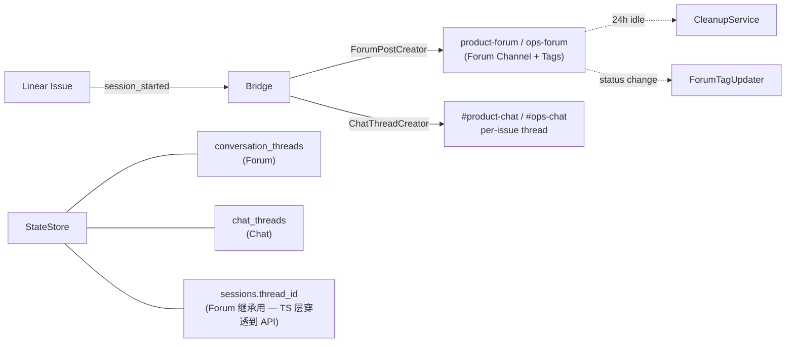
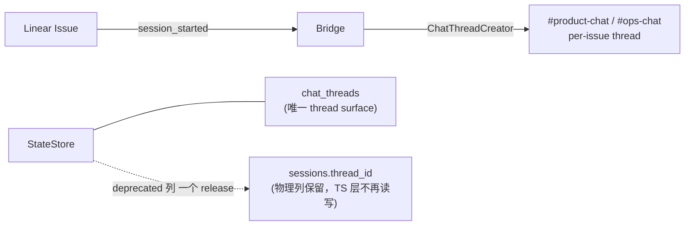
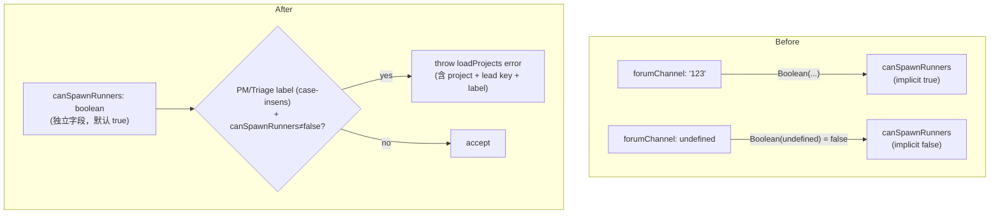

# Plan: Remove Discord Forum Channel Concept

**Version**: v1.28.0
**Issue**: FLY-163
**Date**: 2026-05-19
**Source**: `doc/engineer/exploration/new/FLY-163-remove-forum-channel-concept.md`
**Status**: codex-approved
**Review**: Round 1 — incorporated 8 Codex items on `sessions.thread_id` TS surface, plugin/actions wiring, test bucket split, post-merge config cleanup pass, migration test hardening, AC grep specificity, QA/ref doc scrub, validator semantics. Round 2 — APPROVED with 4 implementation notes folded in (cleanup env/config, StateStore.create + chat-thread signatures, EventFilter rule collapse, tighter grep AC).

---

## 概述

Annie 已经完全不再使用 Discord forum channel（product-forum、ops-forum、QA forum）。FLY-91 之后所有 issue-level 沟通走 `chatChannel` 里的 per-issue chat thread，forum 双轨变成纯负担：代码冗余、双 thread schema、status tag 噪音、`canSpawnRunners` 被 `Boolean(forumChannel)` 隐式 coupling。本 plan 把 Flywheel codebase + 配置 + 测试 + Discord channel 里所有 forum 概念**整体下线**，同时修一个长期暗病 —— `canSpawnRunners` 与 `forumChannel` 解耦。

**Scope 总览**:
- ~14 个 Flywheel 生产代码文件（删 3 个 Forum-only class + 简化 11 个 Forum/Chat 并行文件 — Codex 补的 `actions.ts:81/450/706` retry/unarchive、`runs-route` poll、`bootstrap-generator` threadId、`ChatThreadCreator` 注释、`plugin.ts` CleanupService start/stop）
- ~41 个测试文件（删 5 个 dedicated test，rewrite 8 个 semantic test，剩余 fixture cleanup）
- ~10 个 config / script / fixture 文件
- 4 个 doc / agent prompt 文件（QA framework + product-lead SOUL/TOOLS）
- 1 个 SQLite migration (`DROP TABLE conversation_threads`，含 backup export 步骤)
- 5 个 Discord channel（Annie 手动）
- 1 个 post-merge config cleanup（Annie 在 `~/.flywheel/projects.json` 删 `forumChannel`/`statusTagMap`）
- 1 个 follow-up issue（`forumChannel` hard-fail + DB ALTER 删 `sessions.thread_id` 列）

**Out of scope**: GeoForge3D `.lead/*/agent.md` 里的 forum refs（Annie 单独开 issue）。

## 前置条件

- ✅ FLY-91 已 merged（per-issue chat thread 在 chatChannel 里独立运行）
- ✅ FLY-127 `canSpawnRunners` 已落地（per-Lead spawn gate）
- ✅ GEO-275 PM Lead Simba 已上线（PM-only lead pattern 已稳定，正是受影响最大的 fixture 来源）

## 架构

### Before — Forum + Chat 双轨



### After — 只剩 Chat Thread



### `canSpawnRunners` 解耦（架构暗病修复）



## 实施步骤

整体走**两个 PR**：主 PR（Pass 1+2）和 follow-up release PR（Pass 4）。Pass 0 / Pass 2.5 / Pass 3 是 Annie 手动操作，主 PR 前后各做一次。

### Pass 0 — Pre-merge `canSpawnRunners` 显式化（Annie 手动 + 旧代码）

**时机**: 主 PR 准备 ship 之前，**仍跑旧代码**。
**目的**: 把 `canSpawnRunners` 从隐式（`Boolean(forumChannel)`）翻成显式，避免 "ship 新代码 → 默认变了 → cos-lead 短暂可 spawn" 的窗口。

1. Annie 编辑 `~/.flywheel/projects.json`：
   - `cos-lead` (Simba) 加 `"canSpawnRunners": false`
   - `product-lead` (Peter) 加 `"canSpawnRunners": true`
   - `ops-lead` (Oliver) 加 `"canSpawnRunners": true`
   - **不动** `forumChannel` / `statusTagMap`（Pass 2.5 才清理，旧代码下还要正常用）
2. 旧代码下 `restart-services.sh` 重启 Bridge
3. 验证：QA framework 跑一轮 spawn flow（PM-only label 进 cos-lead → 应 `403 DEPT_SCOPE_REJECT`；dept-label 进 dept lead → 应 spawn）

**Worker 交付物**:
- 在 PR description 里写明 Annie 必须先做 Pass 0
- 提供 `~/.flywheel/projects.json` 的精确 diff snippet
- 提供"如何回滚 Pass 0"指南（只需删 3 个新字段）

### Pass 1 — Bridge runtime + config + 测试（主 PR 核心）

#### 1.1 删除 Forum-only 文件

| 文件 | 行数 | 操作 |
|------|------|------|
| `packages/teamlead/src/bridge/ForumPostCreator.ts` | 135 | `git rm` |
| `packages/teamlead/src/bridge/ForumTagUpdater.ts` | 119 | `git rm` |
| `packages/teamlead/src/CleanupService.ts` | 137 | `git rm` |
| `packages/teamlead/src/__tests__/ForumPostCreator.test.ts` | — | `git rm` |
| `packages/teamlead/src/__tests__/ForumTagUpdater.test.ts` | — | `git rm` |
| `packages/teamlead/src/__tests__/CleanupService.test.ts` | 159 | `git rm` |
| `scripts/e2e-event-filter.ts` | — | `git rm`（ForumTagUpdater 的 harness） |

#### 1.2 删除 Forum-only routes

| 文件 | 行号 | 操作 |
|------|------|------|
| `packages/teamlead/src/bridge/plugin.ts` | 932–988 | 删 `POST /api/forum-tag` route（grep 全 repo 验证零外部调用方） |
| `packages/teamlead/src/bridge/tools.ts` | 267–328 | 删 `POST /threads/upsert` + `GET /thread/:thread_id` route |

#### 1.3 简化 Forum + Chat 并行代码（删 forum 分支，保留 chat 分支）

| 文件 | 改动 |
|------|------|
| `packages/teamlead/src/DirectEventSink.ts` | 删 `forumPostCreator?` / `forumTagUpdater?` ctor 参数；删 forum 分支（current 122–175）；删 `postThreadStatusMessage` 调用；删 `statusTagMap` 引用（line 155、554、561） |
| `packages/teamlead/src/bridge/event-route.ts` | 删 forum 分支（current 342–558）；删 forum thread 继承逻辑（466–518）；保留 chat 分支 |
| `packages/teamlead/src/bridge/EventFilter.ts` | 删 `updateForum: boolean` 字段；分类器返回 shape 改成 `{ priority, reason }`；audit log JSON 改 schema。**注意（Codex Round 2 #3）**: `session_started` 当前是基于 `p.thread_id` 存在与否拆分成两条规则（forum thread vs 无 forum）。删 `HookPayload.thread_id` 后，把两条规则**合并成单条** chat-only 高优先级 `session_started`，删所有 forum/updateForum reason 文案 + audit 字段 |
| `packages/teamlead/src/bridge/hook-payload.ts` | 删 `forum_channel?: string`（line 16）+ `forum_tag_update_result?: ...`（40-45）+ **`thread_id?: string`（line 15，Codex #1）**；保留 `chat_thread_id?`（line 47） |
| `packages/teamlead/src/bridge/lead-runtime.ts` | **删 `BootstrapSession.threadId?`（line 68，Codex #1/#2）**；保留 `chatThreadId?` |
| `packages/teamlead/src/bridge/bootstrap-generator.ts` | **删 `threadId: s.thread_id`（line 292，Codex #2）**；保留 `chatThreadId: ct.thread_id`（line 262，from `chat_threads` 表） |
| `packages/teamlead/src/bridge/mailbox-lead-runtime.ts` | 删 `Forum-Thread:` / `Forum:` format string（248–249） |
| `packages/teamlead/src/bridge/commdb-lead-runtime.ts` | 删同上（122–123） |
| `packages/teamlead/src/bridge/actions.ts` | 删 `forumTagUpdater?` ctor 参数 + tag update 分支（67–145）；**删 `store.getThreadByIssue(...)` + `store.clearArchived(...)` 调用（line 81、450、452、706、708，Codex #2 — 这些是 forum 的 retry/unarchive 逻辑）** |
| `packages/teamlead/src/HeartbeatService.ts` | 删 `forum_channel` 注入（345–367） |
| `packages/teamlead/src/bridge/run-infra.ts` | 删 `ForumPostCreator` / `ForumTagUpdater` 构造 + 传参（407–428） |
| `packages/teamlead/src/bridge/plugin.ts` | 删 imports（line 8 `CleanupService`、line 32 `ForumPostCreator`、其他 forum 相关 import）；**删 `cleanupService = new CleanupService(...)` + `cleanupService.start()`（line 1868–1878）+ 启动/停止 wiring（Codex #2）**；删 factory wiring（422–528）；**删 `forumPostCreator = new ForumPostCreator(...)`（line 1646–1647）**；删 startup diagnostics（1605–1647）；删 `statusTagMap` 解析（1463、1607、1613-1614）；删 forum-tag route（见 1.2）；删剩余 `forumLeads` filter 逻辑 |
| `packages/teamlead/src/bridge/runs-route.ts` | **删 Forum 注释（line 21 + 401，Codex #2）**；删 `threadId` 字段（455、465 + 405、417、422 — `session.thread_id` 读取整个 poll 块删除，留 chatThreadId 路径，Codex #1/#2）；删 `forumLink` 字段（455、465） |
| `packages/teamlead/src/bridge/ChatThreadCreator.ts` | **改 JSDoc 注释（line 3）—— 删 "Modeled after ForumPostCreator" 那行（Codex #2，影响零-grep AC）** |
| `packages/teamlead/src/bridge/bootstrap-generator.ts` | 双重 check 没有 forum 注入（line 262 chatThreadId 路径正确；只删 line 292 threadId） |

**`sessions.thread_id` TS 层移除（Codex #1）**:

| 位置 | 改动 |
|------|------|
| `StateStore.ts` Session/SessionUpsert 类型定义 | 删 `thread_id?: string` 字段（TS 类型），SQL 仍 SELECT 但 mapper `rowToSession` 不再注入到 TS 对象 |
| `StateStore.ts` `upsertSession` / `persistTransition` / `patchSessionMetadata` 写入路径 | 把 `thread_id` 参数从 INSERT/UPDATE 移除（不再写入物理列） |
| `StateStore.ts` `rowToSession` 映射 | 删 `thread_id` 注入 |
| `StateStore.ts` `setSessionThreadId(...)` 方法 | `git rm` 整个方法（Codex 漏列了，brainstorm 也漏） |

物理列保留 + `@deprecated FLY-163` 注释（不写不读，留作 Pass 4 ALTER DROP COLUMN 升级路径）。

#### 1.4 Config / env 清理

| 文件 | 改动 |
|------|------|
| `packages/teamlead/src/ProjectConfig.ts:5-9` | 删 `forumChannel?: string` 字段 |
| `packages/teamlead/src/ProjectConfig.ts:13-16, 219-246` | 删 `statusTagMap?: Record<>` + validator |
| `packages/teamlead/src/ProjectConfig.ts:292-299` | **改 `canSpawnRunners` 默认值**: `Boolean(lead.forumChannel)` → `true`；重写 doc comment 为 "Bridge spawn authorization — independent of Discord channel features." |
| `packages/teamlead/src/ProjectConfig.ts`（新增 — **Q4 deprecation warn**） | 在 normalize 函数最前**先**剥 `forumChannel` / `statusTagMap` → `console.warn("[loadProjects] '<project>'/<lead-key>: forumChannel is deprecated, ignoring")`，continue（Codex #8 sequencing） |
| `packages/teamlead/src/ProjectConfig.ts`（新增 — **Q2a PM/Triage validator**） | 在 `forumChannel` strip 和 `canSpawnRunners` normalize **之后**运行；语义见下 |
| `packages/teamlead/src/department-registry.ts:55-65` | `effectiveCanSpawn()` fallback 从 `Boolean(lead.forumChannel)` 改成 `true` |
| `packages/teamlead/src/config.ts:9-31, 105` | 删 `STATUS_TAG_MAP` env + `parseStatusTagMap` helper |
| `packages/teamlead/src/bridge/types.ts` | 删 `statusTagMap`（如果在 BridgeConfig 里）+ **删 `BridgeConfig.cleanupIntervalMs` / `cleanupThresholdMinutes`（Codex Round 2 #1 — 只服务 CleanupService）** |
| `packages/teamlead/src/config.ts` 或 env 解析处 | **删 `TEAMLEAD_CLEANUP_INTERVAL` / `TEAMLEAD_CLEANUP_THRESHOLD` env 解析（Codex Round 2 #1）** |

**PM/Triage validator 精确语义（Codex #8）**:

```ts
// Pseudo-code, real impl in ProjectConfig.ts
const PM_LABELS = ["pm", "triage"];               // canonical, lowercase
const labels: string[] = (lead.match?.labels ?? [])
  .filter((s): s is string => typeof s === "string")
  .map((s) => s.trim().toLowerCase());

const hasPmLabel = labels.some((l) => PM_LABELS.includes(l));
if (hasPmLabel && lead.canSpawnRunners !== false) {
  throw new Error(
    `Project "${entry.projectName}" leads[${i}] (${lead.key}): match.labels ` +
    `contains PM/Triage (${labels.join(",")}) but canSpawnRunners is not false. ` +
    `PM/Triage leads must explicitly set "canSpawnRunners": false. ` +
    `(FLY-163: canSpawnRunners no longer derives from forumChannel.)`
  );
}
```

测试覆盖：
1. `canSpawnRunners: false` + PM label → ok
2. `canSpawnRunners: true` + PM label → throw
3. 缺 `canSpawnRunners` + PM label → throw（默认 `true` 触发）
4. 缺 `canSpawnRunners` + dept label only → ok（默认 `true`）
5. `["PM", "Bug"]` + 缺 `canSpawnRunners` → throw（multi-label，PM 命中即可）
6. `["pm "]` (trailing space, lowercase) → throw（case-insensitive + trim）

#### 1.5 Scripts / fixture 清理

| 文件 | 改动 |
|------|------|
| `scripts/test-deploy.sh:307-714` | 删 `FORUM_CHANNEL_ID` 读取、jq 注入、WARN log |
| `scripts/test-slots.example.json` | 删 `forumChannelId` / `forumChannelName` + `_forumChannel` 注释 |
| `scripts/cleanup-fly-77-config.sh:98` | 更新提示文案 |
| `scripts/e2e-demo.ts:101` | 删 fixture `forumChannel` |
| `scripts/test-stale-patrol.ts:128` | 删 fixture `forumChannel` |
| `packages/teamlead/scripts/test-lead-alert-dedup.sh:49` | 删 fixture `forumChannel` |
| `.claude/commands/setup-discord-lead.md` | 删 forum 模板 + `{forum-channel-id}` 占位符 |

#### 1.6 测试改造（分三个 bucket，Codex #3）

不是所有 forum-touching 测试都是 fixture cleanup。grep 命中 41 个文件，分类：

##### Bucket A — `git rm`（5 个）

| 文件 | 原因 |
|------|------|
| `__tests__/ForumPostCreator.test.ts` | class 删了 |
| `__tests__/ForumTagUpdater.test.ts` | class 删了 |
| `__tests__/CleanupService.test.ts` | class 删了 |
| `__tests__/tools.test.ts` 里的 `/threads/upsert` + `/thread/:thread_id` describe 块 | route 删了；只删这两个 describe，保留文件 |
| `__tests__/StateStore.test.ts` 里的 `conversation_threads` migration / cleanup test cases | 表删了；只删 conversation_threads 相关 describe，保留其他 |

注：`tools.test.ts` 和 `StateStore.test.ts` 是部分删除，不是整文件 `git rm`。

##### Bucket B — Semantic rewrite（8 个）

| 文件 | 怎么改 |
|------|------|
| `__tests__/mailbox-lead-runtime.test.ts` | 删 `Forum-Thread:` 输出断言；保留其余 mailbox 行为断言 |
| `__tests__/commdb-lead-runtime.test.ts` | 同上 |
| `__tests__/DirectEventSink.test.ts` | 删 ForumPostCreator / ForumTagUpdater 行为断言；保留 chat thread + bootstrap 流程断言；调整 ctor 参数（无 forumPostCreator/forumTagUpdater） |
| `__tests__/event-filter-e2e.test.ts` | 删 `updateForum: true/false` 断言；保留 priority + reason；测试 audit log 新 schema |
| `__tests__/event-route.test.ts` + `event-route-bootstrap.test.ts` + `event-route-resubmit.test.ts` | 删 forum 分支断言 + 删 `forum_channel`/`forum_tag_update_result`/`thread_id` HookPayload 断言；给依赖"PM lead 默认 deny spawn"的 fixture 加 `canSpawnRunners: false` |
| `__tests__/runner-status-endpoint.test.ts` | 改 ctor 参数位置（无 ForumPostCreator/ForumTagUpdater/CleanupService） |
| `__tests__/bridge-e2e.test.ts` + `cipher-bridge-e2e.test.ts` | 删 forum 端到端 path；保留 chat thread path；fixture 显式 `canSpawnRunners` |
| `__tests__/actions.test.ts` | 删 `forumTagUpdater` ctor 参数 + tag update 断言；删 `getThreadByIssue` / `clearArchived` 调用断言；如果有 retry/unarchive forum-only test → `git rm` 那几个 test |

##### Bucket C — Fixture-only mechanical sweep（剩余约 28 个文件）

| 改动 | 方式 |
|------|------|
| 删 fixture 里的 `forumChannel: "..."` 字串 | `sed`-able mechanical edit；vitest 编译后 pass 即 ok |
| `__tests__/department-registry.test.ts` | A + 给 spawn fallback fixture 显式 `canSpawnRunners` |
| `__tests__/start-e2e.test.ts` | A + 给 PM-only fixture `canSpawnRunners: false` |
| `__tests__/lead-scope.test.ts` | A + B（spawn fixture） |
| `__tests__/runs-route-registration.test.ts` | A + 删 `forumLink` + 删 `threadId` 断言（chat path 仍 ok） |
| `__tests__/HeartbeatService.test.ts` | 删 `forum_channel` 注入断言 |
| `__tests__/ProjectConfig.test.ts` | A + 新增 6 个 testcase（见 1.4 PM validator 列表）+ deprecation warn testcase |
| `__tests__/bootstrap-generator.test.ts` | 删 `threadId: s.thread_id` 断言 |
| `__tests__/EventFilter.test.ts` | 删 `updateForum` 断言 |
| 剩余 ~19 个文件 | 纯 mechanical fixture 删除 |

最终验证：见 §AC。

### Pass 2 — Storage cleanup（同主 PR）

#### 2.1 删 `conversation_threads` 表 + 所有 CRUD

| 位置 | 改动 |
|------|------|
| `packages/teamlead/src/StateStore.ts:224–232` | 删 `CREATE TABLE IF NOT EXISTS conversation_threads (...)` DDL |
| `packages/teamlead/src/StateStore.ts:258–283` | 删 thread_ts → thread_id 列重命名 migration |
| `packages/teamlead/src/StateStore.ts:322–341` | 删 archived_at / cleanup_notified_at / discord_missing_at 列 ALTER |
| `packages/teamlead/src/StateStore.ts:399–412` | 删 unique-index 重建 +去重逻辑 |
| `packages/teamlead/src/StateStore.ts:954–1006` | 删 `upsertThread`、`getThreadByIssue`、**`getThreadIssue`（Codex #1）**、`setSessionThreadId` |
| `packages/teamlead/src/StateStore.ts:1209–1280` | 删 `getEligibleForCleanup`、`markArchived`、`markCleanupNotified`、`clearArchived`、`markDiscordMissing` |
| `packages/teamlead/src/StateStore.ts`（migration 段） | **新增 migration**: `DROP TABLE IF EXISTS conversation_threads` |
| `packages/teamlead/src/__tests__/StateStore.test.ts` | 删 conversation_threads 相关 describe；加 migration test（见 2.2） |

#### 2.2 加固 SQLite migration 测试（Codex #5）

不只测 "DROP 跑得通"，要覆盖真实 legacy 数据 shape：

```ts
// __tests__/StateStore.test.ts (new test case)
// Codex Round 2 #2 note: StateStore has a private ctor — use StateStore.create(tempPath).
// chat-thread signatures: upsertChatThread(threadId, channelId, issueId, leadId?)
//                         getChatThreadByIssue(issueId, channelId)
it("drops conversation_threads on init from legacy DB with rows + legacy schema", async () => {
  // Setup: write a temp DB file with legacy schema BEFORE running new migration:
  //   - rows in conversation_threads
  //   - legacy `thread_ts` column (pre-rename)
  //   - archived_at / cleanup_notified_at / discord_missing_at columns
  const tempPath = await writeLegacyDbFixture(); // helper using sql.js to bake legacy file

  // Act: instantiate new StateStore via the public factory (runs FLY-163 migration)
  const store = await StateStore.create(tempPath);

  // Assert: conversation_threads is gone
  expect(store.tableExists("conversation_threads")).toBe(false);

  // Assert: chat_threads operations still work after the drop (correct arg order!)
  store.upsertChatThread("thread-abc", "channel-xyz", "issue-1", "lead-1");
  expect(store.getChatThreadByIssue("issue-1", "channel-xyz")).toBeDefined();

  // Assert: sessions table unaffected, sessions.thread_id physical column still exists (deprecated)
  expect(store.columnExists("sessions", "thread_id")).toBe(true);
});
```

#### 2.3 Backup export（Codex #5 partial-accept — 保留 DROP 但加保险）

**Annie 在 ship 前**（PR README 顶部 checklist 加这一步）:

```bash
# One-time backup of conversation_threads rows before migration runs
sqlite3 ~/.flywheel/teamlead.db ".dump conversation_threads" > ~/Desktop/fly-163-forum-thread-backup-$(date +%Y%m%d).sql
```

保留 backup 一个 release。Pass 4 ship 后 Annie 可以删。

#### 2.4 `sessions.thread_id` 物理列保留 + follow-up

- 物理列**保留**（不 ALTER DROP COLUMN）
- 加 `@deprecated FLY-163: TS layer no longer reads/writes. Physical column to be removed in Pass 4 follow-up.` 注释
- Follow-up issue 文件模板: `doc/engineer/exploration/new/FLY-{NEW}-cleanup-sessions-thread-id.md`（worker 写空模板，Annie 填 Linear ID + 提交）

### Pass 2.5 — Post-merge config cleanup（Annie 手动，ship 之后立刻；Codex #4）

新代码 ship 后，Annie 本地 `~/.flywheel/projects.json` 仍含 `forumChannel` / `statusTagMap` → 启动日志会反复打 `[loadProjects] forumChannel is deprecated, ignoring` warn。Pass 2.5 一次清掉：

1. Annie 编辑 `~/.flywheel/projects.json`：
   - 删 3 个 Lead 的 `forumChannel: "..."` 字段
   - 删 任何 `statusTagMap: {...}` 字段
2. 编辑 `~/.flywheel/test-slots.json`：删 4 个 slot 的 `forumChannelId` / `forumChannelName`
3. `restart-services.sh` 重启 Bridge
4. 验证：启动日志**不再出现** `[loadProjects] forumChannel is deprecated` warn；QA framework spawn flow 仍 PASS

**Worker 交付物**: 在 PR description 写明 Pass 2.5 是 Pass 3 之前必做的一步（不依赖 Discord channel 删除）。

### Pass 3 — Discord channel 删除（Annie 手动，Pass 2.5 验证完之后）

按 Annie 习惯顺序（先测试再生产，验证一步进一步）:

| 序 | Channel ID | 名称 | Lead | 时机 |
|----|------------|------|------|------|
| 1 | `1501660591184412682` | finance-forum-test | slot 4 | Pass 2.5 验证通过后立即 |
| 2 | `1501660264314179807` | ops-forum-test | slot 3 | 同上 |
| 3 | `1501659917923254292` | product-forum-test | slot 2 | 同上 |
| 4 | `1485789340989915266` | ops-forum | Oliver | 验证 QA 一轮通过后 |
| 5 | `1485787822119194755` | product-forum | Peter | 同 4 |

Status tag 子项随父 channel 一起删，不单独处理。

**验证**: 每删一个后跑一轮 QA spawn / waiting / approve / ship，确认 Bridge 启动正常（无 forum-related error；其他 forum-related warn 已在 Pass 2.5 清掉）。

### Pass 4 — Follow-up release（下个 release，独立 PR）

| 改动 | 目的 |
|------|------|
| `ProjectConfig.ts`: `forumChannel` 字段从 warn-and-ignore 改成 `throw new Error("Unknown field 'forumChannel' (FLY-163: removed)")` | Q4 phase 2 — hard fail，强制 fork 用户清理 |
| `StateStore.ts`: 删 `sessions.thread_id` 列（SQLite 不支持直接 DROP COLUMN，需 table-rename + recreate 流程；写 migration test） | Q3 deprecated column 清理 |
| 全 repo 再 grep 一遍残留 `forum` 字串 | 防止 incidental refs |

## Acceptance Criteria

### Code quality — grep 精确版（Codex #6）

1. ✅ `grep -rnE "ForumPostCreator|ForumTagUpdater|CleanupService|FetchDiscordClient|forumPostCreator|forumTagUpdater|forumChannel|statusTagMap|STATUS_TAG_MAP|TEAMLEAD_CLEANUP|cleanupIntervalMs|cleanupThresholdMinutes|forum_channel|forum_tag_update_result|Forum-Thread|forumLink" packages/teamlead/src` 只剩 `ProjectConfig.ts` deprecation warn 文案 + PM validator + 改动相关的 `__tests__/ProjectConfig.test.ts` 测试用例 + Pass 4 follow-up issue ref（一处） — explicit class/symbol enumeration（Codex Round 2 #4，原写法 `Forum(Post|Tag|Service)` 漏掉 `CleanupService`）
2. ✅ `grep -rn "conversation_threads" packages/teamlead/src` 只剩 SQL `DROP TABLE IF EXISTS conversation_threads` migration（一处）
3. ✅ `grep -rn "session\.thread_id\|sessions\.thread_id\|s\.thread_id" packages/teamlead/src` 零命中（除 `@deprecated` 注释 + Pass 4 follow-up ref）
4. ✅ `grep -rn "HookPayload" packages/teamlead/src` — `thread_id` field 已删；`chat_thread_id` 保留
5. ✅ `grep -rn "BootstrapSession" packages/teamlead/src` — `threadId` field 已删；`chatThreadId` 保留
6. ✅ `grep -rn "ChatThreadCreator\|chat_threads\|chatThreadId\|chat_thread_id" packages/teamlead/src` 全保留（chat path 完整）
7. ✅ `pnpm typecheck` clean（关键：删 `sessions.thread_id` TS 字段 + `threadId` 后所有 consumer 都改干净）
8. ✅ `pnpm lint` clean（biome formatting）
9. ✅ `pnpm test` 全绿（vitest，含 PM validator 6 个测试 + StateStore migration test）

### Behavior — spawn gate

10. ✅ `~/.flywheel/projects.json` 含 `canSpawnRunners: false` 的 cos-lead，在 PM-label issue 上 spawn 被 `403 DEPT_SCOPE_REJECT`
11. ✅ `canSpawnRunners` 未显式声明的 lead 默认走 `true`（新默认值生效）
12. ✅ Validator: 配置含 `match.labels: ["PM"]` / `["pm"]` / `["Triage"]` + 缺 `canSpawnRunners: false` → `loadProjects()` throw（error 文案含 project + lead key + label list + FLY-163 ref）
13. ✅ Validator: 配置含 `forumChannel: "..."` → 输出 deprecation warn（含 project + lead key），剥字段后继续；validator 在 strip **之后**运行

### Behavior — chat thread 不受影响

14. ✅ FLY-91 chat thread 创建路径不动；E2E 验证新 issue 仍在 chatChannel 里建 per-issue thread
15. ✅ EventFilter audit log 新 schema（无 `updateForum`）；grep 验证无外部 consumer
16. ✅ `/api/runs/start` response: `threadId` field 已删；`chatThreadId` field 保留并工作（runs-route.ts:315）

### Storage

17. ✅ SQLite migration 测试：旧 DB（有 `conversation_threads` + rows + legacy `thread_ts` 列 + archived_at/cleanup_notified_at/discord_missing_at 列）→ migration 跑完 → `conversation_threads` 表 dropped → `sessions` 表完整（含 `thread_id` 物理列） → `chat_threads` 操作正常
18. ✅ Annie 已 `.dump` backup `conversation_threads`（Pass 2.3 step 1）

### QA framework

19. ✅ QA framework 4 个 test slot 全跑通（FLY-115 / FLY-96 framework），spawn / waiting / approve / ship 全 pass；mirror-channel mode (FLY-153) 不受影响
20. ✅ `qa-parallel-executor.md` / `product-lead-SOUL.md` 等 doc 不再要求验证 Forum Post

## Risk Matrix

| 风险 | 概率 | 影响 | 缓解 |
|------|------|------|------|
| Pass 0 漏配 → ship 新代码瞬间 cos-lead spawn-enabled | 中 | 高 | 两阶段 deploy + PR description 强制 checklist + PM/Triage validator 兜底（fixture 含 PM label 而无 explicit false 直接 throw 阻止 ship） |
| 漏改某个 forum 分支 → runtime 路径还引用 ForumPostCreator/CleanupService | 低 | 高（NPE/undefined call/启动失败） | 删 3 个 class 后 ts compile 同时报错；plugin.ts CleanupService start/stop 在 Codex #2 里已显式列出 |
| `sessions.thread_id` TS 字段删后某 consumer 漏改 → typecheck fail | 中 | 中 | typecheck 是硬门；列出的 4 个 TypeScript surface（HookPayload/BootstrapSession/runs-route/bootstrap-generator）+ StateStore mapper 都在 1.3 explicit list |
| `conversation_threads` DROP 后想恢复数据 | 极低 | 中 | Pass 2.3 `.dump` backup 强制；Annie 不再用 Forum；brainstorm 已确认无业务依赖 |
| EventFilter shape 变化破坏外部 audit consumer | 低 | 中 | brainstorm + Codex Round 1 grep 都已验证无外部 consumer |
| 主 PR diff 太大 codex review 难审 | 高 | 中（review 拖久） | 按 Pass 分 commit（同一 PR 内）：1.1 删 file → 1.2 删 route → 1.3 简化分支（拆 commits per file 类） → 1.4 config → 1.5 scripts → 1.6 tests bucket A → bucket B → bucket C → 2 migration + test。Codex 按 commit 复审更高效 |
| Pass 2.5 Annie 忘做 → Pass 3 后还有 warn | 中 | 低（启动 warn 噪音） | PR description 顶部 checklist 把 Pass 0 / Pass 2.5 / Pass 3 显式列成 3 个 task |
| Pass 3 Annie 忘删某个 channel | 中 | 低（无影响，channel 闲置） | PR description 写清 5 个 channel ID；ship 后 worker SendMessage 提醒 |
| Pass 4 hard-fail 提前到主 PR → fork 用户突然 break | — | — | 明确分两个 release |
| GeoForge3D agent.md 引用 `Forum-Thread:` → Lead 系统 prompt 提到不存在 thread | 中 | 低（Annie 已 acknowledge 单独 issue） | brainstorm out-of-scope；PR description 引用未来 issue ID |
| QA framework agent prompt 还写 "verify Forum Post created" → QA 误报 fail | 中 | 中 | Pass 1.6 把 `qa-parallel-executor.md` + `product-lead-SOUL.md/TOOLS.md` 列入 doc scrub |

## 测试策略

### 单元 / 集成测试

- Bucket A：5 个 `git rm`（含 tools.test / StateStore.test 的部分 describe 删除）
- Bucket B：8 个 semantic rewrite — 删 forum 行为断言，保留 chat 行为断言，调整 ctor 参数
- Bucket C：~28 个 fixture mechanical sweep
- 新增 `ProjectConfig.test.ts` 6 个 testcase（见 1.4）
- 新增 `StateStore.test.ts` migration testcase（见 2.2，含 legacy `thread_ts` + archived columns + rows）

### E2E（QA framework）

- Slot 2 (product-forum-test) **删除前**: 跑完整 spawn 流程一次，确保新代码不影响产品功能
- Slot 2 删除后: 跑 spawn flow，确保 Bridge 启动无 forum 相关 error 或 warn（Pass 2.5 已清 config）
- Mirror-channel mode (FLY-153) 跑一轮，确认 3 个 lead 在 `#test-core-mirror` 仍按 reply discipline 工作
- QA agent prompt 已 scrub（不再要求 verify Forum Post 创建）

### Manual smoke（Annie ship 后）

- Bridge restart 后 `tail -f` log 看启动 path 无 forum-related error / warn
- 真 PM-label issue → cos-lead 收到 deny；dept-label issue → dept lead 正常 spawn
- `gh pr create` 一次走 Discord 通知，确认 Lead 在 chat thread 里通知（不在 forum）
- `/api/runs/start` response 含 `chatThreadId` 不含 `threadId`

## Rollback Plan

如果 ship 后发现严重 regression：

1. **revert PR**（squash commit 已成 1 个，单个 `gh pr revert` 即可）
2. Annie 不需要回滚 `~/.flywheel/projects.json` 的 `canSpawnRunners` —— 旧代码下 explicit field 仍 honored，行为一致
3. **如果 Pass 2.5 已做**：revert 后启动会失败（旧代码可能依赖 `statusTagMap`）。Recovery 步骤：从 `~/Desktop/fly-163-forum-thread-backup-*.sql` 还原 conversation_threads 表；从 git 旧版本恢复 `~/.flywheel/projects.json` 的 `forumChannel`/`statusTagMap` 字段（或重新填）。**因此 revert 之前先确认是否已做 Pass 2.5**。
4. `conversation_threads` 表已 DROP，**不可直接 SQL 恢复**。但 Pass 2.3 backup `.dump` 还在 → `sqlite3 ~/.flywheel/teamlead.db < ~/Desktop/fly-163-forum-thread-backup-*.sql`
5. Discord channel Pass 3 是 Pass 2.5 之后才删，**revert 之前不删**（确认顺序）

## Doc / Memory 同步（PR 内做完）

代码 scrub:
- `packages/qa-framework/agents/qa-parallel-executor.md` — 删 "verify Forum Post" / "check forum tag" 指令（Codex #7）
- `doc/reference/product-lead-SOUL.md` — 删 forum tag / forum link mention（Codex #7）
- `doc/reference/product-lead-TOOLS.md` — 同上（如果存在）

文档移动:
- `doc/architecture/product-experience-spec.md` 如有 Forum refs，scrub
- 这份 plan 实施完毕后 `git mv plan/inprogress → plan/archive`
- brainstorm doc `git mv exploration/new → exploration/archive`（不删）
- 新增 follow-up issue 描述档（`doc/engineer/exploration/new/FLY-{NEW}-cleanup-sessions-thread-id.md`，worker 写模板）

`CLAUDE.md` / `MEMORY.md`:
- `CLAUDE.md` Active Explorations 列表移除 FLY-163（archive 之后）
- `MEMORY.md` doc index 更新；Shipped 列表加 v1.28.0-FLY-163 行

## Open Questions

无 — 5 Q 已在 brainstorm 阶段拍板（Annie + Codex），Codex Round 1 的 8 个 follow-up 已并入本 plan。

## References

- 上游 brainstorm: `doc/engineer/exploration/new/FLY-163-remove-forum-channel-concept.md`
- 历史 Forum 引入: GEO-195 (`ForumPostCreator.ts`), FLY-24 (status tag config)
- 关联 issue: FLY-91 (chat thread), FLY-127 (`canSpawnRunners`), GEO-275 (PM lead pattern), FLY-137 v1.27.2 (`department` field)
- Codex consults (brainstorm 阶段): Q2 Option A + validator + 两阶段 deploy; Q3 D-partial; Q4 warn+ignore one release
- Codex Round 1 plan review feedback: `/tmp/codex-rescue-design-feedback-flywheel-fly-163-plan-round1.md`
