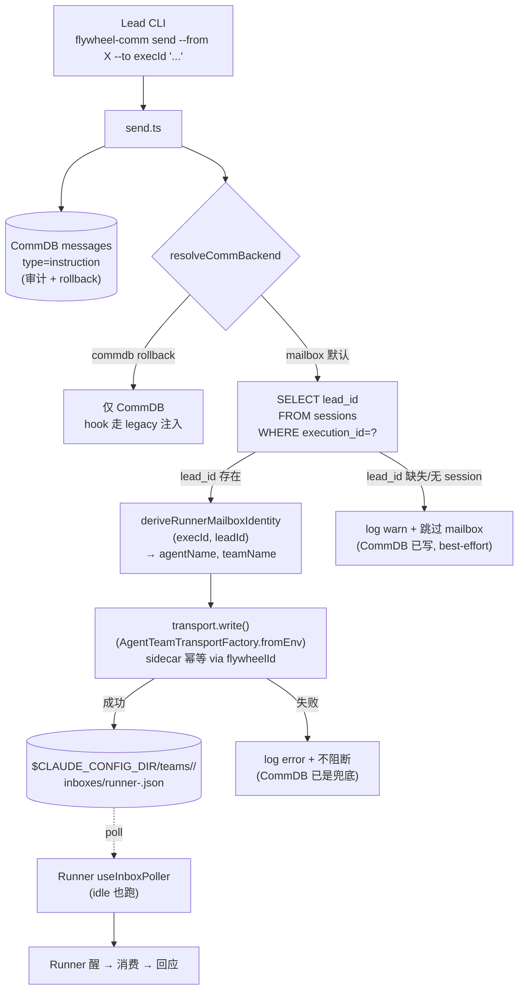

# Plan: `flywheel-comm send` Mailbox Dual-Write — FLY-168

**Version**: v1.28.2
**Issue**: FLY-168 (`flywheel-comm send` 不唤醒 `awaiting_review` Runner — transport-split design gap)
**Date**: 2026-05-25
**Source**: `doc/engineer/exploration/new/FLY-168-comm-send-transport-gap.md`, `doc/engineer/research/new/FLY-168-mailbox-wake-mechanism.md`
**Linear**: https://linear.app/geoforge3d/issue/FLY-168
**Status**: codex-approved (3 rounds, 2026-05-25)

---

## 1. 问题与目标

### 问题

FLY-142 (PR #186) 把 **Bridge → Lead** delivery 从 CommDB 切到 mailbox（claude-code 内建 `useInboxPoller`），并默认给每个 Runner 写 `mailbox-active` sentinel —— sentinel 让 `inbox-check.sh` PostToolUse hook 直接 `exit 0`。

但 **Lead → Runner** 的 `flywheel-comm send` 仍只写 CommDB（`send.ts:13` 单条 `insertInstruction`）。结果：一个 idle 在 `❯`、`awaiting_review` 的 Runner——

- mailbox 没人写（send 不写 mailbox）；
- CommDB 那条 instruction 被 sentinel 短路的 hook 永远不注入；
- 不在 `flywheel-comm gate` 的 15s poll 里（那只 poll gate question）。

→ 指令静默丢弃。2026-05-22 真实事故：Peter 发指令 33 分钟 Runner 没醒，最后靠 `runner_terminal_input` MCP 手动 `send-keys` 兜底。

### 目标

`flywheel-comm send` 在默认 mailbox 模式下**双写**：
1. 写 Runner 的 claude-code mailbox inbox（唤醒，复用 FLY-142 已在生产跑 10+ 天的 `IAgentTeamTransport.write()` 路径）；
2. 保留 CommDB 写入（审计 + rollback 兜底）。

对外不可见：Lead UX 不变（仍只记 `execId`），CLI flag 不变，CommDB schema 不变。

---

## 2. 设计决策（A3-corrected，Research §2 实证）

**Runner mailbox 身份是 `(executionId, leadId)` 的纯确定性函数**：

```
agentName = `runner-${executionId.slice(0, 8)}`
teamName  = leadId
inbox     = <CLAUDE_CONFIG_DIR>/teams/<sanitize(leadId)>/inboxes/<sanitize(agentName)>.json
```

两个输入都已在 CommDB `sessions` 表（`execution_id` PK + `lead_id`，生产路径两个 `registerSession` 写入点都填 leadId，self-register CLI 生产从不调用 → 无 null 覆盖 race）。

→ **零 schema migration**。Brainstorm 担心的「隐性约定脆弱性」用 **shared derive helper** 解决（不在 `send.ts` 硬编码派生字符串）。

> 拒绝 A1（migration + 存列）：多 migration + 3 个写入点改动，换来的解耦收益在「派生是纯函数 + 单一 helper」面前不值得。符合项目 enforce-simplicity / min-surface。

`backend` 判断复用一个 `.trim().toLowerCase()` 的 lenient parser（见 §2.2），避免 FLY-142 r1 踩过的 strict-vs-lenient 不一致坑 + shell 已修过的 whitespace 坑（`claude-lead.sh:81-98`，`FLYWHEEL_COMM_BACKEND=" commdb "` 曾被误判 mailbox）。

### 2.1 包依赖方向（feasibility — 已审计 + Codex r1 确认）

| 包 | 现有依赖 | 关键 |
|---|---|---|
| `flywheel-comm` | `better-sqlite3`, `flywheel-config` | **不**依赖 teamlead / agent-team-transport |
| `flywheel-teamlead` | → `flywheel-comm` + `flywheel-agent-team-transport`（已存在） | 所以 flywheel-comm **不能**反向依赖 teamlead（循环） |
| `flywheel-agent-team-transport` | 仅 `proper-lockfile` | 叶子包，flywheel-comm 可安全 forward-depend |
| `flywheel-config` | — | flywheel-comm + teamlead 已依赖；claude-runner 可加 |

**后果**：`MailboxTransport`（teamlead）、`resolveCommBackend`（`teamlead/plugin.ts:82`）、`buildAgentTeamIdentity`（teamlead）都**不能**被 `send.ts` import。

**解法**：
1. `deriveRunnerMailboxIdentity(execId, leadId)` → 放 **`flywheel-agent-team-transport`**（它本来 own identity；flywheel-comm 加 `workspace:*` 依赖，无循环）并 export；teamlead 的 `buildAgentTeamIdentity` 改 import 它。
2. `resolveCommBackend()` → 放 **`flywheel-config`**（flywheel-comm 已依赖它，无需新边；放 agent-team-transport 则 claude-runner 还得为它加 transport 依赖，不划算）。
3. mailbox 写直接用 `AgentTeamTransportFactory.fromEnv()` 返回的 **`IAgentTeamTransport.write()`**，**不经 teamlead 的 `MailboxTransport.writeVerified` wrapper**（那在 teamlead，不可 import）。裸 `write()` 已在 `ClaudeMailboxCodec.writeMailboxEntry` 内做 lock-cooperative sidecar 幂等（当 `metadata.flywheelId` 存在时）。本路径是 best-effort 唤醒、CommDB 已是 durable 审计 → **不加 `verifyLastWrite`**（省一次 read-after-write；write 失败本身会 throw，catch 即可）。

### 2.2 backend parser 统一范围（Codex r1 #2 — 诚实声明，不过度宣称）

现状有多个 parser：`plugin.ts:82`（TS，run-dispatcher/run-infra 经 `./plugin.js` import 它）、`TmuxAdapter.ts:256-260`（claude-runner，inline，**无 trim**）、`claude-lead.sh:81-98`（shell，已修 trim）。

本 PR 的统一范围：
- 在 `flywheel-config` 定义 `resolveCommBackend()`：`(raw ?? "mailbox").trim().toLowerCase()`，`=== "commdb"` 为 rollback、其余 mailbox，unknown 值 `console.warn` 到 stderr。
- `teamlead/plugin.ts:82` 改为 import/re-export `flywheel-config` 版本（run-dispatcher/run-infra 透传，零额外改动）。
- `TmuxAdapter.ts:256-260` 改用 `flywheel-config` 版本（claude-runner 加 `flywheel-config` 依赖）——**顺带修掉它当前无 trim 的同款 latent bug**，与 shell 的修复对齐。
- `claude-lead.sh` 是 shell，无法 import TS → **保持独立**，文档标注为 mirror，必须与 TS 版行为一致（已有 trim）。
- ⚠️ 不混淆：`AgentTeamTransportFactory.resolveBackendFromEnv()` 解析的是 `FLYWHEEL_AGENT_BACKEND`（claude-code/codex），与 `FLYWHEEL_COMM_BACKEND`（mailbox/commdb）是**不同 env var、不同关注点**。

---

## 3. 架构与数据流



关键不变量：
- **CommDB 写永远先发生且永远不被 mailbox 失败阻断**。mailbox 写是 best-effort 的唤醒增强。
- **`CLAUDE_CONFIG_DIR` 必须一致**（Codex r1 #4）：`send` 写的 inbox 在 `getClaudeConfigDir()`（`path-helpers.ts:33-38`）下。Lead CLI 进程必须与目标 Runner 继承同一个 `CLAUDE_CONFIG_DIR`，否则 `send` 会写到另一棵 inbox 树、Runner 永不醒。生产里 Lead shell 已传播此 env（`claude-lead.sh:728-732`），但 plan 把它做成 test-visible invariant（Phase 3）。

---

## 4. 实施步骤

### Phase 0 — Spike Gate（implement 最早期，**必过才继续**）

验证 idle Runner 的 `useInboxPoller` 真能被 mailbox 写唤醒（Research §5 唯一实证未知）：

1. QA framework A1 slot 起真 Runner，跑到 idle 在 `❯`（`awaiting_review`）。
2. 手写一条合法 mailbox entry 到 `$CLAUDE_CONFIG_DIR/teams/<leadId>/inboxes/runner-<execId8>.json`（用 `AgentTeamTransportFactory.fromEnv().write()` 或 `ClaudeMailboxCodec.writeMailboxEntry`）。
3. Chrome / tmux 观察 Runner 是否在一个 poll 周期内自动醒、消费、回应。
4. **PASS** → 继续 Phase 1。**FAIL** → 暂停，向 Annie 升级（可能需要额外 tmux nudge = product 决策，见 Brainstorm §5.3）。

> mock 不能验证 claude-code 内建 poller 的 idle 行为 —— 必须真机 + 观察（QA E2E 标准）。

### Phase 1 — 下沉 shared helpers

**1a. `deriveRunnerMailboxIdentity` → `flywheel-agent-team-transport`**（export）：

```ts
export function deriveRunnerMailboxIdentity(
  executionId: string,
  leadId: string,
): { agentName: string; teamName: string } {
  return { agentName: `runner-${executionId.slice(0, 8)}`, teamName: leadId };
}
```
- 重构 `run-dispatcher.ts:buildAgentTeamIdentity` 调它（不再内联拼字符串）。

**1b. `resolveCommBackend` → `flywheel-config`**（export，§2.2）：

```ts
export function resolveCommBackend(): "mailbox" | "commdb" {
  const raw = (process.env.FLYWHEEL_COMM_BACKEND ?? "mailbox").trim().toLowerCase();
  if (raw !== "" && raw !== "mailbox" && raw !== "commdb") {
    console.warn(`[flywheel] unknown FLYWHEEL_COMM_BACKEND="${raw}", defaulting to mailbox`); // stderr
  }
  return raw === "commdb" ? "commdb" : "mailbox";
}
```
- `teamlead/plugin.ts:82` 改 import/re-export `flywheel-config` 版（run-dispatcher/run-infra 经 `./plugin.js` 透传，零额外改动）。
- `TmuxAdapter.ts:256-260` inline parse 改用 `flywheel-config` 版（claude-runner 加 `flywheel-config` 依赖）——顺带修掉 inline 版当前**无 trim** 的 latent bug，与 shell（已修）对齐。
- `claude-lead.sh:81-98` shell mirror 保持（无法 import TS），文档标注必须与 TS 版行为一致。

- 单测：`deriveRunnerMailboxIdentity` 正确性；`resolveCommBackend` 覆盖 unset / 空串 / 大小写混合 / `" commdb "`(whitespace) / 显式 `mailbox` / garbage；`buildAgentTeamIdentity` + `plugin.ts` + `TmuxAdapter` 重构后行为不变（snapshot）。

### Phase 2 — `send.ts` dual-write

`packages/flywheel-comm/package.json`：加依赖 `"flywheel-agent-team-transport": "workspace:*"`。

`packages/flywheel-comm/src/commands/send.ts`：CommDB `insertInstruction` 之后追加 best-effort mailbox 写：

```ts
// send() 改 async；CommDB 永远先写
const id = db.insertInstruction(fromAgent, toAgent, content); // durable 审计

if (resolveCommBackend() !== "mailbox") return id;            // rollback: 不写 mailbox
const session = db.getSession(toAgent);
if (!session?.lead_id) {
  console.warn(`[flywheel-comm send] no lead_id for ${toAgent}; mailbox wake skipped (CommDB written)`); // stderr
  return id;
}
const { agentName, teamName } = deriveRunnerMailboxIdentity(toAgent, session.lead_id);
try {
  const transport = AgentTeamTransportFactory.fromEnv();
  await transport.write({
    leadName: teamName,          // 此架构 leadName==teamName==leadId (Research §2.1)
    recipient: agentName,
    payload: {                   // ← Codex r1 #1: MailboxPayload = {from,to,content,metadata?}
      from: fromAgent,
      to: agentName,
      content,
      metadata: { flywheelId: id, execId: toAgent },
    },
  });
} catch (err) {
  console.error(`[flywheel-comm send] mailbox wake failed for ${toAgent}: ${(err as Error).message}`); // stderr, 不阻断
}
return id;
```

要点：
- **payload 形状是 `{from, to, content, metadata?}`**（`agent-team-transport/src/types.ts:42-47`；codec 把 `content` 写进 claude-code 的 `text` 字段）——不是 `{from, text, ...}`。Codex r1 #1 blocking 已修。
- `flywheelId: id` 复用 CommDB message id 做 sidecar 幂等键（`ClaudeMailboxCodec.writeMailboxEntry` 内建，重试不重复注入）。
- `send` 改 **async**：`index.ts:253-291` 的 `runSend()` 改 async 并 `await`；现有 `commands.test.ts:133-210` 的同步 `send()` 调用全部改 `await`。**所有降级/失败日志走 stderr（`console.warn`/`console.error`），stdout 保持与今天一致**（尤其 `--json` 不被污染）。Codex r1 #5。
- `resolveCommBackend` 从 `flywheel-config` import；`deriveRunnerMailboxIdentity` + `AgentTeamTransportFactory` 从 `flywheel-agent-team-transport` import。**不 import teamlead**。
- **不加 `verifyLastWrite`**（§2.1）：best-effort 唤醒，CommDB 是 durable 审计；裸 `write` 失败会 throw → catch 即可。

### Phase 3 — 测试矩阵

| 层 | 用例 | 验证 |
|---|---|---|
| unit | `deriveRunnerMailboxIdentity` | execId 截断 8 位 + leadId 透传 |
| unit | `resolveCommBackend` 边界 | unset / 空串 / 大小写混合 / `" commdb "`(whitespace) / 显式 `mailbox` / garbage → 正确归类 + warn |
| unit | `buildAgentTeamIdentity` + `TmuxAdapter` parse 重构 | 输出与重构前一致 |
| integration | send mailbox 模式（**临时 `CLAUDE_CONFIG_DIR`**） | entry 落在 `transport.getInboxPath(leadId, runner-<execId8>)` 精确路径 **且** CommDB instruction 也写了（Codex r1 #4 path invariant） |
| integration | payload 字段 | inbox entry 的 message body = `content`（验证 `{from,to,content}` 形状没写成 undefined） |
| integration | send rollback (`FLYWHEEL_COMM_BACKEND=commdb`) | **不**写 mailbox，只 CommDB |
| integration | session 无 lead_id / 无 session 行 | 不抛错，CommDB 写成功，warn 到 stderr |
| integration | mailbox 写抛错 | `send` 不抛，CommDB 仍写成功（best-effort 不阻断） |
| integration | stdout 契约 | `send` / `--json` 的 stdout 与今天逐字一致；warn/error 只在 stderr（Codex r1 #5） |
| E2E (spike 复用) | 真 Runner idle → send → 醒 | Phase 0 已覆盖；ship 前再跑一次完整 Lead→send→Runner wake |

### Phase 4 — Ship

- CI 绿 → `:cool:` gate（FLY-2 流程）。
- 部署后验证：真 Lead 对真 idle Runner `flywheel-comm send`，Chrome 观察 Runner 自动醒（不靠手动 nudge）。
- 更新 CLAUDE.md milestone 表 + MEMORY.md。

---

## 5. Rollback

`FLYWHEEL_COMM_BACKEND=commdb`：
- `TmuxAdapter` 不写 sentinel + 注 `FLYWHEEL_DISABLE_MAILBOX_SENTINEL=1`（既有行为）；
- `send.ts` 见 backend≠mailbox → 跳过 mailbox 写，只写 CommDB；
- `inbox-check.sh` 无 sentinel → 走 legacy CommDB 注入。

→ 完整回到 FLY-142 之前的 Lead→Runner 行为，无残留。

---

## 6. 风险

| 风险 | 缓解 |
|---|---|
| idle poller 不唤醒（核心未知） | Phase 0 spike gate，FAIL 即停问 Annie |
| mailbox 写失败 → 指令未即时送达 | CommDB 是 **durable 审计 + rollback substrate，不是 mailbox 模式下的 active delivery fallback**（sentinel 让 `inbox-check.sh:42-48` 提前 exit，hook 不读 CommDB）。缓解 = `console.error` loud 到 stderr + 运维侧 rollback / 手动 resend。**不要**假装有 hook 兜底（Codex r2 #1） |
| `CLAUDE_CONFIG_DIR` 不一致 → 写到未被 poll 的 inbox 树 | 这是**环境不变量**，非运行时可降级项：`transport.write()` 会成功写到 `process.env.CLAUDE_CONFIG_DIR`（或默认 `~/.claude`）那棵树，即使 Runner poll 的是另一棵也**不报错**。覆盖 = Phase 3 临时目录 path-invariant 测试 + 真 Runner E2E。生产里 Lead shell 已传播此 env（`claude-lead.sh:728-732`）。（Codex r2 #2） |
| `send` 改 async 破坏调用点 / 污染 stdout | 审计 `index.ts` 全部 send 调用点 + 改 `await`；日志只走 stderr；stdout 契约测试（Codex r1 #5） |
| 派生规则未来漂移 | shared helper 单一 source；helper 改了两边一起改 |
| 并发写同一 Runner inbox | 裸 `write()` 已用 `ClaudeMailboxCodec` 的 lock-cooperative sidecar + flywheelId 幂等（FLY-142 已处理 concurrent writer） |
| `runner-${execId.slice(0,8)}` 8 位碰撞 | **接受的既有约束**（Codex r1 #6）：这是已上线身份，FLY-168 必须沿用才能命中现有 inbox。32-bit 命名空间非全局防碰撞；存 CommDB 列也不解决（存的是同一派生值）。换更长身份是独立兼容性项目，不在本 issue。 |

---

## 7. 不在 scope

- `respond.ts` 不改：gate 答复靠 Runner 在 `flywheel-comm gate` 的 15s CommDB poll，已工作。一致性迁移另开 issue。
- 不动 Lead identity rules（Lead 仍只记 execId）。
- 不动 CommDB schema（A3 = 零 migration）。
- 不给 claude-code 加 idle/tick hook（Brainstorm Option B 已拒，vendor 级改动）。

---

## 8. 验收

1. Phase 0 spike PASS（idle Runner 被 mailbox 唤醒）。
2. mailbox 模式：`send` 后 inbox 文件 + CommDB 都有该 message。
3. rollback 模式：`send` 只写 CommDB。
4. 降级/失败路径：CommDB 始终写成功，`send` 不抛。
5. 真机 E2E：Lead `send` → idle Runner 自动醒，无需手动 nudge。
6. 全测试矩阵 PASS + CI 绿。
