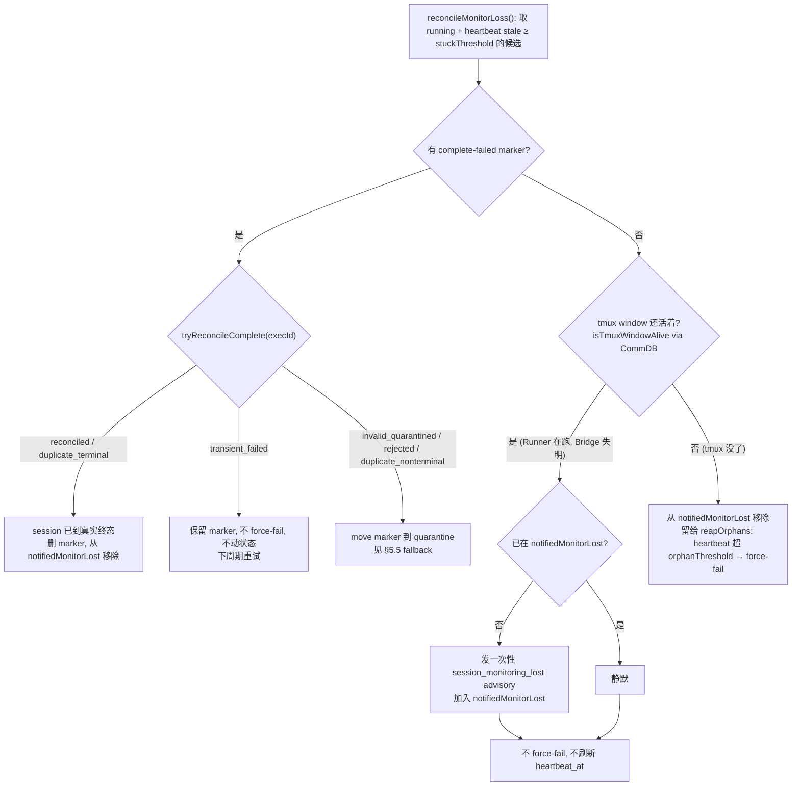
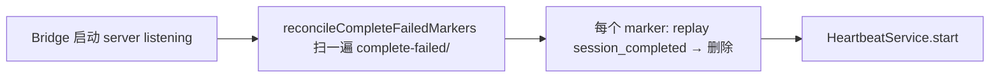

# Plan: Runner Heartbeat Orphan Reconcile — 重启不再误杀活 Runner

**Version**: v1.29.0
**Issue**: FLY-172
**Date**: 2026-05-27
**Source**: Linear FLY-172（生产事故 GEO-374，2026-05-26→27，product-lead Peter 报告）
**Status**: codex-approved（3 轮 review，R3 APPROVED）

> **Codex R3 实现期 guidance（非 blocker，已纳入设计）**：
> 1. `reconcileMonitorLoss()` 是 tmux 探测 + `notifiedMonitorLost` 的**唯一 owner**；`checkStuck()`/`reapOrphans()` 只消费这一 pass 刚算出的 set，禁止各自再探 tmux（避免 split-brain liveness）。
> 2. quarantine fallback 的状态写入：FSM 允许时优先 `applyTransition()`，仅在需要 fail-close 时才用 orphan 式 forced terminal write；`last_error` 必须带 quarantine 路径。
> 3. 必须保留对**真 `/events` 路由 + 生产级 `transitionOpts`（带 FSM enforcement）** 的 integration test，这是防 parity 漂移的关键护栏，不能只用无 FSM 的 `createBridgeApp()` 测试路径。

---

## 1. Problem（真实生产事故）

Flywheel 维护重启/更新（Simba 日常 + launchd fallback）时，一个**正在跑**的 Runner 的心跳停止上报。Bridge 把 session 标成 `status=failed` / `Orphaned: no heartbeat for 61 minutes`，**持续数小时**，但 tmux 里的 Claude 进程一直活着、在干真实的活（GEO-374 字体实现 + PD 验证 + 打印测试）。

**影响**：
- **Annie 失去信任**：反复看到 GEO-374 Runner 显示 stopped/failed，以为系统坏了。
- **Lead 被迫走后门**：Bridge 不再 track `failed` session（事件/comm 不可靠），Peter 只能全程用**直连 tmux**（读终端 + 打命令）盯完整个 Runner。
- 对一个活 session 反复抛假 `session_stuck` / `session_stale_completed`。

## 2. Root Cause（已审计 codebase 确认）

心跳的**发送方不是 Runner 自己**，而是 **Bridge 进程内的监控循环**：

```
run-bridge.ts (Bridge 进程，单进程)
  └─ Blueprint.execute() → TmuxAdapter setInterval(5s) poll loop
        └─ ctx.onHeartbeat() → POST /events/heartbeat → 刷新 session.heartbeat_at
```

tmux Runner 是 **detached session**，独立于 Bridge 进程存活。

`restart-services.sh` 在 `packages/teamlead|core|edge-worker/*` 等变更时 `kill -TERM run-bridge.ts` 重启 Bridge：

1. 所有 in-process Blueprint poll loop 全死 → 不再发心跳。
2. tmux Runner 还活着继续干活。
3. 新 Bridge 的 `inflight` map（`RetryDispatcher`）是空的，**不会重新挂接**已经在跑的 tmux Runner。
4. `HeartbeatService.reapOrphans()`（`orphanThresholdMinutes` 默认 **60min**，每 `stuckCheckIntervalMs`=5min 跑一次）发现 `heartbeat_at` 过期 → **直接 `forceStatus(..., "failed", ...)`**，理由串 `Orphaned: no heartbeat for ${minutes} minutes`。
5. 但 tmux 活着、Runner 在干活 → **假 failed**。

**关键**：reconcile 能力**已经存在** —— `HeartbeatService.checkStaleCompleted()`（GEO-270）就用 `getTmuxTargetFromCommDb` + `isTmuxWindowAlive`（`bridge/tmux-lookup.ts`）检查终态 session 的 tmux 是否还活着。`reapOrphans()` 现在**完全没做这个检查**，无脑 force-fail。

### 2.1 完成检测（Q3）的真相 —— FLY-108 已铺好 80%

- `/spin` 流程**强制**以 `flywheel-comm complete` 结尾（`.claude/commands/spin.md:418`："Never exit /spin without a successful flywheel-comm complete… the only signal Bridge recognizes as Runner finished"）。
- `flywheel-comm complete`（`packages/flywheel-comm/src/commands/complete.ts`）是 **Runner 自己** POST `session_completed` 到 **`FLYWHEEL_BRIDGE_URL/events`（稳定端点，端口默认 9876，launchd 重启端口不变）**，不是会随旧 Bridge 死掉的 callback port（`FLYWHEEL_CALLBACK_PORT`，per-process ephemeral hookServer）。4 次重试 + 指数退避。
- ⇒ **重启后 Runner 正常跑完 → `complete` 命中稳定端点 → session 正确翻终态。这个 case 已经 work，不需改。**

**真正的残留 gap**：`flywheel-comm complete` 4 次重试**全失败**（正好撞 Bridge 重启 downtime，最坏 ~27s）时 fail-close 写 marker：

```
~/.flywheel/state/complete-failed/<execId>.json   # 含完整 session_completed body（route + evidence + PR 号 + summary）
```

**但没有任何东西消费这个 marker。** `complete.ts:290` 作者自己留了注释吐槽 "stale patrol has no record of this failure" —— 那个 stale patrol 从没被造出来。结果：Runner 明明跑完、带着完整结果，session 永远卡 `running`；等 tmux 窗口关了 → `reapOrphans` tmux-dead → force-fail。**完成被误判为失败。**

## 3. Goal

重启/更新后：
1. **活着的 Runner 不再被翻成 `failed`**（Annie/dashboard 状态与现实一致）。
2. 一旦 Bridge 失去对某个活 Runner 的监控 → **一次性 advisory 通知 Lead**，让 Lead 知道要 fallback 到直连 tmux。
3. **收割孤儿 complete-failed marker** → 跑完的 Runner 翻成真实终态（completed/awaiting_review/blocked），而非误 failed。

**设计约束**：event-driven，**零新增周期性轮询**（复用已有 `reapOrphans` 循环 + Bridge boot 一次性扫描）——遵守 FLY-169 教训（Annie 否决周期性轮询，机器 crash/watchman 负载）。

## 4. 前提假设（已由 team-lead 审计验证）

- **生产 Runner 走 `/spin`**：approve gate / ship stage / `flywheel-comm complete` 全建在 /spin 上（`TmuxAdapter.ts:314`、`actions.ts:149`、`spin.md:418`）。⇒ marker 机制对正常产品路径有效。
- **边界（可接受）**：手动起的、不走 /spin 的 session 不写 marker，只能靠 tmux-dead → force-fail。不在正常产品路径里，plan 中注明可接受。
- `restart-services.sh` 只重启 Bridge + Lead，**不碰 Runner tmux**（已确认无 kill-window/kill-session）。

## 5. Design

### 5.0 核心语义修正（Codex R1+R2 后）

- **alive 分支不刷新 `heartbeat_at`**（R1 #1）。刷新会把 session 从 orphan 检测里藏 60min。改为 alive → 只跳过 force-fail、不动 heartbeat_at，session 继续 stale-eligible，下个 5min 周期再验 tmux。Runner 一旦真死，**下一周期立刻**走 dead 分支。
- **marker-first，且 marker 胜过 tmux 存活**（R2 #1）。一个有效终态 marker 可能在 tmux 还活着时就存在（needs_review 留着窗口、或 `complete` exit 1 后 shell 还开着）。所以 reconcile **先查 marker**：有有效终态 marker → replay 翻终态（不管 tmux 死活）；无 marker 才看 tmux 存活。
- **统一的"监控丢失" reconcile pass，跑在 `checkStuck()` 之前，独占 `notifiedMonitorLost`**（R2 #4）。监控丢失指纹 = `running` + heartbeat stale（≥ stuckThreshold 没收到任何心跳，正常每 5s 一次）。这一个 pass 对每个候选只探一次 tmux，并据此**增删** `notifiedMonitorLost`（alive 加入、dead 移除），`checkStuck()` 随后只跳过仍在 set 里的（即仍 alive 的）→ 既消除 15–60min 误 `session_stuck`，又不会在 Runner 后来死了时继续抑制 stuck/dead 信号。

### 5.1 check() 顺序 + 统一 reconcile pass

`HeartbeatService.check()` 新顺序：
1. `retryUndeliveredGuardrailEvents()`（不变）
2. **`reconcileMonitorLoss()`（新）** — 见下方状态机，独占 tmux 探测 + `notifiedMonitorLost` 增删 + marker-first
3. `checkStuck()` — 跳过仍在 `notifiedMonitorLost` 的 session
4. `reapOrphans()` — 只对 reconcile 后**仍是 running 且 heartbeat 超 orphanThreshold 且 tmux dead 且无可收割 marker** 的 session force-fail（即 reconcile pass 没处理掉的真·孤儿）
5. `checkStaleCompleted()`（不变）



> reapOrphans 仍是 dead 真·孤儿的最终 force-fail 点，但 marker 收割已被 reconcile pass 前置（marker-first），所以"有效终态 marker"永远在 force-fail 之前被处理——无论 tmux 死活、无论 boot 前后。

### 5.2 Bridge boot drain



- boot drain 是 **boot 事件触发（非 timer）**，快速兜住"Runner 在 Bridge 重启那一刻完成"的高频 case。
- `reapOrphans` 里的 marker 检查是**安全网**，兜住 boot 之后才落地的 marker。两者都复用已有循环/boot，**不加任何 setInterval**。

### 5.3 Marker replay 机制（方案 A，强化成功判定）

marker JSON 已含完整 event body（`event_id`、`execution_id`、`issue_id`、`project_name`、`event_type=session_completed`、`source`、`payload{decision,evidence,sessionRole,...}`）。

**replay 方式 = 方案 A（loopback HTTP self-POST）**（Codex R1 决策点 #3 确认采纳 A，**不**抽 in-process `ingestEvent()`，避免 refactor 面 + parity 漂移）。

**loopback URL 必须匹配实际监听地址**（Codex #5）：从 `config.host`（可能是 `127.0.0.1` / `localhost` / `::1`）+ 实际监听 port 推导 base URL，IPv6 要加方括号 `http://[::1]:<port>/events`；auth 用 `config.ingestToken`（不要硬编码 `127.0.0.1`）。

**删除 marker 不能只看 HTTP 2xx，且预期终态必须用 `/events` 同一套映射算**（Codex R1 #3 + R2 #6，关键）：`/events` 在 invalid route / FSM reject 时仍返回 `200 {ok:true, warning:...}`，且 `insertEvent` 在 session 更新前就写了 `event_id`（之后同 id 重试会 duplicate no-op）。所以 replay 后必须：
1. **先从 marker payload 算出预期终态** `expectedStatus`，用与 `event-route.ts` session_completed 分支**完全相同**的映射（不能只笼统认 "completed/awaiting_review/blocked"）：
   - `route=needs_review` + `evidence.landingStatus.status=merged` → `completed`；否则 → `awaiting_review`
   - `route=auto_approve` + merged → `completed`；否则 → `awaiting_review`
   - `route=blocked` → `blocked`
   - `route` 缺失 + 当前是 `approved_to_ship`（natural-completion）→ `completed`
   - 其它（缺失 route 且非 post-approve-ship）→ event-route 会 200+warning 跳过 → 归 `rejected`
2. POST marker body → 拿 response。
3. **重读 `store.getSession(execId)` 校验是否 == `expectedStatus`**（而非只看 `response.ok`）。
4. 只有命中 `expectedStatus` 才删 marker。

**`tryReconcileComplete(execId)` 返回 discriminated 结果**（Codex R1 #4 + R2 #2）：
```
type ReconcileResult =
  | "absent"               // 无 marker
  | "reconciled"           // replay 后 session == expectedStatus → 删 marker
  | "duplicate_terminal"   // {duplicate:true} 且 session 已 == expectedStatus → 删 marker
  | "duplicate_nonterminal"// {duplicate:true} 但 session 仍非终态 → 同 event_id 重试永远 no-op，不重试 → quarantine + fallback
  | "transient_failed"     // Bridge 5xx / 网络 / 连不上 → 保留 marker, 不 force-fail, 下周期/下次 boot 重试
  | "invalid_quarantined"  // marker JSON 损坏/字段缺失/文件名 execId 与 payload 不匹配 → quarantine
  | "rejected"             // replay 返回 warning（invalid route / FSM 拒绝）→ quarantine + fallback
```
处理规则：
- `reconciled` / `duplicate_terminal` → session 已是真实终态，删 marker，从 `notifiedMonitorLost` 移除。
- `transient_failed` → 阻止 force-fail，保留 marker 等重试（幂等安全）。
- `duplicate_nonterminal` / `invalid_quarantined` / `rejected` → 走 §5.5 fallback（quarantine + 明确终态，不留 dead session 卡 running）。
- `absent` → 不是 marker case，回落到 tmux 存活判定 / reapOrphans。

### 5.4 Advisory：`session_monitoring_lost`

- 新事件类型，加入 `GUARDRAIL_EVENT_TYPES`（`lead-runtime.ts`）→ **可靠投递 + 失败重试**（Lead 必须收到才知道要盯 tmux；Codex 决策点 #4 确认 guardrail 合适）。
- EventFilter 分类 = `notify_agent`，**priority 设 `normal`**（Codex #4：guardrail 的可靠性 与 是否要 ping Annie 是两码事；除非产品要求 Annie 被通知，否则 normal 即可）。
- 通过现有 `RegistryHeartbeatNotifier.deliverHook()` 路径投递（与 stuck/orphan/stale 同源）。
- `notification_context`：自然语言，例如 "Runner {issueId} 在 Bridge 重启后失联监控，但 tmux 还活着、仍在干活。请留意，必要时用直连 tmux 盯它。"
- **一次性**：`HeartbeatService` 新增 `notifiedMonitorLost: Set<string>`。**不随 heartbeat 刷新而 prune**（且本设计 alive 分支根本不刷新 heartbeat）；只在 session 离开 `running`（到终态）时 prune → 每 session 每 Bridge 进程生命周期只发一次。

### 5.5 marker quarantine + fallback（Codex R2 #3，明确终态）

`duplicate_nonterminal` / `invalid_quarantined` / `rejected` 的处理**必须明确、自洽**（不能像 R1 那样自相矛盾地说"不删原 marker"又说"移到 quarantine"）：

1. **move**（不是 copy）marker 到 `~/.flywheel/state/complete-failed-quarantine/<execId>.json` —— 离开源目录，所以 boot drain / reconcile pass 下次看到 `absent`，不会反复处理同一坏 marker。
2. **fallback 终态**：这类 marker 意味着 Runner 确实结束过、但 completion 无法被干净 replay。**不能把一个已死的 session 留在 `running`**：
   - 若此时 tmux **dead** → 把 session 置 `failed`（或 payload route=blocked 时置 `blocked`），`last_error` 指向 quarantine 路径（例如 `complete reconcile rejected, evidence quarantined at <path>`），方便人工排查。
   - 若此时 tmux **alive**（marker 无效但 Runner 还活着）→ 不动 session 状态，按 monitor-lost 处理（发 advisory），等 Runner 自己再次 `complete` 或真死。
3. 记一条 guardrail 级别的 error 日志。

> 关键不变量：reconcile/​reap 跑完后，**不存在"已死 + 卡在 running" 的 session**；也**不存在"反复处理的坏 marker"**。

## 6. 改动文件清单

| 文件 | 改动 |
|------|------|
| `packages/teamlead/src/bridge/complete-marker-reconciler.ts` | **新增**。`reconcileCompleteFailedMarkers(deps)`（boot drain：扫目录 + 逐个 replay + 按结果删/quarantine）；`tryReconcileComplete(execId, deps)`（reapOrphans 用，返回 §5.3 的 discriminated `ReconcileResult`）。replay = loopback self-POST，base URL 从 `config.host`+port 推导（IPv6 加括号），auth 用 `config.ingestToken`，**replay 后重读 `store.getSession` 校验终态**才删 marker；损坏/被拒 → quarantine。 |
| `packages/teamlead/src/HeartbeatService.ts` | (1) `check()` 顺序：retryUndelivered → **`reconcileMonitorLoss()`（新）** → checkStuck → reapOrphans → checkStaleCompleted。(2) `reconcileMonitorLoss()` = 统一 pass：取 running+heartbeat-stale 候选，**marker-first**（`tryReconcileComplete`，有效终态 marker 胜过 tmux 存活），无 marker 再探 tmux：alive→advisory 一次 + 不动 heartbeat、加入 `notifiedMonitorLost`；dead→移出 set，留给 reapOrphans。(3) `checkStuck()` 跳过仍在 `notifiedMonitorLost` 的（即仍 alive 的）。(4) reapOrphans 只 force-fail reconcile pass 没处理掉的真·孤儿（dead + 无 marker + 超 orphanThreshold）。(5) 新增 `notifiedMonitorLost` set（dead 时移除 + terminal 时 prune）+ 注入 reconciler/config。 |
| `packages/teamlead/src/StateStore.ts` | 无 schema 改动。确认 `getOrphanSessions` / 新增一个 `getMonitorLostCandidates(staleMinutes)`（running + heartbeat stale ≥ staleMinutes）供 monitor-lost 判定（避免 alive 分支不刷新 heartbeat 时仍能稳定取到候选）。`getSession` 用于 replay 后终态校验。 |
| `packages/teamlead/src/bridge/lead-runtime.ts` | `GUARDRAIL_EVENT_TYPES` 加 `session_monitoring_lost`。 |
| `packages/teamlead/src/bridge/EventFilter.ts` | `session_monitoring_lost` → `notify_agent`，priority `normal`。 |
| `packages/teamlead/src/bridge/hook-payload.ts` | `HookPayload.event_type` 加 `session_monitoring_lost`（若是 union 类型）。 |
| `packages/teamlead/src/bridge/plugin.ts` | boot：server listening 后、`heartbeatService.start()` 前调用 `reconcileCompleteFailedMarkers()`。`RegistryHeartbeatNotifier` 实现 `onSessionMonitoringLost`。给 `HeartbeatService` 注入 reconciler + `config`（host/port/ingestToken）。 |
| `HeartbeatNotifier` interface | 加 `onSessionMonitoringLost(session, minutesSinceHeartbeat)`；no-op notifier 也补。 |

## 7. Test Plan（TDD）

**Unit（vitest）**：
- `reconcileMonitorLoss` + reapOrphans：
  - marker-first：有有效终态 marker 且 **tmux 仍 alive** → 仍 replay 翻终态、删 marker（验证 R2 #1 marker 胜过 tmux 存活）。
  - 无 marker + tmux alive → **不 force-fail、不刷新 heartbeat_at**，发一次 `onSessionMonitoringLost`，第二次同 session 不再发。
  - alive(15min 已 advisory) 后 Runner 真死（下一周期 tmux dead）→ **从 `notifiedMonitorLost` 移除**，不再抑制 stuck/dead，无 marker 时由 reapOrphans force-fail（验证 R2 #4 + "下一周期"语义，不需等满 60min）。
  - 无 marker + tmux dead + heartbeat 超 orphanThreshold → reapOrphans force-fail（回归保护）。
- `checkStuck` 抑制（R1 #2 + R2 #4）：
  - running + last_activity stale + heartbeat stale + tmux alive → reconcile pass 先归类 monitor-lost → **checkStuck 不发 `session_stuck`**（覆盖 15–60min 窗口）。
  - running + stuck 但 tmux dead → reconcile pass 已把它移出 set → checkStuck **仍正常发** session_stuck（回归保护，验证 R2 #4 不会过度抑制）。
- `complete-marker-reconciler` / `tryReconcileComplete`：
  - 预期终态映射（R2 #6）：分别用 needs_review / needs_review+merged / auto_approve / auto_approve+merged / blocked / 缺失route+approved_to_ship 构造 marker → 断言算出的 `expectedStatus` 与 event-route 映射一致，且只在命中时删 marker。
  - boot drain：多个 marker → replay + 终态校验 + 删；transient 失败保留。
  - replay 返回 `200 + warning`（invalid route / FSM reject）→ `rejected` → quarantine + fallback（R1 #3 + R2 #3）。
  - `{duplicate:true}` 且 session 已终态 → `duplicate_terminal` 删 marker；`{duplicate:true}` 但 session 仍 running → `duplicate_nonterminal` → quarantine + fallback（**不**同 id 重试，R2 #2）。
  - Bridge 连不上 / 5xx → `transient_failed` → 保留 marker，不 force-fail。
  - 损坏/部分 JSON marker → `invalid_quarantined`，不崩。
  - 文件名 execId 与 payload execId 不匹配 → `invalid_quarantined`（R1 #7）。
  - 路径穿越/异常文件名防护。
  - quarantine fallback：tmux dead → session 置 failed/blocked + `last_error` 指向 quarantine 路径（**无 dead+running 残留**，R2 #3）；tmux alive → 不动状态、走 advisory。
  - **loopback URL**：`config.host` = `127.0.0.1` / `localhost` / `::1`（IPv6 加括号）三种都能正确构造 + 命中 listener（R1 #5）。
- `EventFilter`：`session_monitoring_lost` → notify_agent + priority normal。

**Integration（real marker + real Bridge HTTP）**：
- 起真 Bridge（in-test express + 真 StateStore + transitionOpts），写真 marker 文件到 temp HOME，跑 reconciler → 断言 session 经 `/events` 真路径翻成**与映射一致**的终态 + marker 被删。**这条不能 mock**——验证 loopback self-POST 与 event-route 的真实 parity（含 strict route guard / FSM）。
- 同 `event_id` replay 两次（boot drain 跑两遍）→ 第二遍 `duplicate_terminal`，状态不变、marker 已删，幂等安全。

**真实 E2E / real-tmux probe（infra 改动必须，遵守 MEMORY 教训）**：
- 真 tmux：起一个 detached tmux window 当"活 Runner"，构造一个 heartbeat 过期的 running session → 跑 reconcile pass → 断言**不被 fail**、**heartbeat_at 未被改动**、advisory 发出。
- `tmux kill-window` 杀掉 → 下一轮 reconcile/reap → 无 marker → force-fail；有 marker → replay 终态。
- ⚠️ MEMORY 教训：mock 可能假设错误的 tmux 行为（FLY-169 真 cmux spike 抓到 mock 漏掉的 silent no-op）。本 issue 的 `isTmuxWindowAlive`（`list-panes`）行为必须真 tmux 验证。

## 8. Codex Design Review — 已敲定的决策（R1+R2）

1. **marker 收割范围**：覆盖 `/spin` + `flywheel-comm complete`（生产路径，§4 已验证）；其它终态发射器明确非目标（§9）。✅
2. **boot drain + reconcile pass 双保险**：保留双保险；reconcile pass 做成 **marker-first**（不只 tmux-dead 才查 marker），有效终态 marker 胜过 tmux 存活。✅
3. **replay 用方案 A（loopback self-POST）**，不抽 in-process `ingestEvent()`；但成功判定必须重读 `getSession` 校验预期终态、不依赖同 id 重试。✅
4. **`session_monitoring_lost` = guardrail（可靠重试）+ EventFilter priority `normal`**（除非产品要 ping Annie）。✅
5. **alive 分支不刷新 heartbeat_at**；`notifiedMonitorLost` 的 stuck 抑制做成 current-liveness-aware（reconcile pass 在 dead 时移除），消除"Runner 后来死了仍被抑制"的 race。✅

> 上述为 R1+R2 review 收敛后的最终决策，记录于此供实现期对齐。

## 9. 非目标（明确不做）

- **不**重建 Bridge 启动时对活 Runner 的完整监控/poll loop 重挂接（方案 B/更大改动，Annie 选了方案 A）。
- **不**改 `restart-services.sh` 的重启策略本身。
- **不**动 FLY-129 的 60s sync_additive reconcile、不加新周期 timer。
- **marker 收割只覆盖 `/spin` + `flywheel-comm complete` 路径**（Codex #6）。其它终态发射器（`ExecutionEventEmitter.emitCompleted`、`DirectEventSink.emitCompleted`）**不写** complete-failed marker，故不在收割范围内——这是**明确的非目标**，不暗示"所有丢失的终态事件都被 reconcile"。测试只断言 `/spin` marker 路径被覆盖（假设见 §4：生产 Runner 都走 /spin）。
- **不**抽取 in-process `ingestEvent()`（方案 B）——保留 loopback self-POST 以最大化与 canonical `/events` 路径的 parity（Codex 决策点 #3）。
