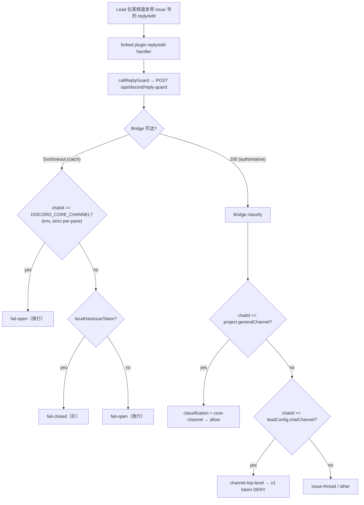

# Plan: Routing Guard Core-Channel Exemption — FLY-173

**Version**: v1.29.0
**Issue**: FLY-173 (Routing guard 过于激进：core channel 完全禁止 issue 引用，阻碍 founder↔Lead 沟通)
**Date**: 2026-05-27
**Source**: FLY-173 (Linear) + 审计 FLY-162 Layer 2 实现 + 与 Annie 三轮 brainstorm（team-lead 转达）
**Status**: **codex-approved** (R2, 2026-05-27 — R1 的 6 项全部 fold in；R2 APPROVED + 4 条非阻塞实现注意，见 §11)

> Annie 已锁 scope（**选 A**：Bridge 侧 core 豁免 + Discord 插件本地兜底 core fail-open）。不做"语义区分决策 vs 信息性消息"（FLY-162 plan 自己否决过那条路）。本 plan 把"core 频道整体豁免"这一刀落地成 file change list / AC / rollout。

---

## 0. Audit Baseline（已验证 codebase 事实）

| 资产 | 文件 / 行 | 状态 |
|------|-----------|------|
| guard 来源 | commit `7541805`（PR #192，FLY-162 Layer 2；**不是** team-lead 最初猜的 `b046a45`=FLY-129 归档 commit） | ✅ 已核实 |
| 纯决策函数 `evaluateReplyGuard` + `ChatClassification` union | `packages/teamlead/src/bridge/reply-guard.ts:24,78` | ✅ |
| guard 路由（分类 + 调 evaluate） | `packages/teamlead/src/bridge/tools.ts:864-937`（`POST /api/discord/reply-guard`） | ✅ 路由已能拿到 `projects`（`tools.ts:895` 已 `projects.find`） |
| 当前分类逻辑 | `tools.ts:907-921`：`chatId === leadConfig.chatChannel` → `channel-top-level`；否则查 thread → `issue-thread` / `other` | ✅ |
| **根因** | `cos-lead`（Simba）的 `chatChannel` = `1487340532610109520` = **core 频道本身**（`~/.flywheel/projects.json:38` + `.env:DISCORD_CORE_CHANNEL`） | ✅ 已核实 |
| `ProjectEntry.generalChannel?: string`（项目 core 频道字段，**interface 已存在**） | `ProjectConfig.ts:83`；`LeadAlertNotifier.ts:264-265` 用它做 alert→core fallback | ✅ interface 存在 — **但 `loadProjects()` 未校验该字段，且 projects.json 未填**（Codex R1 #2 纠正：本 plan 需补校验） |
| 插件 tmux env 传播机制（`-e` allowlist，**非继承**） | `claude-lead.sh:701-728` env_args allowlist；`TEAMLEAD_ISSUE_PREFIXES` 在 `:716` 显式 `-e` 转发；`:756-761` 注释说明 pane 不继承任意 launcher env | ✅ — **export 不够，必须加 `-e`**（Codex R1 #1） |
| `loadProjects()` 配置源优先级 | `ProjectConfig.ts:91-100`：先读 env `FLYWHEEL_PROJECTS`，无则 fallback `~/.flywheel/projects.json` | ✅ — rollout 需 precheck（Codex R1 #5） |
| `check-discord-plugin.sh` 现状 | 仅 grep `allowBots`（cache+marketplace 两路径）+ 比对 **cache** `.fork-sha`；**不** grep `callReplyGuard`/`DISCORD_CORE_CHANNEL`，**不**比对 marketplace `.fork-sha` | ✅ — rollout 需强化 marker（Codex R1 #4） |
| 三 flag prod 全开 | `.env:18,39,40`（chat_threads + reply_by_issue + reply_guard）；`TEAMLEAD_ISSUE_PREFIXES` 未设→默认 `FLY,GEO` | ✅ |
| 插件本地兜底（Bridge 宕机时） | fork `external_plugins/discord/server.ts:93-159` `callReplyGuard`：catch 块 `localHasIssueToken(text)` → fail-closed，**完全不认 core 频道** | ✅ 已核实 |
| 插件 env 注入点 | `claude-lead.sh:177-184` export `BRIDGE_URL`/`TEAMLEAD_API_TOKEN`/`TEAMLEAD_ISSUE_PREFIXES` 到 Lead pane；插件作为 Lead 子进程读 `process.env.*` | ✅ |
| PROJECT_NAME 解析（node 读 projects.json 的现成 pattern） | `claude-lead.sh:251-260` | ✅ 可复用来 resolve generalChannel |
| 插件 fork 部署机制 | `update-discord-plugin.sh` reset --hard origin/main 同步 **cache + marketplace 两路径**；`check-discord-plugin.sh` grep marker；fork main 已带 `callReplyGuard`（FLY-162） | ✅（FLY-20/FLY-29/FLY-162 §12.11） |
| 现有 guard 单测 | `reply-guard.test.ts`（353 行；含 line 141 "ALLOWS 'other' channels (core channel)" —— **证明 plan 当初就假设 core 会落 `other`**，正是 bug） | ✅ |

**结论**：core 频道 id 字段（`generalChannel`）+ 路由拿 `projects` + 插件 env 注入点 + fork 部署机制全部现成。本 plan 工作量在 (1) reply-guard 加一个 `core-channel` 分类 + 路由加一个前置判断、(2) `loadProjects()` 补 `generalChannel` 校验、(3) 插件 `callReplyGuard` **catch 分支**加 core fail-open（抽 `isCoreChannel` helper）、(4) claude-lead.sh 经 tmux `-e` 转发 `DISCORD_CORE_CHANNEL`、(5) 单测 + 真 E2E。**零新增配置字段、零 DB 迁移、零新 plumbing。**

---

## 1. Problem / Goal

### Problem（根因，比 issue 描述更精确）

FLY-162 Layer 2 的 guard 把"是不是某 Lead 的 chatChannel 顶层"用 `chatId === leadConfig.chatChannel` 判定。但 **cos-lead（Simba）的 `chatChannel` 配置值就是 core 频道 `1487340532610109520` 本身**。于是：

- **Simba 在 core 发任何带 issue 号的消息** → 命中 `channel-top-level` → **被硬拦**。而 Simba 正是每日 triage 优先级清单（核心产出就是"按优先级列 issue 号"）的产出者。
- **Peter/Oliver 在 core 发同样消息** → 他们的 chatChannel 不是 core → 落 `other` → **放行**。
- 现状自相矛盾："只挡 Simba、不挡 Peter/Oliver"。

FLY-162 plan §12.7 白纸黑字写过"core channel / other 分类不做任何 hard 规则（跨部门 standup 引用 issue 合法）"——**plan 本就打算放行 core**，只是没料到 cos-lead 的 chatChannel == core 频道，分类塌缩导致误伤。product-experience-spec §2.1/§5.1：早会、triage、跨部门协调全在 Core Room 进行，在 core 列 issue 号是核心正常流。

### Goal

1. **core 频道整体豁免**：发到项目 core 频道（`generalChannel`）的消息，即使含 issue 号、即使 core 恰好 == 某 Lead 的 chatChannel，也放行。
2. **保留 guard 合理内核**：部门频道（Peter/Oliver 私有 chatChannel）顶层的 per-issue 内容**仍走 thread**（cross-talk 防护原样不动）。
3. **Bridge 在线 / 宕机行为一致**（选 A）：插件本地兜底也认 core 频道 → core fail-open，不留"Bridge 宕机期 FLY-173 复发"尾巴。

### Non-Goals

- ❌ 语义区分"决策 vs 信息性/概览/协调"消息（FLY-162 自己因"需要语义判断、会误伤"否决过；违背 simplicity）。
- ❌ 纯链接放行白名单（core 已整体豁免使其多余；对部门频道则等于开 cross-talk 绕过口）。
- ❌ 动 Peter/Oliver 私有 chatChannel 顶层的 guard（部门频道 per-issue 决策应走 thread）。
- ❌ 新增 DB 表 / schema 迁移 / 新配置字段。

---

## 2. Core Channel ID 来源（技术决定，交 Codex 把关）

| 侧 | 来源 | 理由 |
|----|------|------|
| **Bridge**（healthy path，**authoritative**） | per-project `ProjectEntry.generalChannel`（interface 已存在，本 plan 补校验） | 路由已 resolve `project`；per-project、未来多项目友好；**单一事实源**（projects.json） |
| **Plugin（仅 Bridge 不可达 catch path 兜底）** | env `DISCORD_CORE_CHANNEL`，**严格 per-pane 派生自同项目的 generalChannel** | 见下"严格派生"+"catch-path-only" |

**严格派生（strict derivation，Codex R1 #3）**：claude-lead.sh 从 projects.json resolve **该 pane 项目的 `generalChannel`**，注入为 `DISCORD_CORE_CHANNEL`（复用 line 251-260 node pattern）。**若项目找到但 `generalChannel` 缺失 → 留 `DISCORD_CORE_CHANNEL` 不设 + 打 warning，绝不 fallback 到全局 env 旧值**。理由：全局 env `DISCORD_CORE_CHANNEL`（`.env` 现有 `1487340532610109520`）与 projects.json 可能不一致；若插件用全局值短路放行、而 Bridge 因 generalChannel 未填而不豁免，就出现"插件放行/Bridge 拒"的分叉。严格派生保证插件 core id ≡ Bridge core id（都来自 generalChannel）。

**catch-path-only（Codex R1 #3）**：插件的 core 放行**只放在 `callReplyGuard` 的 Bridge-不可达 catch 分支里**（不是函数顶部）。这样——
- **Bridge 健康时**：插件照常调 Bridge，Bridge 用 `generalChannel` 权威判定（core 放行）。插件**不**抢先覆盖 Bridge，消除分叉 footgun。
- **Bridge 宕机时**：catch 分支里先判 `chatId == DISCORD_CORE_CHANNEL` → fail-open（放行），否则才走原 `localHasIssueToken` fail-closed 逻辑。

满足 Annie"在线/宕机一致"：两种状态下 core 都放行，且永远以 Bridge 为准、无抢跑分叉。

**为什么不全用 env**：env 全局单值多项目串台；Bridge 用 per-project `generalChannel` 才对。插件每个 pane 只服务一个项目，claude-lead.sh 注入该项目 generalChannel，两侧同源。

**向后兼容**：`generalChannel` 不填 → Bridge 无豁免（维持当前行为）+ 插件 env 不设（catch 分支无 core 放行，维持当前行为）。安全默认，不误放行、不分叉。

---

## 3. Architecture (Mermaid)

> 注（Codex R1 #3）：core 放行**仅在 catch（Bridge 不可达）分支**做；Bridge 健康时一律以 Bridge 的 `generalChannel` 判定为准，插件不抢跑 → 无"插件放行/Bridge 拒"分叉。在线/宕机两态下 core 都放行（一致）。

---

## 4. File Change List

### 4.1 Bridge（TypeScript）

| 文件 | 改动 | LOC ≈ |
|------|------|-------|
| `packages/teamlead/src/bridge/reply-guard.ts` | `ChatClassification` union 加 `"core-channel"`；`evaluateReplyGuard` 开头对 `classification === "core-channel"` 返回 `{ allow: true }`（不 deny、不 telemetry，语义同 `other` 但显式可测/可读） | +6 |
| `packages/teamlead/src/bridge/tools.ts`（guard 路由 ~907-921） | classification 块加**第一分支**（排在 `chatId === leadConfig.chatChannel` 之前）：`if (project.generalChannel && chatId === project.generalChannel) { classification = "core-channel"; } else if (chatId === leadConfig.chatChannel) { ... }` | +4 |
| `packages/teamlead/src/bridge/__tests__/reply-guard.test.ts` | 见 §6 测试清单 | +60 |

**`ProjectConfig.ts`（改动，Codex R1 #2）**：`loadProjects()` 补 `generalChannel` 校验——若 present，必须是非空 string（与 `chatChannel` 校验同款）。interface 字段已存在，只加 validate 分支。

**不动**：`config.ts`（无新 env/flag）、`plugin.ts`（`projects` 已传 router）、`StateStore.ts`。

| 文件 | 改动 | LOC ≈ |
|------|------|-------|
| `packages/teamlead/src/ProjectConfig.ts`（`loadProjects()`） | 加 `generalChannel` 校验：present 时须非空 string，否则 throw（与现有 chatChannel/alertChannel 校验风格一致） | +6 |
| `packages/teamlead/src/__tests__/ProjectConfig.test.ts`（或现有 config 测试文件） | 加 case：valid generalChannel / 缺失（OK，optional）/ 空串（throw）/ 非 string（throw） | +30 |

### 4.2 Plugin Fork（单独 PR 到 `github.com/xrliAnnie/claude-plugins-official`）

| 文件 | 改动 |
|------|------|
| `external_plugins/discord/server.ts` `callReplyGuard`（~93-159） | **catch 分支内**（Bridge 不可达时，在 `localHasIssueToken` 判断**之前**）加 core 放行：`const coreChannel = process.env.DISCORD_CORE_CHANNEL; if (coreChannel && chatId === coreChannel) return null /* fail-open: core exempt */`。**不放函数顶部**（Codex R1 #3：保持 Bridge 健康时权威，无抢跑分叉）。为可单测，把 core 判断抽成一个纯小函数（如 `isCoreChannel(chatId)`）导出 |

> 只改 `callReplyGuard` 一处即覆盖 `reply` 和 `edit_message`（两者都经过它，`server.ts:777-779,859-862`）。Bridge 健康时 core 由 Bridge 的 `core-channel` 分类放行（不经此分支）。

### 4.3 Launcher（env 注入 — 必须 `-e` 转发，非 export）

| 文件 | 改动 |
|------|------|
| `packages/teamlead/scripts/claude-lead.sh` | (1) 在 `PROJECT_NAME` export（:262）**之后**，用 node 读 projects.json resolve 该项目的 `generalChannel`（复用 :251-260 pattern），赋给 shell 变量；**项目找到但 generalChannel 缺失 → 留空 + log warning，不 fallback 全局 env**（Codex R1 #3 严格派生）。(2) **关键**：tmux pane 不继承 launcher env（`:756-761` 注释），必须在 env_args allowlist（:701-728，`TEAMLEAD_ISSUE_PREFIXES` 的 `-e` 在 :716 旁）加 `-e "DISCORD_CORE_CHANNEL=${DISCORD_CORE_CHANNEL:-}"`（Codex R1 #1）。仅 `export` 到不了插件进程 |

### 4.4 Config / Ops（rollout step，非 repo-tracked）

| 项 | 改动 |
|----|------|
| `~/.flywheel/projects.json` | geoforge3d 项目对象加 `"generalChannel": "1487340532610109520"`。**Precheck（Codex R1 #5）**：先确认运行中的 Bridge/Lead 环境**没有**设 `FLYWHEEL_PROJECTS`（它会覆盖 projects.json）；若设了，需同步改 env 提供的 project 配置 |
| `~/.flywheel/bin/check-discord-plugin.sh`（ops-side，rollout 时改，Codex R1 #4） | 现状只 grep `allowBots` + 比对 **cache** `.fork-sha`，**证明不了 marketplace 路径装了新 core short-circuit**。rollout（fork PR 落地后）强化：(1) 在 **cache 与 marketplace 两路径**都 grep 新 marker（`DISCORD_CORE_CHANNEL` 或 `isCoreChannel`）；(2) **marketplace `.fork-sha` 也比对**（不止 cache）。**仅在 rollout step 改**（fork 已同步两路径后），避免 deployed 旧 plugin 立刻报 STALE 触发 update cascade 干扰在线 Lead（FLY-162 §12.10 教训） |

---

## 5. Acceptance Criteria

### Bridge 侧

- **AC1**: `evaluateReplyGuard({ classification: "core-channel", issueTokens: [≥1] })` → `{ allow: true }`（不 deny、不 telemetry）。
- **AC2**: guard 路由：当 `project.generalChannel` 已设且 `chatId === project.generalChannel` → 分类 `core-channel` → 放行，**即使 chatId 同时 == leadConfig.chatChannel**（Simba 场景：core == cos-lead chatChannel）。断言 core 优先于 channel-top-level。
- **AC3**: **回归保护** — Peter/Oliver 在自己私有 chatChannel（≠ generalChannel）顶层发 ≥1 issue token → 仍 `channel-top-level` → **DENY**（cross-talk 防护未破）。
- **AC4**: **向后兼容** — `project.generalChannel` 未设（undefined）→ 分类逻辑与当前完全一致（chatChannel→top-level / thread→issue-thread / 其它→other），不误放行。
- **AC5**: core 频道发零 issue token 的 free-form → 放行（与今同）；issue-thread 内 foreign token soft telemetry 行为不变。

### Plugin 侧（catch-path-only，Codex R1 #3）

- **AC6**: Bridge **健康**时，`callReplyGuard` 照常调 Bridge 并按其响应返回（core 由 Bridge `core-channel` 分类放行）；插件**不**在健康路径抢先短路（断言：Bridge 返 200 时 fetch 被调用一次）。
- **AC7**: Bridge **不可达**（fetch 抛错 / 5xx / timeout）+ `chatId === process.env.DISCORD_CORE_CHANNEL`（已设）→ catch 分支返回 `null`（fail-open 放行），无论 text 是否含 issue token。
- **AC8**: Bridge 不可达 + **非** core 频道 + 含 issue token → 仍 fail-closed（TC-02 防护未破）。
- **AC8b**: `DISCORD_CORE_CHANNEL` 未设时，`callReplyGuard` 行为与今完全一致（健康透传 / 宕机 hybrid fail policy，无 core 放行分支生效）。

### Launcher 侧

- **AC9**: 启动一个 cos-lead（Simba）pane 后，**在 Lead 的插件进程 env 里**（不只是 launcher shell）`DISCORD_CORE_CHANNEL` == 该项目 generalChannel（`1487340532610109520`）——验证 `-e` allowlist 转发生效（Codex R1 #1）。
- **AC9b**: 项目存在但 `generalChannel` 缺失时，pane env 中 `DISCORD_CORE_CHANNEL` **不被设为全局旧值**（严格派生，Codex R1 #3）；launcher 打 warning。

### 端到端（真 E2E，不能只 mock）

- **AC10**: Simba 在 `#geoforge3d-core` 发带 ≥1 个 GEO/FLY 号的 triage 清单 → **放行成功投递**（Bridge 健康路径，Chrome Discord 观察）。
- **AC11**: Peter 在自己私有 chatChannel 顶层发带 issue 号的状态 → **仍被 guard 拦**（tool result `BLOCKED by routing guard`），证明部门频道 cross-talk 防护没破。
- **AC12**: 模拟 Bridge 不可达（停 Bridge），Simba 在 core 发带 issue 号消息 → 插件 catch 分支 core 放行 → **仍放行**（验证"在线/宕机一致"）。
- **AC13（smoke，Codex R1 #5）**: 重启后 curl Bridge 路由 `{ projectName:"geoforge3d", leadId:"cos-lead", chatId:"1487340532610109520", text:"FLY-173" }` → 返回 `{ allow:true }`（证明 generalChannel 已被 Bridge 实际读到，配置源没被 `FLYWHEEL_PROJECTS` 覆盖）。

---

## 6. 测试清单

### 单元（`reply-guard.test.ts`，复用现有 describe 结构）

- `evaluateReplyGuard`：`core-channel` + ≥1 token → allow（AC1）；`core-channel` + 0 token → allow。
- 路由 describe：
  - mock project 带 `generalChannel`，`chatId == generalChannel`（且同时 == cos-lead chatChannel）→ allow（AC2）。
  - `chatId == 部门 lead chatChannel`（≠ generalChannel）+ token → deny（AC3 回归）。
  - project 无 `generalChannel` → 旧分类不变（AC4）。

### 单元（ProjectConfig，Codex R1 #2）

- `loadProjects()`：generalChannel valid / 缺失(OK) / 空串(throw) / 非 string(throw)。

### 单元（plugin，Codex R1 #6 — 需先让 helper 可测）

插件 fork 目前 `external_plugins/discord/` **无测试脚手架**，`callReplyGuard` 是 `server.ts` 内局部函数。落地方式（二选一，实现时定）：
- **(优先)** 把 core 判断抽成导出的纯函数 `isCoreChannel(chatId)`（+ 若可行，让 `callReplyGuard` 的 fetch/env 可注入），加最小 vitest/node test：Bridge 健康→fetch 被调一次（AC6）；Bridge 抛错 + core → null（AC7）；Bridge 抛错 + 非 core + token → fail-closed（AC8）；env 未设→原逻辑（AC8b）。
- 若 fork 加测试脚手架成本过高，则插件行为**全部**靠 §下方真 E2E 覆盖，并在 PR 里说明。

### E2E（QA，真跑，slot Chrome Discord 观察）

- AC10 / AC11 / AC12 / AC13。**插件改动必须真 E2E**（mock 测不到 plugin runtime + tmux `-e` env 注入 + Discord 投递）。

测试命令：`pnpm -F flywheel-teamlead test`（Bridge 侧 reply-guard + ProjectConfig）。

---

## 7. Rollout

0. **Precheck（Codex R1 #5）**：确认运行中的 Bridge/Lead 环境**没有**设 `FLYWHEEL_PROJECTS`（`env | grep FLYWHEEL_PROJECTS`）；若设了，改 env 提供的 project 配置而非（或同时）改 projects.json。
1. **Bridge 代码 merge**（三 flag prod 已开，无需动 flag）。含 reply-guard `core-channel` + tools.ts 分类 + ProjectConfig 校验 + claude-lead.sh `-e` 转发。
2. **projects.json 加 `generalChannel`** → 重启 Bridge（`curl /health` 200 + auth smoke + **AC13 core-allow smoke curl**）。
3. **claude-lead.sh 改动随 Bridge 包部署**（Lead 下次 restart 生效）。
4. **Plugin fork PR merge 到 fork `origin/main`**（`update-discord-plugin.sh` reset --hard origin/main 是唯一 deploy 通道，branch cp 会被 startup auto-update 清掉，FLY-162 §12.13 教训）→ 同步 **cache + marketplace 两路径**。
5. **强化 `check-discord-plugin.sh`**（fork 已同步两路径**后**才改）：两路径 grep 新 marker（`DISCORD_CORE_CHANNEL`/`isCoreChannel`）+ 比对 marketplace `.fork-sha` → 确认两路径都装了 core short-circuit、非 STALE。
6. **重启所有 Leads**（让新 claude-lead.sh `-e` 注入 + 新 plugin 生效）；**AC9 验证 pane env** 真有 `DISCORD_CORE_CHANNEL`。⚠ 与 worker-fly-172 PR #202 协调 Bridge 重启顺序（team-lead 统一调度，避免重启打架）。
7. **QA E2E**：AC10/11/12/13 全 PASS（Chrome Discord 观察）才算通过。

### Rollback

- Bridge 侧：projects.json 删 `generalChannel` → 重启 Bridge → 恢复旧行为（无需 revert 代码，安全默认兜底）。
- Plugin 侧：fork revert catch 分支 core 放行 → `update-discord-plugin.sh` 重新同步两路径；check 脚本 marker 回退。
- 无 DB 迁移，无需回滚数据。

---

## 8. Risk Matrix

| Risk | L | I | Mitigation |
|------|---|---|------------|
| `generalChannel` 忘填 → 豁免不生效（Simba 仍被拦） | Med | Med | rollout step 2 显式加；AC13 smoke curl + AC10 E2E 验证；team-lead checklist |
| 插件 env 仅 `export` 未 `-e` → pane 拿不到 → 宕机期仍拦（Codex R1 #1） | **High→Low** | Med | §4.3 强制 `-e` allowlist 转发；AC9 验 pane env（不只 launcher shell）；AC12 E2E |
| 插件用全局 env 旧值短路、Bridge 不豁免 → 分叉放行（Codex R1 #3） | **Med→Low** | High | catch-path-only（健康时 Bridge 权威）+ 严格 per-pane 派生（generalChannel 缺失则不设 env）；AC6/AC9b |
| 多项目时 env 全局单值串台 | Low | Med | claude-lead.sh per-pane resolve 该项目 generalChannel；当前单项目无影响 |
| core 豁免误放行部门频道 cross-talk | Low | High | core 豁免严格按 `chatId == generalChannel`；AC3/AC11 回归断言 + E2E |
| `generalChannel` 未校验 → 配错（如数组/空串）静默失效（Codex R1 #2） | Low | Med | loadProjects() 加校验 + ProjectConfig.test |
| `FLYWHEEL_PROJECTS` 覆盖 projects.json → 改了没生效（Codex R1 #5） | Low | Med | rollout step 0 precheck + AC13 smoke curl |
| plugin fork drift（FLY-29） | Med | Low | 改动极小（callReplyGuard catch 分支一处 + isCoreChannel helper）；fork PR 单独 review |
| marketplace 副本 stale → 插件改动不生效（Codex R1 #4） | Med | Med | `update-discord-plugin.sh` 同步两路径；`check-discord-plugin.sh` 强化：两路径 grep 新 marker + 比对 marketplace `.fork-sha` |
| 与 PR #202(FLY-172) Bridge 重启打架 | Med | Low | team-lead 统一调度 ship 顺序 |

---

## 9. Decisions Log

| Date | Decision | Source |
|------|----------|--------|
| 2026-05-27 | core 频道整体豁免（不做语义区分决策vs信息消息） | Annie via team-lead（3 轮 brainstorm） |
| 2026-05-27 | 选 A：连插件本地兜底一起改，Bridge 在线/宕机一致，无复发尾巴 | Annie |
| 2026-05-27 | Peter/Oliver 私有 chatChannel 不动；纯链接放行不做 | Annie + worker 审计 |
| 2026-05-27 | core 频道 id：Bridge 用 per-project `generalChannel`（已存在字段），插件用 env `DISCORD_CORE_CHANNEL`（claude-lead.sh 从 projects.json resolve 后注入） | worker-fly-173（交 Codex 把关） |
| 2026-05-27 | 复用 `ProjectEntry.generalChannel`，不新增配置字段 | worker 审计（LeadAlertNotifier 已用） |
| 2026-05-27 | 插件 core 放行改为 **catch-path-only**（Bridge 健康时权威），不放函数顶部 → 消除"插件放行/Bridge 拒"分叉 | Codex R1 #3 |
| 2026-05-27 | 插件 env **严格 per-pane 派生** generalChannel，generalChannel 缺失则不设、不 fallback 全局旧值 | Codex R1 #3 |
| 2026-05-27 | `DISCORD_CORE_CHANNEL` 必须经 tmux `-e` allowlist 转发（仅 export 到不了插件进程） | Codex R1 #1 |
| 2026-05-27 | `loadProjects()` 补 `generalChannel` 校验（present→非空 string） | Codex R1 #2 |
| 2026-05-27 | rollout 加 `FLYWHEEL_PROJECTS` precheck + core-allow smoke curl + 强化 check-discord-plugin 两路径 marker | Codex R1 #4/#5 |

---

## 11. Codex R2 非阻塞实现注意（/implement 时遵守）

1. **claude-lead.sh 必须显式清掉继承的全局 `DISCORD_CORE_CHANNEL`**：`.env` 里有 legacy 全局值 `1487340532610109520`，会被 pane 继承。"generalChannel 缺失 → 不设" 必须实现成**实际清空/置空**该变量（`unset` 或 `=""`），否则旧全局值泄漏进 pane，严格派生失效。AC9b 守这条。
2. **优先用 `ProjectConfig.loadProjects()` 解析 generalChannel**，不要在 claude-lead.sh 里手写 `jq`/node 解析 `~/.flywheel/projects.json`——这样 launcher 与 `FLYWHEEL_PROJECTS` override 行为对齐（precheck 万一发现 override 在用也不会脱节）。
3. **插件单测不要直接 import `server.ts`**：该文件在 module load 时无 `DISCORD_BOT_TOKEN` 会 exit、且会登录 Discord（顶层副作用）。把 `isCoreChannel` / guard helper 放到**无副作用的独立模块**再测，否则退化到 §6 文档化的真 E2E 覆盖。
4. （已修正）§0 audit 结论原"函数顶部短路 / claude-lead.sh export"措辞已更新为 catch-path + `-e` 转发，与 §4.2/§4.3 一致。

## 10. References

- 根因代码：`packages/teamlead/src/bridge/reply-guard.ts`、`tools.ts:864-937`、`~/.flywheel/projects.json:38`
- FLY-162 Layer 2 plan（guard 原始设计 + §12.7 core 豁免意图 + §12.10/12.11 plugin rollout）：`doc/engineer/plan/archive/v1.28.0-FLY-162-lead-thread-routing.md`
- `ProjectEntry.generalChannel`：`packages/teamlead/src/ProjectConfig.ts:83`；`LeadAlertNotifier.ts:264-265`
- 插件兜底：fork `external_plugins/discord/server.ts:93-159`
- env 注入：`packages/teamlead/scripts/claude-lead.sh:177-184,251-262`
- plugin fork 部署：`update-discord-plugin.sh` / `check-discord-plugin.sh`（FLY-20/FLY-29）
- product-experience-spec §2.1（早会/triage 在 Core Room）、§5.1（Core Room 是协调中心）
