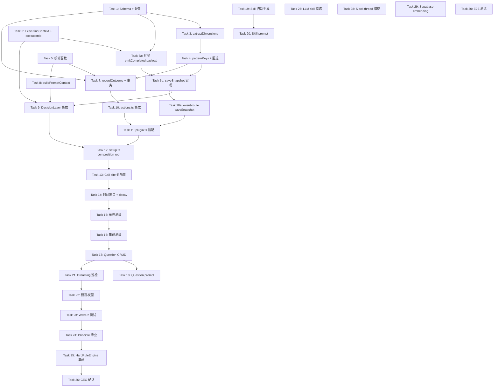

# Plan: CIPHER — Full-Scope Decision Memory

**Version**: v1.3.0
**Issue**: GEO-149
**Date**: 2026-03-15
**Source**: `doc/engineer/exploration/new/GEO-149-cipher-decision-memory.md`, `doc/engineer/research/new/GEO-149-cipher-knowledge-architecture.md`
**Status**: codex-approved

---

## 概述

CIPHER (Continuous Intelligent Pattern Harvesting for Execution Routing) — 五层知识系统，让 Decision Layer 从 CEO 的 approve/reject 历史中学习。

**核心架构**：独立 `cipher.db` + 单写者模型 (TeamLead 写, edge-worker 读) + CipherWriter/CipherReader 分离。

**五层模型**：

| 层 | 职责 | Wave |
|----|------|------|
| Experience | CEO 决策完整上下文快照 | 1 |
| Insight | Beta-Binomial 统计 + Wilson bound | 1 |
| Question | 低置信度区域标记 | 2 |
| Skill | 可复用决策模式提炼 | 2 |
| Principle | 高置信度 → HardRuleEngine 自动规则 | 3 |

---

## 依赖关系图



---

## Wave 1: 数据基础（16 tasks）

### Task 1: Schema 创建 + CipherWriter/CipherReader 骨架

**文件**：
- 新建 `packages/edge-worker/src/cipher/CipherWriter.ts`
- 新建 `packages/edge-worker/src/cipher/CipherReader.ts`
- 新建 `packages/edge-worker/src/cipher/types.ts`
- 新建 `packages/edge-worker/src/cipher/index.ts`

**内容**：创建 8 张表 + CipherWriter/CipherReader 类骨架。

```typescript
// packages/edge-worker/src/cipher/types.ts
/**
 * Pre-decision observable features — only fields known BEFORE DecisionLayer runs.
 * Post-decision fields (systemRoute, confidenceBand, decisionSource) are stored
 * in decision_snapshots directly but NOT used as pattern keys for lookup.
 */
export interface PatternDimensions {
  primaryLabel: string;
  sizeBucket: 'tiny' | 'small' | 'medium' | 'large';
  areaTouched: 'frontend' | 'backend' | 'auth' | 'test' | 'config' | 'mixed';
  exitStatus: 'completed' | 'timeout' | 'error';
  hasPriorFailures: boolean;
  commitVolume: 'single' | 'few' | 'many';
  diffScale: 'trivial' | 'small' | 'medium' | 'large';
  hasTests: boolean;
  touchesAuth: boolean;
}

export interface SnapshotParams {
  executionId: string;
  issueId: string;
  issueIdentifier: string;
  issueTitle: string;
  projectId: string;
  issueLabels: string[];  // full label list for Experience snapshot
  dimensions: PatternDimensions;
  patternKeys: string[];
  systemRoute: string;
  systemConfidence: number;
  decisionSource: string;
  decisionReasoning?: string;
  commitCount: number;
  filesChanged: number;
  linesAdded: number;
  linesRemoved: number;
  diffSummary?: string;
  commitMessages: string[];
  changedFilePaths: string[];
  exitReason: string;
  durationMs: number;
  consecutiveFailures: number;
}

export interface OutcomeParams {
  executionId: string;
  ceoAction: 'approve' | 'reject' | 'defer';
  ceoActionTimestamp: string;
  sourceStatus?: string;
}

export interface PatternStatistics {
  patternKey: string;
  approveCount: number;
  rejectCount: number;
  totalCount: number;
  posteriorMean: number;
  wilsonLower: number;
  maturityLevel: 'exploratory' | 'tentative' | 'established' | 'trusted';
}

export interface CipherContext {
  relevantPatterns: PatternStatistics[];
  globalApproveRate: number;
  promptText: string;
}
```

```typescript
// packages/edge-worker/src/cipher/CipherWriter.ts
import initSqlJs, { type Database } from "sql.js";
import { readFileSync, writeFileSync, existsSync, renameSync, mkdirSync } from "node:fs";
import { dirname } from "node:path";

const SCHEMA_SQL = `
CREATE TABLE IF NOT EXISTS decision_snapshots (
  execution_id TEXT PRIMARY KEY,
  issue_id TEXT NOT NULL,
  issue_identifier TEXT NOT NULL,
  issue_title TEXT NOT NULL,
  project_id TEXT NOT NULL,
  issue_labels TEXT NOT NULL,
  size_bucket TEXT NOT NULL,
  area_touched TEXT NOT NULL,
  system_route TEXT NOT NULL,
  system_confidence REAL NOT NULL,
  decision_source TEXT NOT NULL,
  decision_reasoning TEXT,
  commit_count INTEGER NOT NULL,
  files_changed INTEGER NOT NULL,
  lines_added INTEGER NOT NULL,
  lines_removed INTEGER NOT NULL,
  diff_summary TEXT,
  commit_messages TEXT,
  changed_file_paths TEXT,
  exit_reason TEXT NOT NULL,
  duration_ms INTEGER NOT NULL,
  consecutive_failures INTEGER NOT NULL DEFAULT 0,
  pattern_keys TEXT NOT NULL,
  created_at TEXT NOT NULL DEFAULT (datetime('now'))
);

CREATE TABLE IF NOT EXISTS decision_reviews (
  id TEXT PRIMARY KEY,
  execution_id TEXT NOT NULL UNIQUE,
  ceo_action TEXT NOT NULL,
  ceo_outcome TEXT NOT NULL,
  friction_score TEXT NOT NULL DEFAULT 'low',
  ceo_action_timestamp TEXT NOT NULL,
  notification_timestamp TEXT,
  time_to_decision_seconds INTEGER,
  thread_ts TEXT,
  thread_message_count INTEGER,
  ceo_message_count INTEGER,
  source_status TEXT,
  created_at TEXT NOT NULL DEFAULT (datetime('now')),
  FOREIGN KEY (execution_id) REFERENCES decision_snapshots(execution_id)
);
CREATE INDEX IF NOT EXISTS idx_reviews_outcome ON decision_reviews(ceo_outcome);
CREATE INDEX IF NOT EXISTS idx_reviews_created ON decision_reviews(created_at);

CREATE TABLE IF NOT EXISTS decision_patterns (
  pattern_key TEXT PRIMARY KEY,
  approve_count INTEGER NOT NULL DEFAULT 0,
  reject_count INTEGER NOT NULL DEFAULT 0,
  total_count INTEGER NOT NULL DEFAULT 0,
  maturity_level TEXT NOT NULL DEFAULT 'exploratory',
  first_seen_at TEXT NOT NULL,
  last_seen_at TEXT NOT NULL,
  last_90d_approve INTEGER DEFAULT 0,
  last_90d_total INTEGER DEFAULT 0
);

CREATE TABLE IF NOT EXISTS review_pattern_keys (
  review_id TEXT NOT NULL,
  pattern_key TEXT NOT NULL,
  is_approve INTEGER NOT NULL,
  created_at TEXT NOT NULL,
  PRIMARY KEY (review_id, pattern_key),
  FOREIGN KEY (review_id) REFERENCES decision_reviews(id)
);
CREATE INDEX IF NOT EXISTS idx_rpk_pattern ON review_pattern_keys(pattern_key);
CREATE INDEX IF NOT EXISTS idx_rpk_created ON review_pattern_keys(created_at);

CREATE TABLE IF NOT EXISTS pattern_summary_cache (
  id TEXT PRIMARY KEY DEFAULT 'global',
  global_approve_count INTEGER DEFAULT 0,
  global_reject_count INTEGER DEFAULT 0,
  global_approve_rate REAL DEFAULT 0.5,
  prior_strength INTEGER DEFAULT 10,
  last_computed_at TEXT NOT NULL DEFAULT (datetime('now'))
);

CREATE TABLE IF NOT EXISTS cipher_skills (
  id TEXT PRIMARY KEY,
  name TEXT NOT NULL,
  description TEXT NOT NULL,
  source_pattern_key TEXT,
  trigger_conditions TEXT NOT NULL,
  recommended_action TEXT NOT NULL,
  confidence REAL NOT NULL,
  sample_count INTEGER NOT NULL,
  derived_from_reviews TEXT,
  derived_by TEXT NOT NULL DEFAULT 'statistical',
  status TEXT NOT NULL DEFAULT 'draft',
  created_at TEXT NOT NULL DEFAULT (datetime('now')),
  updated_at TEXT NOT NULL DEFAULT (datetime('now'))
);

CREATE TABLE IF NOT EXISTS cipher_principles (
  id TEXT PRIMARY KEY,
  skill_id TEXT NOT NULL,
  rule_type TEXT NOT NULL,
  rule_definition TEXT NOT NULL,
  confidence REAL NOT NULL,
  sample_count INTEGER NOT NULL,           -- 物化自 parent skill 的 sample_count
  source_pattern TEXT NOT NULL DEFAULT '',  -- 可渲染描述, e.g. "label:bug — 95% reject rate"
  graduation_criteria TEXT NOT NULL,
  status TEXT NOT NULL DEFAULT 'proposed',
  activated_at TEXT,
  retired_at TEXT,
  retired_reason TEXT,
  created_at TEXT NOT NULL DEFAULT (datetime('now')),
  FOREIGN KEY (skill_id) REFERENCES cipher_skills(id)
);

CREATE TABLE IF NOT EXISTS cipher_questions (
  id TEXT PRIMARY KEY,
  question_type TEXT NOT NULL,
  description TEXT NOT NULL,
  related_pattern_key TEXT,
  evidence TEXT NOT NULL,
  asked_at TEXT,
  resolved_at TEXT,
  resolution TEXT,
  status TEXT NOT NULL DEFAULT 'open',
  created_at TEXT NOT NULL DEFAULT (datetime('now'))
);
`;

export class CipherWriter {
  private db!: Database;

  private constructor(private dbPath: string) {}

  static async create(dbPath: string): Promise<CipherWriter> {
    const writer = new CipherWriter(dbPath);
    await writer.init();
    return writer;
  }

  private async init(): Promise<void> {
    mkdirSync(dirname(this.dbPath), { recursive: true });
    const SQL = await initSqlJs();
    if (existsSync(this.dbPath)) {
      const buffer = readFileSync(this.dbPath);
      this.db = new SQL.Database(buffer);
    } else {
      this.db = new SQL.Database();
    }
    this.db.run(SCHEMA_SQL);
    this.db.run(
      `INSERT OR IGNORE INTO pattern_summary_cache (id) VALUES ('global')`
    );
    this.save();
  }

  private save(): void {
    const data = this.db.export();
    const tmpPath = this.dbPath + '.tmp';
    writeFileSync(tmpPath, Buffer.from(data));
    renameSync(tmpPath, this.dbPath);  // atomic replace — reader never sees partial file
  }

  private runInTransaction<T>(fn: () => T): T {
    this.db.run('BEGIN TRANSACTION');
    try {
      const result = fn();
      this.db.run('COMMIT');
      this.save();
      return result;
    } catch (err) {
      this.db.run('ROLLBACK');
      throw err;
    }
  }

  async saveSnapshot(params: SnapshotParams): Promise<void> { /* Task 6 */ }
  async recordOutcome(params: OutcomeParams): Promise<void> { /* Task 7 */ }
  async refreshTemporalWindows(): Promise<void> { /* Task 14 */ }

  close(): void {
    this.db.close();
  }
}
```

```typescript
// packages/edge-worker/src/cipher/CipherReader.ts
import initSqlJs from "sql.js";
import { readFileSync, existsSync } from "node:fs";
import type { ExecutionContext } from "flywheel-core";
import type { CipherContext } from "./types.js";

export class CipherReader {
  constructor(private dbPath: string) {}

  async buildPromptContext(ctx: ExecutionContext): Promise<CipherContext | null> {
    /* Task 8 */
    return null;
  }
}
```

**测试**：
- `CipherWriter.create()` 创建 db 文件，包含 8 张表
- `CipherReader` 对不存在的 db 返回 null
- Schema 版本检查

**Commit**: `feat(cipher): add schema + CipherWriter/CipherReader skeleton`

---

### Task 2: ExecutionContext 扩展 — 加 executionId

**文件**：
- `packages/core/src/decision-types.ts` — 加字段
- `packages/edge-worker/src/Blueprint.ts:466-490` — 构造时传入

**变更**：

```typescript
// packages/core/src/decision-types.ts
export interface ExecutionContext {
  executionId: string;  // NEW — from Blueprint session
  // ... all existing fields unchanged
}
```

```typescript
// packages/edge-worker/src/Blueprint.ts:466
const execCtx: ExecutionContext = {
  executionId: env.executionId,  // NEW
  issueId: hydrated.issueId,
  // ... rest unchanged
};
```

**影响面**（测试 fixture 需要加 `executionId`）：
- `packages/edge-worker/src/__tests__/DecisionLayer.test.ts`
- `packages/edge-worker/src/__tests__/HaikuTriageAgent.test.ts`
- `packages/edge-worker/src/__tests__/HaikuVerifier.test.ts`
- `packages/edge-worker/src/__tests__/HardRuleEngine.test.ts`
- `packages/edge-worker/src/__tests__/FallbackHeuristic.test.ts`
- `packages/edge-worker/src/__tests__/Blueprint.test.ts`

所有测试 fixture 中的 `ExecutionContext` 加上 `executionId: 'test-exec-id'` 即可编译通过。

**Commit**: `feat(core): add executionId to ExecutionContext`

---

### Task 3: Pattern 维度提取 — extractDimensions()

**文件**：新建 `packages/edge-worker/src/cipher/dimensions.ts`

**纯函数**，无 I/O 依赖。

```typescript
// packages/edge-worker/src/cipher/dimensions.ts
import type { ExecutionContext } from "flywheel-core";
import type { PatternDimensions } from "./types.js";

const AUTH_PATHS = /\/(auth|login|session|token|password|middleware|guard)\b/i;
const TEST_PATHS = /\.(test|spec)\.(ts|js|tsx|jsx)$|\/__tests__\//;
const FRONTEND_PATHS = /\/(components?|pages?|views?|hooks?|styles?|css)\b/i;
const CONFIG_PATHS = /\.(ya?ml|json|toml|env|config)\b/i;

export function extractDimensions(ctx: ExecutionContext): PatternDimensions {
  const primaryLabel = ctx.labels[0] ?? 'unlabeled';

  const totalLines = ctx.linesAdded + ctx.linesRemoved;
  const sizeBucket: PatternDimensions['sizeBucket'] =
    totalLines <= 20 ? 'tiny' :
    totalLines <= 100 ? 'small' :
    totalLines <= 500 ? 'medium' : 'large';

  const areaTouched = classifyArea(ctx.changedFilePaths);
  const exitStatus = ctx.exitReason;
  const hasPriorFailures = ctx.consecutiveFailures > 0;

  const commitVolume: PatternDimensions['commitVolume'] =
    ctx.commitCount <= 1 ? 'single' :
    ctx.commitCount <= 5 ? 'few' : 'many';

  const diffScale: PatternDimensions['diffScale'] =
    ctx.filesChangedCount <= 2 ? 'trivial' :
    ctx.filesChangedCount <= 5 ? 'small' :
    ctx.filesChangedCount <= 15 ? 'medium' : 'large';

  const hasTests = ctx.changedFilePaths.some(p => TEST_PATHS.test(p));
  const touchesAuth = ctx.changedFilePaths.some(p => AUTH_PATHS.test(p));

  return {
    primaryLabel,
    sizeBucket,
    areaTouched,
    exitStatus,
    hasPriorFailures,
    commitVolume,
    diffScale,
    hasTests,
    touchesAuth,
  };
}

function classifyArea(paths: string[]): PatternDimensions['areaTouched'] {
  if (paths.length === 0) return 'mixed';

  let frontend = 0, backend = 0, auth = 0, test = 0, config = 0;
  for (const p of paths) {
    if (AUTH_PATHS.test(p)) auth++;
    else if (TEST_PATHS.test(p)) test++;
    else if (CONFIG_PATHS.test(p)) config++;
    else if (FRONTEND_PATHS.test(p)) frontend++;
    else backend++;
  }

  const total = paths.length;
  if (auth > total * 0.5) return 'auth';
  if (test > total * 0.5) return 'test';
  if (config > total * 0.5) return 'config';
  if (frontend > 0 && backend > 0) return 'mixed';
  if (frontend > backend) return 'frontend';
  return 'backend';
}
```

**测试**：
- `extractDimensions` 正确分类 label, size, area
- 空 paths → 'mixed'
- auth-heavy paths → 'auth'
- test-only paths → 'test'

**Commit**: `feat(cipher): add extractDimensions pure function`

---

### Task 4: Pattern Key 生成 + 分层回退

**文件**：新建 `packages/edge-worker/src/cipher/pattern-keys.ts`

**纯函数**。

```typescript
// packages/edge-worker/src/cipher/pattern-keys.ts
import type { PatternDimensions } from "./types.js";

/**
 * Generate pattern keys from pre-decision dimensions only.
 * 9 singles + 5 curated pairs + 1 triple = 15 keys.
 *
 * Post-decision fields (systemRoute, confidenceBand, decisionSource) are
 * stored in decision_snapshots for analysis but NOT used as lookup keys,
 * because CipherReader runs BEFORE the decision and cannot know them.
 *
 * Key format: `dimA:valA` (single) | `dimA+dimB:valA+valB` (pair)
 * Lookup order: triple → pairs → singles → global.
 */
export function generatePatternKeys(d: PatternDimensions): string[] {
  const keys: string[] = [];

  // 9 single-dimension keys (pre-decision only)
  keys.push(`label:${d.primaryLabel}`);
  keys.push(`size:${d.sizeBucket}`);
  keys.push(`area:${d.areaTouched}`);
  keys.push(`exit:${d.exitStatus}`);
  keys.push(`failures:${d.hasPriorFailures}`);
  keys.push(`commits:${d.commitVolume}`);
  keys.push(`diff:${d.diffScale}`);
  keys.push(`tests:${d.hasTests}`);
  keys.push(`auth:${d.touchesAuth}`);

  // 5 curated pair keys (domain-relevant combinations)
  keys.push(`label+size:${d.primaryLabel}+${d.sizeBucket}`);
  keys.push(`area+size:${d.areaTouched}+${d.sizeBucket}`);
  keys.push(`label+area:${d.primaryLabel}+${d.areaTouched}`);
  keys.push(`exit+failures:${d.exitStatus}+${d.hasPriorFailures}`);
  keys.push(`auth+size:${d.touchesAuth}+${d.sizeBucket}`);

  // 1 triple key
  keys.push(`label+area+size:${d.primaryLabel}+${d.areaTouched}+${d.sizeBucket}`);

  return keys;
}

/**
 * Hierarchical fallback: from most specific to most general.
 * Returns keys grouped by specificity level.
 *
 * Specificity is determined by counting dimension segments (the part
 * before ':'), NOT by splitting the entire key string on '+'.
 * Example: `label+size:bug+small` → 2 dimensions (pair), not 3 segments.
 */
export function getFallbackOrder(keys: string[]): string[][] {
  const triples: string[] = [];
  const pairs: string[] = [];
  const singles: string[] = [];

  for (const key of keys) {
    const dimPart = key.split(':')[0];  // e.g. "label+size" from "label+size:bug+small"
    const dimCount = dimPart.split('+').length;
    if (dimCount >= 3) triples.push(key);
    else if (dimCount === 2) pairs.push(key);
    else singles.push(key);
  }

  return [triples, pairs, singles];
}
```

**测试**：
- 生成 15 个 key（9 singles + 5 pairs + 1 triple）
- getFallbackOrder 按 `:` 左侧维度段计数，正确分组
- `label+size:bug+small` 被归为 pair（2 维度），不是 triple
- 各 key 格式正确

**Commit**: `feat(cipher): add patternKeys + hierarchical fallback`

---

### Task 5: Beta-Binomial + Wilson 统计函数

**文件**：新建 `packages/edge-worker/src/cipher/statistics.ts`

**纯函数**。

```typescript
// packages/edge-worker/src/cipher/statistics.ts
import type { PatternStatistics } from "./types.js";

const Z_90 = 1.645;

/** Bayesian posterior mean with Beta-Binomial smoothing. */
export function posteriorMean(
  approves: number,
  total: number,
  globalApproveRate: number,
  priorStrength: number = 10,
): number {
  const alpha = globalApproveRate * priorStrength;
  const beta = (1 - globalApproveRate) * priorStrength;
  return (approves + alpha) / (total + alpha + beta);
}

/** Wilson score lower bound at 90% confidence. */
export function wilsonLowerBound(approves: number, total: number): number {
  if (total === 0) return 0;
  const p = approves / total;
  const z2 = Z_90 * Z_90;
  const denominator = 1 + z2 / total;
  const center = p + z2 / (2 * total);
  const spread = Z_90 * Math.sqrt((p * (1 - p) + z2 / (4 * total)) / total);
  return Math.max(0, (center - spread) / denominator);
}

/** Classify maturity level based on sample count. */
export function maturityLevel(total: number): PatternStatistics['maturityLevel'] {
  if (total < 10) return 'exploratory';
  if (total < 20) return 'tentative';
  if (total < 50) return 'established';
  return 'trusted';
}

/** Map CEO action to 3-class outcome. */
export function classifyOutcome(
  ceoAction: 'approve' | 'reject' | 'defer',
  timeToDecisionSeconds?: number,
): 'fast_approve' | 'approve_after_review' | 'reject_or_block' {
  if (ceoAction === 'reject' || ceoAction === 'defer') return 'reject_or_block';
  if (timeToDecisionSeconds !== undefined && timeToDecisionSeconds <= 300) return 'fast_approve';
  return 'approve_after_review';
}

/** Determine if a pattern is worth injecting into the prompt. */
export function shouldInjectPattern(
  stats: PatternStatistics,
  globalApproveRate: number,
): boolean {
  if (stats.maturityLevel === 'exploratory') return false;
  const deviation = Math.abs(stats.wilsonLower - globalApproveRate);
  return deviation > 0.15;
}
```

**测试**：
- posteriorMean 冷启动收敛到 prior
- posteriorMean 大样本收敛到观测值
- wilsonLowerBound 零样本返回 0
- maturityLevel 边界条件 (9, 10, 19, 20, 49, 50)
- classifyOutcome 三类映射
- shouldInjectPattern 不注入 exploratory

**Commit**: `feat(cipher): add Beta-Binomial + Wilson statistics`

---

### Task 6: saveSnapshot() — Phase A 写入

**写入时机**：TeamLead 进程 event-route.ts 的 `session_completed` handler（保持单写者模型）。
edge-worker 通过 `emitCompleted()` 把 evidence+decision 发给 TeamLead，TeamLead 在写入 session 后调用 `saveSnapshot()`。

**不在 edge-worker 调用**：虽然 edge-worker 有完整上下文，但 saveSnapshot 写 cipher.db，而 cipher.db 的写入权归 TeamLead 进程（单写者原则）。

**需要扩展事件 payload**：当前 `emitCompleted` 没有传 `labels`、`projectId`、`exitReason`、`consecutiveFailures`。Task 6a 先扩展 payload，Task 6b 实现 saveSnapshot。

#### Task 6a: 扩展 emitCompleted payload

**文件**：
- `packages/edge-worker/src/ExecutionEventEmitter.ts` — emitCompleted payload 加字段
- `packages/edge-worker/src/Blueprint.ts` — 调用处传入新字段

```typescript
// ExecutionEventEmitter.ts — emitCompleted payload 扩展
async emitCompleted(env: EventEnvelope, result: BlueprintResult, summary?: string): Promise<void> {
  const p = this.postEvent({
    event_id: randomUUID(),
    execution_id: env.executionId,
    issue_id: env.issueId,
    project_name: env.projectName,
    event_type: "session_completed",
    payload: {
      issueIdentifier: env.issueIdentifier,
      issueTitle: env.issueTitle,
      evidence: result.evidence,
      decision: result.decision,
      summary,
      // NEW — CIPHER needs these for snapshot
      labels: result.labels,
      projectId: result.projectId,
      exitReason: result.exitReason,
      consecutiveFailures: result.consecutiveFailures,
    },
  });
  this.track(p);
}
```

`BlueprintResult` 接口扩展 — 加 `labels`, `projectId`, `exitReason`, `consecutiveFailures` 字段。Blueprint.ts `buildDecision()` 已有这些值（`hydrated.labels`, `hydrated.projectId`, `result.timedOut` 等），只需传入 BlueprintResult。

**Commit**: `feat(cipher): extend emitCompleted payload for Phase A snapshot`

#### Task 6b: saveSnapshot 实现

**文件**：`packages/edge-worker/src/cipher/CipherWriter.ts`

```typescript
async saveSnapshot(params: SnapshotParams): Promise<void> {
  this.db.run(
    `INSERT OR IGNORE INTO decision_snapshots (
      execution_id, issue_id, issue_identifier, issue_title, project_id,
      issue_labels, size_bucket, area_touched,
      system_route, system_confidence, decision_source, decision_reasoning,
      commit_count, files_changed, lines_added, lines_removed,
      diff_summary, commit_messages, changed_file_paths,
      exit_reason, duration_ms, consecutive_failures, pattern_keys
    ) VALUES (?, ?, ?, ?, ?, ?, ?, ?, ?, ?, ?, ?, ?, ?, ?, ?, ?, ?, ?, ?, ?, ?, ?)`,
    [
      params.executionId, params.issueId, params.issueIdentifier,
      params.issueTitle, params.projectId,
      JSON.stringify(params.issueLabels),
      params.dimensions.sizeBucket, params.dimensions.areaTouched,
      params.systemRoute, params.systemConfidence,
      params.decisionSource, params.decisionReasoning ?? null,
      params.commitCount, params.filesChanged,
      params.linesAdded, params.linesRemoved,
      params.diffSummary ?? null,
      JSON.stringify(params.commitMessages),
      JSON.stringify(params.changedFilePaths),
      params.exitReason, params.durationMs, params.consecutiveFailures,
      JSON.stringify(params.patternKeys),
    ],
  );
  this.save();
}
```

`INSERT OR IGNORE` 保证幂等。

**测试**：saveSnapshot 写入后可查询、重复 executionId 不报错、JSON 字段正确序列化

**Commit**: `feat(cipher): implement saveSnapshot (Phase A)`

---

### Task 7: recordOutcome() — Phase B 写入 + 事务

**文件**：`packages/edge-worker/src/cipher/CipherWriter.ts`

```typescript
import { randomUUID } from "node:crypto";
import { classifyOutcome, maturityLevel } from "./statistics.js";

async recordOutcome(params: OutcomeParams): Promise<void> {
  // Look up snapshot
  const snapRows = this.db.exec(
    `SELECT created_at, pattern_keys FROM decision_snapshots WHERE execution_id = ?`,
    [params.executionId],
  );
  if (snapRows.length === 0 || snapRows[0].values.length === 0) return;

  const [notificationTs, patternKeysJson] = snapRows[0].values[0] as [string, string];
  const patternKeys: string[] = JSON.parse(patternKeysJson);
  const notificationTime = new Date(notificationTs).getTime();
  const actionTime = new Date(params.ceoActionTimestamp).getTime();
  const timeToDecision = Math.round((actionTime - notificationTime) / 1000);

  const outcome = classifyOutcome(params.ceoAction, timeToDecision);
  const isApprove = params.ceoAction === 'approve' ? 1 : 0;
  const reviewId = randomUUID();
  const now = new Date().toISOString().replace('T', ' ').replace(/\.\d+Z$/, '');

  this.runInTransaction(() => {
    // 1. Insert review
    this.db.run(
      `INSERT INTO decision_reviews (
        id, execution_id, ceo_action, ceo_outcome, ceo_action_timestamp,
        notification_timestamp, time_to_decision_seconds, source_status, created_at
      ) VALUES (?, ?, ?, ?, ?, ?, ?, ?, ?)`,
      [reviewId, params.executionId, params.ceoAction, outcome,
       params.ceoActionTimestamp, notificationTs, timeToDecision,
       params.sourceStatus ?? null, now],
    );

    // 2. Update patterns + insert junction rows
    for (const key of patternKeys) {
      this.db.run(
        `INSERT INTO decision_patterns (pattern_key, approve_count, reject_count, total_count, first_seen_at, last_seen_at, last_90d_approve, last_90d_total)
         VALUES (?, ?, ?, 1, ?, ?, ?, 1)
         ON CONFLICT(pattern_key) DO UPDATE SET
           approve_count = approve_count + ?,
           reject_count = reject_count + ?,
           total_count = total_count + 1,
           last_seen_at = ?,
           last_90d_approve = last_90d_approve + ?,
           last_90d_total = last_90d_total + 1`,
        [key, isApprove, 1 - isApprove, now, now, isApprove,
         isApprove, 1 - isApprove, now, isApprove],
      );

      // Recalculate maturity
      const rows = this.db.exec(
        `SELECT total_count FROM decision_patterns WHERE pattern_key = ?`, [key],
      );
      if (rows.length > 0 && rows[0].values.length > 0) {
        const total = rows[0].values[0][0] as number;
        this.db.run(
          `UPDATE decision_patterns SET maturity_level = ? WHERE pattern_key = ?`,
          [maturityLevel(total), key],
        );
      }

      // Junction row
      this.db.run(
        `INSERT INTO review_pattern_keys (review_id, pattern_key, is_approve, created_at)
         VALUES (?, ?, ?, ?)`,
        [reviewId, key, isApprove, now],
      );
    }

    // 3. Update global summary
    this.db.run(
      `UPDATE pattern_summary_cache SET
        global_approve_count = global_approve_count + ?,
        global_reject_count = global_reject_count + ?,
        global_approve_rate = CAST(global_approve_count + ? AS REAL) / MAX(global_approve_count + global_reject_count + 1, 1),
        last_computed_at = ?
       WHERE id = 'global'`,
      [isApprove, 1 - isApprove, isApprove, now],
    );
  });
}
```

**测试**：recordOutcome 无 snapshot 静默跳过、完整 pipeline、事务回滚、maturity 正确

**Commit**: `feat(cipher): implement recordOutcome with transactions (Phase B)`

---

### Task 8: buildPromptContext() — 读取路径

**文件**：`packages/edge-worker/src/cipher/CipherReader.ts`

```typescript
import initSqlJs from "sql.js";
import { readFileSync, existsSync } from "node:fs";
import type { ExecutionContext } from "flywheel-core";
import type { CipherContext, PatternStatistics } from "./types.js";
import { extractDimensions } from "./dimensions.js";
import { generatePatternKeys, getFallbackOrder } from "./pattern-keys.js";
import { posteriorMean, wilsonLowerBound, shouldInjectPattern } from "./statistics.js";

export class CipherReader {
  constructor(private dbPath: string) {}

  async buildPromptContext(ctx: ExecutionContext): Promise<CipherContext | null> {
    if (!existsSync(this.dbPath)) return null;

    const SQL = await initSqlJs();
    const buffer = readFileSync(this.dbPath);
    const db = new SQL.Database(buffer);

    try {
      const globalRows = db.exec(
        `SELECT global_approve_rate, prior_strength FROM pattern_summary_cache WHERE id = 'global'`,
      );
      if (globalRows.length === 0 || globalRows[0].values.length === 0) return null;

      const [globalRate, priorStrength] = globalRows[0].values[0] as [number, number];

      // Check if any data exists
      const totalRows = db.exec(`SELECT COUNT(*) FROM decision_reviews`);
      if ((totalRows[0]?.values[0]?.[0] as number) === 0) return null;

      const dimensions = extractDimensions(ctx);
      const allKeys = generatePatternKeys(dimensions);
      const fallbackLevels = getFallbackOrder(allKeys);

      const relevantPatterns: PatternStatistics[] = [];
      for (const levelKeys of fallbackLevels) {
        for (const key of levelKeys) {
          const rows = db.exec(
            `SELECT pattern_key, approve_count, reject_count, total_count, maturity_level
             FROM decision_patterns WHERE pattern_key = ?`,
            [key],
          );
          if (rows.length > 0 && rows[0].values.length > 0) {
            const [pk, ac, rc, tc, ml] = rows[0].values[0] as [string, number, number, number, string];
            const stats: PatternStatistics = {
              patternKey: pk, approveCount: ac, rejectCount: rc, totalCount: tc,
              posteriorMean: posteriorMean(ac, tc, globalRate, priorStrength),
              wilsonLower: wilsonLowerBound(ac, tc),
              maturityLevel: ml as PatternStatistics['maturityLevel'],
            };
            if (shouldInjectPattern(stats, globalRate)) {
              relevantPatterns.push(stats);
            }
          }
        }
        if (relevantPatterns.length > 0) break;
      }

      if (relevantPatterns.length === 0) return null;

      const promptText = this.formatPrompt(relevantPatterns, globalRate);
      return { relevantPatterns, globalApproveRate: globalRate, promptText };
    } finally {
      db.close();
    }
  }

  private formatPrompt(patterns: PatternStatistics[], globalRate: number): string {
    const lines = ['## CIPHER Decision Memory (advisory only)'];
    lines.push(`Global approve rate: ${(globalRate * 100).toFixed(0)}%`);
    lines.push('');
    for (const p of patterns) {
      const emoji = p.posteriorMean > globalRate + 0.15 ? 'HIGH_APPROVE' :
                    p.posteriorMean < globalRate - 0.15 ? 'LOW_APPROVE' : 'NEUTRAL';
      const rateStr = (p.posteriorMean * 100).toFixed(0);
      lines.push(
        `[${emoji}] ${p.patternKey}: ${rateStr}% approve (${p.totalCount} samples, ${p.maturityLevel})`
      );
    }
    lines.push('');
    lines.push('Note: Historical context only. Evaluate the current PR on its own merits.');
    return lines.join('\n');
  }
}
```

**测试**：无 db → null、无数据 → null、exploratory 不注入、established 且偏离 → prompt、分层回退

**Commit**: `feat(cipher): implement CipherReader.buildPromptContext`

---

### Task 9: DecisionLayer 集成

**文件**：
- `packages/edge-worker/src/decision/DecisionLayer.ts`
- `packages/edge-worker/src/decision/HaikuTriageAgent.ts`

**变更**：

```typescript
// DecisionLayer.ts — add optional cipherReader
constructor(
  private hardRules: HardRuleEngine,
  private triage: HaikuTriageAgent,
  private verifier: HaikuVerifier,
  private fallback: FallbackHeuristic,
  private auditLogger: AuditLogger,
  private diffProvider: FullDiffProvider,
  private cipherReader?: CipherReader,  // NEW optional
) {}

async decide(ctx: ExecutionContext, cwd: string): Promise<DecisionResult> {
  // ... existing HR-LANDED, HR-READY, hard rules ...

  // CIPHER context (before triage, non-fatal)
  let cipherContext: string | undefined;
  if (this.cipherReader) {
    try {
      const cipher = await this.cipherReader.buildPromptContext(ctx);
      if (cipher) cipherContext = cipher.promptText;
    } catch { /* non-fatal */ }
  }

  // LLM triage — pass cipher context
  try {
    result = await this.triage.triage(ctx, cipherContext);
  } catch (err) { /* existing fallback */ }

  // ... rest unchanged ...
}
```

```typescript
// HaikuTriageAgent.ts — accept optional cipher context
async triage(ctx: ExecutionContext, cipherContext?: string): Promise<DecisionResult> {
  const prompt = this.buildPrompt(ctx, cipherContext);
  // ... rest unchanged
}

private buildPrompt(ctx: ExecutionContext, cipherContext?: string): string {
  // ... existing prompt sections ...

  if (cipherContext) {
    // Insert before Classification section
    prompt += `\n\n${cipherContext}\n`;
  }

  // ... Classification section ...
}
```

**所有新参数 optional**。现有代码不改行为。

**Commit**: `feat(cipher): integrate CipherReader into DecisionLayer`

---

### Task 10: TeamLead actions.ts 集成

**文件**：`packages/teamlead/src/bridge/actions.ts`

**变更**：

```typescript
import type { CipherWriter } from "flywheel-edge-worker";

// transitionSession → async + cipher
export async function transitionSession(
  store: StateStore,
  action: string,
  executionId: string,
  reason?: string,
  cipherWriter?: CipherWriter,
): Promise<ActionResult> {
  // ... existing validation ...

  store.forceStatus(session.execution_id, targetStatus, sqliteDatetime(), reason);

  // CIPHER: only for awaiting_review -> reject/defer
  if (cipherWriter && (action === 'reject' || action === 'defer')
      && session.status === 'awaiting_review') {
    try {
      await cipherWriter.recordOutcome({
        executionId, ceoAction: action as 'reject' | 'defer',
        ceoActionTimestamp: new Date().toISOString(),
        sourceStatus: session.status,
      });
    } catch { console.error(`[CIPHER] recordOutcome failed for ${executionId}`); }
  }

  // ... existing return ...
}

// approveExecution — add cipher
export async function approveExecution(
  store: StateStore, projects: ProjectEntry[], executionId: string,
  identifier?: string, execFn?: ExecFn, cipherWriter?: CipherWriter,
): Promise<ActionResult> {
  // ... existing logic ...
  if (result.success) {
    store.upsertSession({ /* existing */ });
    if (cipherWriter) {
      try {
        await cipherWriter.recordOutcome({
          executionId, ceoAction: 'approve',
          ceoActionTimestamp: new Date().toISOString(),
          sourceStatus: 'awaiting_review',
        });
      } catch { console.error(`[CIPHER] recordOutcome failed for ${executionId}`); }
    }
  }
  return result;
}

// createActionRouter — wire cipherWriter
export function createActionRouter(
  store: StateStore, projects: ProjectEntry[], cipherWriter?: CipherWriter,
): Router {
  // Pass cipherWriter to approveExecution and transitionSession calls
}
```

**测试**：无 cipherWriter → 不变、approve → recordOutcome、blocked→defer → 不记录

**Commit**: `feat(cipher): integrate CipherWriter into TeamLead actions`

---

### Task 10a: event-route.ts — Phase A saveSnapshot 接入

**文件**：`packages/teamlead/src/bridge/event-route.ts`

**闭环关键**：这是 Phase A 写入的唯一接入点。event-route 的 `session_completed` handler 已经能拿到 decision + evidence（来自 emitCompleted），加上 Task 6a 扩展的 labels/projectId/exitReason/consecutiveFailures，就有了 saveSnapshot 所需的全部数据。

**不伪造 ExecutionContext**：定义专用 DTO `SnapshotInputDto`，在边界处验证字段存在性。如果关键字段缺失（labels、changedFilePaths、projectId），跳过 snapshot 而不是用默认值写入脏数据。数值字段统一使用 `?? 0` 默认值（0 是安全零值，不会误导统计）。

```typescript
// cipher/types.ts — snapshot-input DTO (event-route 边界用)
export interface SnapshotInputDto {
  labels: string[];          // required — skip snapshot if missing
  exitReason: string;        // required — fallback to 'completed'
  changedFilePaths: string[]; // required — skip snapshot if missing
  commitCount: number;       // default 0 if missing
  filesChangedCount: number; // default 0 if missing
  linesAdded: number;        // default 0 if missing
  linesRemoved: number;      // default 0 if missing
  consecutiveFailures: number; // default 0 if missing
}

// extractDimensions 接受 SnapshotInputDto 而不是 ExecutionContext
export function extractDimensionsFromDto(input: SnapshotInputDto): PatternDimensions {
  // Same logic as extractDimensions but typed for DTO
}
```

**边界默认值策略**：
- **必须存在**（缺失 → 跳过 snapshot）：`labels`、`changedFilePaths`、`projectId`
- **数值默认 0**：`commitCount`、`filesChangedCount`、`linesAdded`、`linesRemoved`、`consecutiveFailures`、`systemConfidence`、`durationMs`
- **字符串默认空串**：`exitReason` → `'completed'`、`decisionSource` → `''`（空串而非虚构值）、`systemRoute` → `''`（空串，`asString(decision?.route) ?? ''`）、`decisionReasoning` → `undefined`（nullable）
- **数组默认空**：`commitMessages` → `[]`

```typescript
// event-route.ts — session_completed handler 末尾，在 upsertSession 之后
if (cipherWriter && status === 'awaiting_review') {
  // Boundary validation — skip snapshot if required fields missing
  const labels = Array.isArray(payload.labels) ? (payload.labels as string[]) : null;
  const changedFilePaths = Array.isArray(evidence?.changedFilePaths)
    ? (evidence.changedFilePaths as string[]) : null;
  const projectId = asString(payload.projectId);

  if (!labels || !changedFilePaths || !projectId) {
    console.warn(`[CIPHER] Skipping snapshot for ${event.execution_id}: missing required fields`
      + ` (labels=${!!labels}, paths=${!!changedFilePaths}, projectId=${!!projectId})`);
  } else {
    const snapshotInput: SnapshotInputDto = {
      labels,
      exitReason: asString(payload.exitReason) || 'completed',
      changedFilePaths,
      commitCount: asNumber(evidence?.commitCount) ?? 0,
      filesChangedCount: asNumber(evidence?.filesChangedCount) ?? 0,
      linesAdded: asNumber(evidence?.linesAdded) ?? 0,
      linesRemoved: asNumber(evidence?.linesRemoved) ?? 0,
      consecutiveFailures: asNumber(payload.consecutiveFailures) ?? 0,
    };
    const dimensions = extractDimensionsFromDto(snapshotInput);
    const patternKeys = generatePatternKeys(dimensions);

    try {
      await cipherWriter.saveSnapshot({
        executionId: event.execution_id,
        issueId: event.issue_id,
        issueIdentifier: asString(payload.issueIdentifier) ?? '',
        issueTitle: asString(payload.issueTitle) ?? '',
        projectId,
        issueLabels: labels,
        dimensions,
        patternKeys,
        systemRoute: asString(decision?.route) ?? '',
        systemConfidence: asNumber(decision?.confidence) ?? 0,
        decisionSource: asString(decision?.decisionSource) ?? '',
        decisionReasoning: asString(decision?.reasoning),
        commitCount: snapshotInput.commitCount,
        filesChanged: snapshotInput.filesChangedCount,
        linesAdded: snapshotInput.linesAdded,
        linesRemoved: snapshotInput.linesRemoved,
        diffSummary: asString(evidence?.diffSummary),
        commitMessages: Array.isArray(evidence?.commitMessages)
          ? (evidence.commitMessages as string[]) : [],
        changedFilePaths,
        exitReason: snapshotInput.exitReason,
        durationMs: asNumber(evidence?.durationMs) ?? 0,
        consecutiveFailures: snapshotInput.consecutiveFailures,
      });
    } catch (err) {
      console.error(`[CIPHER] saveSnapshot failed for ${event.execution_id}:`, err);
      // Non-fatal — event processing continues
    }
  }
}
```

**依赖**：Task 6a (payload extension) + Task 6b (saveSnapshot impl) + Task 3 (extractDimensions) + Task 4 (generatePatternKeys)

`createEventRouter()` 签名加 `cipherWriter?: CipherWriter` optional 参数。

**测试**：
- session_completed + awaiting_review → saveSnapshot called
- session_completed + blocked → saveSnapshot NOT called
- saveSnapshot failure → event still processed (non-fatal)
- 无 cipherWriter → 行为不变

**Commit**: `feat(cipher): wire saveSnapshot into event-route session_completed`

---

### Task 11: plugin.ts 装配

**文件**：`packages/teamlead/src/bridge/plugin.ts`

```typescript
import type { CipherWriter } from "flywheel-edge-worker";

export function createBridgeApp(
  store: StateStore, projects: ProjectEntry[], config: BridgeConfig,
  broadcaster?: SseBroadcaster, cipherWriter?: CipherWriter,
): express.Application {
  // Wire cipherWriter to both action router and event router
  app.use("/actions", createActionRouter(store, projects, cipherWriter));
  app.use("/api/actions", tokenAuthMiddleware(config.apiToken),
    createActionRouter(store, projects, cipherWriter));
  // event router: existing (store, projects, config) + new cipherWriter
  // Note: event router does NOT receive broadcaster — matches current signature
  app.use("/events", tokenAuthMiddleware(config.ingestToken),
    createEventRouter(store, projects, config, cipherWriter));
  // ... rest unchanged
}

export async function startBridge(
  config: BridgeConfig, projects: ProjectEntry[], cipherWriter?: CipherWriter,
): Promise<{ app; store; close }> {
  const app = createBridgeApp(store, projects, config, broadcaster, cipherWriter);
  const close = async () => {
    // ... existing cleanup ...
    cipherWriter?.close();
  };
  return { app, store, close };
}
```

**Commit**: `feat(cipher): wire CipherWriter through plugin.ts assembly`

---

### Task 12: setup.ts composition root

**文件**：`scripts/lib/setup.ts`

```typescript
import { CipherReader } from "../../packages/edge-worker/dist/cipher/CipherReader.js";

// After AuditLogger init:
const cipherDbPath = join(flywheelDir, "cipher.db");
const cipherReader = new CipherReader(cipherDbPath);
log("CipherReader initialized (read-only)");

// DecisionLayer — add cipherReader
const decisionLayer = new DecisionLayer(
  hardRules, triage, verifier, fallback, auditLogger, evidenceCollector,
  cipherReader,
);
```

TeamLead 进程的 CipherWriter 创建：在 `packages/teamlead/src/index.ts` 的 `startBridge()` 调用处（见 Task 13C）。

**Commit**: `feat(cipher): wire composition roots`

---

### Task 13: Call-site 影响面更新（完整清单）

#### A. ExecutionContext.executionId — 13 个 test fixture 文件

所有引用 `ExecutionContext` 的测试文件都需要加 `executionId: 'test-exec-id'`：

| # | 文件 | 处理 |
|---|------|------|
| 1 | `packages/edge-worker/src/__tests__/DecisionLayer.test.ts` | 加 executionId |
| 2 | `packages/edge-worker/src/__tests__/HaikuTriageAgent.test.ts` | 加 executionId |
| 3 | `packages/edge-worker/src/__tests__/HaikuVerifier.test.ts` | 加 executionId |
| 4 | `packages/edge-worker/src/__tests__/HardRuleEngine.test.ts` | 加 executionId |
| 5 | `packages/edge-worker/src/__tests__/FallbackHeuristic.test.ts` | 加 executionId |
| 6 | `packages/edge-worker/src/__tests__/Blueprint.test.ts` | 加 executionId |
| 7 | `packages/edge-worker/src/__tests__/SlackNotifier.test.ts` | 加 executionId |
| 8 | `packages/edge-worker/src/__tests__/AuditLogger.test.ts` | 加 executionId |
| 9 | `packages/edge-worker/src/__tests__/slack-reactions-e2e.test.ts` | 加 executionId |
| 10 | `packages/edge-worker/src/__tests__/DecisionLayer.integration.test.ts` | 加 executionId |
| 11 | `packages/edge-worker/src/__tests__/Blueprint.decision.test.ts` | 加 executionId |
| 12 | `packages/edge-worker/src/__tests__/Blueprint.v0.2.integration.test.ts` | 加 executionId |
| 13 | `packages/edge-worker/src/__tests__/Blueprint.v0.6.integration.test.ts` | 加 executionId |

#### A2. BlueprintResult / emitCompleted payload 测试

| # | 文件 | 处理 |
|---|------|------|
| 14 | `packages/edge-worker/src/__tests__/ExecutionEventEmitter.test.ts` | 更新 emitCompleted mock 验证新 payload 字段 |

#### B. edge-worker 导出

`packages/edge-worker/src/index.ts` 需要新增 cipher 模块导出：

```typescript
// CIPHER system (v1.3)
export { CipherWriter } from "./cipher/CipherWriter.js";
export { CipherReader } from "./cipher/CipherReader.js";
export { extractDimensions } from "./cipher/dimensions.js";
export { generatePatternKeys, getFallbackOrder } from "./cipher/pattern-keys.js";
export type { PatternDimensions, SnapshotParams, OutcomeParams, CipherContext, PatternStatistics } from "./cipher/types.js";
```

#### C. TeamLead 入口启动 wiring

`packages/teamlead/src/index.ts` 需要创建 CipherWriter 并传入 startBridge：

```typescript
import { CipherWriter } from "flywheel-edge-worker";
import { join } from "node:path";
import { homedir } from "node:os";

const cipherWriter = await CipherWriter.create(join(homedir(), ".flywheel", "cipher.db"));
const { close } = await startBridge(config, projects, cipherWriter);
```

#### D. event-route 签名

`packages/teamlead/src/bridge/event-route.ts` — `createEventRouter()` 加 `cipherWriter?: CipherWriter`

#### E. 其他签名变更

| 变更 | 文件 | 处理 |
|------|------|------|
| `DecisionLayer(... cipherReader?)` | `setup.ts`, `DecisionLayer.test.ts` | 可选参数，无 break |
| `triage(ctx, cipherContext?)` | `DecisionLayer.ts`, `HaikuTriageAgent.test.ts` | 可选参数 |
| `transitionSession async` | `actions.ts` router, `actions.test.ts` | 加 await |
| `approveExecution(... cipherWriter?)` | `actions.ts` router | 可选参数 |
| `createActionRouter(... cipherWriter?)` | `plugin.ts` | 可选参数 |
| `createBridgeApp(... cipherWriter?)` | `plugin.ts` | 可选参数 |
| `startBridge(... cipherWriter?)` | TeamLead entry | 可选参数 |
| `createEventRouter(... cipherWriter?)` | `plugin.ts` | 可选参数 |

#### F. TeamLead 测试签名

| 文件 | 处理 |
|------|------|
| `packages/teamlead/src/__tests__/bridge-e2e.test.ts` | 更新 createBridgeApp 调用（加 cipherWriter optional） |
| `packages/teamlead/src/__tests__/event-route.test.ts` | 更新 createEventRouter 调用（加 cipherWriter optional）；注意 event-route.test.ts 通过 createBridgeApp 间接测试 |
| `packages/teamlead/src/__tests__/actions.test.ts` (如存在) | 更新 transitionSession 为 async |

**注意**：event-route.test.ts 的测试走 `createBridgeApp()` 拿到完整 app，不直接调 `createEventRouter()`。新增的 cipherWriter 参数传到 createBridgeApp 即可。

**所有新参数 optional** — 现有测试不传即可编译，只需给 ExecutionContext fixture 加 executionId。

**Commit**: `chore(cipher): update all call-sites for signature changes`

---

### Task 14: 时间窗口刷新 + pattern decay

**文件**：`packages/edge-worker/src/cipher/CipherWriter.ts`

```typescript
async refreshTemporalWindows(): Promise<void> {
  const cutoff = new Date(Date.now() - 90 * 24 * 60 * 60 * 1000)
    .toISOString().replace('T', ' ').replace(/\.\d+Z$/, '');
  const decayThreshold = new Date(Date.now() - 60 * 24 * 60 * 60 * 1000)
    .toISOString().replace('T', ' ').replace(/\.\d+Z$/, '');

  this.runInTransaction(() => {
    // Clear all 90-day counters, then rebuild
    this.db.run(`UPDATE decision_patterns SET last_90d_approve = 0, last_90d_total = 0`);
    this.db.run(
      `UPDATE decision_patterns SET
        last_90d_approve = (SELECT COALESCE(SUM(rpk.is_approve), 0) FROM review_pattern_keys rpk WHERE rpk.pattern_key = decision_patterns.pattern_key AND rpk.created_at >= ?),
        last_90d_total = (SELECT COUNT(*) FROM review_pattern_keys rpk WHERE rpk.pattern_key = decision_patterns.pattern_key AND rpk.created_at >= ?)`,
      [cutoff, cutoff],
    );

    // Decay: 60+ days unseen -> downgrade maturity
    this.db.run(
      `UPDATE decision_patterns SET maturity_level = CASE
         WHEN maturity_level = 'trusted' THEN 'established'
         WHEN maturity_level = 'established' THEN 'tentative'
         ELSE maturity_level END
       WHERE last_seen_at < ? AND maturity_level IN ('trusted', 'established')`,
      [decayThreshold],
    );
  });
}
```

**触发**：每 50 次 `recordOutcome` 或 24h。

**Commit**: `feat(cipher): add temporal window refresh + decay`

---

### Task 15: Wave 1 单元测试

**文件**：5 new test files under `packages/edge-worker/src/__tests__/cipher/`

**覆盖**：dimensions (10+ cases), pattern-keys (format + count), statistics (boundary + convergence), CipherWriter (create/save/record/refresh), CipherReader (null/no-data/inject/fallback).

**Commit**: `test(cipher): add Wave 1 unit tests`

---

### Task 16: Wave 1 集成测试

**文件**：`packages/edge-worker/src/__tests__/cipher/integration.test.ts`

**场景**：full pipeline, multiple decisions, cross-process read, temporal window, state gating, idempotency, transaction rollback.

**Commit**: `test(cipher): add Wave 1 integration tests`

---

## Wave 2: Question + Skill 层（7 tasks）

### Task 17: Question CRUD + 触发检测

**文件**：`packages/edge-worker/src/cipher/CipherWriter.ts` — `detectQuestions()`

检测 pattern_conflict (40-60% approve)、new_territory (first pattern)、drift_detected (20%+ shift)。去重：已有 open/asked question 不重复。

**Commit**: `feat(cipher): add Question layer with detection`

### Task 18: Question prompt 呈现

**文件**：`CipherReader.ts` — 扩展 `buildPromptContext` 查询 open questions。

**Commit**: `feat(cipher): render Questions in triage prompt`

### Task 19: 统计型 Skill 自动生成

**文件**：`CipherWriter.ts` — `extractSkills()`。established pattern 无现有 skill → 自动 draft skill。

**Commit**: `feat(cipher): add statistical Skill auto-extraction`

### Task 20: Skill prompt 呈现

**文件**：`CipherReader.ts` — 查询 active skills，渲染到 prompt。

**Commit**: `feat(cipher): render active Skills in triage prompt`

### Task 21: Dreaming 巡检

**文件**：`CipherWriter.ts` — `runDreaming()`：detectQuestions + extractSkills + refreshTemporalWindows。

**Commit**: `feat(cipher): add Dreaming audit mechanism`

### Task 22: 预测-反馈循环

**文件**：`CipherWriter.ts` — recordOutcome 后 check prediction vs actual，mismatch 由 dreaming 捕获。

**Commit**: `feat(cipher): add prediction-feedback detection`

### Task 23: Wave 2 测试

**文件**：3 new test files (questions, skills, dreaming)。

**Commit**: `test(cipher): add Wave 2 tests`

---

## Wave 3: Principle 层 + 高级功能（7 tasks）

### Task 24: Principle 毕业

`CipherWriter.graduateSkillsToPrinciples()` — confidence > 0.90, samples >= 50, no 30-day contradictions → proposed principle.

**Commit**: `feat(cipher): add Principle graduation logic`

### Task 25: HardRuleEngine 集成

`CipherReader.loadActivePrinciples()` → `HardRule[]` with priority 50+.

**优先级映射**：现有 hand-written hard rules 使用 priority 0-9（HR-010 = priority 0, HR-020 = priority 1, ...，HR-100 = priority 9）。CIPHER principles 使用 priority 50+ 确保在所有 hand-written rules 之后评估。

```typescript
// CipherReader.loadActivePrinciples() 生成的 HardRule
{
  id: `CIPHER-${principle.id.slice(0,8)}`,
  description: principle.rule_definition,
  priority: 50 + index,  // 50+ = always after hand-written rules (0-9)
  evaluate: (ctx) => { /* rule_type → evaluation logic */ },
}
```

Register in setup.ts — `hardRules.registerRule()` for each active principle.

**Commit**: `feat(cipher): integrate Principles into HardRuleEngine`

### Task 26: CEO 确认 + Wave 3 Control Plane

`CipherWriter.getProposedPrinciples()`, `activatePrinciple()`, `retirePrinciple()`.

#### Control Plane 定义

**谁产生 principle proposal**：`CipherWriter.graduateSkillsToPrinciples()` (Task 24)，在 Dreaming 巡检时触发。

**存在哪里**：`cipher_principles` 表，status = 'proposed'。

**如何到达 CEO**：通过现有 event-route → OpenClaw hook → product-lead → Slack。

```
Dreaming 巡检 (TeamLead 进程内)
  → graduateSkillsToPrinciples()
  → cipher_principles (proposed)
  → cipherWriter.notifyProposal()  ← TeamLead 内部方法，不走自调用 HTTP
      ↓
  notifyAgent(gatewayUrl, hooksToken, buildHookBody(...))
      ↓
  OpenClaw hooks/ingest → product-lead → Slack message
      ↓
  CEO approve/retire
      ↓
  product-lead → POST /api/cipher-principle (独立 auth-only 路由, token-authed)
      ↓
  独立 handler（不在 createActionRouter 内，避免暴露在无鉴权 /actions）
      ↓
  cipherWriter.activatePrinciple() / .retirePrinciple()
```

**关键设计决策**：

1. **Proposal 发送不走自调用 HTTP**：`notifyProposal()` 接受一个 `notifyFn` callback（类型 `CipherNotifyFn = (payload: CipherProposalPayload) => Promise<void>`），由 TeamLead 组合根在初始化 CipherWriter 时注入。**`CipherProposalPayload` 定义在 `flywheel-core`**（共享包，双方都已依赖），确保 CipherWriter 和 TeamLead 侧 buildHookBody 引用同一个类型 contract。`CipherWriter` 本身在 `flywheel-edge-worker` 包内，不直接依赖 `flywheel-teamlead` 的 `notifyAgent()` / `buildHookBody()` — 通过 callback 解耦。

2. **CEO 操作走独立 auth-only 路由**：`cipher-principle` 不加入 `createActionRouter`（因为 `createActionRouter` 被同时挂在无鉴权 `/actions` 和带 token `/api/actions`，加进去会让 `cipher-principle` 也暴露在无鉴权路径上）。改为在 `plugin.ts` 中单独挂载：`app.post("/api/cipher-principle", tokenAuthMiddleware(config.apiToken), handler)`。

3. **触发方式**：Dreaming 巡检由 `recordOutcome()` 触发（每 50 次或 24h）。当 `graduateSkillsToPrinciples()` 产生新 proposal 时，调用注入的 `notifyFn` 发送通知。

4. **notifyFn 注入点**：在 `packages/teamlead/src/index.ts` 组合根中：

```typescript
// TeamLead entry — 组合根注入 notifyFn
const cipherWriter = await CipherWriter.create(
  join(homedir(), ".flywheel", "cipher.db"),
);
// Inject notification callback — 闭包捕获 config 和 agent ID
// CipherProposalPayload → HookPayload 适配在组合根完成
cipherWriter.setNotifyFn(async (proposal) => {
  const hookPayload: HookPayload = {
    ...proposal,
    execution_id: '',
    issue_id: '',
    project_name: '',
    status: 'pending_ceo',
  };
  const sessionKey = `cipher-proposal-${proposal.cipher_principle_id}`;
  const body = buildHookBody("product-lead", hookPayload, sessionKey);
  if (config.gatewayUrl && config.hooksToken) {
    await notifyAgent(config.gatewayUrl, config.hooksToken, body);
  }
});
```

这样 `CipherWriter` 不需要知道 `notifyAgent` 的实现细节，TeamLead 侧的 gateway URL / token 也不泄漏到 edge-worker 包中。

**Hook payload shape**（统一使用 `cipher_*` 前缀，与 HookPayload 扩展一致）:

```typescript
// 所有 cipher proposal 字段都通过 HookPayload 扩展传递，使用 cipher_* 前缀
// 见下方 "HookPayload 扩展" 部分的完整字段列表
```

**CEO 操作消息格式**（由 product-lead agent 生成）:

```
🧠 CIPHER Principle 提案

规则："{cipher_proposal_rule}"
基于 {cipher_proposal_samples} 个样本，置信度 {cipher_proposal_confidence}%
来源模式：{cipher_source_pattern}

操作：
• ✅ 激活 — 自动应用此规则
• ❌ 退役 — 拒绝此规则
```

**CEO approve/retire 回写**：独立 auth-only 路由，不加入 `createActionRouter`（避免暴露在无鉴权 `/actions` 上）。

```typescript
// plugin.ts — 独立挂载，只在 /api/cipher-principle（带 token auth）
app.post('/api/cipher-principle', tokenAuthMiddleware(config.apiToken), async (req, res) => {
  const { principleId, action } = req.body as { principleId?: string; action?: string };
  if (!principleId || !action || !['activate', 'retire'].includes(action)) {
    res.status(400).json({ error: 'missing principleId or invalid action' });
    return;
  }
  if (!cipherWriter) {
    res.status(503).json({ error: 'CIPHER not initialized' });
    return;
  }
  try {
    if (action === 'activate') {
      await cipherWriter.activatePrinciple(principleId);
    } else {
      await cipherWriter.retirePrinciple(principleId, 'CEO retired');
    }
    res.json({ ok: true });
  } catch (err) {
    res.status(500).json({ error: 'principle action failed' });
  }
});
```

**HookPayload 扩展**：`packages/teamlead/src/bridge/hook-payload.ts` 中 `HookPayload` 接口新增可选字段：

```typescript
// 现有 HookPayload interface 加（统一 cipher_* 前缀）：
  cipher_principle_id?: string;
  cipher_skill_id?: string;
  cipher_proposal_rule?: string;       // human-readable rule definition
  cipher_proposal_rule_type?: 'block' | 'escalate';
  cipher_proposal_confidence?: number;
  cipher_proposal_samples?: number;
  cipher_source_pattern?: string;      // e.g. "label:bug — 95% reject rate"
```

**CipherWriter notification 接口**：

```typescript
// CipherProposalPayload — 定义在 flywheel-core，双方共享
// packages/core/src/cipher-types.ts
export interface CipherProposalPayload {
  event_type: 'cipher_principle_proposed';
  cipher_principle_id: string;
  cipher_skill_id: string;
  cipher_proposal_rule: string;
  cipher_proposal_rule_type: 'block' | 'escalate';
  cipher_proposal_confidence: number;
  cipher_proposal_samples: number;
  cipher_source_pattern: string;
}

// CipherWriter — callback-based notification (no dependency on teamlead package)
export type CipherNotifyFn = (payload: CipherProposalPayload) => Promise<void>;

export class CipherWriter {
  private notifyFn?: CipherNotifyFn;

  /** Injected by TeamLead composition root — see index.ts */
  setNotifyFn(fn: CipherNotifyFn): void {
    this.notifyFn = fn;
  }

  /** Called by graduateSkillsToPrinciples when new proposals are created */
  private async notifyProposal(principle: CipherPrinciple): Promise<void> {
    if (!this.notifyFn) return;  // No notifier = silent (e.g., in tests)
    try {
      // CipherProposalPayload — 所有字段来自 cipher_principles 表（物化数据）
      await this.notifyFn({
        event_type: 'cipher_principle_proposed',
        cipher_principle_id: principle.id,
        cipher_skill_id: principle.skill_id,            // FK → cipher_skills
        cipher_proposal_rule: principle.rule_definition, // from cipher_principles.rule_definition
        cipher_proposal_rule_type: principle.rule_type,   // from cipher_principles.rule_type
        cipher_proposal_confidence: principle.confidence,  // from cipher_principles.confidence
        cipher_proposal_samples: principle.sample_count,   // from cipher_principles.sample_count (物化)
        cipher_source_pattern: principle.source_pattern,   // from cipher_principles.source_pattern (物化)
      });
    } catch {
      console.error(`[CIPHER] Failed to notify proposal ${principle.id}`);
    }
  }
  // ...
}
```

**product-lead 配置**：在 TOOLS.md 中新增 `cipher-principle` action 工具定义（调用 `POST /api/cipher-principle`，独立 auth-only 路由），使 product-lead 能操作 principle lifecycle。

**测试**：
- notifyProposal 调用 notifyFn 且 payload 格式正确
- `POST /api/cipher-principle` 端点 activate/retire（独立 auth-only 路由）
- 缺 principleId → 400
- 无 cipherWriter → 503

**Commit**: `feat(cipher): add CEO confirmation for Principles with control plane`

### Task 27: LLM Skill 提炼（可选）

Send 50 recent experiences to Haiku for pattern extraction. Optional, triggered manually.

**Commit**: `feat(cipher): add optional LLM Skill extraction`

### Task 28: Slack thread 捕获（可选）

Schema pre-reserved fields (`thread_ts`, counts). Implementation via `@slack/web-api` or OpenClaw.

**Commit**: `feat(cipher): add optional Slack thread capture`

### Task 29: Supabase embedding（可选）

Experience embedding for semantic retrieval. Reuses GEO-145 pgvector infrastructure.

**Commit**: `feat(cipher): add optional Supabase embedding`

### Task 30: E2E 测试

Full lifecycle: snapshot → outcome → dreaming → skill → principle → hard rule.

**Commit**: `test(cipher): add Wave 3 + E2E tests`

---

## 风险与缓解

| 风险 | 缓解 |
|------|------|
| 冷启动数据不足 | Beta-Binomial prior + maturity gating |
| Skill 质量差 | 默认 draft，需 dreaming activate |
| Principle 错误 | priority 50+（远低于 hand-written 0-9），CEO 确认，可 retire |
| cipher.db 损坏 | 降级到无 CIPHER，不影响决策 |
| 跨进程读写竞争 | 原子发布：write → .tmp → rename()，reader 永远读完整文件 |
| 跨进程读延迟 | acceptable — pattern 统计不需实时 |

---

## 配置

cipher.db 路径：`~/.flywheel/cipher.db`（硬编码）。Wave 1 不实现配置解析。

---

## 交付顺序

```
Wave 1 (Tasks 1-16):  schema -> pure functions -> writers -> readers -> integration -> tests
Wave 2 (Tasks 17-23): questions -> skills -> dreaming -> feedback -> tests
Wave 3 (Tasks 24-30): principles -> hard rules -> CEO flow -> optional -> E2E
```

每个 Wave 独立可交付。Wave 1 完成后系统开始积累数据。
