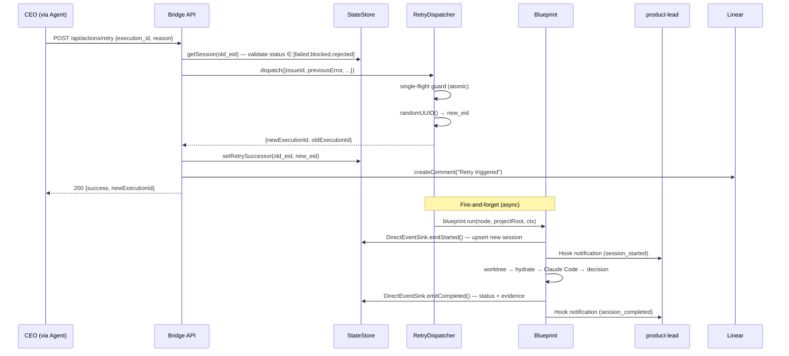

# Plan: Retry API 真正 Requeue 执行

**Version**: v1.3.0
**Issue**: GEO-168
**Date**: 2026-03-15
**Source**: `doc/engineer/exploration/new/GEO-168-retry-api-requeue.md`, `doc/engineer/research/new/GEO-168-retry-api-requeue.md`
**Status**: codex-approved (override after 2 rounds — Codex confused plan with implementation audit)
**Codex Review**: Round 1 feedback incorporated, Round 2 rejected (invalid: checked for code existence in a plan doc)

## Goal

让 `POST /api/actions/retry` 真正 requeue 一个 issue 的执行：创建新 execution、dispatch Blueprint、通知 agent+CEO、在 Linear 留 comment。旧 execution 保持 terminal 状态不变（审计完整）。

## Architecture Overview



## Composition Root（Codex R1 #1, #2, #3 修正）

**Entry point**: `scripts/run-bridge.ts` (NEW) — 新增专用 bridge daemon 脚本，替代当前 `packages/teamlead/src/index.ts`（后者继续作为无 retry 能力的最小入口）。

```typescript
// scripts/run-bridge.ts
import { loadConfig } from "../packages/teamlead/dist/config.js";
import { loadProjects } from "../packages/teamlead/dist/ProjectConfig.js";
import { StateStore } from "../packages/teamlead/dist/StateStore.js";
import { startBridge } from "../packages/teamlead/dist/bridge/plugin.js";
import { DirectEventSink } from "../packages/teamlead/dist/DirectEventSink.js";
import { setupRetryRuntime } from "./lib/retry-runtime.js";

async function main() {
  const config = loadConfig();
  const projects = loadProjects();

  // Phase 1: Create store (before bridge startup)
  const store = await StateStore.create(config.dbPath);

  // Phase 2: Build per-project retry runtime
  const retryDispatcher = await setupRetryRuntime(store, config, projects);

  // Phase 3: Start bridge with injected store + dispatcher
  const { close } = await startBridge(config, projects, { store, retryDispatcher });

  let shuttingDown = false;
  const shutdown = async () => {
    if (shuttingDown) return;
    shuttingDown = true;
    await close(); // drain() + teardown happens inside
    process.exit(0);
  };
  process.on("SIGINT", shutdown);
  process.on("SIGTERM", shutdown);
}
```

**setupRetryRuntime** (`scripts/lib/retry-runtime.ts` NEW) — 精简版的 blueprint 构建，专为 retry 场景：
- 不启动 SlackNotifier、SlackInteractionServer、ReactionsEngine（Codex R1 #2）
- 不需要 `TEAMLEAD_URL`/`TEAMLEAD_OWNS_SLACK` 约束
- 使用 `DirectEventSink` 替代 `TeamLeadClient`
- 每个 project 独立构建 Blueprint + 依赖
- 返回完整的 `RetryDispatcher` + 每个 project 的 cleanup handle

**Runtime lifecycle** (Codex R1 #3)：

```typescript
// startBridge close() path — 完整 teardown 顺序
const close = async () => {
  // 1. Stop accepting new retries
  retryDispatcher?.stopAccepting();
  // 2. Drain in-flight retries (60s timeout)
  if (retryDispatcher) {
    const result = await Promise.race([
      retryDispatcher.drain().then(() => "drained" as const),
      new Promise<"timeout">(r => setTimeout(() => r("timeout"), 60_000)),
    ]);
    if (result === "timeout") {
      for (const issueId of retryDispatcher.getInflightIssues()) {
        const session = store.getLatestSessionByIssueAndStatuses(issueId, ["running"]);
        if (session) {
          store.forceStatus(session.execution_id, "failed", sqliteDatetime(), "Bridge shutdown");
        }
      }
    }
  }
  // 3. Teardown per-project retry runtimes (hook servers, audit loggers)
  await retryDispatcher?.teardownRuntimes();
  // 4. Normal bridge cleanup
  heartbeatService?.stop();
  broadcaster.destroy();
  await new Promise<void>((resolve, reject) => {
    server.close((err) => (err ? reject(err) : resolve()));
  });
  store.close();
};
```

## Implementation Waves

### Wave 1: Schema + Interfaces (Low risk, additive)

**Goal**: 扩展数据模型和接口定义，不改变现有行为。

#### Task 1.1: StateStore schema migration

**File**: `packages/teamlead/src/StateStore.ts`

在 `migrate()` 方法中（~line 245 之后）新增：

```typescript
// GEO-168: retry lineage columns
try { this.db.run("ALTER TABLE sessions ADD COLUMN retry_predecessor TEXT"); } catch { }
try { this.db.run("ALTER TABLE sessions ADD COLUMN retry_successor TEXT"); } catch { }
```

#### Task 1.2: SessionUpsert + Session 接口扩展

**File**: `packages/teamlead/src/StateStore.ts`

两个接口各新增 `retry_predecessor?: string` 和 `retry_successor?: string`。

#### Task 1.3: setRetrySuccessor 方法

**File**: `packages/teamlead/src/StateStore.ts`

```typescript
setRetrySuccessor(executionId: string, successorId: string): void {
    this.db.run(
        "UPDATE sessions SET retry_successor = ? WHERE execution_id = ?",
        [successorId, executionId],
    );
    this.save();
}
```

#### Task 1.4: IRetryDispatcher 接口

**File**: `packages/teamlead/src/bridge/retry-dispatcher.ts` (NEW)

```typescript
export interface RetryRequest {
    oldExecutionId: string;
    issueId: string;
    issueIdentifier?: string;
    issueTitle?: string;
    projectName: string;
    reason?: string;
    previousError?: string;
    previousDecisionRoute?: string;
    previousReasoning?: string;
    runAttempt: number;
}

export interface RetryResult {
    newExecutionId: string;
    oldExecutionId: string;
}

export interface IRetryDispatcher {
    dispatch(req: RetryRequest): Promise<RetryResult>;
    getInflightIssues(): Set<string>;
    stopAccepting(): void;
    drain(): Promise<void>;
    /** Cleanup per-project runtimes (hook servers, audit loggers, etc.) */
    teardownRuntimes(): Promise<void>;
}
```

#### Task 1.5: EventEnvelope 扩展

**File**: `packages/edge-worker/src/ExecutionEventEmitter.ts`

```typescript
export interface EventEnvelope {
    executionId: string;
    issueId: string;
    projectName: string;
    issueIdentifier?: string;
    issueTitle?: string;
    retryPredecessor?: string;  // NEW
    runAttempt?: number;         // NEW
}
```

#### Task 1.6: BlueprintContext 扩展

**File**: `packages/edge-worker/src/Blueprint.ts`

```typescript
export interface BlueprintContext {
    // ... existing fields
    retryContext?: {
        predecessorExecutionId: string;  // 旧 execution ID（显式传递，不推断）
        previousError?: string;
        previousDecisionRoute?: string;
        previousReasoning?: string;
        attempt: number;
        reason?: string;
    };
}
```

**注意（Codex R1 #4 修正）**：`predecessorExecutionId` 显式放入 `retryContext`，不从 history 推断。

**Checkpoint**: `pnpm build` 通过，所有现有测试通过。

---

### Wave 2: FSM 语义变更 (Medium risk)

#### Task 2.1: WORKFLOW_TRANSITIONS 变更

**File**: `packages/core/src/workflow-fsm.ts`

```typescript
// 变更后
failed: ["shelved"],
blocked: ["deferred", "shelved"],
rejected: ["shelved"],
```

#### Task 2.2: ACTION_DEFINITIONS retry entry（Codex R1 #5 修正）

**File**: `packages/core/src/workflow-fsm.ts`

标记 retry 为 composite action，不再是简单 state transition：

```typescript
export interface ActionDefinition {
    action: string;
    fromStates: string[];
    targetState: string;
    composite?: boolean;  // NEW — action creates new execution, not transition
}

// ...
{
    action: "retry",
    fromStates: ["failed", "blocked", "rejected"],
    targetState: "running",
    composite: true,  // GEO-168: creates new execution, old stays terminal
},
```

#### Task 2.3: 更新 generic invariant 测试

**File**: `packages/core/src/__tests__/WorkflowFSM.test.ts`

- "all action transitions are allowed by FSM" 测试需要排除 `composite: true` 的 action
- 新增：`failed → running` / `blocked → running` / `rejected → running` 被 FSM 拒绝

**Checkpoint**: `pnpm build && pnpm test --filter=flywheel-core`

---

### Wave 3: DirectEventSink + RetryDispatcher (Medium risk)

#### Task 3.1: DirectEventSink

**File**: `packages/teamlead/src/DirectEventSink.ts` (NEW)

完整 `ExecutionEventEmitter` 实现：

- `emitStarted()`: upsert session + insertEvent + thread inheritance + notifyAgent
  - 设置 `retry_predecessor` 和 `run_attempt`（从 `EventEnvelope` 扩展字段）
- `emitCompleted()`: status mapping（aligned with `event-route.ts`） + insertEvent + notifyAgent
- `emitFailed()`: upsert session(failed) + insertEvent + notifyAgent
- `emitHeartbeat()`: `store.updateHeartbeat(executionId)`
- `flush()`: await all pending

**Hook notification 复用** `hook-payload.ts` 导出的 `notifyAgent()`, `buildSessionKey()`, `buildHookBody()`。

#### Task 3.2: setupRetryRuntime

**File**: `scripts/lib/retry-runtime.ts` (NEW)

精简版 blueprint 组装（不含 Slack/interaction server）：

```typescript
export async function setupRetryRuntime(
    store: StateStore,
    bridgeConfig: BridgeConfig,
    projects: ProjectEntry[],
): Promise<RetryDispatcher> {
    const projectRuntimes = new Map();
    const cleanupHandles: Array<() => Promise<void>> = [];

    for (const project of projects) {
        const directSink = new DirectEventSink(store, bridgeConfig);
        // setupComponents with retry-specific options:
        // - eventEmitterOverride = directSink
        // - skipSlack = true (no SlackNotifier/InteractionServer)
        // - skipTeamleadUrl check
        const components = await setupComponents({
            projectRoot: project.projectRoot,
            projectName: project.projectName,
            tmuxSessionName: project.projectName,
            fetchIssue: createLinearFetchIssue(),
            eventEmitterOverride: directSink,
            skipSlackLegacy: true,  // NEW flag
        });
        projectRuntimes.set(project.projectName, {
            blueprint: components.blueprint,
            projectRoot: project.projectRoot,
        });
        cleanupHandles.push(() => teardownComponents(components));
    }

    return new RetryDispatcher(projectRuntimes, cleanupHandles);
}
```

#### Task 3.3: setupComponents flags

**File**: `scripts/lib/setup.ts`

`SetupOptions` 新增：
```typescript
eventEmitterOverride?: ExecutionEventEmitter;
skipSlackLegacy?: boolean;  // skip SlackNotifier + InteractionServer + ReactionsEngine
```

在 `setupComponents()` 中：
- `eventEmitterOverride` → 替代 TeamLeadClient/NoOpEventEmitter
- `skipSlackLegacy` → 跳过 `TEAMLEAD_OWNS_SLACK`/`TEAMLEAD_URL` 约束、Slack 初始化

#### Task 3.4: RetryDispatcher 实现

**File**: `scripts/lib/retry-dispatcher.ts` (NEW)

```typescript
class RetryDispatcher implements IRetryDispatcher {
    private inflight = new Map<string, { executionId: string; promise: Promise<void> }>();
    private accepting = true;

    constructor(
        private blueprintsByProject: Map<string, { blueprint: Blueprint; projectRoot: string }>,
        private cleanupHandles: Array<() => Promise<void>>,
    ) {}

    async dispatch(req: RetryRequest): Promise<RetryResult> {
        if (!this.accepting) throw new Error("RetryDispatcher is shutting down");
        if (this.inflight.has(req.issueId)) {
            throw new Error(`Retry already in progress for issue ${req.issueId}`);
        }
        const runtime = this.blueprintsByProject.get(req.projectName);
        if (!runtime) throw new Error(`No runtime for project: ${req.projectName}`);

        const newExecutionId = randomUUID();
        const entry = { executionId: newExecutionId, promise: null! as Promise<void> };
        this.inflight.set(req.issueId, entry);

        const ctx: BlueprintContext = {
            teamName: "eng",
            runnerName: "claude",
            projectName: req.projectName,
            executionId: newExecutionId,
            retryContext: {
                predecessorExecutionId: req.oldExecutionId,
                previousError: req.previousError,
                previousDecisionRoute: req.previousDecisionRoute,
                previousReasoning: req.previousReasoning,
                attempt: req.runAttempt,
                reason: req.reason,
            },
        };

        entry.promise = runtime.blueprint
            .run({ id: req.issueId, blockedBy: [] }, runtime.projectRoot, ctx)
            .finally(() => this.inflight.delete(req.issueId));

        entry.promise.catch(err =>
            console.error(`[RetryDispatcher] ${newExecutionId} failed:`, err),
        );

        return { newExecutionId, oldExecutionId: req.oldExecutionId };
    }

    getInflightIssues(): Set<string> { return new Set(this.inflight.keys()); }
    stopAccepting(): void { this.accepting = false; }
    async drain(): Promise<void> {
        await Promise.allSettled([...this.inflight.values()].map(v => v.promise));
    }
    async teardownRuntimes(): Promise<void> {
        await Promise.allSettled(this.cleanupHandles.map(fn => fn()));
    }
}
```

**Checkpoint**: RetryDispatcher + DirectEventSink unit tests pass（mock Blueprint）。

---

### Wave 4: Bridge Wiring (High risk — integration)

#### Task 4.1: startBridge two-phase init

**File**: `packages/teamlead/src/bridge/plugin.ts`

`startBridge()` 新增可选 `opts` 参数。`close()` 包含完整 drain + teardown 顺序。

#### Task 4.2: createBridgeApp / createActionRouter / createQueryRouter 签名

**File**: `packages/teamlead/src/bridge/plugin.ts`

穿透 `retryDispatcher` 到 action router 和 query router。

#### Task 4.3: actions.ts retry handler 重写

**File**: `packages/teamlead/src/bridge/actions.ts`

retry case 从 `transitionSession()` 改为 composite action（eligibility check → dispatch → setRetrySuccessor → Linear comment → respond）。

#### Task 4.4: resolve-action retry eligibility

**File**: `packages/teamlead/src/bridge/tools.ts`

`createQueryRouter()` 接受 `retryDispatcher`。`/resolve-action` 追加 in-flight 和 active execution 检查。

#### Task 4.5: Dashboard retry eligibility + SSE wiring（Codex R1 #7 修正）

**File**: `packages/teamlead/src/bridge/dashboard-data.ts`

`buildDashboardPayload()` 新增 `inflightIssues?: Set<string>` 参数。`toDashboardSession()` 过滤 retry。

**File**: `packages/teamlead/src/bridge/plugin.ts`

`SseBroadcaster` 构造时接收 `retryDispatcher`（或 `getInflightIssues` callback）。在 polling interval 中传递给 `buildDashboardPayload()`，确保 SSE snapshot 和 REST API 的 retry eligibility 一致。

**Checkpoint**: Bridge 集成测试通过。

---

### Wave 5: Blueprint Prompt Injection (Low risk)

#### Task 5.1: retryContext → system prompt

**File**: `packages/edge-worker/src/Blueprint.ts`

在 `systemPromptLines.push("Do not ask questions...")` 之前插入：

```typescript
if (ctx.retryContext) {
    const rc = ctx.retryContext;
    systemPromptLines.push("");
    systemPromptLines.push(`## Retry Context (Attempt #${rc.attempt})`);
    systemPromptLines.push(
        `This is a retry of a previous execution that ${rc.previousDecisionRoute === "blocked" ? "was blocked" : "failed"}.`,
    );
    if (rc.previousError) systemPromptLines.push(`Previous error: ${rc.previousError}`);
    if (rc.previousReasoning) systemPromptLines.push(`Previous reasoning: ${rc.previousReasoning}`);
    if (rc.reason) systemPromptLines.push(`CEO instruction: ${rc.reason}`);
    systemPromptLines.push("Please address the issues from the previous attempt.");
}
```

#### Task 5.2: Blueprint.run() 传递 retryContext → EventEnvelope

```typescript
const env: EventEnvelope = {
    executionId,
    issueId: node.id,
    projectName: projectScope,
    retryPredecessor: ctx.retryContext?.predecessorExecutionId,
    runAttempt: ctx.retryContext?.attempt,
};
```

**Checkpoint**: Blueprint unit test 验证 prompt 注入。

---

### Wave 6: Linear Comment (Low risk)

**File**: `packages/teamlead/src/bridge/actions.ts`

```typescript
async function postRetryComment(issueId: string, attempt: number, reason?: string): Promise<void> {
    const accessToken = process.env.LINEAR_API_KEY;
    if (!accessToken) return;
    try {
        const { LinearClient } = await import("@linear/sdk");
        const client = new LinearClient({ accessToken });
        await client.createComment({
            issueId,
            body: `🔄 Retry triggered (attempt #${attempt})${reason ? `: ${reason}` : ""}`,
        });
    } catch (err) {
        console.warn(`[retry] Linear comment failed: ${err instanceof Error ? err.message : String(err)}`);
    }
}
```

**依赖**: `@linear/sdk` 加入 `packages/teamlead/package.json` dependencies。

**Checkpoint**: mock 测试。

---

### Wave 7: Tests（Codex R1 #6 修正 — 扩大范围）

#### Task 7.1: 重写 actions.test.ts retry 测试 (4 tests)

| 旧 | 新 |
|----|-----|
| `retry failed → running` | 无 dispatcher → 501 |
| `retry rejected → running` | 无 dispatcher → 501 |
| `retry blocked → running` | 无 dispatcher → 501 |
| `retry awaiting_review fails` | 不变 |

#### Task 7.2: 新增 retry dispatch 测试 (~6 tests)

Mock RetryDispatcher 测试 HTTP handler。

#### Task 7.3: RetryDispatcher unit tests (~5 tests)

#### Task 7.4: DirectEventSink unit tests (~5 tests)

#### Task 7.5: WorkflowFSM test updates

- `failed → running` 被拒绝
- generic "all actions valid in FSM" 排除 `composite: true`

#### Task 7.6: 额外受影响测试文件（Codex R1 #6 列出）

| File | 影响 | 变更 |
|------|------|------|
| `packages/teamlead/src/__tests__/dashboard.test.ts` | retry button visibility | 验证 inflight 时 retry 被过滤 |
| `packages/teamlead/src/__tests__/fsm-e2e.test.ts` | FSM transition assertions | `failed → running` 变为被拒绝 |
| `packages/teamlead/src/__tests__/applyTransition.test.ts` | transition assertions | retry 不再走 applyTransition |
| `packages/teamlead/src/__tests__/transition-audit.test.ts` | audit assertions | retry 不生成旧 execution 的 audit |

#### Task 7.7: Blueprint prompt test

验证 retryContext → "Retry Context" block in system prompt。

**Checkpoint**: `pnpm test -r` 全部通过。

## File Changes Summary

| File | Change | Wave |
|------|--------|------|
| `packages/teamlead/src/StateStore.ts` | migration + types + setRetrySuccessor | 1 |
| `packages/teamlead/src/bridge/retry-dispatcher.ts` | NEW — IRetryDispatcher interface | 1 |
| `packages/edge-worker/src/ExecutionEventEmitter.ts` | EventEnvelope extension | 1 |
| `packages/edge-worker/src/Blueprint.ts` | BlueprintContext + prompt injection | 1, 5 |
| `packages/core/src/workflow-fsm.ts` | FSM + ActionDefinition.composite | 2 |
| `packages/teamlead/src/DirectEventSink.ts` | NEW — bridge-local event emitter | 3 |
| `scripts/lib/setup.ts` | eventEmitterOverride + skipSlackLegacy | 3 |
| `scripts/lib/retry-runtime.ts` | NEW — retry runtime builder | 3 |
| `scripts/lib/retry-dispatcher.ts` | NEW — RetryDispatcher implementation | 3 |
| `scripts/run-bridge.ts` | NEW — bridge daemon with retry | 3 |
| `packages/teamlead/src/bridge/actions.ts` | Retry handler rewrite + postRetryComment | 4, 6 |
| `packages/teamlead/src/bridge/plugin.ts` | Two-phase init + drain + SSE wiring | 4 |
| `packages/teamlead/src/bridge/tools.ts` | resolve-action eligibility | 4 |
| `packages/teamlead/src/bridge/dashboard-data.ts` | retry eligibility filter | 4 |
| `packages/teamlead/package.json` | Add @linear/sdk | 6 |
| Tests (7 files) | Rewrite + new (~25 tests) | 7 |

## Test Plan

- [ ] Wave 1: `pnpm build` passes
- [ ] Wave 2: `pnpm test --filter=flywheel-core` — FSM + composite flag
- [ ] Wave 3: RetryDispatcher + DirectEventSink unit tests
- [ ] Wave 4: Bridge integration tests (retry handler, resolve-action, dashboard, SSE)
- [ ] Wave 5: Blueprint prompt injection test
- [ ] Wave 7: Full `pnpm test -r` green
- [ ] E2E: Manual — trigger retry via Bridge API, verify full pipeline

## Rollback Plan

1. Revert FSM → `failed/blocked/rejected` 恢复 `→ running`
2. Retry handler → 回退到 `transitionSession()` (old no-op)
3. Schema migration = additive (新列不影响旧代码)
4. `startBridge()` opts = optional → 不传 = 旧行为
5. `scripts/run-bridge.ts` 不影响 `packages/teamlead/src/index.ts`
